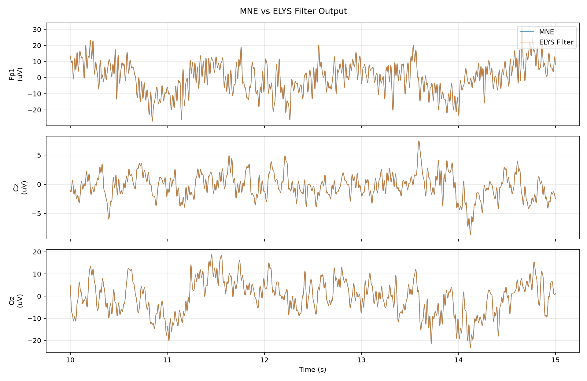
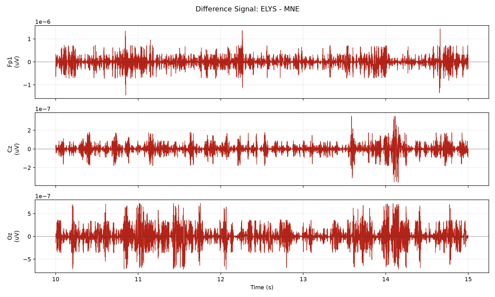

# sub-009 0.5-40Hz Filter 节点一致性测试

## 测试设置

- 原始输入: `sub-009_ses-a_task-sensory_run-04_eeg.fif`
- 服务器 Filter 输出: `sub-009_ses-a_task-sensory_run-04_Filter_0p5_40Hz-raw.fif`
- 服务器节点: ELYS `eeg/filter/apply`, `filter_type=bandpass`, `method=fir`, `phase=zero`
- 本地 MNE 标准: `mne.io.read_raw_fif(...).filter(l_freq=0.5, h_freq=40.0, method='fir', phase='zero', fir_design='firwin')`
- 对比范围: 64 通道 x 310420 采样点, 310.42 s @ 1000.0 Hz

## 差异汇总

| 指标 | 数值 | 单位 |
| --- | ---: | --- |
| MNE 信号标准差 | 38.2882 | uV |
| 差值均值 | 1.37687e-10 | uV |
| 差值标准差 | 8.62923e-07 | uV |
| 差值 RMSE | 8.62923e-07 | uV |
| 差值最大绝对值 | 9.2348e-05 | uV |
| 差值标准差 / MNE 标准差 | 2.25376e-08 | ratio |
| 相对 L2 误差 | 2.2537e-08 | ratio |

## 通道指标

按 RMSE 从大到小列出前 10 个通道。

| 通道 | MNE 标准差 (uV) | 差值标准差 (uV) | RMSE (uV) | 最大绝对差值 (uV) | 差值标准差 / MNE 标准差 | 相关系数 |
| --- | ---: | ---: | ---: | ---: | ---: | ---: |
| Fp1 | 118.872 | 2.74886e-06 | 2.74886e-06 | 9.01922e-05 | 2.31244e-08 | 1.000000000 |
| Fp2 | 107.976 | 2.52659e-06 | 2.52661e-06 | 4.65624e-05 | 2.33995e-08 | 1.000000000 |
| Fpz | 90.0685 | 2.13192e-06 | 2.13193e-06 | 4.65233e-05 | 2.367e-08 | 1.000000000 |
| AF4 | 81.2309 | 1.95475e-06 | 1.95475e-06 | 9.12634e-05 | 2.40642e-08 | 1.000000000 |
| F8 | 82.6591 | 1.94661e-06 | 1.94661e-06 | 9.06563e-05 | 2.35499e-08 | 1.000000000 |
| AF3 | 82.0667 | 1.9458e-06 | 1.9458e-06 | 8.70772e-05 | 2.37099e-08 | 1.000000000 |
| AF8 | 83.4025 | 1.9067e-06 | 1.9067e-06 | 6.95577e-05 | 2.28614e-08 | 1.000000000 |
| AF7 | 83.4041 | 1.90603e-06 | 1.90603e-06 | 9.2348e-05 | 2.28529e-08 | 1.000000000 |
| F7 | 79.3043 | 1.8689e-06 | 1.8689e-06 | 4.65583e-05 | 2.35662e-08 | 1.000000000 |
| FT9 | 61.8102 | 1.60103e-06 | 1.60103e-06 | 9.22302e-05 | 2.59023e-08 | 1.000000000 |

## 图

## 说明

- 所有指标都基于完整对齐后的信号计算。
- 为了便于观察，图中只显示从 10 s 开始的 5 s 片段。
