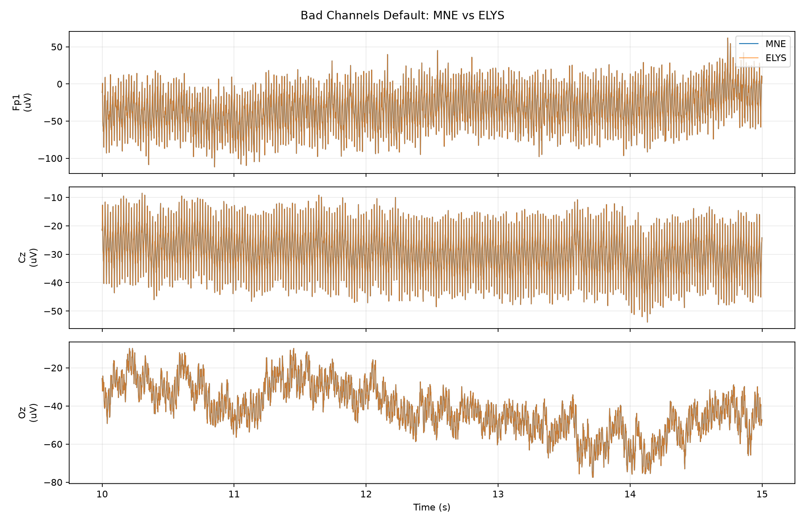
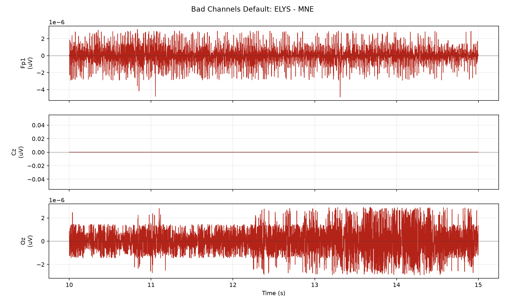

# Bad Channels Default 节点一致性测试

## 测试设置

- 原始输入: `sub-009_ses-a_task-sensory_run-04_eeg.fif`
- 服务器输出: `sub-009_ses-a_task-sensory_run-04_bad_channels_default-raw.fif`
- 本地 MNE 标准: `mne.preprocessing.find_bad_channels_lof(..., threshold=1.5, n_neighbors=20)` + `raw.interpolate_bads(reset_bads=True)`
- 对比范围: 64 通道 x 310420 采样点, 310.42 s
- 采样率: MNE 1000.000 Hz, ELYS 1000.000 Hz

## 差异汇总

| 指标 | 数值 | 单位 |
| --- | ---: | --- |
| MNE 信号标准差 | 32.0361 | uV |
| 差值均值 | -9.34156e-11 | uV |
| 差值标准差 | 4.91845e-07 | uV |
| 差值 RMSE | 4.91845e-07 | uV |
| 差值最大绝对值 | 2.25686e-05 | uV |
| 差值标准差 / MNE 标准差 | 1.53528e-08 | ratio |
| 相对 L2 误差 | 1.50326e-08 | ratio |

## 通道指标

按 RMSE 从大到小列出前 10 个通道。

| 通道 | MNE 标准差 (uV) | 差值标准差 (uV) | RMSE (uV) | 最大绝对差值 (uV) | 差值标准差 / MNE 标准差 | 相关系数 |
| --- | ---: | ---: | ---: | ---: | ---: | ---: |
| FT9 | 47.8287 | 1.24112e-06 | 1.24112e-06 | 2.25686e-05 | 2.59492e-08 | 1.000000000 |
| Fpz | 46.5042 | 1.17676e-06 | 1.17676e-06 | 1.16394e-05 | 2.53043e-08 | 1.000000000 |
| Fp2 | 45.5608 | 1.15425e-06 | 1.15425e-06 | 1.3127e-05 | 2.53343e-08 | 1.000000000 |
| Fp1 | 44.8334 | 1.12645e-06 | 1.12645e-06 | 1.16382e-05 | 2.51252e-08 | 1.000000000 |
| AF8 | 42.3489 | 1.09561e-06 | 1.09562e-06 | 1.69903e-05 | 2.58711e-08 | 1.000000000 |
| AF7 | 40.6495 | 1.05063e-06 | 1.05064e-06 | 1.16329e-05 | 2.58462e-08 | 1.000000000 |
| F8 | 35.6493 | 9.23606e-07 | 9.23606e-07 | 1.16422e-05 | 2.59081e-08 | 1.000000000 |
| F7 | 33.9036 | 8.81341e-07 | 8.81343e-07 | 1.13458e-05 | 2.59955e-08 | 1.000000000 |
| AF4 | 31.8419 | 8.51736e-07 | 8.51742e-07 | 1.16194e-05 | 2.67489e-08 | 1.000000000 |
| F6 | 31.6672 | 8.38079e-07 | 8.38081e-07 | 1.16145e-05 | 2.64652e-08 | 1.000000000 |

## 坐标/元信息

| 指标 | 数值 | 单位 |
| --- | ---: | --- |
| MNE dig 点数 | 66 | count |
| ELYS dig 点数 | 66 | count |
| 可比较坐标通道数 | 63 | count |
| 坐标最大差异 | 0 | m |
| 坐标 RMSE | 0 | m |

## 节点参数/默认值

```json
{
  "method": "lof",
  "threshold": 1.5,
  "n_neighbors": 20,
  "preexisting_bads": [],
  "detected_bads": [
    "Fp1",
    "Fp2",
    "F3",
    "F4",
    "F7",
    "F8",
    "T7",
    "FT9",
    "AF3",
    "AF4",
    "PO3",
    "F5",
    "F6",
    "C5",
    "AF7",
    "AF8",
    "FT7",
    "TP8",
    "Fpz",
    "Oz"
  ],
  "bads": [
    "Fp1",
    "Fp2",
    "F3",
    "F4",
    "F7",
    "F8",
    "T7",
    "FT9",
    "AF3",
    "AF4",
    "PO3",
    "F5",
    "F6",
    "C5",
    "AF7",
    "AF8",
    "FT7",
    "TP8",
    "Fpz",
    "Oz"
  ],
  "action": "interpolate",
  "interpolated": true,
  "reset_bads": true
}
```

## 图





## 说明

- 所有指标都基于完整对齐后的信号计算。
- 为了便于观察，图中只显示从 10 s 开始的 5 s 片段；采样不足 15 s 时从 0 s 开始。
