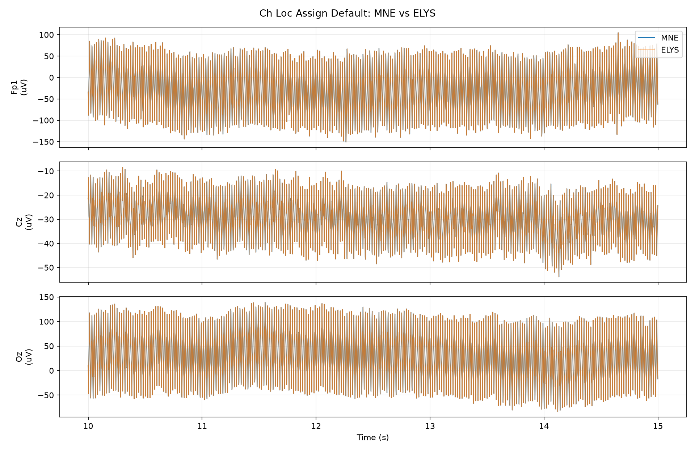
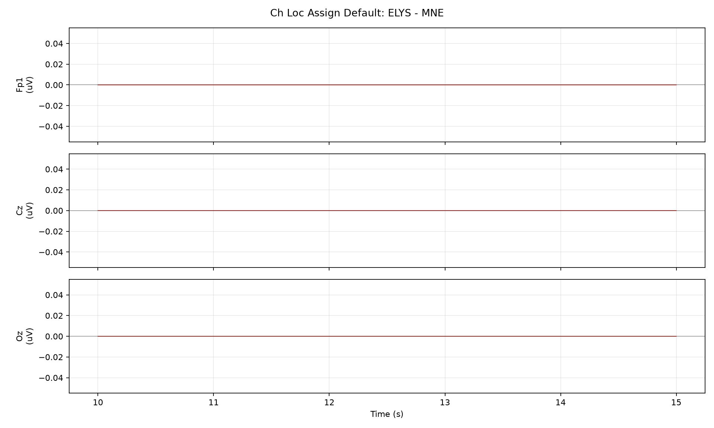

# Ch Loc Assign Default 节点一致性测试

## 测试设置

- 原始输入: `sub-009_ses-a_task-sensory_run-04_eeg.fif`
- 服务器输出: `sub-009_ses-a_task-sensory_run-04_chloc_default-raw.fif`
- 本地 MNE 标准: `mne.channels.make_standard_montage(...)` + `raw.set_montage(...)`, using the same auto selection as the node
- 对比范围: 64 通道 x 310420 采样点, 310.42 s
- 采样率: MNE 1000.000 Hz, ELYS 1000.000 Hz

## 差异汇总

| 指标 | 数值 | 单位 |
| --- | ---: | --- |
| MNE 信号标准差 | 247.245 | uV |
| 差值均值 | 0 | uV |
| 差值标准差 | 0 | uV |
| 差值 RMSE | 0 | uV |
| 差值最大绝对值 | 0 | uV |
| 差值标准差 / MNE 标准差 | 0 | ratio |
| 相对 L2 误差 | 0 | ratio |

## 通道指标

按 RMSE 从大到小列出前 10 个通道。

| 通道 | MNE 标准差 (uV) | 差值标准差 (uV) | RMSE (uV) | 最大绝对差值 (uV) | 差值标准差 / MNE 标准差 | 相关系数 |
| --- | ---: | ---: | ---: | ---: | ---: | ---: |
| Fp1 | 705.581 | 0 | 0 | 0 | 0 | 1.000000000 |
| Fp2 | 586.725 | 0 | 0 | 0 | 0 | 1.000000000 |
| F3 | 170.49 | 0 | 0 | 0 | 0 | 1.000000000 |
| F4 | 213.534 | 0 | 0 | 0 | 0 | 1.000000000 |
| C3 | 15.7944 | 0 | 0 | 0 | 0 | 1.000000000 |
| C4 | 32.841 | 0 | 0 | 0 | 0 | 1.000000000 |
| P3 | 25.3828 | 0 | 0 | 0 | 0 | 1.000000000 |
| P4 | 24.7058 | 0 | 0 | 0 | 0 | 1.000000000 |
| O1 | 26.9081 | 0 | 0 | 0 | 0 | 1.000000000 |
| O2 | 27.1868 | 0 | 0 | 0 | 0 | 1.000000000 |

## 坐标/元信息

| 指标 | 数值 | 单位 |
| --- | ---: | --- |
| MNE dig 点数 | 66 | count |
| ELYS dig 点数 | 66 | count |
| 可比较坐标通道数 | 63 | count |
| 坐标最大差异 | 4.94852e-09 | m |
| 坐标 RMSE | 2.87347e-09 | m |

## 节点参数/默认值

```json
{
  "auto_strategy": "family_scoring",
  "auto_family": "standard",
  "auto_matched": 63,
  "auto_match_ratio": 1.0,
  "montage_source": "auto",
  "montage_resolved": "easycap-M1",
  "renamed_channels": {},
  "on_missing": "ignore"
}
```

## 图





## 说明

- 所有指标都基于完整对齐后的信号计算。
- 为了便于观察，图中只显示从 10 s 开始的 5 s 片段；采样不足 15 s 时从 0 s 开始。
