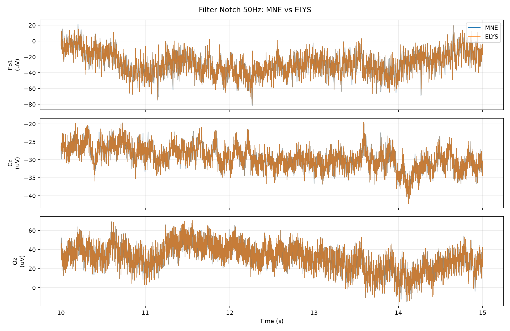
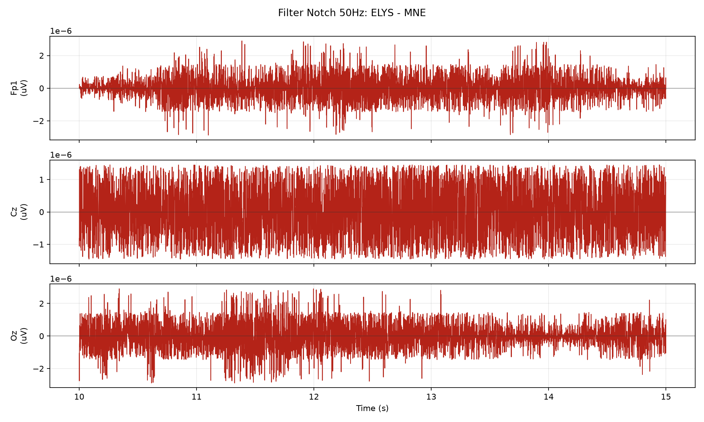

# Filter Notch 50Hz 节点一致性测试

## 测试设置

- 原始输入: `sub-009_ses-a_task-sensory_run-04_eeg.fif`
- 服务器输出: `sub-009_ses-a_task-sensory_run-04_notch_50Hz-raw.fif`
- 本地 MNE 标准: `raw.notch_filter(freqs=[50, 100, 150], method='spectrum_fit')`
- 对比范围: 64 通道 x 310420 采样点, 310.42 s
- 采样率: MNE 1000.000 Hz, ELYS 1000.000 Hz

## 差异汇总

| 指标 | 数值 | 单位 |
| --- | ---: | --- |
| MNE 信号标准差 | 246.172 | uV |
| 差值均值 | 1.13291e-09 | uV |
| 差值标准差 | 7.34672e-06 | uV |
| 差值 RMSE | 7.34672e-06 | uV |
| 差值最大绝对值 | 0.000186264 | uV |
| 差值标准差 / MNE 标准差 | 2.98439e-08 | ratio |
| 相对 L2 误差 | 2.98377e-08 | ratio |

## 通道指标

按 RMSE 从大到小列出前 10 个通道。

| 通道 | MNE 标准差 (uV) | 差值标准差 (uV) | RMSE (uV) | 最大绝对差值 (uV) | 差值标准差 / MNE 标准差 | 相关系数 |
| --- | ---: | ---: | ---: | ---: | ---: | ---: |
| AF4 | 779.899 | 2.34356e-05 | 2.34357e-05 | 0.00018626 | 3.00495e-08 | 1.000000000 |
| Fp1 | 703.641 | 2.15199e-05 | 2.15199e-05 | 0.000186235 | 3.05836e-08 | 1.000000000 |
| AF3 | 663.423 | 2.0045e-05 | 2.00452e-05 | 0.000186206 | 3.02146e-08 | 1.000000000 |
| AF8 | 624.141 | 1.9391e-05 | 1.93911e-05 | 0.000186243 | 3.10683e-08 | 1.000000000 |
| Fp2 | 586.17 | 1.82901e-05 | 1.82901e-05 | 0.000186262 | 3.12027e-08 | 1.000000000 |
| AF7 | 610.904 | 1.82889e-05 | 1.82889e-05 | 0.000186256 | 2.99375e-08 | 1.000000000 |
| F7 | 592.892 | 1.82883e-05 | 1.82883e-05 | 0.000186264 | 3.08459e-08 | 1.000000000 |
| Fpz | 596.966 | 1.79353e-05 | 1.79354e-05 | 0.00018622 | 3.00441e-08 | 1.000000000 |
| F8 | 529.499 | 1.47525e-05 | 1.47526e-05 | 0.000186206 | 2.78613e-08 | 1.000000000 |
| F4 | 212.557 | 5.28399e-06 | 5.28399e-06 | 9.05759e-05 | 2.48591e-08 | 1.000000000 |

## 坐标/元信息

| 指标 | 数值 | 单位 |
| --- | ---: | --- |
| MNE dig 点数 | 66 | count |
| ELYS dig 点数 | 66 | count |
| 可比较坐标通道数 | 63 | count |
| 坐标最大差异 | 0 | m |
| 坐标 RMSE | 0 | m |

## 节点参数/默认值

```json
{
  "notch_freq": 50.0,
  "notch_harmonics": 3,
  "freqs": [
    50.0,
    100.0,
    150.0
  ],
  "method": "spectrum_fit"
}
```

## 图





## 说明

- 所有指标都基于完整对齐后的信号计算。
- 为了便于观察，图中只显示从 10 s 开始的 5 s 片段；采样不足 15 s 时从 0 s 开始。
