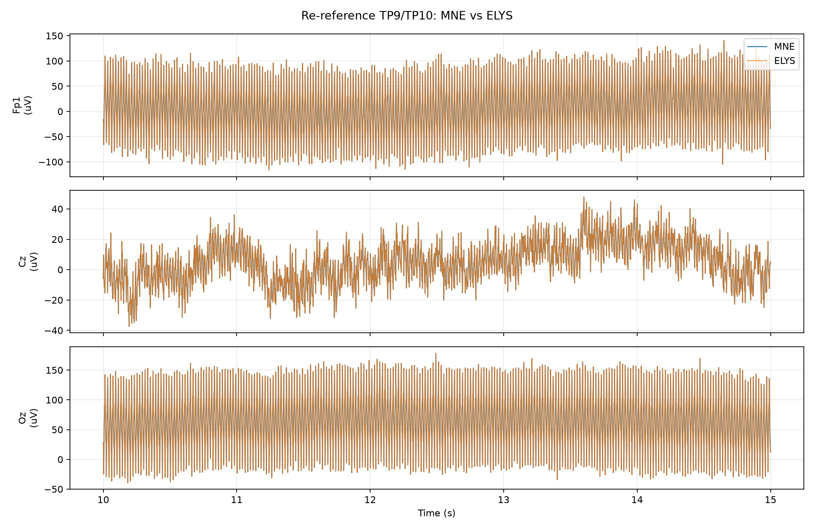
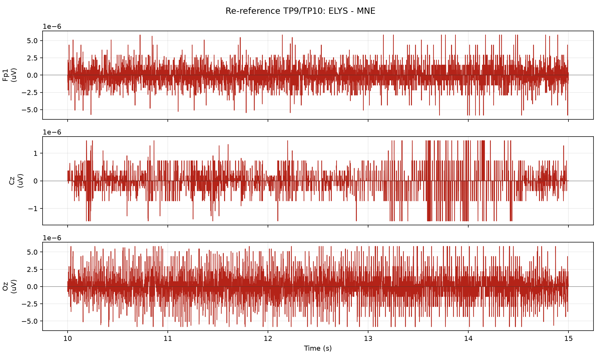

# Re-reference TP9/TP10 节点一致性测试

## 测试设置

- 原始输入: `sub-009_ses-a_task-sensory_run-04_eeg.fif`
- 服务器输出: `sub-009_ses-a_task-sensory_run-04_reref_TP9_TP10-raw.fif`
- 本地 MNE 标准: `raw.set_eeg_reference(ref_channels=['TP9', 'TP10'], projection=False)`
- 对比范围: 64 通道 x 310420 采样点, 310.42 s
- 采样率: MNE 1000.000 Hz, ELYS 1000.000 Hz

## 差异汇总

| 指标 | 数值 | 单位 |
| --- | ---: | --- |
| MNE 信号标准差 | 251.191 | uV |
| 差值均值 | 4.42498e-09 | uV |
| 差值标准差 | 7.41646e-06 | uV |
| 差值 RMSE | 7.41646e-06 | uV |
| 差值最大绝对值 | 0.000186265 | uV |
| 差值标准差 / MNE 标准差 | 2.95252e-08 | ratio |
| 相对 L2 误差 | 2.9479e-08 | ratio |

## 通道指标

按 RMSE 从大到小列出前 10 个通道。

| 通道 | MNE 标准差 (uV) | 差值标准差 (uV) | RMSE (uV) | 最大绝对差值 (uV) | 差值标准差 / MNE 标准差 | 相关系数 |
| --- | ---: | ---: | ---: | ---: | ---: | ---: |
| AF4 | 789.541 | 2.35043e-05 | 2.35044e-05 | 0.000186265 | 2.97696e-08 | 1.000000000 |
| Fp1 | 715.781 | 2.16872e-05 | 2.16873e-05 | 0.000186265 | 3.02987e-08 | 1.000000000 |
| AF3 | 674.816 | 2.01272e-05 | 2.01272e-05 | 0.000186265 | 2.98262e-08 | 1.000000000 |
| AF8 | 635.262 | 1.93589e-05 | 1.93589e-05 | 0.000186265 | 3.04738e-08 | 1.000000000 |
| Fp2 | 596.187 | 1.87789e-05 | 1.87789e-05 | 0.000186265 | 3.14984e-08 | 1.000000000 |
| AF7 | 623.002 | 1.83354e-05 | 1.83354e-05 | 0.000186265 | 2.94308e-08 | 1.000000000 |
| F7 | 600.599 | 1.82474e-05 | 1.82475e-05 | 0.000186265 | 3.0382e-08 | 1.000000000 |
| Fpz | 609.479 | 1.81194e-05 | 1.81194e-05 | 0.000186265 | 2.97293e-08 | 1.000000000 |
| F8 | 536.538 | 1.47459e-05 | 1.47459e-05 | 0.000186265 | 2.74834e-08 | 1.000000000 |
| F4 | 222.701 | 5.5405e-06 | 5.5405e-06 | 9.31323e-05 | 2.48787e-08 | 1.000000000 |

## 坐标/元信息

| 指标 | 数值 | 单位 |
| --- | ---: | --- |
| MNE dig 点数 | 66 | count |
| ELYS dig 点数 | 66 | count |
| 可比较坐标通道数 | 63 | count |
| 坐标最大差异 | 0 | m |
| 坐标 RMSE | 0 | m |

## 节点参数/默认值

```json
{
  "ref_channels": [
    "TP9",
    "TP10"
  ],
  "ref_used": [
    "TP9",
    "TP10"
  ]
}
```

## 图





## 说明

- 所有指标都基于完整对齐后的信号计算。
- 为了便于观察，图中只显示从 10 s 开始的 5 s 片段；采样不足 15 s 时从 0 s 开始。
