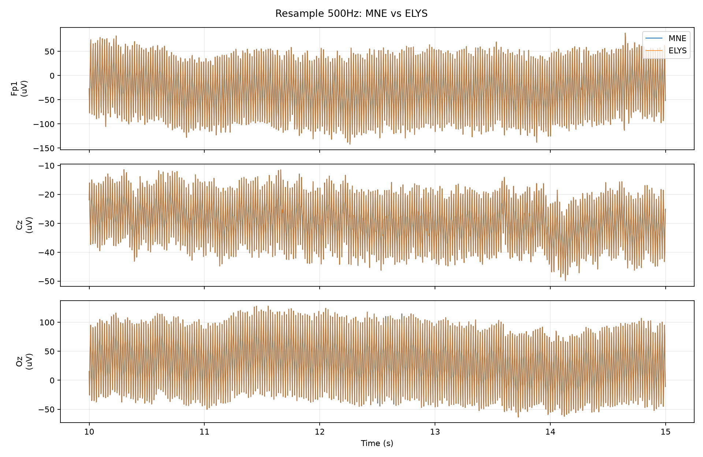
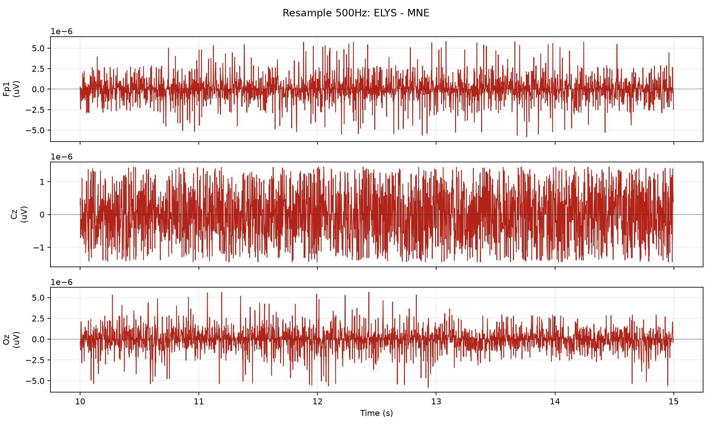

# Resample 500Hz 节点一致性测试

## 测试设置

- 原始输入: `sub-009_ses-a_task-sensory_run-04_eeg.fif`
- 服务器输出: `sub-009_ses-a_task-sensory_run-04_resample_500Hz-raw.fif`
- 本地 MNE 标准: `raw.resample(sfreq=500, npad='auto')`
- 对比范围: 64 通道 x 155210 采样点, 310.42 s
- 采样率: MNE 500.000 Hz, ELYS 500.000 Hz

## 差异汇总

| 指标 | 数值 | 单位 |
| --- | ---: | --- |
| MNE 信号标准差 | 247.233 | uV |
| 差值均值 | 1.28679e-09 | uV |
| 差值标准差 | 7.38972e-06 | uV |
| 差值 RMSE | 7.38972e-06 | uV |
| 差值最大绝对值 | 0.000186262 | uV |
| 差值标准差 / MNE 标准差 | 2.98897e-08 | ratio |
| 相对 L2 误差 | 2.98835e-08 | ratio |

## 通道指标

按 RMSE 从大到小列出前 10 个通道。

| 通道 | MNE 标准差 (uV) | 差值标准差 (uV) | RMSE (uV) | 最大绝对差值 (uV) | 差值标准差 / MNE 标准差 | 相关系数 |
| --- | ---: | ---: | ---: | ---: | ---: | ---: |
| AF4 | 781.631 | 2.35667e-05 | 2.35667e-05 | 0.00018616 | 3.01506e-08 | 1.000000000 |
| Fp1 | 705.568 | 2.17221e-05 | 2.17222e-05 | 0.000186259 | 3.07867e-08 | 1.000000000 |
| AF3 | 667.087 | 2.01989e-05 | 2.01989e-05 | 0.000186026 | 3.02792e-08 | 1.000000000 |
| AF8 | 625.358 | 1.94028e-05 | 1.94031e-05 | 0.000186232 | 3.10267e-08 | 1.000000000 |
| Fp2 | 586.719 | 1.84487e-05 | 1.84487e-05 | 0.000186255 | 3.14439e-08 | 1.000000000 |
| F7 | 593.213 | 1.83088e-05 | 1.83088e-05 | 0.000186229 | 3.08637e-08 | 1.000000000 |
| AF7 | 612.631 | 1.81642e-05 | 1.81642e-05 | 0.0001862 | 2.96495e-08 | 1.000000000 |
| Fpz | 599.082 | 1.80882e-05 | 1.80882e-05 | 0.000186262 | 3.01932e-08 | 1.000000000 |
| F8 | 530.155 | 1.45746e-05 | 1.45746e-05 | 0.000186196 | 2.74911e-08 | 1.000000000 |
| F4 | 213.526 | 5.34245e-06 | 5.34245e-06 | 9.06068e-05 | 2.50202e-08 | 1.000000000 |

## 坐标/元信息

| 指标 | 数值 | 单位 |
| --- | ---: | --- |
| MNE dig 点数 | 66 | count |
| ELYS dig 点数 | 66 | count |
| 可比较坐标通道数 | 63 | count |
| 坐标最大差异 | 0 | m |
| 坐标 RMSE | 0 | m |

## 节点参数/默认值

```json
{
  "sfreq": 500,
  "npad": "auto"
}
```

## 图





## 说明

- 所有指标都基于完整对齐后的信号计算。
- 为了便于观察，图中只显示从 10 s 开始的 5 s 片段；采样不足 15 s 时从 0 s 开始。
