# test ICA 流水线一致性测试报告

## 测试对象

- 远端流水线: `test ICA`
- Pipeline ID: `9`
- Execution ID: `822cca8b-3f07-45da-b956-289a5886f54c`
- Pipeline version: `2`
- 生成时间: `2026-07-03 16:42:23`

## 本地 MNE 复现流程

- Resample: `sfreq=250`
- Notch: `notch_freq=50`, `harmonics=3`, `method=spectrum_fit`；250 Hz 数据实际去除 50 Hz 与 100 Hz。
- Bandpass: `l_freq=0.1`, `h_freq=40`, `method=fir`, `phase=zero`。
- Compute ICA: `method=fastica`, `n_components=40`, `random_state=42`, `fit_highpass=1`, `max_iter='auto'`。
- Apply ICA: 按远端交互决策剔除成分，当前记录为 `{'sub-009': [0, 1, 2, 3, 4, 5, 6, 7, 12, 13, 15], 'sub-007': [0, 1], 'sub-008': [0, 11]}`。

说明: ICA 地形图比较时对本地成分做了符号对齐，因为 ICA 成分整体正负号翻转不改变分解含义；清洗信号比较使用未人为改动符号的 MNE ICA 对象直接 apply。

## 总览指标

| Subject | 预处理差异SD (uV) | 预处理相对L2 | 同编号topomap平均|r| | 同编号最小|r| | 最佳匹配平均|r| | Apply重放差异SD (uV) | 完整本地清洗差异SD (uV) | 清洗差异/信号SD | 结论 |
| --- | ---: | ---: | ---: | ---: | ---: | ---: | ---: | ---: | --- |
| sub-007 | 1.11667e-06 | 4.82541e-08 | 1.000000 | 1.000000 | 1.000000 | 4.6357e-07 | 4.27551e-05 | 2.20644e-06 | 一致 |
| sub-008 | 9.43747e-07 | 4.43261e-08 | 1.000000 | 1.000000 | 1.000000 | 5.09881e-07 | 3.23164e-05 | 1.54594e-06 | 一致 |
| sub-009 | 6.42737e-06 | 6.90106e-08 | 1.000000 | 1.000000 | 1.000000 | 7.07295e-07 | 3.43206e-05 | 1.1374e-06 | 一致 |

## 各被试成分与图

### sub-007

- 剔除成分: `[0, 1]`
- 同编号成分平均 |r|: `1.000000`；最小 |r|: `1.000000`；符号翻转数: `0`。
- 最佳匹配平均 |r|: `1.000000`；如果它明显高于同编号结果，说明主要差异可能是 ICA 成分顺序变化。

| IC | 同编号 r | 同编号 |r| | 符号 | 最佳本地IC | 最佳 |r| | 地形图RMSE |
| ---: | ---: | ---: | ---: | ---: | ---: | ---: |
| IC000 | 1.000000 | 1.000000 | 1 | IC000 | 1.000000 | 1.23549e-07 |
| IC001 | 1.000000 | 1.000000 | 1 | IC001 | 1.000000 | 1.20463e-07 |
| IC002 | 1.000000 | 1.000000 | 1 | IC002 | 1.000000 | 7.27002e-07 |
| IC003 | 1.000000 | 1.000000 | 1 | IC003 | 1.000000 | 7.25198e-07 |
| IC004 | 1.000000 | 1.000000 | 1 | IC004 | 1.000000 | 1.69562e-07 |
| IC005 | 1.000000 | 1.000000 | 1 | IC005 | 1.000000 | 3.64041e-07 |
| IC006 | 1.000000 | 1.000000 | 1 | IC006 | 1.000000 | 1.66393e-07 |
| IC007 | 1.000000 | 1.000000 | 1 | IC007 | 1.000000 | 6.78006e-07 |
| IC008 | 1.000000 | 1.000000 | 1 | IC008 | 1.000000 | 8.43902e-07 |
| IC009 | 1.000000 | 1.000000 | 1 | IC009 | 1.000000 | 1.83067e-06 |
| IC010 | 1.000000 | 1.000000 | 1 | IC010 | 1.000000 | 5.56675e-07 |
| IC011 | 1.000000 | 1.000000 | 1 | IC011 | 1.000000 | 8.27917e-07 |
| IC012 | 1.000000 | 1.000000 | 1 | IC012 | 1.000000 | 3.47301e-07 |
| IC013 | 1.000000 | 1.000000 | 1 | IC013 | 1.000000 | 2.44937e-06 |
| IC014 | 1.000000 | 1.000000 | 1 | IC014 | 1.000000 | 1.0821e-06 |
| IC015 | 1.000000 | 1.000000 | 1 | IC015 | 1.000000 | 8.76203e-07 |
| IC016 | 1.000000 | 1.000000 | 1 | IC016 | 1.000000 | 1.68122e-06 |
| IC017 | 1.000000 | 1.000000 | 1 | IC017 | 1.000000 | 1.63823e-06 |
| IC018 | 1.000000 | 1.000000 | 1 | IC018 | 1.000000 | 2.11174e-07 |
| IC019 | 1.000000 | 1.000000 | 1 | IC019 | 1.000000 | 2.69262e-07 |
| IC020 | 1.000000 | 1.000000 | 1 | IC020 | 1.000000 | 1.15392e-06 |
| IC021 | 1.000000 | 1.000000 | 1 | IC021 | 1.000000 | 1.22624e-06 |
| IC022 | 1.000000 | 1.000000 | 1 | IC022 | 1.000000 | 3.09067e-06 |
| IC023 | 1.000000 | 1.000000 | 1 | IC023 | 1.000000 | 3.46597e-06 |
| IC024 | 1.000000 | 1.000000 | 1 | IC024 | 1.000000 | 3.82648e-07 |
| IC025 | 1.000000 | 1.000000 | 1 | IC025 | 1.000000 | 4.42641e-07 |
| IC026 | 1.000000 | 1.000000 | 1 | IC026 | 1.000000 | 2.16635e-06 |
| IC027 | 1.000000 | 1.000000 | 1 | IC027 | 1.000000 | 1.18037e-06 |
| IC028 | 1.000000 | 1.000000 | 1 | IC028 | 1.000000 | 4.20165e-07 |
| IC029 | 1.000000 | 1.000000 | 1 | IC029 | 1.000000 | 1.08399e-07 |
| IC030 | 1.000000 | 1.000000 | 1 | IC030 | 1.000000 | 3.29063e-07 |
| IC031 | 1.000000 | 1.000000 | 1 | IC031 | 1.000000 | 6.01652e-07 |
| IC032 | 1.000000 | 1.000000 | 1 | IC032 | 1.000000 | 7.92011e-07 |
| IC033 | 1.000000 | 1.000000 | 1 | IC033 | 1.000000 | 7.38057e-07 |
| IC034 | 1.000000 | 1.000000 | 1 | IC034 | 1.000000 | 9.87596e-07 |
| IC035 | 1.000000 | 1.000000 | 1 | IC035 | 1.000000 | 3.771e-07 |
| IC036 | 1.000000 | 1.000000 | 1 | IC036 | 1.000000 | 2.39344e-07 |
| IC037 | 1.000000 | 1.000000 | 1 | IC037 | 1.000000 | 2.18522e-06 |
| IC038 | 1.000000 | 1.000000 | 1 | IC038 | 1.000000 | 3.31393e-07 |
| IC039 | 1.000000 | 1.000000 | 1 | IC039 | 1.000000 | 1.00387e-06 |

#### Topomap 对比

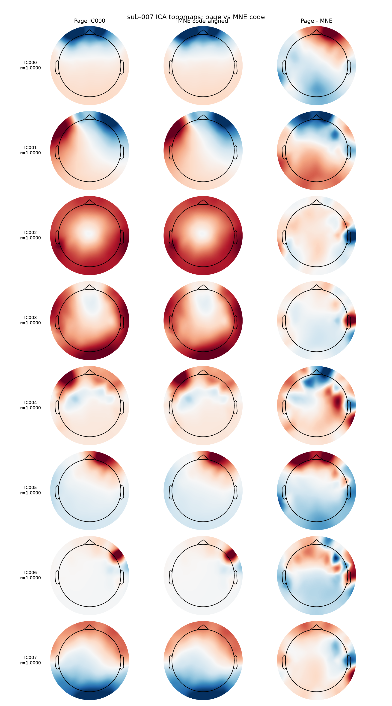

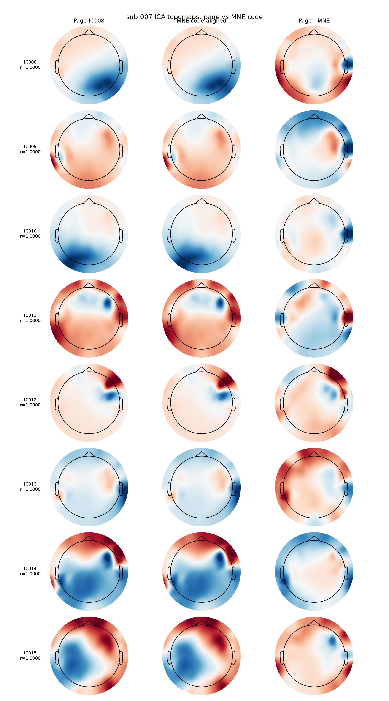

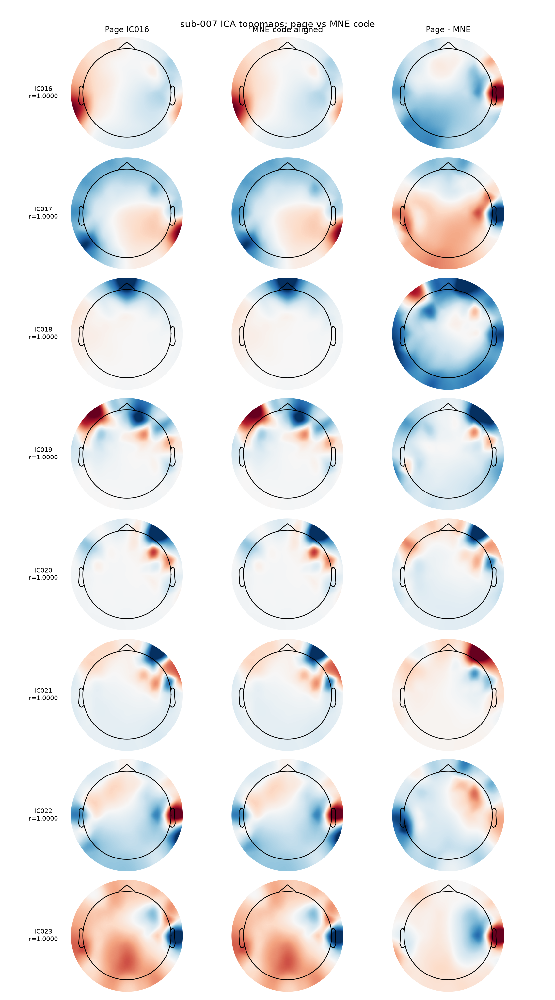

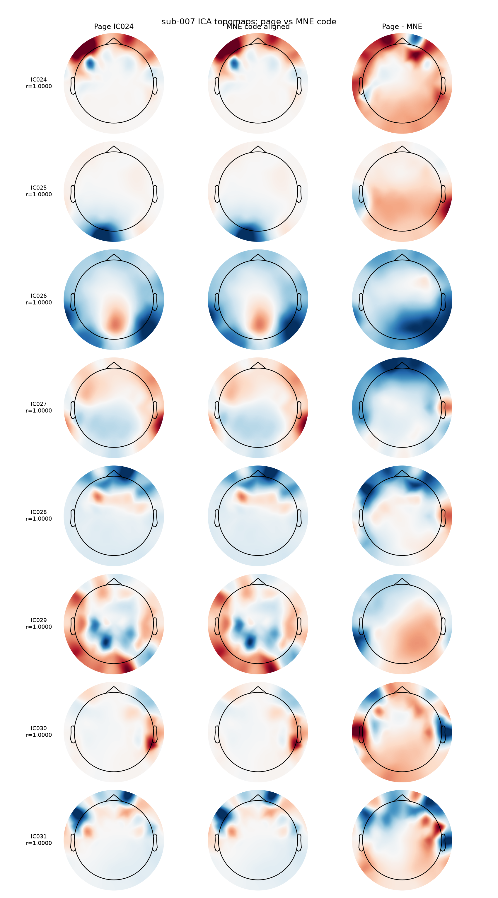

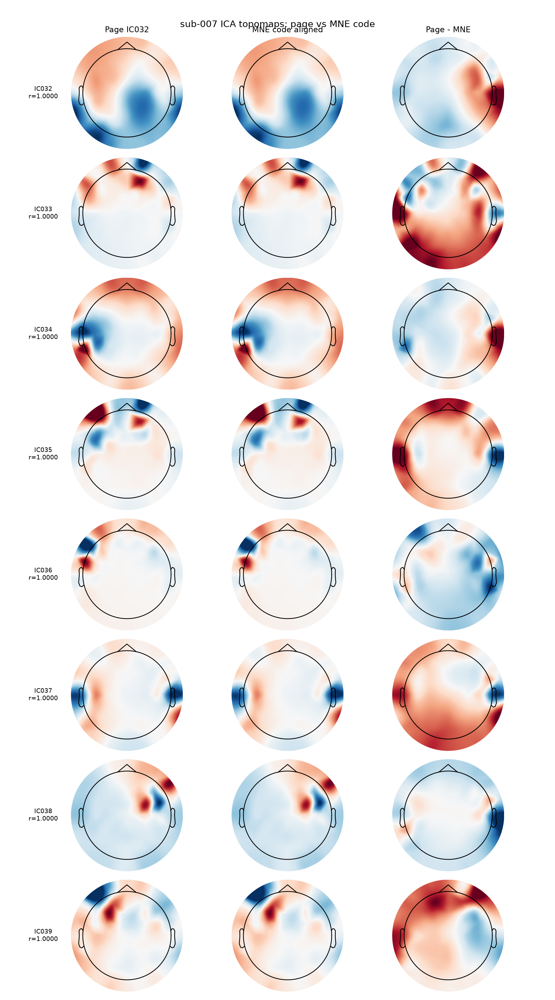

#### 去除成分后的信号对比

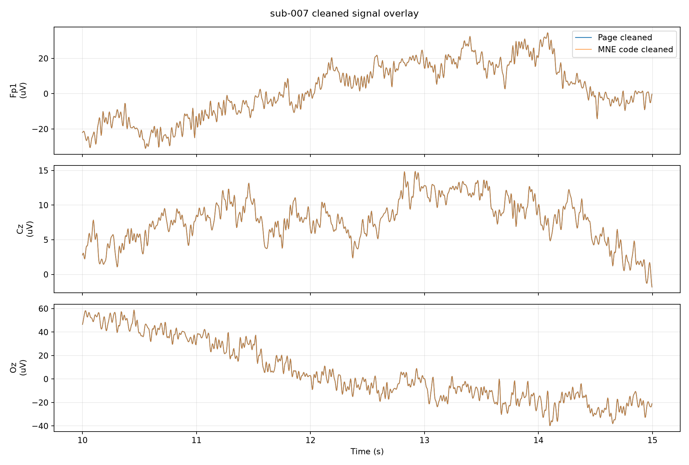

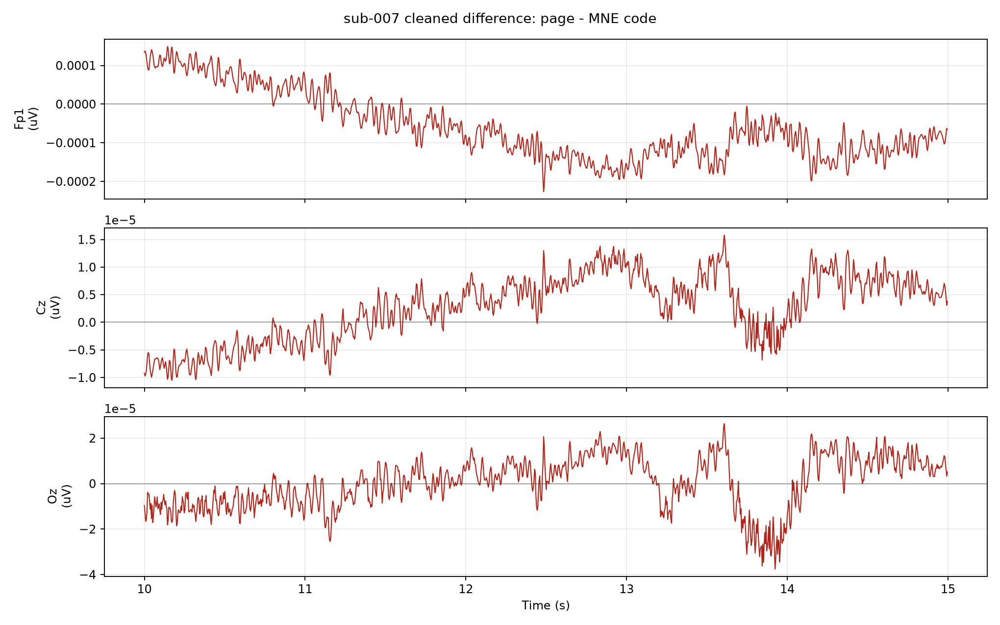

### sub-008

- 剔除成分: `[0, 11]`
- 同编号成分平均 |r|: `1.000000`；最小 |r|: `1.000000`；符号翻转数: `0`。
- 最佳匹配平均 |r|: `1.000000`；如果它明显高于同编号结果，说明主要差异可能是 ICA 成分顺序变化。

| IC | 同编号 r | 同编号 |r| | 符号 | 最佳本地IC | 最佳 |r| | 地形图RMSE |
| ---: | ---: | ---: | ---: | ---: | ---: | ---: |
| IC000 | 1.000000 | 1.000000 | 1 | IC000 | 1.000000 | 4.82506e-08 |
| IC001 | 1.000000 | 1.000000 | 1 | IC001 | 1.000000 | 9.93644e-07 |
| IC002 | 1.000000 | 1.000000 | 1 | IC002 | 1.000000 | 2.13796e-07 |
| IC003 | 1.000000 | 1.000000 | 1 | IC003 | 1.000000 | 2.73721e-07 |
| IC004 | 1.000000 | 1.000000 | 1 | IC004 | 1.000000 | 3.2053e-06 |
| IC005 | 1.000000 | 1.000000 | 1 | IC005 | 1.000000 | 8.60341e-07 |
| IC006 | 1.000000 | 1.000000 | 1 | IC006 | 1.000000 | 2.70709e-07 |
| IC007 | 1.000000 | 1.000000 | 1 | IC007 | 1.000000 | 1.33537e-06 |
| IC008 | 1.000000 | 1.000000 | 1 | IC008 | 1.000000 | 1.60523e-06 |
| IC009 | 1.000000 | 1.000000 | 1 | IC009 | 1.000000 | 2.74835e-06 |
| IC010 | 1.000000 | 1.000000 | 1 | IC010 | 1.000000 | 3.5126e-07 |
| IC011 | 1.000000 | 1.000000 | 1 | IC011 | 1.000000 | 3.04009e-07 |
| IC012 | 1.000000 | 1.000000 | 1 | IC012 | 1.000000 | 4.21633e-06 |
| IC013 | 1.000000 | 1.000000 | 1 | IC013 | 1.000000 | 2.17486e-06 |
| IC014 | 1.000000 | 1.000000 | 1 | IC014 | 1.000000 | 8.64014e-07 |
| IC015 | 1.000000 | 1.000000 | 1 | IC015 | 1.000000 | 2.35237e-07 |
| IC016 | 1.000000 | 1.000000 | 1 | IC016 | 1.000000 | 4.03817e-07 |
| IC017 | 1.000000 | 1.000000 | 1 | IC017 | 1.000000 | 1.70831e-07 |
| IC018 | 1.000000 | 1.000000 | 1 | IC018 | 1.000000 | 6.05411e-07 |
| IC019 | 1.000000 | 1.000000 | 1 | IC019 | 1.000000 | 2.47777e-06 |
| IC020 | 1.000000 | 1.000000 | 1 | IC020 | 1.000000 | 9.6015e-07 |
| IC021 | 1.000000 | 1.000000 | 1 | IC021 | 1.000000 | 2.67847e-06 |
| IC022 | 1.000000 | 1.000000 | 1 | IC022 | 1.000000 | 1.13905e-06 |
| IC023 | 1.000000 | 1.000000 | 1 | IC023 | 1.000000 | 4.2315e-06 |
| IC024 | 1.000000 | 1.000000 | 1 | IC024 | 1.000000 | 3.85636e-07 |
| IC025 | 1.000000 | 1.000000 | 1 | IC025 | 1.000000 | 8.73128e-07 |
| IC026 | 1.000000 | 1.000000 | 1 | IC026 | 1.000000 | 1.12151e-06 |
| IC027 | 1.000000 | 1.000000 | 1 | IC027 | 1.000000 | 1.09221e-06 |
| IC028 | 1.000000 | 1.000000 | 1 | IC028 | 1.000000 | 2.41253e-06 |
| IC029 | 1.000000 | 1.000000 | 1 | IC029 | 1.000000 | 9.08908e-07 |
| IC030 | 1.000000 | 1.000000 | 1 | IC030 | 1.000000 | 9.75923e-07 |
| IC031 | 1.000000 | 1.000000 | 1 | IC031 | 1.000000 | 1.86564e-07 |
| IC032 | 1.000000 | 1.000000 | 1 | IC032 | 1.000000 | 3.98674e-07 |
| IC033 | 1.000000 | 1.000000 | 1 | IC033 | 1.000000 | 3.84926e-07 |
| IC034 | 1.000000 | 1.000000 | 1 | IC034 | 1.000000 | 4.15383e-07 |
| IC035 | 1.000000 | 1.000000 | 1 | IC035 | 1.000000 | 2.63024e-07 |
| IC036 | 1.000000 | 1.000000 | 1 | IC036 | 1.000000 | 2.7285e-07 |
| IC037 | 1.000000 | 1.000000 | 1 | IC037 | 1.000000 | 1.71277e-06 |
| IC038 | 1.000000 | 1.000000 | 1 | IC038 | 1.000000 | 6.75916e-07 |
| IC039 | 1.000000 | 1.000000 | 1 | IC039 | 1.000000 | 2.314e-07 |

#### Topomap 对比

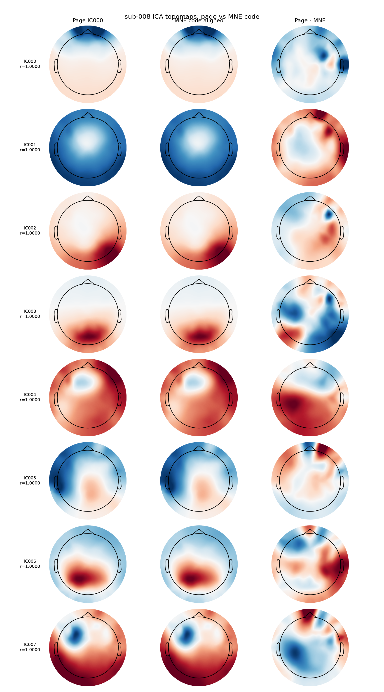

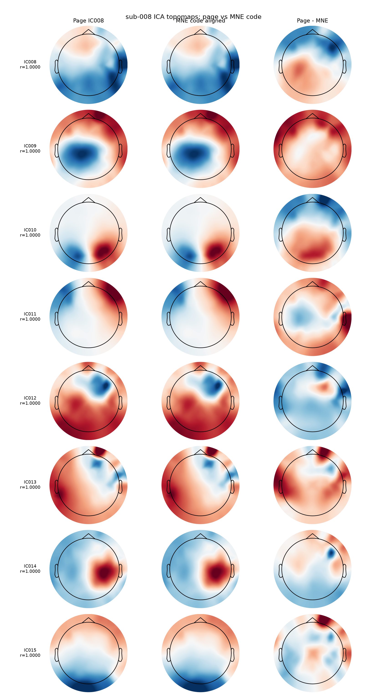

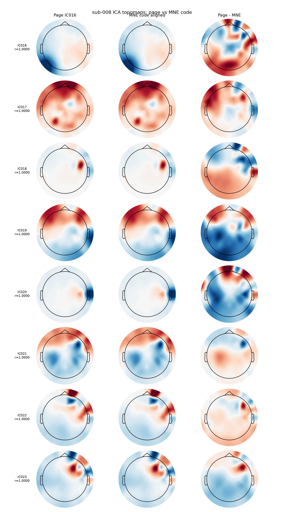

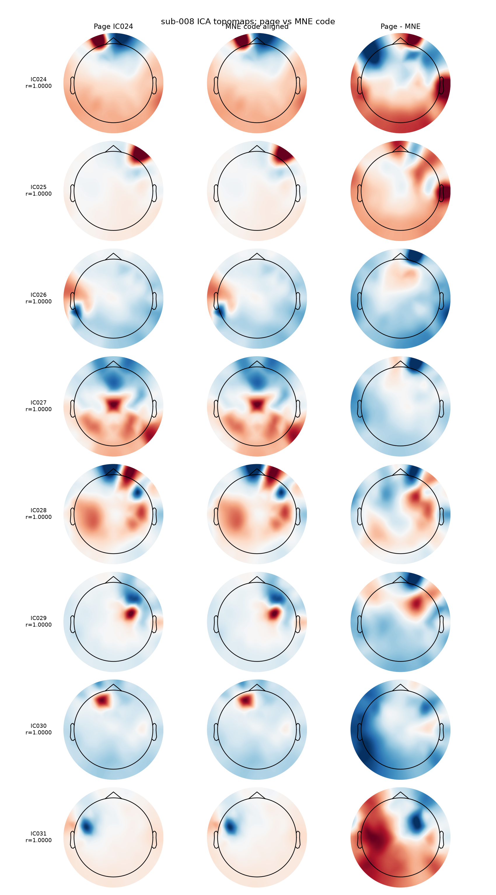

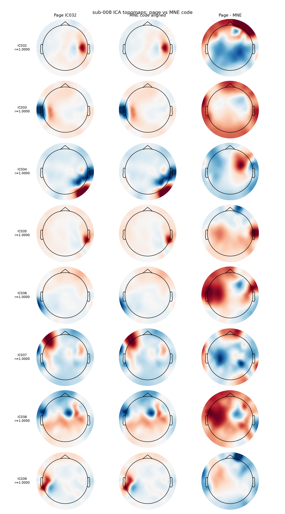

#### 去除成分后的信号对比

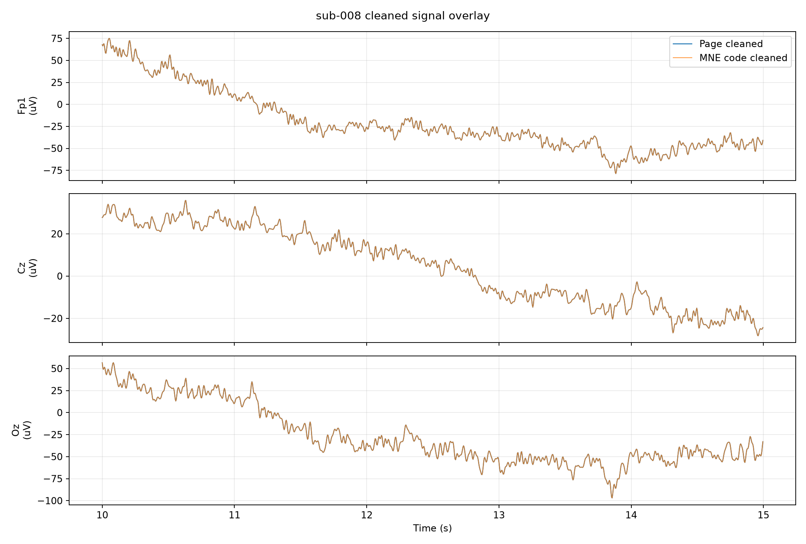

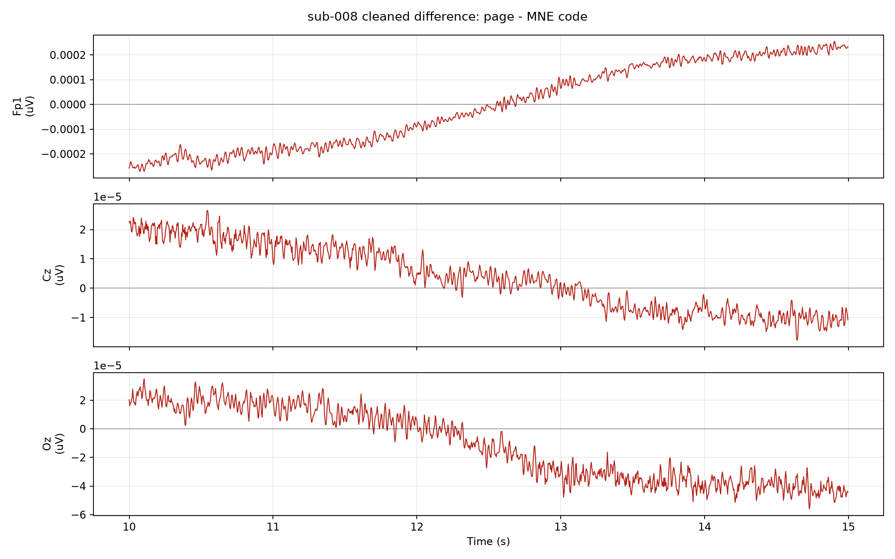

### sub-009

- 剔除成分: `[0, 1, 2, 3, 4, 5, 6, 7, 12, 13, 15]`
- 同编号成分平均 |r|: `1.000000`；最小 |r|: `1.000000`；符号翻转数: `0`。
- 最佳匹配平均 |r|: `1.000000`；如果它明显高于同编号结果，说明主要差异可能是 ICA 成分顺序变化。

| IC | 同编号 r | 同编号 |r| | 符号 | 最佳本地IC | 最佳 |r| | 地形图RMSE |
| ---: | ---: | ---: | ---: | ---: | ---: | ---: |
| IC000 | 1.000000 | 1.000000 | 1 | IC000 | 1.000000 | 2.5246e-08 |
| IC001 | 1.000000 | 1.000000 | 1 | IC001 | 1.000000 | 2.92194e-08 |
| IC002 | 1.000000 | 1.000000 | 1 | IC002 | 1.000000 | 7.94343e-08 |
| IC003 | 1.000000 | 1.000000 | 1 | IC003 | 1.000000 | 6.88808e-08 |
| IC004 | 1.000000 | 1.000000 | 1 | IC004 | 1.000000 | 7.74672e-08 |
| IC005 | 1.000000 | 1.000000 | 1 | IC005 | 1.000000 | 3.22057e-08 |
| IC006 | 1.000000 | 1.000000 | 1 | IC006 | 1.000000 | 8.77186e-08 |
| IC007 | 1.000000 | 1.000000 | 1 | IC007 | 1.000000 | 1.33325e-08 |
| IC008 | 1.000000 | 1.000000 | 1 | IC008 | 1.000000 | 2.45996e-08 |
| IC009 | 1.000000 | 1.000000 | 1 | IC009 | 1.000000 | 2.14278e-08 |
| IC010 | 1.000000 | 1.000000 | 1 | IC010 | 1.000000 | 6.3797e-09 |
| IC011 | 1.000000 | 1.000000 | 1 | IC011 | 1.000000 | 4.96227e-08 |
| IC012 | 1.000000 | 1.000000 | 1 | IC012 | 1.000000 | 4.69451e-08 |
| IC013 | 1.000000 | 1.000000 | 1 | IC013 | 1.000000 | 8.02935e-08 |
| IC014 | 1.000000 | 1.000000 | 1 | IC014 | 1.000000 | 1.48619e-08 |
| IC015 | 1.000000 | 1.000000 | 1 | IC015 | 1.000000 | 4.52023e-08 |
| IC016 | 1.000000 | 1.000000 | 1 | IC016 | 1.000000 | 3.45104e-08 |
| IC017 | 1.000000 | 1.000000 | 1 | IC017 | 1.000000 | 3.30458e-07 |
| IC018 | 1.000000 | 1.000000 | 1 | IC018 | 1.000000 | 3.45781e-09 |
| IC019 | 1.000000 | 1.000000 | 1 | IC019 | 1.000000 | 6.16197e-08 |
| IC020 | 1.000000 | 1.000000 | 1 | IC020 | 1.000000 | 5.77866e-08 |
| IC021 | 1.000000 | 1.000000 | 1 | IC021 | 1.000000 | 7.35711e-08 |
| IC022 | 1.000000 | 1.000000 | 1 | IC022 | 1.000000 | 2.78321e-07 |
| IC023 | 1.000000 | 1.000000 | 1 | IC023 | 1.000000 | 3.43908e-08 |
| IC024 | 1.000000 | 1.000000 | 1 | IC024 | 1.000000 | 8.87072e-08 |
| IC025 | 1.000000 | 1.000000 | 1 | IC025 | 1.000000 | 5.31591e-08 |
| IC026 | 1.000000 | 1.000000 | 1 | IC026 | 1.000000 | 1.67501e-07 |
| IC027 | 1.000000 | 1.000000 | 1 | IC027 | 1.000000 | 3.27286e-08 |
| IC028 | 1.000000 | 1.000000 | 1 | IC028 | 1.000000 | 9.12506e-08 |
| IC029 | 1.000000 | 1.000000 | 1 | IC029 | 1.000000 | 1.58788e-08 |
| IC030 | 1.000000 | 1.000000 | 1 | IC030 | 1.000000 | 1.95702e-08 |
| IC031 | 1.000000 | 1.000000 | 1 | IC031 | 1.000000 | 5.79689e-08 |
| IC032 | 1.000000 | 1.000000 | 1 | IC032 | 1.000000 | 2.64153e-08 |
| IC033 | 1.000000 | 1.000000 | 1 | IC033 | 1.000000 | 2.21954e-08 |
| IC034 | 1.000000 | 1.000000 | 1 | IC034 | 1.000000 | 4.70592e-08 |
| IC035 | 1.000000 | 1.000000 | 1 | IC035 | 1.000000 | 2.33291e-08 |
| IC036 | 1.000000 | 1.000000 | 1 | IC036 | 1.000000 | 1.81553e-08 |
| IC037 | 1.000000 | 1.000000 | 1 | IC037 | 1.000000 | 4.01327e-08 |
| IC038 | 1.000000 | 1.000000 | 1 | IC038 | 1.000000 | 3.96038e-08 |
| IC039 | 1.000000 | 1.000000 | 1 | IC039 | 1.000000 | 8.30575e-08 |

#### Topomap 对比

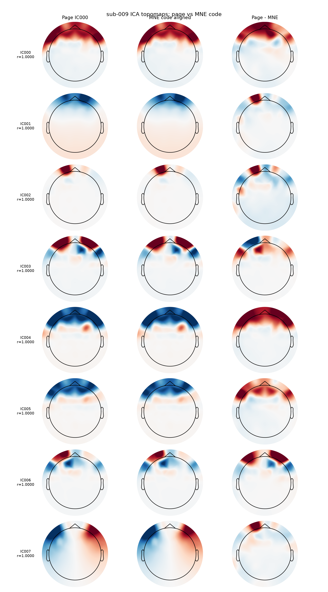

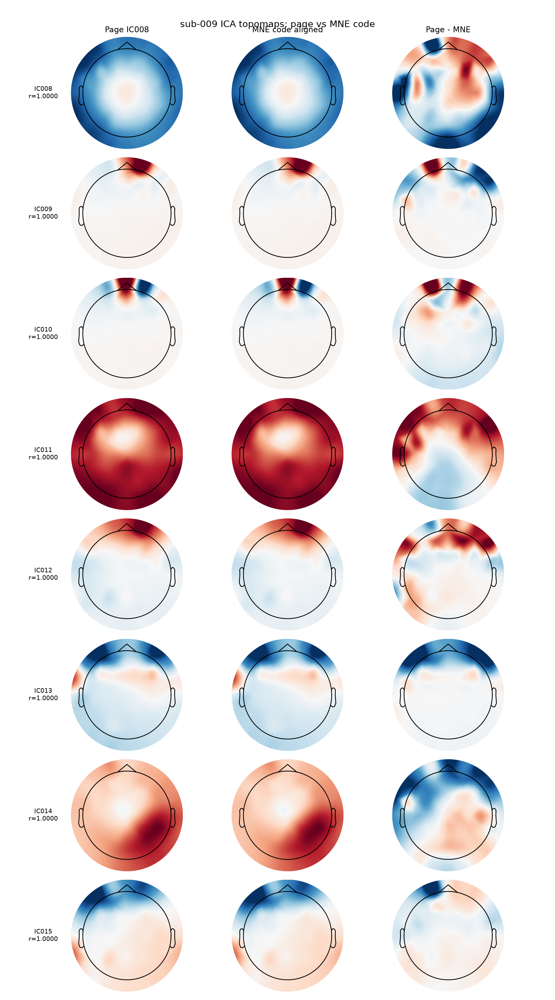

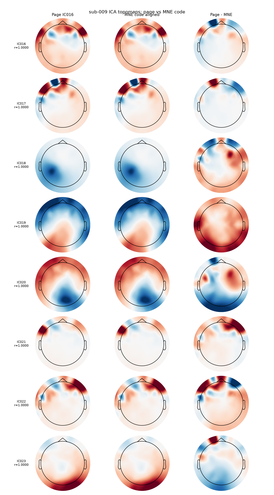

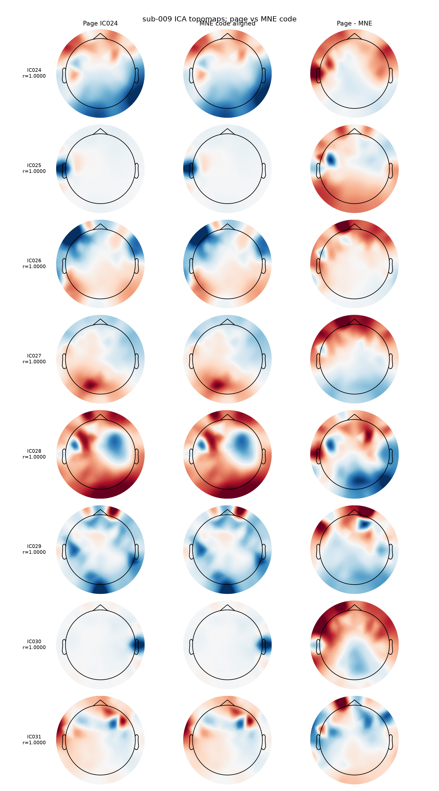

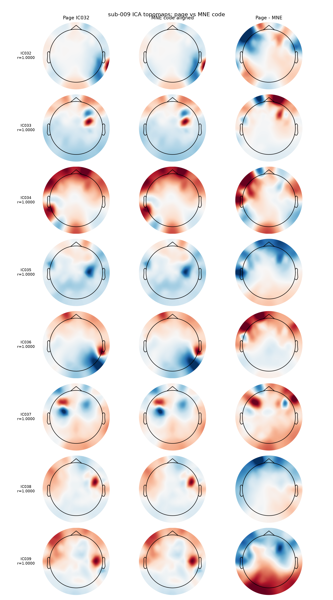

#### 去除成分后的信号对比

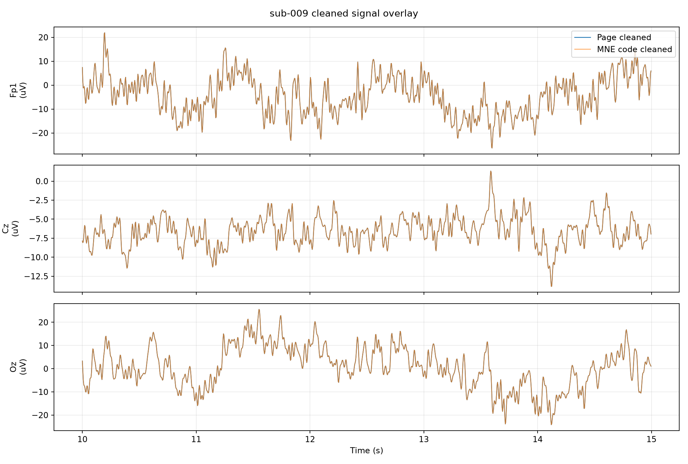

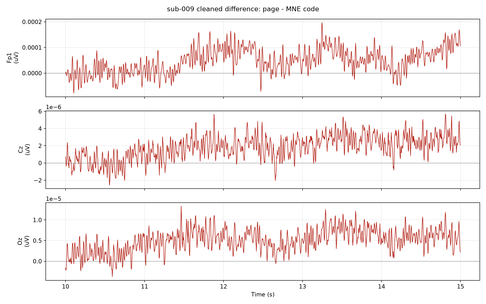

## 判读口径

- `预处理差异` 比较本地 MNE 从原始 FIF 复现到 bandpass 后的结果与页面 bandpass 输出。
- `Apply重放差异` 使用页面保存的 ICA 矩阵在本地重新 apply，验证 Apply ICA 节点本身是否可复现。
- `完整本地清洗差异` 使用本地 MNE 重新计算 ICA 后剔除同样成分，再与页面清洗输出比较，是本次 ICA 一致性的核心指标。
- ICA 符号翻转属于等价解；同编号相关很低但最佳匹配相关很高时，通常表示成分顺序变化。
