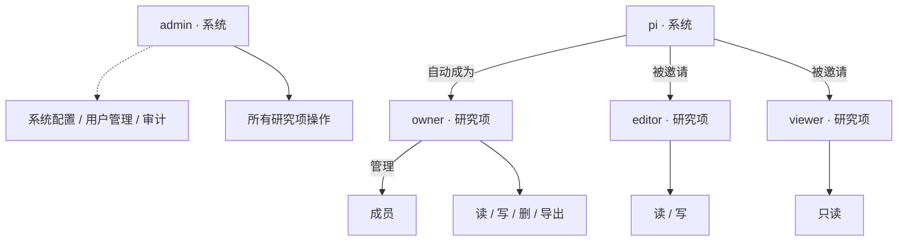

# 1-20 用户角色与使用场景

> 当前代码里的角色模型（系统角色 + 研究项角色双层）、规划中需要服务的协作角色、典型科研工作流场景。

定位
: 用户角色 · 协作场景 · 权限边界

事实源
: P0 `init.sql` 角色与权限种子 · `routers/studies.py` 研究项成员逻辑 · P2 wiki1（102 § 2.3）

更新
: 2026-05-21 13:48:30 +08:00

## 1. 双层角色模型

念析把"**用户是谁**"和"**用户在哪个研究项里**"两件事分开：

| 层 | 角色 | 写在哪 |
|---|---|---|
| **系统角色** | `admin` · `pi` | `roles` + `user_roles` |
| **研究项角色** | `owner` · `editor` · `viewer` | `study_members.role` + `can_read/write/delete/export` |

完整字段见 [3-50 角色权限种子](3-50-协作权限状态与迁移.md#3-角色权限种子)。

## 2. 当前已实现的 5 个角色

| 角色 | 类型 | 典型行为 |
|---|---|---|
| **admin** | 系统角色 | 全局权限：查看 / 操作所有研究项、永久删除研究项、管理用户与系统配置 |
| **pi** | 系统角色 | 可创建研究项；自动成为新研究项的 `owner`；可作为成员加入他人研究项 |
| **owner** | 研究项角色 | 单研究项内全权限：管理成员、删除 / 恢复研究项、执行研究项内所有操作 |
| **editor** | 研究项角色 | 单研究项内读写：导入数据、构建工作流、运行分析、导出结果 |
| **viewer** | 研究项角色 | 单研究项内只读：查看数据、工作流、结果，下载图表 |

角色与权限边界

## 3. 规划中需要服务的协作角色

下面这些**不一定要成为系统角色**，但应在权限、页面入口、协作流程中体现：

| 协作角色 | 工作重心 | 在念析中怎么体现 |
|---|---|---|
| **数据分析师** | 心理学 / 认知神经科学背景，做流程、统计、论文 | 在研究项里担任 `editor`，主要使用工作流编辑器、ERP/PSD/TFR 观察、统计分析页 |
| **算法工程师** | 实现 MNE 执行器、任务系统、性能优化 | `admin` 或被授权的 PI；维护节点 spec、缓存策略、worker 部署 |
| **质控审核者** | 坏通道、坏段、ICA 与事件质量审核 | 研究项 `editor`；主用质控页和 ICA 审核交互 |
| **科研写作者** | 看统计 / 图表 / 生成论文图与方法描述 | `viewer` 或受限 `editor`，主用作图页与统计报告 |
| **数据上传员** | 仅做数据录入 | 受限 `editor`（未来通过细粒度权限 / 上传 token） |
| **AI 助手（LLM）** | Codex/Claude/Trae 等 | 不是真用户，通过 wiki 上下文包接手任务，见 [0-30](0-30-人机协作规则.md) |

## 4. 典型场景

### 场景 A · PI 启动新课题

1. **PI** 登录平台，点击"创建研究项"（带 `study:write` 权限）。
2. 后端生成 12 位 Study ID（例 `202605000001`），初始化数据目录骨架。
3. PI 自动成为该研究项的 `owner`。
4. PI 邀请研究助理为 `editor`、邀请协作导师为 `viewer`。

### 场景 B · 数据导入与质控

1. **研究助理（editor）** 上传 BrainVision / EDF / BDF 原始数据。
2. 系统归档到 `source_uploads/`、生成 `fifdata/` 工作 FIF。
3. **质控审核者（editor）** 进入数据质控页，检查信号质量、Montage、事件标记。
4. 出现问题时上传新版本，旧版本被标记 `replaced`，新版本变 `current`。

### 场景 C · 工作流分析

1. **数据分析师（editor）** 在工作流编辑器拖出 `LoadData → Filter → Epoch → ERP → Save Result` 节点链。
2. 配置 LoadData 选筛选条件，实时看到命中数据集数。
3. 校验 → 保存 → 运行（当前仅 LoadData 真执行；其它节点待 M4-M5 接入）。
4. 后续运行产物存入 `derivatives/preprocessing/`，结果索引到 `derived_datasets`（详见 [3-45](3-45-DerivedDataset.md)）。

### 场景 D · 论文出图

1. **科研写作者（viewer）** 浏览分析结果 / ERP / PSD / TFR 观察页。
2. 进入作图页选模板，组合多子图，导出 SVG / EPS / PNG（M11 规划）。
3. 通过 wiki 引用具体的 `pipeline_id` + `execution_seq`，在论文方法部分写出完整可复现链。

### 场景 E · 把任务交给 AI

1. 任意角色把 wiki 页面编号 + 上下文包贴给 LLM（见 [0-30 § 1](0-30-人机协作规则.md#1-给-llm-的最小上下文包)）。
2. LLM 在限定的代码范围内修改 / 提交 PR。
3. 人审 + `mkdocs build` + 部署。

## 5. 研究项创建权 / 资源档位

| 角色 | 创建研究项 | 资源档位 |
|---|:---:|---|
| `admin` | ✓ | 不受档位限制 |
| `pi` | ✓ | 受档位限制（PI / PI Plus / PI Pro，见 [M0-40](8-00-功能模块总览.md)） |
| 研究项内 `owner/editor/viewer` | ✗ | 跟 PI 的档位走 |

档位**只控制资源**（研究项数 / 研究项容量 / 任务队列 / 协作人数），不改变 RBAC 权限。

## 6. 相关页面

- [M0-20 RBAC 权限模型](2-70-安全边界与合规设计.md)：角色 ↔ 权限种子
- [2-70 安全边界与合规设计](2-70-安全边界与合规设计.md)：`study_members` 字段语义
- [8-00 功能模块总览](8-00-功能模块总览.md)：PI / PI Plus / PI Pro
- [1-30 功能需求矩阵](1-30-功能需求矩阵.md)：哪个角色用哪个功能
- [0-30 人机协作规则](0-30-人机协作规则.md)：LLM 怎么接手任务
