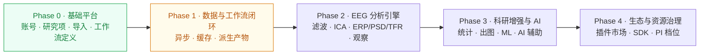

# 1-50 阶段路线图

> 按阶段说明念析的建设顺序，对齐产品、开发和文档。**路线图不代表所有规划能力都已经实现**——状态以 [1-30 功能需求矩阵](1-30-功能需求矩阵.md) 为准。

定位
: 开发阶段排期

事实源
: P0 当前代码 · P2 wiki1（102 路线图）

更新
: 2026-05-24 +08:00

## 一句话

Phase 0 基础平台已经跑通；当前在 Phase 1（让数据 + 工作流闭环），后续 Phase 2 EEG 分析引擎、Phase 3 科研增强与 AI、Phase 4 生态与资源治理。

## 1. 阶段全景

四阶段路线

## 2. Phase 0 · 基础平台（已完成）

> 让账号、研究项、导入、工作流定义稳定下来；不堆新页面。

| 目标 | 落地 |
|---|---|
| JWT 登录 + RBAC 双层权限 | ✅ |
| 研究项 CRUD + 12 位 Study ID | ✅ |
| BrainVision / EDF / BDF 同步导入 + FIF 工作数据 | ✅ |
| 上传版本指针 + 重传二次确认 | ✅ |
| 工作流定义 + 校验 + LoadData 解析 | ✅ |
| 一键部署 + 文档站点 | ✅ |

## 3. Phase 1 · 数据与工作流闭环（进行中）

> 让"导入 → 选数据 → 运行 → 看结果"成为闭环；铺好异步 / 缓存基础架构。

| 目标 | 状态 | 关键页 |
|---|---|---|
| 导入级 QC（Montage / 事件 / 信号质量） | 规划 | [8-00 M2](8-00-功能模块总览.md) |
| `tasks` 表 + Celery worker | 部分接入 | [2-60](2-60-任务队列与异步架构.md) |
| 节点级缓存（content_hash） | 部分接入 | [7-40 缓存复用](7-40-工作流执行与后台任务.md) |
| 派生产物（content-addressed `derived/`） + `study_outputs` 写入 | 部分接入 | [3-45 StudyOutput](3-45-StudyOutput.md) |
| 进度推送（Task 级 SSE 已接；Study 级聚合 / WebSocket 规划） | 部分接入 | [2-60](2-60-任务队列与异步架构.md) |
| 数据列表筛选 + 工作流-数据集联动 | 部分接入 | [5-20 Pipeline 工作流管理](5-20-Pipeline工作流管理.md) LoadData |

## 4. Phase 2 · EEG 分析引擎（规划）

> 接入真实 EEG 计算，使用 MNE-Python；把节点规格变成可执行的执行器。

| 顺序 | 模块 | 关键节点 |
|---|---|---|
| 1 | M4 预处理 | FIR / Butterworth Filter · Resample · Re-reference · Bad channel · ICA Compute / Apply · Epoch |
| 2 | M5 时频分析 | ERP Average · PSD（Welch / Multitaper）· TFR（Morlet / Multitaper） |
| 3 | M9 交互观察 | 波形数据 API · ERP / PSD / TFR 观察数据 API · LOD + 二进制传输 |
| 4 | M6 微状态 | GFP 峰值 · 聚类（k-means / TAAHC） · 模板回配 · 微状态指标 |
| 5 | M7 脑连接 | 相干 · PLV · wPLI · 图论指标 |
| 6 | M8 溯源 | 前向模型 · MNE / sLORETA / eLORETA · ROI 图谱 |

完成判据：每个节点的输出可在对应观察页可视化，且能从结果反向追溯到 `pipeline_executions.execution_seq` + `definition_snapshot`。

## 5. Phase 3 · 科研增强与 AI（规划）

> 面向科研写作、统计推断、论文出图和智能辅助。

| 模块 | 关键能力 |
|---|---|
| M10 统计 | 描述统计 · t / ANOVA · 非参数 · 多重比较 · Cluster Permutation · 混合效应 · 统计报告 |
| M11 出图 | FigureSpec · ERP/PSD/TFR 作图 · 脑图 / 网络图 · 多子图 · 期刊预设 · SVG/EPS/PNG 导出 |
| M12 机器学习 | 特征工程 · 经典 ML（SVM / RF / LDA） · 深度学习（EEGNet / Transformer） · 验证策略 · AutoML · 模型解释 |
| AI 辅助 | 流程建议 · 参数解释 · 质控摘要 · 结果解读 · 标准化结构接口供 LLM 调用 |

## 6. Phase 4 · 生态与资源治理（规划）

> 商业化 + 多团队治理。

| 项 | 内容 |
|---|---|
| 资源档位 | PI / PI Plus / PI Pro 上线（规划项，未落地；模块清单见 [8-00](8-00-功能模块总览.md)） |
| 插件市场 | 第三方节点 / 第三方算法 / 第三方模板 |
| Python SDK | 在本地脚本中调用平台数据与运行能力 |
| REST API 全开 | 给科研团队自动化脚本使用 |
| 国际化 | 英文 / 西班牙文 / 日文 |
| 多中心数据治理 | 跨机构研究项 · 数据使用协议 · 联邦统计 |

## 7. 时间参考（wiki1 估算，仅供参考）

| 阶段 | 范围 | 估算周期 |
|---|---|---|
| Phase 1 MVP | 文件管理 + 预处理 + ERP + 基础观察 | 6 个月 |
| Phase 2 增强 | 微状态 / 脑网络 / 溯源 / 统计 / 出图 | +4 个月 |
| Phase 3 AI | 特征 / ML / 深度学习 / AutoML / XAI | +4 个月 |
| Phase 4 生态 | REST API · SDK · 插件 · i18n · PI 档位 | +3 个月 |

> 实际进度以代码可核验为准；上面是规模感参考。

## 8. 相关页面

- [1-30 功能需求矩阵](1-30-功能需求矩阵.md)：每个模块当前实际状态
- [9-00 更新日志](9-00-更新日志.md)：决策时间线
- [2-60 任务队列与异步架构](2-60-任务队列与异步架构.md)：Phase 1 关键基础
- [5-30 Execution 管理](5-30-Execution管理.md)：执行器路线
