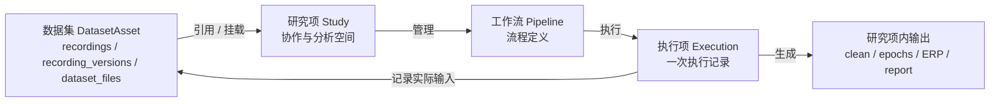
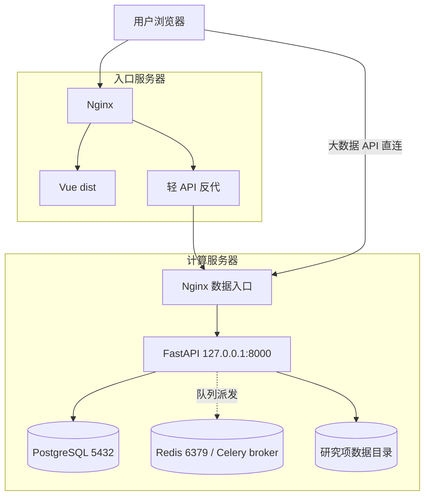

# 2-00 系统架构总览

> 本页合并原 `2-00-架构设计总览.md` 与 `2-10-部署架构与网络拓扑.md`，聚合业务对象、系统分层、网络拓扑、部署入口、数据目录、API、任务队列与安全边界，是 `2xx` 架构系列的唯一入口。

定位
: 系统对象模型 · 架构全景 · 双服务器分工 · 访问路由 · 数据与运行追溯

事实源
: `backend/app/main.py` · `frontend/elys-web/package.json` · `database/init.sql` · `backend/app/config.py` · `deploy/deploy_remote.ps1` · `deploy/deploy.sh`

更新
: 2026-06-05 00:00:00 +08:00

## 一句话现状

念析采用 **B/S 前后端分离 + 混合入口 + 数据计算内聚** 架构。FastAPI 后端、Vue 3 前端、PostgreSQL 元数据、本地文件存储、MNE 同步导入、LiteGraph 工作流定义编辑已经上线；Celery Pipeline Execution、任务表、事件表、Execution 输入快照、Execution Manifest、Artifact 依赖保护、文件管理基础任务，以及采集记录的异步导入入口（`recordings/import-task`，走 Celery）均已接入。SSE 进度推送、统计、出图和 ML 后端仍未完整实现。

## 1. MVP 核心对象

MVP 的业务主干固定为四个对象：**数据集（ORM `DatasetAsset`）、研究项 Study、工作流 Pipeline、执行项 Execution**。中文名仍叫"数据集"，但它在代码里的 ORM 类是 `DatasetAsset`、对应表 `dataset_assets`，是面向用户的数据资产入口。数据资产之下，`Recording / 采集记录`（表 `recordings`）和 `RecordingVersion / 上传版本`（表 `recording_versions`）现在是**各自独立的真实主表**（A+B 重构中由原 `Dataset` / `DatasetUpload` 改名而来，不再是"Dataset 内部再拆"的模糊说法），`DatasetFile / 文件索引`（表 `dataset_files`）的外键指向 `recording_id` + `recording_version_id`。研究项在代码层已确定沿用 `study/studies` 命名，不再改名；v2 文档中其产品语义统一收敛为 **Study / 研究项**。

| 对象 | 中文名 | 含义 | 关键边界 |
|---|---|---|---|
| `DatasetAsset` | 数据集 | 平台中的数据资产。聚合原始上传证据、Raw BIDS 标准入口、canonical FIF 工作副本，以及挂在它名下的采集记录（`Recording`）、上传版本（`RecordingVersion`）、sidecar 和基础元数据 | 管“有什么数据、数据从哪里来、标准原始入口是什么、有哪些采集记录和上传版本” |
| `Study` | 研究项 | 围绕一个研究问题组织协作、数据引用、工作流、执行项和结果的工作空间 | 管“本研究用哪些数据、谁协作、有哪些流程和当前结果” |
| `Pipeline` | 工作流 | 数据处理和分析流程定义，保存节点、连线、默认参数、输入/输出槽和数据选择规则 | 管“怎么处理”，不直接绑定具体文件 |
| `Execution` | 执行项 | 某个工作流的一次具体执行记录，冻结实际输入、工作流快照、参数、状态和输出索引 | 管“这一次实际用了什么、怎么跑、产生了什么” |

## 2. 对象关系

关键规则：

- 数据集可以持续增量上传，MVP 不做发布版本，统一视为 working；增量上传只在 `recordings` / `recording_versions` 里新增一条 `Recording` 或 `RecordingVersion`，不复制整个 `DatasetAsset`。
- 研究项引用数据集，不直接复制数据集文件。
- 工作流可以保存“选择规则”，例如“使用本研究项中 task=rest 的当前数据”，但不把具体文件路径当作事实源。
- 执行项在开始运行时解析实际输入，写入 `recording_version_id`、文件 hash、pipeline 快照和输出索引；数据集后续继续变化，不会改变旧执行项。
- 执行项记录长期保留；输出大文件按 current / pinned / cached / temporary / deleted 策略管理。

### 2.1 Dataset 与 Study 的权威口径

Dataset 和 Study 不是父子目录关系，也不是“一建研究项就复制一份数据”。它们的边界如下：

| 问题 | Dataset 回答 | Study 回答 |
|---|---|---|
| 它是什么 | 可复用的数据资产 | 围绕研究问题建立的协作与分析空间 |
| 管什么 | 原始上传证据、Raw BIDS 入口、canonical FIF、采集记录、上传版本、文件索引、基础 QC 和元数据 | 成员权限、Dataset 挂载、默认筛选、Pipeline、Execution、Artifact、报告和审计 |
| 是否可复用 | 一个 Dataset 可以被多个 Study 引用 | 一个 Study 可以引用多个 Dataset |
| 文件归属 | Dataset 原始文件和标准化工作副本属于 Dataset | Study 只保存本研究产生的输出、缓存、预览、导出和日志 |
| 变化策略 | working Dataset 可以继续上传、重传和补 metadata | 已经产生的 Execution 不跟随 Dataset 自动变化 |

标准关系是 **多对多挂载**：`Study -> study_dataset_mounts -> DatasetAsset`。挂载关系可以带 `mount_name`、用途、默认筛选条件和启停状态。Pipeline 在 Study 内保存“选择规则”；Execution 启动时把规则解析成具体 `dataset_file_id / recording_version_id / storage_uri / hash`，写入 `pipeline_execution_inputs`。因此，数据集后续继续增长时，老 Execution 的输入事实仍然可追溯。

当前代码口径：研究项由 `studies` 表和 `/api/v1/studies` API 承载；用户视角的数据集（数据资产）由 ORM `DatasetAsset` / 表 `dataset_assets` 承载；一条采集记录由 `Recording` / 表 `recordings` 承载，其上传/重传版本由 `RecordingVersion` / 表 `recording_versions` 承载。这两张表是 A+B 重构里直接由原 `Dataset` / `DatasetUpload` 改名而来的真实主表——调试期已做破坏性改表（DROP 后按新名重建，不留迁移脚本、不留兼容视图），所以现在**不存在旧 `datasets` / `dataset_uploads` 表**，也没有任何 `recordings_view` 之类的只读兼容视图。

### 2.2 Dataset-first 导入口径

导入改造的目标口径是 **Dataset-first**：用户先创建或选择 Dataset，系统再创建或选择一个配套 Study，并通过 `study_dataset_mounts` 建立挂载。这个配套 Study 只是导入、QC、Pipeline 和 Execution 的工作空间，也为当前兼容代码提供 `study_id` 上下文；它不拥有 Dataset，也不能把 Dataset 文件解释成 Study 子目录。

当前实现已落地这一口径的后端能力：唯一的数据集创建入口是 `POST /api/v1/dataset-assets/bootstrap`（bootstrap，意为"一键拉起初始上下文"），它把"创建 `DatasetAsset`、创建或选择配套 Study、建立 `study_dataset_mounts` 挂载、返回上传上下文"放在一个事务里完成；裸建端点 `POST /dataset-assets` 已删除。采集记录的同步导入入口已迁到 `POST /api/v1/studies/{study_id}/recordings/import`（异步版为 `POST /.../recordings/import-task`），旧的 `POST /studies/{id}/datasets/import` 不再存在。前端 `ImportPage.vue` / `BidsUploadPanel.vue` 的 Dataset-first 接线仍在跟进，是当前剩余的过渡工作。

## 3. 数据与追溯原则

| 原则 | 说明 |
|---|---|
| 数据库是事实源 | 身份、状态、关系、权限、版本、输入输出和审计都以 PostgreSQL 为准，不靠扫目录判断 |
| 文件系统只存大文件 | 原始上传、Raw BIDS 文件、canonical FIF、sidecar、输出 FIF/HDF5/报告等放文件系统或对象存储，统一通过 `storage_uri` 写入数据库索引 |
| working 数据可变，Execution 不可变 | 数据集可持续上传和重传；每次执行项冻结当时的实际输入清单 |
| Execution 记录永远保留 | 即使输出文件被清理，也保留运行人、时间、输入、参数、错误和输出状态 |
| 输出按策略保留 | 当前结果、用户固定、被下游依赖的输出保留；可重算缓存和临时文件可清理 |
| QC 不作为硬门槛 | QC 状态用于默认筛选、提示和报告；只要有权限且文件可读，工作流可以使用未质控数据 |

## 4. 双服务器分工

| 服务器 | 当前地址 | 正式域名 | 职责 | 对外开放 |
|---|---|---|---|---|
| 入口服务器 | `8.135.40.150`（固定） | `elysbrain.site` / `www.elysbrain.site` | Nginx、Vue dist、轻 API 反代 | 80 / 443 |
| 计算服务器 | 阿里云按量实例，IP 每次部署都会变（不写死，以 `data.elysbrain.site` 解析为准） | `data.elysbrain.site` | Nginx、FastAPI、PostgreSQL、Redis、研究项数据目录 | 80 / 443 |

备案信息：主域名 `elysbrain.site` 已备案，备案号为 `粤ICP备2026062729号`。两台服务器使用同一个主域名下的不同子域名，不需要再申请第二个顶级域名。

设计目标：

- 用户通过浏览器访问，不要求 VPN。
- 大文件上传、下载、波形和时频等大流量直连计算服务器。
- PostgreSQL、Redis、研究项数据目录不直接暴露公网。
- 未来计算服务器可迁移到公司机房或更强计算环境。

## 5. 部署与网络拓扑

## 6. 访问路由

| 流量 | 路径 | 说明 |
|---|---|---|
| 页面访问 | 浏览器 → 入口 Nginx → Vue dist | 返回 HTML / JS / CSS |
| 轻 API | 浏览器 → 入口 Nginx `/api` → 计算服 Nginx → FastAPI | 登录、研究项列表、轻量状态 |
| 大数据 API | 浏览器 → 计算服 Nginx → FastAPI | 上传、下载、波形、时频、大图 |

正式 DNS 解析建议：`elysbrain.site` A 记录到入口服务器 `8.135.40.150`（固定），`www.elysbrain.site` CNAME 到根域名，`data.elysbrain.site` A 记录指向计算服务器。计算服务器是阿里云按量实例、公网 IP 每次部署都会变，因此这里不写死具体地址，由每次部署后更新 `data.elysbrain.site` 的解析来对外暴露。路径级路由如 `/api/v1` 由 Nginx 决定，不由 DNS 决定。

## 7. 技术栈

`Vue 3` `TypeScript` `Pinia` `Vue Router 4` `Vite 5` `LiteGraph.js` `Axios` `FastAPI` `Pydantic 2` `SQLAlchemy 2` `python-jose` `bcrypt` `MNE-Python` `NumPy` `SciPy` `PostgreSQL` `Nginx` `systemd`

详见 [2-80 代码工程结构](2-80-代码工程结构.md)。

## 8. 已实现 / 部分接入 / 规划

| 能力 | 状态 | 说明 |
|---|---|---|
| FastAPI 主程序、CORS、UUID 编码、健康检查 | 已实现 | `backend/app/main.py` |
| 认证、研究项（现代码名 study）、数据集、工作流路由 | 已实现 | 见 [2-50 API 设计总览](2-50-API设计总览.md) |
| Vue 路由、登录守卫、Dashboard、研究项/研究项、导入、Pipeline | 已实现 | 见 [6-00 前端页面总览](6-00-前端页面总览.md) |
| PostgreSQL 元数据表、索引、角色权限种子 | 已实现 | 见 [3-00 数据库设计总览](3-00-数据库设计总览.md) |
| 研究项数据目录骨架自动初始化 | 已实现 | 见 [2-40 文件系统与数据目录](2-40-文件系统与数据目录.md) |
| 工作流节点规格、校验、LoadData 解析 | 部分接入 | 见 [5-00 研究管理总览](5-00-研究管理总览.md) |
| Redis 配置与 Celery Pipeline Execution 接入 | 部分接入 | `tasks/celery_app.py`、`run_pipeline_task`、`async_tasks`、`task_events` 已存在；Execution/Task cancel-retry 和 Task 级 SSE 已接入 |
| 文件管理标准化 | 已实现基础版 | Dataset 标准目录、Study Artifact、Execution Manifest、file browser、backfill 工具已接入 |
| 预处理、分析、观察、统计、出图、ML 后端 | 规划 | 多数仍为静态预览或节点规格 |

## 9. 关键设计决策

| 决策点 | 当前选择 | 理由 |
|---|---|---|
| 架构风格 | B/S 前后端分离 | Web 端访问方便，后端集中管理数据与计算 |
| 入口分离 | 入口服 + 计算服 | 大文件与计算靠近数据侧，公网带宽不抢轻 API |
| 原始数据策略 | `sourcedata/original_uploads` 保留证据 + `raw_bids` 标准入口 + `derivatives/elys-canonical-fif` 工作副本 | 保留来源，支持 BIDS 共享，并给后续 MNE 流程稳定输入 |
| 研究项路径 | 现阶段沿用 12 位 Study ID | 避免研究项名称或 code 改名影响文件路径；代码层仍为 `study_id` |
| 当前任务模式 | 同步导入为主，已部分接入 Celery 异步 | 同步导入入口 `POST /studies/{id}/recordings/import` 仍是默认；同时已提供异步入口 `POST /studies/{id}/recordings/import-task`（走 Celery，返回 `async_tasks` 任务句柄），逐步替换长耗时同步路径 |
| 工作流定义 | 后端存 JSONB，校验时消费结构 | 前端 LiteGraph 序列化为 `definition_json` |
| 执行项追溯 | `pipeline_executions` + 输入/输出索引 + run manifest | working 数据可变化，历史执行项仍需可追溯 |
| 输出保存 | Execution 记录长期保留，大文件按策略清理 | 控制存储增长，同时保留证据链 |

## 10. 拟引入依赖（未来阶段）

| 层面 | 拟选型 | 用途 |
|---|---|---|
| 数据库迁移 | Alembic | 版本化 schema 迁移 |
| 异步任务 | Celery + Redis | EEG 长耗时任务与进度推送 |
| 工作流执行 | PipelineExecutor + Celery | 节点真实执行、缓存、进度 |
| 观察图表 | uPlot + ECharts | 多通道波形、频谱、统计图 |
| 三维 / 交互图 | Plotly.js | 3D 脑图与复杂交互 |
| 机器学习 | scikit-learn / PyTorch | M12 特征工程与模型训练 |

## 11. 安全边界

| 层 | 约束 |
|---|---|
| 入口服务器 | 不存数据库，不存研究项数据，只提供前端资源和轻 API 反代 |
| 计算服务器 | FastAPI 监听本机，由 Nginx 转发 |
| PostgreSQL / Redis | 只监听本机或内网，不开放公网 |
| 研究项数据目录 | 不配置 Nginx 静态目录，文件访问必须经过 FastAPI 鉴权 |
| 认证 | 普通 API 与数据 API 都使用 Bearer Token |
| 部署 SSH | 使用专用部署 key，不复用人工登录 key |

## 12. 部署能力状态

| 能力 | 状态 |
|---|---|
| 入口 + 计算双服务器部署 | 已实现 |
| Nginx 反代 FastAPI，systemd 守护后端 | 已实现 |
| PostgreSQL 本机/内网访问 | 已实现 |
| 正式域名解析口径 | 已确定 |
| HTTPS 与证书切换 | 规划 |
| Celery Worker + Redis broker 真实接入 | 部分接入 |
| 日志聚合、监控、备份策略 | 规划 |

## 13. 2xx 子页入口

| 子页 | 内容 |
|---|---|
| [2-10 部署架构与网络拓扑](2-10-部署架构与网络拓扑.md) | 双服务器分工、混合入口、访问路由、安全边界图 |
| [2-20 服务分层设计](2-20-服务分层设计.md) | 前端、API、service、model、DB 分层 |
| [2-40 文件系统与数据目录](2-40-文件系统与数据目录.md) | 服务器落盘位置、当前兼容目录、目标标准目录 |
| [2-50 API 设计总览](2-50-API设计总览.md) | 后端接口事实总表 |
| [2-60 任务队列与异步架构](2-60-任务队列与异步架构.md) | Celery、Redis、Task、Execution 状态机与进度推送 |
| [2-70 安全边界与合规设计](2-70-安全边界与合规设计.md) | 鉴权、权限、数据访问、安全约束 |
| [2-80 代码工程结构](2-80-代码工程结构.md) | 后端、前端、数据库、部署脚本目录 |

## 14. 相关页面

- [3-00 数据库设计总览](3-00-数据库设计总览.md)
- [4-00 文件管理总览](4-00-文件管理总览.md)
- [5-00 研究管理总览](5-00-研究管理总览.md)
- [7-00 后端架构总览](7-00-后端架构总览.md)
