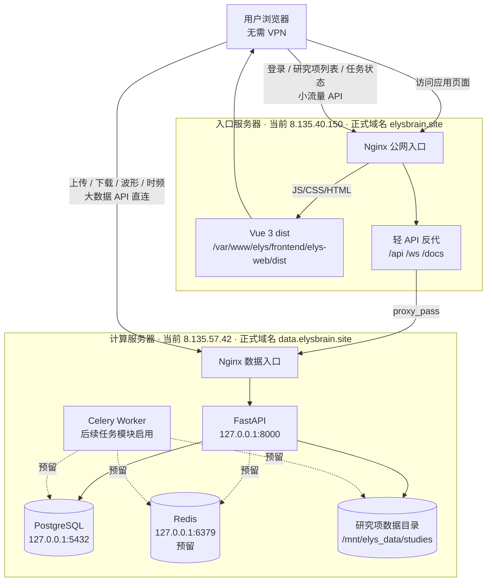
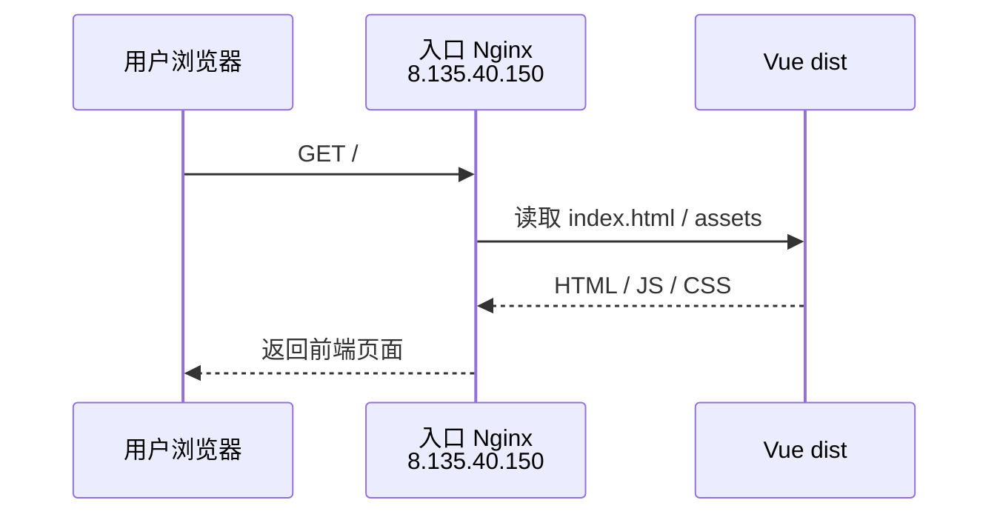
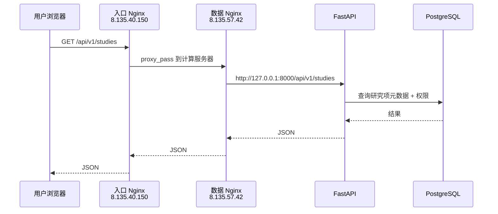
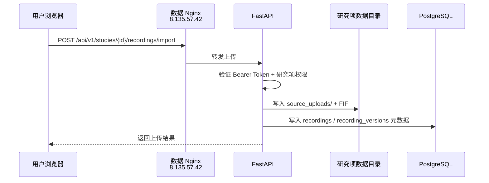

# 2-10 部署架构与网络拓扑

> 两台阿里云服务器：入口服承载前端 + 轻 API 反代；计算服承载 FastAPI / PostgreSQL / Redis / 研究项数据目录。本页是部署、网络、安全边界的入口。

<div class="elys-meta" markdown>

定位
: 服务器分工 · 访问路由 · 安全边界

事实源
: `elys_project/deploy/deploy_remote.ps1` · `elys_project/deploy/deploy.sh` · `elys_project/deploy/check.ps1` · `elys_project/deploy/profiles/*.env` · `backend/app/config.py`

代码位置
: `deploy/deploy_remote.ps1` · `deploy/deploy.sh` · `deploy/check.ps1`

更新
: 2026-06-24 00:00:00 +08:00

</div>

!!! warning "计算服 IP 不写死（2026-06 核对）"
    计算服务器是阿里云**按量实例，IP 每次部署都会变**（见 AGENTS.md）。本页正文 / 图里出现的 `8.135.57.42` 是**已废弃的旧值**——`deploy/profiles/aliyun-test.env` 已把它标为"备用旧机"，当前 `COMPUTE_SERVER_IP` 是另一个值。**计算服 IP 的唯一事实源是 `deploy/profiles/*.env` 的 `COMPUTE_SERVER_IP`**，对外一律以 `data.elysbrain.site` 解析为准；下文出现的具体计算服 IP 仅为示意，不要当现值引用。入口服 `8.135.40.150` 相对稳定，但同样以 profile 为准。

## 一句话现状

入口服务器跑 Nginx + Vue dist；计算服务器跑 FastAPI + PostgreSQL + Redis + 研究项数据目录。正式域名为 `elysbrain.site`，备案号为 `粤ICP备2026062729号`；主站使用 `elysbrain.site`，数据/API 子域使用 `data.elysbrain.site`，计算服 IP 变化只需改 `data` 的 A 记录，不影响主站和数据层。

## 1. 双服务器分工


| 服务器 | 域名 / IP | 职责 | 对外开放 |
|---|---|---|---|
| **入口服务器** | `http://8.135.40.150`（以 profile 为准）；正式主站 `elysbrain.site` / `www.elysbrain.site` | Nginx · Vue dist · 轻 API 反代 | 80 / 443 |
| **计算服务器** | IP 每次部署变，见 `deploy/profiles/*.env` 的 `COMPUTE_SERVER_IP`；正式数据域名 `data.elysbrain.site` | Nginx · FastAPI · PostgreSQL · Redis · 研究项数据目录；Celery 预留 | 80 / 443 |

设计目标：

| 目标 | 落地方式 |
|---|---|
| 用户低门槛 | 浏览器直接访问入口 IP / 域名，不要求 VPN |
| 降低阿里云大流量 | 大文件 / FIF / 波形 / 时频直连计算服务器，不走入口服 |
| 保护数据层 | PostgreSQL / Redis / 研究项数据目录不暴露公网 |
| 便于迁移 | 当前两台阿里云模拟，未来计算服务器可迁公司机房 |

## 2. 混合入口总览


<div class="elys-flow" markdown>

入口服务器 + 计算服务器拓扑



</div>

## 3. 访问路由


### 页面访问

<div class="elys-flow" markdown>

浏览器 → 入口 Nginx → Vue dist



</div>

### 轻 API 访问

<div class="elys-flow" markdown>

入口服反代到计算服



</div>

### 大数据访问

<div class="elys-flow" markdown>

浏览器直连计算服，绕过入口服



</div>

## 4. 域名解析与用途

已备案信息：

| 项 | 值 |
|---|---|
| 主域名 | `elysbrain.site` |
| 备案号 | `粤ICP备2026062729号` |
| 主站服务器 | `8.135.40.150`（以 profile 为准） |
| 计算 / 数据服务器 | 以 `deploy/profiles/*.env` 的 `COMPUTE_SERVER_IP` 为准（每次部署变），对外用 `data.elysbrain.site` |

两台服务器不需要两个顶级域名。推荐在同一个已备案主域名下用不同子域区分用途：主站访问 `elysbrain.site`，数据/API 访问 `data.elysbrain.site`。如果未来计算服务器迁移到公司机房或另一台云服务器，只需要把 `data.elysbrain.site` 的 A 记录改到新的公网 IP，主站域名不需要变化。

### 4.1 DNS 记录建议

在域名解析控制台为 `elysbrain.site` 添加以下记录：

| 主机记录 | 类型 | 记录值 | 用途 | 优先级 |
|---|---|---|---|---|
| `@` | `A` | `8.135.40.150`（入口服 IP） | 主站，访问 `elysbrain.site` | 必需 |
| `www` | `CNAME` | `elysbrain.site` | 访问 `www.elysbrain.site`，便于用户习惯输入 | 建议 |
| `data` | `A` | 计算服 IP（`COMPUTE_SERVER_IP`，每次部署后更新此 A 记录） | 上传、下载、波形、文件索引、大数据 API | 必需 |
| `api` | `CNAME` | `data.elysbrain.site` | 可选 API 别名；当前代码默认使用 `data` | 可选 |
| `docs` | `A` | 文档服务器 IP | 如后续把 wiki 迁到 `docs.elysbrain.site` 时使用 | 可选 |

DNS 只负责“域名 → IP”。`/api/v1`、`/assets`、`/docs` 这些路径由 Nginx 反向代理决定，不能在 DNS 里配置；DNS 记录也不能写端口，例如不能写成 `8.135.57.42:8000`。

### 4.2 Nginx 与 HTTPS 切换顺序

推荐上线顺序：

1. 在 DNS 控制台添加 `@`、`www`、`data` 记录。
2. 等待解析生效，用 `nslookup elysbrain.site` 和 `nslookup data.elysbrain.site` 确认返回对应 IP。
3. 入口服务器 Nginx `server_name` 覆盖 `elysbrain.site www.elysbrain.site 8.135.40.150`。
4. 计算服务器 Nginx `server_name` 覆盖 `data.elysbrain.site 8.135.57.42`。
5. HTTP 冒烟通过后申请证书：

```bash
certbot --nginx -d elysbrain.site -d www.elysbrain.site
certbot --nginx -d data.elysbrain.site
```

6. 证书生效后把部署 profile 切到 `ACCESS_MODE=domain`、`PUBLIC_SCHEME=https`，并把前端 `VITE_DATA_API_BASE_URL` 指向 `https://data.elysbrain.site/api/v1`。

### 4.3 访问地址表

| 访问地址 | 用途 | 流量类型 |
|---|---|---|
| `http://8.135.40.150` | 当前主站 · 前端 · 登录 · 轻 API（入口服 IP，以 profile 为准） | 小流量 |
| `http://<计算服 IP>` | 当前文件上传 / 下载 · 波形 · 时频 · 大图（IP 见 `COMPUTE_SERVER_IP`，每次部署变） | 大流量 |
| `https://elysbrain.site` | 正式主站 · Vue 前端 · 轻 API 反代 | 小流量 |
| `https://www.elysbrain.site` | 正式主站别名，可 301 到根域名 | 小流量 |
| `https://data.elysbrain.site` | 正式数据 API · 上传 / 下载 / 文件索引 | 大流量 |
| `https://api.elysbrain.site` | 可选 API 别名，当前不作为默认配置 | API |

如果两台服务器位于同一 VPC，可在部署脚本里把 `DataUpstream` 改为计算服内网 IP，轻 API 反代就不走公网。

## 5. 安全边界


| 层 | 约束 |
|---|---|
| 入口服务器 | 不存 DB，不存研究项数据，只返回前端和反代轻 API |
| 计算服务器 | FastAPI 只监听 `127.0.0.1:8000`，由本机 Nginx 代理 |
| PostgreSQL | 只监听本机 / 内网，**不开放公网** |
| Redis | 只监听本机 / 内网，**不开放公网** |
| 研究项数据目录 | 不配 Nginx alias，**所有文件访问必须经 FastAPI 鉴权** |
| 认证 | 普通 / 数据 API 均使用 `Authorization: Bearer <token>` |
| 部署 SSH | 用专门的部署 key（`elys_deploy_ed25519` / `elys_doc_deploy_ed25519`），不复用人工登录 key |

更多见 [2-70 安全边界与合规设计](2-70-安全边界与合规设计.md)。

## 6. 部署脚本

| 脚本 | 用途 |
|---|---|
| `s2_deploy_remote.cmd`（仓库根） | 日常部署入口，转调 `deploy_remote.ps1`；改完代码本地静态校验后跑它 |
| `elys_project/deploy/deploy_remote.ps1` | Windows 主机一键部署到入口 + 计算服务器（清理 / 初始化数据目录 / DB / 后端 / 前端） |
| `elys_project/deploy/deploy.sh` | 服务器侧实际执行的 bash 脚本 |
| `wiki/deploy_docs.ps1` | 文档站点（`huanggan.site/elys_doc/`）打包 + 上传 |
| `wiki/setup_docs_ssh_key.ps1` | 一次性安装文档站点的部署 SSH key |

### 6.1 本地部署机需要装什么

本地这台 Windows 是「打包 + 上传 + 远程触发」的**发射台**，不是运行环境——真正建库、装服务、build 前端全在云端 `deploy.sh` 里完成。所以要区分两种依赖：

| 组件 | 是否必需 | 用途 | 缺了会怎样 |
|---|---|---|---|
| OpenSSH Client（`ssh` / `scp` / `ssh-keygen`） | **必需** | 上传代码、远程执行 `deploy.sh`、首次装部署公钥 | 根本无法部署；Win11 自带，可 `Get-WindowsCapability -Online -Name OpenSSH.Client*` 查 |
| `tar` | **必需** | 把项目打包成 `tar.gz` 上传 | Win10/11 自带 bsdtar，一般无需额外装 |
| PowerShell 5.1+ | **必需** | `deploy_remote.ps1` 的宿主 | Windows 自带 |
| **Python**（在 PATH 上） | 校验门禁需要 | `check.ps1` 跑后端 `python -m compileall` 编译校验 | 缺则 check 这步 FAIL、挡下部署，须加 `-SkipCheck` 跳过 |
| **Node.js + npm + 前端 `node_modules`** | 校验门禁需要 | `check.ps1` 跑前端 `vue-tsc` 类型检查 + vitest 单测 | 同上；`node_modules` 由 `frontend/elys-web` 下 `npm install` 生成 |
| `mkdocs` | 可选 | 仅 `check.ps1 -Docs` 或单独部署 wiki 时 | 不影响主部署 |
| `aliyun` CLI | 仅买机器时 | `s1_buy_ecs.cmd` 调它开抢占式 ECS 计算服、拿公网 IP 回写 profile | 缺则 `s1` 报错退出；日常 `s2` 部署不需要它 |

这里说的「校验门禁」指 `s2_deploy.cmd` 在上传前默认先跑的那道本地静态校验（`check.ps1`）：先在本地把后端编译、前端类型检查都过一遍，绿了才上传，避免把编译不过的代码推到云端。**加 `-SkipCheck` 可跳过它**，本地就退化成纯发射台，只剩 OpenSSH + tar + PowerShell 三样。

**本地明确不需要**：PostgreSQL、Redis、本地起 FastAPI、Vue dev server、任何本地数据库——这些全部由计算服上的 `deploy.sh` 安装并运行。本地的 Python / Node 只为那道校验门禁服务，不跑任何服务。

**版本基准（本地校验门禁 ↔ 云端实际运行）**：本地装的版本只为「编译 / 类型检查」服务，真正运行在云端，两端有意不完全一致。下表是当前基准；版本号的事实源是 `deploy/deploy.sh`（`NODE_VERSION` 变量 + 安装 `python3.11`）与前端 `frontend/elys-web/package.json`，升级时以代码为准。

| 环境 | 本地（校验门禁，实测） | 云端（实际运行，`deploy.sh` 锁定） | 说明 |
|---|---|---|---|
| Python | `3.13.7`（`3.13.x` 即可） | **`3.11`**（`python3.11` + venv 虚拟环境） | 校验门禁的 `compileall` 只查语法、跨小版本基本兼容；但本地能编过 ≠ 云端能跑（见下警示） |
| Node.js | `20.11.1`（`20.x` 即可） | **`20.18.1`**（LTS 长期支持版 20.x） | 两端同为 Node 20 LTS，仅末位 patch 差异，不影响 `typecheck` / `vitest` |
| npm | `10.2.4` | 随 Node 20.18.1 自带（npm 10.x） | 无需单独装或对齐 |
| 前端工具链（`node_modules`） | 跟 `package.json` 同一套 | 云端按同一 `package-lock.json` 重装 | Vue `3.4` · Vite `5.4` · TypeScript `5.3` · vue-tsc `2.0` · vitest `1.6` |

!!! warning "唯一要当心的版本鸿沟：Python 本地 3.13 / 云端 3.11"
    本地 `compileall`（语法编译检查）用的是 3.13，云端实际跑的是 3.11。后果有二，写后端代码时守住：

    - **别用 3.12+ 才有的新语法**（如 PEP 695 的 `class C[T]` 泛型、`type X = ...` 类型别名语句）——本地 3.13 能编过、云端 3.11 直接 `SyntaxError` 挂掉。
    - **运行期的库行为以云端为准**：mne / scipy / numpy 等科学计算库对版本敏感，本地若装了不同版本会**掩盖**差异，真实结果只认云端那套（详见后端 `requirements.txt` 锁定的版本）。

    Node / npm 两端都是 20 LTS，无此问题，本地 `20.x` 即可。

### 6.2 凭证与密钥放在哪里

所有密钥 / 凭证都在**仓库之外**的当前用户目录下，git 看不到，不会被提交。仓库里（含 `deploy/profiles/*.env`）只有服务器 IP、端口、OSS 桶名这类非敏感配置，**没有任何密码 / 密钥**。

| 凭证 | 位置（`%USERPROFILE%` = 当前用户主目录） | 用途 |
|---|---|---|
| 部署 SSH 私钥 / 公钥 | `~/.ssh/elys_deploy_ed25519` + `.pub` | 免密登录入口服 + 计算服，跑 `deploy.sh` |
| 文档部署 SSH 私钥 / 公钥 | `~/.ssh/elys_doc_deploy_ed25519` + `.pub` | 仅 `deploy_docs.cmd` 部署 wiki 站点用 |
| OSS AccessKey | `~/.elys/oss.env`（`OSS_AK` / `OSS_SK` 两行明文） | 部署时清 OSS 测试桶、对象存储后端读写 |
| 阿里云 ECS AccessKey | `~/.aliyun/config.json`（`aliyun configure` 写入的明文 JSON：profile `default` / mode `AK`） | 买 / 放计算服：`s1_buy_ecs.cmd` / `s4_release_ecs.cmd` 调 aliyun CLI 开 / 删 ECS。**不是**环境变量 `ALIBABA_CLOUD_ACCESS_KEY_*`（那条路脚本支持但当前未用） |
| 服务器 root 密码 | **不落盘** | 仅在「首次给某台服务器装部署公钥」时手输一次；之后靠 SSH key 免密，不再需要 |

!!! note "为什么密码不在仓库里"
    部署靠的是 SSH **密钥**免密登录，不是密码。root 密码只在一台服务器第一次接收部署公钥时用一次（脚本会暂停提示你输入），公钥装好后这台机器以后都免密。OSS 用的是阿里云 RAM 的 AccessKey，单独放在 `~/.elys/oss.env`，一把 key 覆盖所有桶。

### 6.3 换一台机器部署：迁移清单

1. **拿到仓库**：`git clone` 或直接拷整个项目目录。
2. **拷这几个仓库外的秘密文件**（git 不含它们，必须手动带走）：
    - `~/.ssh/elys_deploy_ed25519` + `.pub` —— **必需**，部署的命根子。
    - `~/.ssh/elys_doc_deploy_ed25519` + `.pub` —— 仅当你也要部署 wiki 文档站点。
    - `~/.elys/oss.env` —— 仅当用到 OSS（清桶 / 对象存储后端）。
    - `~/.aliyun/config.json` —— 仅当要用 `s1_buy_ecs.cmd` / `s4_release_ecs.cmd` 买 / 放计算服（阿里云 CLI 凭证）；该机还需另装 aliyun CLI（`winget install Alibaba.AlibabaCloudCLI` 或官方 release 的单个 exe）。
3. **确认新机器有 OpenSSH Client**（Win11 一般自带）。
4. **若走默认校验门禁**：装 Python + Node，并在 `frontend/elys-web` 下跑一次 `npm install` 生成 `node_modules`；只想纯部署则用 `-SkipCheck` 跳过，可免装这两样。
5. **跑 `s2_deploy.cmd`**。

复制旧私钥 vs 新机器另生成密钥，两种情形结果不同：

- **复制了旧私钥过来** → 服务器 `authorized_keys` 已认这把钥匙 → 直接免密部署，**不用再输服务器 root 密码**。
- **新机器另生成了新密钥**（没复制旧的） → 第一次部署时脚本会暂停，要你对每台服务器输一次 root 密码，把新公钥装上去；之后即免密。

!!! tip "计算服 IP 跟着 profile 走"
    `COMPUTE_SERVER_IP` 写在仓库内的 `deploy/profiles/aliyun-test.env`，换机器会随仓库一起带走，无需重配。但若上一台计算服已被 `s4_release_ecs.cmd` 释放，新机器部署前要先 `s1_buy_ecs.cmd` 买一台（会把新 IP 写回 profile）。

## 7. 健康检查

- API：`GET /api/v1/health` 返回服务状态、版本、CORS 配置。
- 服务状态：`systemctl status elys-backend nginx postgresql redis-server`
- 导入链路冒烟：登录 → 列研究项 → 上传一份小数据 → 列数据。

## 8. 已实现 / 待接 / 不在范围

**已实现**

- ✅ 入口 + 计算双服务器、Nginx 反代、systemd 守护
- ✅ FastAPI 监听 `127.0.0.1:8000`，本机 Nginx 反代
- ✅ PostgreSQL / Redis 仅本机监听
- ✅ 一键部署脚本 + 健康检查接口

**待接（路线图）**

- 🔜 HTTPS（DNS 解析生效后申请证书并切换）
- 🔜 Celery worker + Redis broker 真正接入
- 🔜 Prometheus / 日志聚合 / 备份策略文档化

**不在本页范围**

- 数据库表结构 → [3-00](3-00-数据库设计总览.md)
- 文件系统目录约定 → [2-40](2-40-文件系统与数据目录.md)
- 任务队列设计 → [2-60](2-60-任务队列与异步架构.md)
- 安全细则（认证 / 权限 / 鉴权点） → [2-70](2-70-安全边界与合规设计.md)

## 9. 相关页面

- [2-00 系统架构总览](2-00-系统架构总览.md)
- [2-20 服务分层设计](2-20-服务分层设计.md)
- [2-70 安全边界与合规设计](2-70-安全边界与合规设计.md)
- [0-10 术语与统一约束](0-10-术语与统一约束.md) § 2：服务器名词约束
