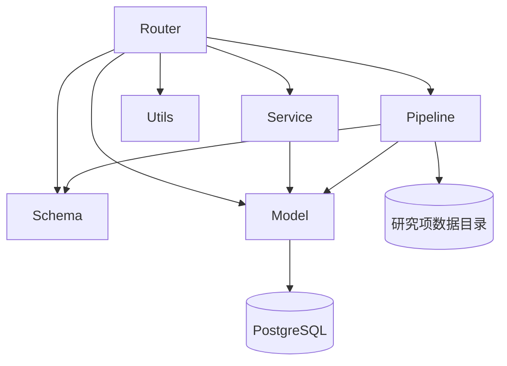
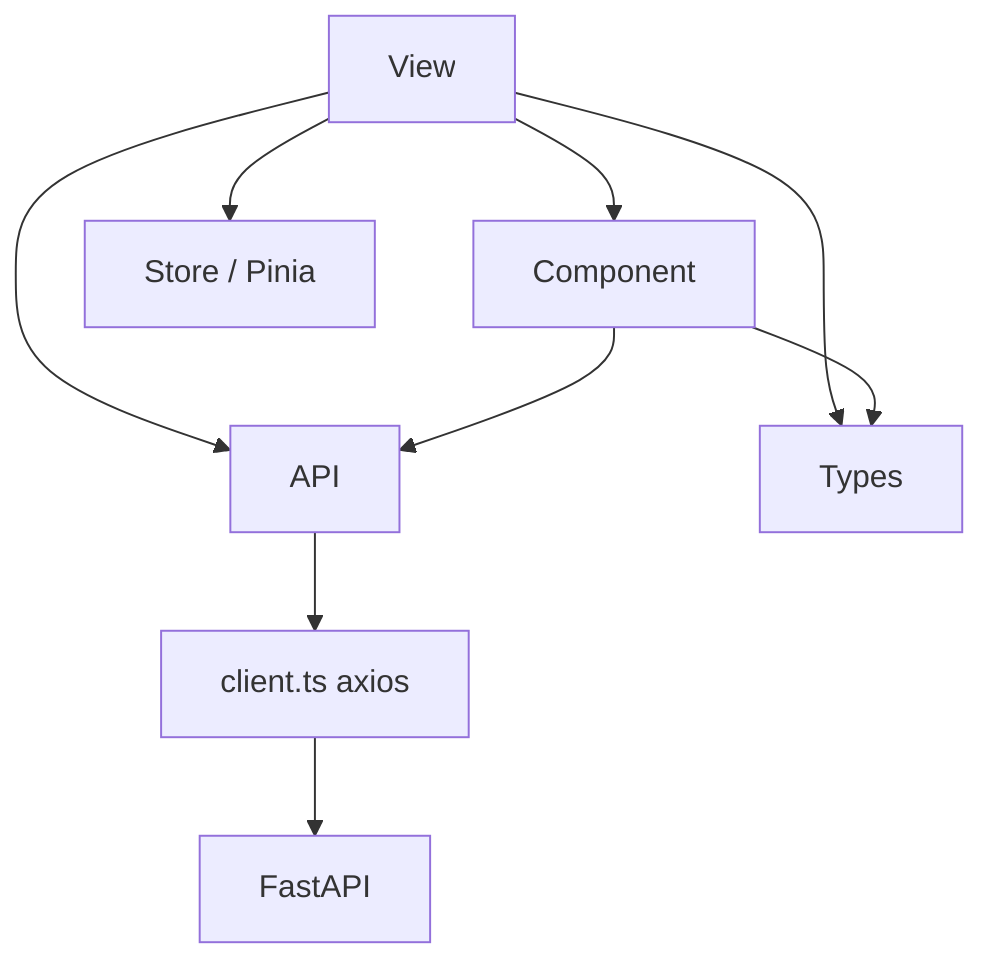

# 2-20 服务分层设计

> 后端按 router / schema / service / model / pipeline / engine / tasks / utils 组织；前端按 view / component / api / store / types 五层组织。本页给出每层的职责、调用方向和反例。后端实现细节见 [7-00 后端架构总览](7-00-后端架构总览.md)。完整目录树见 [2-80 代码工程结构](2-80-代码工程结构.md)。

<div class="elys-meta" markdown>

定位
: 前后端分层结构

代码位置
: `backend/app/{routers,schemas,services,models,pipeline,utils}/` · `frontend/elys-web/src/{views,components,api,stores,types}/`

更新
: 2026-05-21 13:48:30 +08:00

</div>

## 1. 后端分层

| 层 | 目录 | 职责 |
|---|---|---|
| **Router** | `backend/app/routers/` | HTTP 路由、依赖注入、状态码、Authorization 解析 |
| **Schema** | `backend/app/schemas/` | Pydantic 请求 / 响应契约 |
| **Service** | `backend/app/services/` | 跨模块的共享业务逻辑（如研究项访问控制、schema 兼容） |
| **Model** | `backend/app/models/` | SQLAlchemy ORM 实体 |
| **Pipeline** | `backend/app/pipeline/` | 节点规格注册表、LoadData 解析、执行器、Dispatcher、DerivedDatasetStore、缓存、manifest |
| **Engine** | `backend/app/engine/` | EEG 算法实现（io / filters / resample / reference / ica / epoching / erp / analysis） |
| **Task** | `backend/app/tasks/` | Celery 应用与后台任务（celery_app / pipeline_tasks / file_tasks） |
| **Utils** | `backend/app/utils/` | 密码 hash、JWT 编解码等纯工具 |
| **Config** | `backend/app/config.py` | Settings · CORS · 数据目录环境变量 |
| **Database** | `backend/app/database.py` | SQLAlchemy engine / session 构造 |

### 调用方向（自上而下）

<div class="elys-flow" markdown>

后端分层调用方向



</div>

**禁止反向调用**：service / model 不调用 router；utils 不依赖任何业务层；pipeline 节点不直接写 router。

### 当前文件清单

> 仅列分层骨架；完整文件清单（含 9 个 router、~16 个 service、engine/tasks 全部文件、8 个 NodeSpec）见 [2-80 §2](2-80-代码工程结构.md)。

```text
backend/app/
├── main.py              FastAPI app + CORS + UUID 编码 + health；注册 9 router
├── config.py            Settings (pydantic-settings)
├── database.py          SQLAlchemy engine + get_db()
├── routers/             auth(login/refresh/me，无 logout) · dashboard · studies · datasets(资产/采集记录/挂载/文件/导入) · dataset_versions · pipelines
├── schemas/             auth · study · dataset · dataset_lifecycle · derived_dataset · pipeline · dashboard
├── services/            study_access · studies · study_locks · pipeline_execution_rules · execution_dependencies · dataset_assets · dataset_bootstrap · recordings · dataset_qa · dataset_lifecycle · async_tasks · task_events · file_browser · storage · audit_events · dashboard_summary
├── models/
│   ├── user.py          User · Role · Permission
│   ├── role.py          关联表
│   ├── study.py       Study · StudyMember · Subject · Recording · RecordingVersion · DatasetAsset · DatasetVersion · StudyDatasetMount · DatasetFile · PipelineDefinition · PipelineExecution · PipelineJob · AuditEvent（无 Dataset / DatasetUpload）
│   └── derived_dataset.py  DerivedDataset
├── pipeline/            registry · validator · load_data · executor · dispatcher · derived_dataset_store · cache · execution_manifest · background · save_settings · timeseries 等；nodes/*.json 8 个 NodeSpec
├── engine/              io · filters · resample · reference · ica/ · epoching · erp · analysis/
├── tasks/               celery_app · pipeline_tasks · file_tasks
└── utils/
    └── security.py      hash_password · verify_password · JWT
```

## 2. 前端分层

| 层 | 目录 | 职责 |
|---|---|---|
| **View** | `frontend/elys-web/src/views/` | 页面（Vue 3 SFC） |
| **Component** | `frontend/elys-web/src/components/` | 复用组件（`WorkbenchShell` · `BidsUploadPanel` · `LoadDataPanel` · `ObserveTabs` · `TechnicalFold` · `IconLine` · `AppIcon`） |
| **API** | `frontend/elys-web/src/api/` | Axios 客户端 + 接口封装 |
| **Store** | `frontend/elys-web/src/stores/` | Pinia 状态（当前仅 `auth.ts`） |
| **Router** | `frontend/elys-web/src/router/` | Vue Router 配置 + 登录守卫 |
| **Types** | `frontend/elys-web/src/types/` | TypeScript 类型定义（响应 / 请求 / 节点） |
| **Data** | `frontend/elys-web/src/data/` | 静态数据（如 `workbenchPages.ts` 描述静态工作台） |

### 调用方向

<div class="elys-flow" markdown>

前端分层调用方向



</div>

### 当前文件清单（节选）

```text
frontend/elys-web/src/
├── App.vue · main.ts · style.css
├── router/index.ts          路由表（/datasets 含 alias /import）+ 登录守卫
├── stores/auth.ts           token / user / localStorage 持久化
├── api/
│   ├── client.ts            axios 实例 + 401 refresh 拦截
│   ├── auth.ts              login / refresh / me（无 logout）
│   ├── dashboard.ts         /dashboard/summary
│   ├── studies.ts          列表 / 详情 / 创建 / 删除 / 垃圾箱 / 成员
│   ├── datasetAssets.ts     dataset-assets/*（含 recordingApi）
│   ├── datasetVersions.ts   发版 / 撤回审核
│   ├── datasets.ts          挂载 mounts / 上传
│   └── pipelines.ts         NodeSpec / 工作流 CRUD / 校验 / 运行 / LoadData / derived-datasets
├── views/                   21 个页面（详见 6-00）
├── components/
│   ├── WorkbenchShell.vue   工作台壳（顶部 nav + 左侧 nav）
│   ├── BidsUploadPanel.vue  导入组件（宿主 DatasetsPage）
│   ├── LoadDataPanel.vue    LoadData 选择面板
│   ├── ObserveTabs.vue      观察页 tabs
│   ├── TechnicalFold.vue    技术细节折叠
│   ├── IconLine.vue         带图标列表行
│   └── AppIcon.vue          SVG 图标
├── types/index.ts           全部 TS 类型
└── data/workbenchPages.ts   静态工作台元信息
```

## 3. 开发约束

| 约束 | 反例 |
|---|---|
| 共享 schema 放 `schemas/`，**不在 router 中再定义** | router 里写一份临时 `BaseModel`，跨文件重复 |
| 权限检查复用 `services/study_access.py` 的 `require_study_*` | 每个路由抄一遍 `db.query(Study).filter(...).first()` |
| 耗时分析**不要**写在同步 HTTP 路由里 | 在 router 中直接 `mne.io.read_raw_fif(...)` 阻塞请求线程 |
| 节点执行器的输入 / 输出走 `pipeline/` 层，不直接调 model | pipeline 节点直接 `db.commit()` 写表 |
| 前端 API 调用统一走 `api/*.ts`，**不在 view 里写裸 axios** | 在 view setup 中 `axios.get('/api/...')` |
| 前端类型在 `types/index.ts` 一份 | 在多个 view 里各自定义同一个接口形状 |

## 4. 已实现 / 待接 / 不在范围

**已实现**

- ✅ 后端分层（router/schema/service/model/pipeline/engine/tasks/utils）+ 前端 5 层结构定型
- ✅ 研究项权限统一走 `require_study_read / write`
- ✅ 工作流节点注册表 `NodeRegistry` 单例
- ✅ 前端 401 自动 refresh 拦截

**待接（路线图）**

- 🔜 service 层补：`derivative_service` / `result_service`（M3-40 接入执行器时新增）
- 🔜 store 层补：`studies.ts` / `pipelines.ts`（避免 view 自管缓存）
- 🔜 `tests/` 单元 + 集成（当前空白）

**不在本页范围**

- 部署 / 网络拓扑 → [2-10](2-10-部署架构与网络拓扑.md)
- 数据库表 → [3-00](3-00-数据库设计总览.md)
- 完整 API → [2-50](2-50-API设计总览.md)
- 后端实现细节 → [7-00](7-00-后端架构总览.md)
- 工程结构（目录树 + 工具链） → [2-80](2-80-代码工程结构.md)

## 5. 相关页面

- [2-00 系统架构总览](2-00-系统架构总览.md)
- [2-80 代码工程结构](2-80-代码工程结构.md)
- [7-00 后端架构总览](7-00-后端架构总览.md)
- [5-00 研究管理总览](5-00-研究管理总览.md)
