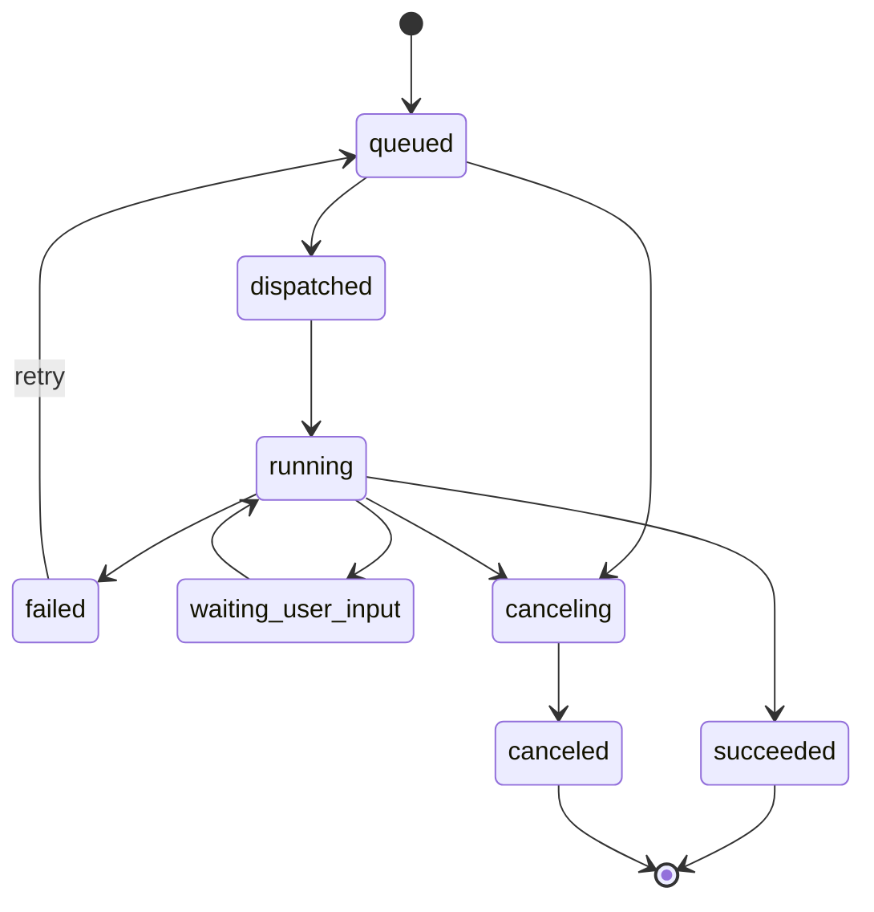
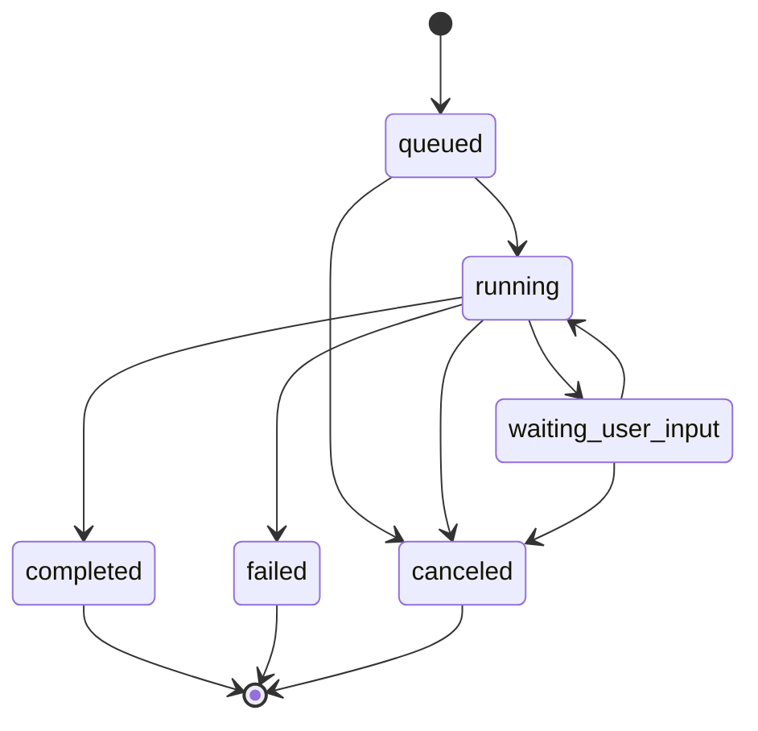
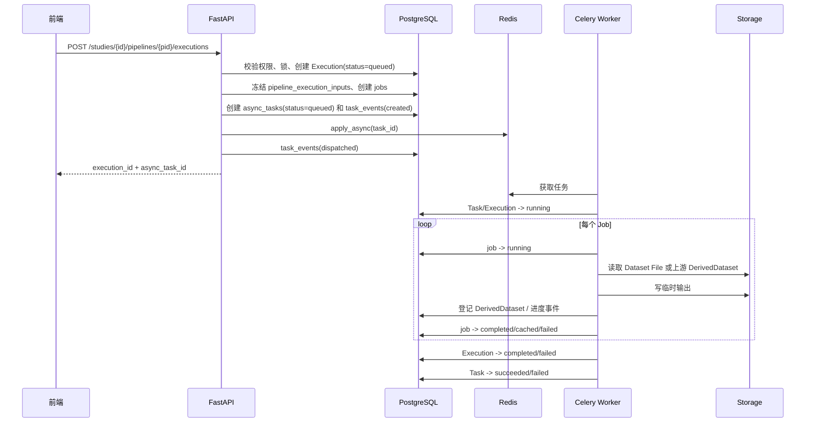
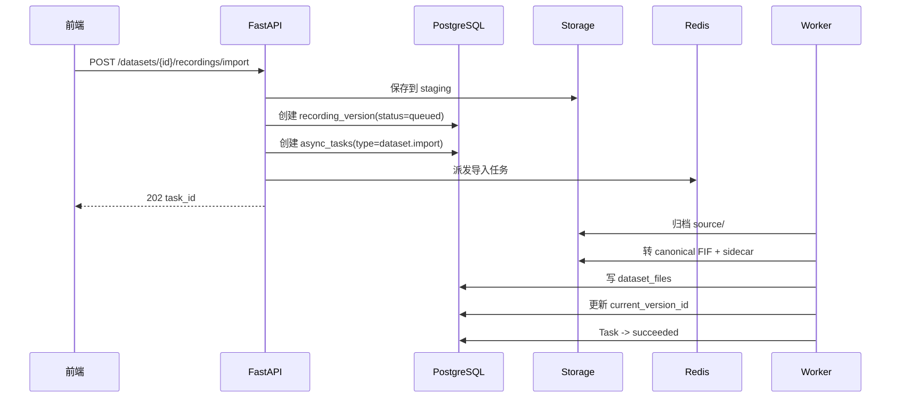

# 2-60 任务队列与异步架构

> 本页是 v2 的异步任务权威设计页。长耗时导入、转换、工作流执行、预览生成、导出和清理都应进入后台任务；HTTP API 只负责创建任务、查询状态、推送事件和做权限控制。

<div class="elys-meta" markdown>

定位
: Celery / Redis / Task / Execution 状态机 / 进度推送 / 并发锁 / 重试取消

事实源
: `backend/app/tasks/celery_app.py` · `tasks/pipeline_tasks.py` · `pipeline/background.py` · `routers/pipelines.py`

代码位置
: `backend/app/tasks/` · `backend/app/pipeline/` · `backend/app/routers/`

更新
: 2026-05-24 +08:00

</div>

## 一句话标准

`Execution` 是业务执行记录，`Task` 是后台调度信封。一个 Pipeline Execution 必须长期可追溯；一个 Celery Task 只是负责把它跑完、重试、取消或恢复。

## 1. 当前现状

当前代码已经不是“全同步”：

| 能力 | 当前状态 |
|---|---|
| Redis / Celery 配置 | <span class="elys-badge elys-badge--wip">部分接入</span>，`celery_app.py` 已配置 broker/backend |
| Pipeline Execution 异步派发 | <span class="elys-badge elys-badge--wip">部分接入</span>，`/pipelines/{id}/executions` 创建 `pipeline_executions(status=queued)` 后派发 Celery |
| Pipeline Worker | <span class="elys-badge elys-badge--wip">部分接入</span>，`run_pipeline_task` 调用 `run_pipeline_execution_sync` |
| 节点级执行记录 | <span class="elys-badge elys-badge--wip">部分接入</span>，已有 `pipeline_jobs` |
| DerivedDataset 写入 | <span class="elys-badge elys-badge--done">已实现基础版</span>，新写入走 Study content-addressed Store |
| Dataset 导入 | <span class="elys-badge elys-badge--wip">同步实现 + 异步入口</span>，真实上传仍在 HTTP 请求线程内完成 |
| Task 持久化表 | <span class="elys-badge elys-badge--done">已落地</span>，`async_tasks` 是后台任务事实源 |
| Task 事件表 | <span class="elys-badge elys-badge--done">已落地</span>，任务创建、派发、运行、完成、失败写入 `task_events` |
| Task 查询 API | <span class="elys-badge elys-badge--done">已实现</span>，`/studies/{study_id}/tasks`、`/{task_id}`、`/{task_id}/events`、`/{task_id}/events/stream` |
| 文件管理任务 | <span class="elys-badge elys-badge--wip">部分接入</span>，`derived_dataset.cleanup` 有实际清理逻辑，导入/构建/重建为任务骨架 |

Task cancel/retry、Execution cancel/retry、Task events/SSE 入口已通过后端测试覆盖。需要注意的是，真实 Celery worker 的长任务协作式取消、浏览器端 SSE 断线重连和 Study 级事件聚合仍属于 staging 与前端体验增强项。
| SSE / WebSocket 进度推送 | <span class="elys-badge elys-badge--wip">部分接入</span>，Task 级 SSE 已有，Study 级聚合流和前端接入待补 |
| 取消、重试、资源配额 | <span class="elys-badge elys-badge--wip">部分接入</span>，Execution cancel/retry 与 Task cancel/retry 基础 API 已有，资源配额待补 |

## 2. 核心边界

| 对象 | 含义 | 生命周期 |
|---|---|---|
| `PipelineExecution / 执行项` | 某个 Pipeline 的一次业务执行，冻结输入、流程快照、参数、Jobs 和输出 | 长期保留 |
| `Task / 后台任务` | 调度系统中的一次工作单元，如运行、导入、转换、清理 | 可重试、可过期、可归档 |
| `PipelineJob / 节点执行记录` | Execution 内单个节点的状态、参数、输入输出和错误 | 跟随 Execution 长期保留 |
| `DerivedDataset / 输出产物` | Execution 或 Job 产生的派生数据集（取代旧 Artifact 概念） | 按保留策略管理 |

关键规则：

- Task 不替代 Execution。
- Execution 不依赖 Celery result backend 作为事实源。
- Celery task id 只是调度引用，不能作为业务主键。
- 用户看到的是 Execution 状态和 Task 进度，不需要理解 worker 进程。

## 3. 标准任务类型

| Task Type | 业务对象 | 队列 | 说明 |
|---|---|---|---|
| `dataset.import` | Dataset / Recording Version | `io` | 上传后归档、识别、登记 |
| `recording.convert` | Recording Version | `io` | 转 canonical FIF 和 sidecar |
| `recording.qc` | Recording Version | `io` | 基础读取校验和摘要 |
| `pipeline_execution` | PipelineExecution | `workflow` | 执行完整 Pipeline（代码中 `task_type` 实际值） |
| `pipeline_execution.resume` | PipelineExecution / PipelineJob | `workflow` | 人工决策后继续执行 |
| `pipeline_execution.retry` | PipelineExecution | `workflow` | 从失败点或新 Execution 重试 |
| `derived_dataset.preview` | DerivedDataset | `preview` | 生成波形、表格、图像预览 |
| `derived_dataset.cleanup` | DerivedDataset | `maintenance` | 清理 temporary/cached 派生数据集 |
| `export.package` | Dataset / Study / Execution | `export` | 导出数据、报告、Execution Manifest |

MVP 已实现 `pipeline_execution` 和文件管理统一任务入口；`derived_dataset.cleanup` 已可用，`dataset.import/raw_bids_build/canonical_fif_rebuild` 目前主要用于登记任务和事件，真实导入替换仍需 staged upload。

## 4. 队列规划

| 队列 | 用途 | 并发建议 |
|---|---|---|
| `workflow` | Pipeline Execution、resume、retry | 低并发，受 CPU/内存限制 |
| `io` | 上传归档、格式转换、基础 QC | 中等并发，受磁盘和网络限制 |
| `preview` | 轻量预览生成 | 中等并发，可快速失败 |
| `export` | 数据包、报告、manifest 导出 | 低并发，避免抢占分析任务 |
| `maintenance` | 缓存清理、垃圾箱清理、索引修复 | 后台低优先级 |

当前代码的 `CELERY_WORKFLOW_QUEUE` 对应标准中的 `workflow` 队列。

## 5. 数据库表

### 5.1 `async_tasks`

当前已新增持久化任务表，不把 Celery backend 当成唯一事实源。

| 字段 | 说明 |
|---|---|
| `id` | UUID，API 返回的 `task_id` |
| `celery_task_id` | Celery 返回的调度 id，可空 |
| `task_type` | 当前 `pipeline_execution`；标准目标可扩展为 `dataset.import` 等 |
| `queue_name` | 目标队列 |
| `status` | 当前约束为 `queued` · `running` · `succeeded` · `failed` · `canceled` · `retrying` |
| `progress` | 0-100 或节点级进度 |
| `resource_kind` / `resource_id` | 关联 Execution、Dataset、DerivedDataset 等 |
| `payload_json` | 任务输入，只放 ID 和小参数 |
| `result_json` / `error_json` | 结果摘要和错误 |
| `idempotency_key` | 幂等键 |
| `created_by` / `created_at` | 创建信息 |
| `started_at` / `finished_at` | 执行时间 |
| `attempt` / `max_attempts` | 重试次数 |

### 5.2 `task_events`

当前已新增追加式事件表，用于轮询、SSE 和审计。

| 字段 | 说明 |
|---|---|
| `id` | 自增或 UUID |
| `task_id` | 所属 Task |
| `event_type` | 当前已写 `created`、`dispatched`、`started`、`succeeded`、`failed`、`dispatch_failed`、`run_canceled`、`canceled` 等；后续扩展节点级事件 |
| `payload_json` | 事件内容 |
| `created_at` | 事件时间 |

### 5.3 `worker_heartbeats`

可选，用于运维显示 worker 是否在线。

| 字段 | 说明 |
|---|---|
| `worker_name` | worker 名称 |
| `queues` | 监听队列 |
| `last_seen_at` | 最后心跳 |
| `status` | `online` · `offline` · `draining` |

## 6. 状态机

### 6.1 Task 状态



### 6.2 Execution 状态



Execution 状态和 Task 状态通常同步，但不完全等价。例如一个 Execution 可以因为人工交互进入 `waiting_user_input`，对应 Task 可能暂停或结束等待下一次 resume。当前 Execution cancel API 已支持取消 `queued`、`running`、`waiting_user_input` Execution，并写入 `task_events`；Task cancel/retry API 已接入基础版。

## 7. Pipeline Execution 异步链路

当前代码已经接近这个链路，标准化后如下：



关键落点：

- API 线程只做创建和派发，不执行重计算。
- Worker 只通过数据库 ID 读取上下文，不接收大 payload。
- Execution 启动前必须冻结 `pipeline_execution_inputs`。
- DerivedDataset 正式发布前先写临时目录，成功后登记数据库。

## 8. Dataset 导入异步链路

标准导入不应让 HTTP 请求一直等待 MNE 转换完成。



MVP 仍保留同步导入；当前已新增 `dataset.import` 异步任务入口，但还没有接管 `UploadFile` 到 worker 的完整 staged upload 协议。

## 9. 进度推送

推荐同时支持轮询和 SSE：

| 方式 | API | 说明 |
|---|---|---|
| 轮询 | `GET /tasks/{task_id}` | 简单可靠，适合列表页 |
| SSE | `GET /tasks/{task_id}/events/stream` | 单向推送进度，适合运行详情页；支持 `since` 和 `Last-Event-ID` |
| WebSocket | 后续可选 | 多任务、协作在线状态更丰富时再引入 |

SSE 事件示例：

```json
{
  "event": "task_event",
  "task_id": "uuid",
  "event_type": "started",
  "progress": 42,
  "message": "ICA started",
  "created_at": "2026-05-21T10:20:00+08:00"
}
```

当前实现使用标准 SSE 文本格式：`id` 为 `task_events.id`，`event` 为 `ready`、`task_event`、`heartbeat` 或 `stream_closed`，`data` 为 JSON。客户端断线重连时可通过 `Last-Event-ID` 或 `?since=<event_id|ISO时间>` 继续读取；普通列表接口 `GET /tasks/{task_id}/events` 也支持 `since` 参数，便于不支持 SSE 的前端先用增量轮询。

## 10. 并发与锁

默认并发规则：

| 范围 | 规则 |
|---|---|
| Pipeline 编辑 | 同一 Pipeline 同时只允许一个 editor 持有编辑锁 |
| Pipeline 运行 | 同一 Pipeline 同时只允许一个 active Execution |
| Study 运行 | 默认允许不同 Pipeline 并行；可配置为同一 Study 只允许一个 active Execution |
| Dataset 导入 | 同一 Recording 同时只允许一个导入/重传任务 |
| DerivedDataset 清理 | 清理前必须检查下游依赖和 pinned/current 状态 |

建议实现：

- `study_locks` 保存业务锁，当前已用于 Pipeline edit lock 和 Pipeline run lock。
- 数据库唯一约束或部分索引防止重复 active Execution。
- Worker 启动任务前再次检查锁和资源状态。
- 锁必须有 `expires_at`，避免异常退出后永久占用。

## 11. 重试、取消和恢复

| 操作 | 规则 |
|---|---|
| 重试 | failed/canceled Execution 可创建新的 retry Execution；普通文件 Task 可从 failed/canceled 创建新 Task；`pipeline_execution` Task retry 内部 dispatch 到 Execution retry，返回新 task |
| 取消 | queued 可直接取消；running 发送 best-effort Celery revoke，worker 在安全点停止 |
| 恢复 | `waiting_user_input` Job 提交 decision 后从该 Job 继续执行 |
| 幂等 | 同一 `Idempotency-Key` 不应创建重复 Execution 或重复导入 |
| 失败记录 | `async_tasks.error_json`、`pipeline_executions.error_json`、`pipeline_jobs.error_json` 都要保留 |

取消不能删除已经产生的 Execution 记录；已经登记的 DerivedDataset 按保留策略处理。

## 12. 缓存与资源控制

节点缓存依据：

```text
job_hash = hash(node_type + node_version + params + input_file_hash + upstream_derived_dataset_hash + software_version)
```

缓存命中时：

- `pipeline_jobs.status='cached'`。
- 新 Execution 可引用已有 DerivedDataset。
- 不重复写大文件。

资源控制建议：

| 控制项 | 说明 |
|---|---|
| worker 并发 | EEG 大文件处理默认低并发 |
| prefetch | `worker_prefetch_multiplier=1`，避免长任务饿死队列 |
| 内存上限 | 大型 FIF/ICA 节点应设置 worker 内存限制 |
| 时间上限 | 单任务 soft/hard timeout |
| 配额 | Study/Dataset 存储配额和运行配额 |

当前 Celery 配置已设置 `worker_prefetch_multiplier=1`，方向是对的。

## 13. 当前代码到标准模型的映射

| 当前代码 | 标准模型 | 调整建议 |
|---|---|---|
| `tasks/celery_app.py` | Celery 应用 | 保留，补多队列配置 |
| `tasks/pipeline_tasks.py::run_pipeline_task` | `pipeline_execution` worker | 已同步 `async_tasks` / `task_events` |
| `pipeline/background.py::run_pipeline_execution_sync` | Worker 内实际执行函数 | 语义是 worker 同步执行单个 Execution |
| `POST /studies/{id}/pipelines/{pid}/executions` | 创建 Execution + Task | 已创建 `async_tasks`，响应仍通过 Execution 结构兼容输出 task id |
| `pipeline_executions.result_json.celery_task_id` | 兼容 Task 关联 | 事实源已迁到 `async_tasks.celery_task_id` |
| Dataset import route | `dataset.import` | 后续从同步导入改为异步导入 |
| File task route | `dataset.import` / `raw_bids_build` / `canonical_fif_rebuild` / `derived_dataset.cleanup` | 已统一进入 `run_file_task` |
| Task 管理接口 | `GET /tasks` / `GET /tasks/{id}` / `GET /tasks/{id}/events` / `POST /tasks/{id}/cancel` / `POST /tasks/{id}/retry` | 当前兼容路径在 `/studies/{study_id}/tasks` |
| Task 事件流 | `task_events` + SSE | 已有事件列表和 Task 级 SSE，Study 级聚合流待补 |

## 14. MVP 落地顺序

1. 已新增 `async_tasks` 和 `task_events`。
2. 已在 Pipeline Execution 创建时同时写 `async_tasks`，不只把 Celery id 塞进 `result_json`。
3. 已新增 Execution 输入快照 `pipeline_execution_inputs`。
4. 已新增 DerivedDataset `retention_status`，让清理有状态。
5. 已新增 Task 列表、详情和事件查询 API。
6. 已新增文件管理任务入口和 `derived_dataset.cleanup` 逻辑清理。
7. 已新增 `POST /pipeline-executions/{execution_id}/cancel`、`POST /pipeline-executions/{execution_id}/retry`、`POST /tasks/{task_id}/cancel` 和 `POST /tasks/{task_id}/retry`。
8. 已新增 Task 级 `GET /tasks/{task_id}/events/stream` SSE 事件流。
9. 后续把 Dataset 导入从同步上传拆成 staged upload + 异步导入。
10. 后续增加 Study 级事件流、导出队列和物理清理队列。

## 15. 不做的事

- 不把 Celery result backend 当业务数据库。
- 不在 Celery payload 中传大文件、Raw 对象或完整数据数组。
- 不让前端直接读写文件路径。
- 不在清理任务里物理删除 current/pinned/downstream-dependent DerivedDataset。
- 不把 QC 状态作为 Pipeline Execution 的硬门槛。

## 16. 相关页面

- [2-50 API 设计总览](2-50-API设计总览.md)
- [7-40 工作流执行与后台任务](7-40-工作流执行与后台任务.md)
- [3-00 数据库设计总览](3-00-数据库设计总览.md)
- [4-00 文件管理总览](4-00-文件管理总览.md)
- [5-00 研究管理总览](5-00-研究管理总览.md)
