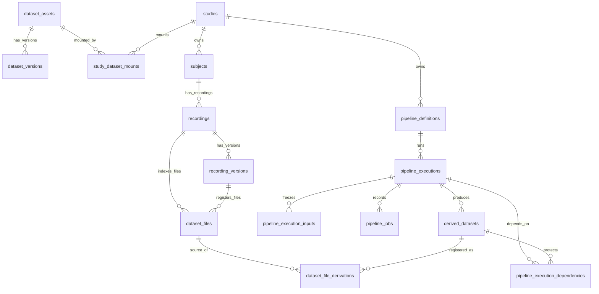

# 3-00 数据库设计总览

> 本页是 v2 数据库设计入口。详细表设计分散到 `3-05` 到 `3-50`，本页只维护总原则、阅读路径和最小落地顺序。

定位
: Dataset / Study / Pipeline / Execution 的数据库设计入口

事实源
: `database/schema/01_auth.sql … 06_async.sql`（拆分后的 6 文件 schema）· `database/init.sql` · `backend/app/models/*.py`

更新
: 2026-06-05 00:00:00 +08:00

## 一句话标准

ELYS 的数据库主干统一为 **Dataset / Study / Pipeline / Execution**：Dataset 管可共享数据资产，Study 管协作与分析空间，Pipeline 管流程定义，Execution 管一次执行的输入快照、流程快照、节点记录和输出索引。当前代码中标准 Dataset 资产落在 `dataset_assets`，一条采集记录及其上传版本则落在 `recordings` / `recording_versions`（「A 重构」后由原 `datasets` / `dataset_uploads` 改名而来的真实主表，无只读兼容视图）。

## 1. 核心原则

| 原则 | 说明 |
|---|---|
| 数据库是事实源 | 当前版本、权限、挂载、运行状态、依赖、保留策略、审计记录都以数据库为准 |
| 文件系统只存大文件 | 原始数据、canonical FIF、sidecar、运行输出、预览图、报告等由 `storage_uri` 指向 |
| Dataset 可以变化，Execution 必须冻结 | working Dataset 可以持续增量上传；Execution 启动时必须解析并保存实际输入清单 |
| Pipeline 不绑定具体文件 | Pipeline 保存节点、连线、默认参数和选择规则；具体数据由 Execution 冻结 |
| 输出文件可清理，Execution 记录不删 | 大文件按策略清理；执行人、时间、输入、参数、错误、输出状态长期保留 |
| QC 不是硬门槛 | QC 用于筛选、提醒和报告可信度；未检查数据也可以进入 Pipeline |
| 发布不是 MVP 核心 | MVP 中 Dataset 默认是 `working/private`；发布、共享、下架治理预留字段但不作为主流程 |

## 2. Schema 文件组织

数据库 DDL 拆为 6 个按业务模块组织的 SQL 文件，文件编号代表加载顺序（受外键依赖约束，不可调整）：

| 文件 | 主题 | 主要表 |
|---|---|---|
| `schema/01_auth.sql` | 用户、角色、权限 | `users` · `roles` · `permissions` · `user_roles` · `role_permissions` |
| `schema/02_studies.sql` | 研究项骨架 | `studies` · `audit_events` · `study_members` · `study_locks` · `study_settings` |
| `schema/03_datasets.sql` | 数据集与文件 | `dataset_assets` · `dataset_versions` · `study_dataset_mounts` · `subjects` · `recordings` · `recording_versions` · `dataset_files` |
| `schema/04_pipelines.sql` | Pipeline 核心 | `pipeline_definitions` · `pipeline_executions` · `pipeline_jobs` |
| `schema/05_derived.sql` | 派生数据与 Execution I/O | `derived_datasets` · `dataset_file_derivations` · `pipeline_execution_inputs` · `pipeline_execution_dependencies` |
| `schema/06_async.sql` | 异步任务 | `async_tasks` · `task_events` |

详细模块视角和数据流见 [3-05 数据库模块与功能关联](3-05-数据库模块与功能关联.md)。

升级线上库的当前策略是 **DROP DATABASE + 重建**，不维护增量 migration，详见 `database/README.md`。

## 3. 对象关系

## 4. 子页阅读路径

| 子页 | 内容 | 何时阅读 |
|---|---|---|
| [3-05 数据库模块与功能关联](3-05-数据库模块与功能关联.md) | 6 个 schema 文件的模块视角、模块间数据流、跨模块查询 | 想理解整体架构、设计新模块时 |
| [3-10 数据库原则与对象关系](3-10-数据库原则与对象关系.md) | 标准表分组、对象关系、命名边界 | 做模型讨论、ER 图调整时 |
| [3-20 Dataset 与采集记录表](3-20-Dataset与采集记录表.md) | `dataset_assets`、`recordings`、`recording_versions`、`dataset_files`、选择器索引 | 改导入、重传、数据选择器时 |
| [3-30 Study 与 Pipeline 表](3-30-Study与Pipeline表.md) | `studies`、`study_members`、`study_dataset_mounts`、`pipelines`、`pipeline_versions` | 改研究项、成员、挂载、工作流定义时 |
| [3-40 Execution 与 Artifact 追溯表](3-40-Execution与Artifact追溯表.md) | `pipeline_executions`、`pipeline_execution_inputs`、`pipeline_jobs`、依赖和分析结果 | 改执行、缓存、输出、追溯时 |
| [3-45 DerivedDataset](3-45-DerivedDataset.md) | `derived_datasets` 详细字段、生命周期、retention 策略 | 改派生数据登记、清理策略时 |
| [3-50 协作权限、状态与迁移](3-50-协作权限状态与迁移.md) | 审计、行为、锁、状态枚举、角色权限、当前代码映射、MVP 落地顺序 | 改权限、清理、迁移或命名时 |

## 5. 标准表分组

| 分组 | 当前实际表 | 所属 schema 文件 | 维护页 |
|---|---|---|---|
| 账号权限 | `users` · `roles` · `permissions` · `user_roles` · `role_permissions` | `01_auth.sql` | [3-50](3-50-协作权限状态与迁移.md) |
| 数据资产 | `dataset_assets` · `dataset_versions` | `03_datasets.sql` | [3-20](3-20-Dataset与采集记录表.md) |
| 采集记录 | `recordings` / `recording_versions` 真实主表（由原 `datasets` / `dataset_uploads` 改名而来，无兼容视图） | `03_datasets.sql` | [3-20](3-20-Dataset与采集记录表.md) |
| 文件索引 | `dataset_files` · `dataset_file_derivations` | `03_datasets.sql` · `05_derived.sql` | [3-20](3-20-Dataset与采集记录表.md) · [4-70](4-70-文件角色URI与追溯关系.md) |
| 研究项 | 标准语义 `studies`；当前表 `studies` · `study_members` · `study_dataset_mounts` · `study_settings` · `study_locks` | `02_studies.sql` · `03_datasets.sql` | [3-30](3-30-Study与Pipeline表.md) |
| 工作流 | `pipeline_definitions` | `04_pipelines.sql` | [3-30](3-30-Study与Pipeline表.md) |
| 执行项 | `pipeline_executions` · `pipeline_jobs` · `pipeline_execution_inputs` · `pipeline_execution_dependencies` | `04_pipelines.sql` · `05_derived.sql` | [3-40](3-40-Execution与Artifact追溯表.md) |
| 输出产物 | `derived_datasets` | `05_derived.sql` | [3-45](3-45-DerivedDataset.md) |
| 异步任务 | `async_tasks` · `task_events` | `06_async.sql` | [2-60 任务队列](2-60-任务队列与异步架构.md) |
| 协作治理 | `audit_events` · `study_locks` | `02_studies.sql` | [3-50](3-50-协作权限状态与迁移.md) |

## 6. 当前落地快照

| 能力 | 当前状态 |
|---|---|
| Schema 文件组织 | 拆为 `schema/01_auth.sql` 至 `06_async.sql` 6 个模块文件 |
| 升级策略 | DROP DATABASE + 重建（不维护增量 migration）|
| Dataset 资产 | 已落表 `dataset_assets`，并有 `/api/v1/dataset-assets` |
| Dataset 版本 | 已落表 `dataset_versions`（每个 asset 默认有 `working` 版本）|
| Study 挂载 Dataset | 已落表 `study_dataset_mounts`，不复制文件 |
| Recording 真实主表 | 「A 重构」已完成改名：`datasets` / `dataset_uploads` → `recordings` / `recording_versions`，无兼容视图 |
| 文件统一索引 | 已落表 `dataset_files`，新导入和 backfill 双写 raw/canonical/sidecar |
| 文件派生关系 | 已落表 `dataset_file_derivations` |
| Pipeline 定义 | 已落表 `pipeline_definitions`，支持版本和模板 |
| Execution 输入快照 | 已落表 `pipeline_execution_inputs`，Execution 创建时冻结 LoadData 解析结果 |
| Execution manifest | 已落表 `pipeline_executions.manifest_json`，文件写入 Study executions 目录 |
| Execution 依赖 | 已落表 `pipeline_execution_dependencies`，上游派生数据输入会自动写依赖 |
| 派生数据登记 | 已落表 `derived_datasets` |
| 后台任务事实源 | 已落表 `async_tasks` / `task_events`，并有 Task 查询、取消、重试和事件流 API |
| 协作锁与审计 | 已落表 `study_locks` / `audit_events`，Pipeline Execution 已接入运行锁 |
| 状态拼写 | 统一为 `canceled` |

## 7. 后续迁移重点

1. 为 `async_tasks` / `task_events` 增加 Study 级聚合 SSE（Server-Sent Events，服务器单向推送事件流）和前端接入。
2. 为派生数据增加 pin/unpin（钉住 / 取消钉住，标记某派生数据不被自动清理）的产品级操作；cleanup 已有基础逻辑。
3. 将真实 Dataset 异步导入从任务骨架推进到 staged upload（分片暂存上传，先把大文件落到暂存区再由后台 worker 处理）+ worker 处理。

## 8. 相关页面

- [3-05 数据库模块与功能关联](3-05-数据库模块与功能关联.md) — 6 模块详解 + 数据流
- [2-50 API 设计总览](2-50-API设计总览.md)
- [2-60 任务队列与异步架构](2-60-任务队列与异步架构.md)
- [4-00 文件管理总览](4-00-文件管理总览.md)
- [5-00 研究管理总览](5-00-研究管理总览.md)
