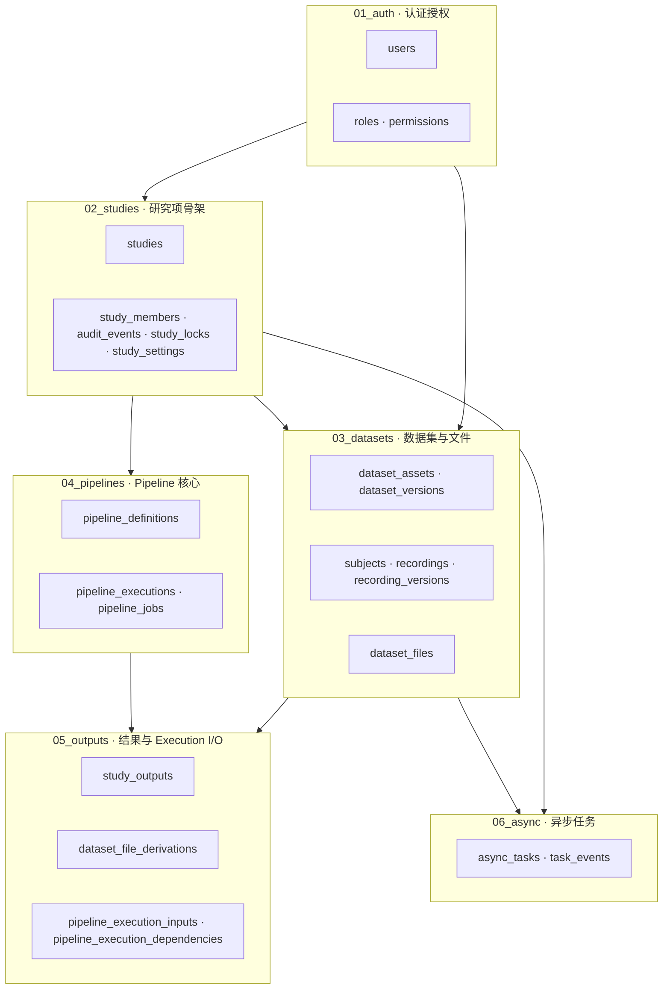

# 3-05 数据库模块与功能关联

> 本页以 6 个 schema 文件为模块视角，描述各模块的职责、表清单、模块间数据流和典型查询路径。是"3-00 总览"的纵深补充。

<div class="elys-meta" markdown>

定位
: 数据库的"模块视角"——以业务功能聚合表，讲清楚数据如何在模块间流动

事实源
: `database/schema/01_auth.sql … 06_async.sql` · `backend/app/models/*.py`

更新
: 2026-06-05 00:00:00 +08:00

</div>

## 1. 模块全景

6 个 schema 文件按"加载顺序 = 依赖顺序"组织，下游模块的表只能引用上游模块的表，不允许反向引用。



**为什么 05_outputs 单独成模块**：`study_outputs`、`pipeline_execution_inputs`、`pipeline_execution_dependencies` 都同时依赖 `pipeline_executions`（在 04）和 `dataset_files` / `study_outputs` 自身（循环引用要在 study_outputs 之后才能建表），所以它们必须在 04 之后加载。把它们聚合成一个"派生与 I/O"模块。

## 2. 模块 1：`01_auth.sql` 认证授权

### 职责

平台级身份与权限——**只管"谁是 ELYS 用户、有什么平台角色、能调用哪些受权限保护的 API"**，不管研究项内细粒度授权（研究项内授权在 `02_studies.sql` 的 `study_members`）。

### 表清单

| 表 | 主键 | 说明 |
|---|---|---|
| `users` | `id` UUID | 平台用户，含 username / password_hash / institution / is_active |
| `roles` | `id` SERIAL | 平台角色，当前 seed 只有 `admin` / `pi` 两个（`researcher` / `reviewer` 已在 seed 中显式删除）|
| `permissions` | `id` SERIAL | 平台权限码，「资源:动作」格式（如 `study:read`、`study:write`、`pipeline:write`、`data:read`），不存在 `create` / `execute` 这类动词权限 |
| `user_roles` | (user_id, role_id) | 用户 ↔ 角色多对多 |
| `role_permissions` | (role_id, permission_id) | 角色 ↔ 权限多对多 |

### 关键关系

```
users  ──┬──< user_roles >──┬── roles  ──┬──< role_permissions >──┬── permissions
         │                  │            │                        │
         (一个用户多个角色)   (一个角色多个权限)
```

### 谁会读它

- 几乎所有 backend 路由：每个请求都要做 `User.has_permission("xxx")` 检查
- 全部下游模块的外键引用 `users.id`（actor_id / owner_id / created_by 等）

### Seed 来源

- `seeds/01_roles_permissions.sql` — 系统角色和权限映射
- `seeds/02_dev_users.sql` — MVP 测试账号（init.sql 加载，init_core.sql 不加载）

## 3. 模块 2：`02_studies.sql` 研究项骨架

### 职责

提供"研究项"这个容器——所有数据集、Pipeline、运行、协作、审计、锁都挂在研究项之下。**`study_id`（12 位 `YYYYMM + 6 位序号`）是几乎所有业务表的逻辑分区键**。

### 表清单

| 表 | 主键 | 说明 |
|---|---|---|
| `study_id_counters` | yyyymm | 每月一行，记录序号；由 `next_study_id()` 函数维护 |
| `studies` | `id` CHAR(12) | 研究项主表，含 status (active/archived/trashed) / owner / data_root / 软删除字段 |
| `audit_events` | `id` UUID | 通用审计事件，scope=study/system，支持任意 resource；研究项硬删除事件通过 `event_scope=study` + `snapshot` 字段保留 |
| `study_members` | `id` UUID | 研究项内成员（owner/editor/viewer + 5 个 can_xxx 布尔）|
| `study_locks` | `id` UUID | 编辑锁 / 运行锁（resource_kind + resource_id + lock_type）|
| `study_settings` | `study_id` | 每个研究项一行，存默认数据选择器、运行策略、保留策略、存储策略（4 个 JSONB）|

### 关键函数

- `next_study_id()` — 原子地生成 `YYYYMM + LPAD(seq, 6, '0')` 的 12 位 ID

### 数据流：创建研究项

```
POST /api/v1/studies (用户 = users.id)
  ↓
INSERT INTO studies (id=next_study_id(), owner_id=user.id, ...)
  ↓
INSERT INTO study_members (study_id, user_id=owner, role='owner', can_*=TRUE)
  ↓
INSERT INTO study_settings (study_id, ...)  -- 4 个默认 JSONB
  ↓
INSERT INTO audit_events (action='study.create', actor_id=user.id, study_id=..., metadata=...)
```

### 谁会读它

- 所有下游 03/04/05/06 模块的 `study_id` 外键
- 路由层的研究项访问控制（`study_access.py` 通过 `study_members` 判断权限）
- 锁服务（运行 Pipeline 前要 `study_locks` 抢锁）

## 4. 模块 3：`03_datasets.sql` 数据集与文件

### 职责

**所有"原始数据"层的事实源**——EEG 文件的资产、版本、subject、采集记录（recording）、记录的上传版本、文件物理位置。不含 Pipeline 产出的结果（那是 05）。

### 表清单

| 表 | 主键 | 说明 |
|---|---|---|
| `dataset_assets` | `id` UUID | 数据集资产（可跨研究项挂载，相当于"数据集本体"）|
| `dataset_versions` | `id` UUID | 资产的版本（默认有 `working` 版本，发布版从这里追踪）|
| `study_dataset_mounts` | `id` UUID | 研究项 ↔ 数据集资产的挂载关系，含选择规则 JSONB |
| `subjects` | `id` UUID | 受试者（BIDS 的 `sub-XXX`），按研究项隔离 |
| `recordings` | `id` UUID | 采集记录——一条 BIDS `subject/session/task/run` 单元（按 subject/session/task/run 唯一），含 `current_version_id` 指向当前版本 |
| `recording_versions` | `id` UUID | 采集记录的上传/重传版本（多个版本，1 个 `status='current'`）|
| `dataset_files` | `id` UUID | **文件统一索引**——一行 = 一个物理文件 + 角色 + storage_uri + sha256，外键挂 `recording_id` + `recording_version_id` |

### 命名说明

`recordings` / `recording_versions` 是「A 重构」（2026-06-04）后的真实主表，由原 `datasets` / `dataset_uploads` 改名而来。backend 的 `Recording` / `RecordingVersion` ORM 类直接映射到这两张真实表，读写都走它们；旧表名与任何只读兼容视图均已不存在（调试期直接 DROP 重建，无迁移）。

### 关键关系

```
dataset_assets ──< dataset_versions     (每个 asset 有多版本)
       │
       ├──< study_dataset_mounts >── studies  (跨研究项挂载关系)
       │
       └──< recordings ──< recording_versions ──< dataset_files
                                                      │
                                                      └──< dataset_files (source_file_id)  自引用派生
```

### 文件角色（dataset_files.file_role）

| 角色 | 含义 |
|---|---|
| `original_upload` | 用户原始上传的文件 |
| `raw_bids_data` / `raw_bids_eeg_json` / `raw_bids_channels` / `raw_bids_events` | BIDS 规范的逻辑视图 |
| `canonical_fif` | 系统转换出的标准 FIF 文件（Pipeline 实际读取的物理形态）|
| `raw_source` / `sidecar` | 兼容旧导入流程 |

### 数据流：上传一个 EDF 文件

```
1. 用户上传 EDF → backend 把文件存到 /mnt/elys_data/studies/{pid}/source_uploads/...
2. INSERT INTO recordings (subject_id, task, run, source_path, source_format='edf', ...)
3. INSERT INTO recording_versions (recording_id, version_seq=1, source_main_file=..., status='current')
4. INSERT INTO dataset_files (recording_id, recording_version_id, file_role='original_upload', storage_uri='elys://studies/{study_id}/...', sha256=...)
5. backend 转换 EDF → FIF
6. INSERT INTO dataset_files (file_role='canonical_fif', source_file_id=上一步原始文件.id, ...)
7. INSERT INTO dataset_file_derivations (source_file_id=原始, derived_file_id=FIF, derivation_kind='canonical_fif')
8. UPDATE recordings SET current_version_id = 第3步的id, fif_path=...
```

### 谁会读它

- 文件浏览器路由（`file_browser.py`）
- Pipeline 的 LoadData 节点（按 `study_dataset_mounts.selection_json` 解析出实际 `dataset_files` 清单）
- `dataset_bootstrap.py`（`POST /api/v1/dataset-assets/bootstrap` 背后）自动创建 `dataset_assets` + 默认 `working` 版本的 `dataset_versions`，并建立配套 Study 与 `study_dataset_mounts` 挂载

## 5. 模块 4：`04_pipelines.sql` Pipeline 核心

### 职责

**Pipeline 的"定义"和"执行骨架"**——保存流程结构（节点+连线+参数）、执行的元信息和状态、每个节点运行的状态/输入输出哈希。不含运行的实际输入快照（那在 05 的 `pipeline_execution_inputs`）和运行的输出产物（那在 05 的 `study_outputs`）。

### 表清单

| 表 | 主键 | 说明 |
|---|---|---|
| `pipeline_definitions` | `id` SERIAL | Pipeline 定义，含 `definition_json`（节点+连线）+ version + is_template |
| `pipeline_executions` | `id` UUID | 一次执行，含 status / definition_snapshot / manifest_json / save_policy |
| `pipeline_jobs` | `id` UUID | 运行中每个节点一行，含 status / params_hash / node_hash / log_tail / duration_ms |

### 关键字段

#### `pipeline_executions`

| 字段 | 枚举 | 说明 |
|---|---|---|
| `status` | queued / running / waiting_user_input / completed / failed / canceled | Execution 状态机 |
| `save_policy` | temporary / current / pinned / discard | 决定输出 `study_outputs.retention_status` 的初值 |
| `definition_snapshot` JSONB | — | Execution 启动时冻结的 Pipeline 定义 |
| `manifest_json` JSONB | — | 执行清单摘要（完整文件可写入 Study executions/{execution_id}/execution_manifest.json）|

#### `pipeline_jobs`

| 字段 | 说明 |
|---|---|
| `node_id` / `node_type` / `node_title` | 节点身份 |
| `topo_index` | 拓扑顺序，控制执行/展示顺序 |
| `input_hash` / `params_hash` / `node_hash` | 缓存复用与变更检测 |
| `trace_code` | 错误追踪码 |
| `log_tail` | 最后 N 行日志（完整日志走文件）|

### 数据流：启动一次 Execution

```
POST /api/v1/studies/{study_id}/pipelines/{pipeline_id}/executions
  ↓
1. 抢运行锁：INSERT INTO study_locks (study_id, resource_kind='pipeline', resource_id=pipeline_id, lock_type='execution')
2. 解析输入选择器（读 study_dataset_mounts, recordings, dataset_files）
3. INSERT INTO pipeline_executions (status='running', definition_snapshot=..., manifest_json=...)
4. INSERT INTO pipeline_execution_inputs (...) × N  -- 冻结实际输入（见 05）
5. 按拓扑序遍历节点：
   ├─ INSERT INTO pipeline_jobs (status='running', topo_index=k, node_hash=...)
   ├─ 执行节点 → 写入 study_outputs（见 05）
   └─ UPDATE pipeline_jobs SET status='completed', duration_ms=..., output_json=...
6. UPDATE pipeline_executions SET status='completed', finished_at=NOW()
7. 释放运行锁：UPDATE study_locks SET released_at=NOW()
8. INSERT INTO audit_events (action='pipeline.execution.completed', ...)
```

### 谁会读它

- Pipeline 编辑器读 `pipeline_definitions.definition_json`
- 运行历史页读 `pipeline_executions` + JOIN `pipeline_jobs`
- 缓存复用判断：`node_hash` 命中则跳过节点执行
- Dashboard 聚合统计

## 6. 模块 5：`05_outputs.sql` 结果与 Execution I/O

### 职责

**Pipeline 运行的"输入快照"和"输出登记"**——把 04 模块的运行（pipeline_executions）和 03 模块的文件（dataset_files）串起来。本模块的所有表都同时引用 04 和 03，所以必须最后加载。

### 表清单

| 表 | 主键 | 说明 |
|---|---|---|
| `study_outputs` | `id` UUID | **输出统一表**——Pipeline 各节点产出的文件登记于此 |
| `dataset_file_derivations` | `id` UUID | 文件级派生关系（source_file → derived_file，可关联 execution 和 study_output）|
| `pipeline_execution_inputs` | `id` UUID | Execution 创建时冻结的输入清单（每个 LoadData 解析出的输入一行）|
| `pipeline_execution_dependencies` | `id` UUID | 跨 Execution 的依赖关系（A 的输入用了 B 的输出 → 写一行）|

### `study_outputs` 关键字段

| 分组 | 字段 | 说明 |
|---|---|---|
| 来源追溯 | `produced_by_execution_id` · `produced_by_job_id` · `produced_by_node_id` · `produced_by_node_type` · `produced_by_params` · `upstream_dataset_ids` · `upstream_recording_ids` | 谁产生的、用什么参数、上游是谁 |
| 数据语义 | `data_type` · `subject_id` · `bids_subject_id` · `session` · `task` · `run_label` · `condition` | 这条结果的"业务身份" |
| 用户层面 | `display_name` · `description` · `tags` | UI 展示和分类 |
| 物理存储 | `storage_uri` · `logical_path` · `file_role` · `file_size` · `sha256` · `mime_type` | 物理文件位置 |
| 生命周期 | `retention_status` · `retention_expires_at` · `deleted_at` | current/pinned/cached/temporary/deleted/quarantined |
| 预览索引 | `preview_json` | 缓存预览图、统计摘要等 |

### `pipeline_execution_inputs` 设计哲学

**Execution 创建时冻结的快照，不依赖后续 dataset_files 当前值。** 即使后续数据集被重传/重命名/删除，本表的 `storage_uri` / `logical_path` / `file_role` 仍然保留 Execution 启动时的实际值。这是"Pipeline 不绑定具体文件、Execution 必须冻结输入"原则的物理实现。

`input_kind` 枚举：
- `selector` — LoadData 节点的选择规则（保存 `selector_json`）
- `dataset_file` — 解析后的具体文件
- `dataset` — 整个 dataset 级别
- `upstream_dataset` — 引用上游 Execution 产出（写 `upstream_dataset_id`，同时写一行 `pipeline_execution_dependencies`）

### 数据流：节点产出结果

```
节点执行完成 → 输出文件按内容寻址写到 studies/{study_id}/outputs/{sha256[:2]}/{sha256}/...
  ↓
INSERT INTO study_outputs (
    produced_by_execution_id, produced_by_job_id, produced_by_node_id,
    data_type, subject_id, bids_subject_id, session, task,
    storage_uri='elys://studies/{study_id}/outputs/...',
    sha256, file_size,
    retention_status = pipeline_executions.save_policy  -- 继承本次 Execution 的保留策略
)
  ↓ (如果输出文件需要登记到 dataset_files 统一索引)
INSERT INTO dataset_files (file_role='derived_xxx', ...)
INSERT INTO dataset_file_derivations (source_file_id=输入文件, derived_file_id=新文件, execution_id, study_output_id)
```

### 数据流：跨 Execution 依赖

```
Execution B 的 LoadData 引用了 Execution A 产出的 study_output
  ↓
INSERT INTO pipeline_execution_inputs (execution_id=B, input_kind='upstream_dataset', upstream_dataset_id=A_derived_id, upstream_execution_id=A)
  ↓
INSERT INTO pipeline_execution_dependencies (execution_id=B, depends_on_execution_id=A, upstream_dataset_id=A_derived_id, dependency_kind='upstream_execution')
  ↓
这一行保护 A 的结果不被 cleanup（ON DELETE RESTRICT）
```

### 谁会读它

- 结果浏览页（按 `produced_by_execution_id` / `subject_id` / `data_type` / `tags` 筛选）
- Cleanup 任务（按 `retention_status` + `retention_expires_at` 删除）
- 依赖追溯页（按 `pipeline_execution_dependencies` 渲染谱系图）
- LoadData 节点（按 `pipeline_execution_inputs` 重放历史 Execution）

## 7. 模块 6：`06_async.sql` 异步任务

### 职责

**所有"后台异步执行"的事实源**——Celery 任务、长任务、定时任务都先在这里登记一行，状态变化以事件流形式追加。前端通过这里查询任务进度和取消任务。

### 表清单

| 表 | 主键 | 说明 |
|---|---|---|
| `async_tasks` | `id` UUID | 一个异步任务一行，含 celery_task_id / task_type / status / progress / payload_json / result_json / error_json / idempotency_key |
| `task_events` | `id` UUID | 任务的状态变更事件流（type / status / progress / message）|

### `async_tasks.status` 状态机

```
queued → running → succeeded
              ├──→ failed
              ├──→ canceled
              └──→ retrying → running (重试)
```

### `async_tasks.task_type` 典型值

> 代码侧任务名用下划线（见 `backend/app/tasks/file_tasks.py`）：
- `dataset_import` — 导入 EDF/BDF → FIF 转换
- `pipeline_execution` — Pipeline 后台运行
- `study_output_cleanup` — 清理过期 study_outputs
- `raw_bids_build` — 构建 raw_bids 逻辑视图
- `canonical_fif_rebuild` — 重建 canonical FIF

### 数据流：用户触发一个任务

```
POST /api/v1/studies/{study_id}/recordings/import-task (file=...)
  ↓
1. INSERT INTO async_tasks (task_type='dataset.import', status='queued', payload_json=...)
2. Celery enqueue → INSERT INTO task_events (event_type='enqueued')
3. Worker 拉取 → UPDATE async_tasks SET status='running' + INSERT task_events
4. 进度回调 → UPDATE async_tasks SET progress=X + INSERT task_events (event_type='progress')
5. 完成 → UPDATE async_tasks SET status='succeeded', result_json=...
         + INSERT task_events (event_type='succeeded')
```

### 谁会读它

- 前端 Task Center / 进度条
- SSE 推送（订阅 task_events 流）
- 重试机制（attempt / max_attempts）
- 幂等性检查（idempotency_key）

## 8. 跨模块查询场景

### 场景 A：列出某用户能看到的所有结果

```sql
SELECT dd.*
FROM study_outputs dd
JOIN studies p ON p.id = dd.study_id
JOIN study_members pm ON pm.study_id = p.id
WHERE pm.user_id = $1
  AND pm.can_read = TRUE
  AND dd.retention_status != 'deleted'
ORDER BY dd.created_at DESC;
```

涉及模块：05 ← 02 ← (隐式) 01

### 场景 B：追溯一个结果的完整谱系

```sql
WITH RECURSIVE lineage AS (
    SELECT dd.id, dd.produced_by_execution_id, dd.upstream_dataset_ids
    FROM study_outputs dd
    WHERE dd.id = $1
    UNION ALL
    SELECT parent.id, parent.produced_by_execution_id, parent.upstream_dataset_ids
    FROM study_outputs parent
    JOIN lineage child ON parent.id::text = ANY(SELECT jsonb_array_elements_text(child.upstream_dataset_ids))
)
SELECT * FROM lineage;
```

涉及模块：05（自引用追溯）

### 场景 C：检查某 Execution 的实际输入文件还在不在

```sql
SELECT pri.storage_uri, pri.file_role, pri.logical_path,
       df.id AS current_file_id,
       df.storage_uri AS current_uri
FROM pipeline_execution_inputs pri
LEFT JOIN dataset_files df ON df.id = pri.dataset_file_id
WHERE pri.execution_id = $1
  AND pri.input_kind = 'dataset_file';
-- df.id IS NULL 表示文件已删除
-- df.storage_uri != pri.storage_uri 表示文件被移动
```

涉及模块：05 ← 03

### 场景 D：找出占空间最大的 cached 结果

```sql
SELECT dd.id, dd.display_name, dd.file_size, dd.created_at,
       p.code AS study_code
FROM study_outputs dd
JOIN studies p ON p.id = dd.study_id
WHERE dd.retention_status = 'cached'
  AND dd.deleted_at IS NULL
ORDER BY dd.file_size DESC NULLS LAST
LIMIT 50;
```

涉及模块：05 ← 02

## 9. ORM 映射对照

| Schema 表 | Backend ORM 类 | 文件 |
|---|---|---|
| `users` | `User` | `models/user.py` |
| `roles` / `permissions` / `user_roles` / `role_permissions` | `Role` / `Permission` / `UserRole` / `RolePermission` | `models/role.py` |
| 02 模块全部表 | `Study` / `AuditEvent` / `StudyMember` / `StudyLock` / `StudySettings` | `models/study.py` |
| 03 模块全部表 | `DatasetAsset` / `DatasetVersion` / `StudyDatasetMount` / `Subject` / `Recording` / `RecordingVersion` / `DatasetFile` | `models/study.py` |
| 04 模块全部表 | `PipelineDefinition` / `PipelineExecution` / `PipelineJob` | `models/study.py` |
| `study_outputs` | `StudyOutput` | `models/study_output.py` |
| 05 模块其余表 | `DatasetFileDerivation` / `PipelineExecutionInput` / `PipelineExecutionDependency` | `models/study.py` |
| 06 模块全部表 | `AsyncTask` / `TaskEvent` | `models/study.py` |

**注意**：ORM 中所有名为 `metadata` 的 JSONB 列都通过 `Column("metadata", JSONB, ...)` 重命名为 `metadata_json`，避开 SQLAlchemy `metadata` 保留字。

## 10. 相关页面

- [3-00 数据库设计总览](3-00-数据库设计总览.md) — 入口和原则
- [3-10 数据库原则与对象关系](3-10-数据库原则与对象关系.md) — 抽象对象关系
- [3-20 Dataset 与采集记录表](3-20-Dataset与采集记录表.md) — 03 模块字段细节
- [3-30 Study 与 Pipeline 表](3-30-Study与Pipeline表.md) — 02/04 模块字段细节
- [3-40 Execution 与 Artifact 追溯表](3-40-Execution与Artifact追溯表.md) — 04/05 模块字段细节
- [3-45 StudyOutput](3-45-StudyOutput.md) — study_outputs 深入
- [4-70 文件角色 URI 与追溯关系](4-70-文件角色URI与追溯关系.md) — dataset_files 角色和派生关系
- [2-60 任务队列与异步架构](2-60-任务队列与异步架构.md) — 06 模块的应用层使用
- 仓库内 `database/README.md` — 物理 schema 文件的初始化与升级流程
