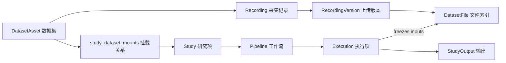

# 3-10 数据库原则与对象关系

> 本页维护数据库层的总原则、逻辑对象关系和表分组。具体字段见后续 `3-20` 到 `3-50`。

定位
: 数据库对象关系与设计边界

更新
: 2026-06-05 00:00:00 +08:00

## 1. 设计原则

| 原则 | 说明 |
|---|---|
| DB 管事实 | 身份、状态、关系、权限、版本、输入输出和审计都以 PostgreSQL 为准 |
| 文件只存 blob | 大文件放文件系统或对象存储，数据库保存 `storage_uri`、hash、大小、角色和状态 |
| working 可变 | 数据资产（`dataset_assets`）的 working 版本可以持续追加采集记录、重传上传版本 |
| Execution 不可变 | Execution 启动后冻结实际输入、Pipeline 版本、参数和输出索引 |
| 动态选择变静态快照 | Pipeline 可以保存选择规则，Execution 必须保存解析后的具体输入 |
| 记录长期保留 | Execution、审计、输入快照长期保留；大文件按策略清理 |

## 2. 逻辑对象

| 对象 | 中文 | 数据库责任 |
|---|---|---|
| `DatasetAsset` | 数据集（数据资产） | 数据资产本体、权限、状态、元数据；表 `dataset_assets` |
| `Recording` | 采集记录 | `subject/session/task/run` 级别的数据记录；表 `recordings` |
| `RecordingVersion` | 上传版本 | 一条采集记录的上传、重传或转换版本；表 `recording_versions` |
| `DatasetFile` | 数据文件索引 | raw source、canonical FIF、sidecar、QC 报告的索引；表 `dataset_files` |
| `Study` | 研究项 | 协作空间、成员、挂载数据资产、配置 |
| `Pipeline` | 工作流 | 流程身份、版本、模板标记（「当前认可结果」无专用指针列，由 `study_outputs.retention_status='current'` 反查，见 [3-30](3-30-Study与Pipeline表.md)） |
| `Execution` | 执行项 | 一次执行记录、输入快照、节点记录、输出索引 |
| `StudyOutput` | 输出 | clean raw、epochs、ERP、图表、报告、缓存等产物索引 |

## 3. 关系图

## 4. DatasetAsset 与 Study 关系

数据库层把数据资产（`DatasetAsset`）和 Study 拆成两个稳定事实源：

| 关系 | 说明 |
|---|---|
| DatasetAsset owns Recording / Version / File | 数据资产负责采集记录、上传版本和文件索引 |
| Study owns Member / Setting / Pipeline / Execution | Study 负责协作、默认策略、工作流和执行历史 |
| `study_dataset_mounts` connects both | Study 通过挂载关系引用数据资产，不复制其文件 |
| `pipeline_execution_inputs` freezes facts | Execution 启动时把挂载、选择规则和覆盖参数解析成具体输入快照 |

因此，`study_dataset_mounts` 是“当前可用数据范围”的关系表，`pipeline_execution_inputs` 是“某次运行实际用过什么”的事实表。前者可以调整，后者不能被后续上传或 Study 设置变化改写。

## 5. 表分组

| 分组 | 表 | 说明 |
|---|---|---|
| 账号权限 | `users` · `roles` · `permissions` · `user_roles` · `role_permissions` | 系统身份与平台级权限 |
| Dataset | `dataset_assets` · `dataset_versions` | 数据资产本体和版本 |
| Recording | `recordings` · `recording_versions` · `dataset_files` | 采集记录、上传版本和文件索引 |
| Selector Index（规划，未落地） | `recording_event_summaries` · `recording_channel_summaries` | 数据选择器快速筛选索引；当前 schema / ORM 中均无此两表，详见 [3-20 §5](3-20-Dataset与采集记录表.md) |
| Study | `studies` · `study_members` · `study_dataset_mounts` | 研究项、成员、数据挂载 |
| Pipeline | `pipeline_definitions` | 工作流定义（含版本号、模板标记） |
| Execution | `pipeline_executions` · `pipeline_execution_inputs` · `pipeline_jobs` | 执行项、输入快照、节点追踪 |
| StudyOutput | `study_outputs` · `pipeline_execution_dependencies` | 输出统一登记 + 依赖追溯 |
| Governance | `audit_events` · `study_locks` | 审计、行为追溯和锁 |

## 6. 当前代码命名边界

`elys_project` 使用 `studies`、`study_members`、`study_id`。产品语义统一叫 Study。

「A 重构」（2026-06-04）已把采集记录侧的表名直接改成产品语义，下表的「当前表名」就是数据库里真实存在的表，没有任何只读兼容视图（compatibility view，即不落地数据、只把旧名转发到新表的 SQL 视图）。

| 当前表名 | 产品语义 | 处理 |
|---|---|---|
| `studies` | Study 研究项 | 表名直接对应 |
| `recordings` | 采集记录 | 真实主表，由原 `datasets` 改名而来，无兼容视图 |
| `recording_versions` | 采集记录上传版本 | 真实主表，由原 `dataset_uploads` 改名而来，无兼容视图 |
| `dataset_files` | 文件索引 | 文件事实源；`recordings.source_path` / `recordings.fif_path` 是当前指针字段，与 `dataset_files` 并存 |

## 7. 相关页面

- [3-00 数据库设计总览](3-00-数据库设计总览.md)
- [3-20 Dataset 与采集记录表](3-20-Dataset与采集记录表.md)
- [3-40 Execution 与 Artifact 追溯表](3-40-Execution与Artifact追溯表.md)
