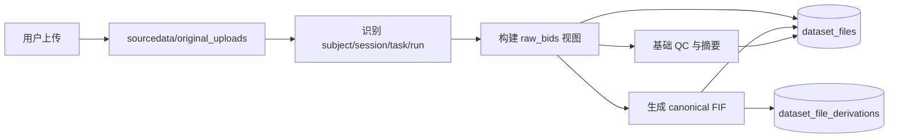

# 4-20 Dataset 文件与导入转换

> 本页维护 Dataset 层的文件边界、BIDS 组织、上传归档、canonical FIF、sidecar 和导入转换流程。

<div class="elys-meta" markdown>

定位
: Dataset 文件、Raw BIDS、canonical FIF、Recording Version、上传和转换

更新
: 2026-06-05 00:00:00 +08:00

</div>

## 1. Dataset 文件边界

Dataset 层只保存“这份数据是什么”和“它的标准化入口是什么”。它不保存某个 Study 下的滤波、ICA、epoch、ERP 或统计结果。

标准目录：

```text
datasets/ds-000001/versions/working/
  sourcedata/
    original_uploads/
      upload-0001/
        manifest.json
        original.cnt
  raw_bids/
    dataset_description.json
    participants.tsv
    sub-001/
      ses-01/
        eeg/
          sub-001_ses-01_task-rest_run-01_eeg.vhdr
          sub-001_ses-01_task-rest_run-01_eeg.eeg
          sub-001_ses-01_task-rest_run-01_eeg.vmrk
          sub-001_ses-01_task-rest_run-01_eeg.json
          sub-001_ses-01_task-rest_run-01_channels.tsv
          sub-001_ses-01_task-rest_run-01_events.tsv
  derivatives/
    elys-canonical-fif/
      dataset_description.json
      sub-001/
        ses-01/
          eeg/
            sub-001_ses-01_task-rest_run-01_desc-canonical_eeg.fif
            sub-001_ses-01_task-rest_run-01_desc-canonical_eeg.json
  qc/
    import_qc.json
    channel_summary.tsv
    event_summary.tsv
```

## 2. 三层含义

| 层 | 内容 | 规则 |
|---|---|---|
| `sourcedata/original_uploads` | 用户上传原貌，可能是厂商格式、压缩包、非 BIDS 目录 | 永久保留，不要求用户直接使用 |
| `raw_bids` | 平台整理出的 Raw BIDS 标准入口 | 原始数据权威入口，可以是视图，不一定复制大文件 |
| `derivatives/elys-canonical-fif` | 从 Raw BIDS 生成的 MNE-ready FIF | 可重建工作副本，便于预览和 Pipeline 运行 |

`raw_bids` 不等于“再复制一份原始大文件”。当前实现是**纯数据库逻辑视图**：`raw_bids_data` 等 `dataset_files` 行的 `storage_uri` 直接指向原始上传文件，不复制、不建链接。硬链接 / reflink / 对象引用是目标方案，尚未实现（见 [4-60](4-60-raw_bids视图与零复制策略.md) 顶部现状说明）。

## 3. BIDS sidecar

Raw BIDS 必须认真维护 sidecar：

| 文件 | 内容 |
|---|---|
| `*_eeg.json` | 采样率、任务名、参考、地线、设备、滤波、采集类型等总体元数据 |
| `*_channels.tsv` | 通道名、类型、单位、低/高通、参考、坏通道状态和原因 |
| `*_events.tsv` | marker/event 的 onset、duration、trial_type、value、sample、反应时和自定义条件列 |
| `participants.tsv` | 被试级元数据 |
| `dataset_description.json` | 数据集名称、BIDS 版本、生成工具、来源说明 |

FIF 文件可以保存采样率、通道名、通道类型、bad channels、annotations 等信息，但不能替代 Raw BIDS sidecar。尤其是 `events.tsv` 的自定义列、坏通道原因、任务语义、设备说明和 provenance 很容易在 FIF 中丢失。

## 4. canonical FIF

canonical FIF 的定位是 MNE-ready 工作副本，不是 Raw BIDS 权威源。

规则：

- 优先从 `raw_bids` 生成。
- 可以懒生成：首次预览或首次 Execution 时再生成。
- 可以按策略清理：只要 Raw BIDS、转换参数和转换器版本还在，就应能重建。
- 不完整重复 `channels.tsv` / `events.tsv`，除非转换过程修改了通道或事件语义。
- 旁边保留一个轻量 provenance JSON，内容由数据库和转换流程生成。

示例：

```json
{
  "Description": "Canonical FIF generated from Raw BIDS for MNE processing.",
  "SourceRawBIDS": "raw_bids/sub-001/ses-01/eeg/sub-001_ses-01_task-rest_run-01_eeg.vhdr",
  "SourceChannels": "raw_bids/sub-001/ses-01/eeg/sub-001_ses-01_task-rest_run-01_channels.tsv",
  "SourceEvents": "raw_bids/sub-001/ses-01/eeg/sub-001_ses-01_task-rest_run-01_events.tsv",
  "GeneratedBy": {
    "Name": "ELYS canonical FIF converter",
    "Version": "1.0.0"
  },
  "GeneratedAt": "2026-05-21 17:59:13 +08:00"
}
```

平台内事实源是数据库；JSON 是为了导出、离线复现和文件包自解释。

## 5. 上传与转换流程

<div class="elys-flow" markdown>



</div>

规则：

- 同一 Dataset（即 `DatasetAsset`，用户视角的数据资产）下新增被试或 session 时，在 `recordings` 表新增一条采集记录（`Recording`）。
- 同一条采集记录重传时，在 `recording_versions` 表新增一个版本（`RecordingVersion`）。
- 导入走 `POST /api/v1/studies/{study_id}/recordings/import`（同步，返回 201）。上传必须携带 bootstrap 返回的 `dataset_asset_id` 或 `mount_name`；如果只给 `dataset_asset_id`，后端会确认该 `DatasetAsset` 已 active 挂载到当前 Study。
- 未挂载的 `DatasetAsset` 不允许通过导入接口写入，避免把文件写入错误的 Study 工作空间。
- 成功导入后在文件索引 `dataset_files` 表登记 `original_upload`、`raw_bids_data`、Raw BIDS `sidecar`、`canonical_fif` 和 `canonical_fif_provenance` 等 `file_role`。
- 采集记录的 `current_version_id`（指向 `recording_versions`）只由数据库更新，不靠目录最新时间判断。
- 转换失败也要保留版本记录和错误日志，方便追查。

## 6. 格式处理策略

> 下表的"硬链接 / reflink / `.vhdr/.vmrk` 重写"均为**目标策略、尚未实现**（现状是纯逻辑视图，见 [4-60](4-60-raw_bids视图与零复制策略.md)）。当前已落地的只有 canonical FIF 转换（同步导入时用 MNE 生成）。

| 上传格式 | raw_bids 视图策略（目标） |
|---|---|
| 标准 BIDS 上传 | 直接登记为 `raw_bids`，不复制 |
| EDF / BDF | 大文件可硬链接或 reflink，补 BIDS 文件名和 sidecar |
| BrainVision `.vhdr/.eeg/.vmrk` | `.eeg` 大文件可链接；`.vhdr/.vmrk` 通常需要重写文件名引用 |
| EEGLAB `.set/.fdt` | `.fdt` 大文件可链接；`.set` 可能需要重写引用 |
| CNT / MAT / 厂商私有格式 | 保留在 `sourcedata`，必要时转换生成 Raw BIDS 支持格式或 canonical FIF |

## 7. 字段与目录现状对照

下表把数据库里的现役字段、磁盘目录和本页标准设计中的位置对齐。这里的 `recordings`（采集记录主表）、`recording_versions`（采集记录的上传 / 重传版本表）是「A+B 重构」后的真实主表，由原来的 `datasets` / `dataset_uploads` 改名而来——不是兼容视图，旧表已不存在。

| 现役字段 / 目录 | 标准设计中的位置 | 说明 |
|---|---|---|
| `source_uploads/`（Study 工作目录） | `sourcedata/original_uploads/` | `source_uploads` 属于早期 Study 工作目录，仍会创建；新上传一律写入 Dataset 标准目录 |
| `fifdata/`（Study 工作目录） | `derivatives/elys-canonical-fif/` | 同上，`fifdata` 是早期 Study 目录；新 canonical FIF 写入 Dataset derivatives |
| `recordings.source_path` | `dataset_files.file_role='original_upload'` 或 `raw_bids_data` | `source_path` 是 `recordings` 表的现役列，记录该采集记录的主源路径；同一份文件同时在 `dataset_files` 建索引行 |
| `recordings.fif_path` / `recording_versions.fif_path` | `dataset_files.file_role='canonical_fif'` | 两者都是现役列（记录级与版本级各一个），canonical FIF 同时在 `dataset_files` 建索引行 |
| `recording_versions.sidecar_paths` | Raw BIDS sidecar 或 canonical provenance | `recording_versions` 的现役 JSONB 列；落地时还会登记 `sidecar` 与标准 `raw_bids_*` 的 `file_role` |

## 8. 当前落地状态

| 链路 | 状态 |
|---|---|
| 同步上传 EEG | 已实现，走 `POST /api/v1/studies/{study_id}/recordings/import`，当前仍在 HTTP 请求线程内完成 |
| Dataset 标准上传目录 | 已实现，新文件写入 `storage/datasets/{asset}/versions/working/sourcedata/original_uploads` |
| canonical FIF 生成 | 已实现，写入 `derivatives/elys-canonical-fif`，路径同步回写 `recordings.fif_path` / `recording_versions.fif_path` |
| raw/canonical/sidecar 文件索引 | 已在 `dataset_files` 登记，外键挂到 `recording_id` / `recording_version_id`，包含 `logical_path/storage_uri/sha256` |
| Dataset Asset/Mount 上传目标 | 已支持 `dataset_asset_id` / `mount_name` |
| 未挂载 Dataset 上传拦截 | 已实现，显式 `dataset_asset_id` 必须能解析到当前 Study active mount |
| LoadData 使用挂载 Dataset 文件 | 已实现，Execution 输入冻结保留 `dataset_asset_id/dataset_file_id/storage_uri/logical_path/sha256` 和 mount metadata |
| 采集记录与文件查询 API | 已支持 `GET /recordings`、`GET /recordings/{id}/files`、`GET /dataset-assets/{id}/files`（按 `file_role` 查询）、`GET /dataset-assets/{id}/bids-tree`，以及 `GET /dataset-files/{id}/metadata`、`/preview`、`/download` |
| Raw BIDS 视图 | 已完成基础逻辑路径和 `file_role` 登记；BIDS validator 与 BrainVision 引用重写待后续 |
| 异步导入任务 | **`dataset_import` 已真正落地**：`POST /recordings/import-async`（也有旧入口 `/import-task`）请求内先落盘归档，再派发 Celery，worker `run_dataset_import` 调与同步路径共用的转换核心 `materialize_recording_import`（校验 → MNE 转 canonical FIF → 写库），返回 `import_performed=True`，进度经 `task_events` 上报。`raw_bids_build` 因 raw_bids 是纯逻辑视图、无需复制，handler 只回 file_count（no-op）。`canonical_fif_rebuild` 仍是**骨架**（`rebuild_performed=False`，只索引已有 FIF）。同步入口 `POST /recordings/import`（`generate_canonical_fif`）继续保留 |

## 9. 相关页面

- [3-20 Dataset 与采集记录表](3-20-Dataset与采集记录表.md)
- [4-40 数据选择器与文件索引](4-40-数据选择器与文件索引.md)
- [4-60 raw_bids 视图与零复制策略](4-60-raw_bids视图与零复制策略.md)
- [2-60 任务队列与异步架构](2-60-任务队列与异步架构.md)
