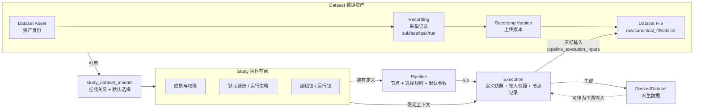

# 5-00 研究管理总览

> 本章从产品和工程实现两个角度说明 Dataset、Study、Pipeline、Execution 四对象的功能边界、关系和实现方案。它是 ELYS 协作分析主线的入口。

<div class="elys-meta" markdown>

状态
: <span class="elys-badge elys-badge--wip">部分接入</span>

前端
: `StudyDetailPage.vue` · `PipelinePage.vue` · LiteGraph.js

后端
: `routers/studies.py` · `routers/datasets.py` · `routers/pipelines.py` · `pipeline/*`

数据库
: `studies` · `study_members` · `study_settings` · `study_dataset_mounts` · `pipeline_definitions` · `pipeline_executions` · `pipeline_execution_inputs` · `derived_datasets`

更新
: 2026-06-04

</div>

## 一句话标准

ELYS 的协作分析主干由 **Dataset / Study / Pipeline / Execution** 四对象构成：Dataset 是数据资产本体，Study 是协作与分析空间，Pipeline 是流程定义，Execution 是一次执行的事实。Dataset 可变、Execution 不可变；Pipeline 保存选择规则、Execution 冻结实际输入；Dataset 通过挂载关系被 Study 引用，不复制文件。

## 1. 四对象功能边界

| 对象 | 中文 | 答的问题 | 保存什么 | 不保存什么 |
|---|---|---|---|---|
| **Dataset** | 数据集 | 我有什么数据 | 数据资产身份、Recording、Version、File 索引、权限、状态、元数据 | 任何与具体研究项或运行相关的协作记录 |
| **Study** | 研究项 | 谁在用这些数据做什么 | 成员、权限、设置、Dataset 挂载、编辑/运行锁、审计、研究内输出入口 | Dataset 原始文件副本 |
| **Pipeline** | 工作流 | 怎么处理 | 节点、连线、默认参数、输入/输出槽、数据选择规则、版本号、状态 | 具体 `sub-001 upload-003` 或服务器绝对路径 |
| **Execution** | 执行项 | 这一次实际怎么跑 | 实际输入快照、Pipeline 定义快照、运行参数、任务状态、日志、DerivedDataset、依赖 | “当前数据”的动态引用、可被后续编辑改变的 Pipeline 定义 |

Dataset 是研究输入资产，DerivedDataset 是 Execution 输出资产。Study 通过挂载引用 Dataset；Execution 通过冻结快照引用具体文件。

## 2. 关系全景

<div class="elys-flow" markdown>



</div>

### 2.1 引用流（”谁认识谁”）

- Dataset 不知道 Study 存在；它是独立的数据资产。
- Study 通过 `study_dataset_mounts.dataset_asset_id` 单向引用 Dataset。
- Pipeline `study_id` 指向 Study；Pipeline 内的 LoadData 节点保存动态 selector，不指向具体文件。
- Execution `pipeline_id` 指向 Pipeline；`pipeline_execution_inputs` 解析后指向 `dataset_files`、`recording_versions`，并保留 `selector_json` 快照。
- DerivedDataset `produced_by_execution_id` 指向 Execution；`upstream_dataset_ids` / `upstream_recording_ids` 记录派生来源。

### 2.2 数据流（”实际数据怎么走”）

```text
原始 EEG 文件
  → Dataset.Recording.Version 归档（source + raw_bids + canonical_fif）
  → Study 挂载 Dataset（仅引用，无复制）
  → Pipeline LoadData selector 描述”想要什么”
  → Execution 启动时把 selector 解析为具体 dataset_files 列表（冻结到 pipeline_execution_inputs）
  → Worker 按 Pipeline 定义快照逐节点执行
  → 节点产物写入 derived_datasets（含 storage_uri / sha256 / 上游链）
  → DerivedDataset 可作为下游 Execution 的输入（链式分析）
```

## 3. 核心设计原则

四对象的所有设计决策都收敛到这三条边界原则：

### 3.1 Dataset 可变，Execution 不可变

- Dataset 持续增量上传：可新增 Recording、可重传 Version、可补充 metadata。
- Execution 一旦创建即冻结：`pipeline_execution_inputs` 锁定当时实际命中的 file id、sha256、selector 解析结果。
- **结果**：Dataset 后续怎么变都不影响旧 Execution 的追溯。论文复现时能精确还原”那一次跑的是哪批数据”。

### 3.2 Pipeline 不绑文件，Execution 才绑文件

- Pipeline 只保存动态选择规则（”task=rest 且 require_fif=true 的当前数据”）。
- Execution 创建时调 `resolve_load_data_selection` 把规则展开为具体文件清单。
- 临时手选数据走 Execution 的 `selection_override`，不写回 Pipeline 定义。
- **结果**：同一 Pipeline 可在不同时刻跑不同被试范围，定义本身保持稳定。

### 3.3 Dataset 跨 Study 共享，Study 内多 Dataset 组合

- 一个 Dataset 可被多个 Study 挂载（公共数据复用、跨课题对照）。
- 一个 Study 可挂载多个 Dataset（主试验 + 外部对照 + 示例）。
- 挂载是引用关系，`study_dataset_mounts` 保存 `mount_name` 和默认 `selection_json`。
- **结果**：删除/归档 Study 不会删 Dataset 文件；要停用某研究项对数据的访问，应停用挂载。

## 4. 管理主线

```text
[Dataset 视角]
  创建 Dataset Asset
  -> 增量上传 Recording / Version
  -> 自动建立 Raw BIDS 和 canonical FIF
  -> 文件索引落 dataset_files

[Study 视角]
  创建 Study（或 Dataset-first bootstrap 自动创建配套 Study）
  -> 挂载 Dataset（study_dataset_mounts）
  -> 设置默认数据筛选与运行策略
  -> 邀请成员，分配权限

[Pipeline 视角]
  在 Study 内创建 Pipeline
  -> 编辑节点图，配置 LoadData selector 和参数
  -> 保存（携带 expected_version 乐观锁）
  -> 校验通过 → 状态可 active

[Execution 视角]
  在 Pipeline 上创建 Execution（trial / analysis）
  -> 解析 selector，冻结输入快照
  -> 创建 async_task，派发 Celery
  -> Worker 逐节点执行，写 derived_datasets
  -> 终态时生成 execution_manifest.json
  -> 用户决定 current / pinned / cached 或清理
```

关键原则：

- Study 可以持续增量挂载或上传数据，但旧 Execution 不受影响。
- Pipeline 是可编辑定义，Execution 是不可变历史事实。
- Execution 可以失败、取消或重试；每次执行都应留下可追溯记录。
- DerivedDataset 可清理大文件，但不能删除 Execution 事实链。
- 被下游 Execution 依赖的 DerivedDataset 受保护，无法直接物理清理。

## 5. 当前代码状态

| 能力 | 状态 | 当前实现 |
|---|---|---|
| Study 基础 CRUD | <span class="elys-badge elys-badge--done">已实现</span> | 当前代码名为 Study，表为 `studies` |
| Study 成员权限 | <span class="elys-badge elys-badge--done">已实现</span> | `study_members`，含 `can_run` |
| Study settings | <span class="elys-badge elys-badge--wip">部分接入</span> | `study_settings` 已有 API，LoadData 已消费 default filter |
| Dataset mount | <span class="elys-badge elys-badge--done">已实现</span> | `study_dataset_mounts` |
| Pipeline CRUD | <span class="elys-badge elys-badge--done">已实现</span> | `pipeline_definitions` |
| Pipeline 校验 | <span class="elys-badge elys-badge--done">已实现</span> | `validate_definition` |
| LoadData 解析 | <span class="elys-badge elys-badge--done">已实现</span> | 支持解析 Dataset/Recording/File |
| Execution 创建与任务关联 | <span class="elys-badge elys-badge--wip">部分接入</span> | `pipeline_executions` + `async_tasks` |
| Execution 输入快照 | <span class="elys-badge elys-badge--done">已实现</span> | `pipeline_execution_inputs` |
| DerivedDataset 写入和保留状态 | <span class="elys-badge elys-badge--done">已实现</span> | `derived_datasets.retention_status` |
| Execution manifest | <span class="elys-badge elys-badge--done">已实现</span> | 终态 Execution 写 `execution_manifest.json` 和 `manifest_json` 摘要 |
| Execution 依赖自动写入 | <span class="elys-badge elys-badge--done">已实现</span> | 节点输入解析识别上游 DerivedDataset 并写 `pipeline_execution_dependencies` |
| DerivedDataset 清理任务 | <span class="elys-badge elys-badge--done">已实现基础版</span> | `derived_dataset_cleanup` 逻辑清理 `temporary/cached`，被依赖则跳过 |

## 6. 页面入口

| 子页 | 内容 | 何时阅读 |
|---|---|---|
| [3-20 Dataset 与采集记录表](3-20-Dataset与采集记录表.md) | Dataset Asset、Recording、Version、File 索引的数据库设计 | 改数据资产模型时 |
| [5-10 Study 研究项管理](5-10-Study研究项管理.md) | Study 的成员、权限、Dataset mount、settings、运行锁、审计和目录边界 | 改研究项、协作权限、数据挂载时 |
| [5-20 Pipeline 工作流管理](5-20-Pipeline工作流管理.md) | Pipeline 定义、版本、NodeSpec、LoadData 选择规则、校验、编辑并发 | 改工作流编辑器、节点、定义 API 时 |
| [5-30 Execution 管理](5-30-Execution管理.md) | Execution 生命周期、输入快照、异步任务、DerivedDataset、manifest、依赖和清理 | 改运行、任务队列、输出追溯时 |

## 7. 实施路线

1. 继续保留当前 Study 命名，产品和文档统一称 Study。
2. 补齐 Study run policy 的运行时消费。
3. Pipeline update 已强制 `expected_version`，编辑锁 API 已接入；后续补前端冲突差异提示。
4. Execution 创建时继续前置校验输入，避免无效 queued Execution。
5. Execution cancel/retry、Task cancel/retry 和 Task 级 SSE 基础 API 已接入；后续补运行中长节点的协作式取消检查。
6. Execution lineage 后端聚合接口已接入；后续补前端图视图和清理阻断入口。
7. 将 Dataset 异步导入从任务骨架推进到真实 staged upload + worker 导入。

## 8. 相关页面

- [2-50 API 设计总览](2-50-API设计总览.md)
- [3-30 Study 与 Pipeline 表](3-30-Study与Pipeline表.md)
- [3-40 Execution 与 DerivedDataset 追溯表](3-40-Execution与Artifact追溯表.md)
- [4-00 文件管理总览](4-00-文件管理总览.md)
- [7-40 工作流执行与后台任务](7-40-工作流执行与后台任务.md)
