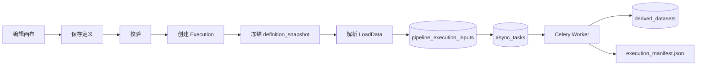

# 5-20 Pipeline 工作流管理

> 本页说明 Pipeline 的功能边界、定义管理、版本策略、LoadData 选择规则、NodeSpec 和实现方案。

<div class="elys-meta" markdown>

状态
: <span class="elys-badge elys-badge--wip">部分接入</span>

前端
: `PipelinePage.vue` · LiteGraph.js

后端
: `routers/pipelines.py` · `pipeline/registry.py` · `pipeline/validator.py` · `pipeline/load_data.py` · `pipeline/nodes/*.json`

数据库
: `pipeline_definitions` · `pipeline_executions` · `pipeline_jobs`

更新
: 2026-06-05

</div>

## 1. 功能边界

Pipeline 是处理流程定义。它保存：

- 工作流名称、描述、状态。
- 节点、连线、默认参数。
- 输入/输出槽类型。
- LoadData 选择规则。
- 版本号和定义快照。

Pipeline 不保存：

- 具体 `sub-001 upload-003`。
- 服务器绝对路径。
- 某次运行产生的输出文件。
- 被用户确认的研究结论。

一句话：Pipeline 管“怎么处理”，Execution 管“这一次实际怎么跑”。

Pipeline 的 MVP 协作边界：保存必须携带 `expected_version`，运行前会按 Pipeline 状态和 `execution_mode` 校验，NodeSpec 必须有真实 executor，临时手选数据进入 Execution `selection_override` 而不是回写 Pipeline。仍未拆分的是不可变 `pipeline_versions` 表，当前继续用 `pipeline_definitions.version + Execution.definition_snapshot` 承担 MVP 追溯。

## 2. Definition JSON

`pipeline_definitions.definition_json` 是当前事实源，典型结构：

```json
{
  "graph": {},
  "nodes": [],
  "edges": [],
  "settings": {},
  "loadData": {
    "selection_mode": "filter",
    "dataset_filter": {
      "task": "rest",
      "require_fif": true
    }
  }
}
```

定义保存时应更新：

- `node_count`
- `version`
- `updated_at`
- `status`
- `audit_events`

## 3. 版本和并发

当前代码已有 `version`，保存 Pipeline 时必须携带 `expected_version`。管理规则：

| 场景 | 规则 |
|---|---|
| 打开编辑器 | 前端拿到当前 `version` |
| 保存 | 必须携带 `expected_version` |
| 后端发现版本不一致 | 返回 409，提示用户重新载入 |
| 后端发现未携带版本 | 返回 422，要求前端重新读取当前版本后再保存 |
| Execution 创建 | 冻结当时 `definition_json` 到 `pipeline_executions.definition_snapshot` |
| 历史 Execution 回看 | 使用 Execution snapshot，不读 Pipeline 当前定义 |

前端编辑器打开 Pipeline 时读取 `version`，保存时把该值作为 `expected_version` 传给后端；后端只接受与当前版本一致的保存请求，成功后 `version + 1`。

当前前端已接入 `expected_version`：`PipelinePage.vue` 保存现有 Pipeline 时使用当前 `version` 作为 `expected_version`，新建 Pipeline 仍走创建接口；保存成功后用后端返回的新 `version` 更新编辑器状态。版本冲突仍应由后续交互补充“重新载入 / 对比差异”的明确入口。

当前后端已接入 Pipeline 编辑锁：

| 能力 | 规则 |
|---|---|
| 获取编辑锁 | `POST /api/v1/studies/{study_id}/pipelines/{pipeline_id}/edit-lock` |
| 续期编辑锁 | `POST /api/v1/studies/{study_id}/pipelines/{pipeline_id}/edit-lock/refresh` |
| 释放编辑锁 | `DELETE /api/v1/studies/{study_id}/pipelines/{pipeline_id}/edit-lock` |
| 锁存储 | 复用 `study_locks`，`resource_kind=pipeline`，`resource_id=pipeline_id`，`lock_type=edit` |
| 锁过期 | 锁必须有 `expires_at`；过期锁会被释放或忽略 |
| 保存检查 | 如果其他用户持有 active edit lock，Pipeline update 返回 409 |
| 兼容策略 | 没有 active edit lock 时仍允许保存；当前用户持有锁时允许保存 |

## 4. 状态

| 状态 | 含义 |
|---|---|
| `draft` | 草稿，可编辑，不建议正式运行或需提示 |
| `active` | 可运行 |
| `archived` | 不再默认展示，不建议新运行 |
| `deleted` | 逻辑删除 |

当前 DB 和 API 已允许 `draft` / `active` / `archived` / `deleted`。Execution 创建时已经按 `pipeline.status` 和 `execution_mode` 做硬校验：

| Pipeline 状态 | 允许的 Execution | 规则 |
|---|---|---|
| `active` | `analysis` / `trial` | 正式工作流可正式分析或试跑 |
| `draft` | `trial` | 草稿只能试跑，不允许正式分析 |
| `archived` | 无 | 禁止创建新 Execution |
| `deleted` | 无 | 查询时不可见，继续返回 404 |

不允许运行时返回 409，错误体包含 `code`、`message`、`pipeline_status` 和 `execution_mode`。

当前前端已显示 Pipeline 状态，并在 Execution 创建前预判是否可运行：`active` 可创建 `analysis/trial`，`draft` 只允许 `trial`，`archived/deleted` 禁用运行按钮。后端 409 仍是最终保护。

## 5. LoadData 选择规则

Pipeline 可以保存动态选择规则：

```text
使用本 Study 中 task=rest 且 group=control 的当前数据
```

Execution 创建时解析为静态输入：

```text
sub-001 ses-01 task-rest run-01 upload=v0002 file=canonical_fif sha256=...
sub-002 ses-01 task-rest run-01 upload=v0001 file=canonical_fif sha256=...
```

规则：

- Pipeline 只保存 selector。
- 临时手选具体数据应通过 Execution `selection_override` 传入，不写回 Pipeline。
- Execution 写入 `pipeline_execution_inputs`。
- `pipeline_execution_inputs.selector_json` 同时保存 Pipeline 原始 selector、Execution override 和最终解析参数。
- Study default filter 会在 LoadData 解析时合并。
- 历史 Execution 不依赖“当前数据”。

## 6. NodeSpec

NodeSpec 描述节点的输入、输出、参数、后端绑定和缓存策略。

| 概念 | 说明 |
|---|---|
| NodeSpec | 节点 JSON 规格 |
| NodeRegistry | 启动时加载 `pipeline/nodes/*.json` |
| input slot | 节点输入类型 |
| output slot | 节点输出类型 |
| backend binding | 节点执行时调用的后端函数或任务 |
| cache key | 未来用于节点级缓存的输入与参数 hash |

NodeSpec 是 Pipeline 编辑器的组件库，不是 Execution 事实源。Execution 事实源是 `definition_snapshot` 和执行过程记录。

## 7. 校验

Pipeline 保存和运行前都应校验：

- 必须有 LoadData 或合法输入。
- 节点引用的 NodeSpec 存在。
- 节点引用的 NodeSpec 必须有真实后端 executor。
- 必填参数齐全。
- 连线类型匹配。
- 输出槽被下游使用时类型合法。
- 运行前选择器能解析到数据或明确返回 422。

当前 Execution 创建已前置执行 validation，严重输入错误返回 422，不再先创建 queued Execution。10 个内置节点（LoadData、FIR / Butterworth / Notch 滤波、重采样、重参考、Compute / Apply ICA、Epoch、ERP）均已在 `dispatcher.py` 注册真实 handler；validate 只对"有 NodeSpec 但 dispatcher 无 handler"的节点类型返回 `PIPELINE_NODE_EXECUTOR_NOT_IMPLEMENTED`，当前内置节点不会触发。节点级清单与补全规划见 [5-25 工作流节点路线图](5-25-工作流节点路线图.md)。

## 8. 当前运行链路



预处理 → ICA → Epoch → ERP 整条链的执行器已接通，时频 / 微状态 / 脑连接 / 溯源 / 统计节点仍规划中（见 [5-25 工作流节点路线图](5-25-工作流节点路线图.md)）。当前实现重点是：Execution 创建冻结输入，运行前校验 NodeSpec 与 executor 是否匹配，Worker 执行后写 DerivedDataset、依赖和 manifest，历史 Execution 不再依赖 Pipeline 的当前定义或 Dataset 的当前状态。

## 9. API 和数据库实现

| 能力 | 当前实现 |
|---|---|
| NodeSpec 列表 | `GET /api/v1/pipeline/node-specs` |
| LoadData 解析 | `POST /api/v1/studies/{study_id}/pipeline/load-data/resolve` |
| Pipeline CRUD | `/api/v1/studies/{study_id}/pipelines` |
| Pipeline 运行 | `POST /api/v1/studies/{study_id}/pipelines/{pipeline_id}/executions` |
| 审计 | create/update/delete 写 `audit_events` |
| 定义表 | `pipeline_definitions` |
| Execution 表 | `pipeline_executions`，含 `definition_snapshot` 和 `manifest_json` |
| 输入快照 | `pipeline_execution_inputs` |
| 输出与依赖 | `derived_datasets`、`pipeline_execution_dependencies` |

## 10. 后续实现任务

1. NodeSpec executor 与 UI 禁用状态继续联动。
2. Pipeline 导入/导出时附带版本和兼容性检查。
3. 版本冲突时前端提供差异提示和重新载入入口。
4. 前端编辑器接入 edit lock 获取、心跳续期和离开释放。

## 11. 相关页面

- [5-10 Study 研究项管理](5-10-Study研究项管理.md)
- [5-30 Execution 管理](5-30-Execution管理.md)
- [7-40 工作流执行与后台任务](7-40-工作流执行与后台任务.md)
- [4-40 数据选择器与文件索引](4-40-数据选择器与文件索引.md)
