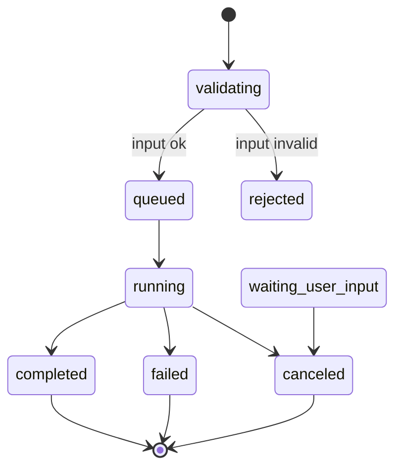

# 5-30 Execution 管理

> 本页说明 Execution 的功能边界、生命周期、输入快照、异步任务、DerivedDataset、Execution Manifest、依赖和清理策略。

<div class="elys-meta" markdown>

状态
: <span class="elys-badge elys-badge--wip">部分接入</span>

后端
: `routers/pipelines.py` · `pipeline/executor.py` · `pipeline/derived_dataset_store.py` · `tasks/pipeline_tasks.py`

数据库
: `pipeline_executions` · `pipeline_jobs` · `pipeline_execution_inputs` · `pipeline_execution_dependencies` · `derived_datasets` · `async_tasks` · `task_events`

更新
: 2026-06-04

</div>

## 1. 功能边界

Execution 是某个 Pipeline 的一次具体执行。它保存：

- Pipeline 定义快照。
- 实际输入数据清单。
- 运行人、触发方式、开始/结束时间、状态。
- 节点级作业（Job）记录。
- 异步任务和事件。
- DerivedDataset 输出索引。
- Execution manifest。
- 上下游依赖关系。

Execution 不保存：

- “当前数据”的动态引用。
- 可被后续编辑改变的 Pipeline 定义。
- 必须永久保留的所有中间大文件。

Execution 的 MVP 后端能力已经覆盖：`trial/analysis` 创建、输入快照、Job 记录、DerivedDataset、Manifest、上下游依赖、cancel/retry、Task events/SSE 和派生数据语义操作。当前“部分接入”的主要原因是仍缺真实部署端到端验收、前端 SSE 客户端和 lineage 图形化体验。

## 2. 生命周期



Execution 状态：

| 状态 | 含义 |
|---|---|
| `validating` | 创建前校验定义和输入 |
| `queued` | 已创建 Execution 和 async task，等待 worker |
| `running` | Worker 正在执行 |
| `completed` | 成功完成 |
| `failed` | 执行失败 |
| `canceled` | 用户或系统取消 |

`succeeded` 保留给 Task 成功状态，不作为 Execution 成功状态。`retrying` 不作为当前 Execution 状态；重试会从失败或取消的 Execution 创建一个新的 Execution，并记录追溯关系。

当前代码已在 Execution 创建前做 validation；async task 表和事件表已接入基础链路，Execution completed、failed、waiting_user_input 或取消时会生成 manifest。当前已提供 Execution cancel API，可取消 `queued`、`running`、`waiting_user_input` 状态的 Execution；Task cancel API 对 `pipeline_execution` Task 会同步走同一套 Execution 取消逻辑。

取消规则：

| 场景 | 规则 |
|---|---|
| `queued` | 标记 Execution 为 `canceled`，best-effort revoke Celery task，释放运行锁 |
| `running` | 标记 Execution 为 `canceled`，best-effort revoke Celery task，释放运行锁 |
| `waiting_user_input` | 标记 Execution 为 `canceled`，释放运行锁，不再等待人工决策 |
| `completed` / `failed` / `canceled` | 返回 409，不重复取消 |

取消会写入 `task_events`、`audit_events`，并生成或刷新 Execution Manifest。当前 worker 只在启动前识别已取消 Execution；运行中的长耗时节点还没有完整协作式中断检查。

重试规则：

| 场景 | 规则 |
|---|---|
| `failed` / `canceled` | 可创建新的 retry Execution |
| `completed` / `queued` / `running` / `waiting_user_input` | 返回 409，不直接重试 |
| 默认输入策略 | `input_policy=reuse_snapshot`，复制旧 Execution 的 `pipeline_execution_inputs` |
| 可选输入策略 | `input_policy=re_resolve`，使用旧 `definition_snapshot` 重新解析当前可用输入 |
| 追溯 | 新 Execution 的 `result_json.retry_of_execution_id` 和 `pipeline_execution_dependencies(dependency_kind=retry_of)` 指向旧 Execution |
| 派发 | 新建 `async_tasks` 并重新派发 Celery task，不覆盖旧 Execution |

## 2.1 运行模式和保存策略

Execution 创建 API 已支持两个轻量控制字段：

| 字段 | 当前值 | 默认值 | 说明 |
|---|---|---|---|
| `execution_mode` | `trial` / `analysis` / `replay` / `system` | `analysis` | 区分试跑、正式分析、重放和系统触发 |
| `save_policy` | `temporary` / `current` / `pinned` / `discard` | `current` | 描述输出保留意图 |

当前实现先保证字段能创建、能返回、能写入 `pipeline_executions`、`pipeline_executions.result_json` 和 `async_tasks.payload_json`。DerivedDatasetStore 尚未按 Execution 级 `save_policy` 自动改变输出保留策略（当前 retention 由节点拓扑角色经 `save_settings.py` 决定：leaf=current、intermediate=cached+7d），后续再强化。

Execution 创建还会结合 Pipeline 状态校验：

| Pipeline 状态 | `execution_mode` 规则 |
|---|---|
| `active` | 允许 `analysis` / `trial` |
| `draft` | 只允许 `trial` |
| `archived` | 禁止创建新 Execution |
| `deleted` | 不可见，继续 404 |

规则不满足时返回 409，错误体包含 `code`、`message`、`pipeline_status`、`execution_mode`。

当前前端已在 Execution 创建对话框中暴露 `execution_mode` 和 `save_policy`。默认值为 `analysis/current`，用户可切换为 `trial/temporary` 等组合；对话框会结合 Pipeline 状态给出是否可创建 Execution 的提示。

## 3. 输入快照

Execution 创建时必须冻结输入到 `pipeline_execution_inputs`：

```text
execution_id
pipeline_id
node_id
input_kind = selector / dataset_file / dataset / derived_dataset
dataset_asset_id
dataset_id / recording_id
dataset_upload_id / recording_version_id
dataset_file_id
file_role
storage_uri
sha256
selector_json
resolved_metadata_json
```

这解决：

- Dataset 后续继续上传，不改变旧 Execution。
- `canonical_fif` 被清理后，仍知道来源和 hash。
- 可回看当时 selector 解析到了哪些数据。

### 3.1 Execution 级数据选择覆盖

Pipeline 可以保存动态 LoadData selector；Execution 创建时可以用 `selection_override` 对某个 LoadData 节点做一次性覆盖：

```json
{
  "selection_override": {
    "load-1": {
      "selection_mode": "explicit",
      "dataset_ids": ["..."],
      "dataset_filter": {
        "require_fif": true
      }
    }
  }
}
```

规则：

- override 只作用于本次 Execution，不写回 `pipeline_definitions.definition_json`。
- `PipelineExecutor.prepare_execution()` 解析 LoadData 时优先使用 override。
- override 会写入 `pipeline_execution_inputs.selector_json.selection_override`。
- Execution Manifest 通过 inputs 序列化保留该 selector snapshot。
- 旧 Pipeline 中已有的 `selection_mode=explicit + dataset_ids` 仍兼容运行。

## 4. Execution Manifest

每次 Execution 建议生成：

```text
studies/{study_id}/executions/{execution_id}/execution_manifest.json
```

数据库 `pipeline_executions.manifest_json` 保存摘要，文件保存完整导出证据。

Manifest 至少包含：

| 内容 | 说明 |
|---|---|
| pipeline snapshot | 当时工作流的节点、连线、参数和版本 |
| input snapshot | 当时实际命中的 recording/upload/file 和 hash |
| runtime | 运行人、开始/结束时间、软件版本、运行状态 |
| decisions | ICA 排除、人工确认等交互决策 |
| outputs | 输出文件、content_hash、保存状态、是否复用缓存、是否被下游依赖 |

## 5. Async Task

Execution 和异步任务是不同对象：

| 对象 | 作用 |
|---|---|
| `pipeline_executions` | 业务执行记录 |
| `async_tasks` | 后台任务调度记录 |
| `task_events` | 进度、日志、状态变化 |

规则：

- 创建 Execution 时同步创建 async task。
- Celery task id 写入 `async_tasks.celery_task_id`。
- 进度写入 `task_events`，前端可用 events list 或 SSE stream 读取。
- `result_json` 可以兼容输出 Celery ID，但不作为唯一事实源。
- 文件管理任务也复用 `async_tasks/task_events`：`derived_dataset_cleanup` 已有实际逻辑，`dataset_import/raw_bids_build/canonical_fif_rebuild` 已有任务入口。
- Task cancel 已接入：普通 Task 写 `canceled` 事件并 best-effort revoke Celery；`pipeline_execution` Task 会同步取消对应 Execution、释放运行锁并刷新 manifest。
- Task retry 已接入：普通文件 Task 从 failed/canceled 创建新 Task；`pipeline_execution` Task 不直接重跑旧 Execution，而是引导调用 Execution retry。
- Task events stream 已接入：`GET /studies/{study_id}/tasks/{task_id}/events/stream` 返回 SSE，支持 `since` 和 `Last-Event-ID` 断线重连。

## 5.1 Execution Lineage

Execution lineage 是 Execution 详情之外的聚合追溯视图，用于让前端快速画出“这次执行用了什么、产出了什么、依赖谁、被谁依赖”。

当前接口：

```text
GET /studies/{study_id}/pipeline-executions/{execution_id}/lineage
```

返回内容：

| 字段 | 说明 |
|---|---|
| `execution` | 当前 Execution 摘要 |
| `inputs` | 当前 Execution 的 `pipeline_execution_inputs` |
| `derived_datasets` | 当前 Execution 产生的全部派生数据，包括 `deleted` 状态 |
| `upstream_executions` | 当前 Execution 显式依赖或输入快照引用的上游 Execution |
| `downstream_executions` | 通过 `depends_on_execution_id` 或当前 DerivedDataset 反向查到的下游 Execution |
| `upstream_dependencies` | `pipeline_execution_dependencies.execution_id = 当前 Execution` |
| `downstream_dependencies` | `pipeline_execution_dependencies.depends_on_execution_id = 当前 Execution` 或 `upstream_dataset_id` 属于当前 Execution 输出 |
| `graph_nodes` / `graph_edges` | 前端可直接绘图的节点和边 |

图节点使用稳定 id：

```text
execution:{execution_id}
input:{pipeline_execution_input_id}
derived_dataset:{derived_dataset_id}
```

这个接口不改变 `GET /pipeline-executions/{execution_id}` 的 Execution detail 响应；Execution detail 仍用于普通详情页，lineage 用于依赖图、清理阻断提示和结果溯源面板。

## 6. DerivedDataset 输出

Execution 输出进入 `derived_datasets`（详见 [3-45](3-45-DerivedDataset.md)）：

| 字段组 | 说明 |
|---|---|
| 来源 | `produced_by_execution_id` / `produced_by_job_id` / `produced_by_node_id` / `produced_by_node_type` / `produced_by_params` |
| 上游链 | `upstream_dataset_ids[]` 直接上游派生 + `upstream_recording_ids[]` 最终原始 |
| 语义 | `data_type` 枚举 + `subject_id` / `bids_subject_id` / `session` / `task` / `condition` |
| 用户层 | `display_name` / `description` / `tags[]` |
| 物理 | `storage_uri` / `logical_path` / `sha256` / `file_size` / `file_role` / `mime_type` |
| 生命周期 | `retention_status` / `retention_expires_at` |
| 预览 | `preview_json` |

当前列表默认排除 `deleted`；预览和下载 deleted 派生数据返回 409。

派生数据语义操作合并为统一 PATCH：

| 操作 | API | 内部映射 | 规则 |
|---|---|---|---|
| 固定结果 | `PATCH /studies/{id}/derived-datasets/{ds_id}` body `{retention_status: 'pinned'}` | `retention_status='pinned'` + 清 expires | 防止被清理任务处理 |
| 设为正式 | `PATCH ... body {retention_status: 'current'}` | `retention_status='current'` | 不恢复已隐藏项 |
| 隐藏 | `PATCH ... body {retention_status: 'deleted'}` | 写 `deleted_at` | 不物理删除；被下游依赖时 409 |
| 改名/打标签 | `PATCH ... body {display_name, tags, description}` | UPDATE 对应字段 | 不影响 retention |
| 批量同上 | `POST /studies/{id}/derived-datasets/batch-update` | 多 ids + 同一组改动 | `/results` 页主要用 |

所有操作都会写入 `audit_events`。`hide` 是产品语义上的"隐藏 / 逻辑删除"，不物理移除文件。

## 7. 依赖管理

如果 Execution3 使用 Execution2 的输出，dispatcher 自动写入：

```text
pipeline_execution_inputs
  execution_id = Execution3
  upstream_execution_id = Execution2
  upstream_dataset_id = Execution2 derived_dataset
  input_kind = derived_dataset

pipeline_execution_dependencies
  execution_id = Execution3
  depends_on_execution_id = Execution2
  upstream_dataset_id = Execution2 derived_dataset
  dependency_kind = upstream_derived_dataset
```

规则：

- 被下游 Execution 使用的派生数据不能直接 hide / 物理清理
- 如果输出可重算，可以标记 `deleted`，但必须保留 `produced_by_params + upstream_*` 重建信息
- Execution detail 返回 dependencies；运行时由 `execution_dependencies.record_execution_artifact_dependencies()`（源码 `elys_project/backend/app/services/execution_dependencies.py`）自动写入

## 8. 保存与不保存

不是每个中间文件都要永久保存。

| 内容 | 建议 |
|---|---|
| Execution 记录 | 永久保留 |
| 输入快照 | 永久保留 |
| 参数和错误 | 永久保留 |
| current / pinned 派生数据 | 保留 |
| 被下游依赖的派生数据 | 保留 |
| cached 中间派生数据 | 可清理（默认 7 天后过期）|
| temporary 派生数据 | 可清理 |
| 失败 Execution 临时目录 | 可清理，但保留日志和错误 |

用户操作不叫"删除文件"，而叫：

- 固定结果
- 设为正式结果
- 加标签 / 改名
- 清理 cached
- 隐藏输出
- 管理员隔离

当前前端 Execution 抽屉的"派生数据"分栏支持：inline 改名 / 行内 tag 编辑 / 状态切换 / 下载；底部"清理 cached"按钮调 `/derived-datasets/cleanup` 创建异步任务。**`/results` 跨 Execution 浏览页**提供更完整的批量动作 + lineage 视图（详见 [6-00](6-00-前端页面总览.md)）。

## 9. API 和数据库实现

| 能力 | 当前实现 |
|---|---|
| Execution 创建 | `POST /studies/{id}/pipelines/{pid}/executions` |
| Execution 列表 | `GET /studies/{id}/pipelines/{pid}/executions` |
| Execution detail | 返回 inputs、dependencies、tasks、jobs、`derived_datasets` |
| Execution lineage | `GET /studies/{id}/pipeline-executions/{rid}/lineage`，graph node_type ∈ `execution / input / derived_dataset` |
| Execution cancel | `POST /studies/{id}/pipeline-executions/{rid}/cancel` |
| Execution retry | `POST /studies/{id}/pipeline-executions/{rid}/retry` |
| 单 Execution 派生数据列表 | `GET /studies/{id}/pipeline-executions/{rid}/derived-datasets`（支持 `include_deleted`）|
| 跨 Execution 派生数据列表 | `GET /studies/{id}/derived-datasets`（含多维过滤 + limit/offset，详见 [3-45 §7](3-45-DerivedDataset.md)）|
| 派生数据详情 | `GET /studies/{id}/derived-datasets/{ds_id}` |
| 派生数据 PATCH | `PATCH /studies/{id}/derived-datasets/{ds_id}` 统一改 display_name / tags / retention_status |
| 派生数据批量改 | `POST /studies/{id}/derived-datasets/batch-update` |
| 派生数据预览 | `GET .../{ds_id}/preview`，deleted 返回 409 |
| 派生数据下载 | `GET .../{ds_id}/download`，display_name 作为文件名 |
| 清理任务 | `POST .../cleanup` 创建 `derived_dataset_cleanup` 异步任务 |
| Execution manifest | `GET /pipeline-executions/{rid}/manifest` |
| Task 列表 | 支持状态枚举 |
| Task events | 已有只读查询 |
| Task events stream | `GET /studies/{id}/tasks/{tid}/events/stream` |
| Task cancel | `POST /studies/{id}/tasks/{tid}/cancel` |
| Task retry | `POST /studies/{id}/tasks/{tid}/retry` |

前端 `PipelinePage.vue` 把 Execution 抽屉拆成 7 个 tab，**默认进派生数据**：派生数据 / 节点 / 任务 / 输入 / 摘要 / Manifest / Lineage。Manifest 和 Lineage 懒加载。

## 10. 后续实现任务

1. 交互型节点记录人工决策和确认人。
2. 物理清理接入 trash/audit 策略；当前 cleanup 只做逻辑删除。
3. 运行中长耗时节点增加协作式取消检查。
4. 为 lineage 图补图形化展示、过滤和清理阻断详情；当前前端已有 Lineage 入口和摘要。
5. 真实 Celery worker、SSE 客户端和 MNE 端到端链路在 staging 环境补回归。

## 11. 相关页面

- [5-20 Pipeline 工作流管理](5-20-Pipeline工作流管理.md)
- [3-40 Execution 与 DerivedDataset 追溯表](3-40-Execution与Artifact追溯表.md)
- [3-45 派生数据集（DerivedDataset）](3-45-DerivedDataset.md)
- [4-30 Study 输出与 DerivedDataset](4-30-Study输出与Artifact.md)
- [6-00 前端页面总览](6-00-前端页面总览.md)
- [7-40 工作流执行与后台任务](7-40-工作流执行与后台任务.md)
```