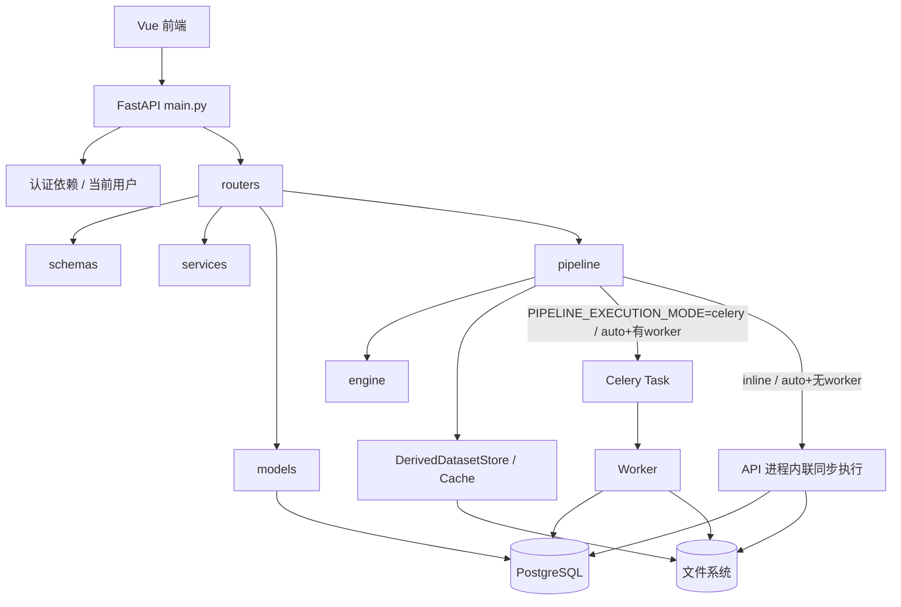

# 7-00 后端架构总览

> 本页是后端实现架构入口。它解释 FastAPI 后端如何组织代码、暴露多少 API、如何分层、如何访问数据库和文件、如何执行 Pipeline 与后台任务。

定位
: 后端代码组织、API 分布、分层边界、执行链路入口

事实源
: `elys_project/backend/app/`

更新
: 2026-06-05

## 一句话现状

当前后端以 FastAPI 为入口，按 `routers / schemas / services / models / pipeline / engine / tasks / utils` 组织；路由仍以 `/studies` 兼容当前代码语义，产品文档统一解释为 Study。文件访问、Task 查询/取消/重试/SSE、Execution Manifest、Execution lineage、DerivedDataset cleanup、数据导入异步化（`/recordings/import-async` 请求内落盘 + Celery worker 后台转 FIF + 任务轮询）等接口已经补齐，实际路由数量以代码为准，不再把固定数量作为架构约束。

**当前阶段额外关注**：API 同时要服务三类调用方——Web UI、SDK Scripts、未来的 LLM Agent。三端共享后端业务逻辑、差异在调用界面层，详见 [7-20 后端 API 设计与三端调用模型](7-20-后端API设计与三端调用模型.md)。

## 1. 后端职责

| 职责 | 当前承载 |
|---|---|
| HTTP API | `main.py` · `routers/*.py` |
| 鉴权与当前用户 | `utils/security.py` · `routers/auth.py` |
| Study/Study 权限 | `services/study_access.py` |
| 数据库连接 | `database.py` |
| ORM 模型 | `models/*.py` |
| 请求响应契约 | `schemas/*.py` |
| 数据导入与 FIF 转换 | `routers/datasets.py`（同步端点 `/recordings/import` 与异步 worker 共用转换核心 `materialize_recording_import`）·异步 worker `tasks/file_tasks.py` |
| 工作流定义、校验、运行 | `routers/pipelines.py` · `pipeline/*` |
| 节点算法执行 | `engine/*` · `pipeline/dispatcher.py` |
| DerivedDataset 写入与缓存 | `pipeline/derived_dataset_store.py` · `pipeline/cache.py` |
| 文件访问与存储 URI | `services/storage.py` · `services/file_browser.py` |
| Execution manifest 与依赖 | `pipeline/execution_manifest.py` · `services/execution_dependencies.py` |
| Celery 后台任务 | `tasks/celery_app.py` · `tasks/pipeline_tasks.py` · `tasks/file_tasks.py` |
| 数据库初始化 | `database/init.sql` · `database/schema/`（按业务模块拆 6 个 SQL 文件，升级走 DROP + 重建） |

## 2. 当前请求链路

> 执行有两条路径：`PIPELINE_EXECUTION_MODE=celery`（或 `auto` 且 ping 到 worker）派发 Celery 任务异步执行；`inline`（或 `auto` 且 ping 不到 worker）直接在 API 进程内同步跑完（`should_execute_pipeline_inline`）。本机 / 无 worker 环境走的就是 inline，详见 [7-40](7-40-工作流执行与后台任务.md)。

## 3. 章节拆分

| 子页 | 内容 | 何时阅读 |
|---|---|---|
| [7-10 后端工程结构与启动入口](7-10-后端工程结构与启动入口.md) | 目录组织、`main.py`、配置、数据库、启动流程 | 接手后端代码、定位入口时 |
| [7-20 后端 API 设计与三端调用模型](7-20-后端API设计与三端调用模型.md) | Web/SDK/LLM 三端差异、L1/L2/L3 分层、当前 L2 健康度盘点、演进路线（讨论稿） | 评估 API 整体架构、规划 SDK/LLM 接入时 |
| [2-50 API 设计总览](2-50-API设计总览.md) | API 资源设计与当前核心实际路由清单 | 对接前端或检查接口覆盖时 |
| [7-30 后端分层与数据契约](7-30-后端分层与数据契约.md) | router/schema/service/model/pipeline/engine/tasks 的边界 | 新增后端功能、避免层级混乱时 |
| [7-40 工作流执行与后台任务](7-40-工作流执行与后台任务.md) | PipelineExecutor、Dispatcher、DerivedDataset、Cache、Celery | 改工作流执行、异步任务、节点算法时 |

## 4. 与其它章节关系

| 章节 | 关系 |
|---|---|
| [2-00 系统架构总览](2-00-系统架构总览.md) | 全局部署、网络、系统对象；不展开代码细节 |
| [2-50 API 设计总览](2-50-API设计总览.md) | 标准 API 设计与当前代码实际接口 |
| [2-60 任务队列与异步架构](2-60-任务队列与异步架构.md) | 标准异步模型；本章 `7-40` 记录当前执行器与 Celery 接入 |
| [3-00 数据库设计总览](3-00-数据库设计总览.md) | 标准数据模型；后端通过 ORM 和 schema 访问 |
| [4-00 文件管理总览](4-00-文件管理总览.md) | 文件和 Artifact 存储规则；后端负责执行 |
| [5-00 研究管理总览](5-00-研究管理总览.md) | Study / Pipeline / Execution 产品边界；后端执行实现见 `7-40` |

## 5. 当前优先改进

**接下来**：

1. **L2 整顿**：`PUT /pipelines/{id}` 改 `PATCH`（如 schema 支持部分更新）；`emergency-takedown` 挪到 `/dataset-withdrawals/` 下；调研 `datasets` vs `recordings` 角色，二选一合并；补 `GET /dataset-assets/{id}` 单条详情。
2. **SDK 友好化**：把 `elys_scripts/common/elys_client.py` 发展为正式 Python SDK，先在 client 层原型化未来 L3 端点。
3. **Study 级聚合 SSE**：为 `async_tasks/task_events` 增加 Study 级聚合推送和前端接入。
4. **Dataset 导入直传**：同步导入已可改走异步——`POST /studies/{id}/recordings/import-async` 请求内落盘秒回 task_id、Celery worker `run_dataset_import` 后台转 FIF、客户端轮询 `/tasks/{id}`（同步 `/recordings/import` 仍在、与 worker 共用转换核心）。后续可再做客户端直传对象存储（presigned / staged upload），免大文件经 API 进程中转。
5. **DerivedDataset 物理清理**：补 trash/audit 策略；当前 retention_status 和 cleanup 仍是逻辑状态管理。
6. **L3 + LLM 规划**：设计 `/api/v2/tasks/...` 任务级 API 并对接 MCP；详见 [7-20](7-20-后端API设计与三端调用模型.md)。
