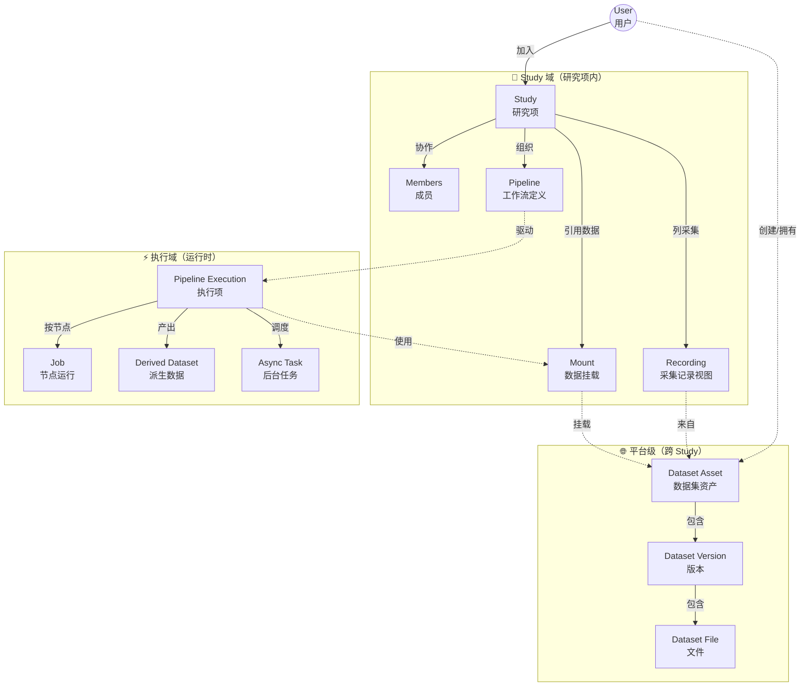
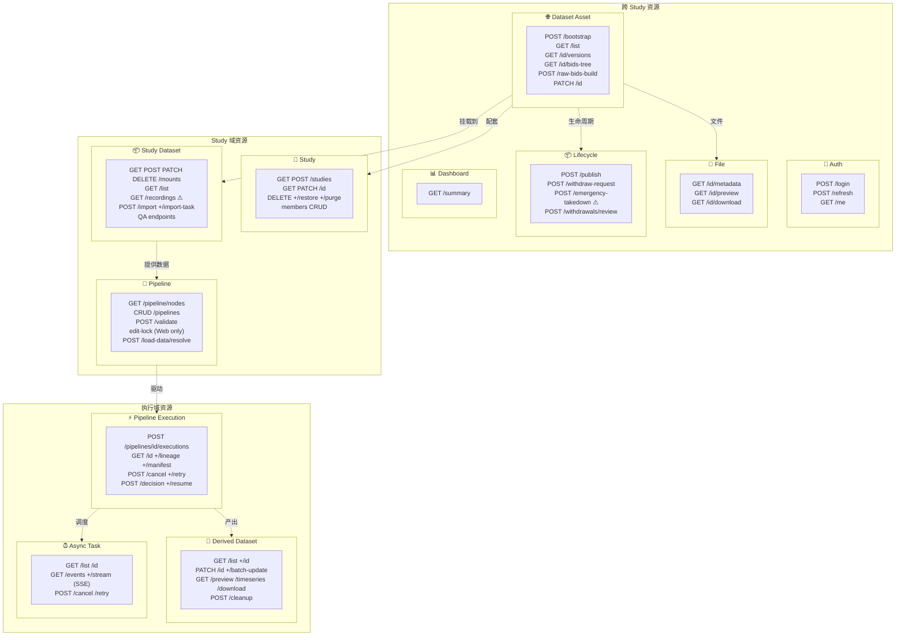

# 7-20 后端 API 设计与三端调用模型

> 本页是后端 API 的整体架构盘点 + 朝向**三端调用统一**的演进讨论。当前实际路由清单以 [2-50 API 设计总览](2-50-API设计总览.md) 为准；本页聚焦"为什么这么分层 / 三端怎么共用一套后端"的方法论。

<div class="elys-meta" markdown>

定位
: 三端调用方式（Web / SDK / LLM）、L1/L2/L3 分层架构、当前 L2 健康度盘点、演进路线

事实源
: `backend/app/routers/*` 实际端点 · `elys_scripts/common/elys_client.py` SDK 雏形

状态
: <span class="elys-badge elys-badge--wip">讨论中</span> — 本页为设计稿，结论待对齐后写入对应模块页

更新
: 2026-06-04

</div>

## 一句话主张

**当前 L2 资源 API 是健康的**（CRUD 清晰、权限三层分离、async 任务框架完备），主要问题是命名边界模糊（datasets/recordings/mounts 混用）与**缺少面向 SDK/LLM 的任务级抽象层（L3）**。未来不同调用方共用同一套后端业务逻辑（L1 services），分别在 L2/L3 上获得最合适的调用形态。

## 1. 三种调用方式

ELYS 后端面向三类调用方设计；当前已落地两类，第三类在规划。

| 调用方 | 典型场景 | 当前状态 |
|---|---|---|
| **Web UI**（Vue 3 SPA） | 人在浏览器里点 | <span class="elys-badge elys-badge--done">已实现</span> |
| **SDK Scripts**（Python） | 批量调试、自动化、CI | <span class="elys-badge elys-badge--wip">雏形</span>（`elys_scripts/`） |
| **LLM Agent**（function calling / MCP） | 自然语言驱动操作 | <span class="elys-badge elys-badge--planned">规划</span> |

**核心约束**：三端共享同一份业务逻辑实现，绝不允许"为某一端重写一遍业务"。差异只在调用界面层（HTTP 路径形状、参数粒度、返回结构）。

## 2. 三端需求差异

| 维度 | Web UI | SDK Scripts | LLM Agent |
|---|---|---|---|
| 关注端点形态 | 聚合 (一次拿展示所需) | 原子 + 可组合 | 任务级 (task-oriented) |
| SSE / 长连接 | 必须 | 可选（轮询亦可） | 不需要 |
| 乐观锁 / 编辑锁 | 必须（防并发编辑） | 不需要 | 不需要 |
| 节点交互（ICA 等） | 弹窗 + 用户决策 | 提前 config 写死 | 同 SDK，更声明式 |
| 错误信息 | 用户可读字符串 | 结构化 error code | 结构化 + 自然语言建议 |
| 幂等性 | 不强 | 重要 | **关键**（agent 自动重试） |
| 批量操作 | 少 | 多 | **多但参数简单** |
| 流式输出 | SSE | 轮询/SSE | 不需要 |
| 认证 | JWT + cookie 友好 | API key 友好 | API key 友好 |

### 2.1 LLM 特有需求

LLM 通过 function calling schema 决定调哪个端点，因此 API 设计直接决定 LLM 用得好不好：

1. **工具数量克制**：实测 >30 个工具时模型选择质量明显下降。**不能把全部端点都暴露给 LLM**，需要"精选高级 API"层。
2. **任务级而非 CRUD 级**：LLM 喜欢 `start_eeg_analysis(study, pipeline, datasets)`；不喜欢"先 create pipeline → 再 validate → 再 create run → 再 wait"。
3. **状态查询独立**：一个端点能拿到运行进度 + 当前节点 + 错误，不要 LLM 拼多个端点。
4. **避免复杂 nested 参数**：LLM 给 nested dict 易出错，复杂结构应封装为高级端点（如 `pipelines/from-template`）。

## 3. L1 / L2 / L3 分层架构

```mermaid
flowchart TB
  subgraph L3[L3 Task API — 语义化任务级]
    direction LR
    L3A[POST /v2/tasks/run-erp-analysis]
    L3B[POST /v2/tasks/process-dataset]
    L3C[GET /v2/runs/&#123;id&#125;/status]
  end
  subgraph L2[L2 Resource API — REST 资源级 当前层]
    direction LR
    L2A[CRUD on studies]
    L2B[CRUD on pipelines/executions]
    L2C[CRUD on datasets]
    L2D[async tasks]
  end
  subgraph L1[L1 Internal Services — Python 函数 当前层]
    direction LR
    L1A[bootstrap_dataset]
    L1B[retry_pipeline_execution]
    L1C[study_access]
  end
  Web[Web UI Vue] --> L2
  SDK[SDK Python] --> L3
  SDK --> L2
  LLM[LLM Agent] --> L3
  L3 --> L1
  L2 --> L1
  L1 --> DB[(PostgreSQL)]
  L1 --> FS[(Storage)]
```



**当前已有 L1 + L2**。L3 是为 SDK 易用性和 LLM 调用而生，规划中。

### 3.1 L1 Internal Services

| 特征 | 说明 |
|---|---|
| 形态 | Python 函数 / 类 |
| 位置 | `backend/app/services/*` |
| 谁调 | L2 router、L3 router、Celery worker、tests |
| 不暴露给 | 外部客户端 |
| 示例 | `bootstrap_dataset()`, `retry_pipeline_execution()`, `require_study_write()` |

### 3.2 L2 Resource API（当前层）

| 特征 | 说明 |
|---|---|
| 形态 | REST 资源端点 |
| 路径 | `/api/v1/...` |
| 主要消费者 | **Web UI**（细粒度控制）、SDK 进阶 |
| 设计哲学 | CRUD + 状态机动作（cancel/retry/publish） |
| 端点总数 | 80+（孤儿/别名清理后仍在持续扩展，**以代码为准**，不把固定数量当约束；新增如 execution 维度 `/derived-datasets`、跨 Study `include_cross_study` 等已超早期计数） |

### 3.3 L3 Task API（规划）

| 特征 | 说明 |
|---|---|
| 形态 | 语义化任务端点 |
| 路径 | `/api/v2/tasks/...`（候选） |
| 主要消费者 | **LLM Agent**、SDK 推荐用法 |
| 设计哲学 | 目标导向、聚合调用、可选同步等待 |
| 端点总数目标 | 15-20（克制） |
| 实现方式 | 内部编排多个 L1 service 调用 |

L3 候选端点举例（讨论中，待对齐）：

```text
POST /v2/tasks/quick-start
  { kind: "erp-analysis", params: {...} }
  → 自动建 study + 上传 dataset + 建 ERP pipeline + 运行 + 等结果

POST /v2/tasks/process-dataset
  { dataset_id: ..., pipeline_template: "default-erp", overrides: {...} }
  → 套用模板 pipeline + 运行 + 返回结果 ID

GET /v2/runs/{id}/status
  → { status, progress_pct, current_node, eta_sec, errors_summary }

POST /v2/runs/{id}/wait
  { timeout_sec: 600 }
  → 阻塞到 done，返回 final result + derived datasets list

GET /v2/catalog/pipeline-templates
  → LLM 选 template 的菜单（含 description）
```

## 4. 当前 L2 健康度盘点（按业务领域）

按业务对象重新分组（不按 router 文件），评估每个领域的端点必要性。

### 4.0 整体地图（两张图把当前 L2 端点装进一屏）

#### 图 A：资源拓扑 — 业务对象之间的关系

API 的 URL 嵌套形状反映的是这张关系图。**理解这张图，就理解了为什么端点要这么分组**。



要点：
- **平台级**资源跨 Study 共享（一个 Asset 可被多个 Study 挂载）；URL 不含 `study_id`
- **Study 域**资源属于某个 Study；URL 都带 `/studies/{id}/...`
- **执行域**资源由 Execution 触发产生；URL 多数也带 study scope
- `Recording` 与 `Mount + Asset` 角色重叠（已识别问题 4.5）

#### 图 B：API 领域地图 — 12 个分组与代表性端点



图中 ⚠ 标的两处是已识别的设计问题：
- `Recording` 与 `Mount` 角色重叠（见 4.5）
- `emergency-takedown` 分类位置不合理（见 4.4）

接下来按 12 个领域逐一展开必要性评级。


### 4.1 认证 / 用户 (Auth)

| 端点 | 必要性 | 备注 |
|---|---|---|
| POST `/auth/login` | 必需 | 三端通用 |
| POST `/auth/refresh` | 必需 | Web 自动续期；SDK 长任务用 |
| GET `/auth/me` | 通用 | 任何端验证 token 都用 |

**已识别问题**：无用户 CRUD 端点。如要做自服务注册或管理员管理用户，将来需要补 `/users` 资源。

### 4.2 研究项 (Study)

CRUD 完整 + 垃圾箱/恢复/永久删 + 成员管理。13 个端点。

**已识别问题**：
- 垃圾箱 / 恢复 / 永久删对 SDK/LLM 不一定需要，可考虑提供"DELETE 行为参数化"。
- `PUT /members/{mid}` 应改 `PATCH`（部分更新语义）。

### 4.3 数据集资产 (Dataset Assets) — 平台级

| 端点 | 必要性 | 备注 |
|---|---|---|
| POST `/dataset-assets/bootstrap` | 必需 | **唯一创建入口**，一次建 asset + study + mount |
| GET `/dataset-assets` | 必需 | 列表 |
| GET `/dataset-assets/{id}/versions` | 必要 | 版本列表 |
| POST `/dataset-assets/{id}/versions` | 必要 | 新 draft 版本 |
| GET `/dataset-assets/{id}/files` | 必要 | 文件列表 |
| GET `/dataset-assets/{id}/bids-tree` | 必要 | BIDS 树 |
| POST `/dataset-assets/{id}/raw-bids-build` | 必要 | 异步构建任务 |
| POST `/dataset-assets/{id}/canonical-fif-rebuild` | 必要 | 异步重建任务 |
| PATCH `/dataset-assets/{id}` | 必要 | 元信息更新 |

**已识别问题**：缺 `GET /dataset-assets/{id}`（拿单个 asset 详情，目前要从 list 里 filter）。

### 4.4 数据集生命周期 (Dataset Versions)

发版 / 申请撤回 / admin 审核 / superadmin 紧急下架。5 个端点。

**已识别问题**：`emergency-takedown` 在 `/dataset-versions/{id}` 下，但实际是 superadmin 操作，权限边界与 owner 操作混在一起。建议挪到 `/dataset-withdrawals/emergency-takedown/{version_id}`。

### 4.5 Study 下的数据集挂载 (Study Datasets / Mounts)

11 个端点。**最杂的领域**：

- `recordings` (3 个) 与 `datasets` (11 个) 路径并存
- mount / recording / dataset 三个概念在 URL 上彼此交织

**已识别问题**：
- `GET /studies/{id}/recordings` 与 `GET /studies/{id}/datasets` 过滤参数一致，角色重叠
- 需要业务层先明确："recording 是 dataset 的子集（单次采集），还是 dataset 的兼容别名？"
- 倾向方案：合并为 `datasets`，删 `recordings`（如确认是兼容别名）

### 4.6 文件 (Files)

3 个端点：metadata / preview / download。无问题。

**注**：前端 `datasetFileApi` 已删（无消费者）；后端 3 个端点保留作为未来文件预览功能预埋。

### 4.7 工作流定义 (Pipelines)

11 个端点：CRUD + validate + edit-lock（Web 专用）+ load-data resolve。

**已识别问题**：
- `PUT /pipelines/{id}` 应改 `PATCH`（看 schema 是否支持部分更新）
- edit-lock 三件套（acquire/refresh/release）只服务 Web UI，SDK/LLM 不需要——L3 设计时不要照搬

### 4.8 工作流执行 (Pipeline Executions)

12 个端点：创建 + 详情 + lineage + manifest + cancel + retry + node interaction。

**已识别问题**：
- 节点交互（decision/resume）对 LLM 难用——agent 流程被打断。L3 应提供"提前指定决策策略"的端点形态。
- 路径设计混搭：创建走 `/pipelines/{pid}/runs`（嵌套），其它操作走 `/pipeline-executions/{rid}/...`（平铺）——合理但不一致。

### 4.9 派生数据 (Derived Datasets)

9 个端点：跨 run 查询、单条详情、PATCH 改 tag/retention、批量改、cleanup、preview、timeseries、download。设计完整。

### 4.10 后台任务 (Async Tasks)

6 个端点：list / detail / events / events stream (SSE) / cancel / retry。

**已优化**：`retry` 端点对 `pipeline_execution` 类型已改为内部 dispatch（不再 409 redirect）。

### 4.11 仪表盘 (Dashboard)

1 个端点 `GET /dashboard/summary`。Web 专用聚合。

### 4.12 总体评价

| 维度 | 评价 |
|---|---|
| CRUD 完整性 | 高（基本所有业务对象都有完整 CRUD） |
| 权限设计 | 高（三层：系统级 + 项目级 + 资源级，清晰可组合） |
| 异步框架 | 高（async tasks + SSE 流 + node interaction 都完备） |
| 命名规范 | 中（kebab-case ✓ 但 datasets/recordings 边界模糊） |
| REST/RPC 混搭 | 健康（CRUD 用 REST，状态机操作用 RPC 动词，符合现代实践） |
| 文档可读性 | 高（FastAPI auto OpenAPI + 中文 docstring） |
| LLM 友好度 | 低（端点数量多、缺任务级抽象） |
| SDK 友好度 | 中（缺同步等待、错误码 enum、高级封装） |

## 5. 已识别的 L2 改进点（按优先级）

| 优先级 | 改动 | 工作量 | 风险 |
|---|---|---|---|
| 已完成 | 删 `POST /pipelines/{id}/run` 别名 | 5min | 极低 |
| 已完成 | 删假 `POST /auth/logout` 端点 | 5min | 低（同步改前端） |
| 已完成 | `tasks/{id}/retry` 对 `pipeline_execution` 类型内部 dispatch | 30min | 低 |
| 已完成 | 删 `POST /dataset-assets` 孤儿端点（孤立 dataset 没有 study） | 10min | 低 |
| 待评估 | `PUT /pipelines/{id}` → `PATCH`（如 schema 支持） | 5min + 前端跟进 | 低 |
| 待评估 | `emergency-takedown` 挪到 `/dataset-withdrawals/` 下 | 10min + 前端跟进 | 低 |
| 待评估 | `datasets` vs `recordings` 角色合并 | 1-2h，要先调研前端使用 | 中 |
| 待评估 | 补 `GET /dataset-assets/{id}` 单个 asset 详情 | 30min | 低 |

## 6. 演进路线

### 阶段 1：L2 整顿（当前 — 1 周）

- ✓ 删孤儿端点（已完成）
- 待做：PATCH/PUT 统一、emergency-takedown 挪位、datasets/recordings 二选一
- 待做：补缺失的 `GET /dataset-assets/{id}`

### 阶段 2：SDK 友好化（1-2 月）

- 把 `elys_scripts/common/elys_client.py` 发展为正式 Python SDK
- 提供"高级方法"：`run_erp_analysis(study, dataset)` 内部封装多次 API 调用
- 同步包装：`wait_for_run()` 内部 poll，调用方不关心轮询
- 错误码 enum 化，便于 SDK 用户 catch 特定错误
- 关键：把"未来 L3 endpoint"先在 SDK client 里原型化——便宜、可迭代、不动后端

### 阶段 3：L3 Task API + LLM（3-6 月）

- 新开 `/api/v2/tasks/...` 一组任务级 endpoint，内部编排 L1 services
- 编写 **MCP server** 把 L3 端点暴露给 Claude / GPT
- 提供 `GET /v2/catalog/...` 让 LLM 看菜单
- 关键：工具描述写得清楚 = LLM 选对工具

### 阶段 4：抽象层稳定（长期）

- L2 保持稳定（Web 用）
- L3 持续演化（LLM 能力变，task 粒度也调）
- 三端共用同一套 L1 services 保证一致性

## 7. 设计探索方法

最便宜的"L3 设计探索"方式：**用 SDK client 原型化，不动后端**。

工作流：

1. 选 1-2 个典型分析场景（例如"对一批 sub093 数据做 ERP 分析并出图"）
2. 用现有 L2 API 在 SDK 里实现，调用方法的 signature 即为未来 L3 端点的样子
3. 用得不顺手时记录痛点 → 下次 SDK 重构时改进
4. SDK 封装稳定后，再"上移"为后端 L3 端点（路径、payload、返回结构基本照搬）

这避免了"在白板上空想 L3 应该是什么样"的陷阱——让真实使用驱动设计。

## 8. 未决议项（讨论用）

1. **L3 路径前缀**：`/api/v2/tasks/...` 还是 `/api/v1/tasks/...`（在现 `/tasks/` 下扩展）？
2. **L3 路径分组**：按"业务对象"（dataset/study/pipeline）还是按"任务类型"（quick-start/process/analyze）？
3. **同步等待端点**：是否提供 `POST /runs/{id}/wait`，还是要求所有调用方都用 SSE/polling？
4. **LLM 安全护栏**：哪些 L3 端点必须 dry-run 模式优先？哪些不允许 LLM 直接调（如 purge/emergency-takedown）？
5. **MCP 还是直接暴露 OpenAPI**：MCP 是 Anthropic 协议，OpenAPI 是通用标准——选哪个或两者都做？
6. **recordings vs datasets**：是真业务子集还是兼容别名？删哪个？
7. **节点交互（ICA）的 LLM 形态**：如何让"等待人工决策"在 agent 场景下变成"提前给策略"？

## 9. 相关页面

- [2-50 API 设计总览](2-50-API设计总览.md) — 当前 L2 端点的权威清单
- [7-00 后端架构总览](7-00-后端架构总览.md) — 后端代码组织入口
- [7-30 后端分层与数据契约](7-30-后端分层与数据契约.md) — Router/Schema/Service 内部分层
- [7-40 工作流执行与后台任务](7-40-工作流执行与后台任务.md) — Pipeline 执行细节
- [1-50 阶段路线图](1-50-阶段路线图.md) — 整体产品阶段
