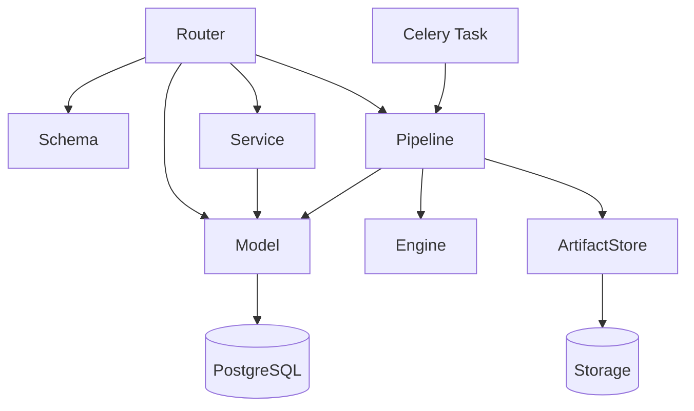

# 7-30 后端分层与数据契约

> 本页说明后端各层职责、调用方向、请求/响应契约、事务边界和错误处理约定。

<div class="elys-meta" markdown>

定位
: Router / Schema / Service / Model / Pipeline / Engine / Task 分层规范

更新
: 2026-06-04

</div>

## 1. 分层结构

| 层 | 目录 | 职责 |
|---|---|---|
| Router | `routers/` | HTTP 路由、依赖注入、权限检查、状态码 |
| Schema | `schemas/` | Pydantic 请求/响应模型 |
| Service | `services/` | 可复用业务逻辑，例如权限、QA、锁、依赖保护 |
| Model | `models/` | SQLAlchemy ORM 实体 |
| Pipeline | `pipeline/` | 工作流注册、校验、执行、缓存、DerivedDataset 写入 |
| Engine | `engine/` | EEG 算法和 MNE 相关计算 |
| Task | `tasks/` | Celery app 和后台任务入口 |
| Utils | `utils/` | JWT、密码 hash 等纯工具 |

后端分层的关键约束：Router 负责 API 入口和权限，Service 负责锁、任务事件、依赖保护等跨模块规则，Pipeline 层负责输入解析、节点执行和 DerivedDataset 登记，Task 层只作为后台调度信封，不应成为 Execution 事实源。

## 2. 调用方向



约束：

- `models/` 不调用 `routers/`。
- `utils/` 不依赖业务层。
- `engine/` 尽量保持算法纯度，不直接处理 HTTP。
- `pipeline/` 可以读写 DB，但应通过清晰的执行上下文和 ArtifactStore 管理 DerivedDataset 输出。
- 共享业务逻辑不要散落在 router 中，优先沉到 service 或 pipeline。

## 3. Router 层

Router 层负责 HTTP 语义：

| 职责 | 示例 |
|---|---|
| 认证依赖 | `current_user: User = Depends(get_current_user)` |
| 数据库依赖 | `db: Session = Depends(get_db)` |
| 权限检查 | `get_study_for_read/write` |
| 状态码 | `201 Created`、`204 No Content`、`409 Conflict` |
| 错误响应 | `HTTPException(detail={code, message, ...})` |
| 文件上传 | `UploadFile`、`Form` |

Router 不应承担长耗时计算。导入、转换、Pipeline 执行应逐步改为 Task。

## 4. Schema 层

Schema 层用 Pydantic 维护 API 契约。

| 文件 | 当前职责 |
|---|---|
| `schemas/auth.py` | 登录、刷新、登录响应 |
| `schemas/study.py` | Study、成员、删除动作 |
| `schemas/dataset.py` | Dataset 列表、上传响应、QA 报告 |
| `schemas/dataset_lifecycle.py` | 发版、撤回、紧急下架 |
| `schemas/derived_dataset.py` | DerivedDataset 元信息、预览、cleanup |
| `schemas/pipeline.py` | NodeSpec、Pipeline、Execution、Job、LoadData、Manifest |
| `schemas/dashboard.py` | 首页聚合摘要 |

规则：

- 请求和响应模型优先放在 `schemas/`。
- 不在多个 router 中重复定义同形状的临时 `BaseModel`。
- 对外响应不要暴露服务器绝对路径。
- UUID、时间、状态枚举要保持稳定。

## 5. Service 层

Service 层放跨 router 复用的业务逻辑。

| 文件 | 职责 |
|---|---|
| `study_access.py` | Study 读写权限、owner/admin/member 判断 |
| `study_locks.py` | Pipeline 编辑锁与运行锁 |
| `dataset_qa.py` | QA 报告构建和人工确认辅助逻辑 |
| `dataset_bootstrap.py` | Asset + Study + Mount 一次创建 |
| `dataset_assets.py` / `dataset_lifecycle.py` | Asset 元信息、发版与撤回 |
| `async_tasks.py` / `task_events.py` | `async_tasks` 创建、状态推进与事件流 |
| `execution_dependencies.py` | 上游依赖登记与清理保护 |
| `pipeline_execution_rules.py` | Execution 创建/cancel/retry 的复用规则 |
| `audit_events.py` | 统一写入 `audit_events` |

后续建议增加：

| Service | 用途 |
|---|---|
| `dataset_service.py` | Dataset/Recording/Version 创建、重传、文件索引的进一步抽象 |
| `storage_service.py` | `storage_uri` 读写、下载、迁移到 MinIO |

## 6. Model 层

Model 层当前集中在 `models/study.py`，包含 Study、Dataset、Pipeline、PipelineExecution、PipelineJob 等对象；`DerivedDataset` 已独立到 `models/derived_dataset.py`。后续可继续按业务对象拆分：

| 当前集中模型 | 建议拆分 |
|---|---|
| `Study` / `StudyMember` | `study.py` |
| `DatasetAsset` / `DatasetVersion` / `StudyDatasetMount` / `Subject` / `Dataset` / `DatasetUpload` / `DatasetFile` / `Recording` / `RecordingVersion` / `DatasetFileDerivation` / `DatasetVersionReference` / `DatasetWithdrawalRequest` | `dataset.py` |
| `PipelineDefinition` / `PipelineExecution` / `PipelineJob` | `pipeline.py` |
| `DerivedDataset` | 已独立在 `derived_dataset.py` |

调试期可大胆改字段和表名，schema 升级走 DROP + 重建（见 [7-10 §6](7-10-后端工程结构与启动入口.md#6-数据库初始化与升级)）。

## 7. 事务边界

| 场景 | 建议 |
|---|---|
| 轻量 CRUD | Router 或 service 内一次 commit |
| 导入文件 | 文件先写 staging，DB 成功后发布；失败要清理或标记 |
| Pipeline Execution | API 创建 Execution/Task 后 commit；Worker 执行节点时按阶段 commit |
| DerivedDataset 发布 | 临时文件写完、hash 成功、DB 记录成功后再视为正式产物 |
| 审计 | 关键行为和业务状态同事务或补偿写入 |

不要让一个 HTTP 请求长期持有 DB 事务跑完整 EEG 计算。

## 8. 错误契约

推荐统一结构：

```json
{
  "detail": {
    "code": "RESOURCE_LOCKED",
    "message": "Pipeline is already running.",
    "resource_id": "uuid"
  }
}
```

错误码应稳定，前端不要靠中文 message 判断逻辑。

## 9. 相关页面

- [2-50 API 设计总览](2-50-API设计总览.md)
- [3-00 数据库设计总览](3-00-数据库设计总览.md)
- [2-50 API 设计总览](2-50-API设计总览.md)
