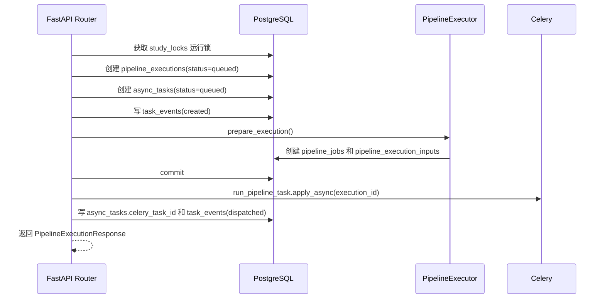
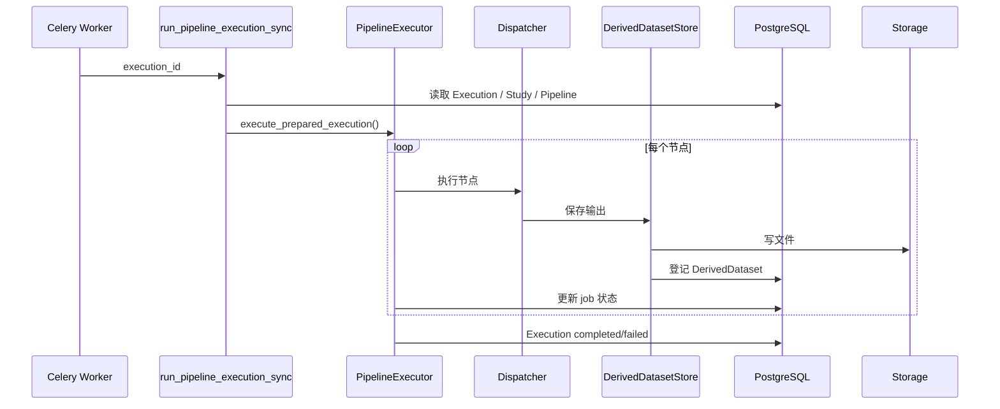

# 7-40 工作流执行与后台任务

> 本页说明后端如何执行 Pipeline、如何记录 Execution、如何写 DerivedDataset、如何接入 Celery 后台任务。

<div class="elys-meta" markdown>

定位
: PipelineExecutor、Dispatcher、DerivedDatasetStore、Cache、Celery

事实源
: `backend/app/pipeline/` · `backend/app/engine/` · `backend/app/tasks/`

更新
: 2026-06-04

</div>

## 1. 当前组件

| 组件 | 文件 | 职责 |
|---|---|---|
| NodeRegistry | `pipeline/registry.py` | 加载 `pipeline/nodes/*.json` 节点规格 |
| Validator | `pipeline/validator.py` | 校验节点、连线、参数、LoadData 和 executor 支持 |
| LoadData | `pipeline/load_data.py` | 解析真实数据输入 |
| PipelineExecutor | `pipeline/executor.py` | 准备和执行 Execution、创建 PipelineJob |
| Dispatcher | `pipeline/dispatcher.py` | 调用具体节点执行逻辑 |
| DerivedDatasetStore | `pipeline/derived_dataset_store.py` | 写入输出文件并登记 `derived_datasets` |
| PipelineCache | `pipeline/cache.py` | 节点缓存命中和 DerivedDataset 复用 |
| Background Runner | `pipeline/background.py` | Worker 内同步执行一个 Execution |
| Celery App | `tasks/celery_app.py` | broker/backend/queue 配置 |
| Pipeline Task | `tasks/pipeline_tasks.py` | Celery 任务入口 |
| File Task | `tasks/file_tasks.py` | Dataset 导入骨架、Raw BIDS 构建、canonical FIF 重建、DerivedDataset cleanup |
| Task Event Service | `services/task_events.py` | 更新 `async_tasks` 并追加 `task_events` |
| Async Task Service | `services/async_tasks.py` | 创建并序列化 `async_tasks` |
| Execution Dependency Service | `services/execution_dependencies.py` | 写入上游 DerivedDataset 依赖并保护清理 |
| Study Lock Service | `services/study_locks.py` | Pipeline 编辑锁和运行锁的获取、续期与释放 |
| Engine | `engine/*` | EEG 预处理、ICA、epoch、ERP 等算法 |

上述组件已经能支撑 Pipeline/Execution 的 MVP 主链路，包括输入快照、DerivedDataset 写入、Execution Manifest、依赖保护、Execution/Task cancel/retry 和 Task SSE。当前仍缺的是部署级验证：真实 Celery worker、真实 MNE 转换、长任务协作式取消和浏览器端 SSE 断线重连。

## 2. Execution 创建链路

当前入口 `POST /studies/{study_id}/pipelines/{pipeline_id}/executions` 做这些事：



> 上图是 **Celery 异步路径**。执行创建（`pipelines.py:3500` / retry `:2744`）在派发前先调 `should_execute_pipeline_inline(settings)`：当 `PIPELINE_EXECUTION_MODE=inline`，或 `auto` 模式下 `celery_workers_available()` ping 不到 worker（超时 `CELERY_WORKER_PING_TIMEOUT_SECONDS`）时，改为 `execute_pipeline_execution_inline` 在 **API 进程内同步跑完**，不派发 Celery。阿里云生产部署默认 `PIPELINE_EXECUTION_MODE=celery`（`deploy/deploy.sh`），走上面的异步链路；本地 `apply_local_profile.sh` 默认 `auto`，没起 worker 时就回落到 inline 同步执行。

当前已补：

- `pipeline_execution_inputs`：冻结实际输入。
- `async_tasks`：结构化记录 Celery task。
- `study_locks`：防止同一 Pipeline 并发运行，也用于 Pipeline 编辑锁。
- `NodeDispatcher.supports()`：Execution 创建前确认每个 NodeSpec 都有真实 handler。

当前已补：

- `manifest_json`：Execution 执行清单摘要。
- `/tasks/{task_id}` 查询、`/tasks/{task_id}/events` 事件列表和 `/tasks/{task_id}/events/stream` SSE 事件流。
- DerivedDataset cleanup 异步任务。

后续还需要补：真实 staged Dataset import、Study 级聚合事件流和运行中长节点的协作式取消检查。

Execution cancel 已接入：`POST /studies/{study_id}/pipeline-executions/{execution_id}/cancel` 可取消 `queued`、`running`、`waiting_user_input` Execution，取消时写 `task_events` 和 `audit_events`，释放 `study_locks` 运行锁，并生成或刷新 Execution Manifest。Celery revoke 当前是 best-effort；worker 只在任务启动前识别已取消 Execution，运行中长节点的协作式中断还需要后续补齐。

Execution retry 已接入：`POST /studies/{study_id}/pipeline-executions/{execution_id}/retry` 可从 `failed/canceled` Execution 创建新的 Execution。默认 `input_policy=reuse_snapshot` 会复制旧 Execution 的输入快照；`input_policy=re_resolve` 会基于旧 `definition_snapshot` 重新解析输入。新 Execution 会创建新的 `async_tasks`，并通过 `pipeline_execution_dependencies(dependency_kind=retry_of)` 记录来源。

Task cancel/retry 已接入：`POST /studies/{study_id}/tasks/{task_id}/cancel` 可取消 `queued/running/retrying` Task 并写 `task_events`；普通文件任务会 best-effort revoke Celery，`pipeline_execution` 任务会同步取消对应 Execution、释放运行锁并刷新 manifest。`POST /studies/{study_id}/tasks/{task_id}/retry` 直接重试普通文件任务；`pipeline_execution` 任务则通过内部 dispatch 复用 Execution retry 逻辑，调用方无需再单独触发。

Task events SSE 已接入：`GET /studies/{study_id}/tasks/{task_id}/events/stream` 返回 `text/event-stream`。流开始会发送 `ready`，新事件使用 `task_event`，空闲期发送 `heartbeat`，到达服务端最长连接时间后发送 `stream_closed`。客户端可用 `Last-Event-ID` 或 `?since=<event_id|ISO时间>` 断线续读；普通 `GET /events` 也支持同样的 `since` 增量参数。

Execution lineage 已接入：`GET /studies/{study_id}/pipeline-executions/{execution_id}/lineage` 聚合 `pipeline_execution_inputs`、当前 Execution 的 `derived_datasets`、上游 `pipeline_execution_dependencies` 和下游反向依赖，返回 `inputs/derived_datasets/upstream_runs/downstream_runs/upstream_dependencies/downstream_dependencies/graph_nodes/graph_edges`。该接口不改变 Execution detail 响应，专门服务依赖图、清理阻断提示和结果溯源面板。

DerivedDataset 语义操作已接入：`PATCH /derived-datasets/{ds_id}` 统一改 `display_name / description / tags / retention_status`，对应旧 `pin/unpin/hide` 三个 POST 端点的合并。`retention_status` 切换到 `deleted` 时复用 `services/execution_dependencies.py` 的 blocker 检查，被下游 Execution 引用时返回 409 和依赖详情，所有操作写 `audit_events`。

## 3. Worker 执行链路

Celery 任务入口是 `run_pipeline_task(execution_id, study_id)`。



## 4. DerivedDataset 写入

DerivedDatasetStore 将节点输出写到 content-addressed 目录：

```text
storage/studies/{study_id}/derived/{sha256[:2]}/{sha256}/
```

写入完成后登记一条 `derived_datasets` 记录，字段包含：

| 字段 | 含义 |
|---|---|
| `storage_uri` | content-addressed 目录的逻辑 URI（`elys://studies/...`） |
| `sha256` | 内容哈希，缓存命中和复用的依据 |
| `retention_status` | 保留/隐藏/待清理状态 |
| `produced_by_execution_id` / `produced_by_job_id` | 来源 Execution 和节点 Job |

## 5. 缓存复用

节点缓存的核心是 `node_hash`。

```text
node_hash = hash(node_type + node_version + params + input_hash + upstream_artifact_hash + software_version)
```

命中缓存时：

- 当前 `job` 可标记为 `cached`。
- 新 Execution 可以复用已有 DerivedDataset。
- 不重复写大文件。
- 必须登记依赖关系，避免清理掉下游正在使用的输出。

## 6. 交互节点

当前后端已经支持等待人工输入的节点接口：

| API | 用途 |
|---|---|
| `GET /studies/{study_id}/pipeline-executions/{execution_id}/jobs/{job_id}/interaction` | 读取交互状态 |
| `POST /studies/{study_id}/pipeline-executions/{execution_id}/jobs/{job_id}/decision` | 提交人工决策 |
| `POST /studies/{study_id}/pipeline-executions/{execution_id}/jobs/{job_id}/resume` | 继续执行 |
| `GET /studies/{study_id}/pipeline-executions/{execution_id}/lineage` | 读取 Execution 输入、输出、上下游依赖图 |

典型用于 ICA 排除成分。后续应把人工决策写入 Execution Manifest 和 `pipeline_jobs.output_json`。

## 7. 后台任务现状

| 项 | 当前状态 | 后续目标 |
|---|---|---|
| Celery app | 已有 | 增加多队列 |
| Redis broker | 已配置 | 增加连接健康检查 |
| Pipeline execution task | 已有 | 已同步 `async_tasks` / `task_events` |
| File task | 已有 | `derived_dataset_cleanup` 可用；`dataset_import`、`raw_bids_build`、`canonical_fif_rebuild` 仍是骨架 |
| Dataset import task | 已有入口 | 从同步导入迁移到 staged upload + worker |
| SSE 进度 | Task 级已接 | 前端 Execution detail 已展示 task/events 摘要；实时 SSE 客户端和 Study 级聚合流待补 |
| 取消/重试 | Execution cancel/retry 与 Task cancel/retry 基础 API 已接 | Task + Execution 状态机 |

## 8. 与标准模型的差距

| 差距 | 影响 | 优先级 |
|---|---|---|
| 运行中长任务尚未协作式中断 | Task/Execution cancel 会 best-effort revoke；已经进入长耗时节点后仍需要节点主动检查取消状态 | 高 |
| 部分 NodeSpec 暂无 executor | 会在 validate 阶段返回 `PIPELINE_NODE_EXECUTOR_NOT_IMPLEMENTED` | 高 |
| Dataset 导入仍同步 | 大文件上传转换阻塞 HTTP | 中 |
| Study 级聚合事件流未接 | 当前已有 task 级 SSE，Execution/Study 页面若要一次订阅多个任务还需聚合流 | 中 |
| Lineage 前端图形化未接 | 前端已有 Lineage 分栏和懒加载入口，后续还需要图视图、过滤和清理阻断提示 | 中 |
| 物理清理未开启 | `derived_dataset_cleanup` 和 hide 当前只做逻辑删除，不移动到 trash | 中 |

## 9. 相关页面

- [2-60 任务队列与异步架构](2-60-任务队列与异步架构.md)
- [5-00 研究管理总览](5-00-研究管理总览.md)
- [3-40 Execution 与 Artifact 追溯表](3-40-Execution与Artifact追溯表.md)
- [4-30 Study 输出与 Artifact](4-30-Study输出与Artifact.md)
