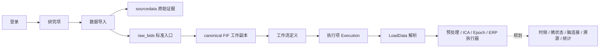

# 念析 ELYS 文档中心

> 念析（ELYS, EEG anaLYSis）是面向科研级脑电的 Web 工作台，把数据集、研究项、工作流、执行项、文件归档、分析、观察、统计、出图和机器学习规划到同一套可追溯平台中。

代码根
: `elys_project/`

事实源
: **P0 当前代码 · P1 `wiki/docs`**（冲突时以 P0 为准）

更新
: 2026-06-05 +08:00

## 现状一句话

当前平台已经走通 **登录 → 创建研究项（现代码名 study）→ 导入 EEG → 归档原始文件 → 生成 canonical FIF → 工作流编排 → 执行项运行** 主线，工作流的 10 个内置节点（LoadData、FIR / Butterworth / Notch 滤波、重采样、重参考、Compute / Apply ICA、Epoch、ERP）均已接真实执行器，可跑通"预处理 → ICA → 分段 → ERP"一条链（节点清单见 [5-25 工作流节点路线图](5-25-工作流节点路线图.md)）。账号权限与数据管理较完整；数据质控、工作流、预处理为部分接入；时频 / 微状态 / 脑连接 / 溯源、观察、统计、出图、机器学习多数仍处于规划或静态预览阶段。

## 业务名 ↔ 代码类名 ↔ 中文

界面上的中文叫法、文档里的业务名、和后端 ORM 类名（ORM，Object-Relational Mapping，把数据库一行映射成一个 Python 对象的类）不总是字面一致。下表是统一对照，文档其余部分按此口径：

| 业务名 | 代码类名 | 中文 |
|---|---|---|
| 数据集 | `DatasetAsset` | 用户视角可复用的数据资产 |
| 采集记录 | `Recording` | 一条 BIDS `subject/session/task/run` 单元 |
| 上传版本 | `RecordingVersion` | 某条采集记录的一次上传 / 重传 |
| 研究项 | `Study` | 一个分析项目与其协作、权限边界 |
| 工作流 | `Pipeline` | 节点图定义的分析流程 |
| 执行项 | `Execution`（`PipelineExecution`） | 工作流的一次具体运行 |
| 派生数据 | `DerivedDataset` | 执行项产出的中间 / 结果数据 |

## 技术栈

`Vue 3` `TypeScript` `Pinia` `Vite` `LiteGraph.js` `FastAPI` `Pydantic 2` `SQLAlchemy 2` `MNE-Python` `PostgreSQL` `Redis` `Nginx`

详见 [2-00 系统架构总览](2-00-系统架构总览.md) 与 [2-80 代码工程结构](2-80-代码工程结构.md)。

## 代码目录速览

代码根在 `elys_project/` 下：`backend` 后端（FastAPI 服务）、`frontend/elys-web` 前端（Vue 应用）、`database` 库表 schema、`deploy` 部署脚本、`wiki` 本文档站。详见 [2-80 代码工程结构](2-80-代码工程结构.md)。

## 推荐阅读

| 编号 | 页面 | 主要内容 | 何时读 |
|---|---|---|---|
| 0 | [协作规范](0-00-协作规范总览.md) | 事实源、状态语义、写作规则、维护规则 | 新人第一站 |
| 1 | [需求分析](1-00-需求分析总览.md) | 产品目标、用户价值、模块优先级、能力边界 | 评估范围与路线 |
| 2 | [系统架构](2-00-系统架构总览.md) | 数据集 / 研究项 / 工作流 / 执行项、双服务器、访问路由、安全边界 | 改核心对象、部署与联调前 |
| 3 | [数据库设计](3-00-数据库设计总览.md) | 表总览、关键约束、角色权限、版本指针 | 改模型或库表时 |
| 4 | [文件管理](4-00-文件管理总览.md) | 数据集 / 研究项 文件边界、Raw BIDS 视图、canonical FIF、执行项输出、导出规划 | 改导入/存储时 |
| 5 | [研究管理](5-00-研究管理总览.md) | Study 协作、Pipeline 定义、Execution 执行、LoadData、追溯与输出管理 | 改研究项、工作流、运行链路时 |
| 6 | [前端页面](6-00-前端页面总览.md) | 路由、组件、API 客户端、状态与导航；[设计原则](6-01-设计原则与UI约定.md) · [认证](6-10-展示与认证.md) · [研究项管理](6-20-研究项与数据管理.md) · [工作流](6-30-工作流与执行.md) · [预处理/观察](6-40-预处理与观察.md) · [统计/ML](6-50-输出与智能.md) | 改前端页面时 |
| 7 | [后端架构](7-00-后端架构总览.md) | FastAPI 组织、API 分层契约、Pipeline 执行与后台任务 | 改后端时 |
| 8 | [功能模块](8-00-功能模块总览.md) | M0-M12 模块地图、状态与主线流程 | 拆任务与排期时 |
| 9 | [更新日志](9-00-更新日志.md) | 文档级与系统级决策变化的时间线 | 查"为什么改成这样"时；想知道最近进展也先看这里 |

## 模块状态

| 模块 | 能力 | 当前状态 |
|---|---|---|
| M0 账号权限 | JWT 登录、RBAC、研究项成员权限 | 已实现 |
| M1 数据管理 | 数据集、研究项、被试、导入、上传版本、FIF 工作数据 | 已实现 |
| M2 数据质控 | 导入校验已接，真实信号 QC 待开发 | 部分接入 |
| M3 工作流 | 节点规格、定义 CRUD、校验、10 节点执行器（预处理→ICA→Epoch→ERP 可跑通） | 部分接入 |
| M4 预处理 | 滤波 / 重采样 / 重参考 / ICA / Epoch 执行器已接 | 部分接入 |
| M5 时频分析 | ERP 已接；PSD / TFR 规划 | 部分接入 |
| M6-M8 高级分析 | 微状态、脑连接、溯源 | 规划 |
| M9-M12 输出与智能 | 观察、统计、科研作图、机器学习 | 规划 |

!!! warning "前端有页面 ≠ 后端有能力"
    M2-M12 里标"规划"或"部分接入"的模块，前端常已有静态预览页（占位 UI、假数据），但这不等于后端已实现对应能力。判断"做到哪"以代码、数据库、接口调用链能否核验为准，详见 [0-40 冲突处理与权威来源](0-40-冲突处理与权威来源.md)。

## 主线流程

## 文档维护规则

- 事实源唯一指向**当前代码**（`elys_project/`）；冲突时以代码为准，文档跟随代码修改。
- 写"已实现"必须能在代码、数据库、接口或页面调用链中核验。
- 静态预览页不能写成后端真实能力。
- 改数据库、API、路由、工作流、执行项或模块状态时，要同步更新对应总览页。
- 重大决策变化（命名、API、表结构、章节调整等）要追加一条到 [9 更新日志](9-00-更新日志.md)。
