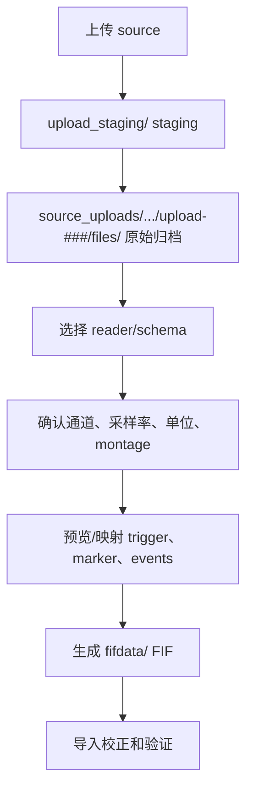

# BIDS 管理：兼容格式与 FIF 导入策略

> 更新日期：2026-05-15  
> 关联主文档：[BIDS管理.md](BIDS管理.md)  
> 目的：明确“兼容更多 EEG 格式”“统一用 FIF 处理”和“保持 BIDS 可导出”之间的边界。

## 1. 总体结论

兼容更多格式的推荐方式是：

```text
所有原始格式 -> source_uploads/ 原始归档
所有可处理数据 -> fifdata/ FIF
需要官方 BIDS 时 -> bids_exports/
```

因此：

- BrainVision/EDF/BDF 不再“直接进入 BIDS source_uploads”，而是原样归档后生成 FIF。
- CNT/MFF/GDF/MAT/HDF5/CSV 仍然需要高级导入，但输出也是 FIF。
- 不再需要 `sourcedata/`，因为 `source_uploads/` 本身就是 source archive。
- `fifdata/` 使用 BIDS entities 组织，但不是官方 BIDS raw dataset。

## 2. 标准原始上传

| 格式 | 扩展名 | 读取稳定性 | trigger 风险 | 处理策略 |
|------|------|------|------|------|
| BrainVision | `.vhdr/.vmrk/.eeg` | 高 | 低 | 原样归档，读取 `.vmrk`，生成 FIF |
| EDF / EDF+ | `.edf` | 中高 | 中到高 | 原样归档，检查 annotations/trigger/status，生成 FIF |
| BioSemi BDF / BDF+ | `.bdf` | 中高 | 中 | 原样归档，解析 `Status` 通道，生成 FIF |

标准格式的流程：

```text
上传 -> source_uploads/sub-*/[ses-*]/task-*/run-*/upload-###/files/ -> MNE reader -> fifdata/ -> import validation
```

## 3. 高级格式导入

| 格式 | 扩展名 | 风险 | 处理策略 |
|------|------|------|------|
| Neuroscan CNT | `.cnt` | 和 ANT 同扩展名 | 用户选择 Neuroscan/Curry reader，生成 FIF |
| ANT / EEProbe CNT | `.cnt` | 和 Neuroscan 同扩展名 | 用户选择 ANT/EEProbe/eego reader，生成 FIF |
| EGI / Net Station | `.mff` | 目录包完整性和事件来源 | 上传完整目录包，确认 montage/events，生成 FIF |
| GDF | `.gdf` | 事件编码和通道类型 | 读取后确认 event channel、单位、通道类型，生成 FIF |
| MATLAB | `.mat` | 私有结构 | 只接受单变量二维矩阵，补元数据后生成 FIF |
| HDF5 | `.h5/.hdf5` | 私有 schema | 只接受平台定义 schema |
| CSV/TSV/TXT | `.csv/.tsv/.txt` | 缺采样率、单位、通道语义 | 连续 EEG 只接受矩阵模板；行为/events 可直接表格导入 |

高级导入流程：



## 4. EDF/BDF trigger 风险

EDF/BDF 虽然读取稳定，但 trigger 不一定稳定。

| 格式 | 常见事件来源 | 风险 |
|------|------|------|
| EDF/EDF+ | annotations、`Trigger` 通道、`Status` 通道、外部行为 log | 不同采集软件写法不一致 |
| BDF/BDF+ | BioSemi `Status` 通道、BDF+ annotations | 可能混合 TTL、按键、设备状态 bits |

导入时必须：

1. 检查 `raw.annotations`。
2. 检查 `Status` / `Trigger` / `STI` 通道。
3. 支持 rising edge / falling edge。
4. 支持 bit mask、bit shift、事件码映射。
5. 显示事件码和计数预览。
6. 允许用户上传外部 events TSV。

## 5. CNT 同扩展名问题

`.cnt` 不能只靠扩展名识别。

UI 必须让用户选择：

```text
CNT 来源：
[ ] Neuroscan / Curry / Compumedics
[ ] ANT Neuro / EEProbe / eego
```

后端用对应 reader 验证，并把 reader 选择写入 `import-report.json` 和数据库。

## 6. 矩阵类格式边界

MAT/HDF5/CSV/TSV/TXT 不是 EEG 采集格式，而是容器或表格。平台不能自动猜语义。

连续 EEG 只接受：

```text
data shape = [n_times, n_channels]
sampling_frequency required
channel_names required
channel_types required
units required
events optional
```

MAT 首期限制：

```text
只能有一个有效变量
变量必须是二维数值矩阵
方向固定为 time x channel
不接受 epoch、平均、特征化或预处理后的数据
```

HDF5 必须使用平台 schema。CSV/TSV/TXT 如果没有采样率、单位、通道名，只能作为行为表、events 表或 phenotype 表。

## 7. source_uploads 与 fifdata 的关系

原始文件：

```text
source_uploads/sub-001/ses-01/task-rest/run-01/upload-001/files/original.cnt
source_uploads/sub-001/ses-01/task-rest/run-01/upload-001/manifest.json
```

处理起点：

```text
fifdata/sub-001/ses-01/eeg/sub-001_ses-01_task-rest_run-01_raw.fif
fifdata/sub-001/ses-01/eeg/sub-001_ses-01_task-rest_run-01_eeg.json
fifdata/sub-001/ses-01/eeg/sub-001_ses-01_task-rest_run-01_channels.tsv
fifdata/sub-001/ses-01/eeg/sub-001_ses-01_task-rest_run-01_events.tsv
```

二者通过数据库关联：

```text
dataset_id
current_upload_id
source_file_paths
active_fif_path
current_upload_seq
```

## 8. BIDS export

如果用户需要官方 BIDS 数据集：

```text
source_uploads + fifdata metadata -> bids_exports/export-<id>/ -> bids-validator
```

注意：

- `fifdata/` 不是 validator 目标。
- `bids_exports/` 才是 validator 目标。
- 高级格式原始文件不能直接作为 EEG-BIDS 主文件，需要导出为 BrainVision/EDF/BDF。

## 9. 开发优先级

| 阶段 | 内容 |
|------|------|
| P0 | 原始归档 `source_uploads/` |
| P1 | BrainVision/EDF/BDF 到 FIF |
| P2 | FIF validation 和增量上传冲突 |
| P3 | 通道、montage、trigger 导入校正 |
| P4 | CNT/MFF/GDF 高级导入 |
| P5 | MAT/HDF5/CSV 矩阵模板 |
| P6 | BIDS export 和 validator |

## 10. 结论

兼容更多 EEG 格式不应该靠让 `source_uploads/` 变成复杂 BIDS 目录来完成，而应该靠“原始归档 + FIF 标准处理层”完成。这样原始文件最安全，处理链路最统一，增量上传也最容易管理。BIDS 保留为命名、元数据和对外导出能力，而不是项目内部实时工作目录的硬约束。


