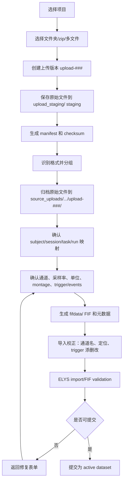
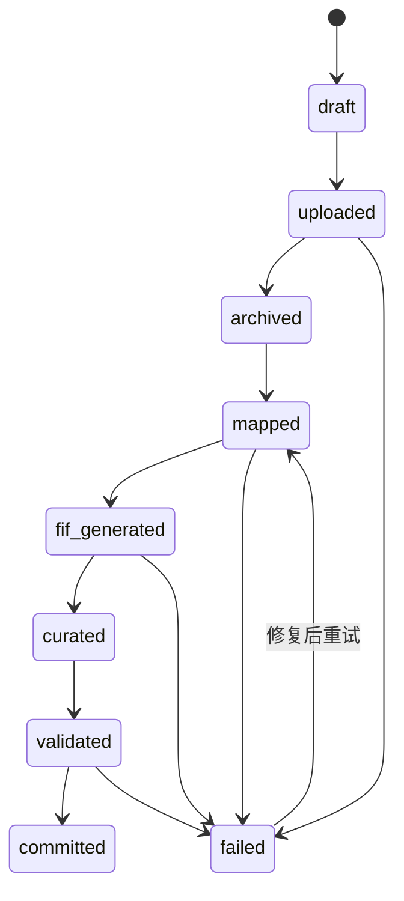
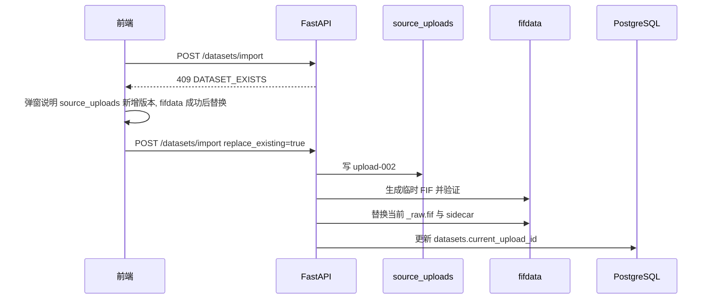

# BIDS 管理：EEG 原始数据上传与 FIF 导入流程

> 更新日期：2026-05-15  
> 关联主文档：[BIDS管理.md](BIDS管理.md)  
> 本流程只讨论 EEG 原始数据、行为数据、项目/范式描述的导入；不讨论 DICOM、NIfTI、用户上传 derivatives 或预处理结果。

## 1. 总体流程

数据上传不是直接入库，而是：

```text
原始上传归档 -> 元数据映射 -> 生成 FIF -> 导入校正 -> 提交为系统可处理数据
```



`source_uploads/` 只保留原始上传。`fifdata/` 是后续预览、处理、分析的统一起点。

## 2. 文件格式规则

### 2.1 标准原始上传

| 格式 | 上传方式 | 系统行为 |
|------|------|------|
| BrainVision | 同名 `.vhdr/.vmrk/.eeg` 三件套 | 原样归档到 `source_uploads/`，读取后生成 FIF |
| EDF / EDF+ | 单个 `.edf` | 原样归档，读取 annotations 或 trigger 通道，生成 FIF |
| BioSemi BDF / BDF+ | 单个 `.bdf` | 原样归档，重点处理 `Status` 通道，生成 FIF |

### 2.2 高级格式导入

| 格式 | 上传方式 | 系统行为 |
|------|------|------|
| Neuroscan CNT | 单个 `.cnt` | 进入高级导入，用户确认 Neuroscan/Curry reader |
| ANT / EEProbe CNT | 单个 `.cnt` | 进入高级导入，用户确认 ANT/EEProbe/eego reader |
| EGI / Net Station | `.mff` 目录包 | 文件夹上传并校验目录完整性 |
| GDF | 单个 `.gdf` | 读取后确认事件、单位、通道类型 |
| MATLAB | 单个 `.mat` | 只接受一个 `time x channel` 二维矩阵 |
| HDF5 | `.h5/.hdf5` | 只接受平台定义 schema |
| CSV/TSV/TXT | `.csv/.tsv/.txt` | 作为连续 EEG 时必须走矩阵模板；作为行为/events 时走表格导入 |

### 2.3 拒收

| 格式 | 提示 |
|------|------|
| `.set/.fdt` | 暂不接受 EEGLAB，请转换为 EDF/BDF/BrainVision 后上传 |
| 用户上传 `.fif` | FIF 只能由系统导入流程生成，不接受用户直接上传 |
| DICOM/NIfTI | 本阶段不接入 |
| derivatives/preprocessed files | 不允许通过数据上传入口进入项目 |

## 3. 用户视角导入向导

推荐 8 步：

| 步骤 | 页面内容 | 主要校验 |
|------|------|------|
| 1. 文件选择 | 文件夹、zip、多文件 | 空文件、大小、扩展名 |
| 2. 原始归档预览 | 上传版本、文件树、checksum | 重复文件、断点续传 |
| 3. 分组预览 | BrainVision 三件套、EDF/BDF、高级 source、行为文件 | 三件套完整性、MFF 完整性 |
| 4. BIDS 实体映射 | subject、session、task、run、acq | label 合法、重复 recording |
| 5. EEG 元数据 | 采样率、参考、线频、设备、任务说明 | 必填项 |
| 6. 通道与定位 | 通道名、类型、单位、montage、坏通道 | 通道数量一致 |
| 7. trigger/events/行为 | marker 预览、事件码映射、行为表分类 | onset/duration、事件范围 |
| 8. FIF 验证和提交 | 生成 FIF、重新读取、提交 active dataset | error=0 才能提交 |

## 4. 前端文件选择策略

BrainVision 必须使用：

1. 选择文件夹：前端扫描用户授权目录，自动找同名 `.vhdr/.vmrk/.eeg`。
2. 多选文件：用户同时选中三件套。

前端分类只做预判，后端必须重复检查。

```typescript
function classifySelectedFiles(files: File[]) {
  // 1. BrainVision: group by stem, require .vhdr/.vmrk/.eeg
  // 2. EDF/BDF: standard source
  // 3. CNT/MFF/GDF/MAT/HDF5/CSV-as-signal: advanced source
  // 4. CSV/TSV/TXT/XLSX-as-table: behavior/events/phenotype candidate
  // 5. SET/FDT/FIF/derivatives: rejected
}
```

## 5. 后端导入接口

当前 v1 同步接口：

```text
GET  /api/v1/projects/{project_id}/datasets
POST /api/v1/projects/{project_id}/datasets/import
```

`POST /datasets/import` 每次接收一组数据：一个 EDF/BDF，或一组同名 BrainVision 三件套。批量文件夹由前端拆成多组，顺序调用该接口。

同一数据位重传时，第一次返回 `DATASET_EXISTS`；用户确认后，前端带 `replace_existing=true` 再次提交。

### 5.1 后续异步 import job

推荐 API：

```text
POST /api/v1/projects/{project_id}/import-jobs
POST /api/v1/import-jobs/{job_id}/files
GET  /api/v1/import-jobs/{job_id}/manifest
PATCH /api/v1/import-jobs/{job_id}/mapping
POST /api/v1/import-jobs/{job_id}/archive-raw
POST /api/v1/import-jobs/{job_id}/generate-fif
PATCH /api/v1/import-jobs/{job_id}/curation
POST /api/v1/import-jobs/{job_id}/validate
POST /api/v1/import-jobs/{job_id}/commit
```

状态：



## 6. Manifest

```json
{
  "jobId": "import-20260515-0001",
  "rawArchiveRoot": "source_uploads/sub-001/ses-01/task-rest/run-01/upload-001",
  "groups": [
    {
      "groupId": "g001",
      "kind": "brainvision",
      "files": [
        "files/S01/rest/sub001.vhdr",
        "files/S01/rest/sub001.eeg",
        "files/S01/rest/sub001.vmrk"
      ],
      "suggested": {
        "subject": "sub-001",
        "session": "ses-01",
        "task": "task-rest",
        "run": "run-01"
      }
    },
    {
      "groupId": "g002",
      "kind": "behavior-candidate",
      "files": ["files/S01/rest/log.csv"]
    }
  ],
  "rejected": [
    {
      "path": "files/S01/rest/data.set",
      "reason": "暂不接受 EEGLAB .set，请转换为 EDF/BDF/BrainVision 后上传。"
    }
  ]
}
```

## 7. 映射和冲突

映射表：

```text
groupId kind          subject  session  task       run     action
g001    brainvision   sub-001  ses-01   task-rest  run-01  generate-fif
g002    behavior      sub-001  ses-01   task-rest  run-01  events
g003    cnt-source    sub-002  ses-01   task-rest  run-01  generate-fif
```

冲突检测：

| 检查 | 处理 |
|------|------|
| 同 checksum 已存在 | 提示重复上传，可跳过或复用 |
| 同一 `sub/ses/task/run` 已存在 | 返回 `DATASET_EXISTS`，由前端弹窗确认是否作为新上传版本替换当前 FIF |
| 同名原始文件 | 不冲突，因为 `upload-###` 隔离 |
| BrainVision 三件套缺件 | 不能生成 FIF |
| events 不含 onset/duration | 不能作为 events，只能作为 beh/phenotype |

### 7.1 v1 重传确认

当前 v1 不要求用户通过修改 `run` 来解决“同一数据位重新采集”的问题。后端先返回结构化 409，前端弹窗确认；用户确认后重新提交 `replace_existing=true`。



`source_uploads` 是历史，`fifdata` 是当前工作数据。新 FIF 转换失败时，旧 FIF 保留。

## 8. FIF 生成和导入校正

### 8.1 FIF 生成

```text
source_uploads/sub-001/ses-01/task-rest/run-01/upload-001/files/*
  -> MNE reader / matrix reader
  -> Raw object
  -> fifdata/sub-*/ses-*/eeg/*_raw.fif
```

标准输出：

```text
fifdata/sub-001/ses-01/eeg/
  sub-001_ses-01_task-rest_run-01_raw.fif
  sub-001_ses-01_task-rest_run-01_eeg.json
  sub-001_ses-01_task-rest_run-01_channels.tsv
  sub-001_ses-01_task-rest_run-01_events.tsv
  sub-001_ses-01_task-rest_run-01_import.json
```

### 8.2 导入校正

允许：

- 通道名修改。
- 通道类型和单位修正。
- montage/电极坐标配置。
- trigger 事件新增、删除、重命名、合并。
- 坏通道标记。

不允许：

- 滤波。
- ICA。
- 重参考。
- epoch、平均、特征提取。

这些属于 preprocessing 或 analysis，应写入 `derivatives/`。

## 9. 验证和提交

### 9.1 ELYS import validation

提交前检查：

- 原始归档是否完整。
- checksum 是否记录。
- reader 是否成功。
- FIF 是否能重新读取。
- 通道表是否和 FIF 一致。
- events 是否在数据时长范围内。
- trigger 映射是否已确认。
- `sub/ses/task/run` 是否唯一或已选择版本策略。

### 9.2 BIDS Validator

导入阶段不跑 BIDS Validator。只有用户导出官方 BIDS 时，才对导出目录运行：

```bash
bids-validator /mnt/elys_data/projects/{project_id}/bids_exports/export-<export_id> --json
```

## 10. Dashboard 过渡

短期 Dashboard 上传按钮应改名为：

```text
导入原始 EEG
```

文案：

```text
支持 BrainVision、EDF/BDF。CNT/MFF/GDF/MAT/HDF5/CSV 需进入高级导入流程。系统会保留原始文件，并生成 FIF 作为后续处理起点。
```

中期拆到独立页面：

```text
/projects/:id/import
```

## 11. 验收标准

1. 原始文件保存到 `source_uploads/sub-*/[ses-*]/task-*/run-*/upload-###/files/`，不改名、不覆盖。
2. BrainVision、EDF、BDF 能生成可读取 FIF。
3. CNT/MFF/GDF/MAT/HDF5/CSV 能进入高级导入 job。
4. `.set/.fdt/.fif` 被明确拒收。
5. `fifdata/` 有 FIF、channels、events、eeg metadata、import metadata。
6. 通道名、montage、trigger 修改有审计日志。
7. 增量上传能识别重复和 `sub/ses/task/run` 冲突。
8. 后续处理模块只从 `fifdata/` 读取。
9. 官方 BIDS 导出时能生成 `bids_exports/` 并运行 validator。


