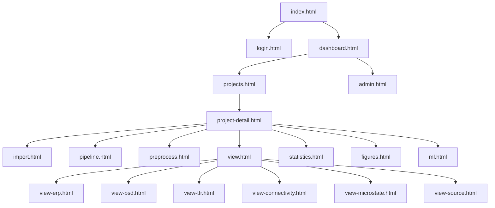

# 103 Demo 任务计划

> 本文记录前期 HTML 静态 Demo 阶段的目标、设计系统与页面清单，用于和正式 Vue 工程对齐视觉与信息架构。

## 项目目标

根据 `4xx 前端页面/` 的所有规格文档，制作一套**静态 HTML 页面 Demo**。

- **风格**:简洁美观、科技风、白色/浅色底
- **输出位置**:`2_meeting260508/demo/`
- **作用**:与 Vue 正式实现共享同一套设计系统，先用 HTML 跑通信息架构和视觉

## 设计系统

| 项 | 取值 |
|---|---|
| 主色调 | 白底 `#FFFFFF` / `#F7F9FC`，操作色 `#2E6BFF`，强调色 `#00C2A8` |
| 文字色 | 主文 `#1B2940`，次文 `#5B6B85`，弱文 `#8A95A8` |
| 边框 | `#E5E9F2`，圆角 8-12px |
| 字体 | "PingFang SC", "Microsoft YaHei", sans-serif |
| 等宽 | "JetBrains Mono", "Consolas", monospace |
| 间距尺度 | 4 / 8 / 12 / 16 / 24 / 32 / 48 |

> Demo 的设计 token 已被直接搬迁到 v1 正式工程的 [src/style.css](elys_version1/frontend/elys-web/src/style.css)，二者保持视觉一致。

### 布局模式

- **沉浸布局**:登录、工作流编辑器、观察浏览、作图编辑器(Phase 2 预留)
- **标准布局**:其余页面，左侧 240px 侧栏

## 页面清单

| # | 源文档 | HTML | 说明 |
|---|--------|------|------|
| 0 | — | index.html | 项目首页 |
| 1 | 403 登录页 | login.html | 密码登录 |
| 2 | 404 仪表盘 | dashboard.html | 工作台总览 |
| 3 | 405 项目列表 | projects.html | 卡片网格 |
| 4 | 406 项目详情 | project-detail.html | 7 Tab |
| 5 | 407 数据导入 | import.html | 三步向导 |
| 6 | 408 工作流编辑器 | pipeline.html | LiteGraph 画布 |
| 7 | 409 预处理交互 | preprocess.html | 波形/坏通道/ICA |
| 8 | 410 观察浏览 | view.html | 类型选择入口 |
| 9 | 411 ERP 观察 | view-erp.html | 时域波形 |
| 10 | 412 PSD 观察 | view-psd.html | 频域频谱 |
| 11 | 413 TFR 观察 | view-tfr.html | 时频热图 |
| 12 | 414 脑网络 | view-connectivity.html | 圆形/矩阵/3D |
| 13 | 415 微状态 | view-microstate.html | 模板/GFP |
| 14 | 416 溯源 | view-source.html | 3D脑 |
| 15 | 417 统计分析 | statistics.html | 三步式 |
| 16 | 418 作图 | figures.html | 三栏，Phase 2 预留 |
| 17 | 419 ML | ml.html | ML 工作流 |
| 18 | 420 管理 | admin.html | 用户/角色/审计 |

## 信息架构

## 验收状态

| 项 | 状态 |
|----|:---:|
| 所有页面可打开 | ✅ |
| 顶栏/侧栏导航互链全通 | ✅ |
| 视觉风格一致 | ✅ |
| 移动端基本响应式 | ✅ |

## Demo → v1 迁移记录

| 资产 | Demo 位置 | v1 位置 |
|------|----------|---------|
| 设计 token (CSS 变量) | `demo/assets/style.css` | `frontend/elys-web/src/style.css` |
| 登录 UI | `demo/login.html` | `frontend/elys-web/src/views/Login.vue` |
| 仪表盘 UI 草稿 | `demo/dashboard.html` | `frontend/elys-web/src/views/Dashboard.vue` |
| 其它页面 | `demo/*.html` | 尚未迁入 Vue，等后续 Phase |

---

- 上一篇: [102 需求总览](102-Requirements-Overview) · 下一篇: [104 Elys v1 需求](104-V1-Requirements)
