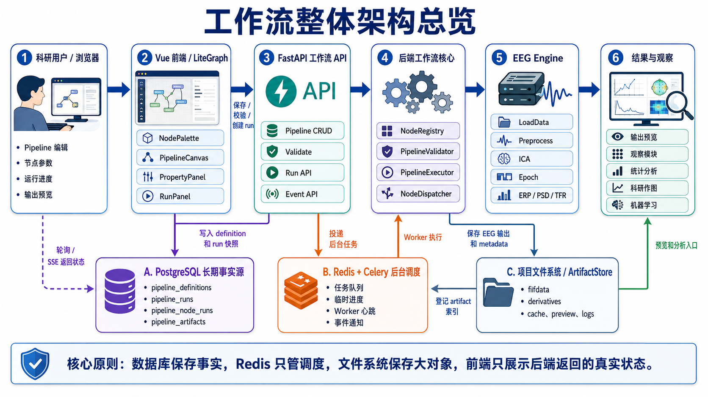

# 工作流功能需求分析

> 文档性质：工作流专题讨论稿，可随方案讨论随时修改。
> 正式维护口径以 `wiki/docs` 为准；`wiki1` 是旧版文档，只作历史参考，不再作为新版事实源。
> 本目录用于把工作流方案讨论清楚，形成可落地的开发步骤后，再同步到 `wiki/docs` 的对应正式页面。

> 本文定义 ELYS 工作流模块的细粒度功能需求。这里的“用户行文”按“用户行为/用户操作路径”理解。

## 1. 模块定位

工作流模块是连接数据管理、预处理、分析、观察、统计和后续作图的核心编排层。用户不需要写 Python 代码,通过拖拽节点和配置参数,即可对一个项目中的多个 subject/session/run 批量运行 EEG 处理流程。

工作流模块不负责原始上传本身。输入必须来自系统已导入并生成的 `fifdata/` 工作数据集。`fifdata/` 只允许导入校正,不允许滤波、重参考、ICA、去伪迹等预处理结果写入；这些预处理输出必须进入 `derivatives/`。原始上传归档仍由数据导入模块管理。

## 2. Phase 范围

### 2.1 Phase 1 MVP

Phase 1 必须支持:

| 类别 | 必需能力 |
|------|----------|
| 工作流管理 | 新建、保存、另存为、加载、删除、复制模板 |
| 节点编辑 | 拖拽添加节点、连线、删除、复制、参数编辑 |
| 数据选择 | 按 project、subject、session、task、run、dataset status 选择输入 |
| 预处理 | 重采样、滤波、陷波、重参考、通道重命名、通道定位、坏道插值 |
| ICA | 计算 ICA、人工确认剔除成分、应用 ICA |
| Epoch/ERP | 事件选择、epoch 分段、基线校正、ERP 平均、跨被试平均 |
| 基础分析 | PSD、TFR 基础计算可作为 Phase 1 后半段功能 |
| 运行 | 单节点运行、从此节点运行、运行全部、重新运行全部 |
| 增量执行 | 参数未变化时复用上游和缓存结果 |
| 输出 | 保存节点输出、保存最终结果、发送到观察模块、发送到统计模块 |
| 追溯 | 保存每次运行的参数、输入数据、输出文件、日志 |

### 2.2 Phase 2 增强

Phase 2 再支持:

| 类别 | 能力 |
|------|------|
| 高级分析 | 微状态、脑网络、溯源、源空间统计 |
| 科研出图 | `SendToFigure` 节点、figure spec 生成、作图编辑器联动 |
| 高级统计 | cluster permutation、混合效应模型、批量报告 |
| 模板复用 | 跨项目模板市场、团队模板、版本迁移 |
| 批量高级调度 | 大规模并行、任务优先级、运行资源预算 |

## 3. 用户角色与权限

| 角色 | 权限 | 工作流相关行为 |
|------|------|----------------|
| Admin | 全局管理 | 查看所有项目工作流、管理节点开关、查看系统运行日志 |
| PI / 项目负责人 | 项目完全权限 | 创建模板、审批删除、管理项目成员工作流 |
| Researcher / 研究员 | 项目读写 | 新建、编辑、运行、保存结果 |
| Reviewer / 访客 | 项目只读 | 查看工作流定义、查看运行记录、下载结果,不能运行和修改 |

权限点建议:

| 权限点 | 含义 |
|--------|------|
| `pipeline:read` | 查看工作流定义和运行历史 |
| `pipeline:write` | 新建、编辑、保存、删除工作流 |
| `pipeline:run` | 发起工作流运行 |
| `pipeline:cancel` | 取消自己发起的运行 |
| `pipeline:admin` | 取消他人运行、清理缓存、管理模板 |
| `analysis:read` | 查看节点输出和分析结果 |
| `analysis:write` | 保存派生数据和分析结果 |

## 4. 核心用户故事

### US-01 新建工作流

作为研究员,我希望从项目详情进入工作流编辑器,新建一个“P300 ERP 预处理”流程,选择项目中的全部被试数据,拖入滤波、ICA、Epoch、ERP 节点并保存,以便后续重复运行。

验收:

- 能从项目详情进入 `/projects/:id/pipeline`。
- 能创建空白工作流。
- 能从节点库拖入节点。
- 能保存名称、描述、节点位置、连线、参数。
- 保存后能在工作流列表中看到。

### US-02 加载项目数据

作为研究员,我希望 LoadData 节点能按 subject/session/run 筛选数据,并显示命中的数据数量、格式、采样率、通道数,以避免跑错数据。

验收:

- 可选择全部 subject 或指定 subject。
- 可选择 session、task、run。
- 可在动态筛选和固定数据集列表之间切换。
- 固定列表保存 dataset id,后续增量上传不会自动改变旧工作流的数据范围。
- 显示数据集数量和是否存在缺失。
- 不允许选择状态为 `deleted` 或 `failed` 的 dataset。
- 运行前给出输入数据摘要。

### US-03 配置节点参数

作为研究员,我希望点击节点后在右侧参数面板调整参数,并能看到参数说明、默认值、范围和单位。

验收:

- 参数面板由 NodeSpec 自动生成。
- 支持 number、text、select、multi-select、boolean、channel-list、event-select、time-window 等控件。
- 参数变更后节点状态变为 `dirty`,下游节点变为 `stale`。
- 参数错误时不能运行,并标记具体字段。

### US-04 运行全部

作为研究员,我希望点击“运行全部”后,系统按拓扑顺序执行节点,显示每个节点的状态、耗时、日志和输出,以便判断流程是否正确。

验收:

- 运行前校验 DAG 无环、端口类型兼容、必填参数完整。
- 运行时每个节点有状态: waiting、running、success、failed、cached、skipped。
- 可查看总进度和节点进度。
- 运行完成后能打开最终结果。

### US-05 增量运行

作为研究员,我希望修改某个节点参数后只重新计算受影响的下游节点,上游节点和不相关分支直接复用缓存,以节省时间。

验收:

- 节点参数 hash 变化时,该节点和下游变为 stale。
- 未受影响分支保持 success/cached。
- 运行日志明确显示哪些节点是 computed、cached、skipped。
- 重新运行全部时可强制忽略缓存。

### US-06 单节点运行与从此运行

作为研究员,我希望能右键某个节点选择“运行此节点”或“从此节点运行”,便于调试局部流程。

验收:

- “运行此节点”要求上游输出已存在或可从缓存恢复。
- “从此节点运行”会运行当前节点及其下游。
- 若上游缺失,提示用户先运行上游或运行全部。

### US-07 人工交互节点

作为研究员,我希望 ICA、手动坏段、坏道确认这类节点能暂停流程并等待人工确认,确认后继续执行下游。

验收:

- 节点可进入 `waiting_user` 状态。
- 双击节点打开专用交互页面或弹层。
- 用户确认后保存人工选择和审计记录。
- 下游节点以确认后的数据继续运行。

### US-08 查看节点输出

作为研究员,我希望双击节点能查看输出预览,例如滤波后波形、PSD、ERP、ICA 成分,以便判断处理质量。

验收:

- `eeg_data` 输出可打开波形观察。
- `evoked` 输出可打开 ERP 观察。
- `psd` 输出可打开 PSD 观察。
- `tfr` 输出可打开 TFR 观察。
- ICA 输出可打开 ICA 成分查看。

### US-09 保存结果和追溯

作为 PI,我希望每次工作流运行都能记录输入数据版本、节点参数、代码版本、输出文件和运行日志,以便论文复现和审计。

验收:

- 每次运行生成 `pipeline_runs`。
- 每个节点生成 `pipeline_node_runs`。
- 每个输出文件生成 `pipeline_artifacts` 或写入现有 `dataset_derivatives` / `analysis_results`。
- 可从结果追溯到工作流定义版本、节点参数和输入 dataset。

## 5. 功能需求清单

### 5.1 工作流定义管理

| ID | 需求 | 落地阶段 | 验收 |
|----|------|-------|------|
| WF-DEF-001 | 新建空白工作流 | Phase 1 | 输入名称后生成空 DAG |
| WF-DEF-002 | 保存工作流 | Phase 1 | 写入 `pipeline_definitions.definition_json` |
| WF-DEF-003 | 另存为 | Phase 1 | 复制定义,生成新 id |
| WF-DEF-004 | 删除工作流 | Phase 1 | 软删除或二次确认硬删除 |
| WF-DEF-005 | 工作流版本号 | Phase 1 | 每次保存递增 `version` |
| WF-DEF-006 | 工作流模板 | Phase 1 | 可从内置模板创建 |
| WF-DEF-007 | 跨项目模板 | Phase 2 | 团队模板可复用 |
| WF-DEF-008 | 导入/导出 JSON | Phase 2 | 导出的 JSON 可再次导入 |

### 5.2 编辑器操作

| ID | 需求 | 落地阶段 | 验收 |
|----|------|-------|------|
| WF-EDIT-001 | 节点库分组 | Phase 1 | 输入、预处理、ICA、Epoch、分析、输出 |
| WF-EDIT-002 | 节点搜索 | Phase 1 | 按标题、type、标签搜索 |
| WF-EDIT-003 | 拖拽添加节点 | Phase 1 | 从左侧节点库拖到画布 |
| WF-EDIT-004 | 连线 | Phase 1 | 类型兼容才能连接 |
| WF-EDIT-005 | 删除节点 | Phase 1 | 自动删除相关连线 |
| WF-EDIT-006 | 复制节点 | Phase 1 | 复制参数但生成新 node id |
| WF-EDIT-007 | 撤销/重做 | Phase 1 | 至少支持编辑操作 undo/redo |
| WF-EDIT-008 | 自动布局 | Phase 2 | DAG 自动整理布局 |
| WF-EDIT-009 | 节点分组 | Phase 2 | 支持 group/subgraph |

### 5.3 参数面板

| ID | 需求 | 落地阶段 | 验收 |
|----|------|-------|------|
| WF-PARAM-001 | NodeSpec 自动生成表单 | Phase 1 | properties 定义映射到控件 |
| WF-PARAM-002 | 参数校验 | Phase 1 | 必填、范围、类型错误提示 |
| WF-PARAM-003 | 参数说明 | Phase 1 | 显示 tooltip/help |
| WF-PARAM-004 | 通道选择器 | Phase 1 | 支持按名称、多选、全选、反选 |
| WF-PARAM-005 | 事件选择器 | Phase 1 | 读取上游事件列表 |
| WF-PARAM-006 | 条件表达式 | Phase 2 | 支持高级筛选表达式 |

### 5.4 运行管理

| ID | 需求 | 落地阶段 | 验收 |
|----|------|-------|------|
| WF-RUN-001 | 运行全部 | Phase 1 | 创建异步任务并返回 run id |
| WF-RUN-002 | 重新运行全部 | Phase 1 | 可选择忽略缓存 |
| WF-RUN-003 | 单节点运行 | Phase 1 | 上游可用时运行单个节点 |
| WF-RUN-004 | 从此节点运行 | Phase 1 | 当前节点及下游运行 |
| WF-RUN-005 | 暂停/继续 | Phase 2 | 长流程可暂停恢复 |
| WF-RUN-006 | 取消运行 | Phase 1 | 取消未完成任务,写入 canceled 状态 |
| WF-RUN-007 | 运行队列 | Phase 1 | 同项目限制并发,显示排队 |

### 5.5 输出与预览

| ID | 需求 | 落地阶段 | 验收 |
|----|------|-------|------|
| WF-OUT-001 | 保存节点输出 | Phase 1 | 可为关键节点保存 FIF/HDF5/JSON |
| WF-OUT-002 | 保存最终结果 | Phase 1 | 写入 analysis_results |
| WF-OUT-003 | 节点输出预览 | Phase 1 | 双击节点打开合适观察视图 |
| WF-OUT-004 | 发送到统计 | Phase 1/2 | 基础统计 Phase 1,高级统计 Phase 2 |
| WF-OUT-005 | 发送到作图 | Phase 2 | 生成 figure_spec |

### 5.6 审计与复现

| ID | 需求 | 落地阶段 | 验收 |
|----|------|-------|------|
| WF-AUDIT-001 | 运行参数快照 | Phase 1 | 每次 run 保存完整 definition snapshot |
| WF-AUDIT-002 | 节点日志 | Phase 1 | 每个节点保存日志、耗时、错误 |
| WF-AUDIT-003 | 数据版本追溯 | Phase 1 | run 绑定 dataset upload/version |
| WF-AUDIT-004 | 代码版本记录 | Phase 1 | 保存 app version、engine version |
| WF-AUDIT-005 | 复现运行 | Phase 2 | 从某次 run snapshot 创建新运行 |

## 6. 非功能需求

| 类型 | 需求 |
|------|------|
| 性能 | 100 个 dataset 的工作流运行应可排队和批量执行 |
| 可用性 | 单个节点失败不应破坏已完成节点输出 |
| 可追溯 | 每个输出都能追溯到输入 dataset、节点参数、工作流版本 |
| 扩展性 | 新增节点不应修改编辑器核心代码 |
| 安全 | 只有有项目权限的用户可查看和运行工作流 |
| 稳定性 | 浏览器刷新后可恢复画布、运行状态和历史结果 |
| 可维护性 | 节点函数必须单元测试,NodeSpec 必须 schema 校验 |

## 7. 2026-05-17 补充：用户行为和功能边界

> 本节补齐用户前台操作逻辑和后端执行边界。当前代码位置默认省略 `elys_version1/` 前缀。

### 8.1 用户行为主流程

| 步骤 | 用户动作 | 前端响应 | 后端职责 | 当前状态 |
| --- | --- | --- | --- | --- |
| 1 | 从项目详情或导航进入工作流页 | 读取 `projectId`，加载项目、工作流、数据集和节点库 | 返回项目下 pipeline 列表、dataset 列表、NodeSpec | 已实现 |
| 2 | 新建或选择工作流 | 画布清空或加载已有 definition | 读取或保存 `pipeline_definitions.definition_json` | 已实现 |
| 3 | 拖入 LoadData 节点 | 在右侧面板展示数据筛选器 | 根据 dataset 过滤条件解析可运行数据 | 已实现 |
| 4 | 拖入预处理/分析节点并连线 | LiteGraph 更新图结构，右侧面板展示 NodeSpec 参数 | 后端校验节点类型、端口类型、必填参数和环路 | 已实现基础 |
| 5 | 点击保存 | 前端提交完整 definition | 创建或更新 pipeline，版本号加 1 | 已实现 |
| 6 | 点击校验 | 前端先保存，再请求校验 | 返回 errors/warnings，LoadData 会解析真实数据 | 已实现基础 |
| 7 | 点击运行 | 前端先保存，再提交运行 | 创建 PipelineRun 和 node_run，投递 Celery 后台任务执行节点 | 已接入 Celery + Redis 投递入口，第一条分析链路可跑；本机未验证真实 worker 消费 |
| 8 | 查看运行结果 | 前端展示最新 run 和节点状态、错误、data_infos、artifact 数量 | 返回 node_results、data_infos_by_node、error_json，并可查询 node_run/artifact | 已实现基础 |
| 9 | 查看节点输出或送往观察页 | 从选中节点 artifact 打开轻量 preview，并保留观察页 query | 后端返回 artifact preview 或 analysis result；当前支持 raw/epochs/evoked preview | 已实现第一版，观察页真实渲染待接 |
| 10 | 人工节点继续执行 | 在 ICA waiting 节点中提交 excluded components 并 resume | 后端暂停 run，等待用户提交后 resume | 已实现 ICA 第一版，独立 interaction 表待接 |

### 8.2 用户能理解的按钮语义

| 按钮 | 用户语义 | 后端语义 | 当前代码状态 |
| --- | --- | --- | --- |
| 保存 | 保存图和参数，不运行 | upsert `pipeline_definitions` | 已实现 |
| 校验 | 检查能不能运行 | 结构校验 + LoadData 数据解析 | 已实现基础 |
| 运行 | 按当前配置运行，允许未来增量复用 | 创建 run/node_run，投递 Celery task；当前已使用第一版 node_hash/artifact 缓存 | 已接入 Celery `run_pipeline_task`，真实执行 LoadData、FIR、Resample、Re-reference、ICA、Epoch、ERP、Save Result |
| 重新运行 | 忽略缓存，从头跑 | `force=true`，所有节点重新执行 | 未实现 |
| 从此节点运行 | 当前节点及下游重新判定 | `start_node_id` 或 `selected_node_id` | 未实现 |
| 继续 | 人工交互节点提交结果后继续 | resume waiting node | 已实现 ICA Apply 第一版 |

### 8.3 Phase 1 必须收敛的用户故事

- 用户能从一个项目选择已经导入并转换为 fifdata 的数据。
- 用户能画出 `LoadData -> Filter -> Resample/Re-reference -> Epoch -> ERP` 的最小链路。
- 用户能保存工作流，再次进入页面后恢复同一张图。
- 用户能运行工作流，并看到每个节点是等待、运行中、成功、失败还是缓存命中。
- 用户能打开某个节点输出的基础预览。
- 用户能看到失败原因，并定位到具体节点和参数。
