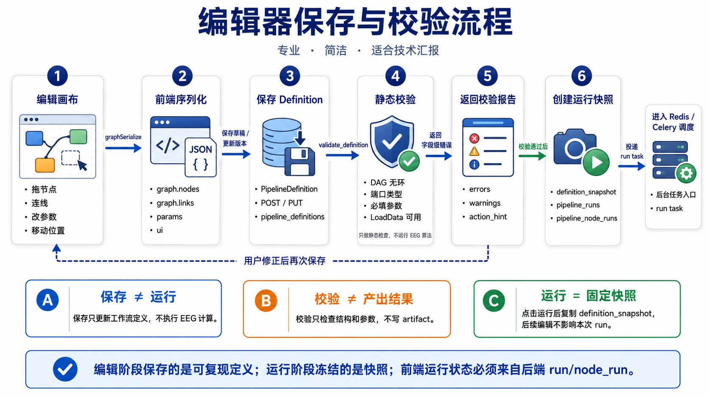
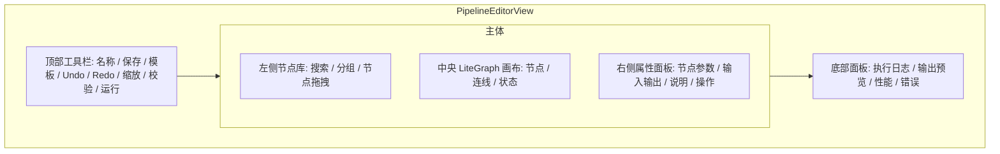
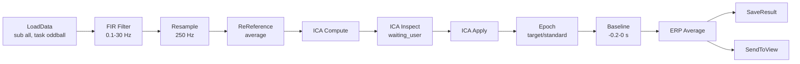
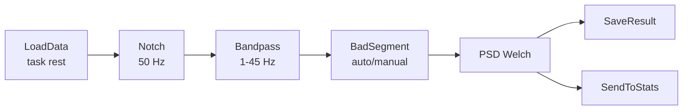
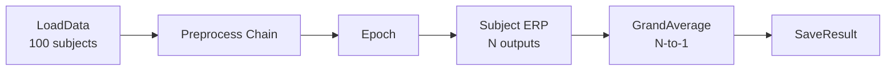
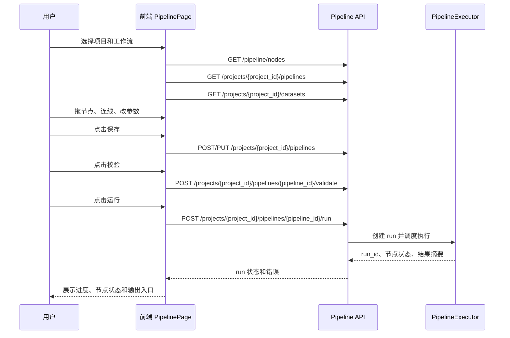

# 工作流编辑器交互与用户行为定义

> 文档性质：工作流专题讨论稿，可随方案讨论随时修改。
> 正式维护口径以 `wiki/docs` 为准；`wiki1` 是旧版文档，只作历史参考，不再作为新版事实源。
> 本目录用于把工作流方案讨论清楚，形成可落地的开发步骤后，再同步到 `wiki/docs` 的对应正式页面。



## 1. 页面目标

工作流编辑器要让科研用户以“搭积木”的方式完成 EEG 处理流程。页面不应表现为单纯代码配置器,而应让用户清楚看到:

- 输入了哪些 subject/session/run。
- 每一步做了什么处理。
- 每一步参数是什么。
- 哪些结果来自缓存,哪些是本次重新计算。
- 哪些节点需要人工确认。
- 最终结果保存在哪里,可以发送到哪里查看。

## 2. 页面布局

推荐采用三栏加底部日志的沉浸布局。



| 区域 | 宽度建议 | 内容 |
|------|----------|------|
| 左侧节点库 | 220-260px | 节点分类、搜索、收藏、模板 |
| 中央画布 | 自适应 | LiteGraph 画布、缩放、平移、框选 |
| 右侧属性 | 300-360px | 当前节点参数、输入输出摘要、运行按钮 |
| 底部日志 | 140-220px | 运行日志、错误、节点输出摘要 |

## 3. 顶部工具栏

| 控件 | 行为 |
|------|------|
| 工作流名称 | 可点击编辑,未保存时显示 `dirty` 状态 |
| 保存 | 保存当前 PipelineDefinition |
| 另存为 | 复制为新工作流 |
| 加载模板 | 从内置模板或项目模板创建 |
| Undo / Redo | 撤销/重做编辑操作 |
| 自动布局 | Phase 2,按 DAG 层级整理节点 |
| 缩放 | 50%、75%、100%、125%、适应窗口 |
| 校验 | 只做静态校验,不运行 |
| 单步运行 | 从当前选中节点开始一步一步运行 |
| 运行全部 | 创建 PipelineRun |
| 重新运行 | 忽略缓存或按用户选择清理缓存后运行 |
| 取消 | 运行中显示,取消当前 PipelineRun |

## 4. 左侧节点库

### 4.1 分组

Phase 1 节点库分组:

| 分组 | 节点 |
|------|------|
| 数据 | LoadData、SelectDataset、FilterByEvent |
| 预处理 | Resample、FIR Filter、Butter Filter、Notch、ReReference、RenameChannels、ChannelLocation |
| 伪迹 | MarkBadChannels、InterpolateBads、RemoveBadSegments、ManualArtifact |
| ICA | ComputeICA、InspectICA、ApplyICA |
| Epoch | FindEvents、Epoch、BaselineCorrection、RejectEpoch |
| 分析 | ERP、GrandAverage、PSD、TFR |
| 输出 | SaveResult、SendToView、SendToStats |

Phase 2 增强:

| 分组 | 节点 |
|------|------|
| 空间 | Connectivity、Microstate、Source |
| 统计 | GroupCompare、ClusterPermutation |
| 出图 | SendToFigure、FigureSpec |
| ML | FeatureExtract、TrainModel、Evaluate |

### 4.2 节点搜索

搜索支持:

- 节点标题,例如 `filter`。
- 中文别名,例如 `滤波`。
- 节点类型,例如 `eeg/filter/fir`。
- 标签,例如 `preprocess`, `erp`, `ica`。

### 4.3 节点卡片显示

每个节点卡片显示:

- 名称。
- 简短说明。
- 输入/输出类型摘要。
- 阶段标签: Phase 1 / Phase 2。
- 是否交互节点。
- 是否支持批处理。

## 5. 中央画布行为

### 5.1 基础操作

| 用户行为 | 系统响应 |
|----------|----------|
| 拖入节点 | 创建节点实例,生成本地 `node_id` |
| 拖动节点 | 更新节点 `position` |
| 点击节点 | 选中节点,右侧显示属性 |
| 双击节点 | 打开预览或专用交互界面 |
| 删除节点 | 删除节点和相关连线,下游状态重新计算 |
| 复制节点 | 复制参数和 UI,生成新 id |
| 拖动端口连线 | 校验端口类型,兼容则建立 link |
| 框选多个节点 | 批量移动或删除 |
| 右键节点 | 打开上下文菜单 |
| 右键画布 | 添加节点、粘贴、自动布局 |

### 5.2 连线规则

端口类型必须兼容。

| 输出类型 | 可连接输入 |
|----------|------------|
| `dataset_collection` | `dataset_collection`, `eeg_data` load input |
| `eeg_data` | `eeg_data`, `raw`, `epochs` 兼容输入 |
| `events` | `events` |
| `epochs` | `epochs`, `eeg_data` |
| `evoked` | `evoked`, `analysis_result` |
| `psd` | `psd`, `analysis_result` |
| `tfr` | `tfr`, `analysis_result` |
| `ica_matrix` | `ica_matrix` |
| `figure_spec` | Phase 2 作图输入 |

不允许:

- 形成环。
- 将 `ica_matrix` 接到普通 `eeg_data` 输入。
- 将 Phase 2 未启用节点接入 Phase 1 必需流程。
- 无输入节点重复作为非数据源节点。

### 5.3 节点状态

| 状态 | 含义 | 视觉建议 |
|------|------|----------|
| `idle` | 未运行 | 灰色 |
| `valid` | 参数完整但未运行 | 蓝灰 |
| `dirty` | 参数被修改,当前输出失效 | 橙色边框 |
| `stale` | 上游变化导致输出过期 | 橙色虚线 |
| `waiting` | 等待上游或排队 | 浅灰 |
| `running` | 执行中 | 蓝色脉冲 |
| `waiting_user` | 等待人工确认 | 紫色虚线 |
| `success` | 本次计算成功 | 绿色 |
| `cached` | 从缓存恢复 | 青绿色 |
| `skipped` | 因条件不满足或无需运行而跳过 | 灰蓝 |
| `failed` | 执行失败 | 红色 |
| `canceled` | 用户取消 | 灰红 |

旧版 Niantong 已实现 `processing/restored/success/failed` 等视觉状态,新项目应将其扩展为正式状态机。

## 6. 右侧属性面板

属性面板由 NodeSpec 生成,但要保留常用固定区域。

### 6.1 固定区域

| 区域 | 内容 |
|------|------|
| 基本信息 | 节点名称、类型、描述、备注 |
| 输入摘要 | 上游节点、输入数据数量、数据类型 |
| 参数表单 | 根据 NodeSpec 生成 |
| 输出设置 | 是否保存节点输出、输出 descriptor、结果名称 |
| 操作 | 运行此节点、从此节点运行、查看输出、清除缓存 |
| 帮助 | 参数解释、推荐值、注意事项 |

### 6.2 参数控件

| 参数类型 | 控件 | 示例 |
|----------|------|------|
| `number` | 数值输入 | `l_freq=0.5` |
| `integer` | 整数输入 | `n_components=20` |
| `boolean` | 开关 | `save_output=true` |
| `select` | 下拉 | `method=fastica` |
| `multi_select` | 多选 | 选择事件 |
| `channel_list` | 通道选择器 | Fz/Cz/Pz |
| `event_select` | 从上游事件提取 | target/standard |
| `time_window` | 起止时间 | `[-0.2, 1.0]` |
| `json` | 高级 JSON 编辑 | 自定义参数 |
| `file_ref` | 文件引用 | montage 文件 |

### 6.3 动态参数

部分参数依赖上游数据:

| 节点 | 动态参数 |
|------|----------|
| Epoch | event_id 来自上游 events 或 Raw annotations |
| ERP | condition/event 来自 Epoch |
| RenameChannels | 当前通道列表来自上游 `data_infos` 或预览 API |
| ChannelLocation | montage 兼容性来自通道名 |
| ICA Apply | ICA 成分列表来自 ComputeICA 输出 |

动态参数不应直接写入可复现参数,除非用户确认。内部 UI 状态用 `_ui` 字段保存,不参与 hash。

## 7. 底部面板

### 7.1 执行日志

日志按 run 和 node 分级:

```text
10:23:14 [pipeline] run started: P300 标准流程
10:23:15 [load_data] selected 100 datasets
10:23:16 [filter_fir] cached: 100/100
10:23:17 [ica_compute] waiting_user: inspect components
10:25:02 [ica_apply] success: 100 outputs
```

用户可过滤:

- 全部。
- 当前节点。
- warning/error。
- 缓存命中。

### 7.2 输出预览

选中节点后显示:

- 输出数据数量。
- 输出类型。
- subject/session/run 分布。
- 文件路径。
- 快捷入口: 打开波形、打开 ERP、打开 PSD、打开 TFR。

### 7.3 错误面板

错误必须包含:

- 节点名称和 type。
- 参数快照。
- 输入数据。
- 简短原因。
- 可操作建议。
- 后端 traceback 仅管理员或调试模式可见。

## 8. 右键菜单

### 8.1 节点右键

| 菜单 | 行为 |
|------|------|
| 运行此节点 | 只运行当前节点 |
| 从此节点运行 | 当前节点和下游 |
| 查看输出 | 打开输出预览 |
| 打开观察 | 按输出类型跳转观察页面 |
| 复制节点 | 复制参数 |
| 禁用节点 | 运行时跳过,下游视情况报错 |
| 清除节点缓存 | 删除该节点 hash 对应缓存 |
| 删除节点 | 删除节点和连线 |

### 8.2 画布右键

| 菜单 | 行为 |
|------|------|
| 添加节点 | 打开节点搜索 |
| 粘贴 | 粘贴复制节点 |
| 自动布局 | Phase 2 |
| 适应窗口 | 调整缩放 |
| 清空画布 | 二次确认后清空 |

## 9. 运行前校验

点击运行前必须完成静态校验。

| 校验项 | 错误示例 |
|--------|----------|
| DAG 无环 | A -> B -> A |
| 必须存在 LoadData | 没有数据源 |
| 必填参数完整 | Filter 缺少 `h_freq` |
| 参数范围合法 | `l_freq >= h_freq` |
| 端口类型兼容 | `ica_matrix` 接到 `eeg_data` |
| Phase 功能启用 | Phase 1 使用 SendToFigure |
| 人工节点策略 | ICA 节点未配置人工确认或自动策略 |
| 输出路径可写 | 项目目录无写权限 |

## 10. 运行中行为

运行中允许:

- 查看日志。
- 查看已完成节点输出。
- 取消运行。
- 打开人工交互节点。

运行中不允许:

- 修改正在运行节点参数。
- 删除正在运行节点。
- 修改已经提交的 run snapshot。

可以允许“另存为副本继续编辑”,但不影响当前 run。

## 11. 浏览器刷新与恢复

刷新页面后:

- 重新拉取 PipelineDefinition。
- 如果有 active PipelineRun,重新订阅 WebSocket/SSE。
- 从后端恢复节点状态。
- 本地 UI 状态只用于恢复缩放、滚动、选中节点等轻量信息。

核心运行状态不能依赖 localStorage。

## 12. 典型用户路径

### 12.1 P300 ERP



### 12.2 静息态 PSD



### 12.3 批量跨被试 ERP



## 13. 旧项目交互经验转化

| 旧项目经验 | 新项目采用方式 |
|------------|----------------|
| 节点选中打开 Node Setting tab | 改为固定右侧属性面板 |
| 双击节点打开 TimeCourse/Frequency/ICA | 保留,但路由到观察模块或弹层 |
| 运行/重新运行两个按钮 | 保留,含缓存策略说明 |
| 右键添加 input/output | 仅对 Merge 等特殊节点开放 |
| data_infos 是绘图前提 | 作为所有节点输出强制契约 |
| localStorage 恢复节点缓存 | 只保留 UI 恢复,核心恢复走后端 |

## 14. 2026-05-17 补充：前端如何配合用户行为

> 本节补齐前端页面如何配合用户行为。当前代码位置默认省略 `elys_version1/` 前缀。

### 14.1 当前页面已经具备的交互

| 区域 | 当前代码 | 已具备能力 | 需要补强 |
| --- | --- | --- | --- |
| 顶部工具栏 | `PipelinePage.vue` | 项目选择、工作流选择、名称编辑、保存、校验、运行 | 增加重新运行、从此节点运行、运行模式说明、运行中禁用规则 |
| 左侧节点库 | `loadNodeSpecs` + `registerLiteGraphNodeSpecs` | 从后端 NodeSpec 加载节点、按 category 分组、搜索、拖拽 | 增加节点成熟度、是否已接执行器、是否交互节点标识 |
| 中央画布 | LiteGraph | 拖拽节点、连线、右键、移动、同步 definition | 增加节点运行状态颜色、节点级进度、缓存命中标记 |
| 右侧属性面板 | NodeSpec properties | 通用参数控件；LoadData 有专用筛选和预览 | 补强端口输入来源、参数变更影响提示、交互节点表单 |
| 底部/结果区 | latestPipelineRun | 展示 run 状态和错误 | 增加节点运行时间线、日志、artifact 预览、下载入口 |

### 14.2 前端不应该承担的职责

- 不在前端决定真实节点是否缓存命中，只展示后端返回的判定。
- 不在前端逐节点拼接多个算法接口。前端只提交 pipeline run。
- 不把 localStorage 当作科研结果来源。localStorage 只能保存临时 UI 状态。
- 不在前端伪造 data_infos。LoadData 可以预览解析结果，但正式运行结果以 run snapshot 为准。

### 14.3 建议补充的前端状态

| 状态 | 展示方式 | 触发来源 |
| --- | --- | --- |
| draft | 工作流未保存提示 | `dirty=true` |
| validating | 校验按钮 loading | `POST /validate` |
| queued | 节点或 run 灰蓝状态 | 后端 run 状态 |
| running | 节点黄/蓝动态状态 | `pipeline_node_runs.status` |
| completed | 节点绿色 | 后端节点完成 |
| cached | 节点青绿色 | 后端缓存恢复 |
| waiting_interaction | 节点紫色或交互标识 | 后端等待人工提交 |
| failed | 节点红色 | 后端 error_json |

### 14.4 前端与后端交互顺序


