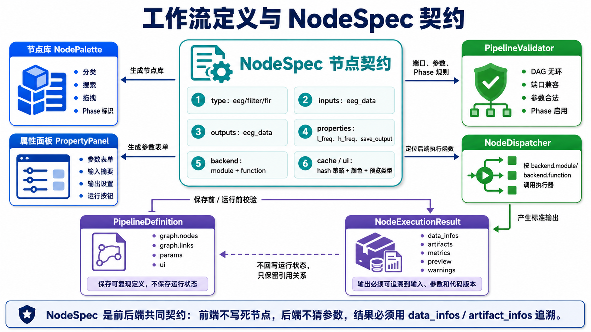

# 工作流节点规范与数据结构

> 文档性质：工作流专题讨论稿，可随方案讨论随时修改。
> 正式维护口径以 `wiki/docs` 为准；`wiki1` 是旧版文档，只作历史参考，不再作为新版事实源。
> 本目录用于把工作流方案讨论清楚，形成可落地的开发步骤后，再同步到 `wiki/docs` 的对应正式页面。



## 1. 设计原则

1. 节点定义必须外置,新增节点不改编辑器核心代码。
2. 节点参数必须可校验、可序列化、可复现。
3. 节点输入输出必须有明确类型。
4. 所有节点输出必须携带 `data_infos` 或等价的 `artifact_infos`。
5. UI 临时状态与可复现参数分离。
6. 工作流定义、运行记录、节点输出文件三者必须能互相追溯。

## 2. NodeSpec

NodeSpec 是节点定义 JSON。旧版 Niantong 已通过 `frontend/js/nodes/*.json` 证明该方式可行,新项目将其升级为前后端共享规范。

### 2.1 NodeSpec 示例

```json
{
  "schema_version": "1.0",
  "type": "eeg/filter/fir",
  "title": "FIR Filter",
  "category": "preprocessing",
  "phase": "phase1",
  "description": "FIR bandpass/lowpass/highpass/notch filtering based on MNE.",
  "tags": ["filter", "preprocess", "mne"],
  "inputs": [
    {
      "name": "input",
      "type": "eeg_data",
      "label": "EEG Data",
      "required": true,
      "cardinality": "one_or_many"
    }
  ],
  "outputs": [
    {
      "name": "output",
      "type": "eeg_data",
      "label": "Filtered EEG",
      "cardinality": "same_as_input"
    }
  ],
  "properties": [
    {
      "name": "filter_mode",
      "label": "Filter Mode",
      "type": "select",
      "default": "bandpass",
      "options": [
        {"value": "bandpass", "label": "Bandpass"},
        {"value": "lowpass", "label": "Lowpass"},
        {"value": "highpass", "label": "Highpass"},
        {"value": "notch", "label": "Notch"}
      ],
      "required": true,
      "hash": true
    },
    {
      "name": "l_freq",
      "label": "Low Cutoff",
      "type": "number",
      "unit": "Hz",
      "default": 0.5,
      "min": 0,
      "hash": true
    },
    {
      "name": "h_freq",
      "label": "High Cutoff",
      "type": "number",
      "unit": "Hz",
      "default": 30.0,
      "min": 0,
      "hash": true
    },
    {
      "name": "save_output",
      "label": "Save Node Output",
      "type": "boolean",
      "default": true,
      "hash": false
    }
  ],
  "backend": {
    "engine": "mne",
    "module": "app.engine.preprocess.filters",
    "function": "run_fir_filter",
    "save_descriptor": "filt",
    "output_kind": "fif",
    "supports_batch": true,
    "interactive": false
  },
  "cache": {
    "enabled": true,
    "strategy": "content_hash",
    "include_params": "hash_true_only"
  },
  "ui": {
    "color": "#0891b2",
    "default_size": [180, 90],
    "double_click": "open_observation",
    "preview_type": "time_series"
  }
}
```

### 2.2 字段定义

| 字段 | 必填 | 说明 |
|------|:----:|------|
| `schema_version` | 是 | NodeSpec schema 版本 |
| `type` | 是 | 全局唯一节点类型,建议 `eeg/domain/name` |
| `title` | 是 | 前端显示标题 |
| `category` | 是 | 节点库分组 |
| `phase` | 是 | `phase1`, `phase2`, `phase3` |
| `description` | 否 | 帮助说明 |
| `tags` | 否 | 搜索标签 |
| `inputs` | 否 | 输入端口 |
| `outputs` | 是 | 输出端口 |
| `properties` | 否 | 参数定义 |
| `backend` | 是 | 后端执行配置 |
| `cache` | 否 | 缓存策略 |
| `ui` | 否 | 前端显示配置 |

## 3. 端口类型

| 类型 | 说明 | Python 对象/文件 |
|------|------|------------------|
| `dataset_collection` | 数据集选择结果 | dataset id list |
| `eeg_data` | EEG 工作数据,Raw 或 Epochs 均可 | FIF + metadata |
| `raw` | 连续 Raw | `mne.io.Raw` |
| `epochs` | 分段后 Epochs | `mne.Epochs` |
| `events` | 事件数组和事件字典 | numpy array + dict |
| `ica_matrix` | ICA 模型 | `mne.preprocessing.ICA` + pickle/fif |
| `evoked` | ERP 平均结果 | `mne.Evoked` |
| `psd` | 功率谱结果 | HDF5/NPZ |
| `tfr` | 时频结果 | HDF5 |
| `stats_table` | 统计表 | parquet/csv/json |
| `analysis_result` | 通用分析结果 | analysis_results row |
| `figure_spec` | 作图配置 | JSON, Phase 2 |

## 4. PipelineDefinition JSON

工作流定义保存的是“可编辑图结构 + 可复现参数”,不保存运行时大对象。

```json
{
  "schema_version": "1.0",
  "app_version": "elys-1.x",
  "engine_version": "mne-1.x",
  "name": "P300 ERP preprocessing",
  "description": "Standard ERP pipeline for oddball task.",
  "graph": {
    "nodes": [
      {
        "id": "n_load_001",
        "type": "eeg/data/load",
        "title": "LoadData",
        "position": [80, 120],
        "params": {
          "selection_mode": "filter",
          "dataset_filter": {
            "subjects": "all",
            "sessions": ["ses-01"],
            "tasks": ["oddball"],
            "runs": "all",
            "qa_status": ["converted", "checked"],
            "require_fif": true
          },
          "dataset_ids": []
        },
        "ui": {
          "collapsed": false,
          "note": ""
        }
      },
      {
        "id": "n_filter_001",
        "type": "eeg/filter/fir",
        "title": "FIR Filter",
        "position": [360, 120],
        "params": {
          "filter_mode": "bandpass",
          "l_freq": 0.5,
          "h_freq": 30.0,
          "phase": "zero",
          "save_output": true
        }
      }
    ],
    "links": [
      {
        "id": "l_001",
        "from": {"node": "n_load_001", "port": "output"},
        "to": {"node": "n_filter_001", "port": "input"}
      }
    ]
  },
  "settings": {
    "cache_policy": "reuse_valid",
    "on_error": "stop",
    "max_parallel_datasets": 2
  }
}
```

### 4.1 参数分层

| 层 | 是否参与 hash | 示例 |
|----|:-------------:|------|
| `params` | 是,除非 NodeSpec 指定 `hash=false` | 滤波频率、ICA 方法 |
| `ui` | 否 | 节点位置、折叠状态、备注 |
| `runtime` | 否,不写入 definition | 当前进度、输出 data_id |
| `system` | 可选 | app version、engine version |

`save_output`、`save_to_analysis_results`、`retention` 等持久化参数默认不参与计算 hash,因为它们不改变信号内容。但它们必须写入运行记录的 `persistence_policy`。如果计算缓存已命中而用户本次要求 `save_output=true`,系统可以复用计算结果,但必须为本次 run 复制或注册新的 `pipeline_artifacts` 记录。

## 5. `data_infos` 标准

旧版 Niantong 中 `data_infos` 是节点输出、绘图和缓存恢复的关键结构。新项目应正式定义。

### 5.1 基本结构

```json
{
  "type": "eeg_data",
  "data_infos": [
    {
      "data_id": "ds_018b5f_raw_filt",
      "artifact_id": "art_8ab12c",
      "project_id": "202605000001",
      "dataset_id": "018b5f7a-0000-0000-0000-000000000001",
      "source_dataset_id": "018b5f7a-0000-0000-0000-000000000001",
      "subject": "sub-001",
      "session": "ses-01",
      "task": "rest",
      "run": "run-01",
      "datatype": "eeg",
      "data_type": "raw",
      "format": "fif",
      "file_path": "derivatives/pipeline_runs/run-20260516-102300-a1b2c3/nodes/n_filter_001/sub-001_ses-01_task-rest_run-01_desc-filt_eeg.fif",
      "sidecar_paths": {
        "channels": "derivatives/pipeline_runs/run-20260516-102300-a1b2c3/nodes/n_filter_001/sub-001_ses-01_task-rest_run-01_desc-filt_channels.tsv",
        "events": "derivatives/pipeline_runs/run-20260516-102300-a1b2c3/nodes/n_filter_001/sub-001_ses-01_task-rest_run-01_desc-filt_events.tsv"
      },
      "sfreq": 250.0,
      "n_channels": 64,
      "n_times": 150000,
      "duration_sec": 600.0,
      "channel_names": ["Fp1", "Fp2", "Fz"],
      "bad_channels": [],
      "event_summary": {
        "target": 120,
        "standard": 480
      },
      "node_id": "n_filter_001",
      "node_type": "eeg/filter/fir",
      "node_hash": "sha256...",
      "trace_code": "Dxxxx_Nxxxx_Pxxxx_Ixxxx",
      "created_at": "2026-05-16T10:20:00+08:00"
    }
  ],
  "n_items": 1,
  "batch_mode": false
}
```

### 5.2 必填字段

| 字段 | 说明 |
|------|------|
| `data_id` | 节点输出在本次 run/session 中的逻辑 ID |
| `project_id` | 项目 ID |
| `dataset_id` | 仅对 `fifdata` 原始工作数据必填,指 `datasets.id`；派生输出中可保留为来源数据集引用 |
| `source_dataset_id` | 派生输出必填,指最初来源的 `datasets.id` |
| `artifact_id` | 派生输出必填,指 `pipeline_artifacts.id` |
| `subject/session/task/run` | BIDS-like 实体 |
| `data_type` | raw/epochs/evoked/psd/tfr/ica |
| `format` | fif/hdf5/json 等 |
| `file_path` | 相对项目根目录的文件路径 |
| `node_id` | 生成该输出的节点 |
| `node_type` | 节点类型 |
| `trace_code` | 可追溯编码 |

派生数据的主身份是 `artifact_id`,不是 `dataset_id`。所有写入 `derivatives/` 的节点输出都必须有 `artifact_id`,并通过 `source_dataset_id` 追溯到来源数据。

### 5.3 不同输出类型扩展

#### Epochs

```json
{
  "data_type": "epochs",
  "epoch_id": "ep_001",
  "tmin": -0.2,
  "tmax": 1.0,
  "baseline": [-0.2, 0.0],
  "event_id": {"target": 1, "standard": 2},
  "n_epochs": 600,
  "drop_log_summary": {}
}
```

#### ICA

```json
{
  "data_type": "ica",
  "ica_id": "ica_001",
  "method": "fastica",
  "n_components": 64,
  "excluded_components": [0, 2, 5],
  "component_labels": {
    "0": "eye blink",
    "2": "muscle"
  }
}
```

#### ERP / Evoked

```json
{
  "data_type": "evoked",
  "evoked_id": "erp_001",
  "condition": "target",
  "n_epochs": 120,
  "times_sec": [-0.2, 1.0],
  "channels": ["Fz", "Cz", "Pz"]
}
```

#### PSD

```json
{
  "data_type": "psd",
  "psd_id": "psd_001",
  "fmin": 1.0,
  "fmax": 45.0,
  "method": "welch",
  "freqs_path": "analysis/psd_001_freqs.npy",
  "data_path": "analysis/psd_001_psd.npy"
}
```

## 6. 数据库结构建议

当前 `elys_version1` 已有 `pipeline_definitions`, `dataset_derivatives`, `analysis_results`。建议在此基础上扩展运行表。

### 6.1 `pipeline_definitions`

```sql
CREATE TABLE pipeline_definitions (
    id              SERIAL PRIMARY KEY,
    project_id      CHAR(12) NOT NULL REFERENCES projects(id) ON DELETE CASCADE,
    name            VARCHAR(200) NOT NULL,
    description     TEXT,
    definition_json JSONB NOT NULL,
    node_count      INTEGER NOT NULL DEFAULT 0,
    version         INTEGER NOT NULL DEFAULT 1,
    is_template     BOOLEAN NOT NULL DEFAULT FALSE,
    status          VARCHAR(16) NOT NULL DEFAULT 'active',
    created_by      UUID REFERENCES users(id),
    created_at      TIMESTAMP NOT NULL DEFAULT NOW(),
    updated_at      TIMESTAMP NOT NULL DEFAULT NOW(),
    UNIQUE(project_id, name)
);
```

### 6.2 `pipeline_runs`

```sql
CREATE TABLE pipeline_runs (
    id                  UUID PRIMARY KEY DEFAULT gen_random_uuid(),
    project_id          CHAR(12) NOT NULL REFERENCES projects(id) ON DELETE CASCADE,
    pipeline_id         INTEGER REFERENCES pipeline_definitions(id) ON DELETE SET NULL,
    pipeline_version    INTEGER,
    run_mode            VARCHAR(32) NOT NULL,
    status              VARCHAR(32) NOT NULL,
    definition_snapshot JSONB NOT NULL,
    dataset_filter      JSONB NOT NULL DEFAULT '{}',
    cache_policy        VARCHAR(32) NOT NULL DEFAULT 'reuse_valid',
    started_by          UUID REFERENCES users(id),
    started_at          TIMESTAMP NOT NULL DEFAULT NOW(),
    finished_at         TIMESTAMP,
    duration_ms         INTEGER,
    error_message       TEXT,
    task_id             UUID
);
```

### 6.3 `pipeline_node_runs`

```sql
CREATE TABLE pipeline_node_runs (
    id                  UUID PRIMARY KEY DEFAULT gen_random_uuid(),
    pipeline_run_id     UUID NOT NULL REFERENCES pipeline_runs(id) ON DELETE CASCADE,
    project_id          CHAR(12) NOT NULL REFERENCES projects(id) ON DELETE CASCADE,
    node_id             VARCHAR(64) NOT NULL,
    node_type           VARCHAR(128) NOT NULL,
    node_title          VARCHAR(200),
    status              VARCHAR(32) NOT NULL,
    order_index         INTEGER NOT NULL,
    input_hashes        JSONB NOT NULL DEFAULT '[]',
    node_hash           VARCHAR(128),
    trace_code          VARCHAR(256),
    params_json         JSONB NOT NULL DEFAULT '{}',
    input_data_infos    JSONB NOT NULL DEFAULT '[]',
    output_data_infos   JSONB NOT NULL DEFAULT '[]',
    started_at          TIMESTAMP,
    finished_at         TIMESTAMP,
    duration_ms         INTEGER,
    cache_hit           BOOLEAN NOT NULL DEFAULT FALSE,
    cache_source        VARCHAR(32),
    error_message       TEXT,
    log_excerpt         TEXT
    -- 可选扩展: status_history JSONB,用于记录 pending/running/cached/success/failed 等状态迁移
);
```

### 6.4 `pipeline_artifacts`

```sql
CREATE TABLE pipeline_artifacts (
    id                  UUID PRIMARY KEY DEFAULT gen_random_uuid(),
    project_id          CHAR(12) NOT NULL REFERENCES projects(id) ON DELETE CASCADE,
    pipeline_run_id     UUID REFERENCES pipeline_runs(id) ON DELETE CASCADE,
    node_run_id         UUID REFERENCES pipeline_node_runs(id) ON DELETE SET NULL,
    source_dataset_id   UUID REFERENCES datasets(id) ON DELETE SET NULL,
    artifact_kind       VARCHAR(64) NOT NULL,
    data_type           VARCHAR(64) NOT NULL,
    subject             VARCHAR(32),
    session             VARCHAR(32),
    task                VARCHAR(64),
    run                 VARCHAR(32),
    file_path           VARCHAR(512) NOT NULL,
    sidecar_paths       JSONB NOT NULL DEFAULT '{}',
    checksum            VARCHAR(64),
    file_size           BIGINT,
    data_info_json      JSONB NOT NULL DEFAULT '{}',
    write_status        VARCHAR(16) NOT NULL DEFAULT 'ready',
    created_at          TIMESTAMP NOT NULL DEFAULT NOW()
);
```

## 7. 文件目录建议

项目目录中工作流相关文件建议如下:

```text
project_root/
  source_uploads/
  fifdata/
  derivatives/
    pipeline_runs/
      run-20260516-102300-a1b2c3/
        definition_snapshot.json
        run_manifest.json
        logs/
          pipeline.log
          n_filter_001.log
        nodes/
          n_filter_001/
            sub-001_ses-01_task-rest_run-01_desc-filt_eeg.fif
            node_output_manifest.json
          n_erp_001/
            sub-001_ses-01_task-rest_run-01_desc-erp_evoked.fif
            node_output_manifest.json
  pipeline/
    pipeline-00001.json
  cache/
    pipeline/
      trace/
      node/
```

说明:

- `fifdata/` 是系统后续处理的初始工作数据,只允许导入校正,不保存滤波、重参考、ICA、去伪迹等预处理输出。
- `derivatives/pipeline_runs/` 保存某次运行实际产生的结果。
- `pipeline/` 保存工作流定义镜像。
- `cache/` 保存可复用缓存,不是正式结果。

## 8. 运行请求与响应结构

### 8.1 创建运行

```json
{
  "run_mode": "run_all",
  "start_node_id": null,
  "cache_policy": "reuse_valid",
  "dataset_filter": {
    "subjects": ["sub-001", "sub-002"],
    "sessions": ["ses-01"],
    "tasks": ["rest"],
    "runs": "all"
  },
  "options": {
    "save_intermediate": true,
    "max_parallel_datasets": 2,
    "on_error": "stop"
  }
}
```

### 8.2 返回

```json
{
  "pipeline_run_id": "uuid",
  "task_id": "uuid",
  "status": "queued",
  "websocket_url": "/api/v1/tasks/uuid/events"
}
```

## 9. WebSocket/SSE 事件

```json
{
  "event": "node_progress",
  "pipeline_run_id": "uuid",
  "node_id": "n_filter_001",
  "node_type": "eeg/filter/fir",
  "status": "running",
  "progress": {
    "current": 12,
    "total": 100,
    "message": "sub-012 filtered"
  },
  "timestamp": "2026-05-16T10:23:20+08:00"
}
```

事件类型:

| 事件 | 含义 |
|------|------|
| `pipeline_started` | 工作流开始 |
| `node_started` | 节点开始 |
| `node_progress` | 节点进度 |
| `node_cached` | 节点缓存命中 |
| `node_waiting_user` | 节点等待人工确认 |
| `node_finished` | 节点完成 |
| `node_failed` | 节点失败 |
| `pipeline_finished` | 工作流完成 |
| `pipeline_failed` | 工作流失败 |
| `pipeline_canceled` | 工作流取消 |

## 10. 与旧项目结构映射

| 旧项目字段/结构 | 新项目字段/结构 |
|----------------|----------------|
| `frontend/js/nodes/*.json` | `backend/app/pipeline/nodes/*.json` + 前端缓存 |
| `ProcessNode.properties` | `PipelineDefinition.graph.nodes[].params` + `ui` |
| `selected_files` | `dataset_filter` + `dataset_ids` |
| `data_infos` | 保留并标准化 |
| `_traceCode` | `pipeline_node_runs.trace_code` |
| `_nodeHash` | `pipeline_node_runs.node_hash` |
| `Save Node Output` | `pipeline_artifacts` + `derivatives/pipeline_runs` |
| localStorage `pipeline_trace_*` | 后端 `pipeline_cache_entries` 或项目 cache manifest |

## 11. 2026-05-17 补充：当前结构和待补数据契约

> 本节对齐当前代码中已有结构和后续需要补的结构。当前代码位置默认省略 `elys_version1/` 前缀。

### 10.1 当前已有数据结构

| 表或结构 | 代码位置 | 当前用途 | 局限 |
| --- | --- | --- | --- |
| `pipeline_definitions` | `database/init.sql` | 保存工作流定义、版本、模板状态 | 没有 definition 校验摘要和最新成功 run 指针 |
| `pipeline_runs` | `database/init.sql` | 保存一次运行的快照、状态、结果和错误 | 只有 run 级别，没有节点级状态和 artifact 索引 |
| `dataset_derivatives` | `database/init.sql` | 规划保存派生产物 | 当前工作流执行器尚未写入 |
| `analysis_results` | `database/init.sql` | 规划保存分析结果 | 当前工作流执行器尚未写入 |
| `definition_json.graph.nodes` | `schemas/pipeline.py`、`PipelinePage.vue` | 保存节点 id、type、title、position、params | 尚未存节点运行状态；运行状态应属于 run，不应写回 definition |
| `LoadDataDataInfo` | `schemas/pipeline.py`、`pipeline/load_data.py` | 表达 LoadData 解析出的 dataset、fif、通道、采样率、hash 等 | 目前只覆盖输入数据，未覆盖后续派生产物 |

### 10.2 必须补的后端表

```sql
pipeline_node_runs(
  id, run_id, project_id, pipeline_id, node_id, node_type, title,
  status, started_at, finished_at, input_hash, node_hash, trace_code,
  input_json, params_json, output_json, error_json, cache_status
)

pipeline_artifacts(
  id, run_id, node_run_id, project_id, source_dataset_id, artifact_kind,
  data_type, file_path, file_size, content_hash, data_info_json,
  parameters_json, created_at
)
```

### 10.3 `data_infos` 语义收敛

- LoadData 的 `data_infos` 描述原始工作数据，来源是 `datasets.current_upload_id` 指向的当前 fifdata。
- 普通节点的 `data_infos` 描述派生产物，必须包含 `artifact_id`、`source_dataset_id`、`data_type`、`file_path`、`content_hash`、`sfreq`、`ch_names`、`events` 或同等摘要。
- `data_infos` 是前后端观察、绘图、缓存恢复和统计输入的共同契约，不能只是前端展示字段。
