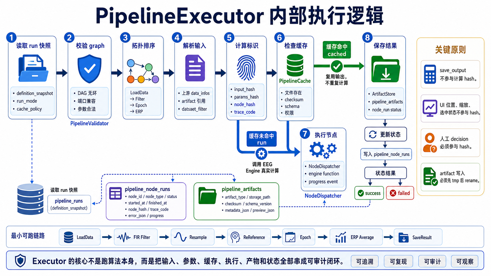
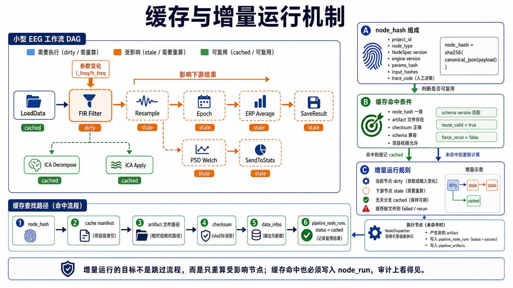
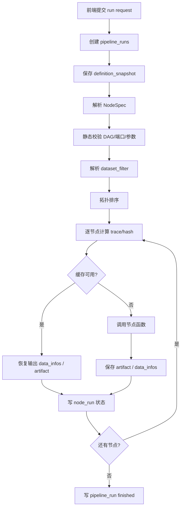
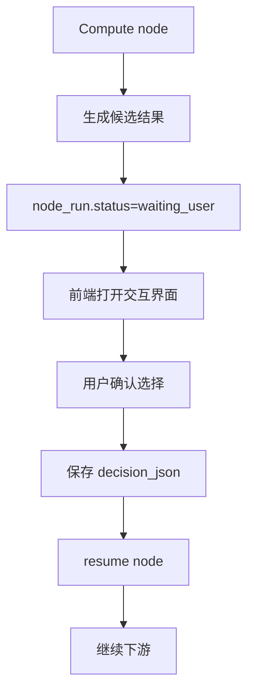

# 工作流执行、缓存与增量运行设计

> 文档性质：工作流专题讨论稿，可随方案讨论随时修改。
> 正式维护口径以 `wiki/docs` 为准；`wiki1` 是旧版文档，只作历史参考，不再作为新版事实源。
> 本目录用于把工作流方案讨论清楚，形成可落地的开发步骤后，再同步到 `wiki/docs` 的对应正式页面。





## 1. 设计目标

工作流执行引擎要解决五件事:

1. 按 DAG 拓扑顺序稳定执行节点。
2. 支持一个工作流批量作用于多个 dataset。
3. 支持增量执行,只重算受影响节点。
4. 支持跨浏览器、跨 session 的结果恢复。
5. 支持审计与复现,每个输出都能追溯到输入、参数、代码版本。

旧版 Niantong 已经验证了 `traceCode + nodeHash + data_infos + Save Node Output` 的可行性。新项目要把这些机制后端化、数据库化、项目目录持久化。

## 2. 执行模式

| 模式 | 用户入口 | 行为 |
|------|----------|------|
| `run_all` | 运行全部 | 从所有无入度节点开始执行整张 DAG |
| `rerun_all` | 重新运行 | 忽略缓存或按策略清理缓存后全量执行 |
| `run_node` | 运行此节点 | 只运行当前节点,要求上游输出可用 |
| `run_from_node` | 从此节点运行 | 当前节点和所有下游节点运行 |
| `resume_run` | 继续运行 | 从 waiting_user 或 interrupted 状态继续 |
| `dry_validate` | 校验 | 只检查 DAG 和参数,不执行 |

## 3. 执行总体流程



## 4. 拓扑排序

执行引擎必须先将 PipelineDefinition 中的 graph 转换为 DAG。

校验规则:

- 节点 id 唯一。
- link id 唯一。
- link 的 source/target 节点存在。
- source port 和 target port 存在。
- 端口类型兼容。
- 图中无环。
- 至少有一个数据源节点。
- 除数据源节点外,必填输入必须有连线。

伪代码:

```python
def topo_sort(nodes, links):
    node_map = {node["id"]: node for node in nodes}
    indeg = {node_id: 0 for node_id in node_map}
    outgoing = {node_id: [] for node_id in node_map}

    for link in links:
        src = link["from"]["node"]
        dst = link["to"]["node"]
        outgoing[src].append(dst)
        indeg[dst] += 1

    queue = [nid for nid, deg in indeg.items() if deg == 0]
    order = []
    while queue:
        nid = queue.pop(0)
        order.append(nid)
        for dst in outgoing[nid]:
            indeg[dst] -= 1
            if indeg[dst] == 0:
                queue.append(dst)

    if len(order) != len(node_map):
        raise PipelineValidationError("Pipeline contains cycle")
    return order
```

## 5. 输入解析

### 5.1 LoadData 节点

LoadData 节点不从上游读取数据,而是根据 `selection_mode` 决定如何解析项目数据集:

```json
{
  "selection_mode": "filter",
  "dataset_filter": {
    "subjects": ["sub-001", "sub-002"],
    "sessions": ["ses-01"],
    "tasks": ["rest"],
    "runs": "all",
    "qa_status": ["converted", "checked"],
    "require_fif": true
  },
  "dataset_ids": []
}
```

解析规则:

- `selection_mode=filter`: 根据 `dataset_filter` 查询数据库中的当前 dataset 记录,新增上传满足条件时会进入本次解析结果。
- `selection_mode=explicit`: 忽略动态筛选,只读取 `dataset_ids` 指定的数据集,用于锁定一次分析范围。
- `require_fif=true`: 只返回已经生成 `fif_path` 的 `fifdata` 工作数据。
- `failed/deleted/rejected` 状态的数据不得进入 `dataset_collection`。

返回 `dataset_collection`:

```json
{
  "type": "dataset_collection",
  "data_infos": [
    {
      "dataset_id": "uuid",
      "subject": "sub-001",
      "session": "ses-01",
      "task": "rest",
      "run": "run-01",
      "file_path": "fifdata/sub-001/...",
      "checksum": "sha256..."
    }
  ],
  "n_items": 100
}
```

### 5.2 普通节点

普通节点通过 link 收集上游端口输出:

```python
inputs = {
    "input": OutputRef(
        port_type="eeg_data",
        data_infos=[...],
        artifacts=[...]
    )
}
```

如果上游输出缺失:

- 当前运行中上游将执行: 等待。
- 上游已失败: 当前节点标记 `blocked`。
- 上游历史输出存在: 尝试从 artifact/cache 恢复。
- 无法恢复: 报错提示先运行上游。

## 6. Hash 与 traceCode

### 6.1 为什么需要两种标识

| 标识 | 用途 |
|------|------|
| `node_hash` | 程序内部缓存 key,通常为 SHA256 |
| `trace_code` | 便于调试和人工识别的数据-节点-参数-上游编码 |

旧版 Niantong 的 traceCode 格式为:

```text
D{dataHash}_N{nodeTypeHash}_P{paramsHash}_I{inputHash}
```

新项目保留这个结构,但由后端生成,并保存到 `pipeline_node_runs.trace_code`。

### 6.2 Hash 组成

```json
{
  "project_id": "202605000001",
  "node_type": "eeg/filter/fir",
  "node_spec_version": "1.0",
  "engine_version": "elys-engine-1.0",
  "params": {
    "filter_mode": "bandpass",
    "l_freq": 0.5,
    "h_freq": 30.0
  },
  "input_hashes": [
    "sha256-of-upstream"
  ]
}
```

`node_hash = sha256(canonical_json(payload))`

### 6.3 参数规范化

必须排除:

- 节点位置、颜色、折叠状态。
- `_ui` 内部状态。
- 当前进度、状态、错误。
- 运行时生成的 `data_id`, `output_id`, `session_id`。
- localStorage 临时字段。

必须保留:

- 影响计算结果的所有参数。
- 用户确认的人工选择,例如 ICA excluded components。
- 数据筛选条件。
- 算法版本或影响结果的 backend version。

### 6.4 LoadData hash

LoadData 的 hash 不应只靠文件名。推荐使用:

```text
sha256(project_id + dataset_id + upload_version + file_checksum + fif_checksum)
```

多个 dataset 时:

```text
sha256(sort(dataset_hashes).join("|"))
```

`filter` 模式必须先解析出实际命中的 dataset 列表,再计算上述 hash；因此增量上传或导入校正导致命中集合变化时,LoadData hash 会变化。`explicit` 模式则以 `dataset_ids` 指定的集合为准,新增上传不会自动影响旧工作流。

这样可以解决增量上传后“文件名一样但内容变了”的问题。

## 7. 缓存策略

### 7.1 缓存级别

| 级别 | 内容 | 保存位置 |
|------|------|----------|
| UI cache | 画布缩放、选中节点、折叠状态 | localStorage |
| run state | pipeline/node 运行状态 | PostgreSQL |
| artifact cache | 节点输出文件和 metadata | 项目目录 `cache/pipeline` |
| result artifact | 正式保存结果 | `derivatives/pipeline_runs` |
| analysis result | 可被观察/统计引用的结果 | `analysis_results` |

localStorage 不能保存核心结果,只能保存 UI 便利状态。

### 7.2 缓存策略枚举

| 策略 | 含义 |
|------|------|
| `reuse_valid` | 默认,hash 命中则复用 |
| `force_rerun` | 忽略缓存,重新计算 |
| `read_only_cache` | 只读缓存,不写新缓存 |
| `no_cache` | 不读不写缓存 |
| `reuse_until_node` | 指定节点前复用,从指定节点开始重算 |

`save_output` 不参与计算 hash,但参与持久化计划。如果缓存命中而本次运行要求保存输出,执行器不得简单返回缓存 metadata,必须确认存在可登记到本次 run 的 artifact；若没有正式 artifact,应从缓存物化一份输出并写入 `pipeline_artifacts`。

### 7.3 缓存命中条件

必须同时满足:

- `node_hash` 相同。
- 输入 artifact 文件存在。
- 输出 artifact 文件存在。
- `data_infos` 可读且 schema 版本兼容。
- 所属项目和权限允许访问。
- 节点 NodeSpec 版本兼容。

如果 local metadata 命中但文件缺失,必须判定缓存无效。

### 7.4 原子写入

所有 artifact 和 cache 文件必须原子写入:

1. 写入 `.tmp` 文件或临时目录。
2. 计算 checksum。
3. 写 sidecar metadata。
4. 使用 rename/move 进入最终路径。
5. 最后写数据库记录。

如果任何一步失败,不得产生可被缓存命中的记录。

### 7.5 并发锁

必须使用锁避免重复写:

| 锁 | 粒度 | 目的 |
|----|------|------|
| project run lock | `project_id` | 限制同项目并发工作流 |
| pipeline edit lock | `pipeline_id` | 防止多人保存覆盖 |
| node artifact lock | `pipeline_run_id + node_id` | 防止同一节点重复写输出 |
| cache write lock | `node_hash` | 防止多个 run 同时写同一缓存 |

## 8. 增量执行规则

### 8.1 参数变化

当节点参数变化:

- 当前节点 `dirty`。
- 所有依赖该节点输出的下游节点 `stale`。
- 不相关分支保持原状态。

### 8.2 输入数据变化

当 LoadData 选择的数据集变化:

- LoadData hash 变化。
- 所有下游节点 stale。
- 如果部分 dataset 未变化,节点函数可进行 dataset 粒度的局部缓存。

### 8.3 上游缓存恢复

运行某个下游节点时:

1. 检查上游当前 run 输出。
2. 检查上游历史 artifact。
3. 检查 pipeline cache。
4. 若恢复成功,将上游状态标记 `cached/restored`。
5. 若恢复失败,提示用户运行上游。

## 9. 批处理执行

### 9.1 默认策略: dataset 并行

对 100 被试、3 session 的数据,推荐默认按 dataset 并行:

```text
for node in topo_order:
  for dataset in node_input_datasets:
    run node for dataset with limited concurrency
```

优点:

- 容易复用单 dataset 缓存。
- 易于记录每个 subject/session/run 的失败。
- 易于断点恢复。

### 9.2 N-to-1 节点

部分节点需要汇总多个输入:

| 节点 | Cardinality |
|------|-------------|
| GrandAverage | N-to-1 |
| GroupCompare | N-to-1 或 N-to-M |
| Merge | N-to-1 |

N-to-1 节点必须等待全部必需上游输出完成。

### 9.3 失败策略

| 策略 | 行为 |
|------|------|
| `stop` | 任一 dataset 失败则停止工作流 |
| `continue` | 失败 dataset 记录错误,其余继续 |
| `skip_failed` | 下游节点跳过失败输入 |

Phase 1 默认 `stop`,批量分析场景可选 `continue`。

## 10. 人工交互节点

人工交互节点包括:

- ICA Inspect。
- Manual Artifact。
- Bad Channel Review。
- Event Review。

执行流程:



人工选择必须参与 hash。例如 ICA Apply 节点的 hash 应包含:

```json
{
  "ica_id": "ica_001",
  "excluded_components": [0, 2, 5],
  "decision_by": "user_uuid",
  "decision_version": 1
}
```

人工交互节点必须保存 `interaction_id`, `decision_version`, `locked_by`, `locked_at`。提交 decision 时要校验版本,避免两个用户同时确认导致后提交覆盖先提交。

2026-05-18 Step 13 落地补充：

- 第一版没有单独建 interaction 表，decision 暂存在 `pipeline_node_runs.output_json.metadata.interaction` 与顶层 `interaction` 快照中。
- `eeg/ica/apply` 没有 decision 时写 `node_run.status=waiting_user_input`，`PipelineExecutor` 随即把 `pipeline_runs.status` 写为 `waiting_user_input` 并停止下游执行。
- `POST .../decision` 使用 `decision_version` 做乐观冲突控制；版本不一致返回 `DECISION_CONFLICT`。
- `POST .../resume` 从 waiting node 的 `topo_index` 继续执行；恢复前 executor 会把 decision 合入 params，因此 excluded components 会参与后续 `params_hash/node_hash`。
- 当前 resume 走可测试同步 executor 路径，未阻塞 worker 等待用户；后续可再升级为 Celery resume task。

## 11. 输出保存

### 11.1 临时缓存 vs 正式结果

| 类型 | 是否长期保留 | 用途 |
|------|--------------|------|
| cache artifact | 不保证长期 | 加速重跑 |
| pipeline run artifact | 长期保留 | 审计和复现 |
| analysis result | 长期保留 | 观察、统计、导出 |

用户勾选 `save_output` 时,节点输出进入 `pipeline_artifacts`。最终 SaveResult 节点会写入 `analysis_results`。

### 11.2 输出命名

建议命名:

```text
sub-001_ses-01_task-rest_run-01_desc-filt_eeg.fif
sub-001_ses-01_task-rest_run-01_desc-ica_eeg.fif
sub-001_ses-01_task-rest_run-01_desc-epo_epo.fif
sub-001_ses-01_task-rest_run-01_desc-erp_ave.fif
```

其中 `desc-*` 来自 NodeSpec `backend.save_descriptor`。

## 12. PipelineExecutor 伪代码

```python
class PipelineExecutor:
    def __init__(self, run_id, definition, project, user, cache, artifact_store):
        self.run_id = run_id
        self.definition = definition
        self.project = project
        self.user = user
        self.cache = cache
        self.artifact_store = artifact_store
        self.outputs = {}

    def execute(self, request):
        self.validate()
        order = self.topo_sort()
        selected_order = self.apply_run_mode(order, request)

        for node_id in selected_order:
            node = self.get_node(node_id)
            spec = self.node_registry.get(node["type"])
            inputs = self.resolve_inputs(node_id)
            params = self.resolve_params(node, spec)
            trace = self.make_trace(node, params, inputs)
            node_hash = self.make_node_hash(node, params, inputs)

            node_run = self.create_node_run(node, trace, node_hash, inputs, params)

            if request.cache_policy != "force_rerun":
                cached = self.cache.restore(node_hash, trace, target_run=self.run_id)
                if cached:
                    self.outputs[node_id] = cached.output
                    self.finish_node_run(node_run, "cached", cached)
                    continue

            try:
                output = self.dispatch(spec, inputs, params, node_run)
                artifact_infos = self.artifact_store.save_outputs(output, node_run, spec)
                normalized_output = self.normalize_output(output, artifact_infos, node, trace)
                self.outputs[node_id] = normalized_output
                self.cache.save(node_hash, trace, normalized_output)
                self.finish_node_run(node_run, "success", normalized_output)
            except WaitingForUser as wait:
                self.mark_waiting_user(node_run, wait)
                return
            except Exception as exc:
                self.fail_node_run(node_run, exc)
                if request.on_error == "stop":
                    raise

        self.finish_pipeline_run()
```

## 13. API 设计

### 13.1 Run API

```http
POST /api/v1/projects/{project_id}/pipelines/{pipeline_id}/runs
```

请求:

```json
{
  "run_mode": "run_all",
  "start_node_id": null,
  "cache_policy": "reuse_valid",
  "dataset_filter": {},
  "options": {
    "save_intermediate": true,
    "on_error": "stop"
  }
}
```

响应:

```json
{
  "pipeline_run_id": "uuid",
  "task_id": "uuid",
  "status": "queued"
}
```

### 13.2 Node resume API

```http
POST /api/v1/pipeline-runs/{run_id}/nodes/{node_id}/resume
```

请求:

```json
{
  "decision": {
    "excluded_components": [0, 2, 5],
    "note": "blink and muscle components"
  }
}
```

### 13.3 Cache API

```http
GET /api/v1/pipeline-runs/{run_id}
GET /api/v1/pipeline-runs/{run_id}/nodes
POST /api/v1/pipelines/{pipeline_id}/validate
POST /api/v1/pipelines/{pipeline_id}/cache/clear
POST /api/v1/pipeline-artifacts/{artifact_id}/restore
```

## 14. 与异步任务系统的关系

工作流运行是长任务,必须接入 `604-Implementation-Async-Tasks` 中的任务系统。

Redis/Celery 的详细讨论见 `10-Redis后台任务与工作流调度架构.md`。这里保留执行、缓存和增量运行的原则；真正的队列、worker、任务状态恢复和 MVP 落地顺序以 10 号文档为工作草案。

| 层 | 职责 |
|----|------|
| API | 创建 run,返回 task id |
| Task Queue | 排队和并发控制 |
| Worker | 执行 PipelineExecutor |
| WebSocket/SSE | 推送进度 |
| DB | 保存状态 |
| ArtifactStore | 保存文件 |

Phase 1 已于 2026-05-18 完成 Celery + Redis 投递入口第一版，之前的 FastAPI BackgroundTasks 只作为历史过渡；API 和数据库结构继续按异步任务设计，后续重点补 worker 恢复、取消、重试和缓存命中。

推荐正式路线是 Redis + Celery：数据库保存 `pipeline_runs`、`pipeline_node_runs`、`pipeline_artifacts` 这些长期事实；Redis 只保存队列、临时进度、事件通知和 worker 心跳；EEG 大文件和中间结果必须落在项目数据目录或对象存储。

2026-05-18 Step 12 已完成第一版节点级缓存落地：

- `backend/app/pipeline/hash.py` 提供 `canonical_json`、`params_hash`、`input_hash`、`node_hash` 和初版 `trace_code`。
- `params_hash` 会忽略 NodeSpec properties 中 `hash=false` 的参数，例如 `save_output`、`retention`。
- `backend/app/pipeline/cache.py` 按 `node_hash` 查找历史 success/cached node_run，校验 artifact 文件存在和 checksum。
- 缓存命中不调用 engine，会写当前 `node_run.status=cached`，并为本次 run 新登记 artifact 引用。
- Redis 和 localStorage 都不作为 EEG artifact 缓存事实源。

## 15. 旧版 Niantong 经验吸收

| 旧版机制 | 新版落地 |
|----------|----------|
| 前端生成 traceCode | 后端生成,前端只展示 |
| localStorage 命中后还要后端验证 | 保留原则:缓存命中必须验证文件存在 |
| Save Node Output 注册表 | 改为 `pipeline_artifacts` + cache manifest |
| CWT/TFR 等大对象延迟恢复 | 保留,大对象按需加载 |
| ICA 特殊双输出恢复 | 正式定义多输出端口 |
| LoadData selected_files 稳定化 | 改为 dataset checksum/version hash |

## 16. 2026-05-17 补充：后端执行逻辑明确版

> 本节把后端应该怎么执行写清楚，并标出当前 `elys_version1` 只完成到哪一步。当前代码位置默认省略 `elys_version1/` 前缀。

### 16.1 当前真实执行逻辑

当前 `backend/app/routers/pipelines.py` 的 `run_pipeline` 仍是同步执行，但已调用 `backend/app/pipeline/executor.py` 中的 `PipelineExecutor`：

1. 创建 `PipelineRun`，状态设为 `running`。
2. 调用 `PipelineExecutor.execute()`。
3. `PipelineExecutor` 先调用 `validate_definition`。
4. 若校验通过，按拓扑顺序遍历节点。
5. 为每个图节点创建 `pipeline_node_runs`。
6. 如果节点类型是 `eeg/data/load`，通过 `NodeDispatcher` 调用 `resolve_load_data_selection`，生成 `data_infos_by_node`，并写入 node_run `output_json.data_infos`。
7. 其它节点全部返回 `PIPELINE_NODE_EXECUTOR_NOT_IMPLEMENTED`，对应 node_run 标记为 `failed`。
8. 有任何 error 时 run 标记为 `failed`，否则标记为 `completed`。

这意味着：当前“运行”已经具备节点级事实骨架，但仍只是真实执行 LoadData，不是完整 EEG 分析流水线。

### 16.2 目标后端执行逻辑

```text
POST /projects/{project_id}/pipelines/{pipeline_id}/run
  -> 锁定 pipeline version 和 definition_snapshot
  -> 创建 pipeline_runs
  -> 后台任务 PipelineExecutor.run(run_id)
      -> validate snapshot
      -> topological sort
      -> for each node:
          -> 创建 pipeline_node_runs
          -> 解析上游 data_infos / artifacts
          -> 规范化 params
          -> 计算 input_hash / node_hash / trace_code
          -> 若 use_cache=true 且缓存有效：恢复 artifact，status=cached
          -> 否则通过 NodeDispatcher 调用节点执行器
          -> 临时目录写入输出，校验后原子发布
          -> 写 pipeline_artifacts / dataset_derivatives / analysis_results
          -> 更新 node_run 状态和 run 进度
      -> 聚合 run.result_json / error_json
      -> run completed 或 failed
```

### 16.3 节点执行器接口

每个节点执行器建议统一为：

```python
def run_xxx(context: NodeExecutionContext) -> NodeExecutionResult:
    ...
```

| 对象 | 必含字段 |
| --- | --- |
| `NodeExecutionContext` | `project_id`、`run_id`、`node_run_id`、`node_id`、`node_type`、`params`、`inputs`、`work_dir`、`artifact_store`、`cache_policy` |
| `NodeExecutionResult` | `status`、`data_infos`、`artifacts`、`metrics`、`warnings`、`preview`、`error` |

### 16.4 当前代码需要补的执行能力

- `backend/app/pipeline/executor.py` 已有 `PipelineExecutor` 骨架，后续需要接入普通 EEG 节点、缓存和 artifact 写入。
- `backend/app/pipeline/dispatcher.py` 已有 `NodeDispatcher` 骨架，后续需要按 NodeSpec backend.module/backend.function 调用更多执行器。
- `backend/app/pipeline/artifacts.py` 已有基础 ArtifactStore，后续需要由 executor 节点实际调用。
- 节点级状态表和 artifact 表已存在；当前已写 node_run，artifact 仍待接入。
- 把同步 run 改为后台任务，并让前端轮询或 SSE 读取状态。
- 先实现 `LoadData -> FIR Filter -> Resample -> Re-reference -> Epoch -> ERP Average -> Save Result` 的最小链路。
