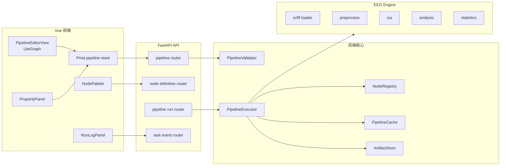

# 工作流程序架构与实施方案

> 文档性质：工作流专题讨论稿，可随方案讨论随时修改。
> 正式维护口径以 `wiki/docs` 为准；`wiki1` 是旧版文档，只作历史参考，不再作为新版事实源。
> 本目录用于把工作流方案讨论清楚，形成可落地的开发步骤后，再同步到 `wiki/docs` 的对应正式页面。


## 1. 总体架构



## 2. 前端模块

### 2.1 目录建议

```text
frontend/elys-web/src/
  views/
    PipelineEditorView.vue
  components/pipeline/
    PipelineCanvas.vue
    NodePalette.vue
    NodePropertyPanel.vue
    PipelineToolbar.vue
    PipelineRunPanel.vue
    NodeOutputPreview.vue
    DatasetFilterPanel.vue
  stores/
    pipeline.ts
  api/
    pipeline.ts
    pipelineNodes.ts
    pipelineRuns.ts
  types/
    pipeline.ts
  utils/pipeline/
    litegraphRegister.ts
    graphSerialize.ts
    graphValidate.ts
    portCompatibility.ts
    nodeState.ts
```

### 2.2 `PipelineEditorView.vue`

职责:

- 组装页面布局。
- 读取 project id。
- 加载 pipeline definition。
- 加载 node specs。
- 建立事件订阅。
- 协调保存和运行。

不负责:

- 节点执行。
- hash 计算。
- 大对象缓存。
- EEG 数据加载。

### 2.3 `PipelineCanvas.vue`

职责:

- 初始化 LiteGraph。
- 注册节点类型。
- 处理节点选中、连线、删除、移动。
- 将 LiteGraph 事件同步到 Pinia store。

关键点:

- LiteGraph 是命令式库,应通过 `ref` 管理 canvas DOM。
- Vue 不直接渲染每个节点 DOM。
- 图结构修改后触发 `markDirty()`。
- 节点状态由后端 run event 驱动更新。

### 2.4 `NodePalette.vue`

职责:

- 从 `GET /pipeline/nodes` 获取 NodeSpec。
- 按 category/phase 分组。
- 搜索节点。
- 拖拽节点到画布。
- Phase 2 未启用节点显示为 disabled 或 beta。

### 2.5 `NodePropertyPanel.vue`

职责:

- 根据选中节点的 NodeSpec 生成参数表单。
- 校验参数。
- 修改参数后更新 store 和 LiteGraph node properties。
- 显示输入输出摘要。
- 提供“运行此节点”“从此节点运行”“查看输出”按钮。

### 2.6 `PipelineRunPanel.vue`

职责:

- 显示 run 状态。
- 显示节点日志。
- 显示错误和性能。
- 订阅 WebSocket/SSE。
- 支持取消运行。

## 3. 前端 store

```typescript
export interface PipelineState {
  projectId: string
  pipelineId: number | null
  definition: PipelineDefinition | null
  nodeSpecs: Record<string, NodeSpec>
  selectedNodeId: string | null
  dirty: boolean
  currentRun: PipelineRun | null
  nodeRuntimeStates: Record<string, NodeRuntimeState>
  ui: {
    zoom: number
    scroll: { x: number; y: number }
    activeBottomTab: 'log' | 'output' | 'perf' | 'error'
  }
}
```

store actions:

| action | 行为 |
|--------|------|
| `loadNodeSpecs()` | 加载节点定义 |
| `loadPipeline(id)` | 加载工作流 |
| `savePipeline()` | 保存定义 |
| `createPipeline()` | 新建 |
| `runPipeline(mode, options)` | 创建运行 |
| `cancelRun(runId)` | 取消运行 |
| `applyRunEvent(event)` | 更新节点状态 |
| `markNodeDirty(nodeId)` | 参数修改后标记 |

## 4. 后端模块

### 4.1 目录建议

```text
backend/app/
  routers/
    pipelines.py
    pipeline_nodes.py
    pipeline_runs.py
  schemas/
    pipeline.py
    node_spec.py
    pipeline_run.py
  models/
    project.py
    pipeline.py
  pipeline/
    registry.py
    validator.py
    executor.py
    dispatcher.py
    cache.py
    artifact_store.py
    hash.py
    events.py
    errors.py
    nodes/
      eeg_data_load.json
      eeg_filter_fir.json
      eeg_filter_butter.json
      eeg_resample.json
      eeg_ica_compute.json
      eeg_ica_apply.json
      eeg_epoch.json
      eeg_erp.json
  engine/
    io/
    preprocess/
    ica/
    analysis/
    statistics/
```

### 4.2 `NodeRegistry`

职责:

- 扫描 `pipeline/nodes/*.json`。
- 校验 NodeSpec schema。
- 提供 `get(type)` 和 `list(enabled_phase)`。
- 记录 NodeSpec version。

接口:

```python
class NodeRegistry:
    def list_specs(self, *, phase: str | None = None) -> list[NodeSpec]: ...
    def get(self, node_type: str) -> NodeSpec: ...
    def reload(self) -> None: ...
```

### 4.3 `PipelineValidator`

职责:

- 校验 graph 结构。
- 校验端口类型。
- 校验参数。
- 校验 phase 是否启用。
- 给出用户可读错误。

接口:

```python
class PipelineValidator:
    def validate_definition(self, definition: dict) -> ValidationReport: ...
    def validate_run_request(self, definition: dict, request: RunRequest) -> ValidationReport: ...
```

### 4.4 `PipelineExecutor`

职责:

- 创建 node_run。
- 解析输入。
- 计算 hash/trace。
- 调用 cache。
- dispatch 节点函数。
- 保存 artifact。
- 推送事件。
- 处理人工交互节点。

### 4.5 `NodeDispatcher`

节点函数统一签名:

```python
def run_node(
    *,
    inputs: dict[str, NodeOutput],
    params: dict,
    context: NodeExecutionContext,
) -> NodeOutput:
    ...
```

`NodeExecutionContext`:

```python
@dataclass
class NodeExecutionContext:
    project_id: str
    pipeline_run_id: UUID
    node_run_id: UUID
    user_id: UUID
    project_root: Path
    work_dir: Path
    cache_dir: Path
    logger: Logger
    emit_progress: Callable[[dict], None]
```

### 4.6 `ArtifactStore`

职责:

- 根据 node output 保存 FIF/HDF5/JSON。
- 生成 sidecar metadata。
- 写入 `pipeline_artifacts`。
- 生成 `data_infos`。
- 支持按 artifact id 恢复。

接口:

```python
class ArtifactStore:
    def save_node_output(self, output: NodeOutput, *, node_run, spec) -> NodeOutput: ...
    def restore(self, artifact_id: UUID) -> NodeOutput: ...
    def exists(self, data_info: dict) -> bool: ...
```

### 4.7 `PipelineCache`

职责:

- 按 `node_hash` 和 `trace_code` 查找缓存。
- 验证文件存在和 schema 兼容。
- 保存缓存 metadata。
- 清理过期缓存。

缓存目录:

```text
project_root/cache/pipeline/
  node_hash/
    ab/
      cd/
        abcdef....json
  trace_code/
    Dxxxx_Nxxxx_Pxxxx_Ixxxx.json
```

## 5. API 设计

### 5.1 NodeSpec

```http
GET /api/v1/pipeline/nodes
GET /api/v1/pipeline/nodes/{node_type}
```

### 5.2 PipelineDefinition

```http
GET    /api/v1/projects/{project_id}/pipelines
POST   /api/v1/projects/{project_id}/pipelines
GET    /api/v1/projects/{project_id}/pipelines/{pipeline_id}
PUT    /api/v1/projects/{project_id}/pipelines/{pipeline_id}
DELETE /api/v1/projects/{project_id}/pipelines/{pipeline_id}
POST   /api/v1/projects/{project_id}/pipelines/{pipeline_id}/validate
POST   /api/v1/projects/{project_id}/pipelines/{pipeline_id}/duplicate
```

### 5.3 PipelineRun

```http
POST /api/v1/projects/{project_id}/pipelines/{pipeline_id}/runs
GET  /api/v1/projects/{project_id}/pipeline-runs
GET  /api/v1/projects/{project_id}/pipeline-runs/{run_id}
POST /api/v1/projects/{project_id}/pipeline-runs/{run_id}/cancel
GET  /api/v1/projects/{project_id}/pipeline-runs/{run_id}/nodes
GET  /api/v1/projects/{project_id}/pipeline-runs/{run_id}/artifacts
```

### 5.4 交互节点

```http
GET  /api/v1/projects/{project_id}/pipeline-runs/{run_id}/nodes/{node_id}/interaction
POST /api/v1/projects/{project_id}/pipeline-runs/{run_id}/nodes/{node_id}/decision
POST /api/v1/projects/{project_id}/pipeline-runs/{run_id}/nodes/{node_id}/resume
```

### 5.5 输出预览

```http
GET /api/v1/projects/{project_id}/pipeline-artifacts/{artifact_id}/summary
GET /api/v1/projects/{project_id}/pipeline-artifacts/{artifact_id}/preview
GET /api/v1/projects/{project_id}/pipeline-artifacts/{artifact_id}/data
```

## 6. 与 EEG Engine 的关系

工作流层不直接写 MNE 细节。每个节点 dispatch 到 engine:

| 节点 | engine 函数 |
|------|-------------|
| LoadData | `engine.io.load_fif_dataset` |
| Resample | `engine.preprocess.resample.run_resample` |
| FIR Filter | `engine.preprocess.filters.run_fir_filter` |
| Butter Filter | `engine.preprocess.filters.run_iir` |
| ReReference | `engine.preprocess.reference.run_rereference` |
| ChannelLocation | `engine.preprocess.montage.assign` |
| RenameChannels | `engine.preprocess.channels.rename` |
| ComputeICA | `engine.ica.compute.run` |
| ApplyICA | `engine.ica.apply.run` |
| Epoch | `engine.analysis.epoching.run_epoch_segment` |
| ERP | `engine.analysis.erp.run_erp_average` |
| PSD | `engine.analysis.psd.run` |
| TFR | `engine.analysis.tfr.run` |

## 7. NodeSpec 文件清单建议

Phase 1 初始节点:

```text
pipeline/nodes/
  eeg_data_load.json
  eeg_data_select.json
  eeg_preproc_resample.json
  eeg_filter_fir.json
  eeg_filter_butterworth.json
  eeg_filter_notch.json
  eeg_preproc_rereference.json
  eeg_preproc_rename_channels.json
  eeg_preproc_channel_location.json
  eeg_preproc_interpolate_bads.json
  eeg_ica_compute.json
  eeg_ica_inspect.json
  eeg_ica_apply.json
  eeg_epoch_find_events.json
  eeg_epoch_segment.json
  eeg_epoch_baseline.json
  eeg_analysis_erp.json
  eeg_analysis_grand_average.json
  eeg_analysis_psd.json
  eeg_analysis_tfr.json
  eeg_output_save_result.json
  eeg_output_send_to_view.json
  eeg_output_send_to_stats.json
```

Phase 2:

```text
  eeg_analysis_connectivity.json
  eeg_analysis_microstate.json
  eeg_analysis_source.json
  eeg_stats_group_compare.json
  eeg_output_send_to_figure.json
```

## 8. 旧版 Niantong 到 ELYS 的迁移映射

| 旧节点 | 新节点类型 | Phase |
|--------|------------|-------|
| `eeg/load_bids_data` | `eeg/data/load` | 1 |
| `eeg/resample` | `eeg/preproc/resample` | 1 |
| `eeg/filter_fir` | `eeg/filter/fir` | 1 |
| `eeg/filter_butterworth` | `eeg/filter/butterworth` | 1 |
| `eeg/channel_location` | `eeg/preproc/channel_location` | 1 |
| `eeg/re_reference` | `eeg/preproc/rereference` | 1 |
| `eeg/rename_channel` | `eeg/preproc/rename_channels` | 1 |
| `eeg/compute_ica` | `eeg/ica/compute` | 1 |
| `eeg/visualize_ica` | `eeg/ica/inspect` + `eeg/ica/apply` | 1 |
| `eeg/artifact_rejection` | `eeg/preproc/interpolate_bads` 或 `eeg/preproc/manual_artifact` | 1 |
| `eeg/epoch_segmentation` | `eeg/epoch/segment` | 1 |
| `eeg/baseline_correction` | `eeg/epoch/baseline_correct` | 1 |
| `eeg/average_erp` | `eeg/analysis/erp` | 1 |
| `eeg/average_across_subjects` | `eeg/analysis/grand_average` | 1 |
| `eeg/merge` | `eeg/aggregate/merge` | 2 |

## 9. 实施路线

### 9.1 第一步: 数据结构和 API 骨架

目标:

- 新增/扩展 pipeline 数据表。
- 实现 NodeSpec schema 和 registry。
- 实现 pipeline CRUD API。
- 前端能加载 NodeSpec 和保存空工作流。

交付:

- `pipeline_definitions` 支持 version/status/is_template。
- `pipeline_runs`, `pipeline_node_runs`, `pipeline_artifacts` migration。
- `GET /pipeline/nodes`。
- `POST/PUT /projects/{id}/pipelines`。

### 9.2 第二步: LiteGraph 编辑器接入

目标:

- 替换当前静态 `PipelinePage.vue`。
- 实现三栏布局。
- 实现节点动态注册。
- 实现参数面板。
- 实现静态校验。

交付:

- 可拖节点、连线、保存、加载。
- 参数修改后 dirty/stale 状态。
- 端口类型校验。

### 9.3 第三步: 后端执行 MVP

目标:

- 实现 `PipelineExecutor`。
- 支持 LoadData、Resample、Filter、ReReference、Epoch、ERP。
- 支持运行全部和重新运行。

交付:

- `POST /pipelines/{id}/runs`。
- run/node run 状态写库。
- 输出 `data_infos`。
- 节点日志可查看。

### 9.4 第四步: 缓存与增量执行

目标:

- 实现 node_hash/traceCode。
- 实现 artifact cache。
- 实现缓存恢复。
- 支持单节点运行和从此节点运行。
- 实现 artifact 原子写入和 cache 写锁。

交付:

- 参数不变时 cache hit。
- 修改节点只重算下游。
- 浏览器刷新后恢复运行状态。
- 缓存 metadata 命中但文件缺失时自动失效。
- 同一 node_hash 并发写入时不会生成半文件或重复记录。

### 9.5 第五步: ICA 和人工交互节点

目标:

- 接入 ComputeICA。
- 实现 ICA Inspect 交互。
- 用户确认后 ApplyICA 并继续下游。

交付:

- `waiting_user` 状态。
- decision_json 保存。
- excluded components 参与 hash。

### 9.6 第六步: PSD/TFR 与观察联动

目标:

- 支持 PSD/TFR 分析节点。
- 节点双击进入观察模块。
- 输出预览按需加载。

交付:

- `SendToView` 节点。
- artifact preview API（raw/epochs/evoked 第一版已完成，PSD/TFR 待扩展）。

## 10. 验收测试

### 10.1 单元测试

| 模块 | 测试 |
|------|------|
| NodeRegistry | JSON schema、重复 type、phase 过滤 |
| Validator | 环检测、端口类型、参数错误 |
| Hash | 相同输入稳定、一处参数变化 hash 变化 |
| Cache | 文件存在校验、缺失失效、恢复 data_infos、并发写锁 |
| ArtifactStore | `.tmp` 原子写入、checksum 校验、失败清理 |
| Executor | 拓扑执行、失败中断、缓存跳过、取消运行 |
| Engine nodes | 每个节点函数的最小数据测试 |
| Interaction | decision_version 冲突、waiting_user resume |

### 10.2 集成测试

测试工作流:

1. LoadData -> Filter -> SaveResult。
2. LoadData -> Resample -> Filter -> Epoch -> ERP。
3. LoadData -> ICA Compute -> ICA Inspect -> ICA Apply。
4. LoadData -> PSD -> SendToStats。

每个测试验证:

- run 状态正确。
- node_run 数量正确。
- 输出文件存在。
- `data_infos` schema 正确。
- 第二次运行缓存命中。
- 修改中间节点参数后只重跑下游。

### 10.3 前端 E2E

| 场景 | 预期 |
|------|------|
| 新建工作流并保存 | 刷新后可恢复 |
| 拖节点并连线 | 端口类型兼容 |
| 错误参数运行 | 显示字段级错误 |
| 运行全部 | 进度和日志更新 |
| 节点双击 | 打开对应预览 |
| 取消运行 | 状态变 canceled |
| 两个用户同时保存 | 后提交者看到版本冲突提示 |
| 两个运行同时命中同一缓存 | 只有一个写缓存,另一个等待或复用 |

## 11. 风险与处理

| 风险 | 表现 | 处理 |
|------|------|------|
| LiteGraph 与 Vue 状态同步复杂 | 节点状态不一致 | 以 LiteGraph graph 为画布事实,Pinia 保存业务状态 |
| MNE 大对象序列化慢 | 缓存耗时大 | 大对象保存 FIF/HDF5,metadata JSON 只存引用 |
| 批量任务过大 | 服务器内存爆 | 限制并发,按 dataset 流式处理 |
| 人工节点阻塞 | run 长时间等待 | waiting_user 状态可恢复,允许通知用户 |
| NodeSpec 版本变化 | 旧工作流打不开 | schema migration |
| 输出文件膨胀 | 磁盘占满 | cache TTL、项目配额、清理策略 |

## 12. 推荐优先级

| 优先级 | 内容 |
|--------|------|
| P0 | NodeSpec、Pipeline CRUD、LiteGraph 编辑保存、静态校验 |
| P0 | 后端 Executor、LoadData、Filter、Resample、SaveResult |
| P0 | run/node_run 状态、日志、基础 data_infos |
| P1 | 缓存、增量执行、单节点运行、从此运行 |
| P1 | ICA 人工交互增强、artifact download、PSD/TFR；artifact preview 第一版已完成 |
| P1 | PSD/TFR 与观察联动 |
| P2 | 作图、微状态、脑网络、溯源、高级统计 |

## 13. 最小可行 Demo

最小可行 Demo 不要一开始追求所有节点。建议第一版只做:

```text
LoadData -> FIR Filter -> Resample -> SaveResult
```

必须真实打通:

- 从数据库选 dataset。
- 读取 `fifdata`。
- MNE 执行滤波和重采样。
- 保存输出 FIF。
- 写入 `pipeline_runs`, `pipeline_node_runs`, `pipeline_artifacts`。
- 前端看到节点状态和输出预览。
- 第二次运行能缓存命中。

这个闭环打通后,再逐步加 ICA、Epoch、ERP。

## 14. 2026-05-17 补充：当前代码进度与开发步骤

> 本节把“现在做了什么、还要做什么、怎么做”落成开发路线。当前代码位置默认省略 `elys_version1/` 前缀。

### 14.1 已完成清单

| 层面 | 已完成 | 代码位置 |
| --- | --- | --- |
| 前端路由 | `/pipeline` 页面已接入登录后的工作台 | `frontend/elys-web/src/router/index.ts` |
| 前端页面 | 项目选择、pipeline 选择、新建、节点库、LiteGraph、属性面板、保存、校验、运行；已接入后端节点级状态轮询、画布状态标记、底部运行面板和选中节点摘要 | `frontend/elys-web/src/views/PipelinePage.vue` |
| 前端 API | pipeline CRUD、validate、run、runs、LoadData resolve、run detail、node_runs、artifacts 查询封装 | `frontend/elys-web/src/api/pipelines.ts` |
| 类型定义 | NodeSpec、PipelineDefinition、PipelineRun、PipelineRunDetail、PipelineNodeRun、PipelineArtifact、LoadDataDataInfo | `frontend/elys-web/src/types/index.ts` |
| 后端 API | 已包含 pipeline 基础接口、run list、run detail、node_run 列表、artifact 列表查询 | `backend/app/routers/pipelines.py` |
| NodeSpec | 10 个 phase1 节点规格 | `backend/app/pipeline/nodes/*.json` |
| LoadData | 按 explicit/filter 解析 dataset 和 fifdata | `backend/app/pipeline/load_data.py` |
| 数据库 | `pipeline_definitions`、`pipeline_runs`、`pipeline_artifacts`、带追溯字段的 `analysis_results` | `database/init.sql` |
| 节点运行与产物事实表 | `pipeline_node_runs`、`pipeline_artifacts` 的 SQL、ORM、schema、schema_compat 已落地 | `database/init.sql`、`backend/app/models/project.py`、`backend/app/schemas/pipeline.py`、`backend/app/services/schema_compat.py` |
| ArtifactStore 基础 | 已实现节点输出契约、JSON metadata、普通文件/目录 artifact 的 sha256、原子发布和索引登记 | `backend/app/pipeline/contracts.py`、`backend/app/pipeline/artifacts.py` |
| Run detail 查询 | 已实现 run detail、node_run 列表、artifact 列表查询 API 和前端封装 | `backend/app/routers/pipelines.py`、`frontend/elys-web/src/api/pipelines.ts`、`frontend/elys-web/src/types/index.ts` |
| Executor 骨架 | `POST /run` 已接入 Celery + Redis 投递入口：请求阶段创建 run 和 pending node_run 后返回 queued，Celery worker 重新获取 DB session 调用 `PipelineExecutor`；LoadData、FIR、Resample、Re-reference、ICA Compute/Apply、Epoch、ERP、Save Result 可成功，其它节点写未实现错误 | `backend/app/tasks/*.py`、`backend/app/pipeline/background.py`、`backend/app/pipeline/executor.py`、`backend/app/pipeline/dispatcher.py`、`backend/app/routers/pipelines.py` |
| MNE IO 基础 | 已实现从 data_info 读取 Raw FIF、保存 Raw/Epochs/Evoked FIF、metadata 摘要和 synthetic Raw helper | `backend/app/engine/io.py`、`backend/app/engine/testing.py` |
| 预处理节点 | 已实现 FIR、Resample、Re-reference，输入来自上游 data_infos，输出写入 pipeline artifact 并返回派生 data_infos | `backend/app/engine/preprocess/*.py`、`backend/app/pipeline/dispatcher.py` |
| 分析节点与结果保存 | 已实现 Epoch、ERP Average、Save Result，Epochs/Evoked 写 artifact，Save Result 写 `analysis_results` 并保留 artifact/run/node_run 追溯 | `backend/app/engine/analysis/*.py`、`backend/app/pipeline/output.py` |
| 前端节点级状态展示 | 已实现第一版轮询展示，状态以后端 `node_run.status` 为准，终态后停止轮询 | `frontend/elys-web/src/views/PipelinePage.vue` |
| Celery 后台运行 | 已从 FastAPI BackgroundTasks 过渡为 Celery `run_pipeline_task`；保留可测试同步执行函数，worker 内重新创建 DB session，异常写回 run/node_run | `backend/app/tasks/celery_app.py`、`backend/app/tasks/pipeline_tasks.py`、`backend/app/pipeline/background.py`、`backend/app/pipeline/executor.py` |
| 节点级缓存 | 已实现第一版：执行前计算 `params_hash/input_hash/node_hash/trace_code`，按 `node_hash` 查找可复用 artifact，校验文件和 checksum，命中写 `node_run.status=cached` 并登记本次 run 的 artifact 引用 | `backend/app/pipeline/hash.py`、`backend/app/pipeline/cache.py`、`backend/app/pipeline/executor.py` |
| Artifact preview | 已实现第一版：支持 raw/epochs/evoked 轻量 preview，检查文件存在和 checksum，并在 `PipelinePage.vue` 提供 artifact 入口和观察页 query | `backend/app/pipeline/previews.py`、`backend/app/routers/pipelines.py`、`frontend/elys-web/src/views/PipelinePage.vue` |

### 14.2 未完成清单

| 优先级 | 缺口 | 说明 |
| --- | --- | --- |
| P0 | 普通节点执行器 | LoadData、FIR、Resample、Re-reference、ICA Compute/Apply、Epoch、ERP、Save Result 已实现；Butterworth、PSD/TFR 等还没有真实执行，当前会写失败 node_run。 |
| P0 | ArtifactStore 执行器接入 | FIR/Resample/Re-reference/ICA/Epoch/ERP 已调用 ArtifactStore 写入 pipeline artifact；raw/epochs/evoked preview 已实现，download、restore 和更多分析类型仍未实现。 |
| P0 | 后台队列增强 | Celery + Redis 投递入口已实现；worker 恢复、取消和重试仍未实现，本机因 Redis 不可用尚未完成真实消费验证。 |
| P1 | 增量执行增强 | 第一版 node_hash/artifact 缓存已落地；run-from、缓存统计、缓存失效 API、跨节点 partial policy 仍未实现。 |
| P1 | 人工交互节点增强 | ICA waiting/decision/resume 第一版已实现；独立 interaction 表、通知、锁定和 resume 队列化仍待补。 |
| P1 | 输出观察联动 | ERP artifact 已生成并登记，preview API 和 PipelinePage 入口已接入；download 和观察页真实渲染尚未接入。 |
| P2 | 批处理和并发 | 多被试、多 run、N-to-1 汇总节点仍需实现。 |

### 14.2.1 Redis 后台任务补充

后台任务的详细机制见 `10-Redis后台任务与工作流调度架构.md`。本实施方案中与 Redis/Celery 相关的落地原则如下：

- `POST /run` 只负责创建 run 快照、初始化 node_run、投递后台任务并返回 `run_id`。
- Redis 只负责队列、临时进度、事件通知和 worker 心跳，不保存 EEG 产物和长期事实。
- 数据库保存 `pipeline_runs`、`pipeline_node_runs`、`pipeline_artifacts`。
- Worker 从数据库和文件系统读取输入，任务消息中只传 id、路径引用和参数摘要。
- MVP 先用单队列 `workflow.default` 顺序执行拓扑结果，跑通后再拆分 `workflow.preprocess`、`workflow.ica`、`workflow.analysis`、`workflow.ai`。
- 前端第一版用轮询展示 run 和 node 状态，SSE/WebSocket 放到后续增强。
- 本地 Windows 启动 worker 示例：`$env:PYTHONPATH=(Join-Path $PWD 'backend'); python -m celery -A app.tasks.celery_app:celery_app worker -Q workflow.default --pool=solo --loglevel=INFO`。
- Linux/服务器启动 worker 示例：`PYTHONPATH=backend celery -A app.tasks.celery_app:celery_app worker -Q workflow.default --loglevel=INFO`。

### 14.3 推荐开发顺序

1. 先补数据库：`pipeline_node_runs`、`pipeline_artifacts`，并写迁移脚本。
2. 把执行器从 router 拆分为 `PipelineExecutor`、`PipelineValidator`、`NodeDispatcher`、`ArtifactStore`。（基础已完成，ArtifactStore 已接入预处理节点）
3. 保持前端现有页面不大改，只补运行状态面板和节点状态展示。（已完成第一版）
4. 实现最小可跑链路：LoadData、FIR Filter、Resample、Re-reference、Epoch、ERP Average、Save Result。（已完成第一条分析链路）
5. 先把 `POST /run` 改为创建 run 后尽快返回 `run_id`，真实执行放后台。（已完成 Celery + Redis 投递入口；需要有 Redis 服务和 worker 进程）
6. 前端继续轮询 `GET /pipeline-runs/{run_id}`、`GET /pipeline-runs/{run_id}/nodes`、`GET /pipeline-runs/{run_id}/artifacts`，画布节点状态完全以后端返回为准。
7. 再增强缓存：当前第一版 traceCode/node_hash 和 artifact 恢复已落地；后续补缓存统计、手动失效、run-from 和 partial policy。
8. 接下来做 artifact download、观察页真实渲染、worker 恢复/取消/重试和批处理优化；ICA 人工节点与 artifact preview 第一版已完成。

### 14.4 API 路线

| API | 当前状态 | 建议动作 |
| --- | --- | --- |
| `GET /pipeline/nodes` | 已有 | 增加 `implemented`、`interactive`、`maturity` 字段，前端显示节点成熟度。 |
| `POST /projects/{project_id}/pipeline/load-data/resolve` | 已有 | 保留作为前端预览接口。 |
| `POST /projects/{project_id}/pipelines/{pipeline_id}/run` | 已接入 Celery 投递入口 | 当前创建 run/node_run 后返回 queued，并投递 `run_pipeline_task` 到 `workflow.default`；后续再支持 `mode=incremental/force`、取消和恢复。 |
| `GET /projects/{project_id}/pipelines/{pipeline_id}/runs` | 已有 | 保留列表。 |
| `GET /projects/{project_id}/pipeline-runs/{run_id}` | 已有 | 已新增 run 详情，包含 node_runs 和 artifacts 空数组兼容。 |
| `GET /projects/{project_id}/pipeline-runs/{run_id}/nodes` | 已有 | 已新增节点状态列表。 |
| `GET /projects/{project_id}/pipeline-runs/{run_id}/artifacts` | 已有 | 已新增本次 run 的 artifact 列表。 |
| `GET /projects/{project_id}/pipeline-artifacts/{artifact_id}/preview` | 已有 | Step 14 新增：返回 raw/epochs/evoked 轻量预览，校验文件存在和 checksum，并返回观察页 route/query。 |
| `GET /projects/{project_id}/pipeline-runs/{run_id}/nodes/{node_run_id}/interaction` | 已有 | Step 13 新增：查询 waiting ICA Apply 节点的组件预览和当前 decision 版本。 |
| `POST /projects/{project_id}/pipeline-runs/{run_id}/nodes/{node_run_id}/decision` | 已有 | Step 13 新增：提交 ICA excluded components；`decision_version` 冲突返回 `DECISION_CONFLICT`。 |
| `POST /projects/{project_id}/pipeline-runs/{run_id}/nodes/{node_run_id}/resume` | 已有 | Step 13 新增：从 waiting 节点继续执行当前节点和下游。 |
| `POST /projects/{project_id}/pipelines/{pipeline_id}/run-from/{node_id}` | 未有 | 支持从某个节点及下游运行。 |

### 14.5 Step 13 ICA 人工节点落地补充

- `backend/app/engine/ica/compute.py` 和 `backend/app/engine/ica/apply.py` 已提供第一版 ICA engine；`backend/app/pipeline/dispatcher.py` 已接入 `eeg/ica/compute` 与 `eeg/ica/apply`。
- `PipelineExecutor` 已支持 `waiting_user_input`，并能从等待节点的拓扑位置继续；decision 会从 `node_run.output_json` 合入 params 并参与 hash。
- `PipelinePage.vue` 已为 waiting 的 Apply ICA 节点提供成分选择面板；前端 API/types 已补齐 interaction/decision/resume。
- 数据库兼容层已扩展 `pipeline_runs.status`，允许 `waiting_user_input`。
- 待后续完善：独立 interaction 表、worker resume 队列化、ICA 图像 preview、通知和并发锁。

### 14.6 Step 14 Artifact preview 落地补充

- `backend/app/pipeline/previews.py` 已提供第一版 artifact preview builder，负责解析 `storage_path`、校验文件存在、校验 sha256，并为 raw/epochs/evoked 生成轻量摘要。
- `backend/app/routers/pipelines.py` 已新增 `GET /api/v1/projects/{project_id}/pipeline-artifacts/{artifact_id}/preview`，复用 project read 权限，返回 `PipelineArtifactPreviewResponse`，并把 `preview_json` 缓存回 `pipeline_artifacts.preview_json`。
- raw preview 返回 sfreq、通道数、时长和 annotation event summary；epochs preview 返回 n_epochs、event counts、tmin/tmax；evoked preview 返回 event_names、time_range、channel_summary 和少量抽样曲线，不返回完整 EEG 矩阵。
- `PipelinePage.vue` 已能在选中节点时列出该节点 artifact，点击后打开 preview 面板，并通过 `observe_route/observe_query` 保留后续观察页联动参数。
- 待后续完善：artifact download、观察页按 `artifact_id/run_id` 真实渲染、PSD/TFR/ICA 图像等更多 data_type preview。
