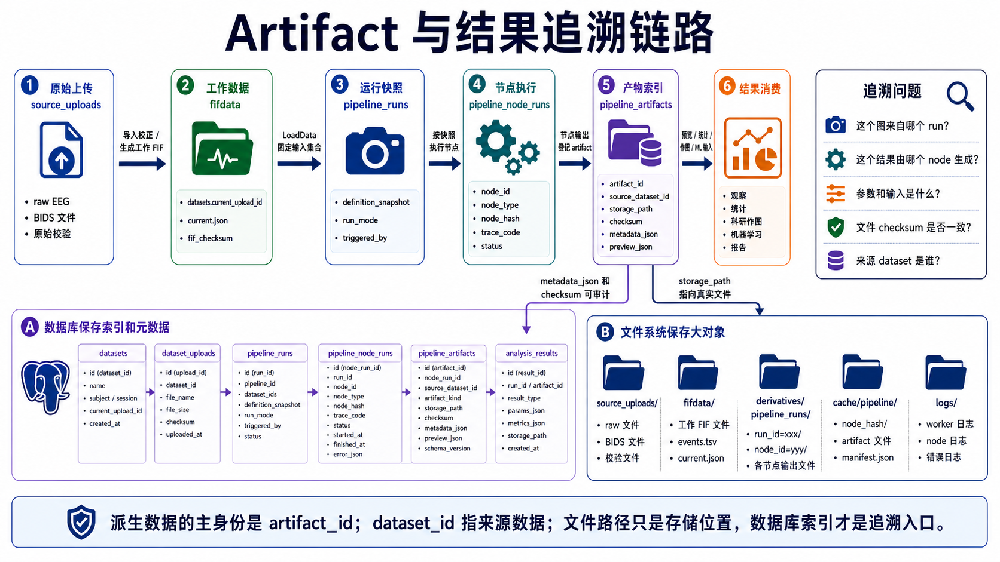

# fifdata 导入校正规则

> 文档性质：工作流专题讨论稿，可随方案讨论随时修改。
> 正式维护口径以 `wiki/docs` 为准；`wiki1` 是旧版文档，只作历史参考，不再作为新版事实源。
> 本目录用于把工作流方案讨论清楚，形成可落地的开发步骤后，再同步到 `wiki/docs` 的对应正式页面。

> 本文严格定义 `fifdata/` 中允许发生的导入校正。  
> 核心原则: `source_uploads/` 保存用户原始上传,不可修改；`fifdata/` 保存系统可处理的 FIF 工作起点,只允许导入校正；`derivatives/` 保存预处理、分析和工作流输出。



## 1. 三层数据边界

| 目录 | 定位 | 是否可改 | 说明 |
|------|------|:--------:|------|
| `source_uploads/` | 原始上传归档 | 否 | 保存用户上传的 BrainVision/EDF/BDF/CNT/MFF/GDF/MAT/HDF5/CSV 等源文件,用于追溯 |
| `fifdata/` | 系统工作起点 | 有条件 | 只允许导入校正,用于把源文件解释为可稳定处理的 MNE/FIF 数据 |
| `derivatives/` | 派生结果 | 是 | 保存滤波、重参考、ICA、去伪迹、Epoch、ERP、PSD、TFR、统计等结果 |

`fifdata/` 不是 BIDS raw,也不是预处理结果目录。它是本系统内部统一工作数据层。

## 2. 导入校正定义

导入校正是指: 为了让原始 EEG 数据能被系统正确识别、显示、选择和进入后续工作流,对通道、单位、定位、事件和导入元数据进行的解释性修正。

导入校正必须满足全部条件:

1. 不改变 EEG 信号的频率内容。
2. 不改变参考方式。
3. 不删除或插值 EEG 数据段。
4. 不进行 ICA、滤波、基线校正、去伪迹。
5. 可以修正信号数值单位,但必须是线性单位换算,并记录原始单位、目标单位和缩放系数。
6. 可以修改事件/trigger,但必须保留原始事件来源和完整审计日志。
7. 每次校正必须可追溯到操作者、时间、原因和修改前后内容。

## 3. fifdata 中允许的导入校正

| 操作 | 是否允许 | 说明 | 必须记录 |
|------|:--------:|------|----------|
| 通道重命名 | 是 | 例如 `FP1` 改为 `Fp1`,`CZ` 改为 `Cz` | `old_name`, `new_name`, 规则或人工原因 |
| 通道类型修正 | 是 | 例如 `MISC` 改为 `EOG`,`EEG` 改为 `ECG` | `channel`, `old_type`, `new_type`, 判断依据 |
| 单位缩放确认 | 是 | 例如 V 转 uV,或错误 header 单位确认 | 原始单位、目标单位、缩放系数、适用通道 |
| montage/定位配置 | 是 | 使用模板 montage 或上传电极坐标 | montage 名称、坐标文件、坐标系、匹配率 |
| trigger/event 增删改 | 是 | 修正 marker 名称、删除错误 marker、补充行为日志事件 | 原始事件、修改后事件、来源、操作者、原因 |
| 坏通道标记 | 是 | 作为导入质控元数据,只标记不插值 | 通道名、判定方式、原因、是否人工确认 |
| 滤波 | 否 | 属于 preprocessing | 写入 `derivatives/` |
| 重参考 | 否 | 属于 preprocessing | 写入 `derivatives/` |
| ICA | 否 | 属于 preprocessing/artefact correction | 写入 `derivatives/` |
| 去伪迹 | 否 | 包括坏段删除、ASR、自动/手动去伪迹 | 写入 `derivatives/` |
| 坏通道插值 | 否 | 已改变数据,不是导入校正 | 写入 `derivatives/` |
| Epoch 分段 | 否 | 属于分析准备/预处理 | 写入 `derivatives/` |
| Baseline correction | 否 | 属于预处理 | 写入 `derivatives/` |
| 重采样 | 否 | 改变采样结构 | 写入 `derivatives/` |

## 4. 各允许操作的严格边界

### 4.1 通道重命名

允许:

- 大小写标准化: `FP1` -> `Fp1`。
- 去除空格或非法字符: `Fz ` -> `Fz`。
- 按已确认 mapping 表修改厂商命名。

不允许:

- 删除通道。
- 合并通道。
- 用数学运算生成新通道。
- 通过重参考生成参考后通道。

记录示例:

```json
{
  "operation": "rename_channels",
  "changes": [
    {"old_name": "FP1", "new_name": "Fp1"},
    {"old_name": "FP2", "new_name": "Fp2"}
  ],
  "reason": "match standard 10-20 channel naming",
  "operator": "user_uuid",
  "created_at": "2026-05-16T10:00:00+08:00"
}
```

### 4.2 通道类型修正

允许修正 MNE channel type:

- `eeg`
- `eog`
- `ecg`
- `emg`
- `stim`
- `misc`

典型场景:

- 眼电通道从 `misc` 修正为 `eog`。
- 心电通道从 `misc` 修正为 `ecg`。
- trigger 通道从 `misc` 修正为 `stim`。

不允许:

- 因后续分析方便而伪造通道类型。
- 将坏 EEG 通道改为 `misc` 以绕开质控。

### 4.3 单位缩放确认

允许:

- 根据文件 header、设备说明或人工确认,将原始读入单位换算为系统标准单位。
- 对不同通道类型分别缩放。

要求:

- 必须记录 `original_unit`。
- 必须记录 `target_unit`。
- 必须记录 `scale_factor`。
- 必须记录依据,例如 header、设备型号、用户确认。

示例:

```json
{
  "operation": "unit_scale",
  "channels": ["Fp1", "Fp2", "Fz"],
  "original_unit": "V",
  "target_unit": "uV",
  "scale_factor": 1000000,
  "evidence": "BrainVision header unit V; system display unit uV",
  "operator": "system"
}
```

不允许:

- 用缩放实现信号归一化。
- z-score、百分比变化、baseline normalize。
- 按通道标准差自动缩放。

### 4.4 montage/定位配置

允许:

- 设置标准 montage,例如 `standard_1020`, `standard_1005`。
- 上传电极坐标文件。
- 保存坐标系、单位和匹配结果。

必须记录:

- montage 来源。
- 坐标文件 checksum。
- 未匹配通道。
- 被忽略的非 EEG 通道。

不允许:

- 因 montage 缺失而删除通道。
- 用插值方式补全数据。

### 4.5 trigger/event 增删改

允许:

- 将厂商 marker code 映射为实验事件名。
- 删除明确错误的重复 trigger。
- 根据行为数据补充缺失事件。
- 修正事件 onset/sample。
- 合并或拆分事件标签,但必须保留来源。

必须保留:

- 原始 events/annotations。
- 修改后的 events。
- event mapping。
- 每条增删改审计日志。

推荐文件:

```text
fifdata/sub-001/ses-01/eeg/
  sub-001_ses-01_task-rest_run-01_eeg.fif
  sub-001_ses-01_task-rest_run-01_events.tsv
  sub-001_ses-01_task-rest_run-01_events_original.tsv
  sub-001_ses-01_task-rest_run-01_event_audit.tsv
  sub-001_ses-01_task-rest_run-01_import_corrections.json
```

`event_audit.tsv` 建议字段:

| 字段 | 说明 |
|------|------|
| `action` | add/delete/update/rename |
| `source_event_id` | 原始事件 ID |
| `old_onset` | 修改前 onset |
| `new_onset` | 修改后 onset |
| `old_value` | 修改前事件值 |
| `new_value` | 修改后事件值 |
| `evidence` | 修改依据 |
| `operator` | 操作者 |
| `created_at` | 时间 |
| `reason` | 原因 |

不允许:

- 无记录地覆盖原始事件。
- 为了得到预期结果而事后选择性删除事件。
- 在 `fifdata/` 中执行 epoch rejection。

### 4.6 坏通道标记

允许:

- 在导入质控中标记坏通道。
- 写入 FIF `info["bads"]`。
- 写入 channels.tsv 的 `status=bad` 和 `status_description`。

不允许:

- 插值坏通道。
- 删除坏通道。
- 自动重参考以“修复”坏通道。

坏通道标记是元数据,不是去伪迹。

## 5. 禁止写入 fifdata 的操作

以下操作必须通过工作流节点执行,输出进入 `derivatives/`:

| 操作 | 原因 |
|------|------|
| 滤波 / 陷波 | 改变频率内容 |
| 重参考 | 改变电位参考关系 |
| ICA compute/apply | 产生去伪迹派生数据 |
| 坏段删除 | 删除时间片段 |
| 坏通道插值 | 生成新通道数据 |
| ASR / SSP / PCA 去伪迹 | 改变信号 |
| Epoch 分段 | 生成分析准备数据 |
| Baseline correction | 改变 epoch 数据 |
| 重采样 | 改变采样结构 |
| ERP/PSD/TFR | 分析结果 |

## 6. fifdata 文件与审计结构

推荐每个 dataset 在 `fifdata/` 中保留如下结构:

```text
fifdata/
  sub-001/
    ses-01/
      eeg/
        sub-001_ses-01_task-rest_run-01_eeg.fif
        sub-001_ses-01_task-rest_run-01_channels.tsv
        sub-001_ses-01_task-rest_run-01_events.tsv
        sub-001_ses-01_task-rest_run-01_events_original.tsv
        sub-001_ses-01_task-rest_run-01_import_corrections.json
        sub-001_ses-01_task-rest_run-01_import_audit.tsv
```

### 6.1 `import_corrections.json`

```json
{
  "schema_version": "1.0",
  "project_id": "202605000001",
  "dataset_id": "uuid",
  "source_upload_id": "uuid",
  "fif_version": 2,
  "source_files": [
    {
      "path": "source_uploads/20260516-101500/sub001.vhdr",
      "checksum": "sha256..."
    }
  ],
  "corrections": [
    {
      "operation": "rename_channels",
      "changes": [{"old_name": "FP1", "new_name": "Fp1"}],
      "operator": "user_uuid",
      "created_at": "2026-05-16T10:00:00+08:00",
      "reason": "match standard naming"
    }
  ],
  "current_files": {
    "fif": "fifdata/sub-001/ses-01/eeg/sub-001_ses-01_task-rest_run-01_eeg.fif",
    "channels": "fifdata/sub-001/ses-01/eeg/sub-001_ses-01_task-rest_run-01_channels.tsv",
    "events": "fifdata/sub-001/ses-01/eeg/sub-001_ses-01_task-rest_run-01_events.tsv"
  }
}
```

### 6.2 `import_audit.tsv`

建议字段:

| 字段 | 说明 |
|------|------|
| `audit_id` | 审计记录 ID |
| `dataset_id` | dataset ID |
| `operation` | 操作类型 |
| `target` | channel/event/montage/unit |
| `before` | 修改前 JSON 字符串 |
| `after` | 修改后 JSON 字符串 |
| `reason` | 修改原因 |
| `evidence` | 依据 |
| `operator` | 操作者 |
| `created_at` | 时间 |

## 7. 数据库字段建议

在现有 `dataset_uploads` / `datasets` 基础上,建议补充或明确:

| 字段 | 表 | 说明 |
|------|----|------|
| `fif_path` | `dataset_uploads` | 当前导入校正后的 FIF 路径 |
| `fif_version` | `dataset_uploads` 或新增表 | FIF 工作数据版本 |
| `import_corrections_json` | 新增 `dataset_import_corrections` | 结构化校正记录 |
| `qa_status` | `dataset_uploads` | imported/corrected/checked/failed |
| `has_import_corrections` | `datasets` | 是否发生过导入校正 |
| `current_upload_id` | `datasets` | 当前生效上传/导入版本 |

推荐新增表:

```sql
CREATE TABLE dataset_import_corrections (
    id              UUID PRIMARY KEY DEFAULT gen_random_uuid(),
    project_id      CHAR(12) NOT NULL REFERENCES projects(id) ON DELETE CASCADE,
    dataset_id      UUID NOT NULL REFERENCES datasets(id) ON DELETE CASCADE,
    upload_id       UUID REFERENCES dataset_uploads(id) ON DELETE SET NULL,
    operation       VARCHAR(64) NOT NULL,
    target          VARCHAR(128),
    before_json     JSONB NOT NULL DEFAULT '{}',
    after_json      JSONB NOT NULL DEFAULT '{}',
    reason          TEXT,
    evidence        TEXT,
    created_by      UUID REFERENCES users(id),
    created_at      TIMESTAMP NOT NULL DEFAULT NOW()
);
```

## 8. 版本策略

导入校正有两种实现策略。

### 8.1 推荐策略: fifdata 版本化

每次导入校正生成新的 `fif_version`,数据库指向当前版本:

```text
fifdata/sub-001/ses-01/eeg/
  v001/sub-001_ses-01_task-rest_run-01_eeg.fif
  v002/sub-001_ses-01_task-rest_run-01_eeg.fif
  current.json
```

优点:

- 易回滚。
- 审计清晰。
- 已运行工作流可继续指向旧版本。

缺点:

- 占用更多磁盘。

不建议依赖软链接表示当前版本,因为 Windows、备份工具和对象存储环境对 symlink 支持不稳定。当前版本以数据库 `datasets.current_upload_id` / `dataset_uploads.fif_path` 为准；文件目录中可额外写 `current.json` 供人工查看。

`current.json` 示例:

```json
{
  "current_version": "v002",
  "dataset_upload_id": "uuid",
  "fif_path": "v002/sub-001_ses-01_task-rest_run-01_eeg.fif",
  "checksum": "sha256..."
}
```

### 8.2 可接受策略: 原地更新 + 审计

如果磁盘有限,可原地更新 `fifdata` 文件,但必须:

- 保留 `source_uploads/` 原始文件。
- 保留完整 `import_corrections.json` 和 `import_audit.tsv`。
- 更新 `fif_checksum`。
- 使依赖旧 checksum 的工作流缓存失效。

## 9. 对工作流缓存的影响

任何导入校正只要改变 `fifdata` 文件或关键 sidecar,都必须改变 dataset hash。

参与 hash 的内容:

- `source_upload_id`
- `fif_version`
- `fif_checksum`
- `channels.tsv` checksum
- `events.tsv` checksum
- `import_corrections.json` checksum

因此:

- 通道重命名后,下游工作流缓存失效。
- trigger 修改后,Epoch/ERP 下游缓存失效。
- 坏通道标记后,依赖 bads 的节点缓存失效。
- montage 修改后,topomap/source 等依赖定位的节点缓存失效。

## 10. UI 操作约束

导入校正应发生在数据导入/数据管理模块,而不是工作流预处理模块。

前端建议:

| 页面 | 能力 |
|------|------|
| 数据导入向导 | 初次设置单位、通道类型、montage、event mapping |
| 数据详情页 | 查看和追加导入校正 |
| 工作流编辑器 | 只读取校正后的 `fifdata`,不能修改导入校正 |
| 预处理交互页 | 可以标记坏段/ICA/插值,但输出必须进入 `derivatives/` |

如果用户在工作流中发现通道名或 trigger 错误,应提供“返回导入校正”入口,而不是在工作流节点中直接改写 `fifdata/`。

## 11. 判定准则

遇到不确定操作时,按以下问题判断:

1. 这个操作是否改变信号频率内容? 如果是,进入 `derivatives/`。
2. 是否改变参考方式? 如果是,进入 `derivatives/`。
3. 是否删除、插值、重构数据? 如果是,进入 `derivatives/`。
4. 是否只是修正系统对原始数据的解释? 如果是,可作为导入校正进入 `fifdata/`。
5. 是否有完整审计和原始来源? 如果没有,不得写入 `fifdata/`。

一句话规则:

> `fifdata/` 可以修正“这份原始数据是什么、单位是什么、通道是什么、事件是什么、位置是什么”；不能保存“我已经怎样处理过这份数据”。
