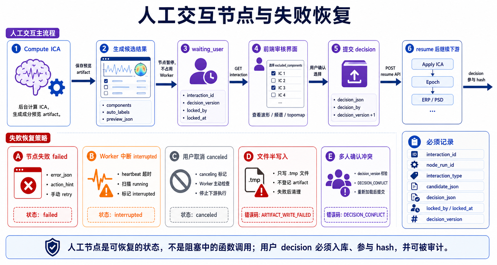

# 工作流文档合理性审阅与进一步细化

> 文档性质：工作流专题讨论稿，可随方案讨论随时修改。
> 正式维护口径以 `wiki/docs` 为准；`wiki1` 是旧版文档，只作历史参考，不再作为新版事实源。
> 本目录用于把工作流方案讨论清楚，形成可落地的开发步骤后，再同步到 `wiki/docs` 的对应正式页面。

> 本文是对 `2_meeting260516` 工作流专题文档的可实现性审阅。结论: 现有方案总体合理,方向适合本项目,但需要补充若干工程细节,否则实现时容易在数据边界、状态机、缓存、版本和人工交互上产生歧义。



## 1. 总体评价

现有文档的核心设计是正确的:

1. `source_uploads/`、`fifdata/`、`derivatives/` 三层边界清楚。
2. 工作流采用 LiteGraph + NodeSpec 是合理的,旧 Niantong 已验证可行。
3. 后端统一 `PipelineExecutor` 比旧项目“前端逐节点请求 endpoint”更适合多人协作、审计和异步任务。
4. `data_infos`、`traceCode`、`node_hash` 是应保留的关键思想。
5. Phase 1 不做科研出图,Phase 2 再接 `SendToFigure`,范围控制合理。

需要进一步钉牢的是: 可执行细节、状态迁移、并发锁、输出文件原子写入、人工节点 resume、缓存失效、`fifdata` 版本化和数据库字段。

## 2. 已发现的主要问题

| 问题 | 影响 | 建议 |
|------|------|------|
| `P1` 同时可能被理解为 Phase 1 或 Priority 1 | 产品/研发沟通容易混淆 | 阶段统一写 `Phase 1/2/3`,优先级才写 `P0/P1/P2` |
| `data_infos.dataset_id` 在派生结果中语义不清 | 不知道指原始 dataset 还是派生 artifact | 原始数据用 `dataset_id`;派生数据必须用 `source_dataset_id` + `artifact_id` |
| `save_output` 不参与 hash 但影响是否有文件 | 缓存命中后可能没有用户期待的持久化文件 | `save_output` 不影响计算 hash,但影响 artifact persistence plan |
| `fifdata/current -> v002` 类软链接写法不适合 Windows | Windows 部署和备份可能出问题 | 使用数据库 current pointer 或 `current.json`,不依赖 symlink |
| 人工交互节点只写了概念 | resume、decision 版本、超时、多人编辑冲突未定义 | 增加 `interaction_token`、decision lock、resume 状态机 |
| 缓存文件写入未说明原子性 | 运行中断可能留下半文件,下次误命中 | 必须先写 `.tmp`,校验 checksum 后 rename |
| 并发执行未说明锁 | 两个用户同时运行可能写同一 artifact/cache | 需要 project/run/node/cache 级锁策略 |
| 导入校正改变 `fifdata` 后缓存失效规则需更细 | trigger/通道/montage 改动影响不同下游 | dataset hash 应包含 fif、channels、events、montage、corrections checksum |
| NodeSpec schema 未给必需校验项 | 新节点可能不符合执行器约定 | 需要定义 schema 校验规则和错误码 |
| 错误恢复策略不够细 | 某个 subject 失败后整批是否停止不清楚 | 节点和 dataset 两级失败策略分开 |

## 3. 必须新增的工程决策

### 3.1 阶段与优先级命名

全项目统一:

| 写法 | 含义 |
|------|------|
| `Phase 1` | 落地阶段 MVP |
| `Phase 2` | 增强阶段 |
| `Phase 3` | AI/ML 阶段 |
| `P0` | 最高实现优先级 |
| `P1` | 次级实现优先级 |
| `P2` | 后续实现优先级 |

需求表格中的“落地阶段”不得写 `P1/P2`,必须写 `Phase 1/Phase 2`。

### 3.2 `data_infos` 语义

`data_infos` 中必须区分“原始工作数据”和“派生输出”。

| 字段 | 原始/导入工作数据 | 派生输出 |
|------|------------------|----------|
| `dataset_id` | 必填,指 `datasets.id` | 可保留为来源 dataset,但不作为派生主键 |
| `source_dataset_id` | 可等于 `dataset_id` | 必填,指最初来源 dataset |
| `artifact_id` | 可空 | 必填,指 `pipeline_artifacts.id` |
| `artifact_kind` | `fifdata` | `preprocessed`, `epochs`, `evoked`, `psd`, `tfr` |
| `file_path` | `fifdata/...` | `derivatives/...` |

派生数据的主身份是 `artifact_id`,不是 `dataset_id`。

### 3.3 `save_output` 与 hash

`save_output` 不参与计算结果 hash,因为它不改变信号内容。但它影响输出持久化,因此需要单独记录:

```json
{
  "compute_hash": "sha256-content",
  "persistence_policy": {
    "save_output": true,
    "save_to_analysis_results": false,
    "retention": "run_artifact"
  }
}
```

规则:

1. `save_output=false`: 可生成临时 cache artifact,不保证长期保留。
2. `save_output=true`: 必须生成 `pipeline_artifacts` 记录。
3. `SaveResult` 节点: 必须写入 `analysis_results`。
4. 如果计算缓存命中但缺少用户要求的持久化 artifact,可以不重算,但必须从缓存复制/注册一个新的 artifact。

### 3.4 `fifdata` current 版本

不使用软链接作为规范写法。推荐:

```text
fifdata/sub-001/ses-01/eeg/
  v001/
  v002/
  current.json
```

`current.json`:

```json
{
  "current_version": "v002",
  "dataset_upload_id": "uuid",
  "fif_path": "v002/sub-001_ses-01_task-rest_run-01_eeg.fif",
  "checksum": "sha256..."
}
```

数据库中的 `dataset_uploads.fif_path` 或 `datasets.current_upload_id` 是最终准绳。

## 4. 状态机补充

### 4.1 PipelineRun 状态

| 状态 | 含义 | 可进入 |
|------|------|--------|
| `created` | run 记录已创建 | `queued`, `failed` |
| `queued` | 等待 worker | `running`, `canceled` |
| `running` | 正在执行 | `waiting_user`, `success`, `failed`, `canceled` |
| `waiting_user` | 至少一个节点等待人工确认 | `running`, `canceled`, `failed` |
| `success` | 全部完成 | 终态 |
| `partial_success` | 部分 dataset 失败但策略允许继续 | 终态 |
| `failed` | 失败停止 | 终态 |
| `canceled` | 用户取消 | 终态 |

### 4.2 NodeRun 状态

| 状态 | 含义 |
|------|------|
| `pending` | 已创建,等待上游 |
| `blocked` | 上游失败或缺失 |
| `queued` | 可运行,等待 worker |
| `running` | 正在执行 |
| `cached` | 缓存命中 |
| `success` | 执行成功 |
| `waiting_user` | 等待人工确认 |
| `skipped` | 按条件跳过 |
| `failed` | 执行失败 |
| `canceled` | 被取消 |

状态迁移必须写入 `pipeline_node_runs.status_history` 或日志。

## 5. 并发与锁

必须定义四类锁:

| 锁 | 粒度 | 目的 |
|----|------|------|
| project run lock | project_id | 限制同项目并发工作流数量 |
| pipeline edit lock | pipeline_id | 避免多人同时保存覆盖 |
| node artifact lock | pipeline_run_id + node_id | 避免同一节点重复写输出 |
| cache write lock | node_hash | 避免多个 run 同时写同一缓存 |

推荐实现:

- PostgreSQL advisory lock 用于短锁。
- DB 字段 `locked_by`, `locked_at` 用于编辑锁。
- 文件写入使用 `.lock` 文件或 DB cache row 状态。

## 6. Artifact 原子写入

任何输出文件必须按以下顺序写入:

1. 写入临时目录或 `.tmp` 文件。
2. 计算 checksum。
3. 写 sidecar metadata。
4. rename/move 到最终路径。
5. 写入数据库 `pipeline_artifacts`。
6. 更新 node_run output_data_infos。

如果中途失败:

- 删除 `.tmp`。
- node_run 标记 failed。
- 不得生成可命中的 cache entry。

## 7. 人工交互节点补充

人工节点必须有 decision 版本和锁。

```json
{
  "interaction_id": "uuid",
  "node_run_id": "uuid",
  "status": "waiting_user",
  "interaction_type": "ica_component_review",
  "candidate_json": {
    "components": [0, 1, 2],
    "auto_labels": {"0": "blink"}
  },
  "decision_json": null,
  "locked_by": "user_uuid",
  "locked_at": "2026-05-16T10:00:00+08:00",
  "decision_version": 0
}
```

用户提交 decision 后:

1. 校验 `decision_version` 未过期。
2. 写入 decision。
3. node_run 从 `waiting_user` 变为 `queued/running`。
4. 继续执行当前节点的 apply 阶段或下游节点。

## 8. 缓存失效补充

以下情况必须失效:

| 变化 | 失效范围 |
|------|----------|
| `fif_checksum` 变化 | 所有下游 |
| `channels.tsv` 变化 | 通道相关节点及下游 |
| `events.tsv` 变化 | Epoch/ERP/TFR event-locked 分析及下游 |
| montage 变化 | topomap/source/connectivity 中依赖空间信息的节点 |
| NodeSpec major version 变化 | 该节点及下游 |
| engine version 影响结果 | 对应节点及下游 |
| 人工 decision 变化 | decision 节点及下游 |

缓存命中不能只看 `node_hash`,还要检查 artifact 文件存在、checksum 一致、schema 兼容。

## 9. NodeSpec schema 必需校验

新增节点必须通过:

| 校验项 | 规则 |
|--------|------|
| `type` 唯一 | 全局唯一,推荐 `eeg/domain/name` |
| `phase` 合法 | `phase1/phase2/phase3` |
| `inputs/outputs` type 合法 | 必须来自端口类型枚举 |
| `properties.name` 唯一 | 同一节点内唯一 |
| `properties.hash` 明确 | 默认 true,UI/persistence 参数显式 false |
| `backend.module/function` 可导入 | 后端启动时检查 |
| `backend.output_kind` 合法 | fif/hdf5/json/table |
| `cache.strategy` 合法 | content_hash/no_cache |
| `ui.preview_type` 合法 | time_series/erp/psd/tfr/ica/table |

## 10. 错误码建议

| 错误码 | 含义 |
|--------|------|
| `PIPELINE_CYCLE` | DAG 含环 |
| `PORT_TYPE_MISMATCH` | 端口类型不兼容 |
| `PARAM_REQUIRED` | 必填参数缺失 |
| `PARAM_RANGE_INVALID` | 参数范围错误 |
| `DATASET_NOT_FOUND` | 数据集不存在或无权限 |
| `UPSTREAM_MISSING` | 上游输出缺失 |
| `CACHE_FILE_MISSING` | 缓存 metadata 命中但文件缺失 |
| `ARTIFACT_WRITE_FAILED` | 输出文件写入失败 |
| `INTERACTION_REQUIRED` | 节点等待人工确认 |
| `DECISION_CONFLICT` | 人工决策版本冲突 |
| `RUN_CANCELED` | 用户取消 |

错误响应必须包含 `node_id`, `node_type`, `message`, `action_hint`。

## 11. 仍需后续确认的问题

| 问题 | 建议默认值 |
|------|------------|
| Phase 1 是否必须包含 TFR | ERP 必须,TFR 可放 Phase 1 后半段或 Phase 2 |
| 是否允许工作流编辑器触发导入校正 | 不允许,只提供跳转入口 |
| 是否保留 `dataset_derivatives` | 可以保留作为兼容层,但新工作流统一用 `pipeline_artifacts` |
| cache 是否跨项目复用 | Phase 1 不跨项目,避免权限和隐私问题 |
| 工作流模板是否可全局共享 | Phase 1 只内置模板,Phase 2 做团队模板 |

## 12. 结论

现有文档可以作为研发基础,但必须把本文中的补充规则回写到正式 wiki 或实现任务中。尤其是这六点必须先定:

1. `data_infos` 中派生数据用 `artifact_id` 做主身份。
2. `save_output` 不参与计算 hash,但影响持久化计划。
3. `fifdata` 版本不依赖软链接,用 DB current pointer 或 `current.json`。
4. 所有 artifact 写入必须原子化。
5. 人工节点必须有 decision lock 和 decision version。
6. 缓存命中必须校验文件存在和 checksum。

## 13. 2026-05-17 补充：最新审阅结论

> 本节把最新审阅结论固定下来，避免文档和当前代码脱节。

### 13.1 目前最重要的不一致

- 文档原先讨论了完整 `PipelineExecutor`、缓存和 artifact，但当前 `elys_version1` 只做到了工作流编辑、保存、校验和 LoadData 预运行。
- 旧版 Niantong 的执行逻辑偏前端驱动，新版应改成后端驱动。文档中凡是“前端直接逐节点调用处理接口”的描述，都只能作为旧版参考，不作为新版目标架构。
- 当前数据库已有 `dataset_derivatives` 和 `analysis_results`，但工作流执行器尚未写入；不能在说明中写成已经形成结果闭环。

### 13.2 下一次开发前必须确认

1. 后台任务用 Celery + Redis，还是先用 FastAPI BackgroundTasks 做 MVP。
2. `pipeline_artifacts` 是独立新表，还是先复用 `dataset_derivatives` 和 `analysis_results`。建议独立新表，再按类型同步写入后两者。
3. 第一条真实链路是否固定为 `LoadData -> FIR Filter -> Epoch -> ERP Average -> Save Result`。
4. 前端运行进度第一阶段用轮询，还是直接上 SSE。建议先轮询。
5. 是否把 `PipelinePage.vue` 拆分为组件。建议在后端执行器稳定后再拆，避免同时大改。
