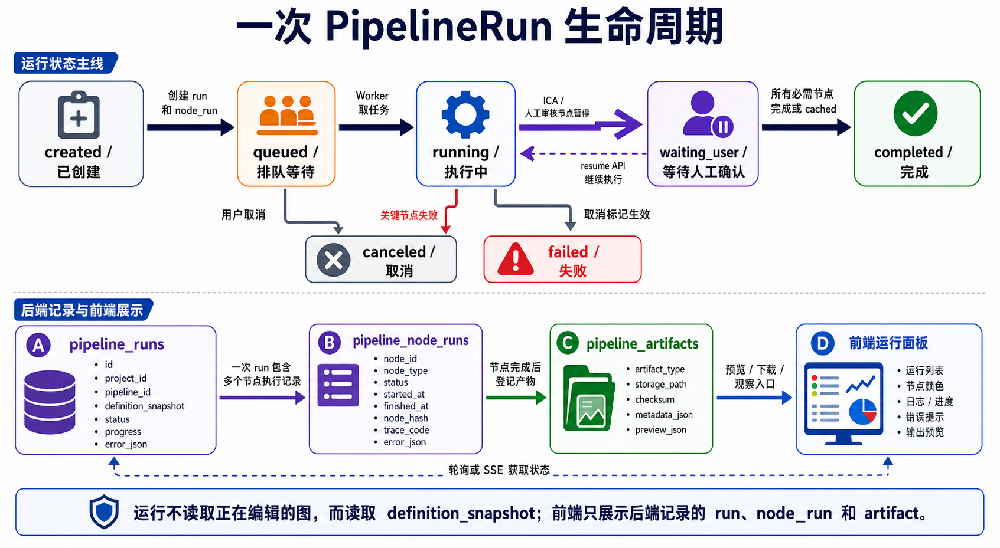

# 工作流当前进度与开发路线

> 文档性质：工作流专题讨论稿，可随方案讨论随时修改。  
> 正式维护口径以 `wiki/docs` 为准；`wiki1` 是旧版文档，只作历史参考，不再作为新版事实源。  
> 本目录用于把工作流方案讨论清楚，形成可落地的开发步骤后，再同步到 `wiki/docs` 的对应正式页面。

> 日期：2026-05-17  
> 目标：基于 `elys_version1` 当前代码、旧版 `Niantong-eeg-analysis-app-https-1.0.0`、正式 `wiki/docs` 与本目录工作流讨论稿，重新评估工作流模块当前进度，并给出可在 Codex 中分步执行的开发路线。  
> 事实源优先级：`elys_version1` 当前代码 > `wiki/docs` 正式文档 > `2_meeting260516` 讨论稿 > 旧版 `Niantong-eeg-analysis-app-https-1.0.0` 参考实现。  
> 路径约定：当前代码位置默认省略 `elys_version1/` 前缀；旧版参考会明确写出旧项目目录。



## 0. 一句话结论

`elys_version1` 已经具备“工作流编辑器、NodeSpec 节点库、工作流保存、后端校验、LoadData 数据解析、节点级运行记录、第一条 EEG 分析链路、前端节点状态展示、Celery 投递入口、第一版节点级缓存、ICA 人工交互节点第一版、artifact 轻量预览入口”的基础闭环，但更多分析节点、artifact download、观察页深度渲染、取消/恢复/重试还没有完成。

下一步不要优先大拆 UI，也不要直接照搬旧版前端执行器。当前已补齐 `pipeline_node_runs`、`pipeline_artifacts` 数据结构、`PipelineExecutor`、`NodeDispatcher`、`ArtifactStore` 基础、run detail 查询、最小 MNE IO、三类预处理节点、`LoadData -> FIR -> Epoch -> ERP -> Save Result` 第一条真实分析链路、`PipelinePage.vue` 的节点级运行状态展示、`/run` 的 Celery + Redis 投递入口、基于 `node_hash` 的 artifact 复用缓存、ICA waiting/decision/resume 第一版，以及 raw/epochs/evoked artifact preview 第一版；后续重点转向 artifact download、观察页深度联动，以及 worker 恢复/取消/重试。

详细 Codex 分步提示词见：`13-工作流Codex分步开发提示词.md`。

## 1. 当前代码重新评估

### 1.1 已完成

| 层面 | 当前状态 | 代码位置 |
| --- | --- | --- |
| 项目与权限基础 | 已有用户、角色、项目、成员、数据集等基础结构 | `backend/app/models/*.py`、`backend/app/routers/*.py` |
| 数据导入 | 已支持导入 EDF/BDF/BrainVision 等并生成 FIF 工作数据 | `backend/app/routers/datasets.py` |
| Pipeline 页面 | 已接入 `/pipeline`，包含项目选择、工作流选择、节点库、LiteGraph 画布、属性面板、保存、校验、运行；运行后可轮询后端 run/node/artifact 状态，画布节点和底部面板展示真实 node_run 结果 | `frontend/elys-web/src/views/PipelinePage.vue` |
| 前端 API | pipeline CRUD、validate、run、runs、LoadData resolve、run detail、node_runs、artifacts 查询已封装 | `frontend/elys-web/src/api/pipelines.ts` |
| 前端类型 | NodeSpec、PipelineDefinition、PipelineRun、PipelineRunDetail、PipelineNodeRun、PipelineArtifact、LoadDataDataInfo 等已定义 | `frontend/elys-web/src/types/index.ts` |
| NodeSpec | 10 个 phase1 节点 JSON 已注册 | `backend/app/pipeline/nodes/*.json` |
| NodeRegistry | 可读取和校验节点 JSON，提供 `/pipeline/nodes` | `backend/app/pipeline/registry.py` |
| 工作流定义 | `pipeline_definitions` 可保存图结构、版本、状态、模板标记 | `backend/app/models/project.py`、`database/init.sql` |
| 工作流校验 | 已拆到独立 validator，检查节点、端口、必填输入、参数、环路，并对 LoadData 做真实数据解析 | `backend/app/pipeline/validator.py`、`backend/app/routers/pipelines.py` |
| 工作流运行 | `POST /run` 会创建 `pipeline_runs`、保存 snapshot、预创建 `pipeline_node_runs` 后以 `queued` 尽快返回；随后投递 Celery `run_pipeline_task` 到 `workflow.default`，worker 内重新获取 DB session 后调用 `PipelineExecutor` 执行，当前真实执行 LoadData、FIR、Resample、Re-reference、ICA Compute/Apply、Epoch、ERP、Save Result；Apply ICA 可进入 `waiting_user_input`，未实现节点会写失败 | `backend/app/routers/pipelines.py`、`backend/app/tasks/*.py`、`backend/app/pipeline/background.py`、`backend/app/pipeline/executor.py`、`backend/app/pipeline/dispatcher.py` |
| 节点运行与产物数据结构 | 已新增 `pipeline_node_runs`、`pipeline_artifacts`、ORM model、Pydantic response schema 和 schema compatibility；`PipelineExecutor` 已写入 node_run，预处理和分析节点已能通过 ArtifactStore 写 artifact | `database/init.sql`、`backend/app/models/project.py`、`backend/app/schemas/pipeline.py`、`backend/app/services/schema_compat.py` |
| ArtifactStore 与输出契约 | 已新增 `NodeInput`、`NodeOutput`、`NodeExecutionContext` 和 `ArtifactStore` 基础设施；支持 JSON metadata、普通文件/目录发布、sha256、原子发布和 `PipelineArtifact` 登记；已接入 FIR/Resample/Re-reference/Epoch/ERP 输出 | `backend/app/pipeline/contracts.py`、`backend/app/pipeline/artifacts.py` |
| Run detail 查询 | 已新增 run detail、node_run 列表、artifact 列表查询 API；空 node/artifact 返回空数组 | `backend/app/routers/pipelines.py` |
| Artifact preview | 已新增单 artifact preview API，支持 raw/epochs/evoked 轻量摘要、文件缺失和 checksum 错误；`PipelinePage.vue` 可从选中节点 artifact 打开 preview，并保留观察页 route/query | `backend/app/pipeline/previews.py`、`backend/app/routers/pipelines.py`、`frontend/elys-web/src/views/PipelinePage.vue` |
| LoadData | 支持 filter 和 explicit 两种模式，返回真实 `data_infos` | `backend/app/pipeline/load_data.py` |
| MNE IO 基础 | 已新增文件驱动 MNE IO 和 synthetic Raw 工具，支持 Raw/Epochs/Evoked metadata 摘要和 FIF 保存 | `backend/app/engine/io.py`、`backend/app/engine/testing.py` |
| 预处理节点 | FIR、Resample、Re-reference 已接入 dispatcher，输入来自上游 `data_infos`，输出写入 pipeline artifact 并返回派生 `data_infos` | `backend/app/engine/preprocess/*.py`、`backend/app/pipeline/dispatcher.py` |
| 分析闭环 | Epoch、ERP Average、Save Result 已接入 dispatcher，Epochs/Evoked 写 artifact，Save Result 登记 `analysis_results` 并保留 artifact/run/node_run 追溯 | `backend/app/engine/analysis/*.py`、`backend/app/pipeline/output.py`、`backend/app/models/project.py` |
| 前端节点运行状态 | 已在运行后保存 run_id，并用 run detail、node_run、artifact 查询结果驱动画布节点颜色、底部运行面板和右侧选中节点摘要 | `frontend/elys-web/src/views/PipelinePage.vue` |
| 节点级缓存 | 已实现第一版 hash/artifact 缓存：执行前计算 `params_hash/input_hash/node_hash/trace_code`，按 `node_hash` 查历史 artifact，校验文件和 checksum，命中时当前 node_run 写 `cached` 并登记本次 run 的 artifact 引用 | `backend/app/pipeline/hash.py`、`backend/app/pipeline/cache.py`、`backend/app/pipeline/executor.py` |

当前 10 个 NodeSpec：

| 节点 | 类型 | 当前成熟度 |
| --- | --- | --- |
| LoadData | `eeg/data/load` | 解析已实现，作为执行输入可用 |
| FIR Filter | `eeg/filter/fir` | 已实现：读取上游 Raw FIF，输出滤波后的派生 Raw FIF artifact |
| Butterworth Filter | `eeg/filter/butterworth` | 只有 spec，执行器未实现 |
| Resample | `eeg/preproc/resample` | 已实现：读取上游 Raw FIF，输出重采样后的派生 Raw FIF artifact |
| Re-reference | `eeg/preproc/rereference` | 已实现：支持 average / selected channels，输出派生 Raw FIF artifact |
| Compute ICA | `eeg/ica/compute` | 已实现第一版：读取 Raw、拟合 ICA、保存 ICA artifact、生成组件预览 metadata |
| Apply ICA | `eeg/ica/apply` | 已实现第一版：无 decision 时进入 `waiting_user_input`，提交 decision 后 resume 输出 cleaned Raw artifact |
| Epoch | `eeg/epoch/segment` | 已实现：按 annotation event 切分 Epochs，事件缺失时节点失败 |
| ERP Average | `eeg/analysis/erp` | 已实现：从 Epochs 按 condition 平均生成 Evoked/ERP artifact |
| Save Result | `eeg/output/save_result` | 已实现：把上游 analysis artifact 登记到 `analysis_results`，保留追溯 |

### 1.2 未完成

| 缺口 | 影响 | 优先级 |
| --- | --- | --- |
| 普通 EEG engine 模块未完整实现 | `engine.preprocess`、`engine.analysis` 和 `engine.ica` 已有最小链路；Butterworth、PSD/TFR 等模块尚未实现 | P0 |
| 普通 EEG 节点执行器未完整实现 | Butterworth、PSD/TFR 等还不能跑 | P0 |
| 普通 EEG 节点 node_run 仍有未实现失败 | 已能为每个图节点写 `pipeline_node_runs`；除 LoadData、三类预处理、ICA Compute/Apply、Epoch、ERP、Save Result 外，其它节点仍为 `PIPELINE_NODE_EXECUTOR_NOT_IMPLEMENTED` | P0 |
| artifact 执行器接入未完整实现 | 预处理和 Epoch/ERP 已能登记 `pipeline_artifacts`；raw/epochs/evoked preview 已接入，download、restore 和更多分析类型尚未接入 | P0 |
| 后台队列增强尚未完成 | `/run` 已接入 Celery + Redis 投递入口，不再由请求同步等待完整执行；但真实消费需要 Redis/worker 运行，worker 恢复、取消和重试仍未实现 | P0 |
| 缓存与增量执行待增强 | 第一版 node_hash/artifact 复用已实现；缓存统计、手动失效、run-from、partial policy 尚未实现 | P1 |
| 人工交互节点待增强 | ICA Compute/Apply 的 waiting/decision/resume 第一版已实现；独立 interaction 表、通知、锁定和 resume 队列化仍待增强 | P1 |
| Artifact download 未实现 | 可查询 artifact 索引并打开 raw/epochs/evoked 轻量 preview，但还不能下载节点输出文件，观察页也尚未根据 artifact query 做真实渲染 | P1 |
| PipelinePage 是单文件大组件 | 后续维护会变重，但不是第一优先级 | P2 |

### 1.3 2026-05-17 Step 0 实际审计快照

> 本节来自 Step 1 之前对 `elys_version1` 当前代码的只读审计，作为开发前基线。审计过程未修改代码、未重构、未改 UI，也未引入 Celery。Step 1 的落地结果见下一节。

当前已经实现的能力：

| 范围 | 已实现内容 | 代码位置 |
| --- | --- | --- |
| Pipeline API | 已有节点库、CRUD、validate、run、run list、LoadData resolve 接口 | `backend/app/routers/pipelines.py` |
| validate | 已检查 graph/nodes/links 结构、节点类型、必填参数、端口存在、端口类型兼容、必需输入和 DAG 环路；LoadData 会做真实数据解析 | `backend/app/routers/pipelines.py` |
| run | 会创建 `pipeline_runs`，保存 `definition_snapshot`，同步调用当前内联运行逻辑 | `backend/app/routers/pipelines.py` |
| LoadData | 支持 `filter` 和 `explicit` 两种选择方式，返回 `data_infos`、缺失 dataset、errors/warnings | `backend/app/pipeline/load_data.py` |
| NodeSpec | 10 个 phase1 节点 JSON 可由 registry 加载；只有 `eeg/data/load` 有真实执行能力 | `backend/app/pipeline/nodes/*.json` |
| Schema/Model | 已有 `PipelineDefinition`、`PipelineRun`、Pipeline CRUD/Run/LoadData 相关 Pydantic schema | `backend/app/models/project.py`、`backend/app/schemas/pipeline.py` |
| Database | 已有 `pipeline_definitions`、`pipeline_runs`、`dataset_derivatives`、`analysis_results` | `database/init.sql` |
| Schema compat | 启动时可幂等补 `pipeline_runs` 和 `pipeline_definitions` 的 `version/is_template/status` | `backend/app/services/schema_compat.py` |
| Frontend | `PipelinePage.vue` 可编辑 LiteGraph、保存、校验、运行，并预览 LoadData 后端解析结果 | `frontend/elys-web/src/views/PipelinePage.vue` |

当前缺失的能力：

| 缺失项 | 当前影响 |
| --- | --- |
| `PipelineExecutor` 完整执行能力 | 已有 executor 骨架、第一条真实链路、后台投递入口、缓存恢复和 ICA 人工等待/恢复；更多分析节点、取消、重试仍待补 |
| 普通节点执行器 | LoadData、FIR、Resample、Re-reference、ICA Compute/Apply、Epoch、ERP、Save Result 已有真实 executor；Butterworth、PSD/TFR 等仍未实现 |
| node_run 完整语义 | `/run` 已创建节点级记录，支持 success/failed/cached/waiting_user_input；重试、取消、partial policy 等状态语义尚未完整实现 |
| artifact 实际运行写入 | 预处理和 Epoch/ERP 已登记 `pipeline_artifacts`；raw/epochs/evoked preview 已实现，download、restore 和更多分析类型仍未实现 |
| 前端 artifact 详情入口 | `PipelinePage.vue` 已能从选中节点 artifact 打开 preview，并保留观察页 query；download 和观察页真实渲染仍未实现 |
| artifact lineage | `analysis_results` 已补 `run_id/node_run_id/artifact_id` 追溯；`dataset_derivatives` 等其它出口仍需继续对齐 |
| 后台执行 | `/run` 已从 FastAPI BackgroundTasks 过渡为 Celery task 投递；真实消费依赖 Redis 服务和 worker 进程 |
| 前端实时进度 | 画布节点已绑定后端 node_run 状态；`queued/running/success/failed` 可由轮询看到，真实效果取决于任务耗时和本地服务环境 |
| 缓存与增量执行 | 已实现第一版：执行节点前检查 `node_hash`，命中历史 artifact 时写本次 `node_run.status=cached`；完整连续 pipeline E2E 尚未在本机验证 |

当前 `/run` 的明确边界：

- `POST /projects/{project_id}/pipelines/{pipeline_id}/run` 会创建一条 `pipeline_runs`，保存 `definition_snapshot`，预创建拓扑顺序里的 `pipeline_node_runs`，然后以 `run.status=queued` 返回。
- `/run` 通过 `run_pipeline_task.apply_async()` 向 `workflow.default` 投递 Celery 任务；`pipeline_runs.result_json` 记录 `celery_task_id` 和 `task_queue`。
- Worker 内通过 `backend/app/tasks/pipeline_tasks.py` 重新打开 DB session，再调用可测试的 `execute_pipeline_run_sync()` / `PipelineExecutor.execute_prepared_run()`。
- 执行开始后 `run.status=running`，节点执行时 `node_run.status=running`，节点完成后写 `success/failed`、`output_json/error_json/duration_ms`。
- 当前真实执行 LoadData、FIR、Resample、Re-reference、ICA Compute/Apply、Epoch、ERP、Save Result；Apply ICA 可进入 `waiting_user_input`；其它节点仍统一写入 `PIPELINE_NODE_EXECUTOR_NOT_IMPLEMENTED`，并导致本次 run 失败。
- 后台任务异常会写入 `run.error_json`，并尽量写入当前 running/pending 的对应 `node_run.error_json`。
- `result_json.mode` 当前为 `celery`，并继续保留 `node_results` 和 `data_infos_by_node` 兼容前端。

Step 0 基线中，后续新增 `pipeline_node_runs`、`pipeline_artifacts`、`PipelineExecutor` 的影响范围：

| 范围 | 需要调整 |
| --- | --- |
| 数据库 | `database/init.sql`、`backend/app/services/schema_compat.py` 增加表、索引、外键和幂等兼容逻辑 |
| ORM | `backend/app/models/project.py` 增加 `PipelineNodeRun`、`PipelineArtifact` 及与 run/project/pipeline 的关系 |
| Schema | `backend/app/schemas/pipeline.py` 增加 `PipelineNodeRunResponse`、`PipelineArtifactResponse`、`PipelineRunDetailResponse` |
| Router | `backend/app/routers/pipelines.py` 保留 API 编排，把校验、拓扑、执行逐步委托给 pipeline service/executor |
| Pipeline 包 | 新增或拆分 `validator.py`、`executor.py`、`dispatcher.py`、`artifacts.py`、`contracts.py/hash.py` |
| LoadData | `resolve_load_data_selection()` 继续作为 LoadData executor 的底层能力，但输出要逐步落入 node_run/artifact/port output |
| NodeSpec | `backend.module/function` 要和真实 executor/dispatcher 对齐，避免 JSON 声明指向不存在模块 |
| Frontend API/types | `src/api/pipelines.ts`、`src/types/index.ts` 增加 run detail、node runs、artifacts 查询类型 |
| Frontend UI | `PipelinePage.vue` 后续最小接入节点状态和 artifact 入口，不建议先大拆 UI |

本次实际运行的检查：

| 检查 | 结果 |
| --- | --- |
| `rg` 检索 pipeline 相关引用 | 已执行；Step 0 基线时确认尚无 `pipeline_node_runs`、`pipeline_artifacts`、`PipelineExecutor` 实现 |
| Python AST 语法检查 | 通过：`pipelines.py`、`pipeline.py`、`project.py`、`load_data.py`、`schema_compat.py` |
| NodeRegistry 加载 | 通过：成功加载 10 个 NodeSpec |
| 后端 import smoke test | 未完成：当前本机 Python 环境缺少 `fastapi` |
| 前端 `vue-tsc --noEmit` | 未完成：`frontend/elys-web` 当前缺少 `tsconfig.json`，命令退回 TypeScript 帮助/配置缺失 |
| git 状态 | 当前目录和 `elys_version1` 都不是 git 工作区，无法用 `git status` 做变更核对 |

### 1.4 2026-05-17 Step 1 落地记录

本次已完成“新增节点级运行表和 artifact 表”的数据结构层改造，范围严格限制在数据库、ORM、schema 和 schema compatibility，不实现执行器，不改前端 UI。

落地内容：

| 文件 | 变更 |
| --- | --- |
| `database/init.sql` | 新增 `pipeline_node_runs`、`pipeline_artifacts`，并补充 `run_id/topo_index`、`project_id/status`、`run_id`、`node_run_id`、`project_id/artifact_type` 索引 |
| `backend/app/models/project.py` | 新增 `PipelineNodeRun`、`PipelineArtifact` SQLAlchemy model，并给 `PipelineRun` 增加 `node_runs`、`artifacts` 关系 |
| `backend/app/models/__init__.py` | 导出 `PipelineNodeRun`、`PipelineArtifact` |
| `backend/app/schemas/pipeline.py` | 新增 `PipelineNodeRunResponse`、`PipelineArtifactResponse`、`PipelineRunDetailResponse`、列表 response |
| `backend/app/schemas/__init__.py` | 导出新增 pipeline schema |
| `backend/app/services/schema_compat.py` | 在没有 Alembic 的情况下幂等创建新表和索引 |

当时保留边界（Step 7 已补齐其中的 FIR/Resample/Re-reference）：

- 现有 `pipeline_definitions`、`pipeline_runs` API 行为不变。
- `POST /run` 仍是原来的同步 preflight，不会创建 `pipeline_node_runs` 或 `pipeline_artifacts`。
- 未新增 executor、dispatcher、artifact store、run detail API。
- 未修改 `frontend/elys-web/src/views/PipelinePage.vue`。

实际检查：

| 检查 | 结果 |
| --- | --- |
| Python AST 检查 | 通过：`project.py`、`models/__init__.py`、`pipeline.py`、`schemas/__init__.py`、`schema_compat.py` |
| `python -m py_compile` | 通过上述 5 个文件 |
| schema import | 通过：可导入 `PipelineNodeRunResponse`、`PipelineArtifactResponse`、`PipelineRunDetailResponse` |
| model import | 通过：在测试脚本中 mock `app.database.Base` 后可导入 `PipelineNodeRun`、`PipelineArtifact`；直接导入 `app.models` 会因当前环境缺少 `psycopg2` 被 PostgreSQL engine 初始化阻断 |
| 数据库 schema compatibility | 未执行：当前环境未提供可用 PostgreSQL 连接，且缺少 `psycopg2` |

### 1.5 2026-05-17 Step 2 落地记录

本次已完成“拆分校验器和拓扑排序”，范围限制在校验逻辑模块化，不实现新节点执行器，不新增异步任务。

落地内容：

| 文件 | 变更 |
| --- | --- |
| `backend/app/pipeline/validator.py` | 新增独立校验模块，承载 `validate_definition()`、`topological_node_order()`、`port_types_compatible()`、`validate_load_data_params()` |
| `backend/app/routers/pipelines.py` | 删除内联校验/拓扑函数，改为从 `app.pipeline.validator` 导入；保留 API 编排、数据库查询、run 当前同步预运行逻辑 |

保持不变：

- `PipelineValidationResponse` 结构不变。
- 现有错误码不变，包括 `NODES_EMPTY`、`INPUT_REQUIRED`、`LINK_PORT_TYPE_MISMATCH`、`PIPELINE_CYCLE`。
- LoadData 参数校验和在 `db/project` 存在时的真实数据解析逻辑保持兼容。
- 未实现新节点执行器，未改 `/run` 的同步 preflight 行为，未新增后台任务。

实际检查：

| 检查 | 结果 |
| --- | --- |
| Python AST 检查 | 通过：`backend/app/routers/pipelines.py`、`backend/app/pipeline/validator.py` |
| `python -m py_compile` | 通过上述 2 个文件 |
| validator import | 通过：可导入 `topological_node_order`、`validate_definition`、`port_types_compatible`、`validate_load_data_params` |
| 空 graph | 返回 `NODES_EMPTY` |
| 缺必需输入 | 返回 `INPUT_REQUIRED` |
| 端口类型不匹配 | 返回 `LINK_PORT_TYPE_MISMATCH`；同时保留既有行为，会因该连线不计入有效输入而返回 `INPUT_REQUIRED` |
| graph 中有环 | 返回 `PIPELINE_CYCLE` |

### 1.6 2026-05-17 Step 3 落地记录

本次已完成“定义 ArtifactStore 和 NodeOutput 契约”，范围限制在节点输出契约和 artifact 基础写入设施，不实现执行器，不改前端 UI，不补完整 MNE 类型。

落地内容：

| 文件 | 变更 |
| --- | --- |
| `backend/app/pipeline/contracts.py` | 新增 `NodeInput`、`ArtifactSummary`、`NodeOutput`、`NodeExecutionContext` 轻量 dataclass；`NodeOutput.to_output_json()` 可作为后续 `output_json` 基础结构 |
| `backend/app/pipeline/artifacts.py` | 新增 `ArtifactStore`，按 `project.bids_root` 或 `base_dir` 创建 `pipeline_runs/{run_id}/nodes/{node_id}/`，支持 `save_json()`、`publish_file()`、`publish_directory()`、临时目录、sha256、原子发布、`PipelineArtifact` 登记和 artifact 摘要返回 |

保留边界：

- 现有 `pipeline_definitions`、`pipeline_runs` API 行为不变。
- `POST /run` 尚未调用 `ArtifactStore`，不会因为本步骤自动生成 artifact。
- 未实现 `PipelineExecutor`、`NodeDispatcher`、缓存、异步任务、preview API。
- 未修改 `frontend/elys-web`。
- 目前只覆盖 JSON metadata、普通文件和目录发布；Raw/Epochs/Evoked 等 MNE 类型留给后续 MNE IO 步骤。

实际检查：

| 检查 | 结果 |
| --- | --- |
| `python -m py_compile` | 通过：`backend/app/pipeline/contracts.py`、`backend/app/pipeline/artifacts.py` |
| contract import | 通过：可导入 `NodeInput`、`NodeOutput`、`NodeExecutionContext`、`ArtifactSummary`、`ArtifactStore` |
| tempfile ArtifactStore 脚本 | 通过：验证 JSON artifact 文件存在、checksum 正确、`metadata_json`/`preview_json` 可读 |
| 普通文件发布 | 通过：`publish_file()` 可复制普通文件并登记 artifact 摘要 |
| 临时目录/目录发布 | 通过：`temporary_directory()` 和 `publish_directory()` 可用，目录发布会计算目录 checksum 并登记 |
| 异常清理 | 通过：writer 异常不登记 artifact；模拟 flush 异常时删除已发布文件，未留下已登记但缺文件的 artifact |
| 真实数据库检查 | 未执行：当前环境未提供可用 PostgreSQL 连接，且直接导入真实 DB 栈仍受本机依赖限制；本步骤用 fake DB 验证 ArtifactStore 自身契约 |

### 1.7 2026-05-17 Step 4 落地记录

本次已完成“新增 run detail、node run、artifact 查询 API”，范围限制在查询 API 与前端 API/类型封装，不改 `PipelinePage.vue` UI，不实现执行器。

落地内容：

| 文件 | 变更 |
| --- | --- |
| `backend/app/routers/pipelines.py` | 新增 `GET /api/v1/projects/{project_id}/pipeline-runs/{run_id}`、`GET /api/v1/projects/{project_id}/pipeline-runs/{run_id}/nodes`、`GET /api/v1/projects/{project_id}/pipeline-runs/{run_id}/artifacts`；复用项目读权限，并通过 `project_id + run_id` 确认 run 归属 |
| `frontend/elys-web/src/types/index.ts` | 新增 `PipelineNodeRun`、`PipelineArtifact`、`PipelineRunDetail`、`PipelineNodeRunListResponse`、`PipelineArtifactListResponse` |
| `frontend/elys-web/src/api/pipelines.ts` | 新增 `getRun()`、`listRunNodes()`、`listRunArtifacts()` |

保留边界：

- `POST /run` 仍是同步 preflight，尚未创建 `pipeline_node_runs` 或通过 `ArtifactStore` 写 artifact。
- 新查询 API 当前可查 run 详情，但 node/artifact 多数情况下为空，等待 Step 5 接入执行器写入。
- 未新增 preview/download/resume/cancel/run-from API。
- 未修改前端页面 UI。

实际检查：

| 检查 | 结果 |
| --- | --- |
| `python -m py_compile` | 通过：`backend/app/routers/pipelines.py`、`backend/app/schemas/pipeline.py` |
| schema import | 通过：可导入 `PipelineRunDetailResponse`、`PipelineNodeRunListResponse`、`PipelineArtifactListResponse` |
| router direct import | 未通过：当前 Python 环境缺少 `fastapi`，直接 import 被环境依赖阻断 |
| mocked router import | 通过：mock `fastapi` 和 DB 初始化后可导入 router，并确认 3 个新路由已注册 |
| 空 node/artifact 查询模拟 | 通过：fake DB 中 run 存在但无 node/artifact 时，detail、nodes、artifacts 均返回空数组 |
| 前端 build | 通过：`npm run build` 成功；仅保留 Vite CJS、litegraph eval、chunk size 既有警告 |

### 1.8 2026-05-17 Step 5 落地记录

本次已完成“PipelineExecutor 骨架，只真实执行 LoadData”，范围限制在同步 executor 骨架和 node_run 写入，不接 Celery，不实现 FIR/ERP 等普通 EEG 节点。

落地内容：

| 文件 | 变更 |
| --- | --- |
| `backend/app/pipeline/executor.py` | 新增 `PipelineExecutor`，负责校验、拓扑排序、为每个图节点创建 `PipelineNodeRun`、执行节点、聚合 run 状态，并保留 `result_json.node_results` 与 `data_infos_by_node` |
| `backend/app/pipeline/dispatcher.py` | 新增 `NodeDispatcher`、`NodeDispatchResult`、`NodeExecutorNotImplemented`；当前只注册 `eeg/data/load`，其它节点统一返回 `PIPELINE_NODE_EXECUTOR_NOT_IMPLEMENTED` |
| `backend/app/routers/pipelines.py` | 删除旧的 router 内联 `execute_pipeline_run()`；Step 5 当时为同步调用 `PipelineExecutor`，Step 10 已改为后台运行过渡版 |

当前行为：

- 每个图节点都会创建一条 `pipeline_node_runs`。
- `eeg/data/load` 会调用 `resolve_load_data_selection()`；成功时 `node_run.status=success`，`output_json.data_infos` 写入解析出的数据。
- 未实现节点会 `node_run.status=failed`，`error_json.errors[0].code=PIPELINE_NODE_EXECUTOR_NOT_IMPLEMENTED`。
- 纯 LoadData 工作流可 `run.status=completed`。
- 含 FIR/Resample/Epoch/ERP 等未实现节点的工作流会 `run.status=failed`。
- `run_seq`、`definition_snapshot`、`pipeline_version` 仍由 `/run` 创建阶段维护。
- `result_json.mode` 继续保留 `synchronous-preflight`，并新增 `executor=PipelineExecutor`，以兼容现有前端读取。

保留边界：

- 未接 Celery/Redis，`POST /run` 仍同步执行。
- 未实现 FIR/ERP 或其它普通 EEG 节点。
- 未调用 `ArtifactStore`，所以 `pipeline_artifacts` 仍不会在真实运行中生成。
- 未改前端 UI。

实际检查：

| 检查 | 结果 |
| --- | --- |
| `python -m py_compile` | 通过：`backend/app/routers/pipelines.py`、`backend/app/pipeline/executor.py`、`backend/app/pipeline/dispatcher.py`、`backend/app/pipeline/validator.py` |
| 纯 LoadData executor mock | 通过：`run.status=completed`，创建 1 条 node_run，`node_run.status=success`，`output_json.data_infos` 写入 |
| LoadData + FIR executor mock | 通过：创建 2 条 node_run；LoadData 为 `success`，FIR 为 `failed`，错误码 `PIPELINE_NODE_EXECUTOR_NOT_IMPLEMENTED`，run 为 `failed` |
| mocked `/run` route | 通过：确认 `/run` 仍生成 `run_seq`、`pipeline_version`、`definition_snapshot`，并内部调用 executor 写 node_run |
| 前端 build | 通过：`npm run build` 成功；仅保留 Vite CJS、litegraph eval、chunk size 既有警告 |

### 1.9 2026-05-17 Step 6 落地记录

本次已完成“建立 MNE IO 与 synthetic 测试工具”，范围限制在文件驱动 IO 基础，不改 `PipelineExecutor`，不接普通节点，不改前端。

落地内容：

| 文件 | 变更 |
| --- | --- |
| `backend/app/engine/__init__.py` | 新增 engine 包导出 |
| `backend/app/engine/io.py` | 新增 `read_raw_from_data_info()`、`save_raw_fif()`、`save_epochs_fif()`、`save_evoked_fif()`、`summarize_raw()`、`summarize_epochs()`、`summarize_evoked()`、`summarize_mne_object()` |
| `backend/app/engine/testing.py` | 新增 `make_synthetic_raw()`，用于后续节点测试 |

当前行为：

- `read_raw_from_data_info()` 只从 `data_info.fif_abs_path` / `data_info.fif_path` 读取 FIF，不依赖旧版 session。
- Raw/Epochs/Evoked 保存函数使用 MNE 习惯后缀：`*-raw.fif`、`*-epo.fif`、`*-ave.fif`。
- metadata 摘要只返回可序列化的轻量字段，例如 `ch_names`、`n_channels`、`sfreq`、`n_times`、`duration_seconds`。
- synthetic Raw 构造 helper 生成内存 Raw 对象，仅用于测试；不把大对象存入数据库。

保留边界：

- 未实现 FIR/Resample/Re-reference/Epoch/ERP 等真实节点。
- 未改 `PipelineExecutor` 和 `NodeDispatcher`。
- 未把 Raw/Epochs/Evoked 接入 `ArtifactStore` 自动登记。
- 未修改前端 UI。

实际检查：

| 检查 | 结果 |
| --- | --- |
| MNE 依赖检查 | 通过：当前 Python 环境可导入 `mne` |
| `python -m py_compile` | 通过：`backend/app/engine/__init__.py`、`backend/app/engine/io.py`、`backend/app/engine/testing.py` |
| engine import | 通过：可导入 `make_synthetic_raw`、`read_raw_from_data_info`、`save_raw_fif`、`summarize_raw` |
| synthetic Raw FIF roundtrip | 通过：构造 synthetic Raw，保存为 FIF，通过 `data_info.fif_abs_path` 读回，验证采样率、通道数、时长 |
| Epochs/Evoked 保存与摘要 | 通过：基于 synthetic Raw 构造 Epochs/Evoked，保存 `*-epo.fif` / `*-ave.fif` 并生成 metadata 摘要 |

### 1.10 2026-05-17 Step 7 落地记录

本次已完成“实现 FIR、Resample、Re-reference 节点”，范围限制在 Phase 1 三个预处理节点，不接 ICA、Epoch、Celery、缓存，也不改前端 UI。

落地内容：

| 文件 | 变更 |
| --- | --- |
| `backend/app/engine/preprocess/filters.py` | 新增 `run_fir_filter()`，按 NodeSpec 参数支持 `bandpass`、`lowpass`、`highpass` 和 `phase` |
| `backend/app/engine/preprocess/resample.py` | 新增 `run_resample()`，按 `sfreq` 重采样 Raw |
| `backend/app/engine/preprocess/reference.py` | 新增 `run_rereference()`，支持 average 和 selected channels 两种重参考模式 |
| `backend/app/engine/preprocess/__init__.py` | 新增 preprocess 包导出 |
| `backend/app/pipeline/dispatcher.py` | 接入 `eeg/filter/fir`、`eeg/preproc/resample`、`eeg/preproc/rereference`；批量读取上游 data_infos、调用 engine、通过 ArtifactStore 保存输出 FIF 并返回派生 data_infos |
| `backend/app/pipeline/executor.py` | 增加上游 `NodeOutput` 到下游 `NodeInput` 的数据流传递，并为节点上下文注入 `ArtifactStore` |

当前行为：

- 三个预处理节点输入只来自上游 `output_json.data_infos`，不依赖旧版 session 变量。
- 输出不会覆盖 `fifdata`，只写入 `project.bids_root/pipeline_runs/{run_id}/nodes/{node_id}/` 下的 pipeline artifact。
- 每个输入 dataset 会独立读取、处理、保存，成功后返回带 `artifact_id`、`artifact_storage_path`、`fif_path`、`fif_abs_path`、`checksum`、`content_hash`、`sfreq`、`n_channels`、`duration_seconds` 的派生 `data_info`。
- 单个 dataset 失败时当前节点按 `failed` 处理，错误码为 `PIPELINE_NODE_DATASET_FAILED`；partial policy 留给后续步骤。

当时保留边界（Step 8 已补齐其中的 Epoch、ERP、Save Result）：

- 当时未实现 Butterworth、ICA 等其它节点；后续 Step 13 已补齐 ICA Compute/Apply 第一版，Butterworth 仍待实现。
- 未接 Celery、缓存、后台队列。
- 未改前端 UI。
- 当前 artifact 已完成索引、文件落盘和 raw/epochs/evoked 轻量 preview；download API 仍待后续实现。

实际检查：

| 检查 | 结果 |
| --- | --- |
| `python -m py_compile` | 通过：`engine/preprocess/*.py`、`pipeline/dispatcher.py`、`pipeline/executor.py` |
| engine preprocess import | 通过：可导入 `run_fir_filter`、`run_resample`、`run_rereference` |
| synthetic Raw 预处理 | 通过：FIR 后 Raw 可保存；Resample 后 `sfreq` 从 128 变为 64；Re-reference 后保存并读回成功 |
| LoadData -> FIR dispatcher 最小脚本 | 通过：LoadData 输出 `data_infos`，FIR 生成 artifact 文件和派生 `data_info` |
| PipelineExecutor LoadData -> FIR 最小脚本 | 通过：run `completed`，生成 2 条 node_run、1 条 artifact，`data_infos_by_node.fir` 指向 artifact 文件 |

环境说明：

- 当前本机 Python 环境缺少 `psycopg2`，直接导入依赖真实 `app.models` 的后端模块会触发数据库 driver 缺失；本次集成脚本使用 fake DB/models 隔离数据库连接，只验证 executor/dispatcher 数据流和文件 artifact 行为。

### 1.11 2026-05-18 Step 8 落地记录

本次已完成“实现 Epoch、ERP Average、Save Result”，范围限制在第一条真实分析链路，不做 ICA、不做缓存、不接 Celery，也不改前端 UI。

落地内容：

| 文件 | 变更 |
| --- | --- |
| `backend/app/engine/analysis/epoching.py` | 新增 `run_epoch_segment()`，按 `event_id/tmin/tmax/baseline_start/baseline_end` 从 Raw annotations 切 Epochs；事件缺失会抛出错误 |
| `backend/app/engine/analysis/erp.py` | 新增 `run_erp_average()`，按 `condition/channels` 从 Epochs 生成 Evoked |
| `backend/app/engine/analysis/__init__.py` | 新增 analysis 包导出 |
| `backend/app/engine/io.py` | 新增 `read_epochs_from_data_info()`、`read_evoked_from_data_info()` |
| `backend/app/pipeline/output.py` | 新增 `run_save_result()`，把上游 analysis artifact 登记到 `analysis_results` |
| `backend/app/pipeline/dispatcher.py` | 接入 `eeg/epoch/segment`、`eeg/analysis/erp`、`eeg/output/save_result`；通过 ArtifactStore 保存 Epochs/Evoked 输出并生成派生 data_infos |
| `backend/app/models/project.py` | `AnalysisResult` 新增 `run_id`、`node_run_id`、`artifact_id`、`result_name` 追溯字段 |
| `database/init.sql`、`backend/app/services/schema_compat.py` | 补齐 `analysis_results` 的追溯字段和索引，无 Alembic 时也能幂等补列 |

当前行为：

- Epoch 输入来自上游 Raw `data_infos`，输出 `data_type=epochs` 的 FIF artifact。
- ERP 输入来自上游 Epochs `data_infos`，输出 `data_type=evoked` 的 FIF artifact。
- Save Result 不复制文件，只把上游 artifact 登记为 `analysis_results`，并保留 `artifact_id/run_id/node_run_id`。
- 输出 `data_infos` 包含 `artifact_id`、`source_dataset_id`、`data_type`、`storage_path`、`content_hash`。
- 事件或条件缺失时节点返回失败，不会静默成功。

保留边界：

- 未实现 ICA、Butterworth、PSD/TFR。
- 未接缓存、后台队列、Celery。
- 未新增前端 UI 状态面板。
- Step 14 已补 raw/epochs/evoked artifact preview；download 仍待后续实现。

实际检查：

| 检查 | 结果 |
| --- | --- |
| `python -m py_compile` | 通过：`engine/io.py`、`engine/analysis/*.py`、`pipeline/output.py`、`pipeline/dispatcher.py`、`models/project.py`、`services/schema_compat.py` |
| analysis import | 通过：可导入 `run_epoch_segment`、`run_erp_average`、`read_epochs_from_data_info`、`read_evoked_from_data_info` |
| synthetic Epoch/ERP 单测脚本 | 通过：synthetic Raw + annotation 生成 Epochs，再生成 Evoked，并能保存/读回 |
| 缺失事件检查 | 通过：`Missing/Event` 返回节点级失败，错误码 `PIPELINE_NODE_DATASET_FAILED`，message 包含 `Event not found` |
| 完整链路脚本 | 通过：`LoadData -> FIR -> Epoch -> ERP -> Save Result` run completed，生成 3 个 artifact，登记 1 条 `analysis_result` |

环境说明：

- 当前本机 Python 环境仍缺少 `psycopg2`，直接导入真实 `app.models` 会触发数据库 driver 缺失；完整链路脚本继续使用 fake DB/models 隔离数据库连接，验证 executor/dispatcher 数据流、文件 artifact 和 `analysis_results` 登记行为。

### 1.12 2026-05-18 Step 9 落地记录

本次已完成“前端接入节点级运行状态”，范围限制在 `PipelinePage.vue` 的最小可维护改动，不大拆组件，不改后端执行器，不引入 Celery，也不新增 artifact preview/download。

落地内容：

| 文件 | 变更 |
| --- | --- |
| `frontend/elys-web/src/views/PipelinePage.vue` | 运行后保存 `run_id`，通过 `pipelineApi.getRun()`、`listRunNodes()`、`listRunArtifacts()` 轮询后端状态；终态后停止轮询 |
| `frontend/elys-web/src/views/PipelinePage.vue` | LiteGraph 节点颜色和角标改由后端 `node_run.status` 驱动，支持 pending/running/success/failed/skipped/cached 等状态展示 |
| `frontend/elys-web/src/views/PipelinePage.vue` | 底部运行面板展示 run status、每个节点 status、duration_ms、错误信息和 artifact 数量 |
| `frontend/elys-web/src/views/PipelinePage.vue` | 右侧选中节点面板展示最近一次 `node_run` 摘要，包括状态、耗时、artifact 数量和错误消息 |

当前行为：

- 前端状态以后端 `pipeline_node_runs` 和 `pipeline_artifacts` 查询结果为准，不写前端假运行状态。
- 轮询间隔为 1.5 秒；`completed/failed/canceled/cancelled` 后停止。
- 最新 run 会在进入或刷新当前 pipeline 后尝试加载；若最新 run 仍在运行则继续轮询。
- Step 14 之后已可从右侧节点摘要打开 artifact preview；download 和观察页真实渲染仍待后续接入。

实际检查：

| 检查 | 结果 |
| --- | --- |
| `npm run build` | 通过；仅保留既有 Vite CJS、litegraph eval 和 chunk size 警告 |
| LoadData-only 手动联调 | 未执行：当前环境没有可用的已登录前端会话、后端服务和测试项目数据 |
| 含错误节点手动联调 | 未执行：同上；代码路径已以后端 `node_run.error_json/log_tail` 为唯一错误来源 |

### 1.13 2026-05-18 Step 10 落地记录

本次已完成“把 `/run` 改成后台运行过渡版”，范围限制在 FastAPI BackgroundTasks 过渡方案，不引入 Redis/Celery，不改变节点执行语义。

落地内容：

| 文件 | 变更 |
| --- | --- |
| `backend/app/routers/pipelines.py` | `POST /run` 改为创建 `pipeline_runs` 和 pending `pipeline_node_runs` 后提交事务，返回 `queued` run，并投递后台任务 |
| `backend/app/pipeline/executor.py` | 拆出 `prepare_run()`、`execute_prepared_run()`；保留 `execute()` 同步入口；执行中按节点提交 `running/success/failed` 状态 |
| `backend/app/pipeline/background.py` | Step 10 当时新增 BackgroundTasks helper 和可测试的 `execute_pipeline_run_sync()`；Step 11 后保留同步执行函数供 Celery task 调用，异常时写 `run.error_json` 和对应 `node_run.error_json` |
| `frontend/elys-web/src/views/PipelinePage.vue` | 轮询逻辑兼容 `queued`，非终态都会继续轮询；终态包含 `completed/failed/canceled/cancelled` |

当前行为：

- `/run` 请求阶段不再执行完整 EEG 链路，只负责创建 run、冻结 snapshot、预创建 node_run 并排队后台任务。
- 后台执行开始时 run 从 `queued` 变为 `running`，完成后变为 `completed` 或 `failed`。
- node_run 在后台执行中从 `pending` 变为 `running`，再变为 `success` 或 `failed`。
- Step 10 当时 `result_json.mode=background`，仍保留 `node_results` 和 `data_infos_by_node`。
- Step 10 当时仍然没有 Redis/Celery、任务恢复、取消、重试和跨进程 worker 管理；Step 11 已补 Celery 投递入口。

实际检查：

| 检查 | 结果 |
| --- | --- |
| `python -m py_compile` | 通过：`backend/app/pipeline/executor.py`、`backend/app/pipeline/background.py`、`backend/app/routers/pipelines.py` |
| fake DB 同步执行脚本 | 通过：`prepare_run()` 先创建 pending node_run；`execute_pipeline_run_sync()` 对未知节点最终写 `run.status=failed`、`node_run.status=failed` 和 `error_json` |
| fake DB 后台致命异常脚本 | 通过：模拟 executor 崩溃后，`run.error_json` 写入 `PIPELINE_RUN_BACKGROUND_ERROR`，对应 running node_run 也写 failed/error |
| `npm run build` | 通过；仅保留既有 Vite CJS、litegraph eval 和 chunk size 警告 |
| 真实 `/run` + 轮询联调 | 未执行：当前环境没有可用 PostgreSQL/后端服务、已登录会话和测试项目数据 |

### 1.14 2026-05-18 Step 11 落地记录

本次已完成“接入 Celery + Redis”第一版，范围限制在把 `/run` 从 FastAPI BackgroundTasks 过渡方案升级为 Celery 单队列投递，不做 DAG 并行、不接缓存、不做取消/恢复/重试。

落地内容：

| 文件 | 变更 |
| --- | --- |
| `backend/app/config.py` | 新增 Redis 与 Celery 配置项：`REDIS_DB`、`REDIS_PASSWORD`、`CELERY_BROKER_URL`、`CELERY_RESULT_BACKEND`、`CELERY_WORKFLOW_QUEUE` |
| `backend/requirements.txt` | 新增 `celery[redis]==5.5.3`；`psycopg2-binary` 调整为 `2.9.10`，以兼容当前 Python 3.13 本地安装 |
| `backend/app/tasks/celery_app.py` | 新增 Celery app，默认 Redis broker/backend 为 `redis://localhost:6379/0`，默认队列为 `workflow.default` |
| `backend/app/tasks/pipeline_tasks.py` | 新增 `run_pipeline_task(run_id, project_id=None)`；task 内重新创建 DB session，调用 `execute_pipeline_run_sync()` |
| `backend/app/routers/pipelines.py` | `/run` 创建 run/node_run 后投递 Celery task，`result_json` 记录 `mode=celery`、`celery_task_id`、`task_queue`；投递失败会写 `PIPELINE_RUN_TASK_DISPATCH_FAILED` |
| `backend/app/pipeline/background.py` | 保留可测试同步执行函数 `execute_pipeline_run_sync()`，异常继续写回 run/node_run |
| `README.md` 与 `2_meeting260516/*.md` | 补充 worker 启动命令和当前验证边界 |

当前行为：

- `/run` 请求阶段仍只负责创建 run、冻结 snapshot、预创建 node_run，并尽快返回 `queued`。
- 请求阶段通过 Celery `apply_async()` 将 `run_id`、`project_id` 轻量引用投递到 `workflow.default`，不传 EEG 大对象。
- worker 消费后重新创建 DB session，调用 `PipelineExecutor` 按拓扑顺序串行执行。
- 任务投递成功后，`pipeline_runs.result_json` 中会出现 `celery_task_id` 和 `task_queue`。
- 任务投递失败会把 run 标记为 `failed`，并尽量把第一个 node_run 标记为 failed，错误码为 `PIPELINE_RUN_TASK_DISPATCH_FAILED`。

Worker 启动命令：

```powershell
# Windows 本地调试
$env:PYTHONPATH=(Join-Path $PWD 'backend')
python -m celery -A app.tasks.celery_app:celery_app worker -Q workflow.default --pool=solo --loglevel=INFO
```

```bash
# Linux/服务器
export PYTHONPATH=backend
celery -A app.tasks.celery_app:celery_app worker -Q workflow.default --loglevel=INFO
```

实际检查：

| 检查 | 结果 |
| --- | --- |
| `python -m py_compile` | 通过：`config.py`、`tasks/*.py`、`pipeline/background.py`、`pipeline/executor.py`、`routers/pipelines.py` |
| Celery 导入冒烟 | 通过：broker/backend 为 `redis://localhost:6379/0`，默认队列为 `workflow.default`，任务名为 `app.tasks.pipeline_tasks.run_pipeline_task` |
| `python -m celery -A app.tasks.celery_app:celery_app report` | 通过：Celery 5.5.3、redis transport、`workflow.default` task route 可见 |
| Redis 连接检查 | 未通过：`redis-cli` 不存在；socket 连接 `127.0.0.1:6379` 被拒绝，说明本机未启动 Redis |
| Celery worker 启动 | 已尝试：因 Redis 不可达，worker 不能进入实际消费状态 |
| 真实 `/run` + worker 端到端 | 未执行：当前环境没有可用 Redis/PostgreSQL/后端服务、已登录会话和测试项目数据 |
| `npm run build` | 通过；仅保留既有 Vite CJS、litegraph eval 和 chunk size 警告 |

本地依赖备注：直接执行 `pip install -r backend/requirements.txt` 时，当前 Python 3.13 会被 `pydantic==2.5.3` / `pydantic-core==2.14.6` 的构建兼容性卡住；本次为完成 Step 11 冒烟检查，单独安装了 `celery[redis]==5.5.3` 和 `psycopg2-binary==2.9.10`。服务端若使用 Python 3.11/3.12，应按部署环境重新验证完整 requirements。

### 1.15 2026-05-18 Step 12 落地记录

本次已完成“实现缓存与增量执行”第一版，范围限制在节点级 artifact 缓存，不引入 Redis artifact 缓存，不使用 localStorage 判断缓存命中，不做 run-from、缓存统计、手动失效 API 或 partial policy。

落地内容：

| 文件 | 变更 |
| --- | --- |
| `backend/app/pipeline/hash.py` | 新增 `canonical_json`、`params_hash`、`input_hash`、`node_hash`、`trace_code`；`params_hash` 会忽略 NodeSpec properties 中 `hash=false` 的参数 |
| `backend/app/pipeline/cache.py` | 新增 `PipelineCache`，按 `node_hash` 查找历史 success/cached node_run，校验 artifact 文件存在和 checksum，命中时为本次 run 新登记 artifact 引用并恢复 `NodeOutput` |
| `backend/app/pipeline/executor.py` | 节点执行前写入 `params_hash/input_hash/node_hash/trace_code`；缓存命中时跳过 dispatcher/engine，写 `node_run.status=cached` 和恢复后的 `output_json` |
| `database/init.sql`、`backend/app/models/project.py`、`backend/app/services/schema_compat.py` | 新增 `idx_pipeline_node_runs_project_hash(project_id, node_hash)`，加速缓存查找 |

当前行为：

- Redis 不保存 EEG artifact，localStorage 不参与缓存命中。
- 缓存事实源是数据库里的 `pipeline_node_runs.node_hash`、`pipeline_artifacts` 和项目文件系统中的 artifact 文件。
- 缓存命中必须校验 artifact 文件存在和 checksum；文件缺失或 checksum 不匹配时自动失效并继续真实执行节点。
- 缓存命中仍会留下本次 `node_run` 审计记录，并为本次 run 登记 artifact 引用；不会复制 EEG 大文件。
- `save_output`、`retention` 等 `hash=false` 参数不会影响 `params_hash`。
- 修改 FIR `l_freq/h_freq` 会改变 FIR 的 `params_hash/node_hash`；下游 `input_hash` 会携带上游 data_info 的 `processing` 和 content hash，从而随上游变化失效。

实际检查：

| 检查 | 结果 |
| --- | --- |
| `python -m py_compile` | 通过：`backend/app/pipeline/hash.py`、`backend/app/pipeline/cache.py`、`backend/app/pipeline/executor.py`、`backend/app/models/project.py`、`backend/app/services/schema_compat.py` |
| hash 冒烟脚本 | 通过：`save_output` 改变不影响 `params_hash`；FIR `l_freq` 改变会影响 `params_hash`；上游 `processing.params` 改变会影响 `input_hash` |
| cache restore tempfile 脚本 | 通过：缓存命中时登记本次 artifact 引用、恢复 data_info 当前 `node_run_id`、文件存在和 checksum 校验通过 |
| 删除 artifact 后失效脚本 | 通过：删除源 artifact 文件后缓存返回 miss，且不会登记新的 artifact 引用 |
| executor/cache import smoke | 通过：可导入 `PipelineExecutor`、`PipelineCache` 和 hash 函数 |
| 连续 pipeline E2E | 未执行：当前环境没有可用 PostgreSQL/后端服务、已登录会话和测试项目数据 |
| 修改 FIR 后下游 E2E | 未执行：同上；已通过 hash 冒烟确认 FIR 参数和上游处理签名会改变 |

## 2. 旧版 Niantong 如何吸收

旧版不是新版事实源，但有几类技术资产值得吸收。

| 旧版内容 | 位置 | 新版处理 |
| --- | --- | --- |
| MNE 处理函数 | `Niantong-eeg-analysis-app-https-1.0.0/backend/modu_process.py` | 可拆成 `app/engine/preprocess`、`app/engine/analysis`、`app/engine/ica`，但要改成文件/artifact 驱动，不依赖 session 内存 |
| `/api/process/*` 节点接口 | `backend/fastapi_server.py` | 只作为参数和算法逻辑参考；新版不要让前端逐节点调用这些接口 |
| `PipelineRunner.js` | `frontend/js/core/PipelineRunner.js` | 只吸收进度展示和节点颜色思想 |
| `PipelineIncrementalExecutor.js` | `frontend/js/core/PipelineIncrementalExecutor.js` | 只吸收拓扑、下游影响、缓存命中思路；新版 hash 计算以后端为准 |
| `PipelineCacheManager.js` | `frontend/js/core/PipelineCacheManager.js` | 只吸收 UI 缓存统计概念；浏览器缓存不能作为事实源 |
| `pipeline_cache_manager.py` | `backend/pipeline_cache_manager.py` | 吸收 traceCode、node_output_registry、元数据恢复、`file_data_mapping` 思路 |
| `pipeline_cache_api.py` | `backend/pipeline_cache_api.py` | 吸收 cache stats、find output、register output 接口思路，但新版应走 DB + artifact 表 |
| `session_manager.py` | `backend/session_manager.py` | 吸收 MNE 对象保存、metadata、node meta 文件设计；不迁移 session 依赖架构 |

新版原则：

1. 前端只负责编辑 definition、发起 run、展示状态和打开预览。
2. 后端统一执行 DAG，不让前端直接调算法节点。
3. 数据对象以文件和数据库 artifact 为事实源，不以 session 变量或 localStorage 为事实源。
4. `traceCode`、`node_hash`、`data_infos` 要保留，但必须落到 `pipeline_node_runs` 和 `pipeline_artifacts`。

## 3. 首先要改造完善的地方

### 3.1 第一优先级：数据事实层

`pipeline_node_runs`、`pipeline_artifacts` 的数据结构、`ArtifactStore` 基础写入、`PipelineExecutor` node_run 写入、FIR/Resample/Re-reference/Epoch/ERP 的 artifact 写入、节点级缓存、ICA resume，以及 raw/epochs/evoked artifact preview 第一版已完成。下一步应补 artifact download、观察页深度读取、worker 恢复/取消/重试和更多 data_type preview。

推荐新增状态：

```text
run.status:
created / queued / running / waiting_user_input / completed / partial_failed / failed / canceled / interrupted

node_run.status:
pending / queued / running / success / cached / waiting_user_input / skipped / blocked / failed / canceled
```

### 3.2 第二优先级：后端模块边界

当前 `backend/app/routers/pipelines.py` 同时承担 API、校验、拓扑排序、执行。建议拆出：

```text
backend/app/pipeline/
  validator.py
  executor.py
  dispatcher.py
  artifacts.py
  hash.py
  state.py
  errors.py
```

先做“行为不变的拆分”，再加执行器能力，避免一次改太多。

### 3.3 第三优先级：最小真实执行链路

第一条真实链路建议固定为：

```text
LoadData -> FIR Filter -> Epoch -> ERP Average -> Save Result
```

理由：

- 证明从数据选择到派生结果保存的全链路。
- 当时不需要先解决 ICA 人工交互；Step 13 已补上第一版。
- 能快速产出可给观察页使用的 evoked/ERP artifact。
- 可用 MNE 合成数据写单元测试和集成测试。

如果想更稳，可以先加一个更短链路：

```text
LoadData -> FIR Filter -> Save Result
```

### 3.4 第四优先级：前端展示后端状态

已完成第一版最小接入，不大拆 `PipelinePage.vue`：

- `GET /pipeline-runs/{run_id}`。
- `GET /pipeline-runs/{run_id}/nodes`。
- `GET /pipeline-runs/{run_id}/artifacts`。
- 运行后轮询状态。
- 画布节点颜色绑定后端 `node_run.status`。
- 底部运行面板展示节点状态、耗时、错误和 artifact 数量。
- 右侧选中节点面板展示最近一次 node_run 摘要。

Step 14 已补 artifact preview API 和 `PipelinePage.vue` 详情入口；后续还需要补 artifact download 和观察页真实渲染。

### 3.5 第五优先级：异步任务

正式版本推荐 Celery + Redis。当前已按两段走完：

1. 已先把 `/run` 改成“创建 run 后立即返回，后台顺序执行”，用 FastAPI BackgroundTasks 作为过渡。
2. 已替换为 Celery + Redis 投递入口，第一版仍由 `PipelineExecutor` 在 worker 内按拓扑顺序串行执行。

下一步不做 DAG 并行，先验证 Redis/worker 运行、失败落库、恢复/取消/重试边界。

## 4. 用户前台操作闭环

目标用户流程：

1. 用户进入项目详情页，点击“配置分析工作流”。
2. 进入 Pipeline 页面，系统带入当前项目。
3. 用户新建或选择已有工作流。
4. 用户从左侧节点库添加 LoadData。
5. 用户在右侧面板选择数据：按 subject/session/task/run 过滤，或固定具体 dataset。
6. 用户预览命中数据，确认 FIF 是否存在。
7. 用户添加 Filter、Epoch、ERP、Save Result 等节点并连线。
8. 用户配置节点参数。
9. 用户点击保存，后端写 `pipeline_definitions`。
10. 用户点击校验，后端检查图结构、端口、参数和 LoadData 数据可用性。
11. 用户点击运行，后端创建 run snapshot 和 node_run。
12. 后端按拓扑顺序执行，写 artifact 和节点状态。
13. 前端轮询 run/node 状态，更新节点颜色、进度、日志和错误。
14. 运行完成后，用户点击 artifact preview，查看 ERP/表格/文件。
15. 后续用户可把结果发送到观察、统计或作图模块。

ICA 人工节点第一版已落地：

1. Compute ICA 生成 ICA matrix 和组件预览 artifact。
2. Apply ICA 节点进入 `waiting_user_input`。
3. 前端显示 ICA 成分选择面板。
4. 用户提交 excluded components。
5. 后端写 decision，resume 当前节点并继续下游。

## 5. API 路线

### 5.1 当前已有 API

| API | 当前评价 |
| --- | --- |
| `GET /api/v1/pipeline/nodes` | 可继续使用 |
| `POST /api/v1/projects/{project_id}/pipeline/load-data/resolve` | 可继续使用，作为前端预览 |
| `GET /api/v1/projects/{project_id}/pipelines` | 可继续使用 |
| `POST /api/v1/projects/{project_id}/pipelines` | 可继续使用 |
| `GET /api/v1/projects/{project_id}/pipelines/{pipeline_id}` | 可继续使用 |
| `PUT /api/v1/projects/{project_id}/pipelines/{pipeline_id}` | 可继续使用 |
| `DELETE /api/v1/projects/{project_id}/pipelines/{pipeline_id}` | 可继续使用 |
| `POST /api/v1/projects/{project_id}/pipelines/{pipeline_id}/validate` | 可继续使用，后续增强语义校验 |
| `POST /api/v1/projects/{project_id}/pipelines/{pipeline_id}/run` | 已接入 Celery：创建 run/node_run 后返回 queued，并投递 `run_pipeline_task` 到 `workflow.default` |
| `GET /api/v1/projects/{project_id}/pipelines/{pipeline_id}/runs` | 可继续作为 run 列表 |

### 5.2 近期新增 API

| API | 方法 | 用途 | 优先级 |
| --- | --- | --- | --- |
| `/projects/{project_id}/pipeline-runs/{run_id}` | GET | 已实现：查询 run 详情、node_runs、artifacts | P0 |
| `/projects/{project_id}/pipeline-runs/{run_id}/nodes` | GET | 已实现：查询 node_run 列表 | P0 |
| `/projects/{project_id}/pipeline-runs/{run_id}/artifacts` | GET | 已实现：查询本次 run 输出 artifact 列表 | P0 |
| `/projects/{project_id}/pipeline-artifacts/{artifact_id}/preview` | GET | 已实现：返回 raw/epochs/evoked 轻量预览 JSON，校验文件存在和 checksum | P1 |
| `/projects/{project_id}/pipeline-artifacts/{artifact_id}/download` | GET | 下载节点输出文件 | P1 |
| `/projects/{project_id}/pipeline-runs/{run_id}/cancel` | POST | 请求取消运行 | P1 |
| `/projects/{project_id}/pipeline-runs/{run_id}/nodes/{node_run_id}/interaction` | GET | 已实现：查询 waiting ICA 节点组件预览 | P1 |
| `/projects/{project_id}/pipeline-runs/{run_id}/nodes/{node_run_id}/decision` | POST | 已实现：提交 ICA decision，冲突返回 `DECISION_CONFLICT` | P1 |
| `/projects/{project_id}/pipeline-runs/{run_id}/nodes/{node_run_id}/resume` | POST | 已实现：人工交互节点提交 decision 后继续 | P1 |
| `/projects/{project_id}/pipelines/{pipeline_id}/run-from/{node_id}` | POST | 从某节点及其下游重新运行 | P2 |
| `/projects/{project_id}/pipeline-cache/stats` | GET | 项目缓存统计 | P2 |
| `/projects/{project_id}/pipeline-cache/invalidate` | POST | 手动失效缓存 | P2 |

## 6. 推荐开发路线总览

> 每一步在 Codex 中的具体提示词、目标、实现范围、测试要求，见 `13-工作流Codex分步开发提示词.md`。

| 步骤 | 名称 | 目标 | 主要产物 | 测试重点 |
| --- | --- | --- | --- | --- |
| 0 | 基线审计 | 确认现状，不改功能 | 审计记录、当前接口行为确认 | 后端导入、前端 build |
| 1 | 数据库与模型 | 新增 node_run/artifact 事实层 | SQL、SQLAlchemy model、Pydantic schema | 表创建、状态枚举、schema 兼容 |
| 2 | 校验器拆分 | 从 router 拆出 validator/topology | `pipeline/validator.py` | 现有校验行为不变 |
| 3 | Artifact 与输出契约 | 已完成：定义 `NodeOutput`、`ArtifactStore` | `pipeline/contracts.py`、`pipeline/artifacts.py`、基础写入规则 | tmp 写入、checksum、metadata、异常清理 |
| 4 | run detail API | 让前端可查 run/node/artifact | 新 GET API、前端类型/API | 权限、空 run、列表顺序 |
| 5 | Executor 骨架 | 后端按拓扑执行并写 node_run | `pipeline/executor.py`、`dispatcher.py` | LoadData node_run 成功 |
| 6 | MNE IO 基础 | 已完成：文件驱动读取/保存 FIF | `engine/io.py`、`engine/testing.py` | 读写 FIF、metadata、synthetic Raw |
| 7 | 预处理节点 | 已完成：FIR、Resample、Re-reference | `engine/preprocess/*`、`pipeline/dispatcher.py` | synthetic Raw 输出、LoadData -> FIR artifact |
| 8 | Epoch/ERP/SaveResult | 已完成：打通第一条分析链路 | `engine/analysis/*`、`pipeline/output.py` | 事件、evoked、analysis_results |
| 9 | 前端运行状态 | 已完成：轮询并展示节点级状态 | run panel、节点颜色、artifact 数量 | build、错误展示 |
| 10 | 后台运行过渡 | 已完成：`/run` 创建 run/node_run 后返回，后台执行 | `pipeline/background.py`、BackgroundTasks | queued/running/completed/failed、异常落库 |
| 11 | Celery + Redis | 已完成第一版：`/run` 投递 Celery task，worker 内重新打开 DB session 调用 executor | `tasks/celery_app.py`、`tasks/pipeline_tasks.py`、`workflow.default` | Celery 配置和前端 build 已通过；本机 Redis 不可用，真实消费未验证 |
| 12 | 缓存与增量 | 已完成第一版：实现 input_hash/params_hash/node_hash/trace_code 和 artifact 复用 | `pipeline/hash.py`、`pipeline/cache.py`、executor cache check | hash/cache 最小脚本通过；连续 pipeline E2E 待有 DB 环境验证 |
| 13 | ICA 人工节点 | 已完成第一版：Compute/Apply、waiting/resume/decision | `engine/ica/*`、interaction API、前端 ICA 面板 | synthetic smoke、decision hash、build 已通过；真实 API/DB E2E 待环境 |
| 14 | 观察联动 | 已完成第一版：artifact preview 进入观察页 | preview API、PipelinePage artifact 入口、观察页 route/query | synthetic Evoked preview、缺失文件、checksum、build |
| 15 | 文档同步与回归 | 同步正式 wiki，收敛技术债 | wiki/docs 更新、测试清单 | 全链路回归 |

## 7. 分阶段目标

### Phase 1A：后端可追踪运行

验收标准：

- `pipeline_node_runs` 和 `pipeline_artifacts` 可写入。
- 纯 LoadData 工作流会生成 node_run。
- 含未实现节点时，失败落在具体 node_run，而不是只塞在 run.error_json。
- 前端可查询节点状态。

### Phase 1B：最小 EEG 链路

验收标准：

- `LoadData -> FIR Filter` 可真实读取 FIF、输出派生 FIF、写 artifact。
- `LoadData -> FIR Filter -> Epoch -> ERP Average -> Save Result` 可在 synthetic 数据上通过，并登记 `analysis_results`。
- 节点错误能显示到前端。

### Phase 1C：后台任务与前端状态

验收标准：

- `/run` 不再等待整条链路结束。
- 前端能轮询 run/node 状态。
- 长任务可显示 running，完成后显示 success/failed。
- 取消可以先实现“请求取消，节点边界停止”。

### Phase 1D：缓存与人工节点

验收标准：

- 参数不变的二次运行可命中缓存。
- 修改中间节点参数后只重跑该节点及下游。
- Compute ICA 可生成预览，Apply ICA 可等待用户提交 decision 后继续。

## 8. 数据结构建议

### 8.1 `pipeline_node_runs`

建议字段：

| 字段 | 用途 |
| --- | --- |
| `id` | UUID 主键 |
| `run_id` | 关联 `pipeline_runs.id` |
| `project_id` | 所属项目，便于权限和查询 |
| `pipeline_id` | 所属工作流 |
| `node_id` | definition 中的节点 id |
| `node_type` | NodeSpec 类型 |
| `node_title` | 运行时标题快照 |
| `status` | pending/queued/running/success/cached/waiting_user_input/skipped/blocked/failed/canceled |
| `topo_index` | 拓扑顺序 |
| `params_json` | 运行时参数快照 |
| `input_json` | 输入 artifact/data_info 摘要 |
| `output_json` | 输出 artifact/data_info 摘要 |
| `input_hash` | 输入 hash |
| `params_hash` | 参数 hash |
| `node_hash` | 缓存 key |
| `trace_code` | 可追踪编码 |
| `error_json` | 节点错误 |
| `log_tail` | 日志尾部 |
| `started_at`、`finished_at`、`duration_ms` | 运行时间 |

### 8.2 `pipeline_artifacts`

建议字段：

| 字段 | 用途 |
| --- | --- |
| `id` | UUID 主键 |
| `project_id` | 所属项目 |
| `run_id` | 所属 run |
| `node_run_id` | 产出它的 node_run |
| `source_dataset_id` | 源 dataset |
| `artifact_type` | raw_fif / epochs_fif / evoked_fif / ica / table / preview / report |
| `data_type` | raw / epochs / evoked / ica_matrix / table |
| `storage_path` | 项目内相对路径 |
| `file_size` | 文件大小 |
| `checksum` | sha256 |
| `metadata_json` | 通道、采样率、事件、时间窗等 |
| `preview_json` | 前端轻量预览 |
| `content_hash` | 产物内容 hash |
| `created_at` | 创建时间 |

### 8.3 `data_infos` 语义

原始工作数据：

```json
{
  "dataset_id": "...",
  "data_type": "raw",
  "fif_path": "fifdata/...",
  "content_hash": "..."
}
```

派生工作流输出：

```json
{
  "source_dataset_id": "...",
  "artifact_id": "...",
  "data_type": "evoked",
  "artifact_type": "evoked_fif",
  "storage_path": "derivatives/pipeline_runs/...",
  "content_hash": "...",
  "trace_code": "..."
}
```

## 9. 测试策略

### 9.1 后端单元测试

优先补：

- NodeRegistry：重复 type、缺字段、phase 过滤。
- Validator：缺输入、端口类型不匹配、环路、LoadData 错误。
- ArtifactStore：临时文件写入、checksum、metadata、失败清理。
- Hash：稳定参数排序、`hash=false` 参数不参与、输入变化导致 hash 变化。
- Executor：拓扑顺序、LoadData node_run、未实现节点失败、异常落库。

### 9.2 MNE 节点测试

使用 synthetic Raw，不依赖真实数据：

- FIR Filter 输出 Raw，采样率和通道数不变。
- Resample 输出 Raw，采样率变化。
- Re-reference 输出 Raw，参考信息变化。
- Epoch 使用 synthetic annotations/events，输出 Epochs。
- ERP Average 输出 Evoked 或 evoked map。

### 9.3 API 集成测试

至少覆盖：

1. 创建项目和导入数据后，新建 pipeline。
2. 保存 `LoadData -> FIR -> SaveResult`。
3. 校验通过。
4. 运行并查询 run detail。
5. 查询 node_run 列表。
6. 查询 artifact 列表。
7. 错误参数返回 node_run failed。

### 9.4 前端测试

当前项目未见完整前端测试框架，可先做：

- `npm run build`。
- 手动 E2E：登录、选择项目、新建工作流、添加节点、保存、校验、运行、查看节点状态。
- 浏览器检查：运行中不阻塞页面，错误能看到具体节点。

## 10. 开发节奏建议

每个 Codex 任务建议控制在“1 到 4 个文件组”的范围，不要一次要求完成全部工作流。

推荐节奏：

1. 每一步先要求 Codex 做代码审计和影响范围说明。
2. 再要求实现。
3. 必须要求补测试或至少补最小验证脚本。
4. 每步完成后让 Codex 更新 `wiki/docs` 或本目录状态，但只有代码落地的能力才写成已实现。
5. 每步单独提交或记录变更，方便回滚。

## 11. 与正式 wiki 的同步规则

当前本页仍是讨论稿。同步到正式 wiki 时遵循：

- 数据库表真正实现后，同步 `wiki/docs/2-30-数据库设计总览.md`。
- API 真正实现后，同步 `wiki/docs/2-50-API设计总览.md`。
- 执行器真正实现后，同步 `wiki/docs/M3-40-工作流执行.md`。
- 异步队列真正接入后，同步 `wiki/docs/M3-50-异步任务与进度.md`。
- 缓存真正实现后，同步 `wiki/docs/M3-60-缓存与结果复用.md`。
- 前端状态展示真正实现后，同步 `wiki/docs/4-08-工作流编辑器.md`。

不要把本页的规划提前写成正式已实现能力。

## 12. 近期推荐从哪里开始

第一轮 Codex 开发建议先做 Step 1/2/3，并补 Step 4 查询通道。目前 Step 1-4 均已于 2026-05-17 落地，下一步进入 Step 5 更合适：

1. **Step 1：数据库与 schema（已完成数据结构层）**  
   已新增 `pipeline_node_runs` 和 `pipeline_artifacts` 的 SQL、model、schema、schema_compat；node_run 写入已在 Step 5 接入，artifact 写入仍待后续 executor 节点使用 ArtifactStore。

2. **Step 2：校验器拆分（已完成）**  
   已把 `validate_definition()`、`topological_node_order()`、端口兼容和 LoadData 参数校验移到 `pipeline/validator.py`，保持行为不变。

3. **Step 3：ArtifactStore 与输出契约（已完成）**  
   已新增 `contracts.py` 和 `artifacts.py`，支持 JSON/普通文件/目录 artifact 的基础写入、checksum、原子发布和登记。

4. **Step 4：run detail 查询 API（已完成）**  
   已新增 run detail、node_run 列表、artifact 列表查询 API，并补齐前端 API/type 封装；UI 已在 Step 9 接入。

5. **Step 5：Executor 骨架只跑 LoadData（已完成）**  
   已把当前同步 LoadData 运行迁移到 `PipelineExecutor`，并为每个图节点写 node_run；未实现节点会失败。

6. **Step 6：MNE IO 基础（已完成）**  
   已新增文件驱动读取/保存 FIF 的最小能力，以及 synthetic Raw 测试工具，为 FIR/Resample 等真实节点做准备。

7. **Step 7：预处理节点（已完成）**  
   已实现 FIR、Resample、Re-reference，并通过 ArtifactStore 保存输出 FIF、登记 artifact、返回派生 data_infos。

8. **Step 8：Epoch/ERP/SaveResult（已完成）**  
   已实现事件切段、ERP 平均和 Save Result，`LoadData -> FIR -> Epoch -> ERP -> Save Result` 可在 synthetic 数据上跑通并登记 `analysis_results`。

9. **Step 9：前端接入节点级运行状态（已完成）**  
   已让 `PipelinePage.vue` 轮询 run detail/node_runs/artifacts，并展示节点状态、错误、耗时和 artifact 数量。

10. **Step 10：后台运行过渡版（已完成）**  
   已把 `/run` 改为创建 run 和 node_run 后返回 queued，并用 FastAPI BackgroundTasks 重新获取 DB session 执行 `PipelineExecutor`。
11. **Step 11：Celery + Redis（已完成第一版）**  
   已把 `/run` 从 BackgroundTasks 过渡版升级为 Celery task 投递，默认队列 `workflow.default`，task 内重新创建 DB session 调用 `PipelineExecutor`；真实消费需要启动 Redis 和 worker。
12. **Step 12：缓存与增量执行（已完成第一版）**  
   已新增 `hash.py` 和 `cache.py`，执行器会在节点执行前检查 `node_hash` 对应的历史 artifact；命中时写当前 node_run 为 `cached` 并登记本次 run 的 artifact 引用。

为什么 Step 12 时暂时跳过大 UI、ICA：

- 前端已能展示节点级状态，`/run` 也已接入正式队列投递，第一版 artifact 缓存已落地；当时比继续扩 UI 更关键的是 artifact preview、ICA 人工节点和 worker 恢复/取消/重试。Step 13 已完成 ICA 人工节点第一版，Step 14 已完成 artifact preview 第一版。
- Executor 骨架已经存在，后台化时可以调用独立 executor，而不是混杂 router 函数。
- 观察页和缓存需要稳定的 artifact lineage；Step 14 已补 preview 第一版，download 和观察页真实渲染仍需后续接。
- ICA 人工节点依赖前面所有状态和 artifact 机制；当前已经具备 waiting/decision/resume 的第一版。

## 13. Codex 分步提示词入口

开发时请使用：

- `13-工作流Codex分步开发提示词.md`

该文档按 Step 0 到 Step 15 拆分，每一步包含：

- 目标。
- 修改范围。
- 实现要点。
- 测试方法。
- 可直接复制到 Codex 的提示词。
- 完成标准。

## 14.5 2026-05-18 Step 13 落地记录：ICA 人工交互节点

本次 Step 13 已把 ICA 人工交互节点从“只有 NodeSpec”推进到第一版可执行闭环：

- `eeg/ica/compute` 已接入 `NodeDispatcher`，可从上游 Raw `data_infos` 读取 FIF，拟合 MNE ICA，保存 `-ica.fif` 到 pipeline artifact，并在 artifact preview metadata 中写入组件摘要。
- `eeg/ica/apply` 已接入 `NodeDispatcher`，在没有 `excluded_components/decision` 时把 node_run 写为 `waiting_user_input`，run 也进入 `waiting_user_input`，不会让 worker 阻塞等待用户。
- 新增 interaction/decision/resume API：查询 waiting 节点 ICA 组件预览、提交 excluded components 与 `decision_version`、从等待节点继续执行；版本冲突返回 `DECISION_CONFLICT`。
- `PipelineExecutor` 已支持从 waiting 节点的 `topo_index` 继续执行；恢复时会把 `node_run.output_json` 中的 decision 合并进 params，使 ICA 人工选择参与后续 `params_hash/node_hash`。
- 前端 `PipelinePage.vue` 在选中 waiting 的 Apply ICA 节点时显示 ICA 成分选择面板，并通过新增前端 API 提交 decision 和 resume。
- `pipeline_runs.status` 已扩展为 `VARCHAR(32)`，允许 `waiting_user_input`；`schema_compat.py` 会幂等更新旧 CHECK 约束。

仍未完成：

- 未实现独立 interaction 表、锁定人/锁定时间、通知、SSE/WebSocket。
- 未实现 ICA 自动识别、ICA 图像预览、artifact download 或观察页深度渲染。
- resume API 当前走可测试的同步 executor 继续路径；后续如果要完全队列化，可再把 resume 投递到 Celery。

实际检查：

- `python -m py_compile` 覆盖后端 ICA、dispatcher、executor、router、schema、schema_compat、model。
- tempfile synthetic smoke 覆盖 Compute ICA artifact、Apply ICA waiting、写入 decision 后 Apply ICA success。
- decision hash smoke 确认 decision 会改变 Apply ICA 参数 hash。
- `npm run build` 通过。
- 未执行真实 PostgreSQL/Redis/API E2E，原因是当前本机没有可用 DB/Redis/后端服务和登录态，且本机 Python 环境缺少 FastAPI/Jose 运行时依赖。

## 14.6 2026-05-18 Step 14 落地记录：Artifact preview 与观察页联动

本次 Step 14 已把 artifact 从“只有索引和数量”推进到第一版可打开的轻量预览：

- 新增 `backend/app/pipeline/previews.py`，集中实现 artifact 路径解析、文件存在检查、sha256 checksum 校验，以及 raw/epochs/evoked preview 生成。
- 新增 `GET /api/v1/projects/{project_id}/pipeline-artifacts/{artifact_id}/preview`，复用 project read 权限并确保 artifact 属于该 project；缺文件返回 `PIPELINE_ARTIFACT_FILE_MISSING`，checksum 不匹配返回 `PIPELINE_ARTIFACT_CHECKSUM_MISMATCH`。
- `PipelineArtifactPreviewResponse` 返回 `preview_json`、`observe_route`、`observe_query`；router 会把生成的 preview 缓存到 `pipeline_artifacts.preview_json`。
- 前端 `types/index.ts` 与 `api/pipelines.ts` 已新增 preview 类型和 `previewArtifact()`。
- `PipelinePage.vue` 已在选中节点摘要下展示 artifact 列表，点击后打开 preview 面板；面板只展示指标、事件摘要、抽样曲线概览，并提供带 `artifact_id/run_id/node_run_id` query 的观察页入口。

仍未完成：

- 未实现 artifact download。
- 观察页尚未根据 `artifact_id/run_id` query 真实读取和渲染 EEG artifact。
- PSD/TFR/ICA 图像等更多 data_type preview 尚未完善。

实际检查：

- `python -m py_compile` 覆盖 preview、schema、schema export 和 pipelines router。
- tempfile synthetic smoke 覆盖 synthetic Raw -> Epochs -> Evoked FIF artifact -> preview summary。
- 篡改 Evoked artifact 文件可触发 `PIPELINE_ARTIFACT_CHECKSUM_MISMATCH`。
- 删除 Evoked artifact 文件可触发 `PIPELINE_ARTIFACT_FILE_MISSING`。
- `npm run build` 通过。
- 未执行真实 PostgreSQL/API E2E，原因是当前本机没有可用 DB/后端服务和登录态。
