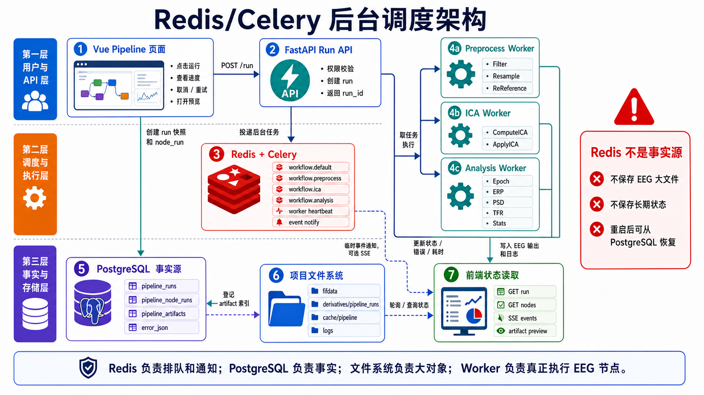

# Redis 后台任务与工作流调度架构

> 文档性质：工作流专题讨论稿，可随方案讨论随时修改。
> 正式维护口径以 `wiki/docs` 为准；`wiki1` 是旧版文档，只作历史参考，不再作为新版事实源。
> 本目录用于把工作流方案讨论清楚，形成可落地的开发步骤后，再同步到 `wiki/docs` 的对应正式页面。

> 日期：2026-05-17  
> 主题：讨论工作流是否应使用 Redis，把每一步 EEG 分析操作编排成后台任务执行。  
> 结论倾向：推荐使用 Redis + Celery，但 Redis 只做任务队列、临时进度和事件通知；数据库保存长期事实，文件系统或对象存储保存 EEG 数据和中间产物。



## 1. 一句话结论

工作流执行应该从同步 HTTP 请求中拆出来，改为后台任务架构：

```text
前端 Pipeline 页面
  -> FastAPI 创建 workflow run
  -> 数据库保存运行快照和节点状态
  -> Redis 投递待执行节点任务
  -> Worker 后台执行 EEG 节点
  -> 文件系统保存中间产物
  -> 数据库更新状态
  -> 前端轮询或 WebSocket 查看进度
```

这套机制适合念析的 EEG 场景。滤波、重采样、ICA、Epoch、ERP、时频、统计和 AI 报告都可能耗时较长，不能让浏览器请求一直等待。

## 2. 什么操作应该进入后台任务

不是所有用户操作都要变成 Redis 任务。前端编辑动作应保持轻量和即时，真正点击“运行工作流”后才进入后台任务系统。

| 操作类型 | 是否进入后台任务 | 说明 |
| --- | --- | --- |
| 拖动画布节点 | 否 | 前端即时完成，保存 definition 即可。 |
| 修改节点参数 | 否 | 前端更新当前图，保存时写数据库。 |
| 连线、删除节点 | 否 | 属于工作流定义编辑。 |
| 保存草稿 | 否 | 同步写 `pipeline_definitions`。 |
| 校验图结构 | 可同步 | 参数、端口、DAG 校验通常很快。 |
| 上传后解析数据 | 是 | 文件解析、BIDS/FIF 校验可能较慢。 |
| FIF 数据读取 | 是 | 大文件 IO，不适合同步请求。 |
| 滤波、重采样、重参考 | 是 | 典型 EEG 预处理任务。 |
| ICA 计算 | 是 | 耗时且需要中间结果保存。 |
| Epoch、ERP、PSD、TFR | 是 | 计算和结果生成都应后台执行。 |
| 统计分析 | 是 | 可能涉及批量数据和重复计算。 |
| AI 分析建议、报告生成 | 是 | 外部模型调用和长文本生成应放后台。 |

## 3. 核心边界

### 3.1 数据库保存事实

数据库负责保存长期事实：

- 工作流定义。
- 某一次运行的快照。
- 每个节点的运行状态。
- 节点产物索引。
- 错误信息、日志摘要、耗时、输入输出 metadata。
- 用户权限和项目归属。

### 3.2 Redis 管调度

Redis 负责短期调度：

- 任务队列。
- 节点执行排队。
- 临时进度。
- 临时日志尾部。
- Worker 心跳。
- 事件通知。

Redis 不能成为唯一事实源。Redis 清空或重启后，系统应能从数据库中判断哪些 run 正在运行、哪些节点需要恢复或标记为 interrupted。

### 3.3 文件系统保存大对象

EEG 原始数据、中间 FIF、epochs、numpy 数组、图、表、报告等不能放进 Redis，也不应该直接塞进数据库。

推荐保存为：

```text
storage/
  projects/{project_id}/
    datasets/{dataset_id}/
    pipeline_runs/{run_id}/
      nodes/{node_id}/
        output.fif
        data_info.json
        preview.json
        metrics.json
```

Redis 任务里只传 `run_id`、`node_run_id`、`artifact_id`、路径引用和参数摘要。

## 4. 运行快照机制

用户点击“运行”时，不应该直接执行正在编辑的图，而要先生成运行快照。

```text
pipeline_definition
  当前编辑中的工作流

pipeline_run
  某一次运行记录
  保存当时的 definition_snapshot、参数快照、触发人、状态

pipeline_node_run
  某个节点在某次运行中的执行记录

pipeline_artifact
  节点输出文件、图、表、日志、统计结果索引
```

这样即使用户运行后又修改了工作流，也不会影响已经开始执行的那一次 run。

## 5. 推荐技术选型

当前项目是 FastAPI + Python，正式版本建议使用：

```text
Redis + Celery
```

理由：

- Celery 成熟，适合 Python 长任务。
- 支持任务重试、超时、队列路由和 worker 并发。
- 适合 MNE、numpy、scipy、sklearn 这类 CPU/IO 混合任务。
- 后期可以拆分不同 worker，例如预处理 worker、统计 worker、AI worker。
- 可接入 Flower 或自定义管理页做任务监控。

更轻量的 RQ 可以作为备选，但考虑 EEG 工作流后续会涉及 DAG、重试、取消、队列隔离、人工节点暂停和恢复，Celery 更稳。

## 6. 队列设计

可以按任务类型分队列：

| 队列 | 用途 | 并发建议 |
| --- | --- | --- |
| `workflow.io` | LoadData、文件读取、上传解析 | 中等并发 |
| `workflow.preprocess` | 滤波、重采样、重参考 | 低到中等并发 |
| `workflow.ica` | ICA 计算 | 低并发 |
| `workflow.analysis` | ERP、PSD、TFR、统计 | 低到中等并发 |
| `workflow.ai` | AI 分析建议和报告生成 | 独立限流 |
| `workflow.scheduler` | DAG 调度、下游节点投递 | 单独 worker 或 API 内部执行 |

Phase 1 可以先只用一个队列：

```text
workflow.default
```

等工作流跑通后，再按任务类型拆分。

## 7. 任务消息结构

Redis/Celery 任务里不要传大数据，只传轻量引用。

```json
{
  "run_id": 123,
  "node_run_id": 456,
  "project_id": 10,
  "pipeline_id": 20,
  "node_id": "filter_1",
  "node_type": "eeg/preprocess/fir_filter",
  "executor": "fir_filter",
  "input_artifact_ids": [12],
  "params": {
    "l_freq": 1,
    "h_freq": 40
  },
  "run_mode": "incremental"
}
```

Worker 根据这些引用去数据库和文件系统读取真实输入。

## 8. 节点状态机

建议节点状态统一为：

| 状态 | 含义 |
| --- | --- |
| `pending` | 已创建 node_run，但上游依赖还没满足。 |
| `queued` | 已投递到 Redis 队列，等待 worker。 |
| `running` | Worker 正在执行。 |
| `success` | 本次实际执行成功。 |
| `cached` | 没有重新计算，从缓存恢复成功。 |
| `waiting_user_input` | 需要用户交互，例如 ICA 成分选择。 |
| `skipped` | 因运行模式或上游条件跳过。 |
| `failed` | 节点失败。 |
| `canceled` | 用户取消。 |

run 状态可以由节点状态聚合：

| run 状态 | 触发条件 |
| --- | --- |
| `queued` | run 已创建，初始节点已入队。 |
| `running` | 至少一个节点运行中。 |
| `waiting_user_input` | 存在人工交互节点等待用户。 |
| `completed` | 所有必需节点成功或缓存命中。 |
| `failed` | 关键节点失败，且不能继续。 |
| `partial_failed` | 部分分支失败，但非关键分支可保留。 |
| `canceled` | 用户取消。 |
| `interrupted` | Worker 或服务异常中断，需要恢复处理。 |

## 9. 一次运行的完整流程

1. 用户在前端点击“运行”。
2. FastAPI 检查项目权限和工作流归属。
3. 后端校验 DAG、端口、参数、LoadData 数据可用性。
4. 后端创建 `pipeline_runs`，保存 `definition_snapshot`。
5. 后端为每个节点创建 `pipeline_node_runs`，初始状态为 `pending`。
6. 调度器找到没有上游依赖的节点，或上游已满足的节点。
7. 后端把节点任务投递到 Redis，节点状态改为 `queued`。
8. Worker 从 Redis 取任务，节点状态改为 `running`。
9. Worker 读取上游 artifact、参数和输入文件。
10. Worker 判断缓存是否可用。
11. 如果缓存命中，注册 artifact，节点状态改为 `cached`。
12. 如果缓存未命中，调用节点执行器。
13. 节点执行器把输出写入临时目录。
14. 校验输出完整性后，原子发布到正式目录。
15. 写入 `pipeline_artifacts`，更新 `pipeline_node_runs`。
16. 调度器检查下游节点是否所有上游都已成功。
17. 满足条件的下游节点继续投递到 Redis。
18. 全部节点完成后，更新 `pipeline_runs.status`。
19. 前端通过轮询或事件流展示进度、错误和产物入口。

## 10. DAG 调度方式

Phase 1 可以先采用保守做法：

```text
创建 run
  -> 拓扑排序
  -> 后台任务中按顺序执行节点
```

这样实现简单，便于先打通 EEG 链路。

Phase 2 再升级为节点级 DAG 调度：

```text
创建 run
  -> 创建所有 node_run
  -> 入队无上游节点
  -> 每个节点完成后检查下游
  -> 可并行的节点并行执行
```

建议不要第一版就做复杂并行。先把 run 快照、节点状态、artifact、失败记录和前端展示做扎实。

## 11. 数据库表建议

### 11.1 `pipeline_runs`

已有表应补强以下语义：

| 字段 | 作用 |
| --- | --- |
| `id` | run id。 |
| `project_id` | 所属项目。 |
| `pipeline_id` | 所属 workflow。 |
| `definition_snapshot` | 运行时的图和参数快照。 |
| `status` | run 状态。 |
| `triggered_by` | 触发用户。 |
| `run_mode` | `normal`、`force`、`incremental`、`run_from_node`。 |
| `started_at` | 开始时间。 |
| `finished_at` | 结束时间。 |
| `progress` | 聚合进度。 |
| `error_json` | run 级错误。 |

### 11.2 `pipeline_node_runs`

这是 Redis 后台执行后最关键的新增表。

| 字段 | 作用 |
| --- | --- |
| `id` | node_run id。 |
| `run_id` | 所属 run。 |
| `node_id` | definition 中的节点 id。 |
| `node_type` | NodeSpec 类型。 |
| `status` | 节点状态。 |
| `queue_name` | 投递队列。 |
| `task_id` | Celery task id。 |
| `input_hash` | 输入 hash。 |
| `params_hash` | 参数 hash。 |
| `node_hash` | 节点缓存 key。 |
| `trace_code` | 可追踪标识。 |
| `started_at` | 开始时间。 |
| `finished_at` | 结束时间。 |
| `duration_ms` | 耗时。 |
| `error_json` | 节点错误。 |
| `log_tail` | 日志摘要。 |

### 11.3 `pipeline_artifacts`

保存节点输出索引，不保存大数据本体。

| 字段 | 作用 |
| --- | --- |
| `id` | artifact id。 |
| `run_id` | 所属 run。 |
| `node_run_id` | 所属节点执行。 |
| `artifact_type` | `fif`、`epochs`、`evoked`、`figure`、`table`、`report`。 |
| `storage_path` | 文件路径。 |
| `checksum` | 文件校验。 |
| `metadata_json` | data_info、维度、通道、采样率、事件等。 |
| `preview_json` | 前端预览摘要。 |
| `created_at` | 创建时间。 |

## 12. API 建议

| API | 方法 | 作用 |
| --- | --- | --- |
| `/projects/{project_id}/pipelines/{pipeline_id}/run` | POST | 创建 run，保存快照，投递后台任务，返回 `run_id`。 |
| `/projects/{project_id}/pipeline-runs/{run_id}` | GET | 查看 run 详情、状态、进度。 |
| `/projects/{project_id}/pipeline-runs/{run_id}/nodes` | GET | 查看所有节点状态。 |
| `/projects/{project_id}/pipeline-runs/{run_id}/events` | GET | SSE 事件流，MVP 可先用轮询替代。 |
| `/projects/{project_id}/pipeline-runs/{run_id}/cancel` | POST | 取消 run。 |
| `/projects/{project_id}/pipeline-runs/{run_id}/nodes/{node_run_id}/retry` | POST | 重试单个节点。 |
| `/projects/{project_id}/pipeline-runs/{run_id}/nodes/{node_run_id}/resume` | POST | 人工交互节点继续执行。 |
| `/projects/{project_id}/pipeline-artifacts/{artifact_id}/preview` | GET | 已实现第一版：预览 raw/epochs/evoked 节点输出，校验文件存在和 checksum。 |
| `/projects/{project_id}/pipeline-artifacts/{artifact_id}/download` | GET | 下载节点产物。 |

## 13. 前端交互方式

前端点击“运行”后，不再等待整条链路执行完成。

```text
用户点击运行
  -> 前端调用 POST /run
  -> 后端立即返回 run_id
  -> 前端进入运行态
  -> 每 1-2 秒轮询 run 和 node 状态
  -> 画布节点根据后端状态变色
  -> 底部运行面板展示日志、错误、耗时、产物入口
```

MVP 先用轮询即可。WebSocket/SSE 可以后面再加，不影响核心架构。

## 14. 失败、重试和恢复

后台任务系统必须把失败设计清楚。

| 场景 | 处理 |
| --- | --- |
| 节点参数错误 | 节点 `failed`，记录 `VALIDATION_ERROR`。 |
| 输入 artifact 不存在 | 节点 `failed`，错误码 `INPUT_ARTIFACT_MISSING`。 |
| Worker 崩溃 | 节点保持 `running` 太久后由恢复任务标记为 `interrupted`。 |
| Redis 重启 | 数据库仍保留 run 和 node_run，可扫描恢复。 |
| 文件写到一半失败 | 临时目录清理，不能注册 artifact。 |
| 用户取消 | run 标记 `canceling`，worker 检查取消标记后停止。 |
| 可重试节点失败 | 手动或自动重试，重试时复用同一个 node_run 或创建 retry 记录需定规则。 |

建议第一版先做手动重试，自动重试只用于短暂 IO 错误，不用于 EEG 算法错误。

## 15. 缓存关系

Redis 不是缓存 EEG 产物的地方。

工作流缓存应该是：

```text
node_hash
  -> cache manifest
  -> artifact 文件路径
  -> checksum
  -> metadata
```

缓存命中必须同时满足：

- `input_hash` 一致。
- `params_hash` 一致。
- `node_hash` 一致。
- artifact 文件存在。
- checksum 正确。
- NodeSpec 版本兼容。
- 项目和权限边界一致。

命中缓存时也要写一条 `pipeline_node_runs`，状态为 `cached`，这样前端和审计都能看见这次运行实际复用了什么。

## 16. 人工交互节点

ICA 这类节点不能像普通后台任务一样一跑到底。

建议拆成两段：

```text
Compute ICA
  -> 后台计算 ICA
  -> 生成成分预览 artifact
  -> 节点 success

Apply ICA
  -> 发现需要用户选择成分
  -> 节点 waiting_user_input
  -> 前端展示 ICA 成分选择界面
  -> 用户提交 excluded_components
  -> resume API 投递后台任务
  -> Apply ICA 继续执行
```

这样交互节点不会阻塞 worker，也能被审计和恢复。

## 17. Celery 代码结构建议

后端可增加：

```text
backend/app/
  tasks/
    celery_app.py
    pipeline_tasks.py
  pipeline/
    executor.py
    scheduler.py
    dispatcher.py
    artifacts.py
    cache.py
    state.py
```

职责划分：

| 模块 | 职责 |
| --- | --- |
| `tasks/celery_app.py` | 创建 Celery app，配置 Redis broker/backend。 |
| `tasks/pipeline_tasks.py` | 第一版已定义 `run_pipeline_task(run_id, project_id=None)`；`run_node_task` 留到后续 DAG 并行阶段。 |
| `pipeline/executor.py` | 单次 run 的执行入口。 |
| `pipeline/scheduler.py` | 判断哪些节点可以入队。 |
| `pipeline/dispatcher.py` | 根据 NodeSpec 调用具体节点函数。 |
| `pipeline/artifacts.py` | 临时目录、原子发布、checksum、artifact 记录。 |
| `pipeline/cache.py` | node_hash、cache manifest、缓存恢复。 |
| `pipeline/state.py` | 状态迁移规则，避免状态乱写。 |

## 18. 最小可落地版本

第一版不建议一次做完 DAG 并行、缓存、取消、SSE、人工节点。推荐顺序：

1. 增加 `pipeline_node_runs` 和 `pipeline_artifacts`。
2. `/run` 创建 run 快照，并立即返回 `run_id`。
3. 接入 Redis + Celery，但先只用一个 `workflow.default` 队列。
4. 先在一个后台任务里按拓扑顺序执行，不做节点级并行。
5. 实现 `LoadData -> FIR Filter -> Epoch -> ERP Average -> Save Result`。
6. 前端用轮询展示 run 和 node 状态。
7. 节点输出写入 artifact，并能打开 preview。
8. 再做取消、重试、缓存命中。
9. 再做 ICA 人工节点。
10. 最后做 DAG 并行和多 worker 队列拆分。

## 19. 与当前代码的关系

当前 `elys_version1` 已有：

- `pipeline_definitions`。
- `pipeline_runs`。
- Pipeline 页面。
- 工作流保存、校验、运行接口。
- LoadData 数据解析。
- `pipeline_node_runs`。
- `pipeline_artifacts`。
- `PipelineExecutor`、`NodeDispatcher`、`ArtifactStore`。
- Celery app、`run_pipeline_task` 和 `workflow.default` 单队列投递入口。

当前还没有：

- 完整 EEG 节点执行器。
- 节点级状态展示以外的 SSE/WebSocket 推送。
- worker 恢复、取消、重试和监控。
- 缓存恢复。
- 人工交互节点暂停/恢复。

所以 Redis 方案不是简单加一个依赖，而是工作流执行层的架构升级。最小改造目标是：先把同步 `/run` 改成“创建 run + 后台执行 + 前端查状态”，不要一开始追求完整并行调度。

### 19.1 2026-05-18 Step 11 落地状态

当前代码已完成第一版 Celery + Redis 接入：

- 新增 `backend/app/tasks/celery_app.py`，从 app config/env 读取 Redis broker/backend，默认 `redis://localhost:6379/0`。
- 新增 `backend/app/tasks/pipeline_tasks.py`，提供 `run_pipeline_task(run_id, project_id=None)`。
- `POST /projects/{project_id}/pipelines/{pipeline_id}/run` 创建 run/node_run 后投递 Celery task，并把 `celery_task_id` 和 `task_queue` 写入 `pipeline_runs.result_json`。
- Worker 内重新创建 DB session，调用 `execute_pipeline_run_sync()` / `PipelineExecutor.execute_prepared_run()`。
- 第一版只使用 `workflow.default` 单队列，并由 `PipelineExecutor` 按拓扑顺序串行执行。
- Celery 消息只传 `run_id` 和 `project_id` 这类轻量引用，不传 EEG 大对象。

启动命令：

```powershell
# Windows 本地调试
$env:PYTHONPATH=(Join-Path $PWD 'backend')
python -m celery -A app.tasks.celery_app:celery_app worker -Q workflow.default --pool=solo --loglevel=INFO
```

```bash
# Linux/服务器
export PYTHONPATH=backend
celery -A app.tasks.celery_app:celery_app worker -Q workflow.default --loglevel=INFO
```

本机检查结果：Celery app 导入、broker/backend/queue 配置检查通过；`redis-cli` 不存在，`127.0.0.1:6379` 连接被拒绝，因此未完成真实 worker 消费和 `/run` 端到端验证。

## 20. 待讨论问题

1. Phase 1 已先用 FastAPI BackgroundTasks 过渡，并于 2026-05-18 接入 Celery + Redis 投递入口；后续需要定稿 worker 部署和恢复策略。
2. Redis 是否只用于 workflow，还是上传解析、AI 报告也共用同一套任务系统？
3. 初期是否允许多个工作流 run 并发，还是每个项目同一时间只允许一个 run？
4. 取消任务时，是立即 kill worker，还是设置取消标记，由节点函数主动检查？
5. 重试节点时，是复用原 `node_run_id`，还是新建 retry attempt？
6. 长任务日志保存到数据库、文件，还是 Redis 临时日志加文件落盘？
7. Flower 等 Celery 监控工具是否只内部使用，不暴露给普通用户？
