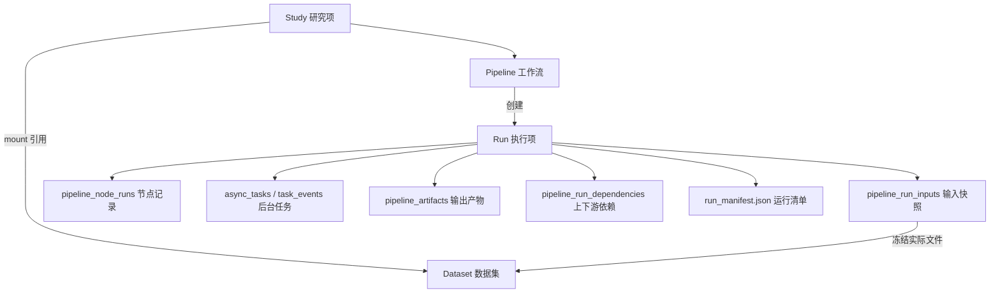
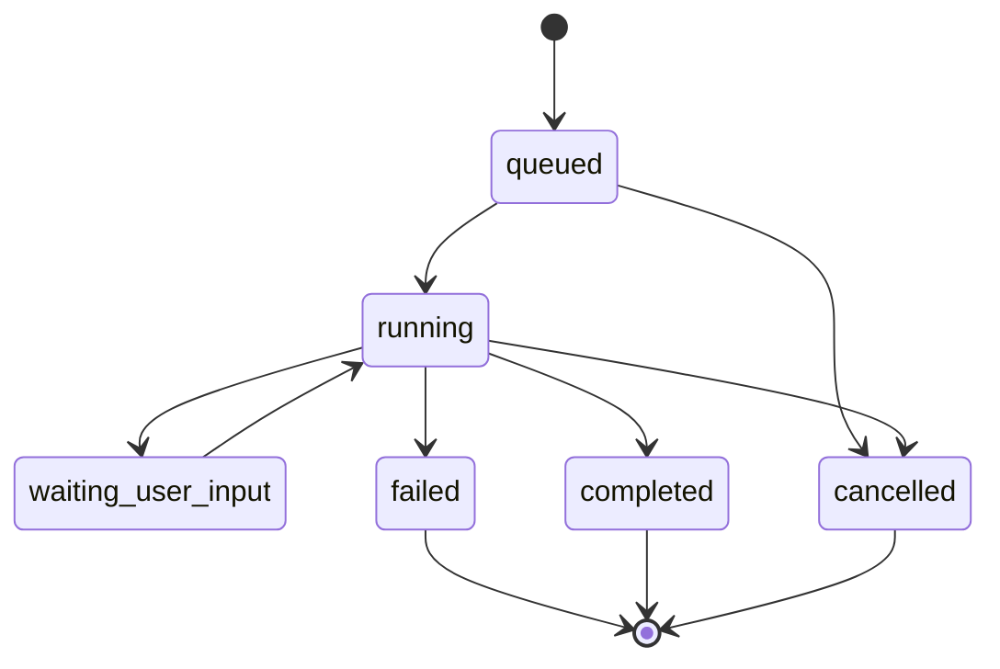

# Pipeline 与 Run 功能定义与实现规范

文档生成时间：2026-05-22 01:02:52 +08:00

本文用于统一当前平台中 **Pipeline / 工作流** 与 **Run / 执行项** 的产品定义、功能边界、数据库/API 管理方式和后续实现规范。

核心原则：

```text
Pipeline 定义“怎么处理数据”。
Run 记录“这一次实际怎么跑、用了什么数据、产生了什么结果”。
```

Pipeline 可以被编辑、复用、复制和模板化。Run 一旦创建，就应作为历史事实保留，不应被后续 Pipeline 编辑或 Dataset 增量上传改变。

## 0. 第16步实现收口状态

截至 2026-05-22 01:02:52 +08:00，Pipeline/Run 新规范的 MVP 后端主链路已经完成代码级收口：标准 `/runs` 创建入口、旧 `/run` 兼容入口、`run_mode/save_policy`、Pipeline 状态运行规则、NodeSpec executor 校验、Run selection override、强制 `expected_version`、Pipeline edit lock、Run cancel/retry、Task cancel/retry、Task events/SSE、Run lineage、Artifact pin/unpin/hide、Run Manifest 和依赖保护清理均已进入实现与测试覆盖。

当前仍需单独说明的是：这些能力已经通过单元测试、源码结构测试、mock UI 和构建验证覆盖，但还没有在真实部署环境中完整跑浏览器登录、真实 EEG 上传、真实 MNE 转换、真实 Celery worker 和浏览器端 SSE。后续验收应以 `Pipeline与Run第16步全链路回归报告.md` 为基准继续补 staging 端到端记录。

## 1. 总体关系



对象关系说明：

| 对象 | 中文 | 职责 |
| --- | --- | --- |
| Study | 研究项 | 协作空间、成员权限、Dataset 挂载、工作流和执行项管理 |
| Dataset | 数据集 | 数据资产、采集记录、上传版本、Raw BIDS 逻辑视图、canonical FIF、文件索引 |
| Pipeline | 工作流 | 节点、连线、默认参数、数据选择规则、版本和状态 |
| Run | 执行项 | 某次执行事实，冻结输入、流程快照、节点状态、任务、输出和追溯证据 |
| Artifact | 输出产物 | Run 产生的文件、图表、矩阵、epochs、ERP、报告、缓存 |

## 2. Pipeline 定义

Pipeline 是一个可编辑、可复用的处理流程定义。它描述一个研究项中“如何处理数据”，但不拥有数据文件，也不保存某次运行结果。

一句话定义：

```text
Pipeline 是处理方案，不是执行记录。
```

Pipeline 的主要功能：

1. 管理工作流身份。
2. 保存节点、连线和默认参数。
3. 保存输入/输出槽类型。
4. 保存 LoadData 数据选择规则。
5. 支持校验、复制、归档和模板化。
6. 支持版本号和乐观锁，避免多人覆盖编辑。
7. 为 Run 创建提供定义快照。

### 2.1 Pipeline 应保存的内容

| 内容 | 是否属于 Pipeline | 说明 |
| --- | --- | --- |
| 名称、描述 | 是 | 例如“静息态预处理 v1” |
| 节点列表 | 是 | LoadData、滤波、重参考、ICA、epoch、ERP 等 |
| 节点连线 | 是 | 数据从哪个节点流向哪个节点 |
| 节点默认参数 | 是 | 例如 bandpass 0.5-30 Hz、resample 250 Hz |
| 输入/输出槽类型 | 是 | 用于编辑器和校验 |
| LoadData 选择规则 | 是 | 例如 task=rest、require_fif=true |
| Pipeline 状态 | 是 | draft、active、archived、deleted |
| 当前版本号 | 是 | 当前代码用 `pipeline_definitions.version` |
| 是否模板 | 是 | `is_template` |

### 2.2 Pipeline 不应保存的内容

| 内容 | 是否属于 Pipeline | 应归属 |
| --- | --- | --- |
| 具体命中的 `dataset_file_id` | 否 | Run input snapshot |
| 具体服务器绝对路径 | 否 | DatasetFile / Artifact storage_uri |
| 某次运行的输出文件 | 否 | Artifact |
| 某次运行状态 | 否 | Run / AsyncTask |
| 某次节点日志 | 否 | PipelineNodeRun / TaskEvent |
| 某次人工 ICA 决策 | 否 | PipelineNodeRun / Run Manifest |
| 某次研究结论 | 否 | Analysis / Artifact / Report |

### 2.3 Pipeline 状态规范

建议状态：

| 状态 | 含义 | 是否可编辑 | 是否可正式运行 |
| --- | --- | --- | --- |
| `draft` | 草稿 | 是 | 否，只允许 trial Run |
| `active` | 当前可用工作流 | 是 | 是 |
| `archived` | 归档工作流 | 不建议 | 否 |
| `deleted` | 逻辑删除 | 否 | 否 |

当前代码状态：

- 数据库允许 `draft / active / archived / deleted`。
- API 已按 `pipeline.status + run_mode` 做运行前硬校验：`active` 可运行 `analysis/trial`，`draft` 只允许 `trial`，`archived/deleted` 禁止新建 Run。

建议规则：

1. `analysis` Run 只能基于 `active` Pipeline 创建。
2. `trial` Run 可以基于 `draft` Pipeline 创建。
3. `archived` 和 `deleted` Pipeline 不允许创建新 Run。
4. 前端运行按钮应根据状态置灰或显示明确提示。

### 2.4 Pipeline Definition JSON 规范

Pipeline 当前事实源是 `pipeline_definitions.definition_json`。

建议结构：

```json
{
  "schema_version": "1.0",
  "app_version": "elys_version1",
  "engine_version": "mne-compatible",
  "name": "Resting preprocessing",
  "description": "",
  "graph": {
    "nodes": [],
    "links": []
  },
  "settings": {
    "run_defaults": {
      "run_mode": "analysis",
      "save_policy": "current"
    }
  }
}
```

每个 node 至少包含：

```json
{
  "id": "node-001",
  "type": "eeg/filter/fir",
  "title": "Bandpass Filter",
  "params": {
    "l_freq": 0.5,
    "h_freq": 30,
    "save_output": true
  }
}
```

### 2.5 LoadData 选择规则边界

Pipeline 可以保存动态选择规则，例如：

```json
{
  "type": "eeg/data/load",
  "params": {
    "selection_mode": "filter",
    "dataset_filter": {
      "mount_name": "working",
      "subjects": "all",
      "sessions": "all",
      "tasks": ["rest"],
      "runs": "all",
      "qa_status": "all",
      "require_fif": true
    }
  }
}
```

这表示：

```text
运行时使用当前 Study 中 working mount 下 task=rest 且有 canonical FIF 的数据。
```

但 Run 创建时必须把规则解析成固定输入：

```text
dataset_file_id = ...
file_role = canonical_fif
storage_uri = elys://datasets/.../derivatives/elys-canonical-fif/...
sha256 = ...
```

#### explicit dataset_ids 的处理建议

当前代码支持：

```json
{
  "selection_mode": "explicit",
  "dataset_ids": ["..."]
}
```

这会让 Pipeline 保存具体数据记录 ID，和“Pipeline 不保存具体数据”的新定义存在冲突。

建议改为：

1. Pipeline 标准模式只保存 `filter` 和 `mount_name`。
2. 用户临时手选具体被试/记录时，应作为 Run 创建时的 `selection_override`。
3. `selection_override` 不写回 Pipeline 定义，只写入 `pipeline_run_inputs.selector_json`。
4. 为兼容旧代码，可暂时保留 `explicit`，但 UI 应标记为“固定输入试跑”或迁移到 Run 层。

### 2.6 Pipeline 校验规范

保存和运行前都应校验：

1. `graph.nodes` 和 `graph.links` 格式正确。
2. 节点 id 不重复。
3. 节点类型在 NodeSpec registry 中存在。
4. 节点必须参数齐全。
5. 连线引用的节点和端口存在。
6. 连线端口类型兼容。
7. 必填输入槽有上游输入。
8. 工作流无环。
9. LoadData 能解析到可运行数据，或明确返回 422。
10. NodeSpec 对应真实 executor，否则运行前应报错。

当前不一致点：

- `eeg/filter/butterworth` 有 NodeSpec，但 dispatcher 未注册执行器。
- 当前 validator 能检查 NodeSpec 存在，但未检查 dispatcher 是否支持该节点。

建议：

```text
NodeSpec 存在但 executor 不存在时，validate 应返回 error。
```

### 2.7 Pipeline 并发编辑规范

当前代码已有：

- `pipeline_definitions.version`
- `PipelineUpdate.expected_version`

但 `expected_version` 仍是可选。

建议规则：

1. 前端打开编辑器时读取当前 `version`。
2. 保存时必须携带 `expected_version`。
3. 后端发现版本不一致，返回 409。
4. 后端应逐步把 `expected_version` 改为必填。
5. 增加 Pipeline edit lock，防止两个人同时编辑长时间覆盖。

当前缺口：

- 有运行锁 `study_locks`，但没有编辑锁。
- Pipeline update 没有强制 `expected_version`。

## 3. Run 定义

Run 是某个 Pipeline 的一次具体执行。它保存这次执行的输入、流程快照、参数、任务状态、节点过程、输出产物和完整追溯证据。

一句话定义：

```text
Run 是执行事实，不是可编辑方案。
```

Run 的主要功能：

1. 冻结 Pipeline 当时的定义。
2. 冻结 LoadData 当时实际命中的输入文件。
3. 创建节点执行记录。
4. 关联后台异步任务。
5. 记录每个节点的输入、参数、输出、错误和耗时。
6. 记录输出 Artifact。
7. 记录上游/下游依赖关系。
8. 生成 Run Manifest。
9. 支持查看、预览、下载、清理策略和审计。

### 3.1 Run 应保存的内容

| 内容 | 字段/表 | 说明 |
| --- | --- | --- |
| Run ID | `pipeline_runs.id` | UUID |
| 所属 Study | `project_id` | 当前代码仍叫 Project |
| 所属 Pipeline | `pipeline_id` | 关联工作流 |
| Pipeline 版本 | `pipeline_version` | 创建 Run 时的版本号 |
| 执行序号 | `run_seq` | 同一 Pipeline 下递增 |
| 触发方式 | `trigger` | manual、system 等 |
| 运行模式 | `run_mode` | trial、analysis、replay、system |
| 保存策略 | `save_policy` | temporary、current、pinned、discard |
| Run 状态 | `status` | queued、running、completed 等 |
| 定义快照 | `definition_snapshot` | 当时完整 Pipeline 定义 |
| 输入快照 | `pipeline_run_inputs` | 实际命中的文件和选择器 |
| 节点记录 | `pipeline_node_runs` | 每个节点执行事实 |
| 后台任务 | `async_tasks/task_events` | Celery 调度和进度事件 |
| 输出产物 | `pipeline_artifacts` | 文件和结果索引 |
| 上下游依赖 | `pipeline_run_dependencies` | 使用上游 Run/Artifact 的事实 |
| Manifest 摘要 | `pipeline_runs.manifest_json` | 完整 manifest 的摘要 |
| 完整 Manifest | `runs/{run_id}/run_manifest.json` | 可导出的证据包 |

### 3.2 Run 不应保存或不应做的事情

| 内容 | 说明 |
| --- | --- |
| 反向修改 Pipeline 当前定义 | 旧 Run 不应影响当前 Pipeline |
| 重新解释“当前数据” | 历史 Run 只认输入快照 |
| 覆盖旧 Run | 重跑应创建新 Run |
| 随意物理删除输出文件 | 必须经过 retention 和依赖检查 |
| 把失败 Run 改成另一次成功 Run | 失败记录应保留，可通过 retry 创建新 Run |

## 4. Run 生命周期规范

建议 Run 状态统一为：

| 状态 | 含义 |
| --- | --- |
| `queued` | 已创建 Run 和 async task，等待 worker |
| `running` | Worker 正在执行 |
| `waiting_user_input` | 等待人工决策，例如 ICA 成分选择 |
| `completed` | 成功完成 |
| `failed` | 执行失败 |
| `cancelled` | 用户或系统取消 |

说明：

1. 当前代码使用 `completed` 表示成功完成。
2. 文档中如出现 `succeeded`，应改为 `completed`，避免 Run 和 Task 状态混用。
3. `async_tasks` 可以继续使用 `succeeded`，因为 Task 是后台调度状态，不是业务 Run 状态。

建议状态图：



## 5. Run Mode 与 Save Policy

当前数据库已有：

- `pipeline_runs.run_mode`
- `pipeline_runs.save_policy`

当前 API `PipelineRunCreate` 已暴露 `run_mode` 与 `save_policy`，默认值为 `analysis/current`，并会同步写入 `pipeline_runs`、Run response 与 `async_tasks.payload_json`。

### 5.1 run_mode

| run_mode | 含义 | 建议规则 |
| --- | --- | --- |
| `trial` | 试跑、调参、查看单个被试 | 可基于 draft Pipeline，默认 temporary |
| `analysis` | 正式分析 | 只能基于 active Pipeline，默认 current |
| `replay` | 按历史快照重放 | 使用旧 Run 的 definition/input snapshot |
| `system` | 系统任务 | 管理员或后台服务触发 |

### 5.2 save_policy

| save_policy | 含义 | 默认 Artifact 策略 |
| --- | --- | --- |
| `temporary` | 临时试跑 | 输出默认 temporary，可被清理 |
| `current` | 当前正式结果 | 关键输出默认 current |
| `pinned` | 固定保留 | 关键输出默认 pinned |
| `discard` | 不保存大输出 | 只保留 Run 记录、日志和必要摘要 |

建议 API：

```json
{
  "trigger": "manual",
  "run_mode": "analysis",
  "save_policy": "current"
}
```

建议默认值：

| 场景 | 默认 run_mode | 默认 save_policy |
| --- | --- | --- |
| 点击正式运行 | `analysis` | `current` |
| 调参试跑 | `trial` | `temporary` |
| 失败重试 | `analysis` 或继承原 Run | `current` 或继承原 Run |
| 历史重放 | `replay` | `temporary` |

## 6. Run 输入快照规范

Run 创建或 prepare_run 阶段必须把 LoadData 解析结果写入 `pipeline_run_inputs`。

至少保存：

| 字段 | 说明 |
| --- | --- |
| `run_id` | 所属 Run |
| `pipeline_id` | 所属 Pipeline |
| `node_id` / `node_type` | LoadData 节点 |
| `input_kind` | selector、dataset_file、dataset、artifact |
| `dataset_asset_id` | 所属 Dataset Asset |
| `dataset_id` | 当前兼容旧表，语义上是 Recording |
| `dataset_upload_id` | 当前兼容旧表，语义上是 Recording Version |
| `dataset_file_id` | 实际使用的 DatasetFile |
| `file_role` | canonical_fif、raw_bids_data 等 |
| `storage_uri` | 冻结的文件 URI |
| `logical_path` | 冻结的逻辑路径 |
| `sha256` | 冻结的文件校验 |
| `selector_json` | 当时选择规则 |
| `resolved_metadata_json` | 当时解析出的元数据 |

关键规则：

```text
Run 执行时优先读 pipeline_run_inputs，不重新按“当前 Dataset 状态”解析。
```

这样可以支持：

1. Dataset 继续增量上传。
2. Pipeline 继续编辑。
3. 旧 Run 仍可追溯和复现。
4. 下游 Run 能准确依赖上游输出。

## 7. Node Run 规范

`pipeline_node_runs` 记录每个节点的一次执行事实。

应保存：

| 字段 | 说明 |
| --- | --- |
| `node_id` | Pipeline 定义中的节点 ID |
| `node_type` | NodeSpec 类型 |
| `node_title` | 展示名称 |
| `topo_index` | 拓扑排序位置 |
| `params_json` | 本次节点参数 |
| `input_json` | 本次节点输入摘要 |
| `output_json` | 本次节点输出摘要 |
| `input_hash` | 输入 hash |
| `params_hash` | 参数 hash |
| `node_hash` | 节点整体 hash，用于缓存 |
| `trace_code` | 追踪码 |
| `status` | pending、running、success、cached、failed、waiting_user_input 等 |
| `error_json` | 错误 |
| `log_tail` | 日志尾部 |
| `duration_ms` | 耗时 |

人工交互节点，例如 ICA Apply，应把交互状态和用户决策写入 `output_json`，并在 manifest 中体现。

## 8. Artifact 规范

Artifact 是 Run 输出的大文件或结果索引，不属于 Pipeline。

Artifact 类型示例：

| artifact_type | data_type | 示例 |
| --- | --- | --- |
| `derivative` | `raw` | 滤波后、重参考后、ICA 清理后 raw |
| `ica_matrix` | `ica` | ICA 矩阵 |
| `derivative` | `epochs` | 分段 epochs |
| `analysis_result` | `evoked` | ERP / Evoked |
| `report` | `html/pdf/json` | 报告 |
| `figure` | `png/svg` | 图表 |
| `cache` | any | 可重算缓存 |

Artifact 应保存：

| 字段 | 说明 |
| --- | --- |
| `run_id` | 来自哪次 Run |
| `node_run_id` | 来自哪个节点 |
| `artifact_type` | 业务类型 |
| `data_type` | 数据类型 |
| `storage_uri` | 新事实源 |
| `storage_path` | 旧兼容字段 |
| `sha256` / `content_hash` | 校验和去重 |
| `retention_status` | 保存状态 |
| `metadata_json` | 参数和来源摘要 |
| `preview_json` | 预览信息 |

### 8.1 retention_status

建议状态：

| 状态 | 含义 |
| --- | --- |
| `temporary` | 临时输出，可清理 |
| `cached` | 可复用缓存，可在无依赖时清理 |
| `current` | 当前默认结果 |
| `pinned` | 用户固定保留 |
| `deleted` | 逻辑删除 |
| `quarantined` | 管理员隔离 |

当前 API 手动 retention update 只允许：

```text
current / pinned / deleted
```

cleanup 任务只处理：

```text
temporary / cached
```

这是合理的 MVP 边界，但文档要明确“手动状态更新”和“自动清理状态”不是同一个接口。

## 9. Run Dependency 规范

如果 Run B 使用 Run A 的 Artifact，则必须写 `pipeline_run_dependencies`。

示例：

```text
run_id = Run B
depends_on_run_id = Run A
upstream_artifact_id = Artifact from Run A
dependency_kind = upstream_artifact
```

规则：

1. 被下游 Run 依赖的 Artifact 不能逻辑删除。
2. 被依赖 Artifact 更不能物理删除。
3. 如果文件可重算，可以清理大文件，但必须保留重建信息和依赖关系。
4. Run detail 应返回 dependencies。
5. 清理接口遇到依赖应返回 409 或在 cleanup 报告中标记 skipped。

## 10. Run Manifest 规范

Run Manifest 是 Run 的完整证据包。

推荐位置：

```text
STUDIES_STORAGE_ROOT/{study_id}/runs/{run_id}/run_manifest.json
```

Manifest 至少包含：

| 内容 | 说明 |
| --- | --- |
| run | id、status、run_mode、save_policy、started_by、started_at、finished_at |
| pipeline | pipeline_id、pipeline_version、definition_snapshot_hash |
| inputs | pipeline_run_inputs 完整快照 |
| node_runs | 节点状态、参数 hash、输入 hash、输出摘要、错误 |
| artifacts | 输出文件、hash、storage_uri、retention_status |
| dependencies | 上下游依赖 |
| tasks | async_task 和 task_events 摘要 |
| software | app version、engine version、MNE/Python 版本 |
| decisions | 人工决策，例如 ICA excluded components |
| errors/warnings | 错误和警告 |

生成时机：

1. Run `completed`。
2. Run `failed`。
3. Run `waiting_user_input`。
4. Run `cancelled`。
5. 用户显式请求 manifest 时，如果不存在，可以补生成。

## 11. API 规范

### 11.1 当前代码 API

当前实际路径仍使用 Project 命名：

| 能力 | 当前 API |
| --- | --- |
| NodeSpec 列表 | `GET /api/v1/pipeline/nodes` |
| LoadData 解析 | `POST /api/v1/projects/{project_id}/pipeline/load-data/resolve` |
| Pipeline 列表 | `GET /api/v1/projects/{project_id}/pipelines` |
| 创建 Pipeline | `POST /api/v1/projects/{project_id}/pipelines` |
| Pipeline 详情 | `GET /api/v1/projects/{project_id}/pipelines/{pipeline_id}` |
| 保存 Pipeline | `PUT /api/v1/projects/{project_id}/pipelines/{pipeline_id}` |
| 删除 Pipeline | `DELETE /api/v1/projects/{project_id}/pipelines/{pipeline_id}` |
| 校验 Pipeline | `POST /api/v1/projects/{project_id}/pipelines/{pipeline_id}/validate` |
| 创建 Run | `POST /api/v1/projects/{project_id}/pipelines/{pipeline_id}/runs`，兼容 `POST /run` |
| Run 列表 | `GET /api/v1/projects/{project_id}/pipelines/{pipeline_id}/runs` |
| Run 详情 | `GET /api/v1/projects/{project_id}/pipeline-runs/{run_id}` |
| Run Manifest | `GET /api/v1/projects/{project_id}/pipeline-runs/{run_id}/manifest` |
| Run 节点 | `GET /api/v1/projects/{project_id}/pipeline-runs/{run_id}/nodes` |
| Run Artifacts | `GET /api/v1/projects/{project_id}/pipeline-runs/{run_id}/artifacts` |
| Artifact Preview | `GET /api/v1/projects/{project_id}/pipeline-artifacts/{artifact_id}/preview` |
| Artifact Download | `GET /api/v1/projects/{project_id}/pipeline-artifacts/{artifact_id}/download` |
| Artifact Retention | `PATCH /api/v1/projects/{project_id}/pipeline-artifacts/{artifact_id}/retention` |
| Artifact Cleanup | `POST /api/v1/projects/{project_id}/pipeline-artifacts/cleanup` |
| 交互节点读取 | `GET /api/v1/projects/{project_id}/pipeline-runs/{run_id}/nodes/{node_run_id}/interaction` |
| 交互决策提交 | `POST /api/v1/projects/{project_id}/pipeline-runs/{run_id}/nodes/{node_run_id}/decision` |
| 交互节点继续 | `POST /api/v1/projects/{project_id}/pipeline-runs/{run_id}/nodes/{node_run_id}/resume` |

### 11.2 推荐目标 API

产品语义建议逐步 alias 到 Study：

| 能力 | 推荐 API |
| --- | --- |
| Pipeline 列表 | `GET /api/v1/studies/{study_id}/pipelines` |
| 创建 Pipeline | `POST /api/v1/studies/{study_id}/pipelines` |
| 保存 Pipeline | `PATCH /api/v1/studies/{study_id}/pipelines/{pipeline_id}` |
| 创建 Run | `POST /api/v1/studies/{study_id}/pipelines/{pipeline_id}/runs` |
| Run 详情 | `GET /api/v1/studies/{study_id}/runs/{run_id}` |
| Run Manifest | `GET /api/v1/studies/{study_id}/runs/{run_id}/manifest` |
| Artifact Preview | `GET /api/v1/studies/{study_id}/artifacts/{artifact_id}/preview` |
| Artifact Cleanup | `POST /api/v1/studies/{study_id}/artifacts/cleanup` |

注意：

```text
当前标准创建入口已经是复数 /runs，单数 /run 仅作为旧客户端兼容入口保留。
```

## 12. 数据库实现映射

当前实现与目标语义：

| 当前表/字段 | 当前含义 | 标准语义 |
| --- | --- | --- |
| `projects` | 项目表 | Study |
| `project_members` | 项目成员 | Study members |
| `study_settings` | 研究项设置 | Study settings |
| `study_dataset_mounts` | Dataset 挂载 | Study Dataset Mount |
| `dataset_assets` | 数据资产 | Dataset |
| `datasets` | 当前旧数据记录 | Recording |
| `dataset_uploads` | 当前上传版本 | Recording Version |
| `dataset_files` | 文件索引 | Dataset File |
| `pipeline_definitions` | Pipeline 身份和当前定义合并表 | Pipeline + current definition |
| `pipeline_runs` | 执行记录 | Run |
| `pipeline_run_inputs` | 输入快照 | Run Input Snapshot |
| `pipeline_node_runs` | 节点执行记录 | Node Run |
| `pipeline_artifacts` | 输出产物 | Artifact |
| `pipeline_run_dependencies` | 上下游依赖 | Run Dependency |
| `async_tasks` | 后台任务 | Task |
| `task_events` | 任务事件 | Task Event |

当前文档中如出现 `studies / pipelines / pipeline_versions`，应明确它们是目标语义或未来表名，而不是当前已经落地的物理表。

## 13. 当前实现与新定义的不一致清单

第 16 步收口后，本节初稿中的 P1、P2、P3、P5、P6、P7、P9、P11 已基本完成或已有兼容实现；仍需要保留关注的是 Project/Study 命名兼容、Pipeline immutable version 表、Artifact source 标准化到 Dataset Asset，以及真实部署级端到端回归。

| 编号 | 不一致 | 当前情况 | 建议 |
| --- | --- | --- | --- |
| P1 | Run 创建路由 | 已新增标准 `/pipelines/{id}/runs`，旧 `/run` 保留兼容 | 后续前端和新 API 文档优先使用 `/runs` |
| P2 | Run 成功状态 | 已统一为 `completed`，Task 成功状态保留 `succeeded` | 持续避免文档和 UI 混用 |
| P3 | run_mode/save_policy | 已进入 `PipelineRunCreate`、Run response、DB 和 task payload | 后续 ArtifactStore 可继续按 save_policy 细化默认保留策略 |
| P4 | Pipeline 保存具体数据 | 当前支持 `selection_mode=explicit + dataset_ids` | 标准 UI 不把具体数据写入 Pipeline，临时手选进入 Run override |
| P5 | Pipeline 状态运行规则 | 已按 `active/draft/archived/deleted + run_mode` 校验 | 后续前端继续增强禁用提示 |
| P6 | expected_version | 已改为必填，缺失返回 422，版本冲突返回 409 | 后续可增加差异提示 |
| P7 | edit lock | 后端已增加 Pipeline edit lock API 和 update 冲突检查 | 前端心跳续期与冲突 UI 仍需增强 |
| P8 | Pipeline version | 文档有 `pipeline_versions`，代码未拆表 | MVP 先标为目标设计，后续再拆 |
| P9 | NodeSpec 与 executor | validator 已检查 dispatcher 是否支持节点类型 | UI 继续隐藏或禁用无 executor 节点 |
| P10 | Artifact source 字段 | `source_dataset_id` 指向旧 `datasets` | 后续补 `source_dataset_asset_id` 或通过 Run inputs 追溯 |
| P11 | 标准 API 超前 | cancel、retry、pin/unpin/hide 等 Project 兼容 API 已实现；`/studies` 仍是目标 alias | 文档继续区分当前 `/projects` 兼容实现和未来 `/studies` 标准入口 |

## 14. 建议的近期开发优先级

### 第一优先级：低风险收口

1. 文档统一当前与目标 API。
2. Run 状态统一为 `completed`。
3. `PipelineRunCreate` 增加 `run_mode` 和 `save_policy`。
4. Run response 返回 `run_mode` 和 `save_policy`。
5. 创建 Run 时根据 Pipeline 状态做硬校验。
6. 为 `/pipelines/{pipeline_id}/runs` 增加兼容创建路由，内部复用现有 `/run` 逻辑。
7. validate 阶段检查 NodeSpec 是否有 executor。

### 第二优先级：协作安全

1. Pipeline update 强制 `expected_version`。
2. 增加 Pipeline edit lock。
3. Run cancel 接入 Celery revoke、Run 状态、锁释放和 manifest。
4. Run retry 创建新 Run，不覆盖旧 Run。
5. Run detail 增加 lineage 视图。

### 第三优先级：版本模型进化

1. 将 `pipeline_definitions` 拆成 Pipeline 身份表和 Pipeline Version 表。
2. Pipeline 保存时生成不可变版本。
3. Run 关联 `pipeline_version_id`。
4. 支持从旧 Run 的 definition snapshot 创建新 Pipeline。
5. 支持 Pipeline 导入/导出。

## 15. 验收标准

一个符合当前新定义的 Pipeline/Run 系统，应满足：

1. Pipeline 不直接绑定服务器绝对路径。
2. Pipeline 标准模式不保存具体 `dataset_file_id`。
3. 每次 Run 都冻结 `definition_snapshot`。
4. 每次 Run 都冻结 `pipeline_run_inputs`。
5. Dataset 增量上传不改变旧 Run。
6. Pipeline 后续编辑不改变旧 Run。
7. Run 输出写入 Artifact。
8. Artifact 有 `storage_uri`、hash 和 retention 状态。
9. 下游依赖会阻止上游 Artifact 被删除。
10. 终态 Run 能生成 manifest。
11. 运行锁能阻止同一 Pipeline 并发运行。
12. 编辑锁能阻止多人覆盖同一 Pipeline。
13. 试跑和正式分析能通过 `run_mode/save_policy` 区分。
14. 文档中的“当前实现”和“目标设计”不会混写。

## 16. 当前结论

当前代码的 Pipeline/Run 主干方向是正确的，已经具备：

```text
Pipeline definition
  -> Run definition snapshot
  -> LoadData input snapshot
  -> async task
  -> node runs
  -> artifacts
  -> run manifest
  -> dependency-aware cleanup
```

但它仍带有前一阶段需求的痕迹：

1. Project/Study 命名混用。
2. Pipeline 仍允许显式保存具体 dataset ids。
3. Run API 尚未暴露运行模式和保存策略。
4. 文档中部分目标 API 写得像当前实现。
5. Pipeline 版本模型尚未拆成不可变版本表。

短期建议不要大迁移数据库，先完成语义收口和 API 小改造。这样可以最快让当前实现与“Dataset / Study / Pipeline / Run”四对象新定义对齐。
