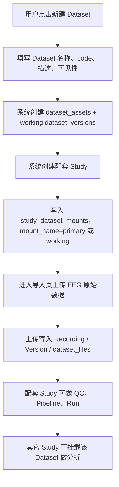

# Dataset 与 Study 导入逻辑梳理及实现步骤

文档生成时间：2026-05-22 15:54:05 +08:00

实现步骤重写时间：2026-05-22 16:13:50 +08:00

## 1. 结论先行

当前前端页面确实不是目标产品逻辑。

现在用户进入 `ImportPage.vue` 后必须先选择一个 Study，然后才能导入数据。后端同步导入接口也是 `POST /api/v1/projects/{project_id}/datasets/import`，天然要求 `project_id`。这导致用户感知是：

```text
先创建 Study
  -> 再往这个 Study 里导入 Dataset
```

更合理的目标逻辑应是：

```text
新建 Dataset 数据资产
  -> 系统自动创建或选择一个配套 Study
  -> 自动把 Dataset 挂载到这个 Study
  -> 上传 Recording / Version / File
  -> 后续其它 Study 可以再挂载这个 Dataset 做分析
```

也就是说，Dataset 是数据资产，Study 是研究和协作空间。配套 Study 只是为了导入、质控和初始分析提供一个默认工作空间，不代表 Dataset 属于 Study。

## 2. 当前代码事实

### 2.1 前端当前流程

读取范围：

1. `elys_version1/frontend/elys-web/src/views/ImportPage.vue`
2. `elys_version1/frontend/elys-web/src/components/BidsUploadPanel.vue`
3. `elys_version1/frontend/elys-web/src/api/datasets.ts`
4. `elys_version1/frontend/elys-web/src/api/datasetAssets.ts`
5. `elys_version1/frontend/elys-web/src/views/ProjectDetailPage.vue`
6. `elys_version1/frontend/elys-web/src/views/PipelinePage.vue`

当前前端入口：

```text
/datasets 或 /import
  -> ImportPage.vue
  -> studyApi.list()
  -> 用户必须选择 Study
  -> BidsUploadPanel 接收 studyId
  -> datasetApi.upload(studyId, payload)
  -> POST /projects/{studyId}/datasets/import
```

关键现状：

| 模块 | 当前行为 | 问题 |
|---|---|---|
| `ImportPage.vue` | 页面文案明确“导入当前 Study 的 working Dataset” | 用户必须先有 Study，Dataset 不是第一对象 |
| `BidsUploadPanel.vue` | 只接收 `studyId` / `studyName` | 组件无法表达“先选 Dataset，再选择或自动创建 Study” |
| `datasetApi.upload` | 只提交 subject、task、session、run、files、replaceExisting | 后端已支持的 `dataset_asset_id` / `mount_name` 没有从前端传入 |
| `datasetAssetApi` | 已有 `list/create/update` 和 mount API | 页面没有把它作为导入主入口使用 |
| `ProjectDetailPage.vue` | 从 Study 详情跳转到 `/datasets?study_id=...` | 仍是 Study 优先 |
| `PipelinePage.vue` | LoadData 读取 `datasetApi.list(projectId)` | 数据选择仍依赖当前 Study/Project 下的旧 `datasets` 记录 |

### 2.2 后端当前流程

读取范围：

1. `elys_version1/backend/app/routers/datasets.py`
2. `elys_version1/backend/app/services/dataset_assets.py`
3. `elys_version1/backend/app/services/recordings.py`
4. `elys_version1/backend/app/pipeline/load_data.py`
5. `elys_version1/backend/app/models/project.py`
6. `elys_version1/database/schema/00_current_schema.sql`

当前后端已经有 Dataset Asset 和挂载表：

```text
dataset_assets
dataset_versions
study_dataset_mounts
datasets                 当前更像 Recording 兼容表
dataset_uploads          当前更像 Recording Version 兼容表
dataset_files
projects                 产品语义是 Study
```

当前同步上传接口：

```text
POST /api/v1/projects/{project_id}/datasets/import
```

这个接口已经支持表单字段：

```text
dataset_asset_id
mount_name
```

但前端当前没有传。后端实际处理逻辑是：

1. 校验当前用户对 Study 有写权限。
2. 如果传了 `mount_name`，按 Study mount 找 Dataset Asset。
3. 如果传了 `dataset_asset_id`，要求该 Dataset Asset 已经挂载到当前 Study。
4. 如果两个都没传，调用 `get_or_create_working_dataset_asset()`。
5. `get_or_create_working_dataset_asset()` 会自动创建 `study-{project_id}-working` 的 Dataset Asset，并自动创建 mount_name 为 `working` 的挂载。
6. 写入 `datasets`、`dataset_uploads`、`dataset_files`、canonical FIF、Raw BIDS 逻辑索引等。

所以后端其实有“自动创建 Study working Dataset”的隐藏兼容能力，但它是 Study 优先，不是 Dataset 优先。

### 2.3 当前最大结构性限制

当前的 `datasets`、`subjects`、`dataset_files` 仍带 `project_id`，并且 LoadData、Recording API 仍按 `project_id` 查询：

```text
recordingApi.list(studyId)
  -> /projects/{studyId}/recordings
  -> list_recordings_for_project()
  -> Recording.project_id == studyId

Pipeline LoadData
  -> Dataset.project_id == studyId
```

这意味着：

1. Dataset Asset 可以被挂载到另一个 Study。
2. 但另一个 Study 的 Recording 列表和 LoadData 不一定能看到这个 Dataset 的采集记录。
3. 因为采集记录仍被认为属于导入时那个 `project_id`。

这是后续实现中必须先修的点。否则“Dataset 可被多个 Study 挂载”只是表关系存在，实际运行链路没有完全成立。

## 3. 推荐产品逻辑

### 3.1 两条入口都保留

推荐保留两种用户路径：

| 路径 | 用户意图 | 页面逻辑 |
|---|---|---|
| Dataset-first | 我先整理一批数据 | 新建 Dataset，系统自动创建配套 Study 并挂载 |
| Study-first | 我正在某个研究里补数据 | 在 Study 中选择“挂载已有 Dataset”或“创建专用 Dataset” |

默认主入口应该改成 Dataset-first。Study-first 作为研究项详情里的快捷入口保留。

### 3.2 Dataset-first 标准流程



### 3.3 配套 Study 的定位

配套 Study 建议叫“Dataset 配套研究项”或“Dataset 工作区”，其职责是：

1. 给当前过渡期后端提供必需的 `project_id`。
2. 承载导入、质控、初始 Pipeline、Run 和审计。
3. 作为 Dataset 的默认 working workspace。

它不应被理解为 Dataset 的 owner。Dataset owner 仍在 `dataset_assets.owner_id`。

建议命名：

```text
Dataset name: ADHD Resting EEG
Dataset code: adhd-rest-2026
Paired Study name: ADHD Resting EEG 工作区
Paired Study code: adhd-rest-2026-workspace
Mount name: primary
```

如果要最大化兼容现有代码，也可以继续使用 mount_name=`working`，但前端文案建议叫“主数据挂载”。

## 4. 涉及前端、后端、数据库的结构

### 4.1 前端需要调整

| 文件 | 调整 |
|---|---|
| `ImportPage.vue` | 从“先选 Study”改为“先创建或选择 Dataset”，再显示配套 Study 和挂载状态 |
| `BidsUploadPanel.vue` | props 从仅 `studyId` 扩展为 `studyId + datasetAssetId + mountName` |
| `api/datasets.ts` | `UploadDatasetPayload` 增加 `datasetAssetId`、`mountName`，提交 `dataset_asset_id`、`mount_name` |
| `api/datasetAssets.ts` | 增加 bootstrap API 封装，或在前端串联 create asset / create study / mount |
| `types/index.ts` | 增加 `DatasetBootstrapRequest/Response`、明确 Dataset Asset 与 Recording 类型 |
| `Dashboard.vue` | 快捷入口从“先创建 Study 再导入”改为“新建 Dataset” |
| `ProjectDetailPage.vue` | 增加“挂载已有 Dataset”“创建专用 Dataset”两个动作 |
| `PipelinePage.vue` | LoadData 改为基于 Study mounts 解析 Dataset Asset，而不是只读当前 Project 的旧 datasets |

### 4.2 后端需要调整

推荐新增一个事务型 bootstrap 接口：

```text
POST /api/v1/dataset-assets/bootstrap
```

请求示例：

```json
{
  "dataset": {
    "name": "ADHD Resting EEG",
    "code": "adhd-rest-2026",
    "description": "Resting EEG dataset",
    "visibility": "private",
    "metadata_json": {}
  },
  "paired_study": {
    "mode": "create",
    "name": "ADHD Resting EEG 工作区",
    "code": "adhd-rest-2026-workspace",
    "description": "Auto-created Study for Dataset import and QC"
  },
  "mount": {
    "mount_name": "primary",
    "selection_json": {},
    "is_active": true
  }
}
```

响应示例：

```json
{
  "dataset_asset": {},
  "dataset_version": {},
  "study": {},
  "mount": {},
  "next_upload": {
    "study_id": "202605000001",
    "dataset_asset_id": "...",
    "mount_name": "primary",
    "upload_endpoint": "/api/v1/projects/202605000001/datasets/import"
  }
}
```

后端实现建议：

1. 抽出 Study 创建 service，不要让 Dataset router 直接 import `routers/projects.py` 的函数。
2. 抽出 Dataset bootstrap service，保证创建 Dataset、working version、Study、mount 在一个事务中完成。
3. 创建配套 Study 时同时初始化 legacy project 目录和 Study storage 目录。
4. 如果用户选择挂到已有 Study，必须校验 Study 写权限。
5. 如果创建新 Study，必须校验 `project:write` 或 PI/Admin 权限。
6. 记录审计：
   - `dataset_asset.created`
   - `study.created`
   - `study.dataset_mount.created`
   - `dataset_asset.paired_study.created`

### 4.3 数据库现阶段是否需要改

短期 MVP 可以不改 schema，直接复用：

```text
dataset_assets
dataset_versions
projects
study_dataset_mounts
study_settings
datasets
dataset_uploads
dataset_files
```

但需要明确当前字段语义：

| 当前字段 | 过渡期语义 |
|---|---|
| `datasets.project_id` | 导入发生时的 origin/paired Study，不代表所有使用该 Dataset 的 Study |
| `subjects.project_id` | 仍是兼容字段，短期跟配套 Study 绑定 |
| `dataset_files.project_id` | 仍是兼容字段，短期跟配套 Study 绑定 |
| `study_dataset_mounts.project_id` | 消费该 Dataset 的 Study |
| `dataset_asset_id` | 真正把 Recording/File 归到 Dataset Asset 的关键字段 |

建议暂不增加强制的 `paired_study_id` 外键，因为这会把 Dataset 和 Study 又绑定成一对一。可以先把配套 Study ID 写入 `dataset_assets.metadata`：

```json
{
  "auto_created": false,
  "paired_study_id": "202605000001",
  "created_from": "dataset_first_import"
}
```

长期重构时再考虑：

1. 新建真正的 `recordings` 表，不再把旧 `datasets` 当 Recording。
2. Recording 直接归属 `dataset_asset_id`，`project_id` 降级为 origin/import context。
3. Dataset File 以 `dataset_asset_id / dataset_version_id / recording_id` 为核心索引。
4. Study 只通过 `study_dataset_mounts` 看到 Dataset，不再决定 Dataset 内部记录身份。

## 5. 必须补齐的关键逻辑

### 5.1 上传目标必须显式传 Dataset Asset

前端现在没有传 `dataset_asset_id`，导致后端总是走“当前 Study working Dataset”的隐式逻辑。

需要改成：

```text
datasetApi.upload(studyId, {
  datasetAssetId,
  mountName,
  subject,
  task,
  session,
  run,
  files
})
```

FormData 增加：

```text
dataset_asset_id = datasetAssetId
mount_name = mountName
```

### 5.2 Study 挂载后的查询必须跨 origin Study

当前 `list_recordings_for_project()` 和 LoadData 都只查 `project_id == 当前 Study`。这会导致挂载其它 Dataset Asset 后看不到其 Recording。

需要改为：

```text
如果请求带 mount_id/mount_name/dataset_asset_id:
  先确认该 Dataset Asset 已挂载到当前 Study
  再按 dataset_asset_id 查询 Recording
  不强制 Recording.project_id == 当前 Study

如果请求不带 Dataset Asset:
  默认查当前 Study active mounts 下所有 Dataset Asset
  兼容旧逻辑时再 fallback 到 project_id == 当前 Study
```

涉及位置：

1. `backend/app/services/recordings.py`
2. `backend/app/pipeline/load_data.py`
3. `backend/app/routers/datasets.py` 中旧 `/projects/{project_id}/datasets` 列表
4. `frontend PipelinePage.vue` 的 LoadData 数据源

### 5.3 同一 Study 内多 Dataset 的 subject 冲突

当前上传去重以 `project_id + subject/session/task/run` 为主。如果多个 Dataset 都导入到同一个 Study，subject/task/run 容易冲突。

配套 Study 策略可以缓解这个问题：

```text
每个 Dataset 有自己的 paired Study 作为导入上下文
分析 Study 只挂载这些 Dataset，不在分析 Study 内重复导入
```

但要真正支持一个 Study 里直接导入多个 Dataset，后端去重规则必须改为：

```text
dataset_asset_id + subject/session/task/run
```

而不是只按 `project_id`。

## 6. 每步实施细节与 Codex 提示词

使用方式：一次只复制一个 Step 给 Codex。每个 Step 执行前先让 Codex 重新读取相关文件；执行后必须写清楚实际改动、验证命令、未完成项，并更新本文件对应 Step 的执行记录。不要一次要求完成所有步骤。

### Step 0：决策固化与影响范围复核

工作目标：

- 固化 Dataset-first 口径：用户创建的是 Dataset，系统创建或选择配套 Study，Study 通过 mount 使用 Dataset。
- 复核当前前端、后端、数据库、docs_v2 中仍要求“先创建 Study 再导入 Dataset”的位置。
- 不改业务代码，只输出影响清单，并更新日志或 docs_v2 中的产品口径。

建议检查文件：

- `日志/2_meeting260522/Dataset与Study导入逻辑梳理及实现步骤.md`
- `wiki/docs_v2/2-00-系统架构总览.md`
- `wiki/docs_v2/2-50-API设计总览.md`
- `wiki/docs_v2/3-20-Dataset与采集记录表.md`
- `wiki/docs_v2/3-30-Study与Pipeline表.md`
- `wiki/docs_v2/5-10-Study研究项管理.md`
- `wiki/docs_v2/6-00-前端页面总览.md`
- `elys_version1/frontend/elys-web/src/views/ImportPage.vue`
- `elys_version1/frontend/elys-web/src/components/BidsUploadPanel.vue`
- `elys_version1/backend/app/routers/datasets.py`

验证方式：

- `mkdocs build --clean`

Codex 提示词：

```text
Step 0：请复核 Dataset-first 导入改造的产品口径和影响范围。目标是确认“用户先创建 Dataset，系统自动创建或选择配套 Study，并通过 study_dataset_mounts 挂载；Study 只是导入、QC、Pipeline/Run 的工作空间，不拥有 Dataset”。请读取 日志/2_meeting260522/Dataset与Study导入逻辑梳理及实现步骤.md、wiki/docs_v2/2-00、2-50、3-20、3-30、5-10、6-00，以及 ImportPage.vue、BidsUploadPanel.vue、backend/app/routers/datasets.py，整理当前仍是 Study-first 的页面、API、数据库和文档位置。不要修改业务代码；只更新必要的日志或 docs_v2 口径，并在本日志 Step 0 下写执行记录、发现、风险和下一步建议。完成后在 wiki 目录运行 mkdocs build --clean，并说明结果。
```

执行记录：

- 状态：已完成。
- 执行时间：2026-05-22 16:18:45 - 2026-05-22 16:21:57 +08:00。
- 复核范围：本日志、`wiki/docs_v2/2-00`、`2-50`、`3-20`、`3-30`、`5-10`、`6-00`，以及 `elys_version1/frontend/elys-web/src/views/ImportPage.vue`、`elys_version1/frontend/elys-web/src/components/BidsUploadPanel.vue`、`elys_version1/backend/app/routers/datasets.py`。工作区中还存在 `huanggan_share/elys_v2` 和 `_old/elys_v2` 同名副本；本次按日志列出的 `elys_version1` 复核，未修改业务代码。
- 文档更新：已同步更新 `wiki/docs_v2/2-00-系统架构总览.md`、`2-50-API设计总览.md`、`3-20-Dataset与采集记录表.md`、`3-30-Study与Pipeline表.md`、`5-10-Study研究项管理.md`、`6-00-前端页面总览.md`、`0-50-变更记录.md`。

发现：

- 产品口径确认：目标应固定为 Dataset-first。用户创建或选择 Dataset；系统创建或选择配套 Study；`study_dataset_mounts` 建立挂载；Study 只是导入、QC、Pipeline/Run、Artifact 和审计工作空间，不拥有 Dataset。
- 当前前端仍是 Study-first：`ImportPage.vue` 文案写明“导入当前 Study 的 working Dataset”“先选择 Study”，`selectedStudyId` 为空时不渲染 `BidsUploadPanel`，并从 `?study_id=` / `?project_id=` 读取默认 Study。
- 当前上传组件仍是 Study-first：`BidsUploadPanel.vue` 只接收 `studyId` / `studyName`，调用 `datasetApi.upload(props.studyId, ...)`，没有提交 `dataset_asset_id` / `mount_name`；成功提示仍是“导入当前 Study 的 working Dataset”。
- 当前 API 是过渡兼容：`datasets.py` 的导入路由仍挂在 `/api/v1/projects/{project_id}/datasets/import`，必须先有 `project_id`；接口已支持 `dataset_asset_id` 和 `mount_name`，但前端尚未传入，因此会落回 `get_or_create_working_dataset_asset()` 的当前 Study working Dataset 隐式逻辑。
- 当前数据库/查询仍带 Study-first 遗留：`datasets.project_id`、`subjects.project_id`、`dataset_files.project_id` 仍作为导入上下文和旧查询条件存在；旧列表、QA、files 查询仍过滤 `Dataset.project_id == project.id` 或 `DatasetFile.project_id == project.id`。这些字段不能再解释为 Dataset 所有权。
- 当前重复判断仍有冲突风险：上传去重/重复 Recording 判断主要按 `project_id + subject/session/task/run`，多个 Dataset 挂在同一个 Study 时容易把不同 Dataset 的同一 BIDS 实体误判为冲突。
- 文档位置已补口径：`2-00` 增加 Dataset-first 导入口径；`2-50` 增加 `/dataset-assets/bootstrap` 目标接口和当前兼容边界；`3-20`、`3-30`、`5-10` 明确 `project_id` 是过渡上下文；`6-00` 将 `/import` 标为 Study-first 兼容接入。

风险：

- 若直接改前端为 Dataset-first，但没有后端 bootstrap，页面无法稳定返回配套 Study、mount 和上传上下文。
- 若只让上传传 `dataset_asset_id`，但不修 Recording/LoadData 查询，Study 挂载外部 Dataset 后仍可能看不到 Recording 或 Run 输入。
- 若继续按 `project_id` 判断 Dataset 可见性和重复性，会削弱 `study_dataset_mounts` 的多对多关系。
- 多个代码副本并存，后续实施前必须确认实际开发目标目录，避免只改了非运行副本。

下一步建议：

- Step 1 先抽出 Study 创建 service，保证 Dataset bootstrap 能在同一事务里创建配套 Study。
- Step 2 实现 `POST /api/v1/dataset-assets/bootstrap`，返回 `study_id/project_id`、`dataset_asset_id`、`mount_name` 和上传 endpoint。
- Step 3 到 Step 5 接入前端类型、API、`ImportPage.vue` 和 `BidsUploadPanel.vue`，让上传显式提交 `dataset_asset_id` / `mount_name`。
- Step 6 到 Step 7 修正 Recording API、LoadData 和 Run 输入冻结，优先按 active mount 和 `dataset_asset_id` 查询，再保留旧 `project_id` fallback。
- Step 8 做端到端回归和文档收口，覆盖 bootstrap、上传、挂载可见性、LoadData、Run 输入冻结和 MkDocs 构建。

验证结果：

- 已在 `wiki` 目录运行 `mkdocs build --clean`。
- 结果：成功，文档构建到 `wiki/site`；仅出现 Material for MkDocs 关于 MkDocs 2.0 的上游兼容性提示，不影响本次构建。

### Step 1：抽出 Study 创建 service，保持旧 `/projects` 行为不变

工作目标：

- 把 `projects.py` 中创建 Study/Project、初始化目录、初始化 `study_settings`、写审计的逻辑抽成 service。
- 旧 `POST /api/v1/projects` 行为必须不变。
- 为后续 Dataset bootstrap 在同一个事务里创建配套 Study 做准备。

建议改动文件：

- `elys_version1/backend/app/routers/projects.py`
- `elys_version1/backend/app/services/studies.py`
- `elys_version1/backend/app/schemas/project.py`
- `elys_version1/backend/app/models/project.py`
- 相关后端测试文件

验证方式：

- 后端 Python 编译检查。
- 现有 projects 相关测试。
- 如测试集较大，至少运行与 project/study 创建相关的 pytest。

Codex 提示词：

```text
Step 1：请抽出 Study 创建 service，为 Dataset-first bootstrap 做准备。读取 backend/app/routers/projects.py、schemas/project.py、models/project.py、services/project_access.py 和现有测试。把创建 Project/Study、初始化 legacy project directories、初始化 Study storage directories、创建 study_settings、写 project_audit_events/audit_events 的逻辑整理到 backend/app/services/studies.py。旧 POST /api/v1/projects 的请求、响应、权限、目录初始化和审计行为必须保持不变。不要引入破坏性 schema 变更。完成后运行 Python 编译检查和 project/study 创建相关 pytest；更新本日志 Step 1 的执行记录、实际改动、验证结果、未完成项和下一步建议。
```

执行记录：

- 状态：已完成。
- 执行时间：2026-05-22 16:22:00 - 2026-05-22 16:29:51 +08:00。

实际改动：

- 新增 `elys_version1/backend/app/services/studies.py`，集中 Study/Project 创建 service：创建 `Project`、初始化 legacy project directories、初始化 Study storage directories、创建 owner `ProjectMember`、创建 `StudySettings`、写 `project_audit_events` 和通用 `audit_events`。
- `create_study()` 支持 `commit=True/False` 和 `settings_obj` 注入，后续 Dataset bootstrap 可以在同一事务中复用；路由旧 `POST /api/v1/projects` 使用 `commit=True`，保持原有同步创建行为。
- 将 `ensure_study_create_permission()`、目录常量、`study_storage_root/uri/policy`、目录创建 helper、`default_study_settings_payload()`、`add_project_audit_event()` 放到 service；`routers/projects.py` 保留同名薄包装，兼容旧测试和旧调用。
- `routers/projects.py` 的 `create_project()` 改为调用 service，并继续把短码冲突映射为 409、普通完整性错误映射为 400、目录创建失败映射为 500。
- 新增 `elys_version1/backend/tests/test_studies_service.py`，覆盖 service 创建 Project、owner 成员、StudySettings、双审计事件和两套目录 marker。

验证结果：

- `python -m compileall app tests/test_studies_service.py`：通过。
- `pytest tests/test_project_storage_directories.py tests/test_studies_service.py -q`：4 passed，2 warnings。
- `pytest tests -q`：首次因老测试收集时缺 `PYTHONPATH` 报 `ModuleNotFoundError: No module named 'app'`。
- `$env:PYTHONPATH=(Get-Location).Path; pytest tests -q`：88 passed，36 warnings。warnings 均为既有 Pydantic config 和 `datetime.utcnow()` deprecation 提示。

未完成项：

- 未新增破坏性 schema 变更，也未引入 `/studies` alias。
- 当前 service 只抽出 Study/Project 创建链路；Dataset Asset、Dataset Version、Study Dataset Mount 的事务型 bootstrap 仍留给 Step 2。
- `datetime.utcnow()` 的 deprecation warning 本次未处理，避免偏离 Step 1 范围。

下一步建议：

- Step 2 直接复用 `create_study(commit=False)`，在 Dataset bootstrap 事务中创建配套 Study。
- Step 2 需要在同一事务中创建 Dataset Asset、working Dataset Version、mount，并只在最终成功后统一 `commit`。
- 后续如要把产品路径从 `/projects` 迁到 `/studies`，应单独做 alias，不和 bootstrap 混在一步。

### Step 2：新增 Dataset bootstrap service 和 API

工作目标：

- 新增事务型能力：一次创建 Dataset Asset、working Dataset Version、配套 Study、Study Dataset Mount。
- 支持两种模式：
  - 自动创建配套 Study。
  - 挂载到已有 Study。
- 返回前端可直接用于上传的 `next_upload` 上下文。

建议接口：

```text
POST /api/v1/dataset-assets/bootstrap
```

建议改动文件：

- `elys_version1/backend/app/routers/datasets.py`
- `elys_version1/backend/app/services/dataset_bootstrap.py`
- `elys_version1/backend/app/services/dataset_assets.py`
- `elys_version1/backend/app/services/studies.py`
- `elys_version1/backend/app/schemas/dataset.py`
- `elys_version1/backend/app/models/project.py`
- 相关后端测试文件

响应至少包含：

```json
{
  "dataset_asset": {},
  "dataset_version": {},
  "study": {},
  "mount": {},
  "next_upload": {
    "study_id": "202605000001",
    "dataset_asset_id": "...",
    "mount_name": "primary",
    "upload_endpoint": "/api/v1/projects/202605000001/datasets/import"
  }
}
```

验证方式：

- `pytest` 覆盖 bootstrap 创建新 Study。
- `pytest` 覆盖 bootstrap 挂载已有 Study。
- 校验重复 code、重复 mount_name、权限不足、Dataset 不可写等错误。

Codex 提示词：

```text
Step 2：请实现 Dataset bootstrap 后端能力。新增 POST /api/v1/dataset-assets/bootstrap，用于一次性创建 Dataset Asset、working Dataset Version、配套 Study、study_dataset_mounts，并返回 next_upload 上下文。支持 paired_study.mode=create 和 paired_study.mode=existing 两种模式：create 时创建配套 Study 并初始化目录/settings/audit；existing 时校验该 Study 写权限并挂载 Dataset。权限要求：创建 Dataset 需要 data:write；自动创建 Study 需要 project:write 或 PI/Admin；挂载已有 Study 需要 Study write 权限。请新增或更新 schemas、services、routers 和测试，不做破坏性数据库迁移。完成后运行相关 pytest 和 Python 编译检查；更新本日志 Step 2 的执行记录、实际改动、验证结果、错误边界和下一步建议。
```

执行记录：

- 状态：已完成。
- 执行时间：2026-05-22 16:30:00 - 2026-05-22 16:39:21 +08:00。

实际改动：

- 新增 `elys_version1/backend/app/services/dataset_bootstrap.py`，实现 Dataset-first bootstrap 事务型 service。
- 新增 `POST /api/v1/dataset-assets/bootstrap`，入口在 `elys_version1/backend/app/routers/datasets.py`。
- 新增/更新 schema：`DatasetBootstrapRequest`、`DatasetBootstrapPairedStudy`、`DatasetVersionResponse`、`DatasetBootstrapNextUpload`、`DatasetBootstrapResponse`，并同步 `app/schemas/__init__.py`。
- bootstrap create 模式会创建 Dataset Asset、working Dataset Version、配套 Study、owner 成员、StudySettings、legacy project directories、Study storage directories、Dataset version storage root、`study_dataset_mounts`，并返回 `next_upload`。
- bootstrap existing 模式会创建 Dataset Asset、working Dataset Version，并挂载到已有 Study；Study 写权限由 router 通过 `require_project_write()` 校验。
- `next_upload` 返回 `study_id/project_id`、`dataset_asset_id`、`dataset_version_id`、`mount_id`、`mount_name`、兼容上传 endpoint `/api/v1/projects/{project_id}/datasets/import` 和表单字段 `dataset_asset_id/mount_name`。
- 审计覆盖：Dataset Asset created、Dataset Version created、Study Dataset Mount created、Dataset bootstrap completed；create 模式同时复用 Step 1 的 Study created 审计。
- 新增 `elys_version1/backend/tests/test_dataset_bootstrap_service.py`，覆盖 create 模式、existing 模式和 route 注册。
- 更新 `test_dataset_qa_mock_run.py` 的 router loader stub，适配新增 bootstrap import；更新 `test_project_storage_directories.py` 的模块清理，避免 stub 污染真实 service 导入。

错误边界：

- 创建 Dataset 需要 `data:write`，否则返回 403。
- `paired_study.mode=create` 需要 PI/Admin 或 `project:write`，否则返回 403。
- `paired_study.mode=existing` 会先读取并校验已有 Study 写权限；无权、已删除或垃圾箱状态沿用 `require_project_write()` 的 403/404/409 语义。
- Dataset code 冲突或 mount_name 冲突返回 409。
- Study code 冲突返回 409。
- Study 创建完整性错误返回 400。
- Study/Dataset storage 初始化失败返回 500。
- 请求 schema 校验：create 模式必须提供 paired Study 的 `code/name`；existing 模式必须提供 `project_id`；`mount_name` 只能包含字母、数字、短横线和下划线。

验证结果：

- `python -m compileall app tests/test_dataset_bootstrap_service.py tests/test_dataset_qa_mock_run.py tests/test_project_storage_directories.py`：通过。
- `$env:PYTHONPATH=(Get-Location).Path; pytest tests/test_dataset_bootstrap_service.py tests/test_studies_service.py tests/test_project_storage_directories.py -q`：7 passed，11 warnings。
- `$env:PYTHONPATH=(Get-Location).Path; pytest tests -q`：91 passed，45 warnings。
- warnings 均为既有 Pydantic config 和 `datetime.utcnow()` deprecation 提示，本 Step 未处理。

未完成项：

- 前端尚未接入 `datasetAssetApi.bootstrap()`。
- 旧同步上传接口尚未由前端显式传入 `dataset_asset_id` / `mount_name`。
- Recording API、LoadData 和 Run 输入冻结仍需 Step 6/7 从 `study_dataset_mounts` 解析外部 Dataset。

下一步建议：

- Step 3 接入前端类型和 API 封装，把 `next_upload` 映射为 `DatasetUploadContext`。
- Step 3 同时扩展 `datasetApi.upload()`，但不改变页面行为。
- Step 4/5 再改 ImportPage 和 BidsUploadPanel，让默认路径真正变成 Dataset-first。

### Step 3：前端类型和 API 封装接入 bootstrap

工作目标：

- 前端新增 Dataset bootstrap 类型和 API 封装。
- 上传 API 显式支持 `dataset_asset_id` 和 `mount_name`。
- 不改页面主交互，只先补齐兼容层。

建议改动文件：

- `elys_version1/frontend/elys-web/src/types/index.ts`
- `elys_version1/frontend/elys-web/src/api/datasetAssets.ts`
- `elys_version1/frontend/elys-web/src/api/datasets.ts`
- 必要时更新 `elys_version1/frontend/elys-web/src/api/studies.ts`

需要新增或确认的类型：

- `DatasetBootstrapRequest`
- `DatasetBootstrapResponse`
- `DatasetUploadContext`
- `DatasetBootstrapNextUpload`

验证方式：

- `npm run typecheck`
- `npm run build`

Codex 提示词：

```text
Step 3：请接入前端 Dataset bootstrap 类型和 API 封装。读取 frontend/elys-web/src/types/index.ts、api/datasetAssets.ts、api/datasets.ts、api/studies.ts。新增 DatasetBootstrapRequest、DatasetBootstrapResponse、DatasetUploadContext、DatasetBootstrapNextUpload 等类型；在 datasetAssetApi 中新增 bootstrap()；在 datasetApi.upload() 的 UploadDatasetPayload 中增加 datasetAssetId 和 mountName，并在 FormData 中提交 dataset_asset_id、mount_name。不要改变现有页面行为，不破坏旧 studyId/projectId 上传调用。完成后运行 npm run typecheck 和 npm run build；更新本日志 Step 3 的执行记录、实际改动、验证结果、兼容说明和下一步建议。
```

执行记录：

- 状态：已完成。
- 执行时间：2026-05-22 16:40:00 - 2026-05-22 16:42:15 +08:00。

实际改动：

- 更新 `elys_version1/frontend/elys-web/src/types/index.ts`，新增 `DatasetVersion`、`DatasetBootstrapPairedStudy`、`DatasetBootstrapRequest`、`DatasetBootstrapNextUpload`、`DatasetUploadContext`、`DatasetBootstrapResponse`。
- 更新 `elys_version1/frontend/elys-web/src/api/datasetAssets.ts`，在 `datasetAssetApi` 中新增 `bootstrap(data)`，调用 `POST /dataset-assets/bootstrap`。
- 更新 `elys_version1/frontend/elys-web/src/api/datasets.ts`，在 `UploadDatasetPayload` 中新增可选 `datasetAssetId`、`mountName`。
- `datasetApi.upload()` 在 payload 传入上述字段时，会向 FormData 写入 `dataset_asset_id` 和 `mount_name`。

兼容说明：

- 本 Step 未改 `ImportPage.vue`、`BidsUploadPanel.vue` 或任何页面交互。
- 旧调用 `datasetApi.upload(studyId, { subject, task, files, ... })` 不传 `datasetAssetId/mountName` 时仍只提交原有字段，继续走旧 Study-first working Dataset 兼容逻辑。
- 新增的 `DatasetUploadContext` 使用前端 camelCase 字段，方便 Step 4/5 在页面和组件间传递；后端响应类型仍保留 snake_case，与 API 返回结构一致。

验证结果：

- `npm run typecheck`：通过。
- `npm run build`：通过。
- build 输出有既有提示：Vite CJS Node API deprecated、LiteGraph `eval` 警告、PipelinePage chunk 超 500 kB；不影响本 Step 构建结果。

未完成项：

- 页面尚未调用 `datasetAssetApi.bootstrap()`。
- `BidsUploadPanel` 尚未接收 `DatasetUploadContext`，也尚未实际传入 `datasetAssetId/mountName`。
- 前端尚未提供 Dataset-first 表单和配套 Study 选择/创建交互。

下一步建议：

- Step 4 改造 `ImportPage.vue`，默认走 Dataset bootstrap，并把 `next_upload` 转成 `DatasetUploadContext`。
- Step 5 再改 `BidsUploadPanel.vue`，让上传组件实际消费 `DatasetUploadContext` 并提交 `dataset_asset_id/mount_name`。

### Step 4：改造 ImportPage 为 Dataset-first

工作目标：

- `/datasets` / `/import` 默认变为 Dataset-first。
- 用户可以新建 Dataset，并自动创建配套 Study。
- 保留 `?study_id=` / `?project_id=` 的 Study-first 快捷模式，但页面仍要展示 Dataset Asset 目标。
- Bootstrap 成功后把 `next_upload` 传给上传组件。

建议改动文件：

- `elys_version1/frontend/elys-web/src/views/ImportPage.vue`
- `elys_version1/frontend/elys-web/src/api/datasetAssets.ts`
- `elys_version1/frontend/elys-web/src/api/studies.ts`
- `elys_version1/frontend/elys-web/src/types/index.ts`

页面建议结构：

```text
Dataset 导入
  Dataset 目标：新建 / 选择已有
  配套 Study：自动创建 / 使用已有 Study
  挂载状态：mount_name、Study ID、Dataset Asset ID
  上传区域：BidsUploadPanel
```

验证方式：

- `npm run typecheck`
- `npm run build`
- 浏览器检查 `/datasets`
- 浏览器检查 `/datasets?study_id=已有Study`
- 无 Study 时也能从新建 Dataset 开始。

Codex 提示词：

```text
Step 4：请把 ImportPage.vue 改造成 Dataset-first 导入页。默认流程应是：用户新建 Dataset，调用 datasetAssetApi.bootstrap() 自动创建配套 Study 和 mount，然后把 next_upload 传给 BidsUploadPanel。保留 /datasets?study_id=xxx 或 ?project_id=xxx 的 Study-first 快捷模式，但页面仍要让用户明确选择或创建 Dataset Asset，并显示配套 Study、mount_name、Dataset Asset ID、Study ID。不要展示服务器绝对路径，不要把 Dataset 描述成 Study 的子目录。完成后运行 npm run typecheck、npm run build，并用浏览器检查 /datasets 和 /datasets?study_id=...；更新本日志 Step 4 的执行记录、实际改动、验证结果、遗留风险和下一步建议。
```

执行记录：

- 状态：已完成。
- 执行时间：2026-05-22 16:43:00 - 2026-05-22 17:04:42 +08:00。

实际改动：

- 更新 `elys_version1/frontend/elys-web/src/views/ImportPage.vue`，将 `/datasets` / `/import` 改为 Dataset-first 导入工作台。
- 默认路径为“新建 Dataset Asset + 自动创建配套 Study”，提交时调用 `datasetAssetApi.bootstrap()`，并把后端返回的 `next_upload` 转成 `DatasetUploadContext`。
- 保留 `?study_id=` / `?project_id=` 快捷入口：页面会自动切到“使用已有 Study”，并预选 URL 带入的 Study。
- 页面新增 Dataset Asset 目标模式：`新建 Dataset Asset` / `选择已有 Dataset Asset`。选择已有 Dataset Asset 时，通过 `studyDatasetMountApi.create()` 将其挂载到配套 Study，并生成上传上下文。
- 挂载成功后页面显示 `Dataset Asset ID`、`Study ID`、`mount_name` 和 `mount_id`，不展示服务器绝对路径，也不把 Dataset 描述为 Study 子目录。
- 更新 `elys_version1/frontend/elys-web/src/components/BidsUploadPanel.vue`，新增可选 `uploadContext` prop；有上下文时上传调用会传入 `datasetAssetId` 和 `mountName`，旧的只传 `studyId` 的调用保持兼容。
- 更新 `elys_version1/frontend/elys-web/src/types/index.ts`，将 `DatasetUploadContext.datasetVersionId`、`mountId` 调整为可选，以兼容“选择已有 Dataset Asset 后挂载”的前端上下文。

验证结果：

- `npm run typecheck`：通过。
- `npm run build`：通过。
- build 输出仍有既有提示：Vite CJS Node API deprecated、LiteGraph `eval` 警告、PipelinePage chunk 超 500 kB；不影响本 Step。
- 浏览器检查 `http://127.0.0.1:63241/datasets`：默认展示“新建 Dataset Asset”和“自动创建配套 Study”；mock bootstrap 后显示 Dataset Asset ID、Study ID、mount_name、mount_id，并出现上传面板。
- 浏览器检查 `http://127.0.0.1:63241/datasets?study_id=202605000001`：页面自动选中“使用已有 Study”，保留“新建 / 选择已有 Dataset Asset”两种目标入口，并显示 URL 带入提示。
- 浏览器检查中确认页面正文未出现 `/mnt/` 或 `C:\` 形式的服务器绝对路径。

遗留风险：

- 浏览器检查使用临时 mock API 辅助登录和返回 Study/Dataset Asset 数据；真实后端当时未在 `127.0.0.1:8000` 运行，因此未完成真实数据库环境下的端到端点击验证。
- “选择已有 Dataset Asset”路径目前通过前端组合 `studyApi.create()` / `studyDatasetMountApi.create()` 完成，不走 `dataset-assets/bootstrap`；后续如果希望所有入口都统一到 bootstrap，需要扩展后端 bootstrap 支持 existing Dataset Asset。
- 上传组件已开始消费 `DatasetUploadContext` 并提交 `dataset_asset_id/mount_name`，但真实文件上传、重复 Recording、新版本导入和挂载后 Recording 可见性仍需 Step 5/6 继续验证。

下一步建议：

- Step 5 继续完善 `BidsUploadPanel.vue` 的 DatasetUploadContext 展示和真实上传行为，重点检查 FormData、错误提示和导入结果摘要。
- Step 6 验证并修正 Recording API 的挂载查询模型，确保 Study 挂载外部 Dataset 后能看到对应 Recording。

### Step 5：改造 BidsUploadPanel 为 Dataset Upload Context

工作目标：

- `BidsUploadPanel` 不再只认识 `studyId`。
- 上传组件接收 `DatasetUploadContext`，显式提交 `datasetAssetId` 和 `mountName`。
- 上传状态展示 original upload、Raw BIDS、canonical FIF、dataset_files。

建议改动文件：

- `elys_version1/frontend/elys-web/src/components/BidsUploadPanel.vue`
- `elys_version1/frontend/elys-web/src/api/datasets.ts`
- `elys_version1/frontend/elys-web/src/types/index.ts`
- 调用该组件的页面，如 `ImportPage.vue`

验证方式：

- `npm run typecheck`
- `npm run build`
- 浏览器检查 `/datasets`
- DevTools 或前端日志确认 FormData 包含 `dataset_asset_id`。

Codex 提示词：

```text
Step 5：请把 BidsUploadPanel.vue 改造成基于 DatasetUploadContext 的上传组件。组件应接收 studyId、studyName、datasetAssetId、datasetAssetName、mountName 等上下文；标题和说明改为“导入到 Dataset working 版本”，而不是“导入到当前 Study”。调用 datasetApi.upload() 时必须传 datasetAssetId 和 mountName，使 FormData 包含 dataset_asset_id、mount_name。保留 BrainVision/EDF/BDF 分组、重复 Recording 作为新版本导入、进度条和现有错误处理。导入结果优先展示 original upload、Raw BIDS、canonical FIF、dataset_files，不展示 source_path/fif_path 等服务器路径。完成后运行 npm run typecheck、npm run build，并检查 /datasets 上传区域；更新本日志 Step 5 的执行记录、实际改动、验证结果和未完成项。
```

执行记录：

- 状态：已完成。
- 执行时间：2026-05-22 17:05:00 - 2026-05-22 17:15:40 +08:00。

实际改动：

- 更新 `elys_version1/frontend/elys-web/src/components/BidsUploadPanel.vue`，组件继续接收 `studyId/studyName`，并新增 `datasetAssetId`、`datasetAssetName`、`mountName` 直接上下文；同时以 `uploadContext` 为优先来源。
- 标题和说明改为“导入到 Dataset working 版本”，页面明确显示 Dataset、配套 Study、`mount_name`。
- 上传区域新增目标上下文摘要，显示 `Dataset Asset ID`、`mount_name`、`Study ID`；缺少 Dataset Asset 或 mount 时按钮禁用并提示。
- `uploadGroup()` 调用 `datasetApi.upload()` 时使用解析后的 `studyId`、`datasetAssetId`、`mountName`，确保 FormData 会包含 `dataset_asset_id` 和 `mount_name`。
- 保留 BrainVision / EDF / BDF 文件分组、拖拽/选择文件、重复 Recording 作为 original upload 新版本导入、进度条和现有错误处理。
- 导入结果仍优先展示 `original upload`、`Raw BIDS`、`canonical FIF`、`dataset_files`；不展示 `source_path` / `fif_path` 等服务器路径，并移除通过 `response.dataset.fif_path` 推断 canonical FIF 状态的前端逻辑。
- 更新 `elys_version1/frontend/elys-web/src/views/ImportPage.vue`，向 `BidsUploadPanel` 同时传入 `datasetAssetId`、`datasetAssetName`、`mountName` 和完整 `uploadContext`。
- 更新 `elys_version1/frontend/elys-web/src/style.css`，补充上传目标上下文摘要的布局和移动端响应式样式。

验证结果：

- `npm run typecheck`：通过。
- `npm run build`：通过。
- build 仍有既有提示：Vite CJS Node API deprecated、LiteGraph `eval` 警告、PipelinePage chunk 超 500 kB；不影响本 Step。
- 浏览器检查 `http://127.0.0.1:63241/datasets`：mock bootstrap 后上传区域显示“导入到 Dataset working 版本”、Dataset 名称、Dataset Asset ID、`mount_name=primary`、Study ID，并展示 `original upload`、`Raw BIDS`、`canonical FIF`、`dataset_files` 四段状态。
- 浏览器检查确认上传区域正文未出现“导入到 working Dataset”“当前 Study”、`/mnt/`、`source_path`、`fif_path` 或 `C:\` 形式路径。
- 浏览器检查使用临时 mock API 支撑登录和 bootstrap；真实后端当时未在 `127.0.0.1:8000` 运行。

未完成项：

- 未在真实后端和真实数据库环境下执行实际 EEG 文件上传；真实 FormData 上传、重复 Recording 弹窗和 replaceExisting 流程仍需在后端可用后做端到端验证。
- Recording 列表和 Pipeline LoadData 对外部 mounted Dataset 的可见性仍依赖后续 Step 6/7。

### Step 6：修正 Recording API 的挂载查询模型

工作目标：

- Study 挂载外部 Dataset 后，Recording 列表能看到该 Dataset 的采集记录。
- 当请求指定 `dataset_asset_id`、`mount_id` 或 `mount_name` 时，先验证当前 Study 有 active mount，再按 Dataset Asset 查询 Recording。
- 未指定 Dataset Asset 时，默认返回当前 Study active mounts 下的 Recording，并保留旧 project_id fallback。

建议改动文件：

- `elys_version1/backend/app/services/recordings.py`
- `elys_version1/backend/app/routers/datasets.py`
- `elys_version1/backend/app/services/dataset_assets.py`
- 相关后端测试文件

验证方式：

- `pytest` 覆盖 Study A 导入 Dataset X，Study B mount Dataset X 后，Study B Recording API 可见 X。
- 仍覆盖旧 `/projects/{project_id}/recordings` 兼容行为。

Codex 提示词：

```text
Step 6：请修正 Recording API 的 Study mount 查询模型。当前 list_recordings_for_project() 只按 project_id 查，导致 Study B 挂载 Study A 导入的 Dataset Asset 后看不到 Recording。请调整 services/recordings.py 和 routers/datasets.py：当请求带 dataset_asset_id、mount_id 或 mount_name 时，先确认该 Dataset Asset 已 active 挂载到当前 Study，再按 Dataset.dataset_asset_id 查询 Recording，不强制 Recording.project_id 等于当前 Study；当请求不带过滤条件时，优先收集当前 Study active mounts 的 dataset_asset_id 并查询对应 Recording，同时保留旧 project_id fallback，避免破坏旧页面。补充测试覆盖外部 Dataset 挂载可见、未挂载不可见、旧 Study 内导入仍可见。完成后运行相关 pytest 和 Python 编译检查；更新本日志 Step 6 的执行记录、实际改动、验证结果和风险。
```

执行记录：

- 状态：已完成。
- 执行时间：2026-05-22 17:16:00 - 2026-05-22 17:22:35 +08:00。

实际改动：

- 更新 `elys_version1/backend/app/services/recordings.py`，`list_recordings_for_project()` 支持两种查询模型：
  - 请求显式带 `dataset_asset_id` / `mount_id` / `mount_name` 时，由路由校验后传入单一 `dataset_asset_id`，service 按 `Recording.dataset_asset_id` 查询，不再强制 `Recording.project_id == 当前 Study`。
  - 请求不带过滤条件时，service 使用“当前 Study active mounts 的 `dataset_asset_id` + 旧 `project_id` fallback”的 OR 查询，既能看到外部 mounted Dataset 的 Recording，也保留旧页面只按 Study/project 导入的记录。
- 更新 `elys_version1/backend/app/routers/datasets.py`：
  - 新增 `active_study_dataset_asset_ids()` 收集当前 Study active mounts。
  - 新增 `ensure_dataset_asset_active_mounted()`，当请求直接传 `dataset_asset_id` 时先确认该 Dataset Asset 已 active 挂载到当前 Study。
  - 新增 `ensure_mount_matches_dataset_asset()`，当同时传 mount 和 `dataset_asset_id` 时防止二者指向不一致。
  - `resolve_dataset_asset_filter()` 对 `mount_id` 也要求 active，对 `mount_name` 继续使用 active-only 查询。
  - `GET /api/v1/projects/{project_id}/recordings` 不带过滤条件时传入当前 Study active mounted asset ids；带过滤条件时只查已校验的目标 Dataset Asset。
- 新增 `elys_version1/backend/tests/test_recording_mount_visibility.py`：
  - 覆盖 Study B 通过 active mount 可见 Study A 导入的 Dataset Asset Recording。
  - 覆盖未挂载的其它 Study Dataset Asset Recording 不出现在默认列表。
  - 覆盖旧 Study 内导入记录仍通过 `project_id` fallback 可见。
  - 覆盖显式 `dataset_asset_id` 查询不再要求 Recording.project_id 等于当前 Study。
  - 覆盖未 mounted Dataset Asset 被 `resolve_dataset_asset_filter()` 拒绝，active `mount_name` 可解析。

验证结果：

- `pytest tests/test_recording_mount_visibility.py -q`：通过，4 passed。
- `pytest tests/test_recording_mount_visibility.py tests/test_dataset_bootstrap_service.py tests/test_dataset_upload_storage_paths.py tests/test_load_data_run_input_snapshots.py -q`：通过，18 passed。
- `python -m compileall app tests/test_recording_mount_visibility.py`：通过。
- `pytest tests -q`：通过，95 passed，45 warnings。
- warnings 为既有 Pydantic class config deprecated 与 `datetime.utcnow()` deprecated 提示，本 Step 未新增失败项。

风险：

- 本 Step 只修正 Recording list 的挂载可见性；`/recordings/{id}/versions` 和 `/recordings/{id}/files` 目前仍按 `Recording.project_id` / `DatasetFile.project_id` 读取，外部 mounted Recording 的版本和文件详情后续可能仍需专门放开。
- `GET /projects/{project_id}/datasets` 仍主要按当前 Study/project 查询 Dataset，未在本 Step 中改成 mounted Dataset Asset 默认可见；后续如果前端继续依赖 legacy Dataset 列表，需要单独处理。

### Step 7：修正 LoadData / Run 输入冻结的挂载模型

工作目标：

- Study 挂载外部 Dataset 后，Pipeline LoadData 能解析该 Dataset 的 Recording 和 Dataset File。
- `pipeline_run_inputs` 中保留 `dataset_asset_id`、`dataset_file_id`、`storage_uri`、`mount_id/mount_name` 等事实。
- 旧 explicit `dataset_ids` 继续兼容，但必须校验 dataset_id 属于当前 Study 可访问的 Dataset Asset。

建议改动文件：

- `elys_version1/backend/app/pipeline/load_data.py`
- `elys_version1/backend/app/routers/pipelines.py`
- `elys_version1/backend/app/services/run_dependencies.py`
- `elys_version1/frontend/elys-web/src/views/PipelinePage.vue`
- `elys_version1/frontend/elys-web/src/types/index.ts`
- 相关后端测试文件

验证方式：

- `pytest` 覆盖 Study B 挂载 Dataset X 后，LoadData resolve 可返回 Dataset X。
- `pytest` 覆盖 Run 创建写入 `pipeline_run_inputs`。
- `npm run typecheck`
- `npm run build`

Codex 提示词：

```text
Step 7：请修正 Pipeline LoadData 和 Run 输入冻结的 Study mount 模型。当前 load_data.py 主要按 Dataset.project_id == 当前 Study 查询，无法真正使用挂载的外部 Dataset。请调整 _load_filter_datasets、_load_explicit_datasets、_latest_dataset_file 等逻辑：如果 filter 中有 mount_id/mount_name/dataset_asset_id，先验证当前 Study active mount，再按 dataset_asset_id 查 Recording/Dataset 和 DatasetFile；如果没有显式过滤，默认使用当前 Study active mounts 的 dataset_asset_id，并保留旧 project_id fallback。Run 创建时 pipeline_run_inputs 必须继续记录 dataset_asset_id、dataset_file_id、storage_uri、logical_path、sha256，并补充或保留 mount_id/mount_name。前端 PipelinePage 的 LoadData 表格应能显示 Dataset Asset / mount 信息。完成后运行相关 pytest、npm run typecheck、npm run build；更新本日志 Step 7 的执行记录、实际改动、验证结果、兼容说明和未完成项。
```

执行记录：

- 状态：已完成。
- 执行时间：2026-05-22 17:37:08 +08:00。

实际改动：

- 更新 `elys_version1/backend/app/pipeline/load_data.py`：
  - `_load_filter_datasets()` 默认查询当前 Study active mounts 的 `dataset_asset_id`，并保留旧 `Dataset.project_id == 当前 Study` fallback。
  - `_load_explicit_datasets()` 支持旧 explicit `dataset_ids` 命中 active mounted Dataset Asset，不再只允许当前 Study project_id。
  - `_resolve_mount_dataset_filter()` 支持 `mount_id`、`mount_name`、`dataset_asset_id` / `dataset_asset_ids`，先校验当前 Study active mount，再把 filter 归一到 Dataset Asset scope。
  - `_latest_dataset_file()` 改为按 `dataset_id + file_role + upload` 查 DatasetFile，不再用当前 Study `project_id` 卡住外部 mounted Dataset 的文件。
  - `LoadDataDataInfo` 的 `content_hash` 和输出继续保留 `dataset_asset_id`、`dataset_file_id`、`storage_uri`、`logical_path`、`sha256`，并补充 `mount_id`、`mount_name`。
- 更新 `elys_version1/backend/app/pipeline/executor.py`：
  - Run 输入冻结时，`PipelineRunInput` 继续写入 `dataset_asset_id`、`dataset_file_id`、`storage_uri`、`logical_path`、`sha256`。
  - `resolved_metadata_json.mount` 保存 `mount_id`、`mount_name`、`dataset_asset_id`。
  - `_dataset_file_for_data_info()` 按冻结的 `dataset_file_id` / `storage_uri` / `logical_path` 回查 DatasetFile，不再要求 DatasetFile 属于当前 Study project_id。
- 更新 `elys_version1/backend/app/routers/datasets.py` 与 `schemas/dataset.py`：
  - `GET /projects/{project_id}/datasets` 默认返回当前 Study active mounts 的 Dataset Asset 下 Dataset，并保留旧 project_id Dataset fallback。
  - `DatasetResponse` 增加 `mount_id`、`mount_name`，供 PipelinePage 展示 Dataset Asset / mount。
- 更新 `elys_version1/frontend/elys-web/src/types/index.ts` 与 `PipelinePage.vue`：
  - `Dataset` / `LoadDataDataInfo` 类型补充 Dataset Asset、Dataset Version、Dataset File、storage、mount 字段。
  - LoadData filter 归一化不再丢弃 `dataset_asset_id`、`dataset_asset_ids`、`mount_id`、`mount_name`。
  - LoadData 数据表新增 `Dataset Asset` 和 `Mount` 列，显示 asset 短 ID、mount_name、mount_id。
- 更新 `elys_version1/backend/tests/test_load_data_run_input_snapshots.py`：
  - 增加 active mount 默认可见、直接 `dataset_asset_id` 校验、外部 DatasetFile 查询、Run 输入冻结 mounted Dataset 的覆盖测试。

验证结果：

- `cd elys_version1/backend; $env:PYTHONPATH=(Get-Location).Path; pytest tests/test_load_data_run_input_snapshots.py -q`：8 passed。
- `cd elys_version1/backend; $env:PYTHONPATH=(Get-Location).Path; python -m compileall app tests/test_load_data_run_input_snapshots.py`：通过。
- `cd elys_version1/backend; $env:PYTHONPATH=(Get-Location).Path; pytest tests -q`：99 passed，55 warnings；warnings 为既有 Pydantic / `datetime.utcnow()` deprecation。
- `cd elys_version1/frontend/elys-web; npm run typecheck`：通过。
- `cd elys_version1/frontend/elys-web; npm run build`：通过；Vite 输出既有 `litegraph.js eval` 和 chunk size warning。

兼容说明：

- 没有新增破坏性数据库迁移；`pipeline_run_inputs` 没有新增物理列，`mount_id/mount_name` 保存在 `resolved_metadata_json.mount` 和 LoadData data_info 中。
- 旧 Study 内导入的 Dataset 仍通过 `Dataset.project_id == 当前 Study` fallback 可见。
- 旧 explicit `dataset_ids` 继续可用，但现在只能解析当前 Study project Dataset 或 active mounted Dataset Asset 下的 Dataset。
- 轻量级 router 测试桩没有 `sqlalchemy.or_`，因此在 `datasets.py` / `load_data.py` 中增加了只服务测试桩的 fallback；真实运行仍使用 SQLAlchemy `or_`。

未完成项：

- 尚未做真实浏览器端 `/pipeline` 页面联调；本 Step 已完成 typecheck/build，但未启动真实后端验证 mounted Dataset 在页面表格中的实际数据。
- `/recordings/{id}/versions`、`/recordings/{id}/files` 等详情接口仍可能需要在 Step 8 或后续单独按 mounted Dataset 放开。
- docs_v2 尚未在本 Step 同步，建议 Step 8 一并更新 `2-50`、`3-20`、`3-30`、`5-10`、`6-00` 和 `0-50`。

### Step 8：端到端测试、文档同步和回归记录

工作目标：

- 补齐自动化测试与手动验证记录。
- 同步 docs_v2 和今天日志。
- 明确哪些能力已实现，哪些仍是兼容或待 staging 验收。

建议测试：

- `test_dataset_bootstrap_creates_asset_study_mount`
- `test_dataset_bootstrap_can_mount_existing_study`
- `test_upload_to_bootstrapped_asset_sends_dataset_asset_id`
- `test_upload_rejects_unmounted_dataset_asset`
- `test_study_mount_lists_external_dataset_recordings`
- `test_load_data_resolves_mounted_external_dataset`
- `test_run_freezes_mounted_dataset_inputs`

建议更新文档：

- `wiki/docs_v2/2-50-API设计总览.md`
- `wiki/docs_v2/3-20-Dataset与采集记录表.md`
- `wiki/docs_v2/3-30-Study与Pipeline表.md`
- `wiki/docs_v2/4-20-Dataset文件与导入转换.md`
- `wiki/docs_v2/5-10-Study研究项管理.md`
- `wiki/docs_v2/6-00-前端页面总览.md`
- `wiki/docs_v2/0-50-变更记录.md`
- `日志/2_meeting260522/Dataset与Study导入逻辑梳理及实现步骤.md`

验证方式：

- 后端相关 pytest。
- `npm run typecheck`
- `npm run build`
- `mkdocs build --clean`
- 浏览器检查 `/datasets`、`/projects/:id`、`/pipeline?studyId=...`。

Codex 提示词：

```text
Step 8：请做 Dataset-first 导入改造的端到端测试、文档同步和回归记录。补充或更新后端测试，至少覆盖 Dataset bootstrap 创建新配套 Study、挂载已有 Study、上传时显式 dataset_asset_id、未挂载 Dataset 拒绝上传、Study mount 可列出外部 Dataset Recording、LoadData 可解析挂载 Dataset、Run 可冻结 mounted Dataset 输入。运行相关 pytest、npm run typecheck、npm run build；如涉及 docs_v2，运行 mkdocs build --clean。同步更新 wiki/docs_v2/2-50、3-20、3-30、4-20、5-10、6-00、0-50，以及本日志文件，写清楚已实现能力、兼容边界、未完成 staging 真实上传/真实 MNE/Celery 验收项。完成后给出最终回归结论和下一步建议。
```

执行记录：

- 状态：已完成。
- 执行时间：2026-05-22 17:45:11 +08:00。

实际改动：

- 后端测试：
  - 更新 `elys_version1/backend/tests/test_dataset_upload_storage_paths.py`，新增显式 `dataset_asset_id` 上传目标解析测试，覆盖已挂载 Dataset Asset 可上传、未挂载 Dataset Asset 被拒绝。
  - 更新 `elys_version1/backend/tests/test_recording_mount_visibility.py` 的轻量级 stub 清理逻辑，避免 `app.services` 测试桩跨测试文件污染。
- 文档同步：
  - 更新 `wiki/docs_v2/2-50-API设计总览.md`，把 Dataset-first bootstrap 从“目标接口”改为“当前已实现”，补充上传、Recording/Dataset 列表、LoadData、Run 输入冻结的 active mount 口径。
  - 更新 `wiki/docs_v2/3-20-Dataset与采集记录表.md`，说明 `dataset_asset_id` / `study_dataset_mounts` 是 Dataset 可见性和跨 Study 使用的优先依据。
  - 更新 `wiki/docs_v2/3-30-Study与Pipeline表.md`，说明 `study_dataset_mounts` 已被 Recording/Dataset 列表、上传目标校验和 LoadData 消费。
  - 更新 `wiki/docs_v2/4-20-Dataset文件与导入转换.md`，补充 Dataset-first 上传必须携带 bootstrap 上下文、未挂载拒绝、Run 输入冻结保留文件事实。
  - 更新 `wiki/docs_v2/5-10-Study研究项管理.md`，补充 Dataset-first bootstrap 当前接入状态。
  - 更新 `wiki/docs_v2/6-00-前端页面总览.md`，同步 ImportPage、BidsUploadPanel、datasetAssetApi 和 PipelinePage LoadData mount 展示现状。
  - 更新 `wiki/docs_v2/0-50-变更记录.md`，新增 Dataset-first Step 8 回归条目。

覆盖关系：

- Dataset bootstrap 创建新配套 Study：`tests/test_dataset_bootstrap_service.py::test_bootstrap_dataset_create_mode_creates_asset_version_study_mount_and_next_upload`。
- Dataset bootstrap 挂载已有 Study：`tests/test_dataset_bootstrap_service.py::test_bootstrap_dataset_existing_mode_mounts_existing_study_without_creating_project`。
- 上传时显式 `dataset_asset_id`：`tests/test_dataset_upload_storage_paths.py::test_resolve_upload_dataset_asset_accepts_explicit_mounted_dataset_asset`。
- 未挂载 Dataset 拒绝上传：`tests/test_dataset_upload_storage_paths.py::test_resolve_upload_dataset_asset_rejects_unmounted_dataset_asset`。
- Study mount 可列出外部 Dataset Recording：`tests/test_recording_mount_visibility.py::test_list_recordings_uses_active_mount_assets_and_legacy_project_fallback`。
- LoadData 可解析挂载 Dataset：`tests/test_load_data_run_input_snapshots.py::test_load_data_defaults_to_active_mount_assets_with_project_fallback` 与 `test_load_data_validates_direct_dataset_asset_filter_against_active_mount`。
- Run 可冻结 mounted Dataset 输入：`tests/test_load_data_run_input_snapshots.py::test_prepare_run_writes_external_mount_file_snapshot_columns`。

验证结果：

- `cd elys_version1/backend; $env:PYTHONPATH=(Get-Location).Path; pytest tests/test_dataset_bootstrap_service.py tests/test_dataset_upload_storage_paths.py tests/test_recording_mount_visibility.py tests/test_load_data_run_input_snapshots.py -q`：24 passed，32 warnings。
- `cd elys_version1/backend; $env:PYTHONPATH=(Get-Location).Path; python -m compileall app tests/test_dataset_upload_storage_paths.py tests/test_recording_mount_visibility.py`：通过。
- `cd elys_version1/backend; $env:PYTHONPATH=(Get-Location).Path; pytest tests -q`：101 passed，55 warnings；warnings 为既有 Pydantic / `datetime.utcnow()` deprecation。
- `cd elys_version1/frontend/elys-web; npm run typecheck`：通过。
- `cd elys_version1/frontend/elys-web; npm run build`：通过；Vite 输出既有 `litegraph.js eval`、CJS API deprecated 和 chunk size warning。
- `cd wiki; mkdocs build --clean`：通过；Material for MkDocs 输出 MkDocs 2.0 兼容性提示。

已实现能力：

- 用户可以从 Dataset-first bootstrap 创建 Dataset Asset、working Dataset Version、配套 Study 和 active mount。
- 上传链路可以显式使用 `dataset_asset_id` / `mount_name`，并拒绝未挂载 Dataset Asset。
- Recording/Dataset 列表可以通过当前 Study active mounts 看见外部 Dataset 记录，同时保留旧 Study/project fallback。
- Pipeline LoadData 可以按 `mount_id`、`mount_name`、`dataset_asset_id` 校验 active mount 后解析外部 Dataset 和 DatasetFile。
- Run 输入冻结继续保存 `dataset_asset_id`、`dataset_file_id`、`storage_uri`、`logical_path`、`sha256`，并在 metadata 中保留 mount 信息。
- 前端 ImportPage / BidsUploadPanel 已按 Dataset-first 上下文提交上传；PipelinePage LoadData 表格可展示 Dataset Asset / mount。

兼容边界：

- `/projects`、`project_id`、旧 `datasets` 表仍作为 Study/Recording 兼容层存在，没有做破坏性 schema 迁移。
- 上传仍使用同步 multipart `/projects/{project_id}/datasets/import`，只是由 Dataset bootstrap 提供明确上传上下文。
- `pipeline_run_inputs` 未新增物理列；`mount_id/mount_name` 存在 LoadData data_info 和 `resolved_metadata_json.mount` 中。
- 旧 Study 内导入数据仍可通过 `project_id` fallback 被旧页面和旧工作流看到。

未完成 / 待 staging 验收：

- 真实 staged upload 替换同步上传尚未完成。
- 真实 MNE 转换、BrainVision 引用重写、BIDS validator、真实大型数据文件尚未在 staging 验证。
- 真实 Celery worker、任务进度、任务事件流和长任务协作式取消还需要端到端验收。
- 真实浏览器登录态下的 `/datasets`、Study 快捷入口、PipelinePage mounted Dataset 表格展示尚未用生产 API 完整走通。
- `/recordings/{id}/versions`、`/recordings/{id}/files` 等详情接口仍可能需要继续按 mounted Dataset 放开。

最终回归结论：

- Dataset-first 导入改造的代码级主链路已经贯通，可以进入 staging 场景验收。
- 下一步建议优先做真实上传 + 真实 MNE/Celery 的端到端场景，而不是继续扩展静态口径；若 staging 通过，再推进标准 `/datasets/{dataset_id}/recordings/import` 和 `recordings` 正式表迁移。

## 7. 分阶段建议

### 第一阶段：低风险产品修正

目标：不大改数据库，先让用户路径正确。

1. 新增 bootstrap API。
2. 前端 ImportPage 改为 Dataset-first。
3. 上传时显式传 `dataset_asset_id`。
4. 每个 Dataset 自动创建配套 Study。

这一阶段能解决“必须先选 Study”的体验问题。

### 第二阶段：挂载可用性修正

目标：让 Dataset 真正能被多个 Study 使用。

1. Recording API 支持按 mounted Dataset Asset 跨 Study 查询。
2. LoadData 支持按 mount 查询外部 Dataset。
3. Run 输入快照记录 mount、dataset_asset_id、dataset_file_id。

这一阶段解决“挂载只是表关系，运行链路没打通”的问题。

### 第三阶段：数据库语义重构

目标：把旧 `datasets` 表从产品语义中彻底降级为 Recording。

1. 引入标准 `recordings` 表。
2. Subject 从 Study 维度迁到 Dataset/Recording 维度。
3. Dataset File 以 Dataset Version 为主索引。
4. `/datasets/{dataset_id}/recordings/import` 成为真正标准上传入口。
5. `/projects/{project_id}/datasets/import` 只作为兼容 alias。

这一阶段是长期结构修正，不建议和第一阶段混在一起做。

## 8. 最推荐的近期实现路线

建议近期按这个顺序做：

1. 先实现 `POST /dataset-assets/bootstrap`。
2. 改前端 ImportPage，让用户先新建 Dataset。
3. 上传时传 `dataset_asset_id`，继续复用现有 `/projects/{study_id}/datasets/import`。
4. 每个 Dataset 自动生成一个配套 Study，短期导入都发生在配套 Study。
5. 再修 Recording / LoadData 的跨 Study mount 查询。

这样可以最小化破坏，同时把用户心智先拉回正确模型：

```text
用户创建的是 Dataset。
系统帮他准备一个 Study 工作区。
Study 只是使用 Dataset，不拥有 Dataset。
Run 冻结的是 Dataset 文件事实，不冻结当前页面状态。
```
