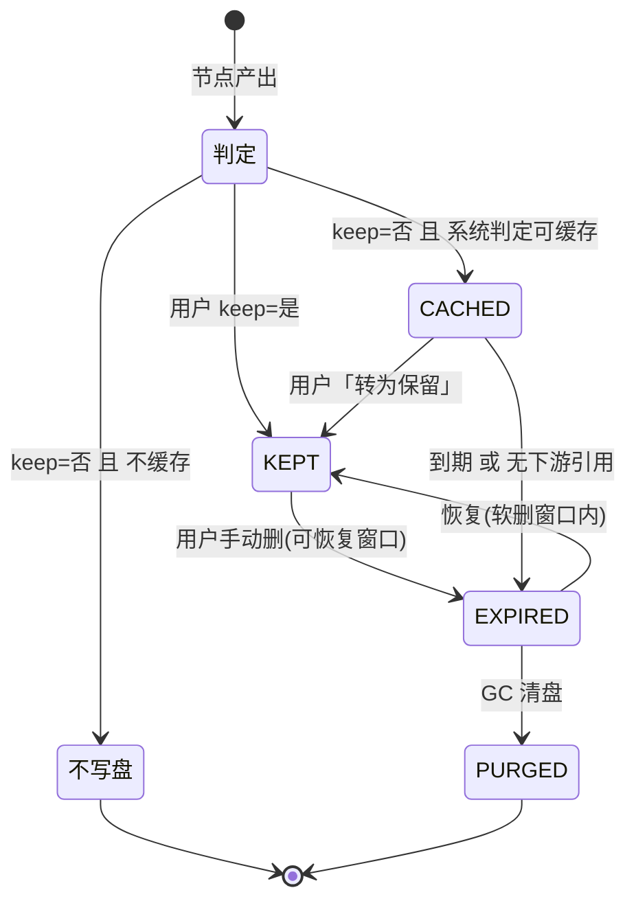

# Save 保留策略 · 重构方案（定稿）

> 日期：2026-06-09
> 状态：**决策已定（Q1–Q10 全部拍板）**，待落地（执行方案另出）
> 关系：`Save功能管理.md` 是 v1 现状底稿；`Study发布与权限模型.md` 接手「输出 publish 轴」（消解 L11/L12/L15）
> ⚠️ 代码行号以讨论当时为准——**另有 session 正对该代码做大手术**，落地前需按最新代码复核

---

## 0. 一句话主张

> **当前把三种不相干的语义塞进了一个 `retention_status` 字段——「用户要不要」「系统缓不缓存」「文件现在什么状态」全挤在一起，所以乱。**
> 重构核心：**拆成三层、各管各的**——
> - **用户只做一个二元选择**：这个产物 **保留 / 不保留**。
> - **系统自动决定缓存**：按「计算成本 × 落盘成本」算 ROI，用户不可见、不参与。
> - **生命周期状态退到后台**：active / expired / purged 是系统记账，不进用户词汇表。

这正是爸爸三条意见的落地：① 用户二元；② 砍掉 pinned/temporary/deleted/quarantined 的用户暴露；③ 缓存自动化。

---

## 1. 术语与中英对照

| 中文 | 英文 | 说明 |
|---|---|---|
| 输出（原「派生数据集」） | output / **StudyOutput** | Pipeline 节点算出来、登记在册的数据文件。**2026-06-09 拍板全栈改名**：`derived_dataset` → 输出/Output；代码用 `StudyOutput` 前缀，避开节点「输出槽 output slot」撞词 |
| 产物 | artifact | 一次节点执行落盘的一份文件，等价上面 |
| 保留策略 | retention policy | 「这份产物存多久」的规则 |
| 保留状态 | retention status | 当前字段，6 个枚举值（要拆掉的对象） |
| 保留 / 不保留 | keep / discard | **新设计**给用户的唯一二元选择。中文求直白，英文 discard 是 EEG 预处理母语（如 discard bad epochs）；中英不强求直译 |
| 缓存 | cache | 系统为「避免重算」而暂存中间产物，自动、对用户透明 |
| 缓存命中 | cache hit | 重跑时发现输入没变，直接复用旧产物、跳过计算 |
| 计算成本 | compute cost | 重算这个节点要多久（含人工等待） |
| 落盘体积 | output footprint | 这个节点产物多大 |
| 投资回报 | ROI (return on investment) | 缓存性价比 = 省下的机器重算 ÷ 占用存储；**存储权重更大**（存储优先，见 §4.2）|
| 物化 | materialize | 把内存里的中间结果写成实体文件 |
| 流式 / 在线平均 | streaming / online averaging | 边算边累加、不保留全部中间态（如 TFR average=True） |
| 拓扑角色 | topology role | 节点在流程图的位置：末端 leaf / 中间 intermediate / 源 source |
| 按内容寻址 | content-addressed | 文件按自身 sha256 哈希命名存放 |
| 去重 | dedup (deduplication) | 同哈希只存一份 |
| 生命周期状态 | lifecycle state | 文件内部状态机：活着 / 到期 / 已清盘 |
| 垃圾回收 | GC (garbage collection) | 真正删磁盘、释放空间（区别于「软删只改标记」） |
| 软删 | soft delete | 只改 `deleted_at` 标记，物理文件还在。后端在用（删除端点 `pipelines.py:689` + cleanup + 恢复 + 查询过滤），但**前端无「回收站」入口**，所以体感上"没用到"——去留见 Q8 |
| 内存溢出 | OOM (out of memory) | 数据装不下内存、进程被杀 |
| 预检估算 | pre-flight estimation | 跑之前先估体积/内存，超标就警告或拦截 |
| 发布生命周期 | publish lifecycle | **另一根轴**：**unpublished**/published/withdrawn，管「能否跨 Study 共享」，与 retention 正交。⚠️ 代码现用 `draft`，**违反 3-25 既定标准**（数据集 `DatasetVersion.state` 早用 `unpublished`），须对齐 |

---

## 2. 现状审核（逐层，带实锤）

### 2.1 ⚠️ 同一个「存多久」概念，散在 5 个地方、5 套词

| 层级 | 字段 / 来源 | 取值 | 代码位置 |
|---|---|---|---|
| 数据库 | `derived_datasets.retention_status` | current / pinned / cached / temporary / deleted / quarantined（6） | `05_derived.sql:48` |
| 节点参数（前端下拉） | node `retention` | ''(自动) / current / pinned / cached / none（5） | `PipelinePage.vue:993` |
| Execution 整体 | `save_policy` | temporary / current / pinned / discard（4） | `schemas/pipeline.py:15` |
| 单产物改状态 API | `DerivedDatasetUpdate.retention_status` | current / pinned / cached / temporary / deleted（5，**已悄悄去掉 quarantined**） | `schemas/derived_dataset.py:112` |
| Study 默认策略 | `derived_dataset_retention_policy` | 自由 dict（**无结构化**） | `schemas/study.py:125` |

**没有单一事实源。** 五处取值集合两两不同，`none`/`discard`/`temporary` 三个「不保留」语义各起一名。

### 2.2 六个 DB 状态逐个验生死

| 状态 | 谁在写 | 谁在读 | 判定 |
|---|---|---|---|
| `current` | 拓扑默认(leaf)、用户、API | 结果页展示 | ✅ 活 |
| `cached` | 拓扑默认(intermediate) | 清理任务回收 | ✅ 活 |
| `temporary` | Execution savePolicy、`none`→映射(`save_settings.py:289`) | 清理任务回收 | ✅ 活 |
| `deleted` | 清理任务软删、可恢复(`pipelines.py:691`) | 过滤展示 | ✅ 活（内部态） |
| `pinned` | 用户 override、PATCH API | **清理任务本就不碰 current，pinned 无独有保护逻辑** | ⚠️ **冗余**（≈current） |
| `quarantined` | **derived 里从没人写**（schema 层已排除） | — | ❌ **死状态** |

> 注意区分：`quarantined` 在 **dataset_assets**（数据集资产，`03_datasets.sql`）是活的——管理员隔离问题数据。但在 **derived_datasets**（我们讨论的 Save）里是纯死声明。别误删前者。

### 2.3 当前所有节点「一刀切」全缓存

10 个节点的 spec **无差别** `cache: {enabled: true}`，不分计算贵贱、产物大小：

| 节点 | cache.enabled | 实际该不该缓存（见 §4.5） |
|---|---|---|
| Filter / Resample / Rereference | true | ❌ 算得快、产物大，重算比存还划算 |
| ICA Compute | true | ✅ 算得贵、产物小，**最该缓存** |
| Epoch / ERP Average | true | ❌ 算得快，缓存无所谓 |

> 这就是爸爸第 3 点要解决的：缓存现在是「拍脑袋全开」，没有按 ROI 区分。

### 2.4 ⚠️ 更正 v1 的一处结论

v1 底稿写「`none` 选项落库撞 CHECK 约束报错」。**该 bug 已在本轮讨论期间修复**：`save_settings.py:285-289` 现在把 `none → temporary`（合法值），注释明确。以当前代码为准，此项作废。但它暴露的根因仍在——`none` 这个词本就不该存在（见 §3 L2）。

---

## 3. 提出的问题：逻辑缺陷清单（核心）

| # | 缺陷 | 实锤 / 说明 | 严重度 |
|---|---|---|---|
| **L1** | **一个字段塞三种语义** | `retention_status` 同时表达「用户意图(current/temporary)+系统缓存(cached)+内部状态(deleted)」。根因病灶 | 🔴 高 |
| **L2** | **五层五套词，无单一事实源** | 见 §2.1。`none`/`discard`/`temporary` 同义不同名 | 🔴 高 |
| **L3** | **缓存与用户意图耦合** | 用户想「我不要，但系统可缓存加速」无法表达——cached 和 current/temporary 挤一个字段，只能选一个 | 🔴 高 |
| **L4** | **一刀切全缓存，无 ROI** | §2.3。滤波缓存是负收益，单试次 TFR 缓存是 OOM 灾难 | 🔴 高 |
| **L5** | **死状态 quarantined** | derived 里从没写过，schema 已排除，DDL 还留着 | 🟡 中 |
| **L6** | **pinned 名不副实** | 承诺「钉住不被删」，但清理任务本就不碰 current，且无防手动删逻辑——pinned 没兑现任何独有保护 | 🟡 中 |
| **L7** | **「不保留」≠「不占盘」** | `none→temporary`，但若 expires=NULL 且 GC 未接，文件其实一直在盘上。用户预期被违背 | 🟡 中 |
| **L8** | **软删 ≠ 清盘，GC 疑似缺位** | `file_tasks.py:106` 注释「物理清盘由后续 GC 完成」——疑未实现，空间不真释放 | 🟡 中 |
| **L9** | **节点 vs Execution savePolicy 覆盖关系未定义** | Execution=discard、节点=current，产物留不留？无规则——**实为伪问题：`save_policy` 是死配置（见 L14），砍掉即消解** | 🟡 中 |
| **L10** | **Study 级 retention policy 是空壳** | `derived_dataset_retention_policy` 是自由 dict，没结构、没消费方 | ⚪ 低 |
| **L11** | **retention 与 publish 两轴易混** | retention 和 publish 正交却都叫「生命周期」 — ✅ **由发布模型解决**：输出砍 publish 轴、可见性继承 Study（见 `Study发布与权限模型.md`） | ✅ 已解 |
| **L12** | **发布轴 `draft` 违反既定标准** | 输出 `draft` vs 数据集/3-25 的 `unpublished` — ✅ **由发布模型解决**：输出砍 publish 轴，不再有 lifecycle_state | ✅ 已解 |
| **L13** | **删除侧可能过度设计** | 软删（soft delete）后端在用但 UI 无回收站入口；`active/expired/purged` 三态中 expired→purged 的拆分仅为异步 GC + 恢复窗口服务，若都不要可合并 | 🟡 中 |
| **L14** | **`save_policy` 是伪设置** | Execution.save_policy 被创建 / 存储 / 展示 / 复制，却**从不驱动任何产物 retention**（实际由 save_settings 按节点定）——空转死配置，还逼用户选 | 🟡 中 |
| **L15** | **`lifecycle_state` 默认值 DDL/ORM 自相矛盾** | ORM default=`unpublished` vs DDL default=`draft`，过不了 CHECK — ✅ **由发布模型解决**：输出砍 publish 轴，该字段删除 | ✅ 已解 |

---

## 4. 重构设计：三层解耦

### 4.1 用户面 —— 只有一个二元选择

每个节点产物，用户只回答一个问题：**这个结果我要不要留？**

- **保留（keep）** / **不保留（discard）**，二选一。没有别的。
- 默认：**末端节点=保留，中间节点=不保留**（拓扑自动给默认，用户通常不用动）。
- UI：节点上一个小图标开关（💾 保留 / ○ 不保留），不是下拉框、不进参数面板主区。
- **缓存对用户可见但标注**（爸爸第 1 点）：用户「不保留」的中间步若被系统缓存，**在工作流页双击该节点可见**（过程视角）；**结果页只放 keep 的成品**、不混入缓存，结构更干净。

### 4.2 系统面 —— 自动缓存策略（爸爸第 3 点）

**原理（2026-06-09 调整：存储优先）：**
> 缓存价值 ∝ 省下的机器重算；缓存代价 ∝ 占用存储（体积 × 保留期）。
> **存储权重 > 计算权重**——机器重算几秒可忍，磁盘爆了是硬伤。默认倾向不缓存，只有"省得特别多、占得特别少"才破例。
> 两条硬规则优先于评分：**产物爆炸（explosive）绝不物化全量**；评分为负一律不缓存。

**给每个节点 spec 加两个标签 + 一个全局旋钮：**

- `compute_cost`: cheap=1 / moderate=2 / expensive=3（机器重算成本档）
- `output_footprint`: small=1 / medium=2 / large=3 / explosive=硬规则不物化
- `STORAGE_WEIGHT`（全局旋钮）= **2** —— 存储比计算重要几倍，越大越省空间

**评分：** `cache_score = compute_cost − STORAGE_WEIGHT × output_footprint`，`> 0` 才缓存。

| 节点 | compute | footprint | cache_score（W=2） | 结论 |
|---|---|---|---|---|
| ICA Compute | 3 | 1 | **+1** | ✅ 缓存 |
| TFR average | 2 | 1 | 0 | 不缓存（边界） |
| ERP Average | 1 | 1 | −1 | 不缓存 |
| Epoch / Resample | 1 | 2 | −3 | 不缓存 |
| Filter / Rereference | 1–2 | 3 | −4~−5 | 不缓存 |
| ICA Apply | 2 | 3 | −4 | 不缓存 |
| TFR 单试次 | — | explosive | 硬规则 | ⛔ 不物化 |

**效果：当前 10 节点里只有 ICA Compute 被缓存**（算得最久、产物最小）。其余跑完即走、省空间。`STORAGE_WEIGHT` 调大 → 更激进省空间；调小 → 放宽到 TFR average 等也缓存。`STORAGE_WEIGHT` 这一个数就是「省空间 ↔ 省时间」的刻度盘。

### 4.3 存储状态机 —— 内部记账，不暴露

内部状态机由系统维护，**按删除来源分两条线**（Q9 定）：

- **缓存到期**（系统中间产物）：`active` → 到期 **直接 GC 清盘**，不进回收站（用户从没"保留"它，无需反悔）
- **用户删的输出**：`active` → `deleted`（软删，进回收站、可恢复 N 天）→ 宽限期后 **GC 清盘**

三个内部态：`active`（在）/ `deleted`（软删待清，仅用户删的）/ 已清盘（GC 后从库消失）。

**用户可见状态词 ≠ 内部状态机**。上面是系统记账，**不直接给用户看**；用户只在这几处看到语境化正式词，其余不标：

| 何处 | 用户看到 | 正式词（中 / 英） |
|---|---|---|
| 结果页（保留的成品） | **不标状态**——都有效，标了反而杂 | （无标签） |
| 工作流页双击节点（缓存中间步） | 标 | **缓存 / cached** |
| 回收站（用户删的，可恢复） | 标 + 倒计时 | **已删除 / deleted** ＋「剩 N 天自动清除」 |
| GC 清盘后 | 从列表消失，**不显示** | —（内部 `purged`） |

> 即"在 / 没了"是讲解用的大白话；用户实际只看到 **缓存** 和 **已删除** 两个词，正常输出无标签、彻底清除则消失。

### 4.4 三层如何推导产物命运

| 用户 keep | 系统 cache | 产物命运 | 旧状态对应 |
|---|---|---|---|
| 是 | — | **KEPT** 永久 active | current（+pinned 并入） |
| 否 | 是 | **CACHED** active + 到期回收 | cached |
| 否 | 否 | **DISCARDED** 根本不写盘 / 算后即弃 | none/temporary/discard |

> 关键：「保留」「缓存」「状态」三者**正交**。用户改 keep 不影响系统 cache 决策；系统 cache 不污染用户语义；状态机独立演进。`pinned`/`quarantined` 删除，`temporary`/`deleted` 降为内部 lifecycle，不进用户词汇。

### 4.5 现有 10 节点的画像 + 自动缓存结论

| 节点 | compute_cost | output_footprint | 自动缓存 | 理由 |
|---|---|---|---|---|
| LoadData | n/a（源） | — | — | 引用原始数据 |
| Filter (FIR/IIR/Notch) | cheap–moderate | large（=输入连续 raw） | **不缓存** | 算得快、产物大，重算更划算 |
| Resample | cheap | medium | 不缓存 | 同上 |
| Rereference | cheap | large | 不缓存 | 同上 |
| **ICA Compute** | **expensive**（迭代分钟级） | **small**（unmixing 矩阵 ~MB） | ✅ **缓存** | ROI 最高：省大量重算、占空间极小 |
| ICA Apply | moderate | large（cleaned raw） | 不缓存 | score −4；成分已存为参数，重跑只按选定成分重构、不贵 |
| Epoch | cheap | medium | 不缓存 | 算得快 |
| ERP Average | cheap | small（evoked） | 不缓存 | 算得快、产物小，无所谓 |
| **TFR 单试次**（规划） | moderate–expensive | **explosive**（×n_epochs） | ⛔ **不物化全量** | 见 `Save功能管理.md` 附录：流式 average，绝不落单试次 |
| TFR average（规划） | moderate | small | 不缓存（边界 score 0） | 旋钮 STORAGE_WEIGHT 调小则纳入 |

> 这张表本身就是「自动化标准」的样板：spec 标两个标签 → 查 §4.2 表 → 自动得缓存结论。**新增节点照此填标签即可，无需任何人工决策。**

### 4.6 删除侧：回收站 + GC 清盘（Q5 / Q8 深化）

**先分清：删节点 ≠ 删输出。**
- 删**节点**（画布编辑）：删错重新拖一个、重连即可，不需要回收站。
- 删**输出**（算出来的数据文件，如「被试 03 的 ERP」）：删错没法"拖一个出来"——**每个输出背后可能是一整条工作流的计算**（加载 → 滤波 → ICA → … → ERP），要回来得重跑整条链（而 `replay` 一键重放还没实现，得手动重跑）。粒度是**单个输出**，不是节点、不是整条 pipeline。

**回收站 UI：要做**（爸爸 0609 拍）。删错代价 = 重跑整条 pipeline，秒级 restore 显然划算：

| 件 | 说明 | 状态 |
|---|---|---|
| 回收站 UI | 「已删除」列表 + restore 按钮 | 前端新增一个列表页 |
| 软删标记 `deleted_at` | 删的瞬间打标、文件留着 | 已有、零成本 |
| N 天后 GC 真清盘 | 过了恢复窗口才物理删 | 跟 GC 一起做 |

> 用户视角：删 → 进**回收站**（N 天可捡回）→ 到期 GC 清。**不做 undo/redo**（撤销操作序列，复杂度高一个量级，对删一个结果过度；画布编辑若要 undo/redo 是编辑器的独立事）。⚠️ `replay` 目前是空枚举未实现，所以"重跑找回"现在得手动——这恰恰说明回收站更有价值。

**GC 清盘时机 = 三层组合（不是三选一）：**

| 层 | 角色 | 现状 |
|---|---|---|
| 定时（celery beat） | 基线，保证过期最终被清 | cleanup task 现成，挂定时即可 |
| 硬盘水位 | 应急防爆盘：超高水位（如 85%）触发，清到低水位（如 70%） | 需新增磁盘监控 |
| 管理员手动 + dry-run | 逃生阀 + 预览「将清什么、释放多少」 | cleanup 已支持 `dry_run` |

**⚠️ 正确性 > 时机**：删物理文件前必须确认无活跃 execution/job 引用——现有 `artifact_dependency_blockers` 已在做（有下游依赖就跳过）。同 study 内 `sha256` 唯一（1 行 ↔ 1 物理文件），无"误删共享文件"坑。GC 真正要新写的只有「物理删除」这一步。

---

## 5. 简化后的生命周期

对比旧的 6 状态枚举：用户只感知 KEPT / CACHED 两种「看得见」的，EXPIRED/PURGED 是后台。

---

## 6. 落地改动清单（逐层）

| 层 | 现状 | 改动 |
|---|---|---|
| **数据库** `05_derived.sql` | `retention_status` 6 态混一字段 | 拆 `keep BOOL`（用户意图）+ `cache_eligible BOOL`（系统判定）+ `lifecycle`（active/expired/purged）；删 pinned/quarantined；`retention_expires_at` 仅 cache 用 |
| **节点 spec** `nodes/*.json` | 一刀切 `cache.enabled=true` | 加 `compute_cost` + `output_footprint`；缓存由 §4.2 表自动算，删 enabled 手动开关 |
| **保存逻辑** `save_settings.py` | none→temporary 等映射 | 重写为输出 (keep, cache_eligible)；删 `_normalise_retention_param` 那套字面值兼容 |
| **清理任务** `file_tasks.py` | 软删 temporary/cached | 接 GC 真清盘（补 L8）；按 lifecycle 扫 expired |
| **API** `schemas/derived_dataset.py` | retention_status Literal 5 值 | 改 PATCH 为 `keep: bool` + 「转为保留/丢弃」动作 |
| **前端** `PipelinePage.vue` | 保留策略下拉 5 选项 | 改二元开关 + 缓存产物「临时」标注；删 Execution savePolicy 4 选项或对齐 |
| **Execution** `schemas/pipeline.py` | savePolicy 独立 4 值、**实为死配置** | **直接砍掉 `save_policy`**（从不驱动 retention）；保存归节点 keep + 系统缓存；`execution_mode` 保留管校验、不碰保存 |
| **Study 策略** `schemas/study.py` | 空壳 dict（死配置、无消费方） | **砍掉 `derived_dataset_retention_policy`**（同 save_policy）；保存归节点 keep + 系统缓存（L10）|
| **全栈命名** | `derived_dataset`（572 代码处/39 文件 + 148 wiki 处/33 文件） | → `输出 / StudyOutput`：DB `derived_datasets`→`study_outputs`、API `/derived-datasets`→`/outputs`、model/类型 `DerivedDataset`→`StudyOutput`、前端文案统一「输出」（避开节点 output slot 用前缀） |
| **输出 publish 轴** | `derived_datasets.lifecycle_state` + `visibility` | **砍掉**——发布上提 Study、输出可见性继承所属 study（详见 `Study发布与权限模型.md`，消解 L11/L12/L15）|
| **wiki** | `5-20`/`3-45`/`3-25` 各述一套 | 结论敲定后统一回写，单一事实源 |

---

## 7. 与其它「保存层级」的收敛

现在有 4 个层级都在管「存多久」，建议收敛为**意图向下传递、节点为最终事实源**：

- **Study 默认** → 给新节点 keep 默认值（可选）
- **Execution** → ~~savePolicy~~ **已砍**（死配置，从不驱动 retention）；`execution_mode`（trial/analysis）只管校验、不碰保存
- **节点 keep** → **最终事实源**，覆盖上面
- **系统 cache** → 完全正交，任何层都不该碰

---

## 8. 决策记录（Q1–Q10 均已拍板 2026-06-09）

| # | 议题 | 倾向 |
|---|---|---|
| Q1 | 接受「keep / cache / lifecycle 三层解耦」总框架？ | ✅ **已拍板 0609：接受** |
| Q2 | `compute_cost` × `footprint` 标签用**枚举档位**还是**估算数值**？ | ✅ **已拍板：枚举档位** |
| Q3 | 决策表边界默认缓存还是不缓存？ | ✅ **已拍板：不缓存**（评分制已吸收，取消"交互节点例外"）|
| Q4 | `pinned` 直接删、还是另立「防误删锁」？ | ✅ **已拍板：直接删 pinned** |
| Q5 | GC 清盘一起做？触发时机？ | ✅ **一起做**；时机 = 定时 + 水位 + 手动**三层**（§4.6）|
| Q6 | Execution savePolicy 与节点 keep 谁覆盖？ | ✅ **消解**：`save_policy` 是死配置，**直接砍**；保存只由节点 keep + 系统缓存定 |
| Q7 | 缓存产物「可见但标注」放哪？ | ✅ **工作流页双击节点可见**；结果页只显示 keep 的成品 |
| Q8 | 回收站要不要？ | ✅ **要做**：每个输出背后是整条工作流、重跑成本高，秒级 restore 划算。UI=已删列表+restore；底层 `deleted_at` + N 天后 GC 清（§4.6）|
| Q9 | 删除侧状态？ | 缓存到期**直接清**（在/没了）；用户删的输出走**回收站**（在 → 回收站 → GC 清，§4.6）|
| Q10 | 发布轴 `draft`→`unpublished`？ | ✅ **早已定（0609 提出即确认）：改**，修偏离、对齐数据集 |

---

## 9. 关联 wiki / 代码 / 数据库

**代码**：`pipeline/save_settings.py`、`pipeline/cache.py`、`pipeline/derived_dataset_store.py`、`pipeline/topology.py`、`tasks/file_tasks.py`、`pipeline/nodes/*.json`、`schemas/derived_dataset.py`、`schemas/pipeline.py`、`schemas/study.py`、`routers/pipelines.py`、`views/PipelinePage.vue`
**数据库**：`database/schema/05_derived.sql`（derived_datasets）
**wiki**：`5-20-Pipeline工作流管理.md`、`3-45-DerivedDataset.md`、`3-25-数据集生命周期与发布机制.md`、`4-30-Study输出与Artifact.md`
**同目录**：`Save功能管理.md`（v1 现状底稿 + TFR 附录）
