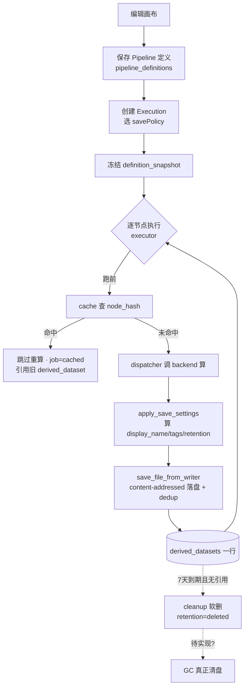

# Save 功能管理 · 工作流产物保存机制（讨论底稿）

> 日期：2026-06-09
> 状态：**讨论中**（结论敲定后再回写 wiki `5-20` / `3-45` / `3-25`，本文不是规范）
> 起因：节点参数面板的「保留策略」下拉对用户是否太重？每个节点都暂存，空间 / 效率是否划算？
> 事实底座：以下结论均核到代码具体行（事实源优先级 P0=代码）。

---

## 0. 这份文档要干嘛

把工作流「保存」这条线的**现状、机制、数据落点、不一致点、待决策**一次性铺开，供我们逐条讨论。
每节末尾留「💬 讨论钩子」。最后第 9 节是**待决策清单**，是这次会议的主菜。

阅读提示：本文混用了一些工程黑话，第一次出现会带一句大白话。

---

## 1. 先分清两个「保存」（最容易混的地方）

工作流里「保存」其实是两件完全不同的事，落在两张表：

| | 保存 **Pipeline 定义** | 保存 **节点产物** |
|---|---|---|
| 通俗说 | 存「这条流程怎么处理」 | 存「这一次跑出来的数据文件」 |
| 落库 | `pipeline_definitions` | `derived_datasets` |
| 关键机制 | version 版本号 / edit-lock 编辑锁 / status 状态 | **retention 保留策略 / dedup 去重 / cleanup 清理** |
| 已有文档 | wiki `5-20` 第 1~4 节 | 几乎没成文 ← **本文重点** |

> `derived_dataset`（派生数据集）= 由 Pipeline 节点算出来、登记在册的数据文件，取代了旧的 `pipeline_artifacts` + `analysis_results` 两张表。

**本文只谈第二个**（那个下拉框管的就是它）。但提前预警：其实还藏着**第三个层级**——Execution 级的 savePolicy，见 §6，它和节点级 retention 没对齐。

💬 讨论钩子：用户脑子里「保存」是一个概念还是三个？UI 上要不要让他感知到这种分层？

---

## 2. 现状：每个处理节点都把产物落盘

`dispatcher.py` 里，滤波 / ICA / Epoch / ERP **每个节点、每份产物**都会调
`derived_dataset_store.save_file_from_writer(...)` 写一个完整 fif 文件 + 登记一行 `derived_datasets`
（见 `dispatcher.py:244 / 359 / 465 / 672 / 803`）。

落盘方式是 **content-addressed**（按内容寻址：文件存到以自己 sha256 哈希命名的目录）：
`study_root/derived/{sha256[:2]}/{sha256}/文件名`（`derived_dataset_store.py:538`）。

**为什么要每步都存？** 不是无脑暂存，它同时撑起 4 件事：

1. **预览**——每个节点 spec 里都有 `preview_type`（如 filter 是 `time_series` 时序波形、ICA 是成分图），前端要看中间结果就得有文件。
2. **缓存续跑**——见 §4，改下游参数重跑时，上游没变的节点直接复用旧文件、不重算。
3. **人机交互暂停**——ICA Apply 节点 `interactive: true`，要中途停下让人挑要剔除的成分，中间产物必须落盘等用户决策。
4. **追溯**——科研级可复现：每步产物 + 上下游依赖 + manifest 全留痕。

💬 讨论钩子：这 4 个目的里，**预览**其实只需要一张缩略图 / 降采样曲线，不需要完整 fif；**缓存**只在「会重跑」时才有价值。能不能把「预览」和「完整产物」拆开？（→ D2）

---

## 3. retention 保留策略 —— 核心，也是最乱的地方

### 3.1 一个产物存多久，由 `retention_status` 决定

DB 里 `derived_datasets.retention_status` 的合法值有 6 个（`05_derived.sql:48` CHECK 约束）：

| 值 | 大白话 | 谁用 |
|---|---|---|
| `current` | 永久保留，用户在结果页能看到 | 末端结果默认 |
| `pinned` | 钉住，**永远不被清理任务碰** | 用户手动钉重要产物 |
| `cached` | 缓存，默认 7 天后清 | 中间步默认 |
| `temporary` | 临时（试跑产物，可清理） | Execution 试跑 |
| `deleted` | 已软删（清理任务打的标） | 系统 |
| `quarantined` | 隔离 | **当前没用上** |

### 3.2 默认值由「拓扑角色」自动决定，用户通常不用管

> 拓扑角色（topology role）= 节点在流程图里的位置。**leaf**（叶子 / 末端，没有下游节点）；**intermediate**（中间，后面还接了别的节点）。

- `leaf` → `current`（永久）
- `intermediate` → `cached`（7 天）

见 `save_settings.py:173 default_retention_for_role`。那个下拉框的默认项「自动（按拓扑）」走的就是这个——**90% 情况用户不用碰下拉框**。

### 3.3 ⚠️ 三套命名各说各话（重点讨论 D3）

同一个「产物存多久」的概念，**三个地方用了三套不一样的词**，而且对不齐：

| 语义 | DB CHECK（6 值） | 节点下拉（前端 retention） | Execution savePolicy | `save_settings` 接受的输入 |
|---|---|---|---|---|
| 永久保留 | `current` | `current` | `current` | `current`（兼容 `study`/`permanent`/`keep`）|
| 钉住 | `pinned` | `pinned` | `pinned` | `pinned` |
| 缓存 7 天 | `cached` | `cached` | — | `cache`/`cached` → 回落拓扑默认 |
| 临时 / 试跑 | `temporary` | — | `temporary` | `temporary`/`trash` → **映射成 `none`** |
| 不保留 | **（无此值）** | `none` ⚠️ | `discard` | `none` |
| 已软删 | `deleted` | —（系统打） | — | — |
| 隔离 | `quarantined` | —（没用） | — | — |
| 自动按拓扑 | — | `''`（空） | — | `None` → 回落拓扑 |

**两个确凿的坑：**

- ⚠️ **`none` 根本不是合法 DB 值**。前端下拉有「none — 不保留」（`PipelinePage.vue:997`），`save_settings.py:285` 也会原样返回 `retention_status="none"`，但 `05_derived.sql:48` 的 CHECK 里**没有 `none`**。代码路径看下来（`derived_dataset_store.py` 直接把 metadata 里的 `retention_status` 写库，未见 `none`→合法值的转换）——**用户真选了 none，落库大概率撞 CHECK 约束报错**。需实跑验证。（→ D1）
- ⚠️ 连兼容映射都是坏的：`save_settings.py:197` 把 `temporary`/`trash` 映射成 `none`，而 `none` 本身非法。

💬 讨论钩子：要不要砍成**一套词**？例如全用 DB 的 `current/pinned/cached/temporary`，把 `none`/`discard` 统一成 `temporary`（试跑即清）或干脆删掉「不保留」这个选项。

---

## 4. 三道空间 / 效率缓冲（回应「每步暂存会不会浪费」）

每步落盘**不是纯开销**，有三道机制兜底：

1. **缓存跳过重算（已实现，不是「未来」）**
   节点跑之前，`executor.py:535 _restore_cached_node_output` → `cache.py PipelineCache.restore_node_output`，
   按 `node_hash`（节点类型+输入+参数算出的指纹）查历史 job，命中且文件 sha256 校验通过就**跳过执行**，job 标 `cached`。
   → 调下游参数重跑，上游没变的节点秒过。**暂存=为了不重算，是投资。**
   ⚠️ 注意 wiki `5-20` 第 6 节还写缓存「未来用于」——文档滞后了，以代码为准。

2. **content-addressed dedup（去重）**
   同一个 `(study_id, sha256)` 在 `derived_datasets` 只存一行（`05_derived.sql:164` UNIQUE 索引 + `derived_dataset_store.py:310` 查重）。
   就算缓存没命中、节点重算了，只要算出来字节相同，物理文件和 DB 行都不会重复。→ 重复跑不会线性膨胀。

3. **cached 7 天自动清（已实现）**
   `file_tasks.py:102 run_derived_dataset_cleanup`：扫 `retention_status in (temporary, cached)`、`retention_expires_at` 已过期、且**没有下游引用**的产物，把状态改成 `deleted` + 盖 `deleted_at`。

   ⚠️ **但「清状态」≠「清磁盘」**：`file_tasks.py:106` 注释明说「物理文件保留，实际清盘由后续 garbage collector 完成」。这个 GC（垃圾回收，真正删盘释放空间）**注释口径是"后续"，疑似还没接**。若如此，软删之后磁盘并没真正释放。（→ D7，需验证）

💬 讨论钩子：缓存的 ROI 完全取决于「用户会不会重跑同一条 pipeline」。如果实际上大家都是跑一次拿结果就走，那中间产物的缓存价值≈0，只剩占空间——这条要靠你的使用直觉拍。（→ D9）

---

## 5. 数据落点（表 + 字段）

`derived_datasets` 关键字段（`05_derived.sql`）：

| 字段 | 作用 |
|---|---|
| `retention_status` / `retention_expires_at` | **物理保留**：存多久、何时到期 |
| `sha256` | 内容指纹，dedup 的依据（UNIQUE 索引） |
| `deleted_at` | 软删时间戳 |
| `display_name` / `tags` | 用户看到的名字 + 分类标签（`save_settings.py` 模板渲染 + 冲突自动加 `(2)(3)`） |
| `produced_by_*` / `upstream_*` | 追溯：哪个 execution/job/node 产的、上游是谁 |
| `lifecycle_state` / `visibility` | **发布可见**：draft/published/withdrawn × private/shared |

⚠️ **两套正交的生命周期，别混**（这是个隐藏复杂度）：

- **retention_***（物理保留）：这份文件在磁盘上**存多久**。
- **lifecycle_state + visibility**（发布可见）：这份派生数据**能不能跨 Study 被别人引用**（draft 私有 → published 可共享）。见 `3-25` / `3-45`。

这俩是**两个维度**：一个产物可以「永久保留(current) 但仍是私有草稿(draft/private)」。目前 UI 只暴露了 retention，没暴露 lifecycle。

💬 讨论钩子：用户要不要在工作流里就感知到「发布」这个维度？还是只在结果页 / 数据管理页处理？

---

## 6. 被忽略的第三层：Execution 级 savePolicy

创建一次运行时，前端还有一组**整体保存策略**（`PipelinePage.vue:1291 SAVE_POLICY_OPTIONS`）：

| savePolicy | 说明 |
|---|---|
| `temporary` | 可清理的试跑输出 |
| `current` | 当前认可的分析结果 |
| `pinned` | 长期保留的重要输出 |
| `discard` | 仅保留执行记录（产物丢弃） |

这是**整个 Execution** 的默认保存策略，和 §3 单个**节点**的 retention 是**两层**。

⚠️ **两层怎么交互，目前没有明确定义**：Execution 选了 `discard`、但某个 leaf 节点 retention=`current`，最终这份产物到底留不留？谁覆盖谁？（→ D4）

💬 讨论钩子：是「Execution 定大盘、节点可微调」，还是「节点说了算、Execution 只设默认」？需要一条明确规则。

---

## 7. 调用链全景

---

## 8. 痛点汇总

| # | 痛点 | 性质 |
|---|---|---|
| P1 | 只跑一次不重跑 → 缓存价值≈0，中间产物纯占空间 | 设计权衡 |
| P2 | 大数据 × 长链 → 7 天内峰值占用可能是原始数据数倍（EEG raw fif 本就大） | 设计权衡 |
| P3 | 每步写完整 fif → IO 开销，即便将来命中缓存，这一次也得先写下去 | 设计权衡 |
| P4 | 软删 ≠ 清盘，GC 疑似没接 → 磁盘可能根本没释放 | ⚠️ 疑似缺陷 |
| P5 | 节点 `none` 选项可能写库失败 | ⚠️ 确凿不一致 |
| P6 | retention 三套命名打架 + 节点/Execution 两层没对齐 | ⚠️ 设计债 |
| P7 | 下拉框平铺在参数面板，视觉上逼用户做存储决定 | UX |

---

## 9. 待决策清单（本次会议主菜）

| # | 议题 | 选项 / 倾向 |
|---|---|---|
| **D1** | 节点 `none` 选项的坑怎么修？ | (a) 删掉 none 选项 (b) 映射到 `temporary` (c) 给 DB 加 `none` 枚举。**倾向 (b)**——语义就是「试跑即清」 |
| **D2** | 中间产物默认存不存？ | (A) 保持现状 (B) **预览与完整产物解耦**：中间默认只存轻量预览，完整 fif 仅在「开了缓存且会重跑」时留 (C) 惰性物化：默认内存/临时，跑完只固化末端。**倾向 A+B** |
| **D3** | retention 要不要统一成一套词？ | 倾向：全用 DB 的 `current/pinned/cached/temporary`，砍掉 `none`/`discard` |
| **D4** | 节点 retention vs Execution savePolicy 谁覆盖谁？ | 需定一条明确规则 |
| **D5** | 下拉框收进「高级」折叠区、默认无感？ | 倾向：是（纯 UX，改动小） |
| **D6** | `cache_retention_for_role` 硬编码 `current` 未接（`cache.py:21` 注释自陈），缓存命中复制行没按 leaf/intermediate 分级，要不要补？ | 待定 |
| **D7** | GC 清盘到底实现了没？没有的话软删数据一直占盘 | **先验证再说**，影响 P4 严重性 |
| **D8** | `pinned` 谁来钉、什么场景钉？入口在哪？ | 待定 |
| **D9** | 用户实际会经常重跑同一条 pipeline 吗？ | **你拍**——决定缓存整体 ROI，进而决定 D2 |

---

## 10. 关联文件清单

**后端代码**

| 文件 | 职责 |
|---|---|
| `pipeline/save_settings.py` | 算 display_name / tags / retention（spec.save + 拓扑 + 用户参数合成） |
| `pipeline/dispatcher.py` | 每节点调 save、落盘、登记 derived_dataset |
| `pipeline/derived_dataset_store.py` | content-addressed 落盘 + dedup + 写 derived_datasets 行 |
| `pipeline/cache.py` | 节点级缓存命中、复用旧产物 |
| `pipeline/executor.py` | 执行编排，跑前查缓存 |
| `pipeline/topology.py` | 拓扑角色判定（leaf / intermediate） |
| `tasks/file_tasks.py` | `run_derived_dataset_cleanup` 过期清理 |
| `pipeline/nodes/*.json` | 各节点 spec 的 `save` / `cache` / `preview_type` 子对象 |

**前端**

| 文件 | 职责 |
|---|---|
| `views/PipelinePage.vue` | 「保留策略」下拉、Execution savePolicy、保留 badge |

**数据库**

| 文件 | 职责 |
|---|---|
| `database/schema/05_derived.sql` | `derived_datasets` 表 + retention/sha256/lifecycle 字段与索引 |

**wiki（待结论后回写）**

- `5-20-Pipeline工作流管理.md`（第 6 节缓存口径已滞后，待修）
- `3-45-DerivedDataset.md` / `3-25-数据集生命周期与发布机制.md`
- `4-30-Study输出与Artifact.md`
