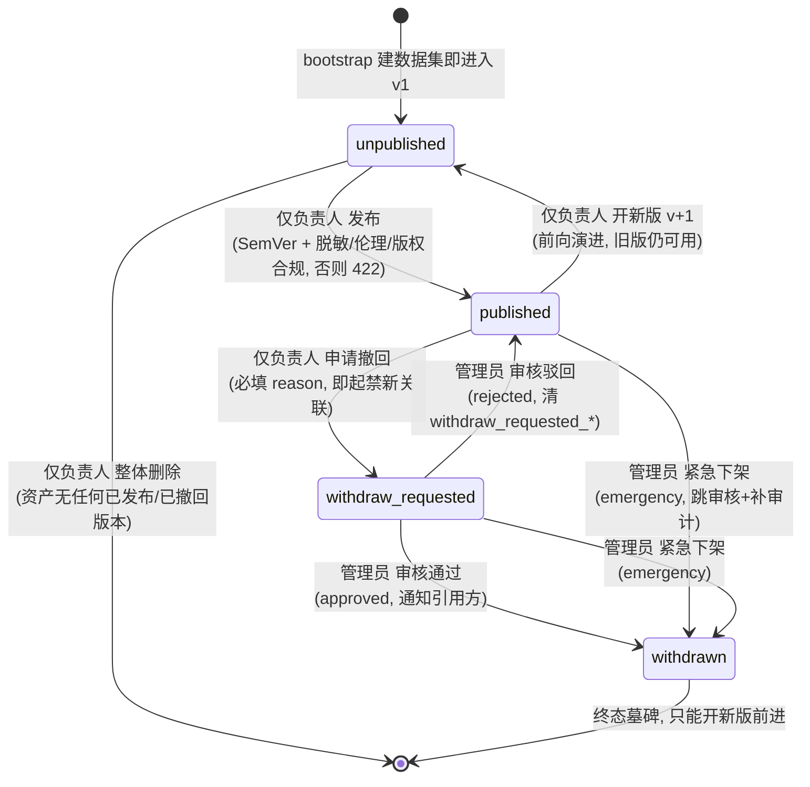
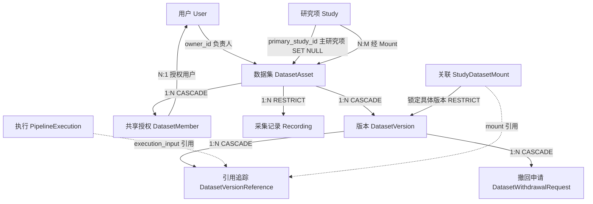

# 数据集 · DatasetAsset

> 数据集是 ELYS 里**独立于研究项存在的物理数据身份**：一批被试 / 采集记录的容器，带版本、可被多个研究项关联复用。在「登录 → 研究项 → 导入 → 工作流 → 执行 → 输出」主线里，它处在**导入的落点**——外部脑电文件导入后归入某个数据集；研究项通过「关联（Link）」把它接进来，工作流执行时再从中加载数据。本档覆盖 `DatasetAsset` 本体 + 版本 `DatasetVersion` + 共享授权 `dataset_members` + 撤回 / 引用追踪配套表（`dataset_withdrawal_requests` / `dataset_version_references`）。采集记录 `Recording`、文件索引 `dataset_files` 见 `02_采集记录_Recording.md`。

---

## 1. 术语规范

| 中文名 | 业务名 | 代码类名 | 数据库表 | 前端主要文件 |
|---|---|---|---|---|
| 数据集 | Dataset | `DatasetAsset` | `dataset_assets` | `views/DatasetsPage.vue`、`api/datasetAssets.ts` |
| 数据集版本 | Version | `DatasetVersion` | `dataset_versions` | `api/datasetVersions.ts` |
| 共享授权 | Authorized User | `DatasetMember` | `dataset_members` | `DatasetsPage.vue`（授权面板）、`api/datasetAssets.ts`（`datasetMemberApi`） |
| 关联（挂载） | Link / Mount | `StudyDatasetMount` | `study_dataset_mounts` | `api/datasetAssets.ts`（`studyDatasetMountApi`） |
| 撤回申请 | Withdrawal Request | `DatasetWithdrawalRequest` | `dataset_withdrawal_requests` | `views/AdminWithdrawalsPage.vue`、`api/datasetVersions.ts`（`datasetWithdrawalApi`） |
| 版本引用追踪 | Version Reference | `DatasetVersionReference` | `dataset_version_references` | （无独立 UI，撤回时后端遍历） |

> 「关联（Link）」是这一版统一的用户面词；它的物理层代码名仍是 `StudyDatasetMount` / `mount`（「挂载」），用户界面不可见。三件事别混：**导入 Import**（外部文件进平台、造数据集）、**关联 Link**（研究项接上一个已有数据集，数据不搬动）、**加载 Load**（Pipeline 的 LoadData 节点运行时把数据读进流程）。

**曾用名 / 废弃名（见到即改）**

- `Dataset`（旧 ORM 类名）：已改名 `Recording`（2026-06-04 A 重构），现在「Dataset」专指用户视角的 `DatasetAsset`。代码里残留的 `dataset.xxx` 局部变量、`dataset_id` 审计字段名是过渡残留，语义指 `Recording`。
- `workspace` 可见性档：**已废弃删除**（6-05 B 方案）。可见范围只剩 `private / shared / public` 三档。
- `active`（资产 status 旧存活态）：已并入 `working`，`working` 是唯一存活态。
- `archived`（资产 status 取值）：CHECK 里保留，但**全后端无任何写入口**（详见 §9），是死态。
- `superadmin` 校验（紧急下架旧口径）：已收敛为 `admin`（2026-06-09 决策 A）。

---

## 2. 功能定位与边界

**解决什么问题。** 科研脑电数据常常一批数据要喂给多个分析（同一批被试，跑 ERP 的研究项、跑连接性的研究项各开一个）。如果数据绑死在某个研究项里，复用就得拷贝、各存一份、各自漂移。`DatasetAsset` 把「数据本身」抽成独立身份：一个数据集只存一份，多个研究项用「关联」各自接进来用，数据不搬动。它还承载**发布 / 引用 / DOI** 这套学术数据治理——把某个版本冻结成不可变快照、铸 DOI、对外开放或撤回，类比论文的发表与撤稿。

**两根正交轴（理解全档的前提）。** 数据集的生命周期由两根**互不驱动**的轴描述：

- **发布状态轴**（版本级 `DatasetVersion.state`）：管这个版本能不能改文件、能不能删、是否已冻结、是否铸了 DOI。取值 `unpublished → published → withdraw_requested → withdrawn`。
- **可见范围轴**（资产级 `DatasetAsset.visibility`）：管谁能看、谁能把它关联进自己的研究项。取值 `private / shared / public`。

核心原则是**发布 ≠ 分享**：发布只做「冻结 + 铸 DOI」两件事，**不改可见范围**——新发布的版本默认仍是私有的，是否对外可见由负责人事后单独、单向地开放（乐观地说就是「先郑重定稿，再决定给谁看」，两步分开）。

**不负责什么。** 数据集不存「文件物理字节」的索引明细——那是 `dataset_files`（见 02 档）。它也不直接挂被试 / 采集记录的归属：`Subject` 和 `Recording` 挂在**研究项**下，数据集通过 `recordings.dataset_asset_id` 这条**第二归属**指针聚合它们（归属双轨，见 02 档 §8）。它不做真实信号质控（M2 未开发）。

**为什么这样设计。** 「数据集先于研究项、版本即引用、只升不降、撤回不删除」这套规则直接对标 OpenNeuro / Zenodo / PhysioNet 的数据生命周期实践（详见 `wiki/docs/3-25` §7 业内对照），目标是让脑电数据具备**可引用、可追溯、不可悄悄篡改**的学术资产属性。

---

## 3. 数据库

事实源：`elys_project/database/schema/03_datasets.sql`。

### 3.1 `dataset_assets`（数据集本体）

| 字段 | 类型 | 约束 | 语义 |
|---|---|---|---|
| `id` | UUID | PK，默认 `gen_random_uuid()` | 数据集主键 |
| `name` | VARCHAR(200) | NOT NULL | 展示名 |
| `code` | VARCHAR(64) | NOT NULL，UNIQUE（`uq_dataset_assets_code`） | 全局唯一短码 |
| `description` | TEXT | | 描述 |
| `owner_id` | UUID | FK→users，ON DELETE SET NULL | **负责人**：生命周期权限（发布 / 授权 / 撤回 / 删除）全绑在他身上 |
| `status` | VARCHAR(32) | NOT NULL，默认 `working`，CHECK | 内部记账轴，不上界面徽章 |
| `visibility` | VARCHAR(32) | NOT NULL，默认 `private`，CHECK | 可见范围轴；只升不降 |
| `metadata` | JSONB | NOT NULL，默认 `{}` | 元数据（ORM 属性名 `metadata_json`） |
| `primary_study_id` | CHAR(12) | FK→studies，ON DELETE SET NULL | **主研究项**：unpublished 时必填，published 后保留作出身记录 |
| `concept_doi` | VARCHAR(256) | nullable，UNIQUE（条件索引） | Concept DOI，永远指向最新 published 版本（Zenodo 模式） |
| `current_version_id` | UUID | FK→dataset_versions，ON DELETE SET NULL（延后加） | 当前默认展示版本指针 |
| `created_by` | UUID | FK→users，ON DELETE SET NULL | 创建者（≠ 负责人，权限上区别对待） |
| `created_at` / `updated_at` | TIMESTAMP | NOT NULL | 时间戳 |

**status CHECK 原文**（03_datasets.sql:15-16）：

```sql
status VARCHAR(32) NOT NULL DEFAULT 'working'
    CHECK (status IN ('working', 'archived', 'deleted', 'quarantined'))
```

- `working`：唯一存活态。
- `quarantined`：隔离（管理员可在 PATCH 端点 working ↔ quarantined 切换；隔离后仅管理员可读）。
- `deleted`：删除标记（读路径一律过滤；但实际删除是硬删，见 §7）。
- `archived`：**死态**，全后端无写入口（见 §9 待讨论）。

**visibility CHECK 原文**（03_datasets.sql:20-21）：

```sql
visibility VARCHAR(32) NOT NULL DEFAULT 'private'
    CHECK (visibility IN ('private', 'shared', 'public'))
```

### 3.2 `dataset_versions`（数据集版本）

| 字段 | 类型 | 约束 | 语义 |
|---|---|---|---|
| `id` | UUID | PK | 版本主键 |
| `dataset_asset_id` | UUID | NOT NULL，FK→dataset_assets，ON DELETE CASCADE | 所属数据集 |
| `version_label` | VARCHAR(64) | NOT NULL，默认 `working`，UNIQUE(asset_id,label) | 物理 slot 名（`working`）/ 发布后改成 SemVer `x.y.z` |
| `state` | VARCHAR(32) | NOT NULL，默认 `unpublished`，CHECK | 发布状态轴 |
| `content_hash` | VARCHAR(64) | nullable | 整版本指纹，发布后异步计算（当前留 None） |
| `version_doi` | VARCHAR(256) | nullable，UNIQUE（条件索引） | 该版本独有的 Version DOI |
| `published_at` / `published_by` | TIMESTAMP / UUID | nullable | 发布时间 / 发布人 |
| `qa_status` | VARCHAR(16) | NOT NULL，默认 `not_run`，CHECK | 展示用，**不阻塞发布** |
| `withdraw_requested_at/_by`、`withdraw_reason` | | nullable | 撤回申请留痕 |
| `withdrawn_at/_by`、`withdrawal_admin_notes` | | nullable | 撤回生效 / 审核备注 / 紧急下架原因 |
| `storage_uri` | VARCHAR(1024) | nullable | 版本根 URI，如 `elys://datasets/{asset_id}/versions/working` |
| `metadata` | JSONB | NOT NULL，默认 `{}` | ORM 属性名 `metadata_json` |
| `created_by` / `created_at` | | | 创建者 / 时间 |

**state CHECK 原文**（03_datasets.sql:45-46）：

```sql
state VARCHAR(32) NOT NULL DEFAULT 'unpublished'
    CHECK (state IN ('unpublished', 'published', 'withdraw_requested', 'withdrawn'))
```

**qa_status CHECK 原文**（03_datasets.sql:51-52）：

```sql
qa_status VARCHAR(16) NOT NULL DEFAULT 'not_run'
    CHECK (qa_status IN ('pass', 'fail', 'not_run'))
```

> `version_label` 强制 SemVer：首版默认 `1.0.0`，允许 `0.x.y` 表示 pre-release。major=实验设计变更 / minor=加被试 / patch=元数据修正（`services/semver.py` 校验，`dataset_lifecycle.py:329` 调用）。

### 3.3 `dataset_members`（共享授权，邀请制）

| 字段 | 类型 | 约束 | 语义 |
|---|---|---|---|
| `id` | UUID | PK | 授权记录 |
| `asset_id` | UUID | NOT NULL，FK→dataset_assets，ON DELETE CASCADE | 被授权的数据集 |
| `user_id` | UUID | NOT NULL，FK→users，ON DELETE CASCADE | 被授权用户 |
| `granted_by` | UUID | FK→users，ON DELETE SET NULL | 授权人（通常为负责人） |
| `granted_at` | TIMESTAMP | NOT NULL，默认 NOW() | 授权时间 |
| —（唯一约束） | | `UNIQUE(asset_id, user_id)`（`uq_dataset_members_asset_user`） | 防重复授权 |

> 仅 `visibility = shared` 时本表生效；`private` 走主研究项成员，`public` 对任意注册用户放行。

### 3.4 `dataset_version_references`（版本引用追踪）

撤回时遍历此表通知引用方。`reference_kind` **CHECK 原文**（03_datasets.sql:263-264）：

```sql
reference_kind VARCHAR(32) NOT NULL
    CHECK (reference_kind IN ('mount', 'execution_input', 'external_paper'))
```

`reference_id` 依 kind 含义不同：`mount`→mount_id、`execution_input`→execution_id、`external_paper`→paper_id（Phase 4+）。`referencing_study_id` FK→studies ON DELETE SET NULL。

### 3.5 `dataset_withdrawal_requests`（撤回申请审计）

`decision` **CHECK 原文**（03_datasets.sql:286-287）：

```sql
decision VARCHAR(16)
    CHECK (decision IN ('approved', 'rejected', 'emergency'))
```

- `approved` / `rejected` = 管理员正常审核结果；`emergency` = 紧急下架补审计。
- `requested_by` FK→users **ON DELETE RESTRICT**（申请人不可被连带删除，保审计完整）；`reviewed_by` SET NULL。

### 3.6 唯一约束 / 关键索引 / 外键 ON DELETE 行为

- **唯一约束**：`uq_dataset_assets_code`(code)；`dataset_versions UNIQUE(dataset_asset_id, version_label)`；`uq_dataset_members_asset_user(asset_id,user_id)`；条件唯一索引 `uq_dataset_assets_concept_doi`(concept_doi WHERE NOT NULL)、`uq_dataset_versions_version_doi`(version_doi WHERE NOT NULL)。
- **关键索引**：`idx_dataset_assets_visibility_status(visibility,status)`、`idx_dataset_assets_primary_study`、`idx_dataset_versions_asset(dataset_asset_id,state)`、`idx_dataset_versions_published`（条件索引 WHERE state='published'）、`idx_dataset_version_references_version`。
- **外键 ON DELETE 行为（删除链关键）**：
  - `dataset_versions → dataset_assets`：**CASCADE**（删资产连带删版本）。
  - `dataset_members → dataset_assets`：**CASCADE**。
  - `study_dataset_mounts → dataset_assets`：**RESTRICT**（有关联时禁删资产，需先解关联）。
  - `study_dataset_mounts → dataset_versions`：**RESTRICT**。
  - `recordings → dataset_assets`：**RESTRICT**（数据集还挂着采集记录时禁删，见 02 档）。
  - `dataset_assets.current_version_id → dataset_versions`：SET NULL（延后加的自引用外键，避免循环依赖）。
  - `dataset_version_references → dataset_versions`、`dataset_withdrawal_requests → dataset_versions`：均 CASCADE。

---

## 4. 后端

### 4.1 ORM 模型

`elys_project/backend/app/models/study.py`：

- `DatasetAsset`：`study.py:185-228`
- `DatasetVersion`：`study.py:231-269`
- `StudyDatasetMount`：`study.py:272-295`
- `DatasetMember`：`study.py:298-320`
- `DatasetVersionReference`：`study.py:775-800`
- `DatasetWithdrawalRequest`：`study.py:803-836`

### 4.2 服务层关键函数

**权限判定**（`services/dataset_assets.py`）：

- `can_read_dataset_asset(db, user, asset)`（:232-253）：读权限主判据。deleted→False；quarantined→仅 admin；admin / owner / 创建者→True；主研究项成员→True；public→任意注册用户 True；shared→仅 `dataset_members` 授权用户 True。
- `can_write_dataset_asset(user, asset)`（:256-261）：写权限。**前置 status 必须 == working**，否则恒 False；再判 admin / owner / 创建者。
- `list_visible_dataset_assets(db, user)`（:264-314）：与读权限同口径的列表查询（dashboard 计数随之对齐）。
- `is_user_authorized` / `_is_primary_study_member`（:195-229）：shared 授权命中 / 主研究项成员判定。

**生命周期状态机**（`services/dataset_lifecycle.py`）：

- `_ensure_asset_owner(asset, user)`（:229-237）：**仅 owner_id == user.id**，不含创建者、不含管理员。发布 / 申请撤回 / 开新版都走它。
- `_ensure_admin(user)`（:240-249）：`user.has_role("admin")`。紧急下架 / 撤回审核走它（已从旧 superadmin 收敛）。
- `publish_dataset_version(...)`（:268-414）：unpublished→published。合规关口（脱敏确认 + 伦理 + 版权声明，缺→422）、SemVer 严格递增、铸 version_doi（私有也铸）、首发建 concept_doi、`asset.current_version_id` 指向该版本、**不改可见范围**。
- `create_new_version(...)`（:127-213）：已发布资产上开 v+1 working 草稿（前向演进，不动 current_version_id）。
- `request_version_withdrawal(...)`（:422-486）：published→withdraw_requested，必填 reason。
- `review_withdrawal_request(...)`（:494-581）：管理员审核。approved→withdrawn（终态）+ 通知引用方；rejected→回 published 并清空 withdraw_requested_* 字段。
- `emergency_takedown_version(...)`（:589-673）：管理员紧急下架，跳过审核 published/withdraw_requested→withdrawn，事后补 `decision='emergency'` 审计，关闭遗留 pending 申请，通知引用方。
- `_notify_referrers_of_withdrawal(...)`（:45-92）：遍历 `dataset_version_references`，借 `audit_events`（action=`dataset_version.withdrawn.notification_for_referrer`，study_id 设为引用方）作通知信道——**当前没有独立通知中心表**。

**关联网关**（`services/dataset_assets.py`）：

- `_ensure_version_mountable(...)`（:376-440）：关联版本的状态 + 可见性双门控。withdraw_requested/withdrawn→拒绝新关联；unpublished→仅主研究项；published 跨研究项时按 public（放行）/ shared（查授权）/ private（拒绝）。
- `mount_dataset_asset_to_study(...)`（:443-494）：创建关联，自动登记 `mount` 类引用。
- `record_dataset_version_reference(...)`（:497-528）：幂等登记引用。

### 4.3 端点清单（已核对路径与权限）

事实源：`routers/datasets.py`（`asset_router` 前缀 `/api/v1/dataset-assets`、`router` 前缀 `/api/v1/studies/{study_id}/datasets`）、`routers/dataset_versions.py`（前缀 `/api/v1/dataset-versions`、`/api/v1/dataset-withdrawals`）。所有端点先过 `require_system_permission`（`data:read` / `data:write`，admin 或持权限码放行；datasets.py:205-208），下表「权限检查」列只列资源级附加校验。

**资产级 `asset_router`**

| 方法 | 路径 | 权限检查 | 作用 |
|---|---|---|---|
| POST | `/dataset-assets/bootstrap` | `data:write` + 配对研究项写权 | **唯一创建入口**：建资产 + 主研究项 + 首版 working + 关联 |
| GET | `/dataset-assets` | `data:read` + `list_visible_dataset_assets` | 列当前用户可见资产（带概要统计） |
| GET | `/dataset-assets/{id}/versions` | `data:read` + 读权 | 列资产全部版本 |
| POST | `/dataset-assets/{id}/versions` | `data:write` + `_ensure_asset_owner` | 已发布资产上开 v+1 草稿 |
| GET | `/dataset-assets/{id}/files` | `data:read` + 读权 + 已发布过滤 | 文件清单（非主研究项访问者只见已发布） |
| GET | `/dataset-assets/{id}/bids-tree` | 同上 | Raw BIDS 文件树 |
| POST | `/dataset-assets/{id}/raw-bids-build` | `data:write` + `can_write_dataset_asset` | 异步构 Raw BIDS（返回 task_id） |
| POST | `/dataset-assets/{id}/canonical-fif-rebuild` | `data:write` + `can_write_dataset_asset` | 异步重建 canonical FIF |
| PATCH | `/dataset-assets/{id}` | `data:write` + （admin 或 owner） | 改 name/description/metadata；status 仅 admin 且只能 working↔quarantined |
| POST | `/dataset-assets/{id}/open-visibility` | `data:write` + `ensure_dataset_asset_owner`（仅 owner） | 可见范围**只升不降**（VISIBILITY_RANK 守卫），前置须 ≥1 已发布版本 |
| GET | `/dataset-assets/{id}/members` | `data:read` + 仅 owner | 列共享授权名单 |
| POST | `/dataset-assets/{id}/members` | `data:write` + 仅 owner | 授权用户（按 UUID 或用户名解析；幂等） |
| DELETE | `/dataset-assets/{id}/members/{user_id}` | `data:write` + 仅 owner | 取消授权 |
| DELETE | `/dataset-assets/{id}` | `data:write` + 仅 owner | 整体硬删**纯未发布**资产（有已发布/撤回历史→409） |

**版本级 `/api/v1/dataset-versions`（dataset_versions.py）**

| 方法 | 路径 | 权限检查 | 作用 |
|---|---|---|---|
| POST | `/{id}/publish` | service `_ensure_asset_owner` | 发布（透传脱敏 / 伦理 / 版权合规字段） |
| DELETE | `/{id}` | 路由内自校验：仅 owner + state==unpublished + 资产有已发布历史 | 丢弃已发布资产上的 v+1 草稿（连带清其调试关联） |
| POST | `/{id}/withdraw-request` | service `_ensure_asset_owner` | 负责人申请撤回 |
| POST | `/{id}/emergency-takedown` | service `_ensure_admin` | 管理员紧急下架 |

**撤回管理 `/api/v1/dataset-withdrawals`（dataset_versions.py）**

| 方法 | 路径 | 权限检查 | 作用 |
|---|---|---|---|
| GET | `/pending` | `has_role("admin")` | 列待审核撤回申请 |
| POST | `/{request_id}/review` | service `review_withdrawal_request`（admin） | 审核（approved / rejected） |

**关联级 `router`（studies.py 前缀下的 datasets.py `router`）**：`GET`/`POST /mounts`、`PATCH`/`DELETE /mounts/{mount_id}`，均 `require_study_read`/`require_study_write`；创建 / 升级关联按 §4.2 网关校验。

> 错误码翻译（dataset_versions.py:112-120）：`PermissionError→403`、`StateError→409`、`ValidationError→422`。

---

## 5. 前端

- **路由**：`/datasets`（name `Datasets`，`views/DatasetsPage.vue`）；`/admin/withdrawals`（name `AdminWithdrawals`，`views/AdminWithdrawalsPage.vue`）。`router/index.ts:81-83、130-131`。
- **页面 / 组件**：`DatasetsPage.vue`（约 5000 行，数据集列表 + 版本卡片 + 发布 / 开放可见范围 / 授权面板 / 丢弃草稿 / 整体删除 + 导入 + 关联面板，一站式）；`AdminWithdrawalsPage.vue`（管理员撤回审核台）。
- **Pinia store**：**无数据集专属 store**。全局只有 `stores/auth.ts`、`stores/study.ts`（`useStudyStore`）；数据集页直接调 API client、组件内本地状态管理。
- **API client 函数**（`api/datasetAssets.ts`、`api/datasetVersions.ts`、`api/datasets.ts`）：
  - `datasetAssetApi`：`list / bootstrap / update / openVisibility / remove / listFiles / listVersions / createDraftVersion / getRawBidsTree / buildRawBids / rebuildCanonicalFif`。
  - `datasetMemberApi`：`list / add / remove`。
  - `datasetVersionApi`：`publish / requestWithdrawal / emergencyTakedown / discardDraft`，外加 `datasetVersionStateLabel` / `datasetVersionStateClass` 两个中文标签工具函数。
  - `datasetWithdrawalApi`：`listPending / review`。
  - `studyDatasetMountApi`：`list / create / update / remove`（关联）。
- **当前 UI 形态**：列表页对每个数据集展示概要统计（被试数 / 任务 / 总时长 / 最后导入时间）与可见范围、发布状态徽章；版本卡片提供发布、撤回、开新版、丢弃按钮；可见范围用「开放」单向动作（无降级按钮）；授权面板按用户名 / UUID 加人。

---

## 6. 生命周期

发布状态轴（版本级 `DatasetVersion.state`）的状态机：



**每状态语义一句话**

- `unpublished`（未发布）：草稿态。文件可改、可整体删；仅主研究项可见 / 可关联。
- `published`（已发布）：不可变冻结快照，已铸 DOI；跨研究项可见 / 可关联由可见范围轴决定。
- `withdraw_requested`（撤回审核中）：等管理员审批的中间态；**禁新关联**，已有关联保留。
- `withdrawn`（已撤回）：终态墓碑，版本号 / DOI / 引用 / 审计永久保留；要继续工作只能开 v+1。

**谁能触发**

- 发布 / 开新版 / 申请撤回 / 整体删除 / 丢弃草稿 = **仅负责人**（owner_id；不含创建者、不含管理员、不含 PI）。
- 撤回审核 / 紧急下架 = **管理员**。

**终态说明**：`withdrawn` 是唯一终态，不可逆回退到 unpublished（理由：DOI 不可逆、下游引用稳定性、学术撤稿标准；见 `wiki/docs/3-25` §8.2）。

---

## 7. 行为清单

| 操作 | 端点 / 入口 | 谁能做 | 关键副作用 / 约束 |
|---|---|---|---|
| 创建数据集 | `POST /dataset-assets/bootstrap` | 持 data:write | 一次性建资产 + 主研究项 + 首版 working + 关联；code 冲突 409 |
| 发布版本 | `POST /dataset-versions/{id}/publish` | 仅负责人 | 必过合规关口；SemVer 严格递增；铸 DOI（私有也铸）；冻结文件；**可见范围不变** |
| 开 v+1 草稿 | `POST /dataset-assets/{id}/versions` | 仅负责人 | 资产须已发布过 + 当前无进行中版本；不动 current_version_id |
| 丢弃 v+1 草稿 | `DELETE /dataset-versions/{id}` | 仅负责人 | 仅 state=unpublished 且资产有已发布历史；连带清其调试关联 + 物理目录 |
| 整体删除资产 | `DELETE /dataset-assets/{id}` | 仅负责人 | **硬删**；仅纯未发布资产（无任何已发布/撤回版本）；先解关联 + 删采集记录（RESTRICT）再删资产；审计留 snapshot |
| 开放可见范围 | `POST /dataset-assets/{id}/open-visibility` | 仅负责人 | **只升不降**（private<shared<public）；前置须 ≥1 已发布版本；无降级接口 |
| 授权 / 取消授权 | `POST`/`DELETE /dataset-assets/{id}/members[/{user_id}]` | 仅负责人 | 仅 shared 档有意义；按 UUID 或用户名解析；add 幂等 |
| 改名 / 描述 | `PATCH /dataset-assets/{id}` | admin 或负责人 | status 仅 admin 且只能 working↔quarantined（堵后门）；visibility 不在此端点 |
| 隔离 / 解除隔离 | `PATCH /dataset-assets/{id}`（status） | 仅 admin | working↔quarantined |
| 申请撤回 | `POST /dataset-versions/{id}/withdraw-request` | 仅负责人 | 仅 published；必填 reason；即起禁新关联 |
| 审核撤回 | `POST /dataset-withdrawals/{id}/review` | 仅 admin | approved→withdrawn + 通知引用方；rejected→回 published |
| 紧急下架 | `POST /dataset-versions/{id}/emergency-takedown` | 仅 admin | 跳审核；补 emergency 审计；通知引用方 |
| 关联数据集 | `POST /studies/{sid}/datasets/mounts` | 研究项写权 | 过状态 + 可见性双门控；自动登记 mount 引用 |

---

## 8. 与其他元素的关系



**逐关系一句话**

- `User → Asset`（owner_id，1:N，SET NULL）：负责人持有生命周期权限；删用户置空，权限随之悬空。
- `Study → Asset`（primary_study_id，1:N，SET NULL）：主研究项是数据集「出身地」，unpublished 时必填、发布后保留；删研究项不删数据集，仅丢失出身标识。
- `Asset → Version`（1:N，CASCADE）：一个数据集多个版本；删资产连带删版本。
- `Asset → DatasetMember`（1:N，CASCADE）：共享授权名单，仅 shared 档生效。
- `DatasetMember → User`（N:1）：被授权用户；`UNIQUE(asset_id,user_id)` 防重。
- `Asset → Recording`（1:N，RESTRICT）：数据集聚合采集记录（第二归属）；有采集记录时禁删资产。
- `Study ↔ Asset`（N:M，经 `StudyDatasetMount`）：研究项「关联」复用数据集，数据不搬动。
- `Mount → Version`（RESTRICT）：关联锁定到具体版本；版本被关联时禁删。
- `Version → DatasetVersionReference`（1:N，CASCADE）：登记谁引用了这个版本（关联 / 执行输入 / 论文），撤回时遍历通知。
- `Version → DatasetWithdrawalRequest`（1:N，CASCADE）：撤回申请审计；`requested_by` RESTRICT 保审计。

---

## 9. 待讨论（不确定 / 未完成 / 矛盾）

1. **`archived` 是死态（与权威事实包一致，已二次证实）**
   现状：`dataset_assets.status` CHECK 含 `archived`，但全后端无任何写入口——grep 仅命中 `routers/datasets.py:2559` 一条注释和 `services/pipeline_execution_rules.py` / `services/dashboard_summary.py` 两处**针对 `study.status` 的无关逻辑**；PATCH 端点（datasets.py:2564）显式只允许 `quarantined`/`working`。 → 为什么是问题：CHECK 留着一个永不可达的取值，读路径却仍按它过滤，是噪音。 → 方向：要么删 CHECK 里的 `archived`，要么补「归档」语义与入口（调试期倾向直接删）。

2. **DOI 是内部字符串、未接 DataCite**
   现状：`version_doi = f"elys:dataset/{asset.id}/v{label}"`、`concept_doi = f"elys:dataset/{asset.id}"`（`dataset_lifecycle.py:366、376`）。 → 为什么是问题：真正的可引用性要求 DOI 在 DataCite 注册、全局可解析；当前串只是占位。 → 方向：`wiki/docs/3-25` §9 标「待定」——先打通内部串，真接 DataCite API 后续评估接入时机（Q-2）。

3. **没有独立通知中心，撤回通知借 audit_events 充当信道**
   现状：`_notify_referrers_of_withdrawal`（`dataset_lifecycle.py:45-92`）给每个引用方写一条 `audit_events`（action 带 `notification_for_referrer`），靠引用方 study 成员去审计里捞。 → 为什么是问题：用户没有「我引用的数据集被撤回了」的主动推送 / 站内信入口，发现链路弱。 → 方向：`wiki/docs/3-25` §9 标「待定」——先站内通知、邮件后续按需补；可加专门通知表。

4. **`content_hash` 发布后仍留 None（异步计算未落地）**
   现状：`publish_dataset_version` 注释明说「content_hash 暂留 None，后续异步任务计算」（`dataset_lifecycle.py:296`）。 → 为什么是问题：「整版本指纹」是不可变发布的完整性凭据，缺了则发布只是状态翻转、无指纹背书。 → 方向：补 Phase 3 后续的异步 hash 任务。

5. **前端授权入口文案提到「邮箱」，但 User 模型无 email 字段**
   现状：`api/datasetAssets.ts:83` 注释写「user_identifier 可为用户名 / 邮箱 / 用户 UUID」，但后端 `add_dataset_asset_member`（datasets.py:2693-2709）只解析 UUID 或 username，且代码注释明说「User 模型无 email 字段」（`models/user.py` 确认无 email 列）。 → 为什么是问题：UI 若按「邮箱」提示用户，实际填邮箱会授权失败（404）。 → 方向：改前端文案为「用户名 / 用户 ID」，与后端对齐。

6. **关联升级 / 创建未把旧引用清理，靠「保留作历史」**
   现状：`update_study_dataset_mount`（`dataset_assets.py:614-621`）升级版本时新登记一条引用、**旧引用保留不删**。 → 为什么是问题：一个 mount 可能在 `dataset_version_references` 留多条历史引用，撤回遍历通知时可能对同一引用方重复发；且「当前真正生效的引用」需结合 mount 当前 version 推断。 → 方向：确认这是有意（审计留痕）还是应清理；通知时去重。

---

## 10. 大模型画图提示词

```
请画一张「ELYS 平台 数据集（DatasetAsset）元素全景图」，读者是新接手这个代码库的开发者，目标是一页看懂数据集这个核心元素的全貌。ELYS 是科研级脑电(EEG)分析 Web 平台。请用清晰分区的单页信息图布局，分以下 7 个区块：

① 定位与术语（左上角）：标题「数据集 DatasetAsset = 独立于研究项的物理数据身份，承载发布与可见范围治理」。列出核心术语对照：数据集=DatasetAsset(表 dataset_assets)、版本=DatasetVersion(表 dataset_versions)、共享授权=DatasetMember(表 dataset_members)、关联=StudyDatasetMount(用户面叫 Link，物理名 mount)。醒目标注废弃名：旧类名 Dataset 已改名 Recording；workspace 可见性档已删；status 的 active 已并入 working。

② 核心数据结构（左中）：画 dataset_assets 的关键字段表：id、name、code(全局唯一)、owner_id(负责人=生命周期权限持有者)、primary_study_id(主研究项,出身记录,SET NULL)、status、visibility、concept_doi、current_version_id。再画 dataset_versions 关键字段：state、version_label(强制 SemVer x.y.z)、qa_status、version_doi、content_hash、published_at/by、withdraw_*/withdrawn_* 系列。标注两根正交轴：发布状态轴落在 DatasetVersion.state，可见范围轴落在 DatasetAsset.visibility，二者互不驱动。

③ 生命周期状态机（正中,最大最醒目）：画发布状态机,所有状态用代码原值标注：unpublished(未发布)、published(已发布)、withdraw_requested(撤回审核中)、withdrawn(已撤回,终态)。转换箭头与条件/触发者全部标注：[*]→unpublished(bootstrap 建数据集);unpublished→published(仅负责人发布,条件:SemVer 校验+脱敏确认+伦理声明+版权声明,缺则 422);unpublished→删除(仅负责人,条件:资产无任何已发布/已撤回版本);published→unpublished(仅负责人开新版 v+1,前向演进);published→withdraw_requested(仅负责人申请撤回,必填 reason,即起禁新关联);withdraw_requested→withdrawn(管理员审核 approved,通知引用方);withdraw_requested→published(管理员审核 rejected);published 或 withdraw_requested→withdrawn(管理员紧急下架 emergency,跳审核+补审计);withdrawn 是终态,只能开新版前进。每个箭头标清触发者(仅负责人 owner / 管理员 admin)。

④ 关键行为与端点(右中):列端点清单,方法+路径+谁能做:POST /dataset-assets/bootstrap(唯一创建入口);POST /dataset-versions/{id}/publish(仅负责人);POST /dataset-assets/{id}/open-visibility(仅负责人,只升不降);POST/DELETE /dataset-assets/{id}/members(仅负责人,共享授权);POST /dataset-versions/{id}/withdraw-request(仅负责人);POST /dataset-withdrawals/{id}/review(仅管理员);POST /dataset-versions/{id}/emergency-takedown(仅管理员);DELETE /dataset-assets/{id}(仅负责人,仅纯未发布资产硬删)。

⑤ 与其他元素关系(右上,含基数):DatasetAsset 1:N DatasetVersion(CASCADE);DatasetAsset 1:N DatasetMember(CASCADE);DatasetAsset 1:N Recording(RESTRICT,第二归属);Study N:M DatasetAsset(经 StudyDatasetMount 关联,RESTRICT);Study 1:N DatasetAsset(primary_study_id,SET NULL);DatasetVersion 1:N DatasetVersionReference(撤回时遍历通知)。

⑥ 权限规则(右下,用表格):可见范围三档:private(负责人+管理员+主研究项成员可见)、shared(邀请制,+dataset_members 授权用户)、public(任意注册用户,无匿名)。核心原则用大字标注:「发布≠分享」(发布只冻结+铸 DOI,可见范围默认私有不变);「可见范围只升不降,无降级接口」;「生命周期权限仅负责人 owner,不含创建者/PI/管理员;管理员只管撤回审核+紧急下架+隔离」。

⑦ 待讨论项(底部,用⚠️警示标记醒目框出):⚠️ archived 是死态(CHECK 留着但全后端无写入口);⚠️ DOI 是内部字符串 elys:dataset/... 未接 DataCite;⚠️ 撤回通知借 audit_events 充当信道,无独立通知中心;⚠️ content_hash 发布后仍留 None。

风格约定:中文标签为主;代码名/枚举值/端点路径用等宽字体;状态机用明确箭头连接、转换条件标在箭头上;两根正交轴用不同颜色区分(发布状态轴一色、可见范围轴另一色);待讨论项统一用⚠️黄色警示框;整体配色科研工具风(冷色调为主),信息密度高但分区清晰。
```
