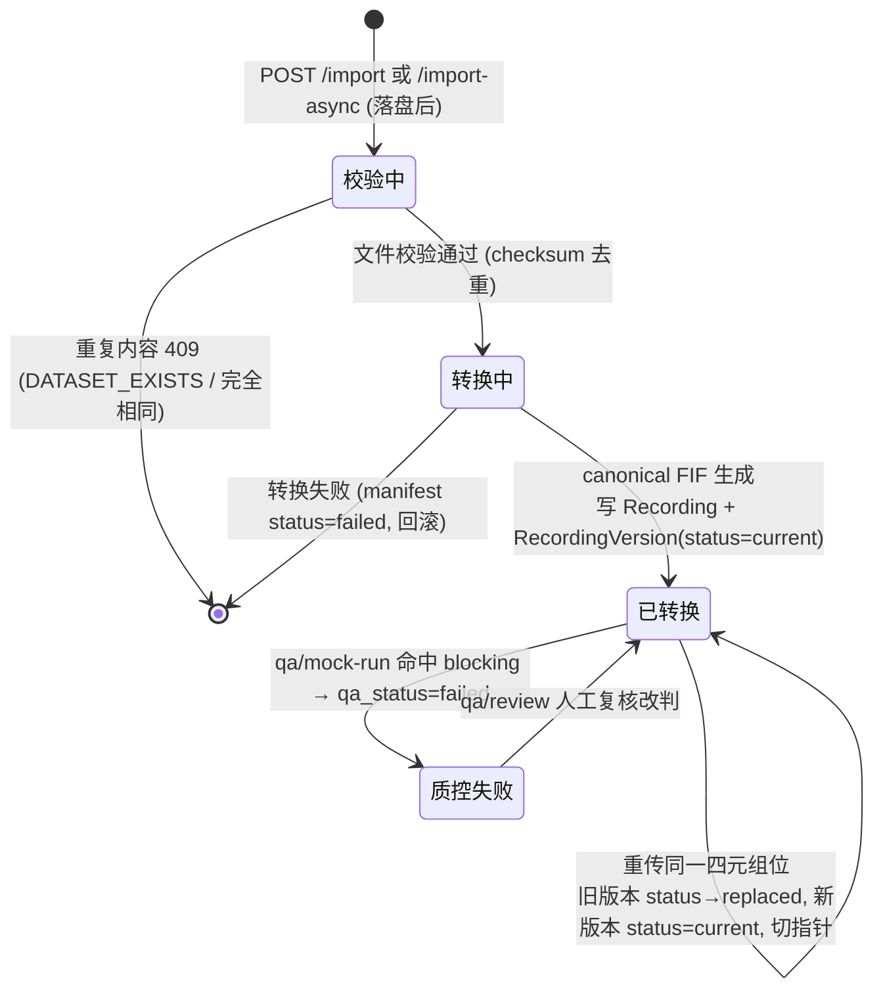
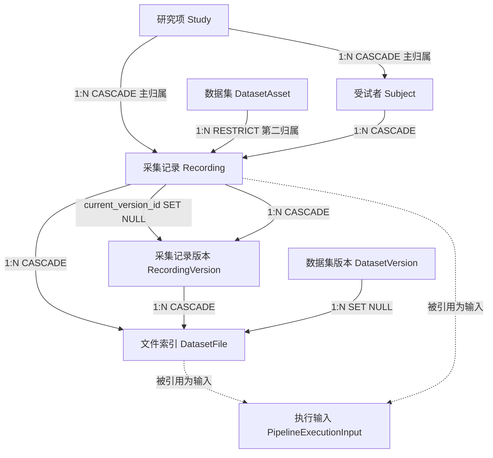

# 采集记录 · Recording

> 采集记录是一条 **BIDS 四元组**（subject / session / task / run）的脑电采集单元——粗讲就是「某个被试、某次会话、某个任务、第几遍」的一份原始记录。在「登录 → 研究项 → 导入 → 工作流 → 执行 → 输出」主线里，它是**导入的产物**：外部脑电文件（BrainVision / EDF / BDF…）导入后，按四元组落成一条 `Recording`，同时转出系统统一格式 canonical FIF 供工作流加载。本档覆盖 `Recording` + 上传版本 `RecordingVersion` + 受试者 `Subject` + 文件索引 `dataset_files`。数据集 `DatasetAsset`、版本 `DatasetVersion` 见 `01_数据集_DatasetAsset.md`。

---

## 1. 术语规范

| 中文名 | 业务名 | 代码类名 | 数据库表 | 前端主要文件 |
|---|---|---|---|---|
| 采集记录 | Recording | `Recording` | `recordings` | `views/DatasetsPage.vue`、`views/WaveformDetailPage.vue`、`api/datasetAssets.ts`（`recordingApi`）、`api/datasets.ts`（`datasetApi`） |
| 采集记录版本 | Recording Version | `RecordingVersion` | `recording_versions` | `DatasetsPage.vue`（版本列表）、`api/datasetAssets.ts`（`recordingApi.listVersions`） |
| 受试者 | Subject | `Subject` | `subjects` | `DatasetsPage.vue`（按被试聚合） |
| 文件索引 | Dataset File | `DatasetFile` | `dataset_files` | `WaveformDetailPage.vue`、`api/datasetAssets.ts`（`recordingApi.listFiles`） |

> BIDS 四元组：`subject`（被试，如 `sub-01`）、`session`（会话，可空）、`task`（任务，如 `task-rest`，必填）、`run`（第几遍，可空）。BIDS 是脑电 / 脑成像社区的标准目录命名规范，ELYS 用它给每条采集记录定位。

**曾用名 / 废弃名（见到即改）**

- `Dataset`（旧 ORM 类名）：**已改名 `Recording`**（2026-06-04 A 重构）。代码里仍有大量 `dataset` / `dataset_id` 局部变量、`dataset.uploaded` / `dataset.reuploaded` 审计 action、`DATASET_EXISTS` 错误码——这些是过渡残留，**语义实际指 `Recording`**，不是用户视角的「数据集 DatasetAsset」。读到 `dataset` 先看类型再断意。
- `DatasetUpload`（旧 ORM 类名）：**已改名 `RecordingVersion`**（同次重构）。
- 「数据集」一词：现专指 `DatasetAsset`（见 01 档），不再指单条采集记录。

---

## 2. 功能定位与边界

**解决什么问题。** 脑电实验的原始数据天然是「一份份采集」——被试 A 静息态跑一遍、任务态跑两遍，各是一个文件。`Recording` 把每一份采集抽象成一条带 BIDS 坐标的记录，并解决三件事：(1) **格式归一**——把厂商各异的原始格式（BrainVision `.vhdr/.eeg/.vmrk`、EDF、BDF）统一转成 MNE 的 canonical FIF，让后续工作流只面对一种格式；(2) **重传版本化**——同一个四元组位重新上传（修了坏文件 / 补了通道）记成新版本行，旧版本保留、指针切换，不互相覆盖；(3) **可质控**——每条记录带 `qa_status` 与 `qa_report`，供质控流程标记。

**归属双轨（关键设计）。** 一条采集记录同时挂两条归属线：

- `study_id`（**主归属**，CASCADE）：采集记录、受试者都挂在**研究项**下——`Subject` 的唯一性是 `UNIQUE(study_id, bids_subject_id)`，采集记录的 BIDS 唯一性也含 `study_id`。删研究项连带删采集记录。
- `dataset_asset_id`（**第二归属**，RESTRICT）：采集记录又归入某个**数据集**，让数据集能聚合统计、被跨研究项关联复用。数据集还挂着采集记录时禁删数据集。

**不负责什么。** 它不管数据集级的发布 / 可见范围 / DOI（那是 `DatasetAsset` + `DatasetVersion`，见 01 档）。它的 `qa_status` 当前只反映**导入校验**结果（转换成功 / 失败），**真实信号质控（M2）未开发**——`mock-run` 端点产的是占位报告。

**为什么这样设计。** 把「采集记录（物理一份份数据）」与「数据集（可发布可引用的资产）」分层，是为了让同一批原始记录既能在研究项内灵活进出，又能整体打包成可发布资产。canonical FIF 统一格式则是把「格式兼容」这件脏活在导入时一次做完，避免每个分析节点各自处理厂商格式。

---

## 3. 数据库

事实源：`elys_project/database/schema/03_datasets.sql`。

### 3.1 `subjects`（受试者）

| 字段 | 类型 | 约束 | 语义 |
|---|---|---|---|
| `id` | UUID | PK | 受试者主键 |
| `study_id` | CHAR(12) | NOT NULL，FK→studies，ON DELETE CASCADE | 所属研究项 |
| `bids_subject_id` | VARCHAR(32) | NOT NULL | BIDS 被试标识（如 `sub-01`） |
| `age` / `sex` / `group` / `handedness` | NUMERIC/VARCHAR | nullable | 人口学字段（`group` 是 SQL 保留字，ORM 加引号） |
| `extra` | JSONB | NOT NULL，默认 `{}` | 扩展元数据 |
| —（唯一约束） | | `UNIQUE(study_id, bids_subject_id)` | **被试唯一性绑在研究项内** |

### 3.2 `recordings`（采集记录）

| 字段 | 类型 | 约束 | 语义 |
|---|---|---|---|
| `id` | UUID | PK | 采集记录主键 |
| `study_id` | CHAR(12) | NOT NULL，FK→studies，**ON DELETE CASCADE** | 主归属：研究项 |
| `dataset_asset_id` | UUID | FK→dataset_assets，**ON DELETE RESTRICT**，nullable | 第二归属：数据集 |
| `subject_id` | UUID | NOT NULL，FK→subjects，ON DELETE CASCADE | 受试者 |
| `session` | VARCHAR(32) | nullable | BIDS session |
| `task` | VARCHAR(64) | **NOT NULL** | BIDS task |
| `run` | VARCHAR(32) | nullable | BIDS run |
| `source_format` | VARCHAR(16) | NOT NULL | 原始格式（BRAINVISION / EDF / BDF…） |
| `source_path` | VARCHAR(512) | NOT NULL | 原始上传文件路径（sourcedata/original_uploads） |
| `fif_path` | VARCHAR(512) | nullable | 系统生成的 canonical FIF 路径 |
| `current_version_id` | UUID | FK→recording_versions，ON DELETE SET NULL（延后加） | **当前有效上传版本指针** |
| `file_size` / `checksum` | BIGINT / VARCHAR(64) | | 文件大小 / 校验和 |
| `n_channels` / `sfreq` / `duration_seconds` / `n_events` | INTEGER/REAL | | 信号元信息（通道数 / 采样率 / 时长 / 事件数） |
| `qa_status` | VARCHAR(16) | NOT NULL，默认 `pending` | 质控状态（**无 CHECK 约束**，见 §9） |
| `qa_report` | JSONB | nullable | 质控报告 |
| `imported_by` / `imported_at` | UUID / TIMESTAMP | | 导入人 / 时间 |

> 注意：`recordings.qa_status` **没有 CHECK 约束**（schema 里裸 VARCHAR 默认 `'pending'`）；实际写入值有 `pending`（建表默认）、`converted`（导入成功，`materialize_recording_import` 写）、`failed`（质控阻断，`apply_mock_qa_status` 写）。这与 `recording_versions.qa_status`（也无 CHECK，默认 `converted`）、`dataset_versions.qa_status`（有 CHECK pass/fail/not_run）三者**取值域不一致**，见 §9。

### 3.3 `recording_versions`（采集记录版本，每次上传 / 重传）

| 字段 | 类型 | 约束 | 语义 |
|---|---|---|---|
| `id` | UUID | PK | 版本主键 |
| `recording_id` | UUID | NOT NULL，FK→recordings，ON DELETE CASCADE | 所属采集记录 |
| `version_seq` | INTEGER | NOT NULL，`UNIQUE(recording_id, version_seq)` | 版本序号（1,2,3…） |
| `source_dir` / `source_main_file` | VARCHAR(512) | NOT NULL | 该次上传的原始目录 / 主文件 |
| `source_files` | JSONB | NOT NULL，默认 `[]` | 该次上传的全部原始文件列表 |
| `source_format` | VARCHAR(16) | NOT NULL | 原始格式 |
| `fif_dir` / `fif_path` | VARCHAR(512) | nullable | canonical FIF 目录 / 主文件 |
| `sidecar_paths` | JSONB | NOT NULL，默认 `{}` | sidecar 文件路径表 |
| `file_size` / `checksum` | | | 大小 / 校验和 |
| `status` | VARCHAR(16) | NOT NULL，默认 `current`，CHECK | 版本状态 |
| `qa_status` | VARCHAR(16) | NOT NULL，默认 `converted` | 质控状态（无 CHECK） |
| `note` | TEXT | nullable | 备注（如 `initial_import` / `replace_existing`） |
| `uploaded_by` / `uploaded_at` | | | 上传人 / 时间 |

**status CHECK 原文**（03_datasets.sql:182-183）：

```sql
status VARCHAR(16) NOT NULL DEFAULT 'current'
    CHECK (status IN ('current', 'replaced', 'rejected', 'failed'))
```

- `current`：当前有效版本（`recordings.current_version_id` 指向它）。
- `replaced`：被新版本替换的旧版本（重传时旧 current 改成 replaced，`create_dataset_upload_record` datasets.py:1831-1835）。
- `rejected` / `failed`：被拒 / 转换失败（CHECK 允许，但当前导入路径主要写 current/replaced）。

### 3.4 `dataset_files`（文件统一索引）

登记每个 Dataset Version 下的 original upload、Raw BIDS 逻辑视图、canonical FIF、sidecar 等。

| 字段 | 类型 | 约束 | 语义 |
|---|---|---|---|
| `id` | UUID | PK | 文件索引主键 |
| `study_id` | CHAR(12) | NOT NULL，FK→studies，ON DELETE CASCADE | 研究项 |
| `recording_id` | UUID | NOT NULL，FK→recordings，ON DELETE CASCADE | 采集记录 |
| `recording_version_id` | UUID | NOT NULL，FK→recording_versions，ON DELETE CASCADE | 上传版本 |
| `dataset_version_id` | UUID | FK→dataset_versions，**ON DELETE SET NULL**，nullable | 所属数据集版本 |
| `file_role` | VARCHAR(64) | NOT NULL | 文件角色（见下） |
| `storage_uri` | VARCHAR(1024) | NOT NULL | 存储抽象 URI（双轨，见下） |
| `relative_path` | VARCHAR(512) | NOT NULL | 相对研究项 data_root 的 POSIX 路径 |
| `logical_path` | VARCHAR(1024) | nullable | 相对 Dataset Version 根 / Study 根的稳定逻辑路径 |
| `source_file_id` | UUID | FK→dataset_files（自引用），ON DELETE SET NULL | 直接来源文件（复杂多源走 `dataset_file_derivations`） |
| `file_size` / `sha256` / `mime_type` | | | 大小 / 哈希 / MIME |
| `metadata_json` | JSONB | NOT NULL，默认 `{}` | 元数据 |
| `created_by` / `created_at` | | | 创建人 / 时间 |

**file_role 标准角色**（schema COMMENT，03_datasets.sql:215）：`original_upload`、`raw_bids_data`、`raw_bids_eeg_json`、`raw_bids_channels`、`raw_bids_events`、`canonical_fif`；**兼容角色**：`raw_source`、`sidecar`。

> 实测导入路径（`create_dataset_file_records`，datasets.py:1547-1707）实际写入的角色：`original_upload`（或兼容 `raw_source`，标 `standard_role=original_upload`）、`raw_bids_data`、`canonical_fif`、`canonical_fif_provenance`、`sidecar`。`raw_bids_eeg_json/channels/events` 这几个细分角色由 **Raw BIDS 构建任务**（`tasks/file_tasks.py` 的 raw-bids-build）产出，不在导入主路径。

**storage_uri 双轨**（schema COMMENT，03_datasets.sql:216）：

- legacy：`study://{study_id}/{relative_path}` → 解析到研究项 `data_root`（当前数据集导入写这种）。
- 新 Study 存储：`elys://studies/{study_id}/{relative_path}` → 解析到 `STUDIES_STORAGE_ROOT`。
- 两者由 `StorageService.resolve_uri` 分别解析。

### 3.5 唯一约束 / 关键索引 / 外键 ON DELETE 行为

- **BIDS 唯一索引**（`uq_recordings_bids_entities`，03_datasets.sql:323-324）：

  ```sql
  CREATE UNIQUE INDEX uq_recordings_bids_entities
      ON recordings(study_id, subject_id, COALESCE(session, ''), task, COALESCE(run, ''));
  ```

  **关键：含 `study_id`、不含 `dataset_asset_id`** → BIDS 唯一性是 **Study 级，不是 Asset 级**。这是头号待拍板设计决策（见 §9）。
- **受试者唯一**：`subjects UNIQUE(study_id, bids_subject_id)`。
- **版本唯一**：`recording_versions UNIQUE(recording_id, version_seq)`。
- **关键索引**：`idx_recordings_study_asset(study_id, dataset_asset_id)`、`idx_recordings_subject`、`idx_recording_versions_recording`、`idx_dataset_files_recording_role(recording_id, file_role)`、`idx_dataset_files_version_role(dataset_version_id, file_role)`、`idx_dataset_files_sha256`。
- **外键 ON DELETE 行为**：
  - `recordings → studies`：**CASCADE**（主归属，删研究项连带删）。
  - `recordings → dataset_assets`：**RESTRICT**（第二归属，数据集挂着记录时禁删数据集）。
  - `recordings → subjects`：CASCADE。
  - `recordings.current_version_id → recording_versions`：SET NULL（延后加的自引用外键）。
  - `recording_versions → recordings`：CASCADE。
  - `dataset_files → recordings / recording_versions / studies`：**均 CASCADE**。
  - `dataset_files → dataset_versions`：**SET NULL**（删数据集版本不删文件索引行，仅解开版本归属）。
  - `dataset_files → dataset_files`（source_file_id 自引用）：SET NULL。

---

## 4. 后端

### 4.1 ORM 模型

`elys_project/backend/app/models/study.py`：

- `Subject`：`study.py:323-338`
- `Recording`：`study.py:341-385`（类 docstring 明确「原 `Dataset` 类合并到此」）
- `RecordingVersion`：`study.py:388-419`（「原 `DatasetUpload` 类合并到此」）
- `DatasetFile`：`study.py:422-478`

### 4.2 服务层 / 路由内关键函数

均在 `routers/datasets.py`（导入逻辑重，函数直接落在 router 文件）：

- `_build_import_context(...)`（:3414-3549）：**同步 / 异步上传共用的请求阶段前置**——鉴权、解析目标 asset/version、分类文件、规范 BIDS 标签、**重复 409 校验**、算 job_id / upload_seq / job_dir、写 archiving manifest。
- `materialize_recording_import(...)`（:3176-3411）：**导入重活核心**——对已落盘文件做校验 → 转 canonical FIF → 写 `Recording` / `RecordingVersion` / `dataset_files` → audit → commit。同步端点与 Celery worker 共用（单一事实源）。
- `resolve_upload_dataset_asset(...)`（:703-739）：确定上传目标数据集（按 mount_name / dataset_asset_id / 自动 working 资产），并 `ensure_dataset_asset_uploadable`。
- `ensure_dataset_asset_uploadable(asset, user)`（:522-529）：状态非 deleted/quarantined/archived，且 `can_write_dataset_asset`。
- `get_or_create_working_dataset_version(...)`（:1115-1144）：取 / 建数据集的 working 版本（采集记录文件挂到它下面）。
- `get_or_create_subject(...)`（:938-950）：按 `(study_id, bids_subject_id)` 取 / 建受试者。
- `get_next_upload_seq(...)`（:1254+）：算下一个上传版本序号。
- `create_dataset_upload_record(...)`（:1810-1872）：建 `RecordingVersion`，把旧 current 改 replaced，切 `current_version_id`，并登记 `dataset_files`。
- `generate_canonical_fif(...)`（:1974+）：MNE 读原始 → 写 canonical FIF + eeg.json + channels.tsv + events.tsv + provenance.json。
- 质控：`build_mock_qa_report` / `apply_mock_qa_status`（:797-799，blocking 则置 failed）/ `apply_dataset_qa_review`。
- 异步落盘核心在 `tasks/file_tasks.py`（Celery worker 调 `materialize_recording_import`）。

### 4.3 端点清单（已核对路径与权限）

事实源：`routers/datasets.py`，`recording_router` 前缀 `/api/v1/studies/{study_id}/recordings`、`file_router` 前缀 `/api/v1/dataset-files`。所有端点先过 `require_system_permission`（`data:read`/`data:write`）。

| 方法 | 路径 | 权限检查 | 作用 |
|---|---|---|---|
| GET | `/studies/{sid}/recordings` | data:read + `require_study_read` | 列采集记录（可按 dataset_asset_id / mount 过滤） |
| GET | `/studies/{sid}/recordings/{rid}/versions` | data:read + `require_study_read` | 列某记录的上传版本 |
| GET | `/studies/{sid}/recordings/{rid}/files` | data:read + `require_study_read` | 列某记录的文件索引（可按 file_role） |
| POST | `/studies/{sid}/recordings/import` | data:write + `require_study_write` | **同步导入**：落盘 + 转 FIF + 写库，201 返回 Recording |
| POST | `/studies/{sid}/recordings/import-async` | data:write + `require_study_write`（在 `_build_import_context` 内） | **异步导入**：请求内落盘秒回 task_id，Celery 转 FIF，客户端轮询 |
| POST | `/studies/{sid}/recordings/import-task` | data:write + `require_study_write` + `can_write_dataset_asset`（若指定 asset） | 创建 staged-upload 导入任务（payload 指向同步端点） |
| GET | `/studies/{sid}/recordings/{rid}/qa` | data:read + `require_study_read` | 取质控报告 |
| POST | `/studies/{sid}/recordings/{rid}/qa/mock-run` | data:write + `require_study_write` | 跑**占位**质控（M2 真实质控未开发） |
| POST | `/studies/{sid}/recordings/{rid}/qa/review` | data:write + `require_study_write` | 人工复核质控结论 |
| GET | `/dataset-files/{fid}/metadata` | data:read | 文件元数据 |
| GET | `/dataset-files/{fid}/preview` | data:read | 文件预览 |
| GET | `/dataset-files/{fid}/download` | data:read | 文件下载 |

> **权限缺口（待讨论，见 §9）**：三个导入端点对**目标研究项**查 `require_study_write`，但同步 `/import` 与异步 `/import-async` 经 `_build_import_context → resolve_upload_dataset_asset → ensure_dataset_asset_uploadable` 链路里 `ensure_dataset_asset_uploadable` 已含 `can_write_dataset_asset`，而 `/import-task` 仅在显式传 `dataset_asset_id` 时才查 `can_write_dataset_asset`。三条路径的数据集写权校验口径不完全一致。

---

## 5. 前端

- **路由**：采集记录无独立顶层路由，挂在 `/datasets`（`DatasetsPage.vue`）与波形详情 `/observe/waveform`（name `ObserveWaveform`，`views/WaveformDetailPage.vue`，`router/index.ts:178-179`）下。
- **页面 / 组件**：`DatasetsPage.vue`（按数据集 → 被试 → 采集记录层级展示，含导入对话框、版本列表、质控入口）；`WaveformDetailPage.vue`（单条记录的波形 / 文件详情）。
- **Pinia store**：**无采集记录专属 store**；`useStudyStore`（`stores/study.ts`）提供当前研究项上下文。
- **API client 函数**：
  - `recordingApi`（`api/datasetAssets.ts`）：`list / listVersions / listFiles`（走 `dataApi`，即计算服务器）。
  - `datasetApi`（`api/datasets.ts`）：`list / getQa / runMockQa / reviewQa / upload`。`upload` 走**同步** `/recordings/import` 端点，带上传进度回调，超时 30 分钟。
- **当前 UI 形态**：导入对话框收 subject/task/session/run + 文件，可选目标数据集 / 关联；记录列表展示通道数 / 采样率 / 时长 / 质控徽章；波形页展示信号与 sidecar。

---

## 6. 生命周期

采集记录本身无显式状态机字段（`qa_status` 是质控标记、非生命周期状态）；其「版本指针」由 `recording_versions.status` 驱动。下图画**一条采集记录从导入到重传的版本流转**：



**每状态语义一句话**

- 校验中：文件已落盘，正在算 checksum + 查重复。
- 转换中：原始格式正转 canonical FIF。
- 已转换（`recordings.qa_status='converted'` + 当前版本 `status='current'`）：导入成功的稳定态。
- 质控失败（`recordings.qa_status='failed'`）：占位质控判定阻断。

**谁能触发**：导入 / 重传 / 质控 = 持 `data:write` 且对目标研究项有写权的用户。

**终态说明**：采集记录无「终态」概念；删除随主归属研究项 CASCADE，或随数据集整体删除（先解 RESTRICT）连带删。重传不是新建记录，而是在同一记录上追加版本行 + 切指针。

---

## 7. 行为清单

| 操作 | 端点 / 入口 | 谁能做 | 关键副作用 / 约束 |
|---|---|---|---|
| 同步导入 | `POST /studies/{sid}/recordings/import` | 研究项写权 + 数据集写权 | 落盘 + 转 FIF + 写库一气呵成；重复内容 409；失败回滚并写 manifest |
| 异步导入 | `POST /studies/{sid}/recordings/import-async` | 同上 | 请求内落盘秒回 task_id，Celery 转 FIF，客户端轮询任务 |
| 重传 | 同导入端点，`replace_existing=true` | 同上 | 不新建记录：旧版本 status→replaced，新版本 status=current，`current_version_id` 切换 |
| 列采集记录 | `GET /studies/{sid}/recordings` | 研究项读权 | 可按数据集 / 关联过滤 |
| 列版本 / 文件 | `GET .../{rid}/versions`、`.../{rid}/files` | 研究项读权 | 文件可按 file_role 过滤 |
| 跑占位质控 | `POST .../{rid}/qa/mock-run` | 研究项写权 | **占位报告**（M2 真实质控未开发）；blocking → qa_status=failed |
| 复核质控 | `POST .../{rid}/qa/review` | 研究项写权 | 人工改判结论，记审计 |
| 下载文件 | `GET /dataset-files/{fid}/download` | data:read | 按 storage_uri 解析落地路径 |

---

## 8. 与其他元素的关系



**逐关系一句话**

- `Study → Subject`（1:N，CASCADE）：受试者挂研究项下，`UNIQUE(study_id, bids_subject_id)`。
- `Study → Recording`（1:N，CASCADE，**主归属**）：删研究项连带删采集记录。
- `DatasetAsset → Recording`（1:N，RESTRICT，**第二归属**）：数据集聚合采集记录；挂着记录时禁删数据集。
- `Subject → Recording`（1:N，CASCADE）：一个被试多条采集记录。
- `Recording → RecordingVersion`（1:N，CASCADE）：一条记录多次上传 / 重传；`current_version_id` 指向当前 current 版本（SET NULL）。
- `Recording → DatasetFile`（1:N，CASCADE）& `RecordingVersion → DatasetFile`（1:N，CASCADE）：文件索引同时挂记录与具体上传版本。
- `DatasetVersion → DatasetFile`（1:N，SET NULL）：文件归入数据集版本；删版本仅解开归属、不删文件行。
- `Recording / DatasetFile ⇢ PipelineExecutionInput`：工作流执行时被引用为输入（SET NULL，见 study.py:629-675）。

---

## 9. 待讨论（不确定 / 未完成 / 矛盾）

1. **【头号待拍板】BIDS 唯一性是 Study 级，不是 Asset 级**
   现状：`uq_recordings_bids_entities = (study_id, subject_id, COALESCE(session,''), task, COALESCE(run,''))`（03_datasets.sql:323-324），**不含 `dataset_asset_id`**；导入去重在 `_build_import_context`（datasets.py:3450-3483）按 `(study_id, subject, session, task, run)` 查重复。 → 为什么是问题：同一个研究项里挂第二个数据集时，**无法导入与第一个数据集同名的被试 / 四元组**（会撞唯一索引 / 命中 409），即便它们逻辑上属于不同数据集。 → 方向：把唯一性下沉到 Asset 级（索引加 `dataset_asset_id`），还是维持 Study 级并约束「一个研究项内 BIDS 坐标全局唯一」？这是 MEMORY 里记的待用户拍板项之一，定前不动现状。

2. **三处 `qa_status` 取值域不一致 + recordings.qa_status 无 CHECK**
   现状：`recordings.qa_status`（无 CHECK，实际写 pending/converted/failed）、`recording_versions.qa_status`（无 CHECK，默认 converted）、`dataset_versions.qa_status`（有 CHECK，限 pass/fail/not_run）三者取值域各不相同。 → 为什么是问题：同名字段语义漂移，跨表理解 / 聚合质控状态时易错；recordings 缺 CHECK 可写入任意串。 → 方向：统一一套质控状态枚举并补 CHECK，或显式文档化三者各自语义。

3. **真实信号质控（M2）未开发，当前仅导入校验**
   现状：`qa/mock-run` 产的是 `build_mock_qa_report` 占位报告（datasets.py），`apply_mock_qa_status` 仅按 blocking 置 failed。 → 为什么是问题：`qa_status` 当前只代表「转换成功 / 失败」，不是真正的信号质量评估（坏导联 / 伪迹 / 阻抗）。 → 方向：M2 阶段实现真实质控管线。

4. **导入端点的数据集写权校验口径不齐**
   现状：同步 `/import` 与异步 `/import-async` 经 `ensure_dataset_asset_uploadable`（含 `can_write_dataset_asset`）兜底；但 `/import-task`（datasets.py:2440-2473）仅在显式传 `dataset_asset_id` 时才查 `can_write_dataset_asset`，未指定时只查研究项写权。结合 01 档的「editor 可往他人负责的数据集灌数据」缺口（导入主链路只查 `require_study_write` + uploadable，不查目标 DatasetAsset 的**负责人级**写权），存在越权灌数据风险。 → 为什么是问题：研究项 editor 可能把数据导进自己无生命周期权限的数据集。 → 方向：统一三端点的数据集写权校验，明确「能向某数据集导入」是否等价于「对该数据集有写权」。

5. **无旧上传版本清理端点**
   现状：重传只把旧版本 `status` 改 `replaced`、保留版本行与物理文件（`create_dataset_upload_record` datasets.py:1831-1835），**没有删除历史上传版本的端点**。 → 为什么是问题：反复重传会无限堆积 replaced 版本与磁盘文件，无回收入口。 → 方向：补保留策略 / 清理端点（与近期 Save 重构的 retention 三层解耦方向呼应）。

6. **`recording_versions.status` 的 rejected/failed 取值未被导入路径写入**
   现状：CHECK 允许 `rejected`/`failed`，但导入主路径只写 `current`/`replaced`（转换失败是抛 `HTTPException` 回滚 + 写 manifest，并不落 `failed` 版本行）。 → 为什么是问题：枚举里有取值却无写入口，与实际行为不符。 → 方向：要么删冗余取值，要么让失败转换落一条 `failed` 版本行以便追溯。

---

## 10. 大模型画图提示词

```
请画一张「ELYS 平台 采集记录（Recording）元素全景图」，读者是新接手这个代码库的开发者，目标是一页看懂采集记录这个元素的全貌。ELYS 是科研级脑电(EEG)分析 Web 平台，采集记录 = 一条 BIDS 四元组(subject/session/task/run)的脑电采集单元。请用清晰分区的单页信息图布局，分以下 7 个区块：

① 定位与术语(左上角):标题「采集记录 Recording = 一条 BIDS 四元组(被试/会话/任务/第几遍)的脑电采集,导入的产物」。列术语对照:采集记录=Recording(表 recordings)、采集记录版本=RecordingVersion(表 recording_versions)、受试者=Subject(表 subjects)、文件索引=DatasetFile(表 dataset_files)。醒目标注废弃名:旧类名 Dataset 已改名 Recording、旧类名 DatasetUpload 已改名 RecordingVersion(2026-06-04 重构,代码里残留的 dataset/dataset_id 变量语义实指 Recording)。

② 核心数据结构(左中):画 recordings 关键字段:id、study_id(主归属 CASCADE)、dataset_asset_id(第二归属 RESTRICT)、subject_id、session/task/run(BIDS 四元组,task 必填)、source_format、source_path(原始)、fif_path(canonical FIF)、current_version_id(当前版本指针)、n_channels/sfreq/duration_seconds、qa_status。再画 recording_versions:version_seq、status、fif_path、sidecar_paths。再画 dataset_files:file_role、storage_uri、recording_id+recording_version_id+dataset_version_id 三外键。大字标注「归属双轨」:study_id 主归属(CASCADE,被试与记录挂研究项下) vs dataset_asset_id 第二归属(RESTRICT,归入数据集供聚合复用)。

③ 生命周期/版本流转(正中,最醒目):画一条采集记录从导入到重传的流转,状态用中文+关键字段值:校验中→转换中(checksum 去重,重复内容 409 DATASET_EXISTS)→已转换(写 Recording + RecordingVersion status=current, recordings.qa_status=converted);已转换 →(重传同一四元组位)→ 旧版本 status 改 replaced、新版本 status=current、current_version_id 切指针;已转换 →(qa/mock-run 命中 blocking)→ qa_status=failed →(qa/review 人工复核)→ 回已转换;转换失败 → manifest status=failed + 回滚。标注 recording_versions.status 枚举原值:current/replaced/rejected/failed。

④ 关键行为与端点(右中):列端点,方法+路径+谁能做:POST /studies/{sid}/recordings/import(同步导入,研究项写权+数据集写权);POST .../import-async(异步导入,落盘秒回 task_id,Celery 转 FIF,轮询);POST .../import-task(创建导入任务);GET .../recordings(列表);GET .../{rid}/versions 与 /files;POST .../{rid}/qa/mock-run(占位质控);POST .../{rid}/qa/review(复核);GET /dataset-files/{fid}/download(下载)。

⑤ 与其他元素关系(右上,含基数):Study 1:N Subject(CASCADE);Study 1:N Recording(CASCADE,主归属);DatasetAsset 1:N Recording(RESTRICT,第二归属);Subject 1:N Recording(CASCADE);Recording 1:N RecordingVersion(CASCADE,current_version_id 指针 SET NULL);Recording 1:N DatasetFile(CASCADE);RecordingVersion 1:N DatasetFile(CASCADE);DatasetVersion 1:N DatasetFile(SET NULL);Recording/DatasetFile 被 PipelineExecutionInput 引用。

⑥ 关键规则(右下):BIDS 唯一索引 uq_recordings_bids_entities=(study_id, subject_id, COALESCE(session,''), task, COALESCE(run,''))——含 study_id 不含 dataset_asset_id,即 BIDS 唯一性是 Study 级。Subject 唯一=(study_id, bids_subject_id)。file_role 标准角色:original_upload/raw_bids_data/raw_bids_eeg_json/raw_bids_channels/raw_bids_events/canonical_fif(兼容 raw_source/sidecar)。storage_uri 双轨:legacy study://{study_id}/... 与新 elys://studies/...。canonical FIF=系统统一格式,导入时由 MNE 从厂商格式(BrainVision/EDF/BDF)转出。

⑦ 待讨论项(底部,用⚠️警示标记醒目框出):⚠️【头号待拍板】BIDS 唯一性 Study 级 vs Asset 级——同研究项挂第二个数据集无法导入同名被试;⚠️ 三处 qa_status 取值域不一致(recordings/recording_versions 无 CHECK 写 pending/converted/failed, dataset_versions 有 CHECK pass/fail/not_run);⚠️ 真实信号质控 M2 未开发,当前仅导入校验,mock-run 是占位;⚠️ 导入端点数据集写权校验口径不齐,editor 可能往他人数据集灌数据;⚠️ 无旧上传版本清理端点,replaced 版本无限堆积。

风格约定:中文标签为主;代码名/枚举值/端点路径/索引名用等宽字体;版本流转用明确箭头、转换条件标在箭头上;归属双轨用两色区分(主归属 study_id 一色、第二归属 dataset_asset_id 另一色);待讨论项统一用⚠️黄色警示框,头号待拍板项用更醒目的红框;整体配色科研工具风(冷色调),信息密度高但分区清晰。
```
