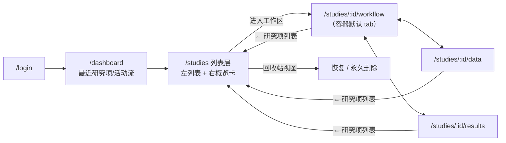
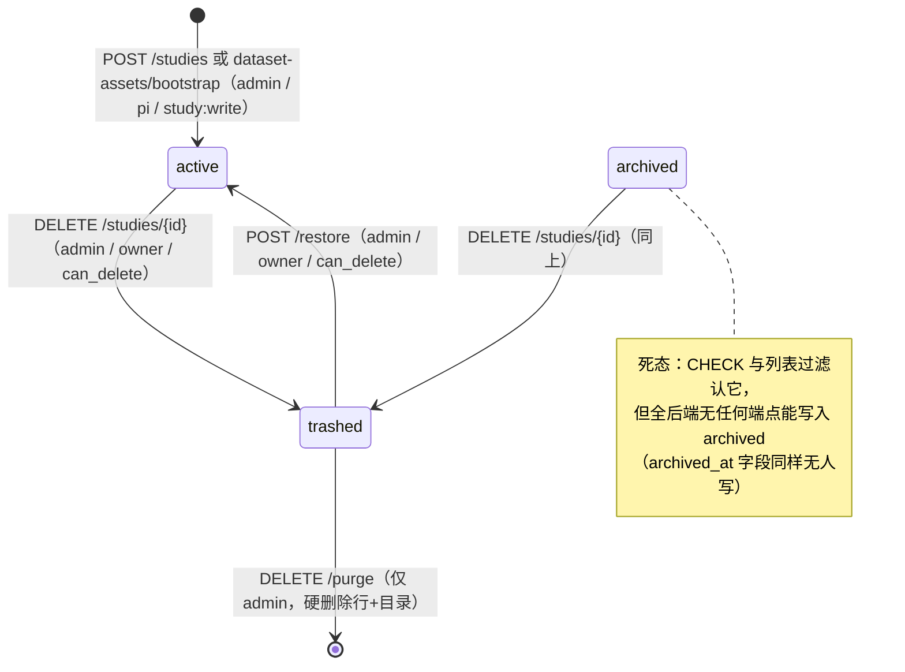
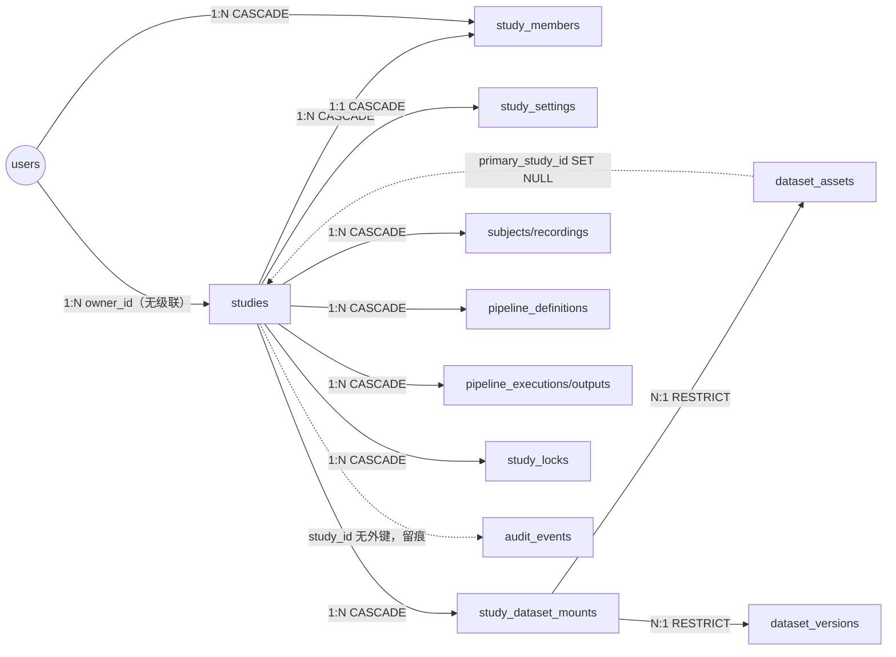

# 研究项 · Study

> 研究项是 ELYS 的"分析项目容器"：登录后用户在主线"登录 → **研究项** → 导入数据 → 搭工作流 → 执行 → 看输出"中的第二站。它圈定一块协作与权限边界（谁能看、谁能改、谁能跑），通过"挂载"引用数据集，并承载工作流、执行项、输出的全部生命周期。2026-06-08 容器化改版后，前端导航以"研究项 = 容器"组织：先在列表挑项目，再"进入工作区"干活。

## 1. 术语规范

| 中文名 | 业务名 | 代码类名 | 数据库表 | 前端主要文件 |
|---|---|---|---|---|
| 研究项 | Study | `Study` | `studies` | `views/StudiesPage.vue`、`views/study/StudyLayout.vue` |
| 研究项成员 | Study Member | `StudyMember` | `study_members` | `api/studies.ts`（UI 仅只读展示） |
| 研究设置 | Study Settings | `StudySettings` | `study_settings` | 暂无 UI |
| 数据集挂载 | Dataset Mount | `StudyDatasetMount` | `study_dataset_mounts` | `api/datasetAssets.ts:92-98` |
| 资源锁 | Study Lock | `StudyLock` | `study_locks` | 无直接 UI（工作流编辑/运行间接触发） |
| 研究项 ID 计数器 | — | —（纯 DB） | `study_id_counters` + 函数 `next_study_id()` | — |
| 工作区 | Workspace（UI 概念） | — | — | `views/study/StudyLayout.vue`（数据/工作流/结果三 tab 容器） |

**曾用名 / 废弃名（见到即改）：**

| 废弃名 | 现行名 | 说明 |
|---|---|---|
| Project / `projects` 表 | Study / `studies` | 2026-05-24 核心实体改名；代码注释里偶见 "Study/Study" 双写残留（如 `services/studies.py:2`） |
| `study_audit_events` 表 | `audit_events` | 2026-05-24 合并为统一审计表（`models/study.py:78` 注释） |
| `derived_dataset_retention_policy`（study_settings 字段） | 已删除 | 2026-06-08 Save 重构 P1 删除的死配置（wiki 9-02:83） |
| 存储子目录 `derived/` | `outputs/` | 2026-06-10 Save 重构 P2 收尾改名（`services/studies.py:34-41`） |
| 顶层 `/pipeline`、`/results` 路由 | `/studies/{id}/workflow`、`/studies/{id}/results` | 容器化后仅留兼容重定向（`router/index.ts:87-94`） |
| `utils/studySelection.ts`（跨页 sessionStorage 记忆） | `stores/study.ts` + 路径参数 | 容器化后已删（wiki 9-02:236） |

## 2. 功能定位与边界

**解决什么问题**：科研协作需要一个"项目"粒度的圈地——同一课题的人共享数据视图、工作流和算力产出，外人默认不可见。Study 就是这个圈：权限上它是对象级访问控制（不看你是什么平台角色，先看你在不在这个研究项的成员表里）的判定单元；存储上它是磁盘目录的命名单元（`data_root` 与新存储根都以 12 位 Study ID 命名）；执行上它是"单研究项同时只跑一个工作流"（`run_policy.single_active_pipeline_run`）等策略的配置单元。

**不负责什么**：Study 不拥有数据集本体——数据集（DatasetAsset）是跨研究项复用的独立资产，Study 只通过 `study_dataset_mounts` 表"挂载"（mount，类似把网盘文件夹映射进本地盘符）某个数据集的某个版本；卸载挂载不删数据。Study 也不管平台级角色（admin/pi 归 RBAC，见 07 档案），不管数据集的发布/撤回生命周期（见 01 档案）。

**为什么这样设计**：把"项目容器"与"数据资产"拆开，是为了让一份数据能被多个研究项引用而不复制（挂载锁定到具体版本，保证可追溯）；把成员权限放在 Study 级而不是全局，是因为科研协作的现实是"同一个人在 A 项目是负责人、在 B 项目只是看客"。前端的"两层架构"（2026-06-08，wiki 9-02:199-245）同理：第一层 `/studies` 列表负责"挑项目、看状态、治理"（master-detail：左列表右概览，点选不跳页），第二层 `/studies/:id` 工作区负责"干活"（Overleaf 式点进去就是操作界面），把"管理研究项"和"在研究项里工作"两种心智分开。

## 3. 数据库

本元素共 6 张表（均在 `schema/02_studies.sql`，除挂载表在 `03_datasets.sql`）：

| 表 | 角色 | 基数 |
|---|---|---|
| `studies` | 主表 | — |
| `study_id_counters` | ID 取号器 | 每自然月 1 行 |
| `study_members` | 成员与对象级权限 | Study 1:N |
| `study_settings` | 策略配置 | Study 1:1 |
| `study_dataset_mounts` | 数据集挂载 | Study 1:N |
| `study_locks` | 编辑/运行互斥锁 | Study 1:N |

### 3.1 `studies` 主表（schema/02_studies.sql:42-58）

| 字段 | 类型 | 约束 | 语义 |
|---|---|---|---|
| `id` | CHAR(12) | PK，DEFAULT `next_study_id()` | YYYYMM + 6 位当月序号（如 `202606000001`），同时是数据目录名 |
| `code` | VARCHAR(64) | UNIQUE NOT NULL | 业务短码，仅 UI 展示/搜索，不参与路径生成 |
| `name` | VARCHAR(200) | NOT NULL | 名称 |
| `description` | TEXT | — | 描述 |
| `status` | VARCHAR(16) | NOT NULL DEFAULT 'active' + CHECK | 见下方 CHECK 原文 |
| `owner_id` | UUID | NOT NULL REFERENCES users(id) | 负责人（权限直通的事实源之一，见 §9-2） |
| `data_root` | VARCHAR(512) | NOT NULL | 旧版数据根目录 `STUDIES_DIR/{id}` |
| `storage_quota_bytes` | BIGINT | NOT NULL DEFAULT 1099511627776 | 存储配额，默认 1 TB（**仅存储展示，无强制逻辑**，§9-8） |
| `created_at` / `updated_at` | TIMESTAMP | NOT NULL DEFAULT NOW() | 创建/更新时间 |
| `archived_at` | TIMESTAMP | — | **全后端无人写入**（archived 死态的一部分） |
| `deleted_at` / `deleted_by` / `delete_reason` | TIMESTAMP / UUID REFERENCES users(id) / TEXT | — | 回收站三件套，restore 时清空 |

状态 CHECK 原文：`CHECK (status IN ('active', 'archived', 'trashed'))`。注意 `'deleted'` **不在** CHECK 里：代码里对 `status == "deleted"` 的判断（`study_access.py:36`、`studies.py:107`）只是防御写法，硬删是物理删行，库里不存在 deleted 态的行。

### 3.2 `study_id_counters` 与 `next_study_id()`（02_studies.sql:10-36）

`yyyymm CHAR(6)` 主键 + `last_seq INTEGER NOT NULL DEFAULT 0`。函数用 `INSERT ... ON CONFLICT (yyyymm) DO UPDATE SET last_seq = last_seq + 1 ... RETURNING` 原子取号，拼出 `YYYYMM || LPAD(seq::TEXT, 6, '0')`——并发安全的月度自增序列，跨月自动开新计数行。

### 3.3 `study_members`（02_studies.sql:87-101）

| 字段 | 类型 | 约束 | 语义 |
|---|---|---|---|
| `id` | UUID | PK DEFAULT gen_random_uuid() | |
| `study_id` | CHAR(12) | NOT NULL，FK→studies **ON DELETE CASCADE** | 所属研究项 |
| `user_id` | UUID | NOT NULL，FK→users **ON DELETE CASCADE** | 成员 |
| `role` | VARCHAR(32) | NOT NULL DEFAULT 'viewer' + CHECK | 见下方 CHECK 原文 |
| `can_read` | BOOLEAN | NOT NULL DEFAULT TRUE | 五个细粒度布尔之一 |
| `can_write` / `can_delete` / `can_export` / `can_run` | BOOLEAN | NOT NULL DEFAULT FALSE | 同上 |
| `added_by` / `added_at` | UUID / TIMESTAMP | FK→users（无级联）/ DEFAULT NOW() | 添加人/时间 |
| — | — | `UNIQUE(study_id, user_id)` | 一人一研究项一行 |

role CHECK 原文：`CHECK (role IN ('owner', 'editor', 'viewer'))`。API 层角色到布尔的映射（`routers/studies.py:51-66` `STUDY_MEMBER_ROLE_FLAGS`，**只定义了 editor/viewer 两档**）：editor = 读/写/导出/运行 true、删 false；viewer = 只读。`can_run` 可在映射基础上单独覆写（payload 传值优先，:411,461）。

### 3.4 `study_settings`（02_studies.sql:126-133）

| 字段 | 类型 | 默认值 | 语义 |
|---|---|---|---|
| `study_id` | CHAR(12) | PK，FK→studies CASCADE | 一对一 |
| `default_dataset_filter` | JSONB NOT NULL | `{"subjects":"all","sessions":"all","tasks":"all","runs":"all","qa_status":"all","require_fif":true}` | 默认数据筛选 |
| `run_policy` | JSONB NOT NULL | `{"single_active_pipeline_run":true}` | 单活跃运行，默认开且执行链已强制 |
| `storage_policy` | JSONB NOT NULL | `{}` | 创建时由后端写入新旧存储根 URI（`services/studies.py:88-94`） |
| `updated_by` / `updated_at` | UUID SET NULL / TIMESTAMP NOT NULL | — | 最后修改人/时间 |

### 3.5 `study_dataset_mounts`（schema/03_datasets.sql:81-93）

| 字段 | 类型 | 约束 | 语义 |
|---|---|---|---|
| `id` | UUID | PK | |
| `study_id` | CHAR(12) | NOT NULL，FK→studies **CASCADE** | 挂到哪个研究项 |
| `dataset_asset_id` | UUID | NOT NULL，FK→dataset_assets **ON DELETE RESTRICT** | 挂的资产；有挂载时资产删不掉 |
| `dataset_version_id` | UUID | FK→dataset_versions **RESTRICT**，Phase 1 nullable | 锁定到具体版本（Phase 3 起应非空，§9-5） |
| `mount_name` | VARCHAR(128) | NOT NULL + `UNIQUE(study_id, mount_name)` | 研究项内挂载名唯一 |
| `selection_json` | JSONB NOT NULL DEFAULT '{}' | — | 子集筛选 |
| `is_active` | BOOLEAN NOT NULL DEFAULT TRUE | — | "卸载"= 置 false，不删行 |
| `mounted_by` / `mounted_at` | UUID SET NULL / TIMESTAMP NOT NULL | — | 挂载人/时间 |

### 3.6 `study_locks`（02_studies.sql:107-120）

| 字段 | 类型 | 约束 | 语义 |
|---|---|---|---|
| `study_id` | CHAR(12) | NOT NULL CASCADE | 锁的归属研究项 |
| `resource_kind` / `resource_id` | VARCHAR(64/128) | NOT NULL | 锁定对象（如 pipeline） |
| `lock_type` | VARCHAR(32) | NOT NULL + CHECK | `CHECK (lock_type IN ('edit', 'execution'))` |
| `locked_by` / `locked_at` | UUID SET NULL / TIMESTAMP | — | 持锁人/时间 |
| `expires_at` | TIMESTAMP | NOT NULL | TTL，超时视为可抢 |
| `released_at` / `released_by` | TIMESTAMP / UUID SET NULL | — | 释放即填，活锁判据 `released_at IS NULL` |

edit 锁用于工作流编辑互斥（`routers/pipelines.py:217,267`），execution 锁用于运行互斥（`pipelines.py:1107,1198` 等、`tasks/pipeline_tasks.py:39`）；细节见 08 档案。

### 3.7 唯一约束 / 关键索引 / 外键级联汇总

- **唯一**：`studies.code`；`study_members(study_id, user_id)`；`study_dataset_mounts(study_id, mount_name)`（**仅 SQL 有，ORM `models/study.py:274-279` 漏建**，§9-6）；部分唯一索引 `uq_study_locks_active_resource ON study_locks(study_id, resource_kind, resource_id, lock_type) WHERE released_at IS NULL`（同一资源同类锁同时只有一把活锁）。
- **索引**：`idx_studies_owner`、`idx_studies_status WHERE deleted_at IS NULL`、`idx_studies_trash WHERE status='trashed'`、`idx_study_members_user`、`idx_study_dataset_mounts_study(study_id, is_active)`、`idx_study_locks_expires WHERE released_at IS NULL` 等。
- **级联**：Study 硬删时 `study_members` / `study_settings` / `study_locks` / `study_dataset_mounts` / `subjects` / `recordings` / `pipeline_definitions` / `pipeline_executions` 等 **CASCADE 连坐**（`models/study.py:48-56` relationship 一览）；`audit_events.study_id` 故意**不设外键**（`models/study.py:89` 注释），硬删后审计仍留痕；`dataset_assets.primary_study_id` 为 **SET NULL**（资产不陪葬）；`async_tasks.study_id` 也是 SET NULL。

### 3.8 研究项域审计动作（写入 `audit_events`，表结构见 08 档案）

`study.created`、`study.settings.updated`、`study.member.upsert` / `study.member.updated` / `study.member.removed`、`study.dataset_mount.created` / `.updated` / `.deactivated`、`study.purge_blocked`、`study.purge`（含整行快照）。**注意：trash / restore 无审计动作**（§9-3）。

## 4. 后端

### 4.1 ORM 模型（backend/app/models/study.py）

| 类 | 行号 | 备注 |
|---|---|---|
| `Study` | 28-74 | 含 `to_dict()`；relationship 一览 :46-56 |
| `AuditEvent` | 77-100 | 与 Study 同文件（合并自旧 StudyAuditEvent） |
| `StudyMember` | 103-120 | |
| `StudyLock` | 123-153 | |
| `StudySettings` | 157-182 | |
| `StudyDatasetMount` | 272-295 | |

### 4.2 服务层关键函数

- `services/studies.py:69-77` `ensure_study_create_permission`：`has_role("admin")` 或 `has_role("pi")` 或 `has_permission("study:write")`，否则 403。
- `services/studies.py:218-315` `create_study`：flush 取号 → `data_root = STUDIES_DIR/{id}` → 建目录 → 写 owner 成员行（role='owner'，五布尔全 true，:249-259）→ 写 settings 行（带 storage_policy）→ 记两条审计 `study.created`（事务内，commit 可选）。
  - legacy 目录 8 个（:23-32）：`source_uploads`、`fifdata`、`upload_staging`、`validation`、`bids_exports`、`derivatives/preprocessing`、`pipeline`、`pipeline_runs`，根下写 `.elys_study.json` 标记。
  - 新存储目录 6 个（:34-41，根 = `STUDIES_STORAGE_ROOT/{id}`）：`executions`、`outputs`、`previews`、`temp`、`exports`、`pipeline_snapshots`（`outputs` 为 2026-06-10 由 `derived` 改名）。
  - 带重入护栏（:137-170）：同一 study.id 在同一调用栈被二次建目录直接抛 RuntimeError（调试遗留的防递归保险）。
- `services/study_access.py:30-78` `require_study_access` 及 `require_study_read/write/run` 薄封装：对象级权限判定核心（流程图见 07 档案 §6）。
- `services/study_summary.py` `build_study_summary`：`GET /{id}/summary` 聚合实现（counts、subject_total 去重、最近 5 条 pipeline、活跃执行、`member_role`/`can_run` 一并返回），消前端 12 请求 N+1。
- `services/execution_dependencies.py` `study_downstream_dependency_blockers`：purge 前查本研究项的 Run/输出是否被**其他研究项**的运行引用（查 `PipelineExecutionDependency` 跨研究项行）。
- `services/dataset_assets.py:381-440` `ensure_version_mountable`（挂载状态/可见性网关）：withdraw_requested/withdrawn 拒绝新挂；**unpublished 仅主研究项可挂**；published 跨研究项时按可见档（public 放行 / shared 查 `dataset_members` 授权 / private 仅主研究项）。
- `services/dataset_bootstrap.py:141,185` `bootstrap_dataset`：创建数据集时**配对创建新 Study**（复用 `create_study`），是 Study 的第二创建入口。

### 4.3 端点清单（routers/studies.py 与 routers/datasets.py，已逐一核对）

| 方法 | 路径 | 权限检查 | 作用 |
|---|---|---|---|
| GET | `/api/v1/studies` | 登录 + 可见性过滤（admin 全量；否则 owner∪成员，`apply_study_visibility` :134-147） | 列 active+archived |
| GET | `/api/v1/studies/trash` | 同上 | 列回收站 |
| POST | `/api/v1/studies` | `ensure_study_create_permission` | 创建（副作用见 4.2）；code 撞库 409 |
| GET | `/api/v1/studies/{id}` | `require_study_read` | 详情 |
| GET | `/api/v1/studies/{id}/summary` | `require_study_read` | 概览聚合（:288-304） |
| GET | `/api/v1/studies/{id}/settings` | `require_study_read` | 读设置（无行时返回默认值） |
| PUT | `/api/v1/studies/{id}/settings` | `require_study_write` | 改三段 JSONB，审计 `study.settings.updated` |
| GET | `/api/v1/studies/{id}/members` | `require_study_read` | 列成员 |
| POST | `/api/v1/studies/{id}/members` | `ensure_member_management_permission`（:167-178：admin / owner / 成员行 can_delete 或 role='owner'；trashed 409） | 加/改成员（upsert）；**对方必须 is_active 且具 pi 或 admin 角色（:387-388）**；不能加 owner 本人（:389-390）；审计 `study.member.upsert` |
| PUT | `/api/v1/studies/{id}/members/{member_id}` | 同上 | 改 role/can_run；不能改 owner（:444-445）；API 仅收 role ∈ editor/viewer（schemas/study.py:68） |
| DELETE | `/api/v1/studies/{id}/members/{member_id}` | 同上 | 移除；不能移 owner（:499-500）；204 |
| DELETE | `/api/v1/studies/{id}` | `ensure_study_delete_permission`（:158-164） | 软删 → trashed，写 deleted_at/by/reason；已 trashed 幂等返回（**无审计**） |
| POST | `/api/v1/studies/{id}/restore` | 同上 | trashed → active，清回收站三件套（**无审计**） |
| DELETE | `/api/v1/studies/{id}/purge` | `ensure_study_purge_permission`（:181-184，**仅 admin**） | 硬删（:602-693），前置/后置见 §7 |
| POST | `/api/v1/dataset-assets/bootstrap` | `data:write` + （配对新建时 `ensure_study_create_permission`；配对已有时 `require_study_write`）（datasets.py:2223-2244） | 创建数据集并配对 Study（mode=create 时新建 Study + 自动挂载） |
| GET | `/api/v1/studies/{study_id}/datasets/mounts` | `data:read` + `require_study_read`（datasets.py:2843-2860） | 列挂载（带资产统计） |
| POST | `/api/v1/studies/{study_id}/datasets/mounts` | `data:write` + `require_study_write`（:2863-2913） | 挂载；版本缺省取 `asset.current_version_id`；过 `ensure_version_mountable` 网关；审计 `study.dataset_mount.created` |
| PATCH | `/api/v1/studies/{study_id}/datasets/mounts/{mount_id}` | 同上（:2916-2965） | 改名/筛选/启停/升级版本；审计 `study.dataset_mount.updated` |
| DELETE | `/api/v1/studies/{study_id}/datasets/mounts/{mount_id}` | 同上（:2968-2994） | **软停用** `is_active=false`（不删行）；审计 `study.dataset_mount.deactivated` |

### 4.4 请求校验与错误码速查

- `StudyCreate`（schemas/study.py:13-17）：code 2-64 字符且仅限字母数字 `-_`；name 2-200；`storage_quota_gb` 默认 1024，范围 1-102400。
- 409：code 已存在 / 已在回收站操作 / 状态不允许删除 / `STUDY_PURGE_BLOCKED_BY_DOWNSTREAM_DEPENDENCIES` / `STUDY_PURGE_BLOCKED_BY_DATA`（后两个带结构化 detail）。
- 422：成员角色非 editor/viewer（studies.py:223）/ 目标用户非 pi/admin（:388）/ purge 确认 ID 不匹配（:613）。

### 4.5 一个 Study 在磁盘上的样子（创建即建好，purge 时整树删除）

```text
{STUDIES_DIR}/{study_id}/              ← 旧版 data_root（兼容期保留）
├── .elys_study.json                   ← 标记文件：id/code/name/新旧存储根
├── source_uploads/   fifdata/   upload_staging/   validation/
├── bids_exports/     derivatives/preprocessing/
└── pipeline/         pipeline_runs/

{STUDIES_STORAGE_ROOT}/{study_id}/     ← 新存储根（storage_policy 记录 URI elys://studies/{id}）
├── .elys_study.json
├── executions/                        ← 执行项工作目录
├── outputs/                           ← 输出数据（2026-06-10 由 derived/ 改名）
├── previews/   temp/   exports/   pipeline_snapshots/
```

purge 删除目录前有双重安全检查（routers/studies.py:187-202）：目标必须位于允许根目录内部、且目录名等于 study_id，防御 `data_root` 被改坏后误删任意路径。

## 5. 前端

- **路由**（`router/index.ts:48-79`）：`/studies`（列表）；`/studies/:studyId` 容器（默认 redirect → `workflow`），子路由 `data` → `StudyDetailPage.vue`、`workflow` → `PipelinePage.vue`、`results` → `ResultsPage.vue`。studyId 走 **URL 路径参数**（事实源），旧 `/pipeline?study_id=`、`/results?study_id=` 仅兼容重定向（:87-94）。
- **页面/组件**：
  - `StudiesPage.vue`：第一层 master-detail——左研究项列表（普通/回收站两个视图切换），右选中项概览卡 + 治理动作 + "进入工作区"按钮（→ `/studies/:id/workflow`）；选中态同步 URL `?study=id` 刷新可恢复；回收站视图支持恢复/永久删除（purge 需手输 12 位 Study ID 确认，:276,797）。
  - `views/study/StudyLayout.vue`：第二层容器——顶栏（← 列表 / 名称 / 状态 pill / code）+ 三 tab "数据 | 工作流·运行 | 结果"（:53-57）；PipelinePage 走 keep-alive（:38）；工作流 tab 宽画布、其余限宽 1200。
  - `views/study/StudyOverviewTab.vue`：概览卡（嵌在 StudiesPage 右栏），吃 summary 聚合端点。
- **Pinia store**：`stores/study.ts`——只缓存当前研究项详情对象（防竞态：id 对齐才算 loaded，:24-26,46），不当 id 源；离开容器 `reset()`。
- **API client**：`api/studies.ts`（list / get / summary / listTrash / create / trash / restore / purge / listMembers / saveMember / updateMember / removeMember）；挂载四件套在 `api/datasetAssets.ts:92-98`。
- **当前 UI 形态**：两层架构（wiki 9-02:199-245）。**成员管理无 UI**：`saveMember/updateMember/removeMember` 已备好但全前端只调了 `listMembers`（StudiesPage.vue:529，只读展示）；**设置（study_settings）同样无 UI**，`run_policy` 由后端强制。概览卡用 summary 的 `member_role`/`can_run` 显示"我的角色，可/不可发起运行"（StudyOverviewTab.vue:221-222）。

页面间导航流（容器化后的两层）：



前端状态展示对照（StudyLayout.vue:78-91）：

| status | 标签 | 样式 |
|---|---|---|
| `active` | 活跃 | 绿 pill |
| `archived` | 已归档 | 灰 pill（不可达，§9-1） |
| `trashed` | 回收站 | 红 pill |
| `deleted` | 已删除 | 红 pill（防御写法，库中不存在该态） |

## 6. 生命周期



各状态语义与触发者：

- `active`（活跃）：正常工作态，所有读写运行端点的默认前提。进入途径：直接创建（admin/pi/`study:write`）、数据集 bootstrap 配对创建、回收站恢复。
- `archived`（已归档）：**死态**——`routers/studies.py` 仅在列表过滤（:260）与软删前置检查（:563）读它；dashboard 统计它（`dashboard_summary.py:191-198`）；前端有"已归档"标签（StudyLayout.vue:81）。无人能触发进入。
- `trashed`（回收站）：对象级访问统一 409"请先恢复"（`study_access.py:38-39`）；成员管理同样拒绝（studies.py:168-169）；普通列表不展示、回收站视图展示。触发者 = admin / owner / 成员 can_delete（或 role='owner' 兜底）。无自动清理 TTL，可无限期恢复。
- **终态**：物理删除。purge 后行消失（CASCADE 清光下属表），磁盘两处目录删除，仅 `audit_events` 留 `study.purge` 事件，`snapshot` 字段存整个 `study.to_dict()`。触发者仅 admin。

## 7. 行为清单

| 操作 | 端点/入口 | 谁能做 | 关键副作用/约束 |
|---|---|---|---|
| 创建研究项 | POST /studies | admin / pi / 有 `study:write` 者 | 取号、建 14 个磁盘目录 + 2 个 `.elys_study.json`、owner 成员行、settings 行、双审计；code 撞车 409 |
| 配对创建（bootstrap） | POST /dataset-assets/bootstrap | `data:write` + 创建门槛 | 一次完成"建数据集 + 建/选 Study + 自动挂载"，活动流折叠为一张配对卡片 |
| 看列表 / 回收站 | GET /studies、/studies/trash | admin 全量；否则 owner∪成员 | trashed 的详情访问 409 |
| 看详情 / 概览 | GET /{id}、/{id}/summary | can_read（admin/owner 直通） | summary 附带 `member_role`、`can_run` 供前端控件 |
| 改设置 | PUT /{id}/settings | write 权限（admin/owner/can_write/role=owner） | 审计 settings.updated；`single_active_pipeline_run` 已被执行链强制 |
| 加/改成员 | POST·PUT /{id}/members* | admin / owner / 成员 can_delete 或 role='owner' | 对方须 active 且 pi/admin 角色；owner 行不可改；API 只收 editor/viewer；can_run 可单独覆写；审计 |
| 移除成员 | DELETE /{id}/members/{member_id} | 同上 | 不能移 owner；审计 member.removed |
| 挂载数据集 | POST /{study_id}/datasets/mounts | `data:write` + study write + 对资产可见 | 版本网关：unpublished 仅主研究项；private 仅主研究项；shared 须授权；挂载名研究项内唯一；审计 |
| 调整/卸载挂载 | PATCH·DELETE /mounts/{mount_id} | 同上 | 卸载仅 `is_active=false`，行保留（执行追溯需要）；审计 |
| 移入回收站 | DELETE /{id} | admin / owner / can_delete | active/archived → trashed；幂等；写 delete_reason；**不写审计** |
| 恢复 | POST /{id}/restore | 同上 | 仅 trashed 可恢复；清 deleted_*；**不写审计** |
| 永久删除 | DELETE /{id}/purge | **仅 admin** | 前置：必须 trashed + 手输确认 ID + 无跨研究项下游依赖 + 本地数据为空（recordings / executions / outputs / 依赖行计数全 0，否则 409）；后置：审计快照 → 删两处目录（带"目录必须在允许根内且同名"安全检查 :187-202）→ 删行触发 CASCADE；被拦时也写 `study.purge_blocked` 审计 |

## 8. 与其他元素的关系



- **users 1:N studies**（`owner_id`，无级联）：owner 在对象级权限上全直通；外键反向还起到"用户删不掉"的隐性保险（平台本就无删用户端点，见 07 档案）。
- **studies 1:N study_members**（CASCADE）：对象级权限载体；同一 user 一行（UNIQUE）。
- **studies 1:1 study_settings**（CASCADE）：策略配置；读端点对缺行容错（按默认值返回）。
- **studies 1:N study_dataset_mounts N:1 dataset_assets/versions**（资产侧 RESTRICT）：Study 删除走 CASCADE 清挂载行，但反过来"有挂载的资产"删不掉；`primary_study_id` 是资产对"出生研究项"的软引用（SET NULL，资产不陪葬）。
- **studies 1:N subjects / recordings / pipelines / executions / outputs / locks**（CASCADE）：purge 的"本地数据为空"前置就是为了不让 CASCADE 静默吞掉业务数据——先逼用户显式清空，再让 CASCADE 只清骨架。
- **audit_events 弱关联**（study_id 无外键）：Study 域动作与硬删快照的留痕地；跨研究项引用检查（purge 前置）依赖 `pipeline_execution_dependencies`，详见 05/06 档案。

## 9. 待讨论（不确定 / 未完成 / 矛盾）

1. **archived 是死态**
   - 现状：CHECK 有它（02_studies.sql:48）、列表与 dashboard 统计它（studies.py:260、dashboard_summary.py:191-198）、前端有"已归档"标签（StudyLayout.vue:81），但无任何端点写入，`archived_at` 全库无人赋值（grep 证实）。
   - 为什么是问题：半成品状态让 UI/统计承诺了一个不可达的能力，新接手者会浪费时间找"归档按钮在哪"。
   - 可选方向：补"归档/取消归档"端点（顺手定义归档态的读写限制，比如只读+不可运行）；或从 CHECK 和 UI 里删掉这个值。
2. **成员 role 双轨，owner 行与 `studies.owner_id` 谁是事实源无定论**
   - 现状：DB CHECK 允许 `owner/editor/viewer` 三档，但 API schema `StudyMemberRole = Literal["editor","viewer"]`（schemas/study.py:68），owner 行只由 `create_study` 内部写入（services/studies.py:249-259）；权限判定里 owner 走 `studies.owner_id` 特判直通（study_access.py:41），成员行的 `role=='owner'` 只是 WRITE/DELETE/EXPORT/RUN 的布尔兜底（:50-53）——且 **READ 没有这个兜底**（:49 只看 can_read），理论上存在"owner 行 can_read=false 时读被拒、写放行"的怪态。
   - 为什么是问题：两套 owner 语义并存，"转让负责人""owner 行被手工改坏"等场景没有确定行为；也解释不了"owner 成员行存在的意义是什么"。
   - 可选方向：定 `studies.owner_id` 为唯一事实源、成员行收敛成 editor/viewer 两档；或反过来全走成员行、`owner_id` 退化为展示字段。无论哪种都要补"转让 owner"端点时一并定。
3. **trash / restore 不写审计**
   - 现状：`trash_study`（studies.py:551-575）与 `restore_study`（:578-599）没有任何 `record_audit_event` 调用，全库 grep 无 `study.trashed/restored` 动作；与"研究项域关键动作已接审计（含软删恢复）"的既有叙述冲突（以代码为准）。
   - 为什么是问题：回收站操作恰是治理审计最关心的动作，目前只能靠 `deleted_by/delete_reason` 字段倒推，且恢复后这些字段被清空、痕迹全无。
   - 可选方向：补 `study.trashed` / `study.restored` 两条审计动作（写法照抄 settings.updated 即可）。
4. **成员管理与设置无前端入口**
   - 现状：API 齐全但 UI 只读（§5）；`saveMember/updateMember/removeMember` 与 settings 读写在前端零调用。
   - 为什么是问题：协作功能后端就绪、产品上不可用，目前只能 API 手调。
   - 可选方向：在 StudiesPage 右栏或工作区补成员/设置管理面板；或明确"调试期走 API"暂不补。
5. **挂载版本 Phase 1 nullable**
   - 现状：`dataset_version_id` 仍可空（03_datasets.sql:85-86 注释"Phase 3 起非空，历史回填策略待定 DEC-2026-0531 Q-6"）。
   - 为什么是问题：可空意味着"挂载锁定版本"的追溯承诺有漏洞——空版本的挂载读到的是"当前最新"，结果不可复现。
   - 可选方向：版本化收尾后改 NOT NULL（调试期可直接 DROP 重建，无回填负担）。
6. **ORM 漏建 `UNIQUE(study_id, mount_name)`**
   - 现状：SQL schema 有（03_datasets.sql:92），`models/study.py:274-279` 的 `__table_args__` 只有 4 个普通索引。
   - 为什么是问题：实际生效靠 SQL 建库，但 ORM 与 schema 漂移会误导以 ORM 为准的读者，且基于 ORM `create_all` 的测试库不会有这条约束。
   - 可选方向：ORM 补一行 `Index(..., unique=True)`。
7. **回收站无时限**
   - 现状：trashed 可无限期恢复，无 TTL/定期清理任务。
   - 为什么是问题：回收站会无限堆积；与输出（StudyOutput）回收站的 GC 策略不一致。
   - 可选方向：与 06 档案的 GC 一起定保留期与到期动作（自动 purge 还是仅提醒）。
8. **存储配额未强制**
   - 现状：`storage_quota_bytes` 仅在创建时换算入库、详情/审计里回显（services/studies.py:233、:271），全后端没有任何"用量统计 vs 配额"检查；上传/执行不会因超配额被拒。
   - 为什么是问题：创建表单收了"存储配额(GB)"输入，给了用户"有配额管理"的错误预期。
   - 可选方向：补用量统计与超额拦截；或暂从创建表单隐藏该字段。

## 10. 大模型画图提示词

请画一张「ELYS 平台 研究项（Study）元素全景图」，读者是新接手的开发者，目标是一页看懂研究项的定位、数据结构、生命周期、权限与周边关系。中文标签，代码名（表名/字段/端点/状态值）用等宽字体，状态机用带箭头的转换线，待讨论项用⚠警示标记。布局分七个分区：①左上「定位与术语」：一句话"分析项目容器 = 协作权限边界 + 数据挂载方 + 工作流/执行/输出的宿主"；标注曾用名 `Project→Study`（2026-05 改名，见到即改）。②左中「核心数据结构」：画 5 张表卡片——`studies`（`id CHAR(12)`=YYYYMM+6位序号、`code` 唯一短码、`status`、`owner_id`、`data_root`、配额默认 1TB⚠未强制、回收站三件套 `deleted_at/deleted_by/delete_reason`）、`study_members`（`role: owner/editor/viewer` + 五布尔 `can_read/can_write/can_delete/can_export/can_run`，`UNIQUE(study_id,user_id)`）、`study_settings`（`run_policy.single_active_pipeline_run=true` 强制单活跃运行）、`study_dataset_mounts`（`UNIQUE(study_id,mount_name)`，`dataset_asset_id` RESTRICT、`dataset_version_id` 锁定版本）、`study_locks`（`lock_type: edit/execution`，活锁部分唯一索引 + TTL `expires_at`）。③中央最醒目画「生命周期状态机」：`[*] → active`（触发 `POST /api/v1/studies` 或数据集 bootstrap 配对创建，门槛 admin/pi/`study:write`）；`active → trashed` 与 `archived → trashed`（`DELETE /studies/{id}`，admin/owner/can_delete）；`trashed → active`（`POST /studies/{id}/restore`，同上）；`trashed → 终态物理删除`（`DELETE /studies/{id}/purge`，**仅 admin**，前置=确认ID+无跨研究项下游依赖+本地数据为空，后置=DB CASCADE+删磁盘目录+审计快照）；`archived` 画成孤立灰色状态并标 ⚠"死态：无任何端点写入"。④右上「关键行为与端点」列表：成员管理（admin/owner/can_delete；对方须 pi/admin 角色；owner 行不可改；API 只收 editor/viewer）、挂载 `POST /studies/{id}/datasets/mounts`（`data:write`+study写权限；unpublished 版本仅主研究项可挂；卸载=置 `is_active=false` 不删行）、概览聚合 `GET /studies/{id}/summary`。⑤右中「与其他元素关系」：User —owner/成员→ Study；Study 1:N 挂载 N:1 DatasetAsset（RESTRICT，资产不陪葬）；Study 1:N Pipeline→Execution→Output（CASCADE 连坐）；audit_events 弱关联无外键（硬删留痕）。⑥底部「权限规则条」：判定顺序——研究项不存在 404 → trashed 409 先恢复 → admin/`owner_id` 直通 → 成员行五布尔（write/delete/export/run 认 role=owner 兜底，read 不认）。⑦右下「待讨论 ⚠」：archived 死态、owner 双轨事实源未定、trash/restore 无审计、成员管理无 UI、挂载版本可空、配额未强制。整体风格：白底工程蓝图风，状态机居中放大，表卡片紧凑，箭头标注触发端点与角色。
