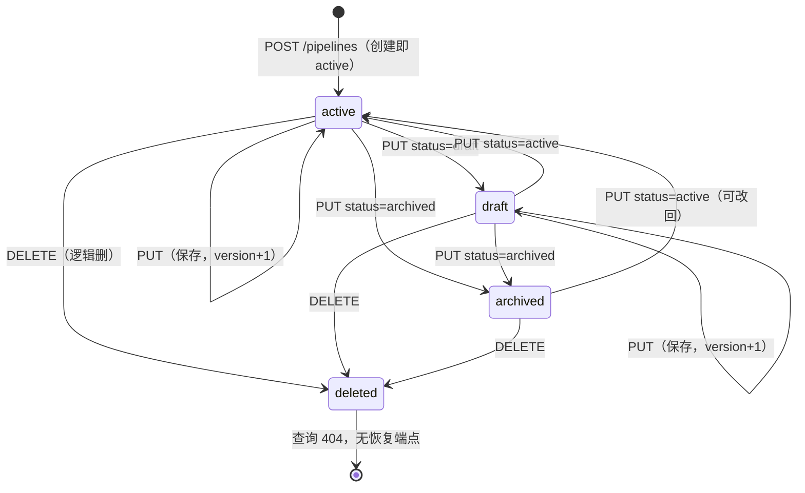
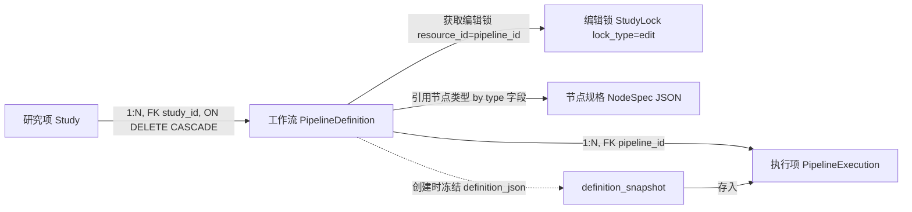

# 工作流 · PipelineDefinition

> Pipeline 是一张「怎么处理脑电」的可复用流程图（节点 + 连线 + 参数 + 数据选择规则）。在主线「登录 → 研究项 → 导入 → **工作流** → 执行 → 输出」中处于第四环：它只描述**模板**，不绑定具体数据、不产文件；按下「运行」才会冻结成一次 Execution（见 [05 执行项](05_执行项_Execution.md)）。

---

## 1. 术语规范

| 中文名 | 业务名 | 代码类名 | 数据库表 | 前端主要文件 |
|---|---|---|---|---|
| 工作流 | Pipeline / 流程定义 | `PipelineDefinition` | `pipeline_definitions` | `views/PipelinePage.vue` |
| 节点规格 | NodeSpec | （无 ORM，JSON 文件 + `NodeRegistry`） | 无（`pipeline/nodes/*.json`） | 节点库面板（PipelinePage 内） |
| 编辑锁 | Edit Lock | `StudyLock`（`lock_type='edit'`） | `study_locks` | `pipelineApi.acquire/refresh/releaseEditLock` |

**乐观锁**（保存时带版本号 `expected_version`，版本对不上就拒绝、防两人互相覆盖）通过 `pipeline_definitions.version` 实现，不是独立的表或字段类型。

### 曾用名 / 废弃名（见到即改）

| 废弃写法 | 现行写法 | 出处 / 说明 |
|---|---|---|
| `run` 锁类型 | `execution` 锁类型 | `study_locks.lock_type` CHECK 现为 `edit / execution`（06-05 曾因漏改 CHECK 导致所有运行 409） |
| `eeg/filter/fir`、`eeg/filter/butterworth`、`eeg/filter/notch`（三个独立滤波节点） | 合一为 `eeg/filter/apply`（统一滤波：带通/高通/低通/陷波） | 06-05 滤波三合一，旧 3 节点 JSON + handler 已删 |
| `eeg/output/save_result`（保存节点） | 不存在 | 幽灵节点，曾出现在文档，代码中从无 JSON / handler，已从文档删除 |
| `pipeline_versions`（不可变版本表） | 未拆，用 `version` + Execution `definition_snapshot` 承担追溯 | MVP 阶段决策，见 wiki 5-20 §1 |

---

## 2. 功能定位与边界

**解决什么问题。** 科研脑电处理是一条固定的流水线：读数据 → 滤波 → 重采样 → 重参考 → ICA 去伪迹 → 分段 → 求 ERP。Pipeline 把这条流水线画成一张有向图存下来，让用户「画一次、反复跑」，并且能改参数、能给别人复用（`is_template` 标记模板）。它管的是「**怎么处理**」这件抽象的事。

**不负责什么。** Pipeline 不保存具体跑的是哪条记录（如 `sub-001 upload-003`）、不保存服务器绝对路径、不保存任何一次运行产出的文件、也不保存用户确认的科研结论。这些都属于「**这一次实际怎么跑**」，归 Execution 管。Pipeline 里的 LoadData 节点只存「动态选择规则」（如「本研究项里 task=rest 的当前数据」），到运行时才解析成静态文件清单。

**为什么这样设计。** 把「模板」和「某一次执行」彻底分开，换来两个好处：① 改 Pipeline 不会动到历史运行——历史 Execution 自带定义快照（`definition_snapshot`），永远按当时的样子可复现；② 同一张 Pipeline 能套不同数据反复跑，不用每次重画。代价是多一层「解析」（运行时把 selector 解析成具体文件），以及需要乐观锁 + 编辑锁来防多人同时改一张图时互相覆盖。

---

## 3. 数据库

### 3.1 `pipeline_definitions` 关键字段

来源：`database/schema/04_pipelines.sql:10-25`、ORM `backend/app/models/study.py:481-498`。

| 字段 | 类型 | 约束 | 语义 |
|---|---|---|---|
| `id` | SERIAL（自增整数） | PK | 工作流主键，整数（**非 UUID**，与 Execution 不同） |
| `study_id` | CHAR(12) | NOT NULL, FK→studies | 所属研究项 |
| `name` | VARCHAR(200) | NOT NULL | 工作流名，与 study_id 组成唯一键 |
| `description` | TEXT | | 描述 |
| `definition_json` | JSONB | NOT NULL | 节点图本体（`graph/nodes/edges/settings/loadData`） |
| `node_count` | INTEGER | NOT NULL DEFAULT 0 | 节点数（保存时由 `count_nodes()` 重算） |
| `version` | INTEGER | NOT NULL DEFAULT 1 | **乐观锁版本号**，每次保存 +1 |
| `is_template` | BOOLEAN | NOT NULL DEFAULT FALSE | 是否模板 |
| `status` | VARCHAR(16) | NOT NULL DEFAULT `'active'` | 生命周期状态，见枚举 |
| `created_by` | UUID | FK→users | 创建人 |
| `created_at` / `updated_at` | TIMESTAMP | NOT NULL DEFAULT NOW() | 时间戳 |

### 3.2 状态枚举（CHECK 原文）

```sql
status VARCHAR(16) NOT NULL DEFAULT 'active'
    CHECK (status IN ('draft', 'active', 'archived', 'deleted'))
```

| 状态 | 语义 |
|---|---|
| `draft` | 草稿，可编辑，只能试跑（`trial`） |
| `active` | 正式可运行（默认值，创建即 active） |
| `archived` | 归档，不再默认展示，禁止创建新 Execution |
| `deleted` | 逻辑删除，查询时不可见（404） |

### 3.3 唯一约束 / 关键索引 / 外键 ON DELETE

- **唯一约束**：`UNIQUE(study_id, name)`——同一研究项内工作流名不可重复。违反时端点捕获 `IntegrityError` → 409「同名工作流已存在」。
- **索引**：`idx_pipeline_study` on `(study_id)`。
- **外键 ON DELETE**：`study_id → studies(id) ON DELETE CASCADE`（研究项删除则其工作流一并删除）；`created_by → users(id)`（无级联指定，默认 RESTRICT）。
- **关联表的反向引用**：`pipeline_executions.pipeline_id → pipeline_definitions(id) ON DELETE CASCADE`、`pipeline_jobs.pipeline_id`、`pipeline_execution_inputs.pipeline_id` 同为 CASCADE。注意：业务删除走**逻辑删**（`status='deleted'`），不触发这些级联；只有物理 DROP 研究项时才级联。

---

## 4. 后端

### 4.1 ORM 模型

- `PipelineDefinition`：`backend/app/models/study.py:481-498`
- `StudyLock`（编辑锁复用）：`backend/app/models/study.py:123-154`，其中 `uq_study_locks_active_resource` 是带 `WHERE released_at IS NULL` 的部分唯一索引——保证同一 `(study, resource_kind, resource_id, lock_type)` 同时只有一把活跃锁。

### 4.2 服务层 / 引擎关键函数

| 函数 | 位置 | 作用 |
|---|---|---|
| `count_nodes(definition_json)` | `routers/pipelines.py:139` | 从 `graph.nodes` 数节点 |
| `ensure_pipeline_edit_lock_available()` | `routers/pipelines.py:221` | 保存/续期/释放前检查锁是否被他人持有，是则 409 |
| `acquire_or_refresh_pipeline_edit_lock()` | `routers/pipelines.py:237` | 获取编辑锁；自己已持有则续期，他人持有则 409 |
| `pipeline_execution_status_violation()` | `services/pipeline_execution_rules.py:15` | Execution 创建时按 Pipeline 状态 × 模式硬校验（见下表） |
| `validate_definition()` | `pipeline/validator.py` | 校验节点图：NodeSpec 存在、必填参数齐全（按 `visible_when` 可见才必填）、连线类型匹配、有合法 LoadData |
| `get_node_registry()` | `pipeline/registry.py:64` | 启动时加载 `pipeline/nodes/*.json`，`@lru_cache` 单例 |

**Execution 创建对 Pipeline 状态的硬校验**（`ALLOWED_EXECUTION_MODES_BY_PIPELINE_STATUS`，`pipeline_execution_rules.py:9-12`）：

| Pipeline 状态 | 允许的 `execution_mode` |
|---|---|
| `active` | `analysis` / `trial` |
| `draft` | 仅 `trial` |
| `archived` | 无（禁止） |
| `deleted` | 无（且查询 404） |

不满足返回 409，错误体含 `code=PIPELINE_EXECUTION_STATUS_NOT_ALLOWED`、`message`、`pipeline_status`、`execution_mode`。

### 4.3 端点清单（已逐条到 `routers/pipelines.py` 核对路径与权限）

前缀统一 `/api/v1`（`router = APIRouter(prefix="/api/v1", tags=["工作流"])`）。权限三档：`require_study_read`（读）/ `require_study_write`（写）/ `require_study_run`（运行），分别经 `get_study_for_read/write/run` 包装（`routers/pipelines.py:528-540`）。

| 方法 | 路径 | 权限检查 | 作用 | 行号 |
|---|---|---|---|---|
| GET | `/pipeline/nodes` | 无（公开节点规格） | 列出全部 NodeSpec，可按 `phase` 过滤 | `1447` |
| GET | `/studies/{study_id}/pipelines` | read | 列出研究项工作流（排除 deleted） | `1797` |
| POST | `/studies/{study_id}/pipelines` | **write** | 新建工作流，初始 `version=1`、`status='active'` | `1813` |
| GET | `/studies/{study_id}/pipelines/{pipeline_id}` | read | 取单个工作流（deleted 返回 404） | `1861` |
| POST | `/studies/{study_id}/pipelines/{pipeline_id}/edit-lock` | **write** | 获取（或续期自己的）编辑锁，TTL 30min | `1872` |
| POST | `.../edit-lock/refresh` | **write** | 续期编辑锁；无锁返回 404 | `1908` |
| DELETE | `.../edit-lock` | **write** | 释放编辑锁（非自己持有则 409） | `1958` |
| PUT | `/studies/{study_id}/pipelines/{pipeline_id}` | **write** | 保存工作流，**必带 `expected_version`**，版本不符 409；他人持锁 409 | `1993` |
| DELETE | `/studies/{study_id}/pipelines/{pipeline_id}` | **write** | 逻辑删（`status='deleted'`，version+1），不级联删历史 Execution | `2055` |
| POST | `/studies/{study_id}/pipelines/{pipeline_id}/validate` | read | 校验当前定义（不创建 Execution） | `2653` |
| POST | `/studies/{study_id}/pipelines/{pipeline_id}/executions` | **run** | 创建一次执行（详见 [05](05_执行项_Execution.md)） | `3636` |

> 注意：保存（PUT）走 **write** 权限，运行（POST executions）走 **run** 权限——能编辑的人不一定能运行。
> `expected_version` 在 schema 里是必填（`PipelineUpdate.expected_version: int = Field(..., ge=1)`，`schemas/pipeline.py:95`），所以不带版本号会被 Pydantic 拦下返回 **422**；版本号带了但对不上才是端点内的 **409**。

---

## 5. 前端

- **路由路径**：`/studies/:studyId/workflow`（路由名 `StudyWorkflow`，`router/index.ts:66-71`）。研究项默认落点即工作流页（`StudyLayout` redirect → `StudyWorkflow`）。
- **页面 / 组件文件**：`views/PipelinePage.vue`（巨石组件，当前 **7039 行**，由 7297 行拆分进行中）。被 `views/study/StudyLayout.vue:38` 的 `<keep-alive :include="['PipelinePage']">` 缓存（防 LiteGraph 画布每次切 tab 重建）。
- **状态来源**：`selectedStudyId = computed(() => route.params.studyId)`（`PipelinePage.vue:1281`），不再用跨页记忆。组件 `defineOptions({ name: 'PipelinePage' })` 以匹配 keep-alive include。
- **Pinia store**：工作流页本身不直接依赖独立 store；研究项级状态在 `stores/study.ts`，工作流数据经 `pipelineApi` 直接拉取。
- **API client 函数**（`api/pipelines.ts` 的 `pipelineApi`）：`listNodeSpecs / list / create / get / update / remove / validate / run`、编辑锁 `acquireEditLock / refreshEditLock / releaseEditLock`。
- **拆分进度**（第 1 批已落地，`composables/pipeline/`）：`pipelineConstants.ts`（39 个模块级常量）、`pipelineFormatters.ts`（33 个纯展示/格式化函数）、`usePipelineEditor.ts`（承重墙 composable）、`useDraftPersistence.ts`（草稿暂存）、`useEditorLayout.ts`、`useNodeLibrary.ts`、`useExecutionTasks.ts`。后续批次（画布引擎 `useLiteGraphCanvas`、模板子组件化）为规划。
- **当前 UI 形态**：左侧节点库面板（按 category 分组，拖拽/双击加节点）+ 中间 **LiteGraph.js** 画布（`import { LGraph, LGraphCanvas, LGraphNode, LiteGraph } from 'litegraph.js'`，`PipelinePage.vue:1097`，直接画在 `<canvas>` 上、绕过 Vue 虚拟 DOM）+ 右侧参数检查器（按 NodeSpec `visible_when` 渲染、`advanced` 折叠高级参数）+ 顶部工具栏（工作流下拉切换 / 保存 / 校验 / 运行 / 删除节点）。运行后底部抽屉看执行详情。
- **NodeSpec 原语**：`visible_when`（`{控制字段:[允许值]}`，按其它参数取值条件显示某参数，如「陷波才显示 notch_freq」「IIR 才显示 order」）+ `advanced`（高级折叠）。前端按可见性渲染，validator 的必填校验也改为「可见才必填」。

> **06-10 已修**：之前工作流画布卡「正在初始化」、右键无菜单——根因是 keep-alive 缓存的 PipelinePage 顶部用 `<Teleport>`（内含 `<select :value>`）把工作流选择器吊到容器标题栏，`Teleport + keep-alive + select` 三者相撞崩了 **Vue 渲染器**（非 LiteGraph），冻结整页 DOM 更新；删掉 Teleport 改就地渲染即恢复。

---

## 6. 生命周期



| 状态 | 语义一句话 | 谁能触发进入 |
|---|---|---|
| `active` | 正式可运行，创建默认态 | `create_pipeline`（恒为 active）；或 `update_pipeline` 改 status |
| `draft` | 草稿，只能 `trial` 试跑 | `update_pipeline` 把 status 改 draft |
| `archived` | 归档，禁新运行、可改回 active | `update_pipeline` 改 status；**无独立 archive 端点** |
| `deleted` | 逻辑删，404 不可见 | `delete_pipeline`（DELETE） |

**触发者权限**：进入任何状态都走 **write**（`update_pipeline` / `delete_pipeline` 均 `get_study_for_write`）。

**终态说明**：`deleted` 是终态。`get_pipeline_or_404` 过滤 `status != 'deleted'`，所以已删除工作流连 PUT 都够不到；且 `PipelineUpdate.status` 的 Literal 只接受 `draft/active/archived`（不含 deleted），**没有任何恢复端点**。`archived` **不是**终态，可经 PUT 改回 `active`。

---

## 7. 行为清单

| 操作 | 端点 / 入口 | 谁能做 | 关键副作用 / 约束 |
|---|---|---|---|
| 新建工作流 | POST `/pipelines` | study write | `version=1`、`status='active'`、写 `audit_events`；同名 409 |
| 保存工作流 | PUT `/pipelines/{id}` | study write | 必带 `expected_version`（缺→422，不符→409）；他人持编辑锁→409；成功 `version+1` + 写审计 |
| 获取编辑锁 | POST `.../edit-lock` | study write | 写 `study_locks`（`lock_type=edit`），TTL 30min；他人持有→409 |
| 续期编辑锁 | POST `.../edit-lock/refresh` | study write | 刷新 `expires_at`；无锁→404 |
| 释放编辑锁 | DELETE `.../edit-lock` | study write | 置 `released_at`；非自己持有→409 |
| 归档 | PUT `.../{id}` body `{status:'archived', expected_version}` | study write | 之后禁新 Execution；可改回 active |
| 逻辑删除 | DELETE `/pipelines/{id}` | study write | `status='deleted'`、`version+1`、写审计；**不级联删历史 Execution**；不可恢复 |
| 校验定义 | POST `.../validate` | study read | 只返回 errors/warnings，不创建 Execution、不改库 |
| 列出节点规格 | GET `/pipeline/nodes` | 无鉴权（公开） | 返回 8 个内置 NodeSpec，可按 `phase` 过滤 |

---

## 8. 与其他元素的关系



- **Study 1 : N Pipeline**：一个研究项含多张工作流，FK `study_id` ON DELETE CASCADE；同研究项内 `name` 唯一。
- **Pipeline → NodeSpec（弱引用）**：`definition_json.nodes[].type` 引用 NodeSpec 的 `type` 字段（如 `eeg/filter/apply`），不是数据库外键——NodeSpec 是 JSON 文件、无表。校验时 `validate_definition` 查 `NodeRegistry` 确认 type 存在且有 handler。
- **Pipeline → 编辑锁（按需）**：编辑时通过 `study_locks`（`resource_kind=pipeline`, `resource_id=pipeline_id`, `lock_type=edit`）实现「同一时刻仅一人编辑」；锁有 TTL，过期或离开自动让位。
- **Pipeline 1 : N Execution**：每次「运行」按 `definition_json` 当前内容冻结出一个 Execution（`definition_snapshot`）。删除 Pipeline（逻辑删）**不删**历史 Execution——历史可独立复现。

---

## 9. 待讨论（不确定 / 未完成 / 矛盾）

1. **`archived` 有枚举值，但无独立归档/恢复端点。**
   - 现状：归档只能经 `PUT /pipelines/{id}` 设 `status='archived'`（`PipelineUpdate.status` Literal 含 archived，`schemas/pipeline.py:94`）；`deleted` 经 DELETE 设置后**无任何恢复端点**（`get_pipeline_or_404` 排除 deleted，PUT 也够不到；Literal 不接受 deleted）。
   - 为什么是问题：与权威事实包预期一致（「archived 大概率无归档端点」坐实——确实没有专用端点，复用通用 PUT）。`deleted` 不可逆，调试期清库无碍，但若未来要「回收站」需补端点。
   - 可选方向：① 接受现状（归档=普通状态切换，删除=不可逆）；② 若产品需要，补 `POST .../archive` 与 `POST .../restore` 显式端点 + 软删恢复。

2. **前端编辑锁的获取/心跳/释放接入程度待核。**
   - 现状：后端三端点齐全；前端 `pipelineApi` 有 `acquireEditLock/refreshEditLock/releaseEditLock`，`PipelinePage.vue:4169/4185/4201` 有调用点。
   - 为什么是问题：wiki 5-20 §10 仍把「前端接入 edit lock 获取、心跳续期、离开释放」列为后续任务，与代码已有调用点存在表述滞后；是否真正接了**定时心跳**与**离开自动释放**需在画布交互逻辑里进一步确认（本次只确认了三个调用点存在，未确认是否挂在 `onActivated/onDeactivated` 心跳定时器上）。
   - 可选方向：核对 `PipelinePage.vue` 是否有 `setInterval` 续期 + `onBeforeUnmount/onDeactivated` 释放；若缺则补，并把 wiki 5-20 §10 对应条目标为已完成。

3. **乐观锁与编辑锁职责重叠。**
   - 现状：保存同时受两道闸——编辑锁（他人持有→409 `PIPELINE_EDIT_LOCKED`）+ 乐观锁（`expected_version` 不符→409「版本已变化」）。
   - 为什么是问题：两者都防并发覆盖，但语义不同（锁=「我正在改」，版本=「你看到的不是最新」）。当编辑锁「兼容策略」允许无锁保存时（`ensure_pipeline_edit_lock_available` 在无锁时放行），乐观锁是唯一兜底；两道闸的边界对用户不直观。
   - 可选方向：保持双闸（锁是软提示、版本是硬保证）即可，但前端 409 提示需区分两种 code，给不同的「重新载入 / 等待解锁」引导。

---

## 10. 大模型画图提示词

> 请画一张「**ELYS 平台 · 工作流（PipelineDefinition）元素全景图**」单页信息图。读者是**新接手本项目的开发者**，目标是一眼看懂「工作流」这个核心对象是什么、长什么样、怎么流转、有哪些操作、和谁有关系。用中文标签，代码标识符（表名/字段/端点/枚举值）一律用等宽字体。整张图分成 7 个带标题的分区，建议两列布局。
>
> **① 定位与术语**（左上）：标题「工作流 = 怎么处理脑电的可复用流程图」。一句话：它只存模板（节点+连线+参数+数据选择规则），不绑具体数据、不产文件；在主线「登录→研究项→导入→工作流→执行→输出」里是第 4 环。术语对照：中文名「工作流」/ 代码类 `PipelineDefinition` / 表 `pipeline_definitions` / 前端 `PipelinePage.vue`（LiteGraph.js 画布）。标注废弃名（用删除线）：锁类型 `run`→`execution`；三个滤波节点 `eeg/filter/fir|butterworth|notch`→合一为 `eeg/filter/apply`；幽灵节点 `eeg/output/save_result`（已删）。
>
> **② 核心数据结构**（左中）：画 `pipeline_definitions` 表的字段卡片，标出 `id`(SERIAL 整数主键)、`study_id`(FK)、`name`(与 study_id 唯一)、`definition_json`(JSONB 节点图)、`version`(乐观锁版本号)、`is_template`、`status`、`node_count`。旁注：编辑锁复用 `study_locks` 表（`lock_type='edit'`, `resource_id=pipeline_id`）。再画 8 个内置 NodeSpec（JSON 文件、无表）：`eeg/data/load`(LoadData)、`eeg/filter/apply`(Filter 统一滤波)、`eeg/preproc/resample`(重采样)、`eeg/preproc/rereference`(重参考)、`eeg/ica/compute`(Compute ICA)、`eeg/ica/apply`(Apply ICA，交互式)、`eeg/epoch/segment`(Epoch)、`eeg/analysis/erp`(ERP)。
>
> **③ 生命周期状态机**（右上，重点画大）：状态用原值 `draft` / `active` / `archived` / `deleted`，配中文注。转换：`[起点]→active`（POST 创建，**创建即 active**）；`active⇄draft`、`active→archived→active`（PUT 改 status，可来回，version+1）；任意态 `→deleted`（DELETE 逻辑删，**不可恢复、无恢复端点**）。每个箭头标触发端点与触发者（全部 study **write** 权限）。醒目标注：`deleted` 是终态、查询 404；`archived` 禁止创建新 Execution。
>
> **④ 关键行为与端点**（右中）：表格列出，前缀 `/api/v1`：创建 `POST /studies/{sid}/pipelines`(write)；保存 `PUT .../pipelines/{pid}`(write，**必带 `expected_version`**，缺→422 / 不符→409)；删除 `DELETE .../pipelines/{pid}`(write，逻辑删)；校验 `POST .../validate`(read)；编辑锁 `POST/POST refresh/DELETE .../edit-lock`(write，TTL 30 分钟)；节点规格 `GET /pipeline/nodes`(公开)；运行 `POST .../executions`(**run** 权限，产出 Execution)。
>
> **⑤ 与其他元素关系**（含基数）：`研究项 Study —1:N→ 工作流`（FK `study_id`, ON DELETE CASCADE，同研究项 name 唯一）；`工作流 —弱引用→ NodeSpec`（按 `nodes[].type` 字段，非外键）；`工作流 —1:N→ 执行项 PipelineExecution`（运行时把 `definition_json` 冻结成 `definition_snapshot`，删工作流不删历史执行）；`工作流 —按需→ 编辑锁 StudyLock`（同一时刻仅一人编辑）。
>
> **⑥ 权限规则**（小区块）：三档权限 `read`/`write`/`run`。要点：**保存=write、运行=run**（能编辑≠能运行）；编辑锁与节点规格列表分别走 write 与公开。
>
> **⑦ 待讨论项**（底部，用⚠️警示色框）：⚠️ `archived` 有枚举但无独立归档/恢复端点（复用通用 PUT），`deleted` 不可逆；⚠️ 前端编辑锁是否真有定时心跳+离开自动释放待核（wiki 仍列为待办）；⚠️ 乐观锁(version)与编辑锁(lock)职责重叠，前端 409 需区分两种 code 给不同引导。
>
> 风格：中文为主、代码名等宽、状态机用带箭头的圆角状态框、关系区用带基数标注的连线、待讨论区用警示标记（⚠️）。信息全部已写在本提示词内，无需外部依赖。
