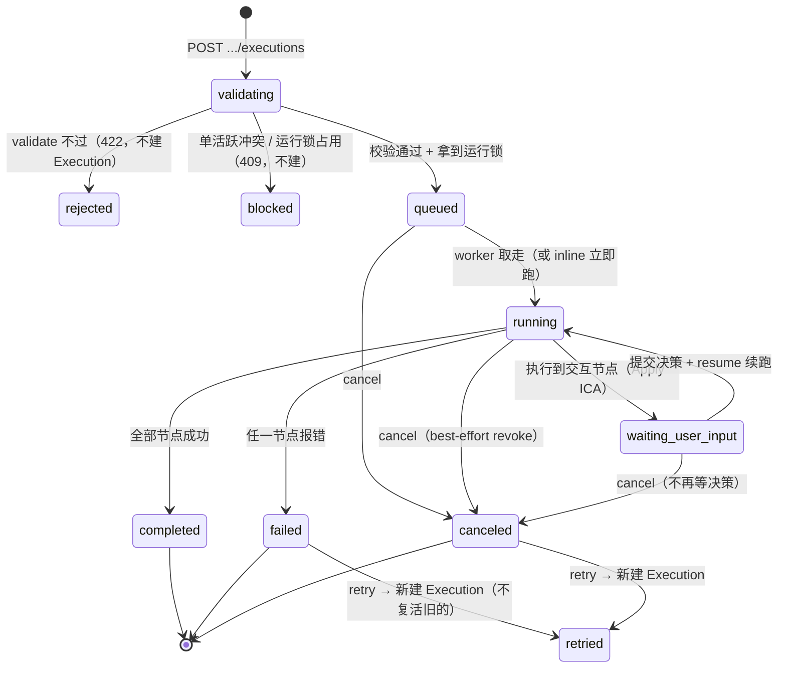
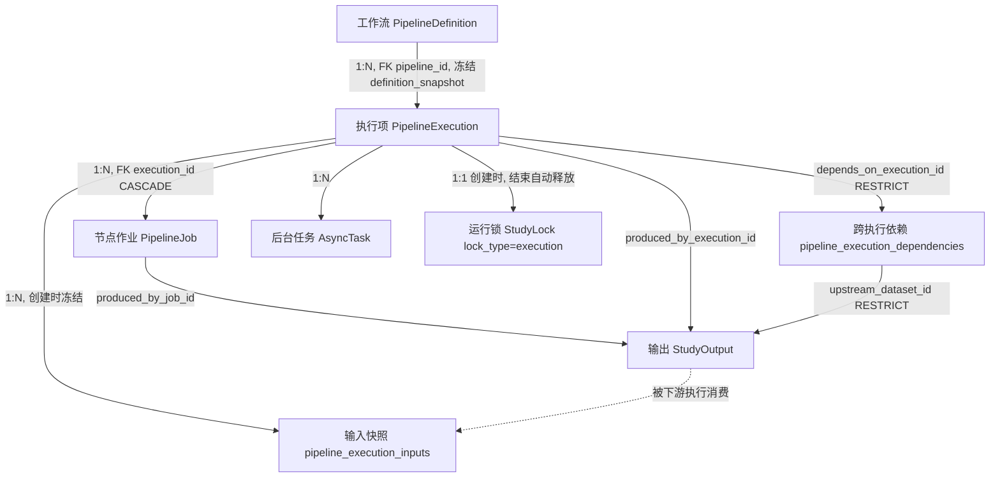

# 执行项 · PipelineExecution

> Execution 是某张工作流的**一次具体执行**——按下「运行」那一刻，把工作流定义、要跑的数据、运行人都冻结成一条不可变记录，然后交给后台 Celery 一个节点一个节点跑出结果。在主线「登录 → 研究项 → 导入 → 工作流 → **执行** → 输出」中处于第五环：上承工作流（[04 Pipeline](04_工作流_Pipeline.md)）、下产输出（StudyOutput）。

---

## 1. 术语规范

| 中文名 | 业务名 | 代码类名 | 数据库表 | 前端主要文件 |
|---|---|---|---|---|
| 执行项 | Execution / 运行 | `PipelineExecution` | `pipeline_executions` | `views/PipelinePage.vue`（执行抽屉）、`views/ResultsPage.vue` |
| 节点作业 | Job / 节点任务 | `PipelineJob` | `pipeline_jobs` | PipelinePage 执行抽屉「节点任务」tab |
| 输入快照 | Input Snapshot | `PipelineExecutionInput` | `pipeline_execution_inputs` | 执行抽屉「输入」tab |
| 跨执行依赖 | Dependency | `PipelineExecutionDependency` | `pipeline_execution_dependencies` | 执行抽屉「Lineage」tab |
| 后台任务 | Async Task | `AsyncTask` | `async_tasks` / `task_events` | 执行抽屉「任务」tab |
| 运行锁 | Execution Lock | `StudyLock`（`lock_type='execution'`） | `study_locks` | （后端内部） |

### 曾用名 / 废弃名（见到即改）

| 废弃写法 | 现行写法 | 出处 / 说明 |
|---|---|---|
| `Run` / `pipeline_runs` / `run_id` | `Execution` / `pipeline_executions` / `execution_id` | 全栈改名；`execution_seq`（不是 `run_seq`） |
| `succeeded`（作为 Execution 成功态） | `completed`（Execution 级成功态） | **execution.status 用 `completed`，不是 `succeeded`** |
| `run` 锁类型 | `execution` 锁类型 | `study_locks.lock_type` CHECK = `edit / execution` |
| `Execution.save_policy`（保留意图字段） | 已删（死代码） | 06-08 Save 重构 P1：曾被创建/存储/展示却从不驱动行为，已删 |
| `retention_status`（输出 5 值状态机） | `keep` + `cache_eligible` + `deleted_at`（三层解耦） | 06-09 Save 重构 P3：见 [05_outputs.sql] 与 wiki 9-02 |
| `derived/`（磁盘输出目录） | `outputs/` | 06-09 P2 改名 |

> 注意细微差异：**Execution 成功叫 `completed`，但 Job（节点级）成功叫 `success`**（见 §3.2）——这是两套独立枚举，不要混用。

---

## 2. 功能定位与边界

**解决什么问题。** 工作流是「怎么处理」的模板，但科研要的是「这一次到底跑了什么、用了哪些数据、谁在什么时候跑的、产出了什么」——这就是 Execution。它在创建那一刻做三件冻结：① 冻结工作流定义到 `definition_snapshot`（之后改工作流不影响本次）；② 冻结 LoadData 解析出的实际数据清单到 `pipeline_execution_inputs`（之后数据集再上传新版本也不影响本次）；③ 记下运行人、触发方式、模式。然后拆成一串 `PipelineJob`（每个节点一行），按拓扑序（按依赖先后排的执行顺序）交给后台执行。

**不负责什么。** Execution 不保存「当前数据」的动态引用（那是工作流 LoadData selector 的事）、不保存可被后续编辑改变的工作流定义（用的是快照）、也不强制永久保留所有中间大文件（保留与否交给输出层的 `keep` / `cache_eligible` / GC）。

**为什么这样设计。** 科研可复现性的核心诉求是「这次结果到底怎么来的、能不能原样再跑一遍」。把每次执行连同**它当时看到的一切**（定义快照 + 输入快照 + 参数 + 决策）一起冻结，就能做到：数据集后续继续上传、`canonical_fif` 被清理、工作流被改甚至删除，历史 Execution 依然自洽可追溯。代价是存储冗余（每次执行存一份定义快照）和「解析」开销（创建时把 selector 解析成静态清单）。

---

## 3. 数据库

### 3.1 `pipeline_executions` 关键字段

来源：`database/schema/04_pipelines.sql:31-55`、ORM `backend/app/models/study.py:501-549`。

| 字段 | 类型 | 约束 | 语义 |
|---|---|---|---|
| `id` | UUID | PK DEFAULT `gen_random_uuid()` | 执行项主键（**UUID**，与 Pipeline 的整数 id 不同） |
| `study_id` | CHAR(12) | NOT NULL, FK→studies CASCADE | 所属研究项 |
| `pipeline_id` | INTEGER | NOT NULL, FK→pipeline_definitions CASCADE | 来自哪张工作流 |
| `pipeline_version` | INTEGER | NOT NULL | 创建时工作流的版本号 |
| `execution_seq` | INTEGER | NOT NULL | 每 `(study, pipeline)` 递增序号，组成唯一键 |
| `trigger` | VARCHAR(32) | NOT NULL DEFAULT `'manual'` | 触发方式：`manual`（手动）/ `retry`（重试时写入） |
| `status` | VARCHAR(32) | NOT NULL DEFAULT `'running'` | 执行状态，见枚举（创建时端点显式置 `queued`） |
| `node_count` | INTEGER | NOT NULL DEFAULT 0 | 节点数 |
| `dataset_count` | INTEGER | NOT NULL DEFAULT 0 | 输入数据条数（输入快照统计） |
| `definition_snapshot` | JSONB | NOT NULL DEFAULT `{}` | **创建时冻结的工作流定义** |
| `manifest_json` | JSONB | NOT NULL DEFAULT `{}` | 执行清单摘要快照 |
| `execution_mode` | VARCHAR(32) | NOT NULL DEFAULT `'analysis'` | 运行模式，见枚举 |
| `result_json` / `error_json` | JSONB | NOT NULL DEFAULT `{}` | 运行结果摘要 / 错误 |
| `started_by` | UUID | FK→users | 运行人 |
| `started_at` / `finished_at` | TIMESTAMP | started_at DEFAULT NOW() | 起止时间 |

### 3.2 状态枚举（CHECK 原文）

**Execution 状态**（`pipeline_executions.status`）：

```sql
status VARCHAR(32) NOT NULL DEFAULT 'running'
    CHECK (status IN ('queued', 'running', 'waiting_user_input', 'completed', 'failed', 'canceled'))
```

| 状态 | 语义 |
|---|---|
| `queued` | 已创建、入队，等待 worker（创建端点显式置此值，覆盖 schema 默认的 running） |
| `running` | 正在逐节点执行 |
| `waiting_user_input` | 执行到交互节点（如 Apply ICA），暂停等人工决策 |
| `completed` | 全部节点成功完成（**成功态，非 succeeded**） |
| `failed` | 执行失败 |
| `canceled` | 用户/系统取消 |

**执行模式**（`pipeline_executions.execution_mode`）：

```sql
execution_mode VARCHAR(32) NOT NULL DEFAULT 'analysis'
    CHECK (execution_mode IN ('trial', 'analysis', 'replay', 'system'))
```

| 模式 | 语义 | 实际可达性 |
|---|---|---|
| `analysis` | 正式分析（默认） | ✅ active 工作流可用 |
| `trial` | 试跑 | ✅ active / draft 工作流可用 |
| `replay` | 重放 | ⚠️ 见 §9-1，业务规则下永不可创建 |
| `system` | 系统任务 | ⚠️ 见 §9-1，业务规则下永不可创建 |

**Job 状态**（`pipeline_jobs.status`，**无 CHECK 约束**，DEFAULT `'pending'`）——核对代码实际写入值（`pipeline/executor.py`、`routers/pipelines.py`）：

| Job 状态 | 写入位置 | 语义 |
|---|---|---|
| `pending` | `_create_jobs` 默认（`executor.py:267`） | 已建作业、未开跑 |
| `running` | `_execute_node` 开始（`executor.py:525`） | 节点执行中 |
| `success` | 节点正常完成（`executor.py:633-635`，取 `dispatch_result.status`） | **节点成功（注意是 success，不是 completed）** |
| `cached` | 命中节点缓存（`executor.py:547`） | 复用历史产物、跳过计算 |
| `waiting_user_input` | 交互节点等待 | 节点暂停等人工 |
| `failed` | 节点报错 / 校验失败 | 节点失败 |
| `canceled` | 取消时未结束的 job 被批量置此（`pipelines.py:1246`） | 取消波及的节点 |

> `CACHEABLE_NODE_STATUSES = ("success", "cached")`（`pipeline/cache.py:18`）——印证 Job 成功态是 `success`。

### 3.3 `pipeline_jobs` 关键字段

来源：`04_pipelines.sql:61-83`、ORM `study.py:552-589`。

| 字段 | 类型 | 语义 |
|---|---|---|
| `id` | UUID | 作业主键 |
| `execution_id` | UUID, FK→pipeline_executions CASCADE | 所属执行 |
| `node_id` / `node_type` / `node_title` | VARCHAR | 节点标识 / 类型（如 `eeg/filter/apply`）/ 显示名 |
| `status` | VARCHAR(32) DEFAULT `pending` | 见 §3.2（无 CHECK） |
| `topo_index` | INTEGER | **拓扑序**（按依赖先后排的执行顺序，0 开始） |
| `params_json` / `input_json` / `output_json` | JSONB | 参数 / 输入 / 输出 |
| `input_hash` / `params_hash` / `node_hash` | VARCHAR(128) | 三个指纹（见 §4.3 缓存） |
| `trace_code` | VARCHAR(256) | `{type}-{node_hash前16位}`，用于日志追踪 |
| `log_tail` / `error_json` | TEXT / JSONB | 日志尾 / 错误 |
| `duration_ms` | INTEGER | 耗时毫秒 |

### 3.4 `pipeline_execution_inputs`（输入快照）

来源：`05_outputs.sql:103-135`、ORM `study.py:629-675`。创建时冻结 LoadData 解析结果，历史执行不受后续数据变化影响。

| 字段 | 语义 |
|---|---|
| `execution_id` / `pipeline_id` / `job_id` / `node_id` / `node_type` | 归属 |
| `input_slot` / `input_index` | 输入槽位 / 序号 |
| `input_kind` | 输入类型：`selector` / `dataset_file` / `dataset` / `study_output`（后者来自跨执行依赖） |
| `storage_uri` / `logical_path` / `file_role` | **创建时冻结**的文件位置与角色（不依赖 dataset_files 当前值） |
| `sha256` | 当时文件校验和 |
| `selector_json` | LoadData 当时的选择器 + override + 最终解析参数快照 |
| `resolved_metadata_json` | 当时解析出的数据元数据快照 |
| `upstream_execution_id` / `upstream_dataset_id` | 若输入来自上游执行的输出 |

冻结逻辑：`PipelineExecutor._ensure_execution_input_snapshots()`（`executor.py:280-419`），对每个 LoadData 节点解析 selector → 为每条命中数据写一行 `input_kind=dataset_file/dataset` + 一行 `selector`。

### 3.5 `pipeline_execution_dependencies`（跨执行依赖）

来源：`05_outputs.sql:141-151`、ORM `study.py:678-702`。记录「这次执行依赖了哪次执行/哪个输出」，用于下游引用保护。

| 字段 | 语义 |
|---|---|
| `execution_id` | 下游执行（依赖方） |
| `depends_on_execution_id` | 上游执行（被依赖方） |
| `upstream_dataset_id` | 上游 `study_outputs` 输出 |
| `dependency_kind` | 默认 `upstream_execution`；实际写入 `upstream_study_output`（消费上游输出）/ `retry_of`（重试追溯） |

### 3.6 唯一约束 / 关键索引 / 外键 ON DELETE

- **唯一约束**：`UNIQUE(study_id, pipeline_id, execution_seq)`——同一工作流的执行序号不重复。`execution_seq` 由 `next_pipeline_execution_seq()`（`pipelines.py:880`）取 `max(seq)+1` 生成。
- **关键索引**：`idx_pipeline_executions_pipeline (study_id, pipeline_id, execution_seq DESC)`、`idx_pipeline_executions_mode (study_id, execution_mode)`、`idx_pipeline_jobs_execution_topo (execution_id, topo_index)`、`idx_pipeline_jobs_study_hash (study_id, node_hash)`（缓存查找用）。
- **外键 ON DELETE 行为**（重点）：
  - `pipeline_executions.study_id / pipeline_id` → **CASCADE**（删研究项/物理删工作流时级联）。
  - `pipeline_jobs.execution_id` → **CASCADE**（删执行连带删作业）。
  - `pipeline_execution_inputs.execution_id` → **CASCADE**；其内部各 `*_id`（dataset_file 等）→ **SET NULL**（被引用的文件删了，快照行保留、外键置空，hash/storage_uri 仍在）。
  - `pipeline_execution_dependencies.depends_on_execution_id` → **RESTRICT**；`upstream_dataset_id (→study_outputs)` → **RESTRICT**——**下游引用保护**：被下游依赖的上游执行/输出不能直接删，必须先解依赖。

---

## 4. 后端

### 4.1 ORM 模型

- `PipelineExecution`：`backend/app/models/study.py:501-549`（含 `jobs / study_outputs / inputs / dependencies / downstream_dependencies` 关系）
- `PipelineJob`：`study.py:552-589`
- `PipelineExecutionInput`：`study.py:629-675`
- `PipelineExecutionDependency`：`study.py:678-702`

### 4.2 引擎 / 服务层关键函数

| 函数 | 位置 | 作用 |
|---|---|---|
| `_create_pipeline_execution()` | `routers/pipelines.py:3358` | 创建执行：状态校验 → validate → 单活跃检查 → 拿运行锁 → 建 Execution+AsyncTask → prepare → 派发 Celery 或 inline |
| `PipelineExecutor.prepare_execution()` | `pipeline/executor.py:50` | 拓扑排序 → 建 jobs → 冻结输入快照 |
| `PipelineExecutor.execute_prepared_execution()` | `executor.py:73` | 逐节点执行主循环，逐 job 跑 dispatcher、写状态、收敛 Execution 终态 |
| `PipelineExecutor._execute_node()` | `executor.py:501` | 单节点：算三指纹 → 查缓存 → dispatcher 执行 → 写 job |
| `run_pipeline_execution_sync()` | `pipeline/background.py:19` | 同步执行入口（Celery task 与 inline 都调它）；开头检查 `canceled` 则跳过 |
| `run_pipeline_task` | `tasks/pipeline_tasks.py:45` | Celery 任务，跑完写 task_event/audit、**释放运行锁**、刷 manifest |
| `record_execution_artifact_dependencies()` | `services/execution_dependencies.py:33` | 节点消费上游输出时，自动写 inputs + dependencies |
| `assert_artifact_can_be_deleted()` | `execution_dependencies.py:145` | 删输出前查下游依赖，有则抛 `ArtifactDependencyError` |
| `mark_pipeline_execution_canceled()` | `pipelines.py:1204` | 标记取消：Execution + 未结束 jobs 批量置 canceled |
| `clone_pipeline_execution_inputs()` | `pipelines.py:1314` | 重试 `reuse_snapshot` 时复制旧输入快照 |

### 4.3 节点缓存（06-08 Save 重构 P4）

「这个节点的产物该不该缓存」由 ROI 评分决定，**存储优先**（默认倾向不缓存）：

- 评分公式（`pipeline/cache_policy.py:31`）：`cache_score = compute_cost − STORAGE_WEIGHT × output_footprint`，`STORAGE_WEIGHT = 2`，`> 0` 才缓存。
- 三条硬规则优先于评分：① `interactive` 节点强制不缓存（缓存恢复会短路掉 `waiting_user_input` 人工确认）；② `output_footprint=explosive` 永不物化全量；③ 缺标签默认不缓存（LoadData 等 source 节点天然落此分支）。
- **当前 8 节点里仅 `eeg/ica/compute` 命中缓存**（`expensive=3 − 2×small=1 = +1`）；其余要么评分 ≤0（如 Filter `moderate=2 − 2×large=3 = -4`）、要么交互（Apply ICA）、要么缺标签（LoadData）。
- 缓存命中链路：`_execute_node` 先调 `is_cache_eligible(node_spec)` 门控（`executor.py:672-674`），再由 `PipelineCache.restore_node_output()`（`cache.py:53`）按 `node_hash` 找历史成功 job、校验文件存在 + sha256 匹配 + 未被删除（`deleted_at is None`），命中则**不 INSERT 复制行**而是复用旧 `study_output` 引用（避免撞 `idx_study_output_sha256` 唯一约束）。
- `node_hash` 已移除 cache 块（`hash.py:70-104`）：只含 `node_type + backend.module/function + params_hash + input_hash`，spec 元数据/缓存策略字段不参与，保证 spec 升级不破缓存。

### 4.4 运行模式与单活跃运行

- **执行模式开关** `PIPELINE_EXECUTION_MODE`（`config.py:31`，**默认 `"auto"`**；生产 `deploy/deploy.sh:766` 设为 `celery`）。三值 `{auto, celery, inline}`（`pipelines.py:136`）：
  - `celery`：恒走 Celery worker（异步）；
  - `inline`：恒在请求线程内同步跑完；
  - `auto`：探测有无 Celery worker，有则 celery、无则 inline（`should_execute_pipeline_inline()`，`pipelines.py:1021`）。
- **后台任务追踪** `async_tasks` 表，其状态枚举为 `queued/running/succeeded/failed/canceled/retrying`（注意 AsyncTask 用 `succeeded`，与 Execution 的 `completed` 不同口径）。
- **单活跃运行**：`study_settings.run_policy.single_active_pipeline_run`（默认 `true`，`study.py:176`）且**已强制**——创建执行前查整个 Study 有无 `queued/running/waiting_user_input` 的执行，有则 409 `STUDY_EXECUTION_ACTIVE`（`pipelines.py:3405-3425`）。另有 per-pipeline 运行锁（`study_locks` `lock_type=execution`, TTL 10min）兜底同一工作流的并发；执行结束由 `run_pipeline_task` 自动释放（`pipeline_tasks.py:86`）。

### 4.5 端点清单（已逐条到 `routers/pipelines.py` 核对路径与权限）

前缀 `/api/v1`。权限：`read` / `write` / `run`。

| 方法 | 路径 | 权限 | 作用 | 行号 |
|---|---|---|---|---|
| POST | `/studies/{sid}/pipelines/{pid}/executions` | **run** | 创建执行（状态校验+validate+冻结+派发） | `3636` |
| GET | `/studies/{sid}/pipelines/{pid}/executions` | read | 列出某工作流的执行（按 seq 倒序） | `2081` |
| GET | `/studies/{sid}/pipeline-executions/{eid}` | read | 执行详情（含 inputs/deps/tasks/jobs/outputs） | `2355` |
| GET | `.../{eid}/lineage` | read | 上下游血缘聚合图 | `2423` |
| GET | `.../{eid}/manifest` | read | 执行清单（懒生成） | `2435` |
| POST | `.../{eid}/cancel` | **run** | 取消 `queued/running/waiting_user_input` | `2454` |
| POST | `.../{eid}/retry` | **run** | 从 `failed/canceled` 创建新执行 | `2525` |
| GET | `.../{eid}/jobs` | read | 节点作业列表 | `2798` |
| GET | `.../{eid}/outputs` | read | 本次执行产出（支持 `include_deleted`） | `2820` |
| GET | `.../{eid}/jobs/{jid}/interaction` | read | 取交互节点（ICA）待决策信息 | `3265` |
| POST | `.../{eid}/jobs/{jid}/decision` | **write** | 提交 ICA 排除决策（乐观锁 `decision_version`） | `3282` |
| POST | `.../{eid}/jobs/{jid}/resume` | **write** | 决策后从该节点续跑 | `3308` |
| GET | `/studies/{sid}/tasks` / `/tasks/{tid}` | read | 后台任务列表 / 详情 | `1470/1501` |
| GET | `/studies/{sid}/tasks/{tid}/events` | read | 任务事件（进度/日志） | `1519` |
| GET | `.../tasks/{tid}/events/stream` | read | **SSE 实时推送**（服务端已实现，见 §9-5） | `1533` |
| POST | `.../tasks/{tid}/cancel` | **run** | 取消任务（pipeline 任务同步取消 Execution） | `1567` |
| POST | `.../tasks/{tid}/retry` | **write** | 重试任务（pipeline 任务引导走 Execution retry） | `1694` |

> **权限观察（待讨论）**：cancel / retry 走 **run** 权限但**不校验 `started_by == current_user`**——任何 `can_run` 成员可取消/重试**他人**发起的执行。decision / resume / interaction 提交则走 **write/read**，与运行权限不同档。

---

## 5. 前端

- **路由路径**：执行项无独立路由，依附两处——工作流页 `/studies/:studyId/workflow`（`PipelinePage.vue` 底部执行抽屉）+ 结果页 `/studies/:studyId/results`（`ResultsPage.vue`，跨执行浏览输出）。
- **页面 / 组件**：
  - `views/PipelinePage.vue`：执行抽屉（`runDrawerOpen`），7 个 tab，**默认进「派生数据」**——`派生数据(artifacts) / 节点任务(jobs) / 任务(tasks) / 输入(inputs) / 摘要(summary) / Manifest / Lineage`（`executionDetailTabs`，`PipelinePage.vue:2262`；默认 `executionDetailTab = ref('artifacts')`，`:1354`）。Manifest / Lineage 懒加载。
  - `views/ResultsPage.vue`：跨执行的输出列表 + 批量动作（改名/标签/`keep`切换/删除/下载/清理）+ lineage 视图。
- **Pinia store**：`stores/study.ts`（研究项级），执行数据经 `pipelineApi` 直接拉。
- **API client 函数**（`api/pipelines.ts`）：`run / cancelExecution / retryExecution / listExecutions / getExecution / getExecutionManifest / getExecutionLineage / listExecutionJobs / listExecutionStudyOutputs`；交互 `getNodeInteraction / submitNodeDecision / resumeNode`；任务 `getTask / listTaskEvents / cancelTask / retryTask`；以及 `taskEventsStreamUrl`（拼 SSE URL，**当前无前端调用者**，见 §9-5）。
- **运行对话框**：暴露 `execution_mode` 选择（`PipelinePage.vue:289`），按 Pipeline 状态预判可否运行（`executionModeAllowed`，`:1446`）——`draft` 默认/只允许 `trial`，`active` 允许 `analysis/trial`，`archived/deleted` 禁用运行按钮；后端 409 是最终保护。
- **当前 UI 形态**：执行抽屉是一个底部弹出面板，顶部显示「运行 #{execution_seq}」+ 状态徽章，下方 7 个 tab 切换查看。交互节点（Apply ICA）在「节点任务」tab 里展开成分选择界面，提交决策后续跑。

---

## 6. 生命周期



| 状态 | 语义一句话 | 谁能触发 | 终态 |
|---|---|---|---|
| `validating`（隐式） | 创建前校验定义+输入、查单活跃、拿锁——发生在端点内，**不落库** | 创建者（run 权限） | 否 |
| `queued` | 已入队等 worker（创建端点显式置此） | `_create_pipeline_execution` | 否 |
| `running` | 逐节点执行中 | worker / inline | 否 |
| `waiting_user_input` | 暂停等人工决策（ICA 排除成分） | 执行引擎遇交互节点 | 否（可续跑/取消） |
| `completed` | 全节点成功，**终态** | 执行引擎收敛 | ✅ |
| `failed` | 执行失败，**终态** | 执行引擎 / 派发失败 | ✅ |
| `canceled` | 取消，**终态** | cancel 端点（run 权限） | ✅ |

**终态说明**：`completed/failed/canceled` 均为终态、不可原地复活。`retry`（仅 `failed/canceled` 可）会**新建**一个 Execution（`trigger=retry`、新 `execution_seq`），通过 `pipeline_execution_dependencies(dependency_kind=retry_of)` 指回旧执行，旧执行状态不变。

---

## 7. 行为清单

| 操作 | 端点 / 入口 | 谁能做 | 关键副作用 / 约束 |
|---|---|---|---|
| 创建执行 | POST `.../executions` | study **run** | 状态校验（active→analysis/trial、draft→trial）；validate 不过→422；单活跃冲突→409；拿运行锁（10min TTL）；建 Execution(queued)+AsyncTask；冻结 `definition_snapshot`+输入快照；派 Celery 或 inline |
| 取消执行 | POST `.../{eid}/cancel` | study **run**（不限发起者） | 仅 `queued/running/waiting_user_input` 可；best-effort revoke Celery；释放运行锁；未结束 jobs 批量置 `canceled`；刷 manifest+审计 |
| 重试执行 | POST `.../{eid}/retry` | study **run**（不限发起者） | 仅 `failed/canceled` 可；用旧 `definition_snapshot` 重 validate；**新建** Execution；`input_policy=reuse_snapshot`（默认，复制旧输入快照）或 `re_resolve`（重解析当前数据）；写 `retry_of` 依赖 |
| 提交 ICA 决策 | POST `.../jobs/{jid}/decision` | study **write** | 仅 job `waiting_user_input` 可；乐观锁 `decision_version` 不符→409；写 `excluded_components` 到 job 参数 |
| 续跑 | POST `.../jobs/{jid}/resume` | study **write** | 需先提交决策（否则 409）；从该节点 `topo_index` 续跑 |
| 看执行详情 | GET `.../{eid}` | study read | 聚合 inputs/deps/tasks/jobs/outputs（outputs 排除 deleted） |
| 看血缘 | GET `.../{eid}/lineage` | study read | 上下游执行 + 输入 + 输出图节点 |
| 删上游输出 | （在输出层）→ `assert_artifact_can_be_deleted` | — | 被下游 inputs/deps 引用则 409 `DERIVED_DATASET_HAS_DOWNSTREAM_DEPENDENCIES`（RESTRICT 保护） |

---

## 8. 与其他元素的关系



- **Pipeline 1 : N Execution**：每次运行冻结一份 `definition_snapshot`，删工作流不删历史执行。
- **Execution 1 : N Job**：每节点一行作业，FK `execution_id` ON DELETE CASCADE，按 `topo_index` 排序执行。
- **Execution 1 : N Input（快照）**：创建时冻结 LoadData 解析结果，CASCADE 随执行删除；内部文件外键 SET NULL（文件删了快照留痕）。
- **Execution 1 : N Output**：产出经 `produced_by_execution_id` / `produced_by_job_id` 回指；删执行 CASCADE 删其输出。
- **Execution N : N Execution（依赖）**：下游执行消费上游输出时，`dependency_kind=upstream_study_output`；重试时 `retry_of`。`depends_on_execution_id` 与 `upstream_dataset_id` 均 **RESTRICT**——被依赖者不能直接删（下游引用保护）。
- **Execution 1 : N AsyncTask**：每次创建/重试/inline 派发一个后台任务（`resource_kind=pipeline_execution`），事件进 `task_events`。
- **Execution 1 : 1 运行锁（按需）**：创建时拿 `study_locks` `lock_type=execution`，执行结束自动释放；配合 Study 级单活跃策略实现互斥。

---

## 9. 待讨论（不确定 / 未完成 / 矛盾）

1. **`execution_mode` 的 `replay` / `system` 是死枚举（占位）。**
   - 现状：CHECK 允许四值，schema `PipelineExecutionCreate.execution_mode: Literal["trial","analysis","replay","system"]`（`schemas/pipeline.py:14`）也接受 replay/system 入参。但 `pipeline_execution_status_violation` 的允许集只有 `active→{analysis,trial}`、`draft→{trial}`，其余状态空集（`pipeline_execution_rules.py:9-12`）——**任何 Pipeline 状态下传 replay/system 都会 409**，永远创建不出来。
   - 为什么是问题：印证权威事实包「replay/system 疑似占位」。schema 假装支持、业务规则一律拒绝，对调用方是「能传但必报错」的陷阱。
   - 可选方向：① 若确为占位，从 CHECK + schema Literal 里删掉 replay/system，等真要做重放/系统任务时再加；② 若计划保留，给 replay/system 定义合法的来源路径（如重试/系统触发专用），并补进 `ALLOWED_EXECUTION_MODES_BY_PIPELINE_STATUS`。

2. **取消/重试不限发起者——任何 `can_run` 成员可操作他人的执行。**
   - 现状：`cancel_pipeline_execution` / `retry_pipeline_execution` 仅 `get_study_for_run`（run 权限），不比对 `execution.started_by == current_user`（`pipelines.py:2461/2534`）。
   - 为什么是问题：协作场景下 A 跑的执行可被 B 取消/重试。可能是有意（团队协作、管理员兜底），也可能误伤。
   - 可选方向：① 接受现状（研究项内 run 成员互信）；② 加「仅发起者或管理员可取消他人执行」的细分检查；③ 至少在审计里已记 `actor_id`，可先靠审计追溯、暂不限制。

3. **Job 成功态 `success` 与 Execution 成功态 `completed` 不同口径，且 Job 无 CHECK 约束。**
   - 现状：`pipeline_jobs.status` 无 CHECK，代码实际写 `pending/running/success/cached/waiting_user_input/failed/canceled`（§3.2）；Execution 用 `completed`、AsyncTask 用 `succeeded`——同一概念「成功」在三层有三种值。
   - 为什么是问题：跨层查询/前端映射易混；`pipeline_jobs.status` 无 CHECK，未来手写值容易漂移。
   - 可选方向：① 文档显式锁定三层各自的成功态（本档已列）；② 给 `pipeline_jobs.status` 补 CHECK 约束防漂移；③ 长期可考虑三层统一术语（成本较高，调试期可缓）。

4. **运行中长耗时节点无协作式取消检查点。**
   - 现状：`run_pipeline_execution_sync` 仅在**入口**检查 `execution.status == 'canceled'` 才跳过（`background.py:30`）；单节点执行（`_execute_node` → dispatcher）内部无中断点。cancel 对 `running` 只能 best-effort revoke Celery（杀进程），无法让一个正在算 ICA 的节点优雅停下。
   - 为什么是问题：取消一个跑到一半的长节点，要么靠 Celery revoke 硬杀（可能留半成品），要么等它自己跑完。
   - 可选方向：在长节点（ICA compute / Filter）执行循环里插入周期性「查 canceled 标志」检查点，支持协作式中断。

5. **服务端 SSE 已实现，前端客户端未接。**
   - 现状：后端 `GET /tasks/{tid}/events/stream` 是完整 SSE（支持 `since` / `Last-Event-ID` 断线重连，`pipelines.py:1533`）；前端 `api/pipelines.ts:150` 有 `taskEventsStreamUrl()` 拼 URL 函数，但全仓 grep **无 `EventSource` 用法、无该函数调用者**——前端实际靠轮询 `listTaskEvents` 拉进度。
   - 为什么是问题：实时推送能力闲置，用户看进度走的是轮询（延迟、空转）。
   - 可选方向：前端接 `EventSource(taskEventsStreamUrl(...))`，执行抽屉「任务」tab 改用 SSE 实时刷新，轮询作降级兜底。

6. **wiki 5-30 仍描述已删的 `save_policy` 与已废的 `retention_status`。**
   - 现状：wiki `5-30-Execution管理.md` §2.1 仍把 `save_policy`（temporary/current/pinned/discard）列为 Execution 创建字段；§6 仍按 `retention_status` 描述输出保留。但代码 `PipelineExecutionCreate` 已无 `save_policy`（06-08 P1 删），输出层已改 `keep`+`cache_eligible`+`deleted_at`（06-09 P3）。
   - 为什么是问题：文档（P1 事实源）落后于代码（P0 事实源），新接手者按 wiki 会找不到字段。
   - 可选方向：按 P0=代码 修订 wiki 5-30 §2.1 / §6（删 save_policy、retention_status 改三层）；本次仅记录，未改 wiki。

---

## 10. 大模型画图提示词

> 请画一张「**ELYS 平台 · 执行项（PipelineExecution）元素全景图**」单页信息图。读者是**新接手本项目的开发者**，目标是一眼看懂「执行项」这个核心对象是什么、由哪些表组成、状态怎么流转、有哪些操作、和谁有关系。用中文标签，代码标识符（表名/字段/端点/枚举值）一律用等宽字体。整张图分成 7 个带标题的分区，建议两列布局。
>
> **① 定位与术语**（左上）：标题「执行项 = 工作流的一次具体执行」。一句话：按下「运行」那刻冻结工作流定义+要跑的数据+运行人，交后台逐节点跑；在主线「登录→研究项→导入→工作流→执行→输出」里是第 5 环。术语对照：中文「执行项」/ 代码类 `PipelineExecution` / 表 `pipeline_executions`（**UUID 主键**）/ 前端 `PipelinePage.vue` 执行抽屉 + `ResultsPage.vue`。配套表：`pipeline_jobs`(节点作业)、`pipeline_execution_inputs`(输入快照)、`pipeline_execution_dependencies`(跨执行依赖)、`async_tasks`(后台任务)。废弃名（删除线）：`Run`/`pipeline_runs`→`Execution`；成功态 `succeeded`→`completed`；`save_policy`(已删)；`retention_status`→`keep`+`cache_eligible`+`deleted_at`。
>
> **② 核心数据结构**（左中）：画 4 张表的字段卡片。`pipeline_executions`：`id`(UUID)、`pipeline_id`+`pipeline_version`、`execution_seq`(每工作流递增、唯一)、`status`、`execution_mode`、`definition_snapshot`(JSONB 冻结定义)、`trigger`、`started_by`。`pipeline_jobs`：每节点一行，`topo_index`(拓扑序)、`status`、`node_hash`/`input_hash`/`params_hash`(三指纹)、`log_tail`。`pipeline_execution_inputs`：`input_kind`(selector/dataset_file/dataset/study_output)、`storage_uri`/`sha256`/`selector_json`(创建时冻结)。`pipeline_execution_dependencies`：`depends_on_execution_id`、`upstream_dataset_id`、`dependency_kind`(upstream_study_output/retry_of)。
>
> **③ 生命周期状态机**（右上，重点画大）：用原值，配中文。流程：`POST .../executions` → 隐式 `validating`(校验+单活跃检查+拿锁，不落库) → 分叉到 `422 rejected`(校验不过)/`409 blocked`(单活跃或锁冲突)/`queued`(成功)。`queued → running`(worker 取走或 inline 立即跑) → 三出口：`completed`(全节点成功)/`failed`(报错)/`waiting_user_input`(遇交互节点 ICA 暂停)。`waiting_user_input → running`(提交决策+resume)。`queued|running|waiting_user_input → canceled`(cancel)。`failed|canceled → retry 新建另一个 Execution`(虚线，不复活旧的，`trigger=retry`)。醒目标注：成功态是 `completed` **不是** succeeded；`completed/failed/canceled` 是终态。旁边小注 Job 状态另有一套：`pending/running/success/cached/waiting_user_input/failed/canceled`（**Job 成功叫 `success`**）。
>
> **④ 关键行为与端点**（右中）：表格，前缀 `/api/v1`：创建 `POST /studies/{sid}/pipelines/{pid}/executions`(**run**)；取消 `POST .../pipeline-executions/{eid}/cancel`(**run**，仅 queued/running/waiting)；重试 `POST .../{eid}/retry`(**run**，仅 failed/canceled，新建)；详情 `GET .../{eid}`(read)；血缘 `GET .../{eid}/lineage`(read)；ICA 决策 `POST .../jobs/{jid}/decision`(**write**，乐观锁 decision_version)；续跑 `POST .../jobs/{jid}/resume`(**write**)；任务 SSE `GET .../tasks/{tid}/events/stream`(read)。标注关键约束：创建时按 Pipeline 状态硬校验(active→analysis/trial、draft→trial、archived/deleted→禁)；单活跃运行 `single_active_pipeline_run` 默认 true 且强制（同 Study 同时只一个活跃执行）。
>
> **⑤ 与其他元素关系**（含基数）：`工作流 PipelineDefinition —1:N→ 执行项`(冻结 `definition_snapshot`，删工作流不删历史)；`执行项 —1:N→ 节点作业 Job`(FK CASCADE，topo_index 排序)；`执行项 —1:N→ 输入快照`(创建时冻结，文件外键 SET NULL)；`执行项 —1:N→ 输出 StudyOutput`(produced_by_execution_id)；`执行项 —N:N→ 执行项 依赖`(depends_on_execution_id **RESTRICT** + upstream_dataset_id **RESTRICT**，下游引用保护)；`执行项 —1:N→ 后台任务 AsyncTask`；`执行项 —1:1→ 运行锁 StudyLock(lock_type=execution，结束自动释放)`。
>
> **⑥ 权限与缓存规则**（小区块）：权限三档，创建/取消/重试=**run**，ICA 决策/续跑=**write**。⚠️ 取消/重试不校验发起者（任何 run 成员可操作他人执行）。节点缓存：`cache_score = compute_cost − 2×output_footprint`，>0 才缓存，存储优先；**当前 8 节点仅 `eeg/ica/compute` 命中缓存**；interactive 节点(Apply ICA)强制不缓存。执行模式 `PIPELINE_EXECUTION_MODE`：代码默认 `auto`(有 worker 走 celery、无则 inline)，生产设 `celery`。
>
> **⑦ 待讨论项**（底部，用⚠️警示色框）：⚠️ `replay`/`system` 是死枚举（schema 能传、业务规则一律 409，永不可创建）；⚠️ 取消/重试不限发起者（可操作他人执行）；⚠️ Job 成功态 `success` ≠ Execution 的 `completed` ≠ AsyncTask 的 `succeeded`，三层口径不一且 Job 无 CHECK；⚠️ 运行中长节点无协作式取消检查点（只能硬 revoke）；⚠️ 服务端 SSE 已实现但前端未接（仍轮询）；⚠️ wiki 5-30 仍写已删的 `save_policy` 和已废的 `retention_status`。
>
> 风格：中文为主、代码名等宽、状态机用带箭头的圆角状态框（终态加双框）、关系区用带基数与 ON DELETE 行为标注的连线、待讨论区用警示标记（⚠️）。信息全部已写在本提示词内，无需外部依赖。
