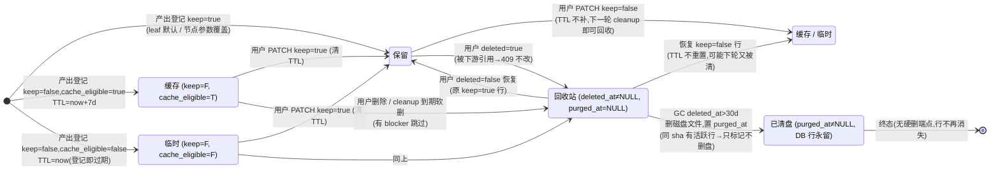
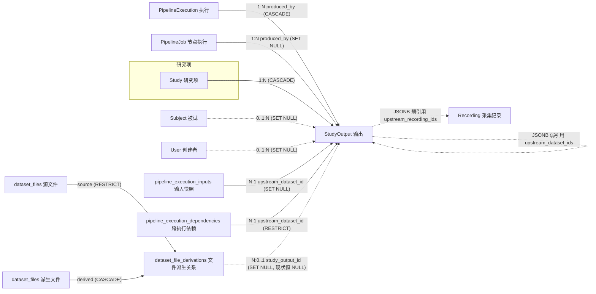

# 输出 · StudyOutput

> 工作流（Pipeline）每个节点跑完落盘的文件，统一登记成一条「输出」。在主线「登录 → 研究项 → 导入 → 工作流 → 执行 → **输出**」中它是终点站：执行（Execution）产生输出，用户在结果页浏览 / 改名 / 打标 / 决定保留与否，系统在背后自动管缓存、回收站和磁盘清理。

> 状态注记：Save 重构 P1–P5 的代码已全部落在分支 `feat/save-retention-fe`（P5 = GC 物理清盘 + celery beat 定时，提交 54d7380），但 **P5 的物理删盘 / beat 定时 / content-addressed 共享检查尚未云端验证**，本文按当前工作区代码如实记录。

## 1. 术语规范

| 中文名 | 业务名 | 代码类名 | 数据库表 | 前端主要文件 |
|---|---|---|---|---|
| 输出 | output | `StudyOutput` | `study_outputs` | `views/ResultsPage.vue`、`api/pipelines.ts`、`types/index.ts` |
| 文件派生关系 | file derivation | `DatasetFileDerivation` | `dataset_file_derivations` | （无独立前端页面） |

**曾用名 / 废弃名（见到即改）**：

| 废弃名 | 曾指代 | 替代 | 备注 |
|---|---|---|---|
| `pipeline_artifacts` + `analysis_results` | 节点产物文件 + Save 登记的正式结果（两张表） | `study_outputs` 单表 | 最老一代，DDL 注释仍留一句来历 |
| 派生数据集 / `DerivedDataset` / `derived_datasets` | 同一概念上一代命名 | 输出 / `StudyOutput` / `study_outputs` | P2 全栈改名（2026-06-10）；错误码里仍残留 `DERIVED_DATASET_*` 前缀 |
| 磁盘目录 `derived/` | 输出物理文件目录 | `outputs/{sha256[:2]}/{sha256}/` | P2 收尾（提交 83559b2） |
| `05_derived.sql` | DDL 文件名 | `05_outputs.sql` | 同 P2 |
| `retention_status` 五值状态机（`current` / `pinned` / `cached` / `temporary` / `deleted`，另有从未写过的死态 `quarantined`） | 保留策略 | 拆成 `keep` + `cache_eligible` + `deleted_at` 三个正交维度（P3），P5 再加 `purged_at` | 值映射：current/pinned→keep=true；cached→keep=false+cache_eligible=true；temporary→keep=false+cache_eligible=false；deleted→deleted_at |
| Save 节点（`eeg/output/save`） | 工作流末端的"保存"节点 | **已取消**：每个处理节点的产物在派发（dispatch）阶段由 `save_settings` 直接定名 / 打标 / 定保留 | `pipeline/save_settings.py:9`「取消 Save 节点」；节点注册表 8 个节点中无 Save。注意 wiki `3-45-StudyOutput.md` §6 仍写着旧设计，见 §9 待讨论 |
| `artifact_id` / `run_ids` 等旧字段名 | API / 内部引用 | `study_output_id` / `execution_ids` | `execution_dependencies.py:57` 仍兼容读旧 key |

## 2. 功能定位与边界

**解决什么问题**：EEG 工作流一跑就是一串文件（滤波后的 raw、ICA 矩阵、分段 epochs、平均 evoked……）。如果不管，磁盘很快被中间产物塞满；如果全删，用户又找不回结果。`study_outputs` 把"每个节点产出的每个文件"登记成一行，带上完整来源追溯（哪次执行、哪个节点、什么参数、上游是谁），让"留什么、缓存什么、删什么"变成三个互不干扰的决策。

**三层解耦的动机**（P3，2026-06-10 落地）：旧的 `retention_status` 把三件不相干的事塞进一个五值枚举——用户意图（要不要留）、系统缓存（值不值得为续跑留副本）、删除态（在不在回收站），用户要在 5 个词里选、`pinned`/`temporary` 名不副实。拆开后：**用户只面对「保留 / 不保留」二元开关**（`keep`）；**缓存全自动**（`cache_eligible`，由 P4 的"计算成本 × 落盘体积"评分决定，当前 8 个节点只有 ICA 计算命中）；**删除走回收站**（`deleted_at` 软删可恢复，30 天后 GC 物理清盘置 `purged_at`）。

> 黑话铺垫：**软删**＝只打删除标记不动数据、可恢复；**GC**（garbage collector，垃圾回收）＝后台任务定期把回收站里超期的文件真正从磁盘删掉；**content-addressed（内容寻址）**＝文件按内容哈希 sha256 存放，同样内容只存一份；**TTL**（time to live）＝条目的"存活期限"，到期可回收。

**不负责什么**：原始采集文件与导入产物（`dataset_files` / `recordings` 管，见 02 档案）；执行过程本身的状态（`pipeline_executions` / `pipeline_jobs` 管）；跨研究项的数据集发布（`DatasetAsset/DatasetVersion` 的 v2 发布机制，输出表上虽有 `lifecycle_state`/`visibility` 两列但仍是旧模型且无写入路径，见 §9）。

**一次典型执行产生什么**（以 LoadData → Filter → Epoch → ERP 四节点、单被试为例）：

| 节点 | 拓扑角色 | 登记行 | keep 默认 | cache_eligible（P4 评分） | TTL |
|---|---|---|---|---|---|
| LoadData | source | **不登记**（不写 study_outputs 行） | — | — | — |
| Filter | intermediate | 1 行 `filtered_raw` | false | false（算得快、产物大，负分） | now（登记即过期） |
| Epoch | intermediate | 按 condition 拆分则每条件 1 行 `epochs` | false | false | now |
| ERP | leaf | 每条件 1 行 `evoked`（spec `always_per_condition`） | **true** | false | NULL（永久） |

若图里有 ICA 计算节点（intermediate），其 `ica_matrix` 行为 keep=false + **cache_eligible=true**（当前唯一命中缓存评分的节点），TTL=now+7d——这就是「缓存」徽章的来源。

## 3. 数据库

### 3.1 `study_outputs`（`database/schema/05_outputs.sql:12-70`）

| 字段 | 类型 | 约束 | 语义 |
|---|---|---|---|
| `id` | UUID | PK，`gen_random_uuid()` | 行 id |
| `study_id` | CHAR(12) | NOT NULL，FK→studies **ON DELETE CASCADE** | 属于哪个研究项 |
| `produced_by_execution_id` | UUID | FK→pipeline_executions **CASCADE** | 哪次执行产出（执行删则输出行连带删） |
| `produced_by_job_id` | UUID | FK→pipeline_jobs **SET NULL** | 哪个节点执行实例产出 |
| `produced_by_node_id` / `_node_type` | VARCHAR(128) | — | 图中节点 id / NodeSpec 类型 |
| `produced_by_params` | JSONB | NOT NULL DEFAULT '{}' | 节点当时参数快照 |
| `upstream_dataset_ids` | JSONB | NOT NULL DEFAULT '[]' | 直接上游输出 id 列表（弱引用，无 FK） |
| `upstream_recording_ids` | JSONB | NOT NULL DEFAULT '[]' | 回溯到的原始采集记录 id 列表（弱引用） |
| `data_type` | VARCHAR(64) | NOT NULL | `raw`/`filtered_raw`/`ica_matrix`/`ica_cleaned`/`epochs`/`evoked` 等 |
| `subject_id` | UUID | FK→subjects **SET NULL** | 被试 |
| `bids_subject_id`/`session`/`task`/`run_label`/`condition` | VARCHAR | — | BIDS 维度；condition 为分段条件名 |
| `display_name` / `description` / `tags` | VARCHAR(256)/TEXT/JSONB | tags NOT NULL '[]' | 用户可编辑的名字 / 备注 / 标签 |
| `storage_uri` | VARCHAR(1024) | NOT NULL | 物理 URI（content-addressed） |
| `logical_path` / `file_role` / `file_size` / `sha256` / `mime_type` | — | — | 物理存储元数据 |
| `keep` | BOOLEAN | NOT NULL DEFAULT false | **用户是否保留**（true=结果页正式输出、永不自动清） |
| `cache_eligible` | BOOLEAN | NOT NULL DEFAULT false | **系统是否值得缓存**（P4 评分结果快照） |
| `retention_expires_at` | TIMESTAMP | 可空 | 仅 keep=false 行的 TTL；keep=true 恒 NULL |
| `lifecycle_state` | VARCHAR(32) | NOT NULL DEFAULT 'unpublished'，CHECK 见下 | 发布轴（旧模型，见 §9） |
| `visibility` | VARCHAR(32) | NOT NULL DEFAULT 'private'，CHECK 见下 | 可见范围（旧模型） |
| `preview_json` | JSONB | NOT NULL '{}' | 预览索引缓存 |
| `created_at`/`created_by`/`updated_at` | — | created_by FK→users **SET NULL** | 审计三件套 |
| `deleted_at` | TIMESTAMP | 可空 | **回收站软删**时间 |
| `purged_at` | TIMESTAMP | 可空 | **GC 物理清盘**后置位；DB 行保留可追溯（仅文件没了）。P5 新增 |

CHECK 原文（`05_outputs.sql:56-59`）：

```sql
lifecycle_state IN ('unpublished', 'published', 'withdrawn')
visibility      IN ('private', 'shared')
```

### 3.2 `dataset_file_derivations`（`05_outputs.sql:80-94`）

记录 `dataset_files` 行之间「谁由谁加工而来」（如 raw source → canonical FIF）。

| 字段 | 类型 | 约束 | 语义 |
|---|---|---|---|
| `id` | UUID | PK | — |
| `study_id` | CHAR(12) | NOT NULL，FK→studies **CASCADE** | — |
| `source_file_id` | UUID | NOT NULL，FK→dataset_files **ON DELETE RESTRICT** | 源文件（有派生在引用就不许删源） |
| `derived_file_id` | UUID | NOT NULL，FK→dataset_files **CASCADE** | 派生文件（派生文件删则关系行删） |
| `execution_id` | UUID | FK→pipeline_executions **SET NULL** | 由哪次执行产生（可空） |
| `study_output_id` | UUID | FK→study_outputs **SET NULL** | 关联的输出行——**现状全代码无写入点，恒 NULL**（§9） |
| `derivation_kind` | VARCHAR(64) | NOT NULL DEFAULT 'canonical_fif' | 实际写入值：`canonical_fif`、`canonical_fif_provenance`、`canonical_fif_{sidecar}` 等（`routers/datasets.py:1763-1798`） |
| `transform_name`/`transform_version`/`parameters_json`/`metadata` | — | — | 转换器与参数；导入路径写 `import.generate_canonical_fif` |
| 表级 CHECK | — | `source_file_id <> derived_file_id` | 禁自引用 |

当前实际写入点只有**导入链路**（`routers/datasets.py:1513-1523` 构造、1763-1798 调用）：

| derivation_kind 实际值 | 何时写 | source → derived |
|---|---|---|
| `canonical_fif` | 导入转格式成功 | raw source 文件 → canonical FIF |
| `canonical_fif_provenance` | 同上 | raw source → 转换 provenance JSON |
| `canonical_fif_{sidecar}` / `canonical_fif_provenance_{sidecar}` | 多文件格式（如 BrainVision 三件套）逐 sidecar | sidecar → FIF / provenance |

Pipeline 节点产物**不写**本表——输出血缘走 `pipeline_execution_inputs` / `pipeline_execution_dependencies` + JSONB 弱引用，两套血缘并存（§9 第 6 条）。索引 4 个：source / derived / execution / study_output 各一（`05_outputs.sql:171-174`）。

### 3.3 唯一约束 / 关键索引 / 外键级联小结

索引全集（`05_outputs.sql:157-174`）：

| 索引 | 列 / 条件 | 用途 |
|---|---|---|
| `idx_study_output_study` | `(study_id, keep, created_at DESC)` | 结果页主查询（按保留态分组倒序） |
| `idx_study_output_subject_type` | `(study_id, bids_subject_id, data_type)` | 按被试 × 类型筛选 |
| `idx_study_output_execution` / `_job` | execution / job 外键列 | 执行抽屉「本次产出」 |
| `idx_study_output_tags` | `tags` GIN | JSONB 标签包含查询 |
| **`idx_study_output_sha256`（UNIQUE）** | `(study_id, sha256) WHERE sha256 IS NOT NULL` | 同研究项同内容只登记一行；`StudyOutputStore.register` 写入前先查同 (study, sha256) 活跃行、命中即复用旧行（`pipeline/study_output_store.py:300-325`） |
| `idx_study_output_retention_expires` | `(retention_expires_at) WHERE NOT NULL` | cleanup 找到期缓存 |
| `idx_study_output_deleted` | `(study_id, deleted_at) WHERE deleted_at IS NOT NULL` | 回收站列表 |
| `idx_study_output_purge_candidate` | `(deleted_at) WHERE deleted_at IS NOT NULL AND purged_at IS NULL` | **GC 候选**（P5 新增，`05_outputs.sql:166`） |
| `idx_study_output_lifecycle` / `_shared_published` | lifecycle 单列 / `(lifecycle_state, visibility) WHERE published+shared` | 跨研究项列表（现状休眠，见 §9） |

**引用本表的外键**（被谁指着）：

| 来源表.列 | ON DELETE | 含义 |
|---|---|---|
| `pipeline_execution_inputs.upstream_dataset_id` | SET NULL | 执行输入快照引用输出（blocker 检查来源一） |
| `pipeline_execution_dependencies.upstream_dataset_id` | **RESTRICT** | 跨执行依赖——数据库层面直接挡"删被依赖的输出" |
| `dataset_file_derivations.study_output_id` | SET NULL | 文件派生关系关联（现状恒 NULL） |

## 4. 后端

**ORM**：`backend/app/models/study_output.py:35-186`（`StudyOutput`；三层字段 138-144、`purged_at` 168-170、purge 候选索引 79-83）。

**产物写入数据流（执行期，每个节点重复一遍）**：

1. executor 算好拓扑角色映射 `{node_id: leaf|intermediate|source}`（`pipeline/executor.py:85`，缓存于 context）。
2. dispatcher 在节点跑完、要落盘时调 `apply_save_settings`（`pipeline/dispatcher.py` 各 `_save_settings_metadata` 调用点）：选名字模板（用户参数 > spec 默认 > 兜底 `{subject}_{task}_{node_title}`）→ 渲染 BIDS 占位符 → 同名自动加 `(2)(3)` 后缀 → 合并 auto/dynamic/user 三路标签 → 算 keep / cache_eligible / TTL。
3. `StudyOutputStore.save_file_from_writer` 把文件写进临时区、算 sha256、挪到 `outputs/{sha256[:2]}/{sha256}/{filename}`（content-addressed，同内容物理只存一份）。
4. `register` 查 (study_id, sha256) 活跃行：命中 → 复用旧行返回（不重插，produced_by 保留首产执行）；未命中 → INSERT 新行。
5. `execution_dependencies.record_execution_artifact_dependencies` 把"这个节点吃了哪些上游输出"冻结进 `pipeline_execution_inputs` + `pipeline_execution_dependencies`（删除保护的数据基础）。

**保留决策（产出时）**：`pipeline/save_settings.py`
- `default_keep_for_role`（173-180）：拓扑角色 leaf（叶子，输出无人连接）→ `keep=True`；intermediate → `False`；source/未知 → `True`（保守）。拓扑角色由 `pipeline/topology.py` 计算、executor 注入。
- 用户覆盖：节点参数 `keep`，`_normalise_keep_param`（183-196）接受 true/false/pinned/cache 等词。
- `apply_save_settings`（199-299）：keep=False 且 `cache_eligible` → TTL=now+7 天（`DEFAULT_INTERMEDIATE_RETENTION_DAYS=7`，行 37）；keep=False 且不值得缓存 → TTL=now（登记即过期）；keep=True → TTL=None。
- 缓存评分：`pipeline/cache_policy.py:31-61`，`cache_score = compute_cost − 2 × output_footprint`，>0 才缓存；三条硬规则（interactive 强制不缓存 / explosive 永不物化 / 缺标签不缓存）。当前 8 节点仅 `ica/compute` 命中。

**登记与物理存储**：`pipeline/study_output_store.py`（content-addressed 落盘 `outputs/{sha256[:2]}/{sha256}/`，register + sha 去重 300-418）。

**保留/删除动作**：`routers/pipelines.py`
- `apply_study_output_retention_action`（625-687）：keep / deleted 双轨正交；deleted=true 先调 `assert_artifact_can_be_deleted`，被下游引用 → 写 `{action}.blocked` 审计后 409；keep=true 清 TTL。
- `record_study_output_action_audit`（591-622）：每次保留/删除动作写 `audit_events`（action=`study_output.retention` / `study_output.batch.retention`）。

**下游依赖保护**：`services/execution_dependencies.py` —— `assert_artifact_can_be_deleted`（145-153）、`artifact_dependency_blockers`（156-193，扫 `pipeline_execution_inputs` + `pipeline_execution_dependencies` 两表），错误码 `DERIVED_DATASET_HAS_DOWNSTREAM_DEPENDENCIES`（24-30）。

**请求/响应契约**（`schemas/study_output.py`）：

| Schema | 字段 | 备注 |
|---|---|---|
| `StudyOutputUpdate`（103-116） | `display_name?` / `description?` / `tags?` / `keep?` / `deleted?` / `reason?` | 全可选、只应用传了的字段；keep 与 deleted 正交双轨 |
| `StudyOutputBatchUpdate`（119-123） | `ids`（1–500 个）+ `update` | 同一组改动批量套用 |
| `StudyOutputCleanupRequest`（126-135） | `dry_run` / `limit`（≤5000）/ `reason` | cleanup 与 gc 两个端点共用；清理条件固定、不再接收状态枚举 |
| `StudyOutputResponse`（23-100） | 全字段视图（含 keep/cache_eligible/retention_expires_at/deleted_at/purged_at） | 列表、详情、抽屉共用 |

**清理 / GC 任务**：`tasks/file_tasks.py`
- `run_study_output_cleanup`（106-176）：条件 `keep=false AND deleted_at IS NULL`，循环内跳过未到期（TTL 在未来）与有 blocker 的行，命中只置 `deleted_at`（软删）；支持 dry_run / limit / 指定 study 或全局。
- `run_study_output_gc`（210-270）：条件 `deleted_at < now − 30d AND purged_at IS NULL`（`GC_RETENTION_DAYS=30`，行 179）；删盘前查同 study 同 sha256 是否还有未删行——有则保留物理文件只标本行 purged；`_delete_output_storage`（182-207）真删文件/目录；行置 `purged_at`、**永不删 DB 行**。
- `run_storage_maintenance`（282-305）：celery beat 每日全局 cleanup+GC（`celery_app.py:46-53` `storage-maintenance-daily`；`elys_project/deploy/deploy.sh:814` worker 带 `-B` 内嵌 beat）；走轻量 `_MaintenanceTask` 壳、不落 `async_tasks` 行（详见 08 档案）。
- 物理路径解析：GC 删盘经 `services/storage.py` 的 `StorageService.resolve_path`，根目录 `STUDIES_STORAGE_ROOT/{study_id}`——与 `StudyOutputStore` 写入侧同源，解析失败 / 文件不存在时 `_delete_output_storage` 安全返回 False（不炸任务、行照样标 purged）。

**端点清单**（`routers/pipelines.py`，权限=`require_study_read/write`，owner/admin 直通，成员按 `can_read`/`can_write`）：

| 方法 | 路径 | 权限 | 作用 |
|---|---|---|---|
| GET | `/studies/{study_id}/pipeline-executions/{execution_id}/outputs` | 读 | 某次执行的输出列表（`include_deleted`）（行 2820） |
| GET | `/studies/{study_id}/outputs` | 读 | 跨执行列表，多维筛选（execution/node/data_type/BIDS/tags/keep/include_deleted/limit/offset）+ `include_cross_study`（附加其他研究项 published+shared 行，**不查上游 Study 读权限**）（行 2847） |
| GET | `/studies/{study_id}/outputs/{id}` | 读 | 单条详情（行 2931） |
| PATCH | `/studies/{study_id}/outputs/{id}` | 写 | 改 display_name/description/tags/`keep`/`deleted`（软删/恢复）（行 2946） |
| POST | `/studies/{study_id}/outputs/batch-update` | 写 | 批量同改；目标含 deleted=true 时**先全量预检 blocker**、任一被挡整体 409 不改（行 2991-3041） |
| POST | `/studies/{study_id}/outputs/cleanup` | 写 | 建 `study_output_cleanup` 异步任务（dry_run/limit）（行 3077） |
| POST | `/studies/{study_id}/outputs/gc` | 写 | 建 `study_output_gc` 异步任务（P5；**前端 API client 尚无对应函数**）（行 3108） |
| GET | `/studies/{study_id}/outputs/{id}/preview` | 读 | 预览（已软删 → 409 `DERIVED_DATASET_DELETED`）（行 3139） |
| GET | `/studies/{study_id}/outputs/{id}/timeseries` | 读 | 时域抽样数据（已软删 → 409）（行 3190） |
| GET | `/studies/{study_id}/outputs/{id}/download` | 读 | 下载，display_name 作文件名（已软删 → 409）（行 3231） |

## 5. 前端

- 路由：`/studies/:studyId/results` → `StudyResults` → `views/ResultsPage.vue`（`router/index.ts:73-75`）。
- API client：`api/pipelines.ts:81-136` —— `listExecutionStudyOutputs` / `listStudyOutputs` / `getStudyOutput` / `updateStudyOutput` / `batchUpdateStudyOutputs` / `cleanupStudyOutputs` / `previewStudyOutput` / `getStudyOutputTimeseries` / `downloadStudyOutput`。**无 gc 函数**。
- 类型：`types/index.ts`（`StudyOutput` 含 `keep`/`cache_eligible`/`deleted_at`/`purged_at:929`）。
- 当前 UI 形态（P3 刚改 + P5 徽章）：
  - 概览 chips「全部 / 保留 / 不保留 / 已删除」（`ResultsPage.vue:612-624`），默认隐藏已删除行（前端拉 `include_deleted:true` 后自行过滤，行 699、580-589）。
  - 保留改成**二元下拉「保留 / 不保留」**（行 506-508、357-363），替代旧 5 值下拉。
  - 徽章：`已清盘`(muted) > `已删除`(danger) > `保留`(success) > `缓存`(outline) > `临时`(warning)（行 993-1005）——「缓存/临时」即 `cache_eligible` 标注。
  - 回收站：删除/恢复按钮；`purged_at` 非空时恢复按钮禁用、文案「已清盘」（行 375-378）。
  - 「清理缓存 / 临时数据」按钮 → `cleanupStudyOutputs`（行 41、935，弹确认框「确认清理本研究项里所有不保留且已过期的输出吗？」）；批量保留/批量删除（`bulkSetKeep`、行 771-799）。
  - 详情抽屉：保留二元下拉 + 删除/恢复按钮 + 「保留 / 系统缓存」两行布尔（行 458-459）+ 来源链（execution / 节点 / 参数 / 上游）展示。
- 另一个入口：工作流页（`/studies/:id/workflow`，PipelinePage）Execution 抽屉的产出列表，P3 后动作同样收敛为 keep / deleted 两键。

## 6. 生命周期

四个字段（`keep` × `cache_eligible` × `deleted_at` × `purged_at`）理论上 16 种组合，实际收敛为 5 个状态：

| 状态（前端徽章） | keep | cache_eligible | deleted_at | purged_at | retention_expires_at |
|---|---|---|---|---|---|
| 保留（success） | true | 任意（仅标注） | NULL | NULL | NULL（恒） |
| 缓存（outline） | false | true | NULL | NULL | 产出时 now+7d |
| 临时（warning） | false | false | NULL | NULL | 产出时 now（即过期） |
| 已删除 / 回收站（danger） | 维持原值 | 维持原值 | 非空 | NULL | 维持原值 |
| 已清盘（muted，**终态**） | 维持原值 | 维持原值 | 非空 | 非空 | 维持原值 |

不变式：keep=true ⇒ TTL=NULL（`apply_study_output_retention_action` 与 `save_settings` 双处保证）；purged_at≠NULL ⇒ deleted_at≠NULL（GC 只扫已软删行）；`cache_eligible` 是产出时的评分快照、只读标注，不参与流转方向。



**谁能触发**：产出登记＝执行 worker（dispatcher）；keep / deleted 切换＝研究项可写成员（owner/editor/admin）；cleanup 与 GC＝可写成员手动建任务，或 celery beat 每日全局自动跑（无人触发）。

**终态说明**：`purged_at` 置位后文件已物理删除、预览/下载/恢复实质不可用（行因 deleted_at 非空被 409 挡），DB 行作为血缘 / 审计证据**永久保留**——目前没有任何删 DB 行的端点（仅 Study 级 CASCADE 或 purge 才连带删行）。

## 7. 行为清单

| 操作 | 端点 / 入口 | 谁能做 | 关键副作用 / 约束 |
|---|---|---|---|
| 产出登记 | 执行 worker → `StudyOutputStore.register` | 系统 | 同 (study, sha256) 活跃行复用不重插；keep/cache_eligible/TTL 由 `apply_save_settings` 决定 |
| 改名 / 备注 / 标签 | PATCH `/outputs/{id}`、batch-update | 可写成员 | 标签去重保序；display_name 产出时同名自动加 `(2)(3)` 后缀（`save_settings.py:104-170`） |
| 保留 / 取消保留 | PATCH `keep=true/false`、批量、结果页开关 | 可写成员 | keep=true 清 TTL 永久保留；keep=false **不补 TTL**→下一轮 cleanup 即可软删；写审计 `study_output.retention` |
| 删除（进回收站） | PATCH `deleted=true`、批量 | 可写成员 | 先查下游依赖，被引用 → 409 + 审计 `.blocked`；批量先全量预检、任一被挡整体取消 |
| 恢复 | PATCH `deleted=false` | 可写成员 | 仅清 deleted_at；**后端不挡 purged 行**（前端禁按钮，见 §9）；TTL 不重置 |
| 缓存清理（软删） | POST `/outputs/cleanup` → `study_output_cleanup` 任务；beat 每日 | 可写成员 / beat | keep=false & 到期 & 无 blocker → 置 deleted_at；dry_run 时不跳过未到期行（预览口径偏宽） |
| GC 物理清盘 | POST `/outputs/gc` → `study_output_gc` 任务；beat 每日 | 可写成员 / beat | 回收站超 30 天 → 删盘 + purged_at；同 sha 活跃共享则不删盘；**未云端验证** |
| 预览 / 时域 / 下载 | GET preview / timeseries / download | 可读成员 | 软删行 409；下载会刷新 updated_at |
| 跨研究项列表 | GET `/outputs?include_cross_study=true` | 本研究项可读成员 | 附加他研究项 published+shared 行——当前无行能到达该状态（§9） |
| 被引用保护 | `pipeline_execution_dependencies` FK RESTRICT + 应用层 blocker | 系统 | 双保险：DB 层 RESTRICT、应用层 409 |
| 追清理/GC 进度 | GET `/studies/{id}/tasks/{task_id}`（cleanup/gc 端点返回 AsyncTask） | 可读成员 | 任务机制详见 08 档案；结果摘要在 `result_json`（cleaned/skipped/purged 计数与明细） |
| 同内容去重 | `StudyOutputStore.register` | 系统 | 同 (study_id, sha256) 活跃行复用；GC 删盘前也按 sha 查活跃共享 |

## 8. 与其他元素的关系



- **Study 1—N StudyOutput**（CASCADE）：研究项硬删，输出行连带删（审计快照另存）。
- **PipelineExecution 1—N**（CASCADE）：删执行＝删其产出登记；**PipelineJob** 删除仅置空指针（SET NULL），输出行留。
- **pipeline_execution_inputs N—1**（SET NULL）：执行创建时冻结"用了哪条输出做输入"，是 blocker 检查的第一来源。
- **pipeline_execution_dependencies N—1**（**RESTRICT**）：跨执行派生链；DB 层直接禁删被依赖输出。
- **dataset_file_derivations**：raw → canonical FIF 等文件级血缘，目前只由导入路径写（`routers/datasets.py:1513-1523`），`study_output_id` 列是预留位。
- **upstream_dataset_ids / upstream_recording_ids**：JSONB 弱引用（无 FK），供结果页来源链展示与追溯，不参与级联。

## 9. 待讨论

1. **lifecycle_state / visibility 是旧模型且无写入路径（头号）**。现状：CHECK 仅 `unpublished/published/withdrawn` × `private/shared`、无 public 档、无授权表（`05_outputs.sql:56-59`）；且全后端**没有任何代码把这两列改离默认值**（唯一出现处是 `routers/pipelines.py:2887-2888` 的读过滤），即 `include_cross_study` 实际永远查不到东西。为什么是问题：wiki `3-45` §3.6 自认待确认是否对齐 06-09 数据集 v2 定稿（发布≠分享、可见范围只升不降、邀请制授权）；两列+两索引现在是"死配置"，与 P1 刚清掉的死配置同性质。可选方向：a) 按 v2 语义重设计（加授权表/只升不降约束）再补写入端点；b) 调试期先删这两列与索引、需要时再建；c) 保留现状但在 wiki 标注"规划位"。
2. **include_cross_study 权限缺口**。现状：`list_study_outputs` 列他研究项 published+shared 行时只校验**本** study 读权限，不查上游 Study 成员关系（`routers/pipelines.py:2882-2891`）。为什么是问题：一旦 1 补上写入路径，任何登录用户可借任意一个自己可读的 study 枚举全平台 shared 输出（含 storage_uri 等元数据）。可选方向：把"shared 的语义=平台内公开"写成明文，或按上游 study 成员/邀请制过滤。
3. **wiki 3-45 §6 与代码冲突：Save 节点已废弃**。现状：节点注册表 8 节点无 Save、全仓无 `save_promotion`；`save_settings.py:9` 明言"取消 Save 节点"，topology.py:6 称"Save 节点废弃方案 (P0-P5)"；但 wiki `3-45-StudyOutput.md` §203-213 仍描述"Save 节点 promote 上游 + `StudyOutputStore.save_promotion()`"。为什么是问题：误导接手者按不存在的 API 找代码。方向：改写 3-45 §6 为"save 设置在派发阶段由 `apply_save_settings` 决定"。
4. **后端不挡 purged 行的恢复**。现状：`apply_study_output_retention_action`（`routers/pipelines.py:646-668`）对 `deleted=false` 只清 deleted_at、不看 purged_at；仅前端禁用按钮（ResultsPage.vue:375）。为什么是问题：直接调 API 可把已清盘行"恢复"成活跃行——文件已删，预览/下载会 404/409，且该行从此既不在回收站也无文件、还会占用 sha256 唯一索引挡住同内容重新登记。方向：后端 PATCH 对 purged 行恢复返回 409 `OUTPUT_PURGED`。
5. **无 DB 行硬删端点**。现状：软删+purge 后行永留，9-02 写明"保留 DB 行可追溯"，但"永不删行"没有上限说明（行数无限增长，同 08 档案的日志类表问题）。方向：明文确认"行永留"为设计决策，或给 purged 行设极长归档期。
6. **dataset_file_derivations.study_output_id 恒 NULL**。现状：只有导入路径写该表（canonical_fif 族），pipeline 产物从不写文件级派生关系（血缘走 execution_inputs/dependencies + JSONB）。方向：要么补 pipeline 写入（统一两套血缘），要么在 wiki 标注该列为规划位。
7. **恢复 / 取消保留后的 TTL 语义**。现状：恢复（deleted=false）不重置 retention_expires_at；keep true→false 不补 TTL——两种情况下行都可能在**下一轮每日 cleanup 被立即软删**（TTL 为 NULL 或已过期时循环视为可回收，`file_tasks.py:137-149`）。这可能正是想要的（"交回系统管"），但用户感知是"我刚恢复它怎么又没了"。方向：恢复/取消保留时给一个宽限 TTL（如 now+7d），或在 UI 提示。
8. **cleanup 的 dry_run 口径偏宽**。现状：`file_tasks.py:137-141` 的"未到期跳过"条件带 `and not dry_run`，导致 dry_run 把未到期缓存也列进 cleaned 预览。小问题，但预览数字会吓到用户。
9. **P5 未云端验证**。物理删盘、beat 进程（worker `-B`）是否真跑、content-addressed 共享检查正确性，均需阿里云部署后验证；磁盘删除不可逆，30 天保留期是唯一兜底。

## 10. 大模型画图提示词

请画一张「ELYS 平台 输出（StudyOutput）元素全景图」，读者是新接手的开发者，目标是一页看懂这个元素的全部。中文标签，代码名（表名/字段/端点）用等宽字体，状态机用带箭头的流转图，待讨论项用 ⚠ 警示标记醒目标注。画布分七个分区：①**定位与术语**（左上）：一句话"Pipeline 节点产出文件的统一登记，研究主线 登录→研究项→导入→工作流→执行→输出 的终点"；列改名史链条 `pipeline_artifacts+analysis_results` → `derived_datasets/DerivedDataset/派生数据集` → `study_outputs/StudyOutput/输出`，磁盘目录 `derived/`→`outputs/`，旧 `retention_status` 五值（current/pinned/cached/temporary/deleted+死态 quarantined）→ 已拆三维度，全部标"已废弃"。②**核心数据结构**（左中）：表 `study_outputs` 关键字段分组——来源追溯（`produced_by_execution_id` CASCADE / `produced_by_job_id` SET NULL / `produced_by_node_id`/`node_type`/`params` + `upstream_dataset_ids`/`upstream_recording_ids` JSONB 弱引用）、数据语义（`data_type`/`bids_subject_id`/`session`/`task`/`run_label`/`condition`）、用户层（`display_name`/`description`/`tags`）、物理（`storage_uri` content-addressed `outputs/{sha256[:2]}/{sha256}/`、唯一索引 `(study_id,sha256) WHERE sha256 IS NOT NULL`）、保留三层（`keep` bool 默认 false / `cache_eligible` bool / `retention_expires_at` 仅 keep=false 行）、回收（`deleted_at`/`purged_at`）、发布轴（`lifecycle_state` CHECK `unpublished/published/withdrawn`、`visibility` CHECK `private/shared`，⚠无写入路径）。③**生命周期状态机**（中央最大区）：五个状态——保留(keep=T,TTL=NULL)、缓存(keep=F,cache_eligible=T,TTL=now+7d)、临时(keep=F,cache_eligible=F,TTL=now)、回收站(deleted_at≠NULL)、已清盘(purged_at≠NULL,终态,DB 行永留)；转换箭头标注触发者与条件：产出登记（leaf 节点默认 keep=true、intermediate 默认 false、节点参数可覆盖；cache_eligible=评分 compute_cost−2×footprint>0，当前仅 ICA 计算命中）、用户 PATCH `keep`（true 清 TTL；false 不补 TTL 下轮即可回收）、用户 `deleted=true`（被下游引用→409 拒绝）、cleanup 任务每日软删 keep=false 且到期且无依赖行、用户 `deleted=false` 恢复（⚠后端不挡 purged 行）、GC 任务每日对 deleted_at>30 天行删磁盘文件置 purged_at（同 sha256 有活跃行则只标记不删盘）。④**关键行为与端点**（右上）：`GET /studies/{id}/outputs`（多维筛选+`include_cross_study`）、`PATCH /studies/{id}/outputs/{id}`（display_name/tags/keep/deleted）、`POST .../outputs/batch-update`（先全量预检依赖再改）、`POST .../outputs/cleanup`、`POST .../outputs/gc`、`GET .../preview`/`timeseries`/`download`（软删行 409）；前端=结果页 `/studies/:id/results`，二元开关「保留/不保留」+徽章 保留/缓存/临时/已删除/已清盘。⑤**与其他元素关系**（右中，标基数与级联）：Study 1—N（CASCADE）、PipelineExecution 1—N（CASCADE）、PipelineJob 1—N（SET NULL）、pipeline_execution_inputs N—1（SET NULL）、pipeline_execution_dependencies N—1（RESTRICT，DB 层禁删被依赖输出）、dataset_file_derivations.study_output_id（SET NULL，⚠现状恒 NULL）、Subject/User（SET NULL）。⑥**权限规则**（右下）：读=研究项成员 can_read，写（改名/keep/删除/cleanup/gc）=can_write 或 owner/admin；⚠`include_cross_study` 列他研究项 published+shared 行时不校验上游 Study 读权限。⑦**待讨论区**（底部横条，全部加 ⚠）：lifecycle/visibility 旧模型且全代码无写入点（跨研究项列表实际恒空）；wiki 3-45 §6 仍写已废弃的 Save 节点 promote 设计；purged 行可被 API 恢复成无文件活跃行；DB 行永不硬删无明文决策；P5（GC+beat）未云端验证。整体风格：分区用浅色圆角底框，状态机箭头加粗，⚠用橙红色，布局横向 16:9。

---

**相关 wiki 页**（P1 事实源，但 §9 列出的漂移点以代码为准）：

- `wiki/docs/3-45-StudyOutput.md` —— 概念页（原 `3-45-DerivedDataset.md`，已随 P2 改名重写；§6 Save 节点段仍过时）
- `wiki/docs/9-02-2026年6月.md` —— Save 重构 P1–P5 全部条目（2026-06-08 ~ 06-10）
- `wiki/docs/5-30-Execution管理.md` —— 输出管理节（执行侧视角）
- `wiki/docs/4-30-Study输出与Artifact.md`、`4-50-清理策略与迁移.md` —— 文件边界与清理策略
- `日志/2_meeting260609/Save保留策略-重构方案.md`、`Save与发布-执行方案.md` —— 14 条逻辑缺陷诊断 + Q1–Q10 决策原始记录

*事实源：工作区代码（分支 feat/save-retention-fe，含 P5 提交 54d7380）+ wiki 9-02 / 3-45；编写日期 2026-06-10。*
