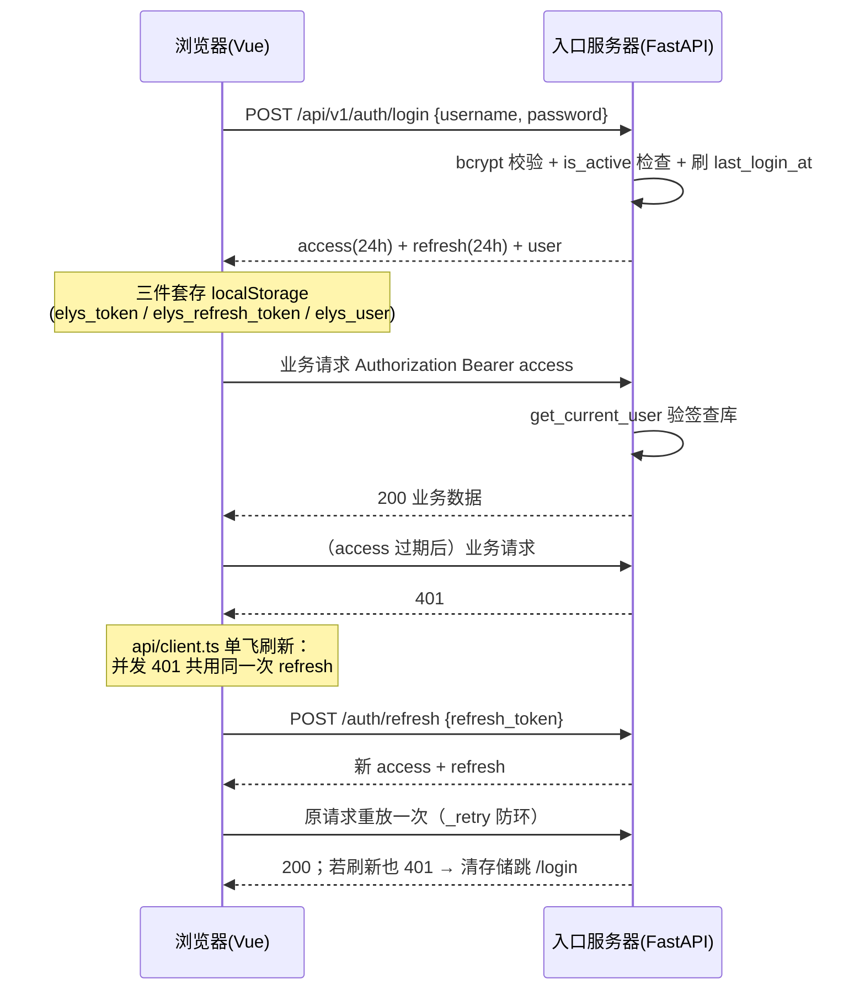
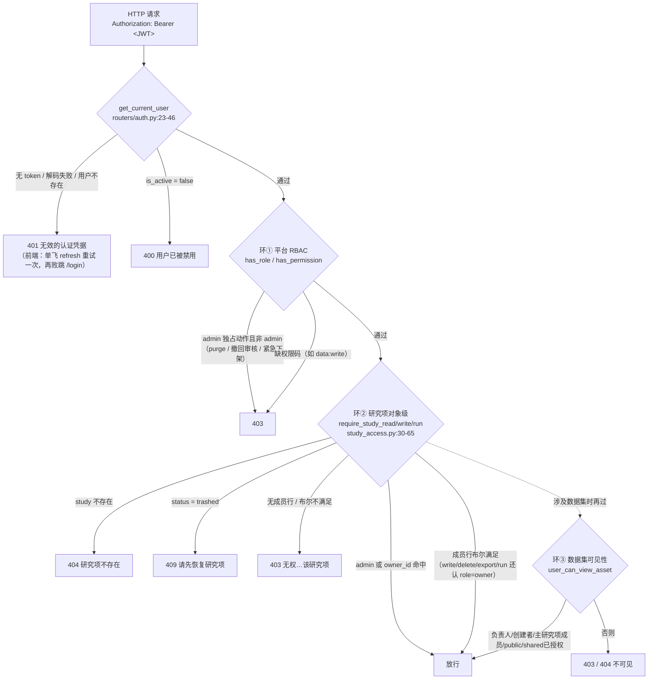
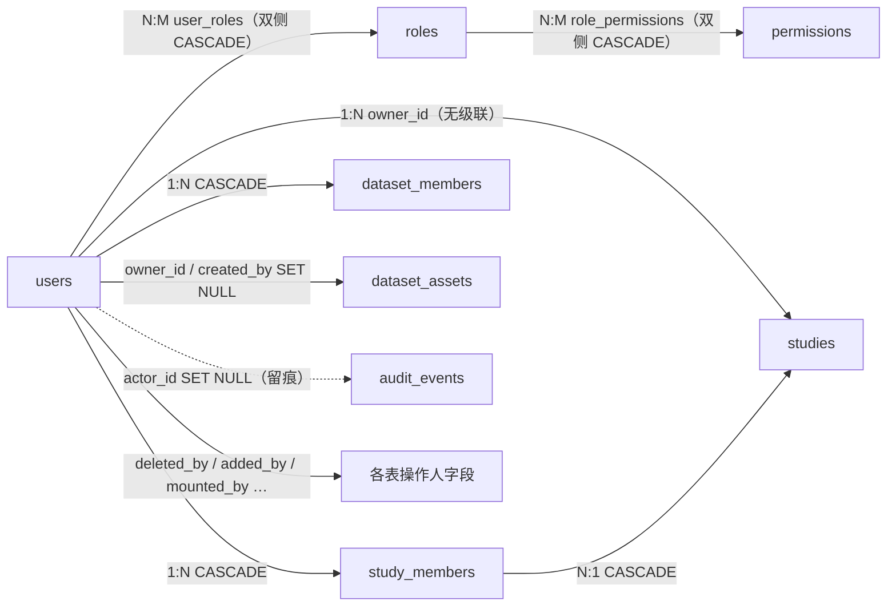

# 用户与权限 · User / Role / Permission（RBAC 三环）

> 用户与权限是主线"**登录** → 研究项 → 导入 → 工作流 → 执行 → 输出"的第一道门，也是贯穿全程的隐形护栏。ELYS 用"三环"管权限：①平台 RBAC（基于角色的访问控制——先给人发角色、再按角色给权限码）决定"你在平台能干哪类事"；②研究项成员表（`study_members`）决定"你在某个研究项里能干什么"；③数据集授权表（`dataset_members`）决定"别人的数据你能不能看"。任何请求都先过 JWT 登录认证，再逐环收紧。

## 1. 术语规范

| 中文名 | 业务名 | 代码类名 | 数据库表 | 前端主要文件 |
|---|---|---|---|---|
| 用户 | User | `User` | `users` | `views/Login.vue`、`stores/auth.ts` |
| 角色 | Role | `Role` | `roles` | （token 里带 roles 数组） |
| 权限（码） | Permission | `Permission` | `permissions` | — |
| 用户-角色关联 | — | `UserRole` | `user_roles` | — |
| 角色-权限关联 | — | `RolePermission` | `role_permissions` | — |
| 访问令牌 / 刷新令牌 | Access / Refresh Token | —（JWT 字符串） | —（无状态，不入库） | `api/client.ts`（拦截器） |
| 研究项成员（环②） | Study Member | `StudyMember` | `study_members` | 详见 03 档案 |
| 数据集授权（环③） | Dataset Member | `DatasetMember` | `dataset_members` | 详见 01 档案 |

**曾用名 / 废弃名：**

| 名称 | 状态 | 说明 |
|---|---|---|
| `researcher`、`reviewer` 角色 | **已废弃，见到即改** | seed 启动时自动把存量用户迁到 `pi` 并删除这两个角色（seeds/01_roles_permissions.sql:16-30） |
| `superadmin` 角色 | **半废弃、口径不一（勿照搬）** | seed 仍创建且授全权限（:7,66-70），但业务上唯一用过它的"紧急下架"已于 2026-06-09 收敛为 admin（`services/dataset_lifecycle.py:240-249`）；前端与测试还留旧口径——详见 §9-2 |
| `Project` 相关权限语境 | 已改名 | 权限码统一 `study:read/write/delete`，无 project 字样 |

## 2. 功能定位与边界

**解决什么问题**：科研平台的访问控制有两个粒度——"平台层面你是谁"（管理员？能开课题的 PI？）和"对象层面你跟这条数据什么关系"（这个研究项的负责人？成员？路人？）。单靠 RBAC 管不了第二个粒度（角色是全局的，不绑定具体研究项），单靠成员表又管不了第一个（谁有资格建研究项、谁能做平台治理）。所以分了三环，逐环收紧：环①粗筛门类，环②管研究项内的细粒度动作（读/写/删/导出/运行五个布尔），环③管跨研究项的数据可见性。

**不负责什么**：本元素不管研究项内权限的具体语义（03 档案）和数据集可见档位 private/shared/public 的规则（01 档案）；也**暂不管用户自身的生命周期**——注册、审核、停用、注销在当前代码里几乎不存在（无任何端点），用户只能靠 seed 脚本或手工 SQL 进库（§9-1）。

**为什么这样设计**：JWT（JSON Web Token，服务端签名的"自带身份证"，无需会话存储）+ 无状态认证适配双服务器部署（入口 + 计算），任何一台都能本地验签不查库；角色烧进 token 让大多数请求不用查角色表；对象级判定放在服务层函数（`require_study_*`）统一收口，路由层保持薄。**调试期现实**：账号体系只有 seed 的三个测试号（admin / user1 / user2），所以"无注册流程"暂未挡路——但它是商用前必须补的第一块短板。

三环各自的"事实源"速查：

| 环 | 回答的问题 | 事实源 | 判定入口 |
|---|---|---|---|
| ① 平台 RBAC | 你这类人能干哪类事 | `user_roles` + `role_permissions`（烧进 JWT 的 roles） | `has_role` / `has_permission` / `require_system_permission` |
| ② 研究项成员 | 你在这个研究项里能干什么 | `studies.owner_id` + `study_members` 五布尔 | `require_study_read/write/run` |
| ③ 数据集授权 | 别人的数据对你开不开 | `dataset_assets.visibility` + `dataset_members` | `user_can_view_asset` / 挂载网关 |

## 3. 数据库

### 3.1 `users`（schema/01_auth.sql:16-27）

| 字段 | 类型 | 约束 | 语义 |
|---|---|---|---|
| `id` | UUID | PK DEFAULT gen_random_uuid() | |
| `username` | VARCHAR(64) | NOT NULL UNIQUE（+ `idx_users_username`） | 登录名 |
| `password_hash` | VARCHAR(255) | NOT NULL | bcrypt 散列（加盐慢哈希，防彩虹表） |
| `full_name` | VARCHAR(128) | — | 展示名 |
| `institution` | VARCHAR(256) | — | 单位 |
| `is_active` | BOOLEAN | NOT NULL DEFAULT TRUE | 登录与 `get_current_user` 均检查；false = 禁用 |
| `is_verified` | BOOLEAN | NOT NULL DEFAULT FALSE | **全库零消费**：只有 seed 写 true，没有任何代码读它做判断（§9-1） |
| `last_login_at` | TIMESTAMP | — | 登录时刷新（routers/auth.py:60） |
| `created_at` / `updated_at` | TIMESTAMP | NOT NULL DEFAULT NOW() | |

本组表**无状态枚举字段**（没有 CHECK 状态机）；用户的"状态"就是 `is_active` 一个布尔。

### 3.2 RBAC 四件套（01_auth.sql:29-58）

| 表 | 关键字段 | 约束/级联 |
|---|---|---|
| `roles` | `code VARCHAR(32) UNIQUE NOT NULL`、`name`、`name_en`、`description`、`is_system BOOLEAN DEFAULT FALSE` | id 为 SERIAL |
| `permissions` | `code VARCHAR(64) UNIQUE NOT NULL`、`name VARCHAR(128) NOT NULL`、`description` | id 为 SERIAL |
| `user_roles` | `(user_id, role_id)` 复合主键 + `assigned_at` | 两侧 FK 均 **ON DELETE CASCADE** |
| `role_permissions` | `(role_id, permission_id)` 复合主键 | 两侧 **CASCADE** |

### 3.3 Seed 现状（seeds/01_roles_permissions.sql，逐行核对）

角色 3 个（均 `is_system=TRUE`）：

| code | 中文名 | 权限 | 说明 |
|---|---|---|---|
| `superadmin` | 超级管理员 | 全部 20 个权限码（:67-70） | 注释定位"平台治理与管理员管理（管理员的管理者），独立于数据集生命周期"；**当前无任何专属端点** |
| `admin` | 管理员 | 全部 20 个权限码（:73-76） | 事实上的最高可用角色；admin 独占动作见 §4.4 |
| `pi` | PI（Principal Investigator） | 16 个（:79-90） | 可创建研究项，也可作为成员参与其他研究项 |

权限码全集 20 个（:36-57）：`user:read`、`user:write`、`study:read`、`study:write`、`study:delete`、`data:read`、`data:write`、`pipeline:read`、`pipeline:write`、`chart:read`、`chart:write`、`chart:export`、`stats:read`、`stats:write`、`ml:read`、`ml:write`、`task:read`、`task:write`、`admin:read`、`admin:write`。

pi 缺的 4 个 = `user:write`、`study:delete`、`admin:read`、`admin:write`。

### 3.4 权限码消费方对照（2026-06-10 全库 grep）

| 权限码 | 后端消费方 | 结论 |
|---|---|---|
| `data:read` | `require_system_permission`（datasets.py 十余处：浏览/预览/下载/挂载列表）、`dashboard_summary.py:147` | **在用** |
| `data:write` | `require_system_permission`（datasets.py 十余处：导入/重传/挂载/资产增删改/bootstrap） | **在用** |
| `study:write` | `ensure_study_create_permission`（services/studies.py:72，建研究项的第三通道） | **在用** |
| 其余 17 个（`user:read/write`、`study:read/delete`、`pipeline:read/write`、`chart:*`、`stats:*`、`ml:*`、`task:*`、`admin:read/write`） | 无任何端点检查 | **闲置**：工作流域整个靠环②对象级判定（pipelines.py 仅 8 处 `require_study_*`，零平台码检查） |

也就是说：20 个权限码只有 3 个真正参与判定，"按权限码精细授权"目前更多是预留的架子；实际门禁主力是 **角色（admin/pi）+ 对象级成员表**。

### 3.5 开发用户（seeds/02_dev_users.sql）

| username | 角色 | 备注 |
|---|---|---|
| `admin` | admin | `is_active=is_verified=TRUE` 由 seed 直写 |
| `user1`（张三） | pi | 同上 |
| `user2`（李四） | pi | 同上 |

密码统一为开发用口令（bcrypt 哈希入库；按协作规范，明文口令不写进仓库文档）。

## 4. 后端

### 4.1 ORM 与工具

| 对象 | 位置 | 说明 |
|---|---|---|
| `User`（含 `has_permission` / `has_role`） | `models/user.py:15-52`（方法 :31-39） | `has_permission` 遍历 roles→permissions 找 code；`has_role` 比对角色 code；`to_dict` 附带 roles 数组 |
| `Permission` / `Role` / `UserRole` / `RolePermission` | `models/role.py:15-24 / 27-39 / 42-47 / 50-54` | 标准 RBAC 四件套，多对多走 secondary |
| 密码/JWT 工具 | `utils/security.py:17-36` | `verify_password`/`hash_password`（bcrypt）；`create_access_token`（HS256）；`decode_token`（失败返回 None） |

JWT 配置（config.py:56-58）：`SECRET_KEY` 默认 `change-me-in-production`（**依赖部署侧覆盖**，§9-5）、`ALGORITHM=HS256`、`ACCESS_TOKEN_EXPIRE_MINUTES=1440`（24 小时）。

token 载荷（routers/auth.py:63-70）：

| 令牌 | 载荷 | 过期 |
|---|---|---|
| access | `{sub: user_id, username, roles: [...], exp, iat}` | 24h |
| refresh | `{sub: user_id, type: "refresh", exp, iat}` | **同样 24h**（两者走同一个 `create_access_token` 默认值，§9-5） |

### 4.2 认证端点（routers/auth.py，prefix `/api/v1/auth`，已核对）

| 方法 | 路径 | 权限检查 | 作用 |
|---|---|---|---|
| POST | `/api/v1/auth/login` | 无（公开） | 校验用户名/密码/`is_active`，刷 `last_login_at`，返回 access + refresh + user dict（:49-76）；错误统一 401"用户名或密码错误"（不泄露哪个错了） |
| POST | `/api/v1/auth/refresh` | 校验 refresh token（`type=refresh`）+ 用户存在且 active | 发新一对 token（:79-105） |
| GET | `/api/v1/auth/me` | `get_current_user` | 回当前用户 dict（:108-110） |

`get_current_user`（:23-46，全平台受保护端点的统一依赖）：解 token → 取 `sub` → 查用户 → 无 token/解码失败/用户不存在 → 401"无效的认证凭据"；**`is_active=false` 返回 400**"用户已被禁用"（不是 401/403，§9-6）。

**没有的端点**：注册、登出（JWT 无状态，前端清本地即登出）、改密码、用户增删改查、角色/权限管理——`main.py:59-68` 注册的 10 个 router 里无 users router，`login` 也不检查 `is_verified`。

登录到日常请求的完整时序（含 token 过期分支）：

### 4.3 三环权限检查函数清单（按环）

**环① 平台 RBAC：**

| 函数 | 位置 | 规则 |
|---|---|---|
| `ensure_study_create_permission` | `services/studies.py:69-77` | admin 或 pi 角色，或 `study:write` 权限码 → 可建研究项 |
| `require_system_permission(user, code, msg)` | `routers/datasets.py:205-208` | admin 角色**或**指定权限码（数据域端点的门面检查，常配 `data:read`/`data:write`） |
| `ensure_study_purge_permission` | `routers/studies.py:181-184` | **仅 admin**：研究项硬删 |
| 撤回审核两端点 | `routers/dataset_versions.py:378-396`（admin_router，prefix `/api/v1/dataset-withdrawals`） | **仅 admin**（`has_role("admin")` 显式判断） |
| `_ensure_admin`（紧急下架） | `services/dataset_lifecycle.py:240-249` | **仅 admin**（2026-06-09 决策 A 由 superadmin 收敛而来） |
| `_ensure_asset_owner` | `services/dataset_lifecycle.py:229-237` | 发布/申请撤回/开新版 = 仅资产负责人，**连 admin 都不放行**（治理与所有权分离） |

**环② 研究项成员（对象级）**：`services/study_access.py:30-78`——`require_study_read/write/run`（及 DELETE/EXPORT 档）统一入口：404（不存在）→ 409（trashed）→ admin 或 `owner_id` 直通 → 查成员行布尔（WRITE/DELETE/EXPORT/RUN 还认 `role=='owner'` 兜底，READ 不认）。列表类端点配 `apply_study_visibility`（routers/studies.py:134-147）做同口径过滤；成员管理另有 `ensure_member_management_permission`（:167-178）。

**环③ 数据集授权**：`services/dataset_assets.py` `user_can_view_asset`（:236-253）——quarantined 仅 admin → admin → 负责人/创建者 → 主研究项成员（`_is_primary_study_member` :195-208）→ public 放行 → shared 查 `dataset_members`。挂载/关联另有发布状态网关（03 档案 §4.2、01 档案）。

**Dashboard 聚合**：`GET /api/v1/dashboard/summary`（routers/dashboard.py:19-24）路由层只挂登录，但服务层 `services/dashboard_summary.py` **有对象级过滤**：研究项走 `list_visible_dashboard_studies`（:135-143，非 admin 限 owner∪成员），数据集要求 `data:read` 且走可见性清单（:146-149），活动流仅取可见研究项/资产的审计（:343-371）。——与既有"无对象级过滤"的记录冲突，见 §9-3。

### 4.4 admin 独占动作汇总（平台治理面）

| 动作 | 端点 | 检查位置 |
|---|---|---|
| 研究项永久删除（purge） | DELETE `/api/v1/studies/{id}/purge` | routers/studies.py:181-184 |
| 待审撤回列表 | GET `/api/v1/dataset-withdrawals/pending` | dataset_versions.py:378-384 |
| 撤回审批（approve/reject） | POST `/api/v1/dataset-withdrawals/{request_id}/review` | dataset_versions.py:394-398 起 |
| 紧急下架 | POST `/api/v1/dataset-versions/{id}/emergency-takedown` | dataset_versions.py:345 → dataset_lifecycle.py:240-249 |
| 隔离/解除隔离数据集 | PATCH datasets 通用端点（仅 quarantine 切换） | datasets.py:2559 注释 |
| 看全量研究项/仪表盘 | 各列表端点 | `has_role("admin")` 直通可见性过滤 |

## 5. 前端

- **路由与守卫**：`router/index.ts:187-197`——`meta.requiresAuth` 路由未登录跳 `/login?redirect=原路径`；已登录访问 `/login` 弹回 `/dashboard`；登录成功按 `redirect` 参数回跳（stores/auth.ts:51-53）。
- **页面**：`views/Login.vue`（用户名 + 密码 + 明文显隐切换，**无注册/找回入口**）；`views/Dashboard.vue`（登录后首页，吃 summary 聚合：计数、状态分布、最近研究项、活跃执行、活动流）；`views/AdminWithdrawalsPage.vue`（路由 `/admin/withdrawals`，管理员撤回审核台）。
- **Pinia store**：`stores/auth.ts`——token/refreshToken/user 持久化在 localStorage（键 `elys_token` / `elys_refresh_token` / `elys_user`），`init()` 先验 exp 再恢复（:25-38）；`logout()` 纯前端清空 + 跳 `/login`（JWT 无状态，无后端调用，:62-71）。
- **API client**：`api/auth.ts`（login / refresh / me）；`api/client.ts`——双 axios 实例（api 30s / dataApi 120s），请求拦截器挂 `Bearer`；响应 401 时**单飞刷新**（single-flight：模块级共享一次 `/auth/refresh` 的 Promise，并发的多个 401 复用同一次刷新，2026-06-05 修复"N 个请求各刷一次互踢下线"）+ 原请求重放一次（`_retry` 防环），仍失败则清存储硬跳 `/login`（:14-83）。
- **角色相关 UI**：`views/DatasetsPage.vue:1525` `isSuperadmin = roles.includes('superadmin')` 控制紧急下架按钮显隐（与后端 admin 口径不一致，§9-2）。前端无任何用户/角色管理界面。

前端权限控件对照（"谁看见什么"目前就这几处）：

| UI 控件 | 判定来源 | 位置 |
|---|---|---|
| 紧急下架按钮/弹窗 | `auth.user.roles` 含 `superadmin` | DatasetsPage.vue:1525,2291（⚠与后端 admin 口径不一致） |
| 撤回审核台入口 | 路由直达 `/admin/withdrawals`（前端未做角色隐藏，靠后端 403 兜底） | AdminWithdrawalsPage.vue |
| "我的角色，可/不可发起运行"提示 | summary 返回的 `member_role` / `can_run`（环②） | StudyOverviewTab.vue:221-222、StudiesPage.vue:557 |
| 受保护页面整体 | `meta.requiresAuth` + token 存在性（不校验角色） | router/index.ts:187-197 |

安全形态补充两条客观事实：token 三件套存 **localStorage**（XSS 可读，无 HttpOnly cookie）；CORS 配置 `allow_credentials=False`、白名单源 + 仅放行 `Authorization`/`Content-Type` 头（main.py:51-57）。

## 6. 权限判定流程（代替状态机：一个请求要过几道门）

每层语义一句话：

- **认证层**回答"你是谁"：无状态 JWT，过期/伪造直接 401；前端拿 401 后单飞刷新一次，刷新也挂才登出。
- **环①**回答"你这类人能不能碰这类事"：角色 + 权限码；admin 在绝大多数检查里直通（唯一例外是数据集发布/撤回申请——那是负责人专属）。
- **环②**回答"你和这个研究项的关系"：owner 直通，成员看五布尔；trashed 一律 409 先恢复。
- **环③**回答"别人的数据资产对你开不开"：邀请制 shared 名单仅在 shared 档生效，private 走主研究项成员，public 对任意登录用户。

**谁能触发权限变更**：角色/权限分配当前只有 seed SQL 能改（无管理端点，改完要重新登录才会体现在 token 里）；研究项成员行由 admin/owner/can_delete 管理（03 档案）；`dataset_members` 由资产负责人授权（01 档案）。

**终态说明**：本元素无状态机终态；用户唯一的"半终态"是 `is_active=false`（禁用，目前只能 SQL 翻回，且会让该用户所有在途请求收到 400）。

HTTP 错误码语义速查（全平台统一口径）：

| 码 | 语义 | 典型出处 |
|---|---|---|
| 401 | 没登录 / token 无效或过期 / refresh 失败 | auth.py:26-33,83,92 |
| 400 | 用户被禁用（⚠特例，§9-6） | auth.py:44-45 |
| 403 | 登录了但没权限（环①②③任一环拒绝） | study_access.py:46,65、studies.py:184 等 |
| 404 | 对象不存在，或对你不可见时的隐匿应答 | study_access.py:37、datasets.py:2874 |
| 409 | 状态冲突（trashed 未恢复 / purge 被依赖或数据拦截 / code 撞库） | study_access.py:39、studies.py:631-666 |

## 7. 行为清单

| 操作 | 端点/入口 | 谁能做 | 关键副作用/约束 |
|---|---|---|---|
| 登录 | POST /api/v1/auth/login | 任何 `is_active` 用户 | 刷 `last_login_at`；发 24h access + 24h refresh；roles 烧进 token；不查 `is_verified` |
| 刷新 token | POST /api/v1/auth/refresh | 持有效 refresh token 者 | 整对换新；用户被禁用则 401 |
| 查看自己 | GET /api/v1/auth/me | 登录用户 | — |
| 登出 | （无端点） | — | 前端清 localStorage（stores/auth.ts:62-71）；服务端无法撤销已发 token |
| 注册 / 改密 / 停用 / 用户管理 | （无端点） | — | 只能 seed/SQL；`user:write` 权限码无消费方 |
| 建研究项 | POST /api/v1/studies | admin / pi / `study:write` | 环①门槛的主要用例（services/studies.py:69-77） |
| 研究项硬删 | DELETE /api/v1/studies/{id}/purge | **仅 admin** | 见 03 档案 §7 |
| 查待审撤回 / 审批 | GET /api/v1/dataset-withdrawals/pending、POST /{id}/review | **仅 admin** | 审批通过 → 版本 withdrawn；详见 01 档案 |
| 紧急下架 | POST /api/v1/dataset-versions/{id}/emergency-takedown | **仅 admin**（后端）；前端按钮却只对 superadmin 显示 | 跳过审核直接 withdrawn + 补 `decision='emergency'` 审计 |
| 发布 / 撤回申请 / 开新版 | dataset-versions 各端点 | 仅资产负责人（admin 也不行） | 治理权与所有权分离（dataset_lifecycle.py:229-237） |
| 角色/权限变更 | （无端点） | — | 改库后需重新登录生效（roles 在 token 里） |
| 看仪表盘 | GET /api/v1/dashboard/summary | 登录用户 | 服务层按可见性过滤（非 admin 只见自己 owner/成员的研究项与可见数据集） |

## 8. 与其他元素的关系

- **users N:M roles N:M permissions**：标准 RBAC；关联表双侧 CASCADE——删角色自动清分配（实际只在 seed 迁移 researcher/reviewer 时用过，平台没有删用户/角色的端点）。
- **users 1:N studies**（`owner_id` 无级联）：owner 是环②的直通票；该外键反向把"删用户"挡死（即便将来有删用户端点，也得先处理其名下研究项）。
- **users 1:N study_members / dataset_members**（CASCADE）：环②环③的载体；用户没了行自动清。
- **users → audit_events.actor_id**（SET NULL）：人删了审计还在，符合留痕优先原则。
- **users → dataset_assets.owner_id/created_by**（SET NULL）：资产可以"无主"，但发布/撤回等负责人专属操作会因 owner 为空而无人能做——将来删用户前要先转移所有权。
- **操作人字段遍布全库**（added_by / mounted_by / deleted_by / imported_by / started_by / uploaded_by …）：用户实体是全平台引用最广的"根"对象，多为 SET NULL 或无级联。

## 9. 待讨论（不确定 / 未完成 / 矛盾）

1. **用户生命周期接近零设计（重点）**
   - 现状：无注册/审核/改密/停用/注销端点（main.py:59-68 无 users router；auth.py 仅 login/refresh/me）；`is_verified` 全库只有 seed 写、无人读（grep 证实）；20 个权限码仅 3 个有消费方（§3.4）；用户进库只能 seed 或手工 SQL；Login.vue 也没有注册入口。
   - 为什么是问题：商用前必补；更要紧的是"谁置 is_verified、审核流程长什么样、禁用/注销语义"在 wiki 与代码两路盘点中均无讨论痕迹——这是认知盲区而非已知欠账。
   - 可选方向：先拍板注册模型（开放注册 + 管理员审核 / 纯管理员开户），再定 `is_verified` 留用还是删除；顺手清理 17 个闲置权限码（留着的要接检查，不留的从 seed 删）。
2. **superadmin 三处口径打架**
   - 现状：seed 仍创建 superadmin 且授全部 20 权限（01_roles_permissions.sql:7,66-70）；后端紧急下架已收敛 admin（dataset_lifecycle.py:240-249，注释明说"不再要求 superadmin"；历史原因：紧急下架曾因环境缺 superadmin 角色而恒 403）；**前端**紧急下架按钮仍只认 superadmin（DatasetsPage.vue:1525,2291）——admin 在 UI 上看不到自己有权调的端点，而 superadmin 用户点按钮会被后端 403；**测试** `tests/test_dataset_lifecycle.py:458-492` 仍断言"superadmin 可下架、admin 被拒"，与服务层行为相反（按现行代码这两条测试应已红）。
   - 为什么是问题：同一动作前端/后端/测试三个口径，权限审计时无法回答"到底谁能紧急下架"；也与任务输入"superadmin 已删"的说法不符（以代码为准：没删，是半废弃）。
   - 可选方向：按 2026-06-09 决策统一为 admin（前端 `isSuperadmin`→`isAdmin`、改/删两条测试）；并明确 superadmin 去留——若保留"管理员的管理者"定位，目前它没有任何专属端点，纯占位。
3. **"Dashboard 无对象级过滤"的旧结论已不成立**
   - 现状：`dashboard_summary.py` 全程按可见性过滤（§4.3），模块 docstring 自称 permission-aware；与本档案任务输入（权威事实包）及总索引 P1 条目冲突。
   - 为什么是问题：以代码为准该缺口已收口，但索引/事实包还挂着它，会误导后续排期。
   - 可选方向：修订总索引 P1 措辞；残留小尾巴单独跟——`Dashboard.vue` 数据集统计口径与数据集页可见范围不完全一致（wiki 9-02:305,328 已记待办）。
4. **audit_events 只写无读**
   - 现状：全后端只有 `record_audit_event`/`add_study_audit_event` 写入，无任何 GET 审计端点（routers 全量 grep 证实），`admin:read`/`admin:write` 权限码闲置。
   - 为什么是问题：审计的价值在可查——治理动作（purge / 紧急下架）都认真写了快照，却没人能在产品里看到。
   - 可选方向：补管理员审计查询/导出 API（与 08 档案 O4 同一条），正好给 `admin:read` 找到消费方。
5. **refresh token 与 access token 同寿命 + 密钥默认值**
   - 现状：access 与 refresh 都走 `create_access_token` 默认 24h（auth.py:65-70、security.py:25-29、config `ACCESS_TOKEN_EXPIRE_MINUTES=1440`），refresh 只能在同一 24h 窗口里用，做不到"短 access + 长 refresh"的标准姿势；`SECRET_KEY` 代码默认值 `change-me-in-production`（config.py:56），依赖部署侧覆盖；JWT 无服务端撤销（无黑名单），禁用用户/改角色要等 token 自然过期或重新登录才完全生效。
   - 为什么是问题：安全姿势三件事都差半步；其中默认密钥若部署忘改是实打实的越权风险。
   - 可选方向：refresh 单独长过期（如 7-30 天）+ 轮换（client.ts:10-13 注释已为轮换预留单飞兼容）；部署清单强制校验 SECRET_KEY 非默认值；撤销机制等有真实用户再上黑名单表。
6. **禁用用户返回 400 而非 401/403**
   - 现状：`get_current_user` 对 `is_active=false` 抛 400（auth.py:44-45），前端拦截器只对 401 做刷新/登出处理（client.ts:63-80）。
   - 为什么是问题：被禁用的在线用户会收到一堆 400 业务错误而不会被请出去，体验上像"系统坏了"而不是"账号被停"。
   - 可选方向：改 401（或 403）并统一前端处理分支。
7. **Study 恢复无时限（环②治理侧）**
   - 现状：研究项回收站无 TTL、trash/restore 不写审计（03 档案 §9-3/§9-7）。
   - 为什么是问题：权限视角下"trashed 数据的可见性与保留期"没有治理策略，管理员也查不到谁删过什么。
   - 可选方向：与输出回收站 GC 一起定保留策略；先补审计动作。

## 10. 大模型画图提示词

请画一张「ELYS 平台 用户与权限（RBAC 三环）元素全景图」，读者是新接手的开发者，目标是一眼看懂"一个请求怎么被层层放行/拦截"以及账号体系现状。中文标签，代码名（表/字段/端点/角色码/权限码）等宽字体，判定流程用带条件标注的箭头，待讨论项用⚠醒目标注。分七区：①左上「定位与术语」：三环一句话——环① 平台 RBAC（roles+permissions，全局粗筛）、环② `study_members`（研究项内五布尔细粒度）、环③ `dataset_members`（shared 档邀请制授权）；标注废弃名 `researcher/reviewer→pi`（见到即改）、`superadmin`（半废弃口径不一⚠）。②左中「核心数据结构」：`users`（`username` 唯一、`password_hash` bcrypt、`is_active`、`is_verified`⚠零消费、`last_login_at`）+ RBAC 四件套 `roles`/`permissions`/`user_roles`/`role_permissions`（关联表双侧 CASCADE）；seed 角色三个：`superadmin`（全部权限⚠无专属端点）、`admin`（全部 20 权限码）、`pi`（16 个，缺 `user:write`/`study:delete`/`admin:read`/`admin:write`）；权限码全集 20 个原样列出：`user:read user:write study:read study:write study:delete data:read data:write pipeline:read pipeline:write chart:read chart:write chart:export stats:read stats:write ml:read ml:write task:read task:write admin:read admin:write`。③中央最醒目画「权限判定流程图」（纵向，出口色分）：请求带 `Bearer JWT` → `get_current_user`：解码失败/用户不存在→`401`；`is_active=false`→`400`⚠（前端只处理 401）→ 环① 角色/权限码：admin 独占动作（研究项 purge `DELETE /api/v1/studies/{id}/purge`、撤回审核 `/api/v1/dataset-withdrawals/*`、紧急下架 `POST /api/v1/dataset-versions/{id}/emergency-takedown`）非 admin→`403`；建研究项门槛 = admin∨pi∨`study:write` → 环② `require_study_read/write/run`：study 不存在→`404`；`trashed`→`409 先恢复`；admin∨`owner_id`→直通；否则成员行布尔（write/delete/export/run 认 `role=owner` 兜底，read 不认⚠）→ 环③ 数据集可见性：admin/负责人/创建者/主研究项成员/public/shared 已授权→放行，否则 403/404。④右上「认证与会话」：`POST /api/v1/auth/login`（bcrypt 校验、刷 `last_login_at`、JWT HS256、roles 烧进 token）、`POST /auth/refresh`、`GET /auth/me`；access 与 refresh 都是 24h⚠同寿命；登出=前端清 localStorage 无端点；前端 401 单飞刷新重放一次。⑤右中「与其他元素关系」：users —owner（无级联）→ studies；—CASCADE→ study_members / dataset_members；—SET NULL→ audit_events.actor、dataset_assets.owner；操作人字段（added_by/mounted_by/deleted_by…）遍布全库。⑥底部「角色能力对照条」：admin = 治理全开但不能替负责人发布/撤回数据集（所有权分离）；pi = 可建研究项 + 日常分析；普通成员能力由研究项内五布尔决定；superadmin = 占位角色⚠。⑦右下「待讨论 ⚠」大字列：用户生命周期空白（无注册/审核/停用端点、`is_verified` 零消费）、superadmin 前端/后端/测试三处口径打架、audit 只写无读、refresh 同寿命 + `SECRET_KEY` 默认值、禁用用户返回 400。风格：安全审计报告风，判定流程居中放大，401/400/403/404/409 出口用红/橙色，放行出口用绿色。
