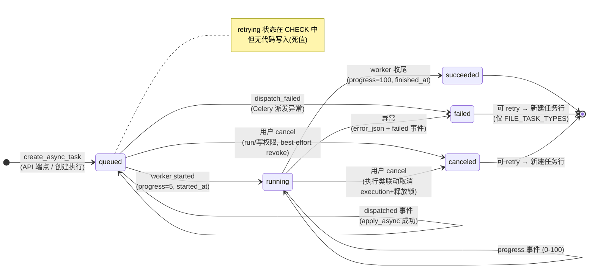
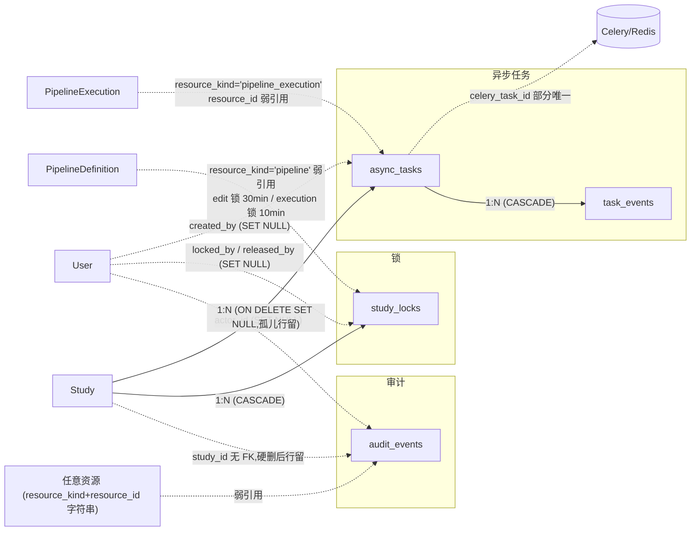

# 横切机制 · AuditEvent / StudyLock / AsyncTask

> 三件不属于任何单一业务对象、但贯穿「登录 → 研究项 → 导入 → 工作流 → 执行 → 输出」全主线的基础设施：**审计事件**（谁在什么时候对什么做了什么，留痕）、**研究项资源锁**（防两个人同时编辑、防同一工作流并发运行）、**异步任务**（把导入 / 执行 / 清理这类慢活儿丢给后台 Celery worker，并让前端能追进度）。横切（cross-cutting）＝不归哪个模块独有、被所有模块共用的机制。

## 1. 术语规范

| 中文名 | 业务名 | 代码类名 | 数据库表 | 前端主要文件 |
|---|---|---|---|---|
| 审计事件 | audit event | `AuditEvent` | `audit_events` | **无**（前端零引用） |
| 研究项资源锁 | study lock | `StudyLock` | `study_locks` | `api/pipelines.ts:160-165`（编辑锁三函数）、`views/PipelinePage.vue:4164-4196` |
| 异步任务 | async task | `AsyncTask` | `async_tasks` | `api/pipelines.ts:147-159`、执行进度条等 |
| 任务事件流 | task event | `TaskEvent` | `task_events` | 同上（SSE 流） |

**曾用名 / 废弃名（见到即改）**：

| 废弃名 | 曾指代 | 替代 | 备注 |
|---|---|---|---|
| `study_audit_events`（独立表） | 研究项级审计 | 并入通用 `audit_events`（snapshot 字段承接硬删快照） | 2026-05-24 合并（`models/study.py:78` 注释） |
| `lock_type='run'` | 运行锁 | `lock_type='execution'` | 历史 bug：run→execution 全栈改名时 CHECK 漏改，导致一段时间**所有运行 409**（acquire 时 CHECK 失败被伪装成锁冲突）；已修，并在 `services/study_locks.py:138-141` 留了"别把其它 IntegrityError 伪装成锁冲突"的教训注释（2026-06-05） |
| `run_artifact_cleanup` | 清理任务函数旧名 | `run_study_output_cleanup` | P2/P3 改名；曾有测试 import 旧名未跟（已修） |
| `result_json.celery_task_id`（执行表里塞 Celery id） | 任务关联 | `async_tasks.celery_task_id`（部分唯一索引） | 事实源已迁移，旧字段仅兼容展示 |

## 2. 功能定位与边界

**审计（audit_events）**：回答"出了事怎么追责 / 怎么复盘"。所有敏感动作（成员变更、挂载、执行创建/取消、输出保留/删除、研究项 purge……）写一行不可变事件；`study_id` **故意不设外键**（`models/study.py:89` 注释），研究项被硬删后审计行依然存在，`snapshot` 字段在硬删前抓实体快照。当前是**只写型**设施：没有任何查询 API、没有前端页面（§9 头号待讨论）。

**锁（study_locks）**：回答"两个人同时改一条工作流 / 同一工作流同时跑两次怎么办"。乐观协调用的**短期租约锁**（lease）：带 TTL（存活期限）自动过期，不怕持有者崩溃；数据库部分唯一索引兜底（同一资源同一锁型最多一把未释放的锁），应用层先查后插、撞索引再判一次。不负责行级数据一致性（那是事务的事），只负责"人级 / 任务级互斥"。

**异步任务（async_tasks + task_events）**：回答"慢活儿丢后台后，前端怎么知道跑到哪了"。`async_tasks` 是后台任务的**事实源**（状态、进度、入参、结果、错误），`task_events` 是只追加的事件流（创建/派发/启动/进度/成败），前端用轮询或 SSE（Server-Sent Events，服务器单向推送）追更。Celery 自己的状态不做事实源，DB 行才是——worker 通过 `record_task_event` 同步双写任务行与事件行。

## 3. 数据库

### 3.1 `audit_events`（`database/schema/02_studies.sql:69-81`）

| 字段 | 类型 | 约束 | 语义 |
|---|---|---|---|
| `id` | UUID | PK | — |
| `study_id` | CHAR(12) | **无 FK**（故意） | 所属研究项；硬删后行仍在 |
| `event_scope` | VARCHAR(64) | NOT NULL DEFAULT 'study' | 事件域（当前实际只用 study） |
| `action` | VARCHAR(128) | NOT NULL | 动作名，点分命名（见 §4 清单） |
| `actor_id` | UUID | FK→users **ON DELETE SET NULL** | 操作者；用户注销后匿名化 |
| `resource_kind` / `resource_id` | VARCHAR(64)/VARCHAR(128) | — | 资源类型 / id（字符串，容纳 UUID 或整数 id） |
| `resource_label` | VARCHAR(256) | — | 人类可读名（如 pipeline 名） |
| `snapshot` | JSONB | NOT NULL '{}' | 硬删除前的实体快照（如 `study.to_dict()`） |
| `metadata` | JSONB | NOT NULL '{}' | 动作上下文（ORM 属性名 `metadata_json`） |
| `occurred_at` | TIMESTAMP | NOT NULL DEFAULT NOW() | 发生时间 |

4 个查询索引（`02_studies.sql:143-146`）：`(study_id, occurred_at DESC)`、`(actor_id, occurred_at DESC)`、`(action, occurred_at DESC)`、`(resource_kind, resource_id, occurred_at DESC)`——为四种检索姿势预铺，但目前无消费方。

### 3.2 `study_locks`（`02_studies.sql:107-120`）

| 字段 | 类型 | 约束 | 语义 |
|---|---|---|---|
| `id` | UUID | PK | — |
| `study_id` | CHAR(12) | NOT NULL，FK→studies **CASCADE** | — |
| `resource_kind` | VARCHAR(64) | NOT NULL | 资源类型；**当前全代码只用 `'pipeline'`** |
| `resource_id` | VARCHAR(128) | NOT NULL | 资源 id（统一转字符串存） |
| `lock_type` | VARCHAR(32) | NOT NULL，CHECK 见下 | 锁类型 |
| `locked_by` | UUID | FK→users **SET NULL** | 持有者 |
| `locked_at` | TIMESTAMP | NOT NULL DEFAULT NOW() | 上锁时间 |
| `expires_at` | TIMESTAMP | NOT NULL | TTL 到期时间 |
| `released_at` / `released_by` | TIMESTAMP / UUID FK→users SET NULL | 可空 | 释放时间 / 释放者（NULL=活跃锁） |
| `metadata` | JSONB | NOT NULL '{}' | 上锁原因、续期/释放原因等（ORM 名 `metadata_json`） |

CHECK 原文（`02_studies.sql:112-113`）：

```sql
lock_type IN ('edit', 'execution')
```

**部分唯一索引**（`02_studies.sql:151-153`，核心防并发机制）：

```sql
CREATE UNIQUE INDEX uq_study_locks_active_resource
    ON study_locks(study_id, resource_kind, resource_id, lock_type)
    WHERE released_at IS NULL;
```

含义：同一研究项同一资源同一锁型，**最多一把未释放的锁**；已释放的历史锁行不受限、全部留存。另有 `(study_id, resource_kind, resource_id, lock_type)`、`(locked_by)`、`(expires_at) WHERE released_at IS NULL` 三个查询索引。

### 3.3 `async_tasks` / `task_events`（`database/schema/06_async.sql`）

`async_tasks`：

| 字段 | 类型 | 约束 | 语义 |
|---|---|---|---|
| `id` | UUID | PK | 任务 id（同时预填为 celery_task_id） |
| `celery_task_id` | VARCHAR(128) | 部分唯一 `WHERE celery_task_id IS NOT NULL` | Celery 侧 id |
| `task_type` | VARCHAR(64) | NOT NULL | 任务类型（见下） |
| `queue_name` | VARCHAR(128) | — | Celery 队列（统一 `CELERY_WORKFLOW_QUEUE`） |
| `status` | VARCHAR(32) | NOT NULL DEFAULT 'queued'，CHECK 见下 | 状态机 |
| `progress` | NUMERIC(5,2) | NOT NULL DEFAULT 0，CHECK 0–100 | 进度百分比 |
| `study_id` | CHAR(12) | FK→studies **ON DELETE SET NULL** | 研究项（删后任务行留、变孤儿） |
| `resource_kind` / `resource_id` | VARCHAR(64) NOT NULL / UUID | — | 关联资源（如 `pipeline_execution`） |
| `payload_json` / `result_json` / `error_json` | JSONB | NOT NULL '{}' | 入参 / 结果 / 错误 |
| `idempotency_key` | VARCHAR(128) | — | 幂等键（**字段在、无任何调用方写入**，§9） |
| `created_by` | UUID | FK→users SET NULL | 发起者 |
| `created_at` / `started_at` / `finished_at` | TIMESTAMP | — | 时间三件套 |
| `attempt` / `max_attempts` | INTEGER | NOT NULL DEFAULT 1 | 重试计数（当前重试=新建行，不递增） |

CHECK 原文（`06_async.sql:14-16`）：

```sql
status IN ('queued', 'running', 'succeeded', 'failed', 'canceled', 'retrying')
progress >= 0 AND progress <= 100
```

`task_events`：`task_id` FK→async_tasks **ON DELETE CASCADE**（删任务连带删事件流）、`event_type` NOT NULL、`status`（同上 CHECK 但可 NULL）、`progress`（可 NULL）、`message` TEXT、`payload_json`、`created_at`。

索引全集（`06_async.sql:54-61`）：

| 索引 | 列 / 条件 | 用途 |
|---|---|---|
| **`uq_async_tasks_celery_task_id`（UNIQUE）** | `(celery_task_id) WHERE celery_task_id IS NOT NULL` | 一行任务对一个 Celery 任务，worker 反查 |
| `idx_async_tasks_resource` | `(resource_kind, resource_id)` | 按资源找任务（如某执行的任务） |
| `idx_async_tasks_study_status` | `(study_id, status)` | 研究项任务列表过滤 |
| `idx_async_tasks_status_created` | `(status, created_at DESC)` | 全局按状态巡检 |
| `idx_async_tasks_created_by` | `(created_by)` | 按发起者 |
| `idx_task_events_task_created` | `(task_id, created_at)` | 事件增量拉取 / SSE 游标 |
| `idx_task_events_status` / `_type` | `(status)` / `(event_type)` | 事件筛选 |

**task_type 当前实际值**（全仓 grep）：`pipeline_execution`（工作流执行）、`study_output_cleanup`（输出软删清理）、`study_output_gc`（输出物理清盘，P5）、`dataset_import`（异步导入）、`raw_bids_build`、`canonical_fif_rebuild`。其中后五种构成 `FILE_TASK_TYPES`（`routers/pipelines.py:131`，可重试白名单）。

## 4. 后端

### 4.1 审计

- ORM：`models/study.py:77-100`（`AuditEvent`）。
- 写入服务：`services/audit_events.py:17-45` `record_audit_event(...)`（通用入口，唯一构造点）；`services/studies.py:192-211` `add_study_audit_event(...)`（study 域封装，固定 `snapshot=study.to_dict()`，用于软删/恢复/归档/purge 链路）。
- **metadata 结构示例**（输出保留动作，`routers/pipelines.py:591-622`）：`operation` / `previous`（改前 keep+deleted）/ `keep` / `deleted` / `reason` / `execution_id` / `blocked` / `dependencies`——每类动作各有自己的 metadata 字段集，**无统一 schema 校验**（只写无读的副作用之一，见 §9）。
- **写入点与 action 清单**（grep 全仓核对）：
  - 研究项：`study.created` / `study.settings.updated` / `study.member.upsert` / `study.member.updated` / `study.member.removed` / `study.purge_blocked` / `study.purge`（purge 带快照），以及软删/恢复/归档等动态 `audit_action`（`services/studies.py:284`）。
  - 数据集：`dataset_asset.created/updated/visibility_opened/member_granted/member_revoked/deleted`、`dataset_version.created/unpublished_created/published/withdraw_requested/withdrawn.notification_for_referrer/emergency_takedown/discarded`（withdraw 审批结果为动态 action）、`dataset.bootstrap.completed/qa.mock_run/qa.review/reuploaded`、`study.dataset_mount.created/updated/deactivated`。
  - 工作流：`pipeline.created/updated/deleted`、`pipeline.edit_lock.acquired/refreshed/released`。
  - 执行：`pipeline.execution.queued/canceled/retry_queued/retry_dispatch_failed/dispatch_failed/task_exception` + 终态动态 `pipeline.execution.{completed|failed|canceled|waiting_user_input}`（worker 收尾写，`tasks/pipeline_tasks.py:92-106`）。
  - 任务：`async_task.canceled` / `async_task.retry_queued`。
  - 输出：`study_output.retention` / `study_output.batch.retention`（被依赖挡下时追加 `.blocked` 后缀，`routers/pipelines.py:652-665`）。
- **读取**：无任何 GET 端点、无导出、无前端引用——只进不出（§9）。

### 4.2 锁

- ORM：`models/study.py:123-154`（`StudyLock`，含部分唯一索引声明）。
- 服务函数全集（`services/study_locks.py`）：

| 函数 | 行号 | 作用 |
|---|---|---|
| `release_expired_study_locks` | 34-64 | **惰性过期回收**：每次查锁前顺带把过期锁标 released（原因 `expired`），无独立后台扫描 |
| `find_active_study_lock` | 67-97 | 查活跃锁（先回收过期再查） |
| `acquire_study_lock` | 100-152 | 先查活跃→冲突抛 `StudyLockConflictError`；flush 撞唯一索引后**再查一次**区分"真锁冲突"与其它 IntegrityError（CHECK/外键失败不许伪装成锁冲突——2026-06-05 教训，行 138-141 注释） |
| `release_study_lock` / `_by_id` / `_for_resource` | 155-232 | 置 released_at/by + 原因（幂等） |
| `refresh_study_lock` | 174-191 | 续 TTL，metadata 记 refreshed_by/at |
| `force_release_stale_pipeline_execution_locks` | 235-318 | 三种 stale 判定：孤儿锁（无执行）/ 关联执行已结束 / 执行 running 超 10 分钟——最后一种顺手把卡死执行强制标 failed（错误码 `PIPELINE_EXECUTION_STALE_TIMEOUT`） |

- 常量：`DEFAULT_STUDY_LOCK_TTL_SECONDS = 10*60`（执行锁 10 分钟，行 22；注释解释从 24h 调短——worker 被 SIGKILL/OOM 后锁 10 分钟自然过期，用户不必等大半天）；`PIPELINE_EXECUTION_STALE_AFTER_SECONDS = 10*60`（行 25）。
- 编辑锁 TTL：`PIPELINE_EDIT_LOCK_TTL_SECONDS = 30*60`（30 分钟，`routers/pipelines.py:125`）；同持有者重复 acquire 自动转续期（`acquire_or_refresh_pipeline_edit_lock`，237-290）。
- **409 冲突载荷**（前端"谁锁着 / 何时过期"提示的数据来源）：
  - 编辑锁 `PIPELINE_EDIT_LOCKED`（`routers/pipelines.py:178-199`）：`message`「该工作流正在被其他用户编辑…」+ `lock_id` / `lock_type` / `locked_by` / `locked_at` / `expires_at`。
  - 运行锁 `PIPELINE_EXECUTION_LOCKED`（`_raise_pipeline_execution_locked`，3338-3356）：`message`「该工作流正在被运行…」+ 同上四个锁字段。
- 运行锁获取：创建执行时 `resource_kind='pipeline'`、`lock_type='execution'`（`routers/pipelines.py:3427-3469`）——首次冲突先尝试清 stale 锁再重试一次，并处理"重试间隙锁恰好被释放"的并发窗口；retry 执行同理（2571-2587）。释放：worker 正常/异常收尾（`tasks/pipeline_tasks.py:86-91、141-146`）、用户取消（1599-1604）。
- 研究项级运行互斥另有一层：`study_settings.run_policy.single_active_pipeline_run`（默认 true）在锁之前直接查活跃执行、命中 409 `STUDY_EXECUTION_ACTIVE`（3400-3425）——配置开关，不走锁表。

### 4.3 异步任务

- ORM：`models/study.py:705-767`（`AsyncTask` / `TaskEvent`，events 关系 `cascade="all, delete-orphan"`）。
- 服务：`services/async_tasks.py:19-58` `create_async_task`（预填 `celery_task_id=str(task_id)`、写 `created` 事件）；`services/task_events.py:63-95` `record_task_event`（**唯一状态写入口**：status 驱动 `started_at`（running/retrying 首次）与 `finished_at`（succeeded/failed/canceled 终态），progress 截断到 0–100，同步追加事件行）。
- 派发：`routers/pipelines.py:1384-1444` `create_and_dispatch_file_task`（建行→flush→`apply_async(task_id=行id)`→写 `dispatched` 事件；派发失败写 `dispatch_failed` + status=failed）。datasets 路由有同名兄弟函数（`routers/datasets.py:432`）。
- worker：`tasks/file_tasks.py:28-103` `run_file_task`（按 task_type 分发到 cleanup/gc/raw_bids/canonical_fif/dataset_import 五个实现；started→succeeded/failed 全程 record_task_event）；`tasks/pipeline_tasks.py:45-169` `run_pipeline_task`（执行类任务）。
- **执行状态 → 任务状态映射**（`services/task_events.py:53-60`，两套状态机不等价、按此换算）：

| PipelineExecution.status | AsyncTask.status | 说明 |
|---|---|---|
| `completed` | `succeeded` | 正常跑完 |
| `waiting_user_input` | `succeeded` | 交互节点暂停**也算任务成功**（任务=「跑到需要人为止」） |
| `failed` | `failed` | error_json 同步拷贝到任务行 |
| `canceled` | `canceled` | — |
| 其它（queued/running） | `running` | — |

- **SSE 协议细节**（`routers/pipelines.py:758-845`）：事件名 `ready`（开流，带 retry 重连提示）/ `task_event`（正文＝TaskEventResponse JSON，`id:` 行＝task_events.id 作断点游标）/ `heartbeat`（≥15s 无事件时保活）/ `stream_closed`（`reason=task_not_found|max_seconds`）；单连接最长 300s，到时主动关流，客户端凭 `Last-Event-ID` 重连续传。
- beat 定时：`tasks/celery_app.py:46-53` `storage-maintenance-daily`（24h 一次全局 cleanup+GC）；走 `_MaintenanceTask` 轻量壳（`file_tasks.py:273-279`），**不落 async_tasks 行**（全局维护无 study 上下文）。
- 端点常量（`routers/pipelines.py:126-135`）：`RUN_CANCELABLE_STATUSES={queued,running,waiting_user_input}`、`TASK_CANCELABLE_STATUSES={queued,running,retrying}`、`TASK_RETRYABLE_STATUSES={failed,canceled}`、SSE 参数 poll 1s / heartbeat 15s / 最长 300s。

**端点清单**（`routers/pipelines.py`，权限已亲自核对）：

| 方法 | 路径 | 权限 | 作用 |
|---|---|---|---|
| GET | `/studies/{study_id}/tasks` | 读 | 任务列表（status/resource_kind 过滤、include_events、limit≤200）（行 1470） |
| GET | `/studies/{study_id}/tasks/{task_id}` | 读 | 单任务 + 全事件（行 1501） |
| GET | `/studies/{study_id}/tasks/{task_id}/events` | 读 | 事件增量拉取（`since`=事件 id 或 ISO 时间游标）（行 1519） |
| GET | `/studies/{study_id}/tasks/{task_id}/events/stream` | 读 | SSE 推送（支持 `Last-Event-ID` 断点续传，单连接最长 300s 后需重连）（行 1533） |
| POST | `/studies/{study_id}/tasks/{task_id}/cancel` | 执行类任务→**run**；其它→**写** | 取消；执行类联动取消 execution + 释放运行锁 + 审计（行 1567） |
| POST | `/studies/{study_id}/tasks/{task_id}/retry` | 执行类→**run**（转发 retry_pipeline_execution）；文件类→**写** | 重试＝**新建任务行**（payload 记 `retry_of_task_id`）；仅 `FILE_TASK_TYPES` 可重试（行 1694） |
| POST | `/studies/{study_id}/pipelines/{pipeline_id}/edit-lock` | 写 | 获取/续期编辑锁（30min TTL）+ 审计（行 1872） |
| POST | `/studies/{study_id}/pipelines/{pipeline_id}/edit-lock/refresh` | 写 | 续期（非持有者 409；无锁 404）（行 1908） |
| DELETE | `/studies/{study_id}/pipelines/{pipeline_id}/edit-lock` | 写 | 释放（非持有者 409；幂等）（行 1958） |

（运行锁没有独立端点——随创建执行 `POST /studies/{id}/pipelines/{pid}/executions` 隐式获取，随 worker 收尾 / 取消隐式释放。）

另有两个能力发现端点把上述常量暴露给前端：任务取消 / 重试的 409 详情里附 `cancelable_statuses` / `retryable_statuses` / `supported_task_types`（`routers/pipelines.py:855-876`），前端据此决定按钮可用性，不必硬编码状态集合。

## 5. 前端

- **审计**：无路由、无组件、无 API 函数（全前端 grep `audit` 零命中）。
- **锁**：`api/pipelines.ts:160-165` `acquireEditLock` / `refreshEditLock` / `releaseEditLock`；`views/PipelinePage.vue:4164-4196` 在进入编辑时获取、定时心跳续期、离开释放；锁被他人持有时 409 详情含持有者与到期时间，用于"正在被 XX 编辑"提示。运行锁对前端不可见，只表现为创建执行时的 409。
- **异步任务**：`api/pipelines.ts:147-159` `getTask` / `listTaskEvents` / `taskEventsStreamUrl`（拼 SSE URL）/ `cancelTask` / `retryTask`；执行页 / 导入向导用 SSE+轮询双轨追进度。当前 UI 形态：任务进度条 + 事件时间线 + 取消/重试按钮（无独立"任务中心"页，散在各业务页）。
- 触发后台任务的前端入口：结果页「清理缓存 / 临时数据」（`cleanupStudyOutputs`）、数据页异步导入向导（`dataset_import`）、工作流页运行按钮（`pipeline_execution`）。**GC 端点无前端函数**（见 06 档案 §5）。

## 6. 生命周期

**AsyncTask 状态机**（CHECK 六值；`retrying` 在约束里但代码从不写入——重试走新行）：



**StudyLock 生命线**（不是状态机，是租约）：`acquire`（活跃唯一索引兜底）→ 持有期间可 `refresh` 续 TTL → 三种结局：显式 `release`（用户/worker/取消）、**TTL 过期被惰性回收**（下次有人查锁时标记 released，原因 `expired`）、stale 强制释放（孤儿/执行已结束/执行超时,顺带把卡死执行标 failed）。已释放行永留作历史。

**AuditEvent**：只追加、不更新、不删除，无状态机；研究项硬删时其它表 CASCADE 清空、审计行因无 FK 而幸存，靠 `snapshot` 自带上下文。

时间字段不变式：AsyncTask 的 `started_at` 只在首次进 running/retrying 时置一次、`finished_at` 只在首次进终态时置一次（`record_task_event`，`services/task_events.py:76-81`）；StudyLock 的 `released_at IS NULL` 即"活跃"判定（配合 `expires_at > now`），释放后行不复用。

**谁能触发**：审计＝系统自动（随业务动作）；编辑锁＝可写成员；运行锁＝可运行成员（隐式）；任务创建＝各业务端点（写/运行权限）；任务取消/重试＝run（执行类）或写（文件类）；beat 维护＝无人（定时）。

**取消的弱保证**：cancel 是 best-effort（尽力而为）——先 `revoke` Celery 任务再把 DB 行标 canceled；worker 若已跑过头，DB 行与实际执行可能短暂不一致，靠 worker 收尾时 `task.status == "canceled"` 的短路检查兜底（`file_tasks.py:38-39`）。

**终态说明**：三张表（audit_events、已释放 study_locks、终态 async_tasks/task_events）**都无 TTL、无归档、无清理任务**——与 study_outputs 有 cleanup+GC 形成对比（§9）。

## 7. 行为清单

| 操作 | 端点 / 入口 | 谁能做 | 关键副作用 / 约束 |
|---|---|---|---|
| 写审计 | `record_audit_event` / `add_study_audit_event`（约 50 种 action） | 系统 | 随业务事务提交；study purge 前先写快照（purge 被下游依赖挡时写 `study.purge_blocked`） |
| 查审计 | **不存在** | — | §9 头号待讨论 |
| 获取编辑锁 | POST `.../pipelines/{pid}/edit-lock` | 可写成员 | TTL 30min；同持有者→续期；他人持有→409 含持有者信息；写审计 acquired/refreshed |
| 心跳续期 / 释放编辑锁 | POST `.../edit-lock/refresh`、DELETE `.../edit-lock` | 持有者（写权限） | 非持有者 409；释放幂等；写审计 |
| 获取运行锁 | 创建执行（隐式） | 可运行成员 | `single_active_pipeline_run` 研究项级互斥在前；冲突先清 stale 锁重试一次；锁 id 写进 execution.result_json |
| 释放运行锁 | worker 收尾 / 取消 / TTL 过期 / stale 强制释放 | 系统 | stale 路径会把超时执行强制标 failed（`PIPELINE_EXECUTION_STALE_TIMEOUT`） |
| 创建后台任务 | cleanup / gc / 导入 / 执行等端点 | 写或运行成员 | 建行 + created/dispatched 事件；派发失败行标 failed 不抛 500 |
| 追进度 | GET tasks / events / events/stream | 可读成员 | SSE 单连接 ≤300s，断线用 `Last-Event-ID` 续传 |
| 取消任务 | POST `.../tasks/{id}/cancel` | run（执行类）/ 写（其它） | best-effort revoke Celery；执行类联动取消 execution、释放锁、写两类审计 |
| 重试任务 | POST `.../tasks/{id}/retry` | run（执行类）/ 写（文件类） | 新建任务行（非复用）；仅 failed/canceled 可重试；非 FILE_TASK_TYPES 文件任务 409 |
| 每日维护 | celery beat `storage-maintenance-daily` | 无人（定时） | 全局 cleanup+GC；**不落 async_tasks 行**，只有 celery 日志可查（P5，未云端验证） |

## 8. 与其他元素的关系



- **audit_events ↔ 一切**：`(resource_kind, resource_id)` 字符串弱引用任意资源，0 外键级联（除 actor SET NULL）——审计行的生存独立于被审计对象。
- **study_locks N—1 Study**（CASCADE）：研究项删则锁史删；对 pipeline 是弱引用（resource_id 存字符串化的 pipeline id），pipeline 删除不清锁行（靠 TTL/stale 兜底）。
- **async_tasks N—1 Study**（SET NULL）：研究项删后任务行变孤儿——而所有任务端点都按 `study_id` 过滤，孤儿行从此 API 不可达（§9）。
- **task_events N—1 async_tasks**（CASCADE）：事件流随任务行删除——但目前没有删任务行的路径，所以事实上也永存。
- **async_tasks ↔ Celery**：`celery_task_id` 部分唯一索引保证一行对一个 Celery 任务；任务 id 预填使两者同值，worker 端 `find_async_task_by_celery_id` 双向兜底。

## 9. 待讨论

1. **审计只写无读（头号）**。现状：约 50 种 action 持续写入、4 个查询索引就位，但全仓无任何 GET/导出 API、前端零引用（grep 验证）。为什么是问题：留痕的价值在"能查"；现在出事只能上数据库 psql 手查，对非全栈成员等于没有；写入的 metadata 结构也因无消费方而无人校验漂移。可选方向：a) 最小可用——`GET /studies/{id}/audit-events`（owner/admin only，按 action/actor/时间过滤）；b) 研究项设置页加"操作历史"tab；c) 明文接受"调试期只写、psql 查"。
2. **三类日志型数据无限增长**。现状：`async_tasks`+`task_events`（每次执行 ≥4 事件行）、`audit_events`、`pipeline_jobs.log_tail`（TEXT，`04_pipelines.sql:79`）全部无 TTL、无归档、无清理；对比 study_outputs 刚做完 cleanup+GC。为什么是问题：调试期每次重建无感，上线后是确定性的慢性膨胀（尤其 task_events 与 SSE 轮询配套高频写）。可选方向：beat 维护任务里加"终态任务 N 天后删行（事件 CASCADE）+ 审计按年归档"，或至少在 wiki 把"无清理"标成已知决策。
3. **`idempotency_key` 无人使用**。现状：字段、schema、序列化全链路就位，但 `create_async_task` 的该形参没有任何调用方传值（grep 验证），也无唯一约束/查重逻辑。为什么是问题：幂等（同一请求重发不重复执行）是异步接口防双击/重试风暴的关键，现在是装饰品。方向：在 dataset_import / cleanup 等入口生成 key 并查重，或删字段。
4. **`retrying` 是死状态**。现状：CHECK 与 TaskStatus Literal 都含 `retrying`，`record_task_event` 也准备好处理它，但无代码写入——重试语义已改为"新建任务行 + attempt 恒 1"。方向：从 CHECK/类型里删掉，或改造 retry 复用原行并递增 attempt（与 `max_attempts` 字段呼应）。
5. **beat 维护任务不可观测**。现状：`run_storage_maintenance` 绕过 async_tasks（`_MaintenanceTask` 壳），成败只在 celery 日志。为什么是问题：用户/前端无从知道"昨晚的自动清理跑没跑、清了多少"；P5 又恰恰未云端验证。方向：给全局维护落一个 `study_id=NULL` 的任务行（需放宽端点的按 study 过滤），或接受"运维看日志"。
6. **孤儿任务行 API 不可达**。现状：`async_tasks.study_id` ON DELETE SET NULL 保行，但所有任务端点按 study_id 过滤（`get_async_task_or_404`，`routers/pipelines.py:690-694`），研究项删后这些行永远查不到。方向：要么改 CASCADE（任务史随研究项走，审计仍留痕），要么提供 admin 级全局任务查询。
7. **锁的通用设计 vs 单一用途**。现状：表设计支持任意 `resource_kind`，实际只有 `'pipeline'` 一种、两种 lock_type；历史上 run→execution 改名时 CHECK 漏改曾导致全部运行 409（已修）。为什么是问题：通用字段+CHECK 枚举的组合意味着每加一种锁型都要动 DDL，且改名事故已发生过一次。方向：保持现状但在 wiki 写明"加锁型必须同步改 CHECK"；或把 lock_type 的 CHECK 放宽为应用层校验。
8. **编辑锁权限粒度**。现状：acquire/refresh/release 均只要求 `can_write`，release 还会在"无活跃锁"时静默成功；锁冲突 409 暴露持有者 id 与到期时间。问题很小，但"任何可写成员都能等他人锁过期后立刻抢锁"没有提示机制（如锁到期前的接管协商）。方向：维持现状（TTL 30min 足够短），仅记录为已知行为。

## 10. 大模型画图提示词

请画一张「ELYS 平台 横切机制（审计 / 锁 / 异步任务）元素全景图」，读者是新接手的开发者，目标是一页看懂三件贯穿全主线的基础设施。中文标签，代码名（表/字段/端点）用等宽字体，状态机用带箭头流转图，待讨论项用 ⚠ 警示标记。画布分七区：①**定位与术语**（顶部横条）：三件套一句话——审计 `audit_events`＝所有敏感动作的不可变留痕（只写、无读 API）；锁 `study_locks`＝带 TTL 的租约锁防并发编辑/运行；异步任务 `async_tasks`+`task_events`＝后台慢活的事实源+事件流；曾用名标废弃：`study_audit_events`（已并入 audit_events）、`lock_type='run'`（已改 `execution`，曾因 CHECK 漏改致全部运行 409）。②**核心数据结构**（左列三框）：audit_events（`study_id` 无外键故意保硬删后留痕、`action`、`actor_id` SET NULL、`resource_kind/id` 字符串弱引用、`snapshot` JSONB 硬删快照、4 个查询索引 study/actor/action/resource×时间）；study_locks（`lock_type` CHECK `edit/execution`、`expires_at` TTL、`released_at/by`、部分唯一索引 `uq_study_locks_active_resource(study_id,resource_kind,resource_id,lock_type) WHERE released_at IS NULL`＝同资源同锁型最多一把活跃锁）；async_tasks（`status` CHECK `queued/running/succeeded/failed/canceled/retrying`、`progress` 0–100、`celery_task_id` 部分唯一、`idempotency_key` ⚠无人写入、`study_id` ON DELETE SET NULL）+ task_events（`task_id` CASCADE、事件类型 created/dispatched/started/progress/succeeded/failed/canceled）。③**AsyncTask 状态机**（中央）：queued →(dispatched)→ queued →(worker started, progress=5)→ running →(progress 0-100)→ succeeded(100)/failed/canceled；queued→failed(dispatch_failed)；queued/running→canceled(用户取消,执行类联动取消 execution+释放锁)；failed/canceled→retry＝**新建任务行**（仅文件类白名单 `study_output_cleanup/study_output_gc/dataset_import/raw_bids_build/canonical_fif_rebuild`）；⚠`retrying` 在 CHECK 里但代码从不写。④**锁生命线**（中下）：acquire（编辑锁 TTL 30 分钟 / 运行锁 10 分钟）→ refresh 心跳续期 → 三种结局：显式 release / TTL 过期惰性回收（下次查询时标记） / stale 强制释放（孤儿锁、执行已结束、执行超 10 分钟卡死则连执行一起标 failed）；运行锁随「创建执行」隐式获取、随 worker 收尾隐式释放，前置还有研究项级 `single_active_pipeline_run` 互斥。⑤**关键端点**（右列）：任务——`GET /studies/{id}/tasks`、`GET .../tasks/{tid}`、`GET .../tasks/{tid}/events`（since 游标）、`GET .../tasks/{tid}/events/stream`（SSE，单连接≤300s，Last-Event-ID 续传）、`POST .../tasks/{tid}/cancel`、`POST .../tasks/{tid}/retry`；编辑锁——`POST/POST refresh/DELETE /studies/{id}/pipelines/{pid}/edit-lock`；审计——⚠无任何读端点；beat 定时 `storage-maintenance-daily` 每日全局清理+GC ⚠不落任务行仅 celery 日志。⑥**权限规则**（右下）：任务读=成员 can_read；取消/重试=执行类任务要 can_run、文件类要 can_write；编辑锁三端点=can_write（owner/admin 直通）；审计写=系统自动随业务事务。⑦**关系与基数**（底部）：audit_events—User SET NULL、与 Study 无 FK；study_locks—Study CASCADE、resource 弱引用（现仅 `pipeline` 一种 kind）；async_tasks—Study SET NULL（⚠研究项删后孤儿行 API 不可达）—task_events CASCADE—Celery/Redis 经 celery_task_id 一对一。⑧**待讨论横条**（最底，全部 ⚠）：审计只写无读；async_tasks/task_events/audit_events/pipeline_jobs.log_tail 四类日志无 TTL 无清理无限增长；idempotency_key 死字段；retrying 死状态；beat 维护不可观测。风格：三件套用三种浅底色分区，状态机箭头加粗，⚠橙红色，横向 16:9。

---

**相关 wiki 页**（P1 事实源）：

- `wiki/docs/2-60-任务队列与异步架构.md` —— async_tasks / task_events 全景、SSE 协议、Execution 与 Task 状态不等价说明
- `wiki/docs/7-40-工作流执行与后台任务.md` —— worker 视角的锁获取/释放时序图
- `wiki/docs/7-30-后端分层与数据契约.md` —— audit / lock / task 三服务的分层位置
- `wiki/docs/3-30-Study与Pipeline表.md` —— 表结构对照（注意该页当前未含 locks/audit 细节，schema 以 `02_studies.sql` 为准）
- `wiki/docs/9-02-2026年6月.md` —— P5 GC beat 接入、`run→execution` CHECK 踩坑等带日期记录

*事实源：工作区代码（分支 feat/save-retention-fe）`database/schema/{02_studies,06_async}.sql`、`backend/app/{models/study.py, services/{audit_events,study_locks,async_tasks,task_events}.py, routers/pipelines.py, tasks/{celery_app,file_tasks,pipeline_tasks}.py}` + wiki 2-60 / 7-40 / 9-02；编写日期 2026-06-10。*
